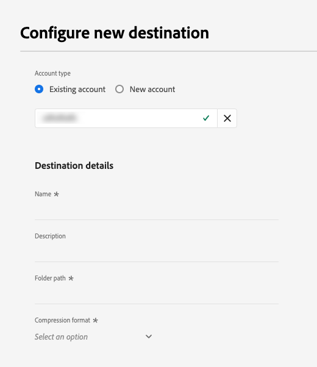

# [!DNL LiveRamp - Onboarding] 接続 {#liveramp-onboarding}

[!DNL LiveRamp - Onboarding] 接続を使用して、Adobe Real-time Customer Data Platform から [!DNL LiveRamp Connect] にオーディエンスをオンボーディングします。

## ユースケース {#use-cases}

[!DNL LiveRamp - Onboarding] 宛先を使用する方法とタイミングを理解しやすくするために、Adobe Experience Platform のお客様がこの宛先を使用して解決できるユースケースのサンプルを以下に示します。

マーケターは、[!DNL Ramp ID] 識別子を使用してモバイル、オープン web、ソーシャルおよび [!DNL CTV] プラットフォームのユーザーをターゲットにできるように、Adobe Experience Platform からオーディエンスを送信して [!DNL LiveRamp Connect] に ID をオンボーディングしたいと考えています。

## 前提条件 {#prerequisites}

[!DNL LiveRamp - Onboarding] 接続では、[LiveRamp の SFTP](https://docs.liveramp.com/connect/en/upload-a-file-via-liveramp-s-sftp.html) ストレージを使用してファイルを書き出します。

Experience Platform から [!DNL LiveRamp - Onboarding] にデータを送信するには、まず [!DNL LiveRamp] 資格情報が必要です。資格情報がまだない場合は、[!DNL LiveRamp] の担当者に連絡して資格情報を取得してください。

## サポートされている ID {#supported-identities}

[!DNL LiveRamp - Onboarding] では、公式の [LiveRamp ドキュメント](https://docs.liveramp.com/connect/en/identity-and-identifier-terms-and-concepts.html#known-identifiers)に記載されている、PII ベースの識別子、既知の識別子、カスタム ID などの ID のアクティブ化をサポートしています。

アクティブ化ワークフローの[マッピングステップ](#map)では、ターゲットマッピングをカスタム属性として定義する必要があります。

## サポートされるオーディエンス {#supported-audiences}

この節では、この宛先に書き出すことができるオーディエンスのタイプについて説明します。

| オーディエンスの起源 | サポートあり | 説明 |
---------|----------|----------|
| [!DNL Segmentation Service] | ✓ | Experience Platform [セグメント化サービス](../../../segmentation/home.md). |
| カスタムアップロード | ✓ | CSV ファイルから Experience Platform に[読み込まれた](../../../segmentation/ui/overview.md#import-audience)オーディエンス。 |

{style="table-layout:auto"}

## 書き出しのタイプと頻度 {#export-type-frequency}

宛先の書き出しのタイプと頻度について詳しくは、以下の表を参照してください。

| 項目 | タイプ | メモ |
---------|----------|---------|
| 書き出しタイプ | **[!UICONTROL オーディエンスの書き出し]** | [!DNL LiveRamp - Onboarding] 宛先で使用される識別子（氏名、電話番号など）を使用して、オーディエンスのすべてのメンバーを書き出します。 |
| 書き出し頻度 | **[!UICONTROL 日別バッチ]** | オーディエンス評価に基づいて Experience Platform でプロファイルを更新すると、プロファイル（ID）は 1 日 1 回ダウンストリームの宛先プラットフォームで更新されます。詳しくは、[バッチ（ファイルベース）宛先](/help/destinations/destination-types.md#file-based)を参照してください。 |

{style="table-layout:auto"}

## 宛先への接続 {#connect}

>[!IMPORTANT]
> 
>宛先に接続するには、**[!UICONTROL 宛先の管理]** [アクセス制御権限](/help/access-control/home.md#permissions)が必要です。詳しくは、[アクセス制御の概要](/help/access-control/ui/overview.md)または製品管理者に問い合わせて、必要な権限を取得してください。

この宛先に接続するには、[宛先設定のチュートリアル](../../ui/connect-destination.md)の手順に従ってください。宛先の設定ワークフローで、以下の 2 つのセクションにリストされているフィールドに入力します。

### 宛先に対する認証 {#authenticate}

宛先に対して認証するには、必須フィールドに入力し、「**[!UICONTROL 宛先に接続]**」を選択します。

**パスワードを使用した SFTP 認証** {#sftp-password}


* **[!UICONTROL ユーザー名]**：[!DNL LiveRamp - Onboarding] ストレージの場所のユーザー名。
* **[!UICONTROL パスワード]**：[!DNL LiveRamp - Onboarding] ストレージの場所のパスワード。
* **[!UICONTROL PGP／GPG 暗号化キー]**：必要に応じて、RSA 形式の公開鍵を添付して、書き出したファイルに暗号化を追加できます。正しい形式の暗号化キーの例については、以下の画像を参照してください。
  
* **[!UICONTROL サブキー ID]**：暗号化キーを指定する場合は、暗号化&#x200B;**[!UICONTROL サブキー ID]** も指定する必要があります。サブキー ID の取得方法については、[!DNL LiveRamp] [暗号化ドキュメント](https://docs.liveramp.com/connect/en/encrypting-files-for-uploading.html#downloading-the-current-encryption-key)を参照してください。

**SSH キー認証を使用した SFTP** {#sftp-ssh}


* **[!UICONTROL ユーザー名]**：[!DNL LiveRamp - Onboarding] ストレージの場所のユーザー名。
* **[!UICONTROL SSH キー]**：[!DNL LiveRamp - Onboarding] ストレージの場所へのログインに使用する [!DNL SSH] 秘密鍵。この秘密鍵は、[!DNL Base64] でエンコードされた文字列の形式にする必要があり、パスワードで保護しないでください。

   * [!DNL SSH] キーを [!DNL LiveRamp - Onboarding] サーバーに接続するには、[!DNL LiveRamp] のテクニカルサポートポータルを通じてチケットを送信し、公開鍵を入力する必要があります。詳しくは、[LiveRamp ドキュメント](https://docs.liveramp.com/connect/en/upload-a-file-via-liveramp-s-sftp.html#upload-with-an-sftp-client)を参照してください。

* **[!UICONTROL PGP／GPG 暗号化キー]**：必要に応じて、RSA 形式の公開鍵を添付して、書き出したファイルに暗号化を追加できます。正しい形式の暗号化キーの例については、以下の画像を参照してください。
  
* **[!UICONTROL サブキー ID]**：暗号化キーを指定する場合は、暗号化&#x200B;**[!UICONTROL サブキー ID]** も指定する必要があります。サブキー ID の取得方法については、[!DNL LiveRamp] [暗号化ドキュメント](https://docs.liveramp.com/connect/en/encrypting-files-for-uploading.html#downloading-the-current-encryption-key)を参照してください。

### 宛先の詳細の入力 {#destination-details}

>[!CONTEXTUALHELP]
>id="platform_destinations_liveramp_subkey"
>title="暗号化サブキー ID"
>abstract="LiveRamp 公開暗号化キーに基づく、暗号化に使用するサブキー ID。認証手順で暗号化キーを入力した場合、このフィールドは必須です。"
>additional-url="https://docs.liveramp.com/connect/en/encrypting-files-for-uploading.html#downloading-the-current-encryption-key" text="サブキー ID の取得方法を説明します"

宛先の詳細を設定するには、以下の必須フィールドとオプションフィールドに入力します。UI のフィールドの横のアスタリスクは、そのフィールドが必須であることを示します。



* **[!UICONTROL 名前]**：今後この宛先を認識するための名前。
* **[!UICONTROL 説明]**：今後この宛先を識別するのに役立つ説明。
* **[!UICONTROL フォルダーパス]**：書き出したファイルをホストする [!DNL LiveRamp] `uploads` サブフォルダーへのパス。`uploads` プレフィックスがフォルダーパスに自動的に追加されます。[!DNL LiveRamp] では、他の既存のフィードとは別にファイルを保存し、すべての自動処理がスムーズに実行されるように、Adobe Real-Time CDP からの配信専用のサブフォルダーを作成することをお勧めします。
   * 例えば、ファイルを `uploads/my_export_folder` に書き出す場合は、「**[!UICONTROL フォルダーパス]**」フィールドに `my_export_folder` と入力します。
* **[!UICONTROL 圧縮形式]**：書き出したファイルに Experience Platform で使用する圧縮タイプを選択します。使用可能なオプションは、**[!UICONTROL GZIP]** または&#x200B;**[!UICONTROL なし]**&#x200B;です。

### アラートの有効化 {#enable-alerts}

アラートを有効にすると、宛先へのデータフローのステータスに関する通知を受け取ることができます。リストからアラートを選択して、データフローのステータスに関する通知を受け取るよう登録します。アラートについて詳しくは、[UI を使用した宛先アラートの購読](../../ui/alerts.md)に関するガイドを参照してください。

宛先接続の詳細の入力を終えたら「**[!UICONTROL 次へ]**」を選択します。

## この宛先に対してオーディエンスをアクティブ化 {#activate}

>[!IMPORTANT]
> 
>データをアクティブ化するには、**[!UICONTROL 宛先の管理]**、**[!UICONTROL 宛先のアクティブ化]**、**[!UICONTROL プロファイルの表示]**&#x200B;および&#x200B;**[!UICONTROL セグメントの表示]** [に対するアクセス制御権限](/help/access-control/home.md#permissions)が必要です。詳しくは、[アクセス制御の概要](/help/access-control/ui/overview.md)または製品管理者に問い合わせて、必要な権限を取得してください。

この宛先に対してオーディエンスをアクティブ化する手順については、[バッチプロファイル書き出し宛先に対するオーディエンスデータのアクティブ化](/help/destinations/ui/activate-batch-profile-destinations.md)を参照してください。

### スケジュール設定 {#scheduling}

[!UICONTROL スケジュール設定]ステップでは、以下に示す設定で各オーディエンスの書き出しスケジュールを作成します。

* **[!UICONTROL ファイル書き出しオプション]**：[!UICONTROL 完全ファイルを書き出し]。[増分ファイル書き出し](../../ui/activate-batch-profile-destinations.md#export-incremental-files)は現在、[!DNL LiveRamp] 宛先ではサポートされていません。
* **[!UICONTROL 頻度]**：[!UICONTROL 毎日]
* **[!UICONTROL 日付]**：希望する書き出し開始時刻および終了時刻を選択します。


書き出すファイルの名前は現在、ユーザーが設定することはできません。[!DNL LiveRamp - Onboarding] 宛先に書き出すすべてのファイルは、次のテンプレートに基づいて自動的に名前が付けられます。

`%ORGANIZATION_NAME%_%DESTINATION%_%DESTINATION_INSTANCE_ID%_%DATETIME%`


例えば、[!DNL Luma] という名前の組織の場合、書き出すファイルの名前は次のようになります。

```json
Luma_LiveRamp_52137231-4a99-442d-804c-39a09ddd005d_20230330_153857.csv
```

### 属性と ID のマッピング {#map}

**[!UICONTROL マッピング]**&#x200B;ステップでは、書き出すプロファイル属性および ID を選択できます。

>[!IMPORTANT]
>
>この宛先では、アクティブ化フローごとに 1 つのソース ID 名前空間のアクティブ化をサポートしています。`Email` や `Phone` など、複数の ID 名前空間を書き出す必要がある場合は、ID ごとに[個別のアクティブ化フローを作成](../../ui/activate-batch-profile-destinations.md)する必要があります。

**[!UICONTROL マッピング]**&#x200B;ステップでは、書き出された CSV ファイルの列ヘッダーの名前が&#x200B;**[!UICONTROL ターゲットフィールド]**&#x200B;マッピングで定義されます。**[!UICONTROL ターゲットフィールド]**&#x200B;のカスタム名を指定することで、書き出すファイルの CSV 列ヘッダーを任意のわかりやすい名前に変更できます。

>[!IMPORTANT]
>
>[!DNL LiveRamp] への初回のファイル配信後にターゲットフィールドに変更が加えられた場合は、[!DNL LiveRamp] アカウントチームに通知するか、[LiveRamp サポートにチケットを送信](https://docs.liveramp.com/connect/en/considerations-when-uploading-the-first-file-to-an-audience.html#creating-a-support-case)して、変更が自動処理プロセスに確実に反映されるようにしてください。

1. **[!UICONTROL マッピング]**&#x200B;手順で、「**[!UICONTROL 新しいマッピングを追加]**」を選択します。画面に新しいマッピング行が表示されます。

   

2. **[!UICONTROL ソースフィールドを選択]**&#x200B;ウィンドウで、**[!UICONTROL 属性を選択]**&#x200B;カテゴリを選択し、マッピングする XDM 属性を選択するか、**[!UICONTROL ID 名前空間を選択]**&#x200B;カテゴリを選択して、宛先にマッピングする ID を選択します。

   

3. **[!UICONTROL ターゲットフィールドを選択]**&#x200B;ウィンドウで、選択したソースフィールドのマッピング先となる属性名を入力します。ここで定義した属性名が、書き出された CSV ファイルに列ヘッダーとして反映されます。

   

   また、**[!UICONTROL ターゲットフィールド]**&#x200B;に直接入力して属性名を入力することもできます。

   

必要なマッピングをすべて追加したら、「**[!UICONTROL 次へ]**」を選択してアクティブ化ワークフローを終了します。

## 書き出されたデータ／データ書き出しの検証 {#exported-data}

データは、設定した [!DNL LiveRamp - Onboarding] ストレージの場所に CSV ファイルとして書き出されます。

ファイルを [!DNL LiveRamp - Onboarding] 宛先に書き出す場合、Platform では[結合ポリシー ID](../../../profile/merge-policies/overview.md) ごとに 1 つの CSV ファイルを生成します。

例えば、次のオーディエンスについて考えてみます。

* オーディエンス A（結合ポリシー 1）
* オーディエンス B（結合ポリシー 2）
* オーディエンス C（結合ポリシー 1）
* オーディエンス D（結合ポリシー 1）

Platform では、次の 2 つの CSV ファイルを [!DNL LiveRamp - Onboarding] に書き出します。

* オーディエンス A、C および D を含んだ 1 つの CSV ファイル。
* オーディエンス B を含んだ 1 つの CSV ファイル。

書き出される CSV ファイルには、次の例に示すように、選択した属性とそれに対応するオーディエンスステータスを持つプロファイルが別々の列に含まれ、属性名と `audience_namespace:audience_ID` ペアが列ヘッダーとして含まれます。

`ATTRIBUTE_NAME, AUDIENCE_NAMESPACE_1_AUDIENCE_ID_1, AUDIENCE_NAMESPACE_2_AUDIENCE_ID_2,..., AUDIENCE_NAMESPACE_X_AUDIENCE_ID_X`

書き出されたファイルに含まれているプロファイルは、次のオーディエンス選定ステータスのいずれかと一致する可能性があります。

* `Active`：プロファイルは現在、オーディエンスに対して選定されています。
* `Expired`：プロファイルはオーディエンスに対して選定されなくなりましたが、過去に選定されたことがあります。
* `""`（空の文字列）：プロファイルはオーディエンスに対して選定されたことはありません。

例えば、書き出された CSV ファイルに、1 つの `email` 属性、Experience Platform [セグメント化サービス](../../../segmentation/home.md)から生成された 2 つのオーディエンスおよび[読み込まれた](../../../segmentation/ui/overview.md#importing-an-audience) 1 つの外部オーディエンスが含まれている場合は、次のようになります。

```csv
email,ups_aa2e3d98-974b-4f8b-9507-59f65b6442df,ups_45d4e762-6e57-4f2f-a3e0-2d1893bcdd7f,CustomerAudienceUpload_7729e537-4e42-418e-be3b-dce5e47aaa1e
abc117@testemailabc.com,active,,
abc111@testemailabc.com,,,active
abc102@testemailabc.com,,,active
abc116@testemailabc.com,active,,
abc107@testemailabc.com,active,expired,active
abc101@testemailabc.com,active,active,
```

上記の例では、`ups_aa2e3d98-974b-4f8b-9507-59f65b6442df` セクションと `ups_45d4e762-6e57-4f2f-a3e0-2d1893bcdd7f` セクションはセグメント化サービスから生成されたオーディエンスを記述しているのに対して、`CustomerAudienceUpload_7729e537-4e42-418e-be3b-dce5e47aaa1e` は[カスタムアップロード](../../../segmentation/ui/overview.md#importing-an-audience)として Platform に読み込まれたオーディエンスを記述しています。

Platform では[結合ポリシー ID](../../../profile/merge-policies/overview.md) ごとに 1 つの CSV ファイルを生成するので、結合ポリシー ID ごとに個別のデータフロー実行も生成します。

つまり、[データフロー実行](../../../dataflows/ui/monitor-destinations.md#dataflow-runs-for-batch-destinations)ページの&#x200B;**[!UICONTROL アクティブ化された ID]** 指標と&#x200B;**[!UICONTROL 受信したプロファイル]**&#x200B;指標が、オーディエンスごとに表示されるのではなく、同じ結合ポリシーを使用するオーディエンスのグループごとに集計されます。

同じ結合ポリシーを使用するオーディエンスのグループに対してデータフロー実行が生成されるので、オーディエンス名は[モニタリングダッシュボード](../../../dataflows/ui/monitor-destinations.md#dataflow-runs-for-batch-destinations)に表示されません。


## 書き出されたデータの LiveRamp へのアップロード {#upload-to-liveramp}

データが [!DNL LiveRamp - Onboarding] ストレージに正常に書き出されたら、[!DNL LiveRamp] プラットフォームにデータをアップロードする必要があります。

ファイルを [!DNL LiveRamp - Onboarding] ストレージから [!DNL LiveRamp] オーディエンスにアップロードする方法について詳しくは、[最初のファイルをオーディエンスにアップロードする際の考慮事項](https://docs.liveramp.com/connect/en/considerations-when-uploading-the-first-file-to-an-audience.html#considerations-when-uploading-the-first-file-to-an-audience)のドキュメントを参照してください。

## データの使用とガバナンス {#data-usage-governance}

[!DNL Adobe Experience Platform] のすべての宛先は、データを処理する際のデータ使用ポリシーに準拠しています。[!DNL Adobe Experience Platform] がどのように データガバナンスを実施するかについて詳しくは、[データガバナンスの概要](/help/data-governance/home.md)を参照してください。

## その他のリソース {#additional-resources}

[!DNL LiveRamp - Onboarding] ストレージの設定方法について詳しくは、[公式ドキュメント](https://docs.liveramp.com/connect/en/upload-a-file-via-liveramp-s-sftp.html)を参照してください。
