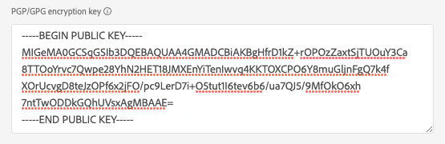

# （アルファ版）[!DNL LiveRamp - SFTP] 接続 {#liveramp-destination}

LiveRamp 接続を使用して、Adobe Real-time Customer Data Platform から [!DNL LiveRamp Connect] にオーディエンスをオンボーディングします。

>[!IMPORTANT]
>
><p>この宛先接続は現在アルファ版の段階にあり、一部のお客様のみにご利用いただけます。機能とドキュメントは変更される場合があります。</p>
&gt;<p>この宛先接続の最終バージョンでは、お客様による移行が必要になる場合があります。</p>


## ユースケース {#use-cases}

[!DNL LiveRamp SFTP] 宛先を使用する方法とタイミングを理解しやすくするために、Adobe Experience Platform のお客様がこの宛先を使用して解決できるユースケースのサンプルを以下に示します。

マーケターは、[!DNL Ramp ID] 識別子を使用して [!DNL CTV] プラットフォームのユーザーをターゲットにできるように、Adobe Experience Platform からオーディエンスを送信して [!DNL LiveRamp Connect] に ID をオンボーディングしたいと考えています。

## 前提条件 {#prerequisites}

[!DNL LiveRamp - SFTP] 接続では、[LiveRamp の SFTP](https://docs.liveramp.com/connect/en/upload-a-file-via-liveramp-s-sftp.html) ストレージを使用してファイルを書き出します。

Experience Platform から [!DNL LiveRamp SFTP] にデータを送信するには、まず [!DNL LiveRamp] 資格情報が必要です。資格情報がまだない場合は、[!DNL LiveRamp] の担当者に連絡して資格情報を取得してください。

## サポートされている ID {#supported-identities}

LiveRamp SFTP では、公式の [LiveRamp ドキュメント](https://docs.liveramp.com/connect/en/identity-and-identifier-terms-and-concepts.html#known-identifiers)に記載されている、PII ベースの識別子、既知の識別子、カスタム ID などの ID のアクティブ化をサポートしています。

アクティブ化ワークフローの[マッピングステップ](#map)では、ターゲットマッピングをカスタム属性として定義する必要があります。

## 書き出しのタイプと頻度 {#export-type-frequency}

宛先の書き出しのタイプと頻度について詳しくは、以下の表を参照してください。

| 項目 | タイプ | メモ |
---------|----------|---------|
| 書き出しタイプ | **[!UICONTROL セグメントの書き出し]** | [!DNL LiveRamp SFTP] 宛先で使用される識別子（名前、電話番号など）を使用して、セグメント（オーディエンス）のすべてのメンバーを書き出します。 |
| 書き出し頻度 | **[!UICONTROL 日別バッチ]** | セグメント評価に基づいて Experience Platform 内でプロファイルを更新すると、プロファイル（ID）は 1 日 1 回ダウンストリームの宛先プラットフォームで更新されます。詳しくは、[バッチ（ファイルベース）宛先](/help/destinations/destination-types.md#file-based)を参照してください。 |

{style="table-layout:auto"}

## 宛先への接続 {#connect}

>[!IMPORTANT]
> 
>宛先に接続するには、**[!UICONTROL 宛先の管理]** [アクセス制御権限](/help/access-control/home.md#permissions)が必要です。詳しくは、[アクセス制御の概要](/help/access-control/ui/overview.md)または製品管理者に問い合わせて、必要な権限を取得してください。

この宛先に接続するには、[宛先設定のチュートリアル](../../ui/connect-destination.md)の手順に従ってください。宛先の設定ワークフローで、以下の 2 つのセクションにリストされているフィールドに入力します。

### 宛先に対する認証 {#authenticate}

宛先に対して認証するには、必須フィールドに入力し、「**[!UICONTROL 宛先に接続]**」を選択します。

**パスワードを使用した SFTP 認証** {#sftp-password}


* **[!UICONTROL ユーザー名]**：[!DNL LiveRamp SFTP] ストレージの場所のユーザー名。
* **[!UICONTROL パスワード]**：[!DNL LiveRamp SFTP] ストレージの場所のパスワード。
* **[!UICONTROL PGP／GPG 暗号化キー]**：必要に応じて、RSA 形式の公開鍵を添付して、書き出したファイルに暗号化を追加できます。正しい形式の暗号化キーの例については、以下の画像を参照してください。暗号化キーを入力する場合は、「[宛先の詳細](#destination-details)」セクションで&#x200B;**[!UICONTROL 暗号化サブキー ID]** も入力する必要があります。

   

**SSH キー認証を使用した SFTP** {#sftp-ssh}


* **[!UICONTROL ユーザー名]**：[!DNL LiveRamp SFTP] ストレージの場所のユーザー名。
* **[!UICONTROL SSH キー]**：[!DNL LiveRamp SFTP] ストレージの場所へのログインに使用する [!DNL SSH] 秘密鍵。この秘密鍵は、[!DNL Base64] でエンコードされた文字列の形式にする必要があり、パスワードで保護しないでください。

   * [!DNL SSH] キーを [!DNL LiveRamp SFTP] サーバーに接続するには、[!DNL LiveRamp] のテクニカルサポートポータルを通じてチケットを送信し、公開鍵を入力する必要があります。詳しくは、[LiveRamp ドキュメント](https://docs.liveramp.com/connect/en/upload-a-file-via-liveramp-s-sftp.html#upload-with-an-sftp-client)を参照してください。

* **[!UICONTROL PGP／GPG 暗号化キー]**：必要に応じて、RSA 形式の公開鍵を添付して、書き出したファイルに暗号化を追加できます。暗号化キーを入力する場合は、「[宛先の詳細](#destination-details)」セクションで&#x200B;**[!UICONTROL 暗号化サブキー ID]** も入力する必要があります。正しい形式の暗号化キーの例については、以下の画像を参照してください。

   

### 宛先の詳細の入力 {#destination-details}

>[!CONTEXTUALHELP]
>id="platform_destinations_liveramp_subkey"
>title="暗号化サブキー ID"
>abstract="LiveRamp 公開暗号化キーに基づく、暗号化に使用するサブキー ID。認証手順で暗号化キーを入力した場合、このフィールドは必須です。"
>additional-url="https://docs.liveramp.com/connect/en/encrypting-files-for-uploading.html#downloading-the-current-encryption-key" text="サブキー ID の取得方法を説明します"

宛先の詳細を設定するには、以下の必須フィールドとオプションフィールドに入力します。UI のフィールドの横のアスタリスクは、そのフィールドが必須であることを示します。


* **[!UICONTROL 名前]**：今後この宛先を認識するための名前。
* **[!UICONTROL 説明]**：今後この宛先を識別するのに役立つ説明。
* **[!UICONTROL フォルダーパス]**：書き出したファイルをホストする [!DNL LiveRamp] `uploads` サブフォルダーへのパス。`uploads` プレフィックスがフォルダーパスに自動的に追加されます。
   * 例えば、ファイルを `uploads/my_export_folder` に書き出す場合は、「**[!UICONTROL フォルダーパス]**」フィールドに `my_export_folder` と入力します。
* **[!UICONTROL 圧縮形式]**：書き出したファイルに Experience Platform で使用する圧縮タイプを選択します。使用可能なオプションは、**[!UICONTROL GZIP]** または&#x200B;**[!UICONTROL なし]**&#x200B;です。
* **[!UICONTROL 暗号化サブキー ID]**：[!DNL LiveRamp] 公開暗号化キーに基づく、暗号化に使用するサブキー。[認証](#authenticate)手順で暗号化キーを入力した場合、このフィールドは必須です。サブキー ID の取得方法については、[!DNL LiveRamp] [暗号化ドキュメント](https://docs.liveramp.com/connect/en/encrypting-files-for-uploading.html#downloading-the-current-encryption-key)を参照してください。

### アラートの有効化 {#enable-alerts}

アラートを有効にすると、宛先へのデータフローのステータスに関する通知を受け取ることができます。リストからアラートを選択して、データフローのステータスに関する通知を受け取るよう登録します。アラートについて詳しくは、[UI を使用した宛先アラートの購読](../../ui/alerts.md)に関するガイドを参照してください。

宛先接続の詳細の入力を終えたら「**[!UICONTROL 次へ]**」を選択します。

## この宛先に対してセグメントをアクティブ化 {#activate}

>[!IMPORTANT]
> 
>データをアクティブ化するには、**[!UICONTROL 宛先の管理]**、**[!UICONTROL 宛先のアクティブ化]**、**[!UICONTROL プロファイルの表示]**&#x200B;および&#x200B;**[!UICONTROL セグメントの表示]**[に対するアクセス制御権限](/help/access-control/home.md#permissions)が必要です。詳しくは、[アクセス制御の概要](/help/access-control/ui/overview.md)または製品管理者に問い合わせて、必要な権限を取得してください。

この宛先に対してオーディエンスセグメントをアクティブ化する手順については、[バッチプロファイル書き出し宛先に対するオーディエンスデータのアクティブ化](/help/destinations/ui/activate-batch-profile-destinations.md)を参照してください。

### スケジュール設定 {#scheduling}

[!UICONTROL スケジュール設定]ステップでは、以下に示す設定で各セグメントの書き出しスケジュールを作成します。

>[!IMPORTANT]
>
>この宛先に対してアクティブ化するすべてのセグメントを、まったく同じスケジュールに設定する必要があります（下図を参照）。

* **[!UICONTROL ファイル書き出しオプション]**：[!UICONTROL 完全ファイルを書き出し]。[増分ファイル書き出し](../../ui/activate-batch-profile-destinations.md#export-incremental-files)は現在、[!DNL LiveRamp] 宛先ではサポートされていません。
* **[!UICONTROL 頻度]**：[!UICONTROL 毎日]
* 書き出し時間を&#x200B;**[!UICONTROL セグメント評価後]**&#x200B;に設定します。スケジュール設定したセグメント書き出しと[オンデマンドファイル書き出し](../../ui/export-file-now.md)は現在、[!DNL LiveRamp] 宛先ではサポートされていません。
* **[!UICONTROL 日付]**：希望する書き出し開始時刻および終了時刻を選択します。


書き出すファイルの名前は現在、ユーザーが設定することはできません。[!DNL LiveRamp SFTP] 宛先に書き出すすべてのファイルは、次のテンプレートに基づいて自動的に名前が付けられます。

`%ORGANIZATION_NAME%_%DESTINATION%_%DESTINATION_INSTANCE_ID%_%DATETIME%`


例えば、[!DNL Luma] という名前の組織の場合、書き出すファイルの名前は次のようになります。

```json
Luma_LiveRamp_52137231-4a99-442d-804c-39a09ddd005d_20230330_153857.csv
```

### 属性と ID のマッピング {#map}

**[!UICONTROL マッピング]**&#x200B;ステップでは、書き出すプロファイル属性および ID を選択できます。

>[!IMPORTANT]
>
>この宛先では、アクティブ化フローごとに 1 つのソース ID 名前空間のアクティブ化をサポートしています。`Email` や `Phone` など、複数の ID 名前空間を書き出す必要がある場合は、ID ごとに[個別のアクティブ化フローを作成](../../ui/activate-batch-profile-destinations.md)する必要があります。

**[!UICONTROL マッピング]**&#x200B;ステップでは、書き出された CSV ファイルの列ヘッダーの名前が&#x200B;**[!UICONTROL ターゲットフィールド]**&#x200B;マッピングで定義されます。**[!UICONTROL ターゲットフィールド]**&#x200B;のカスタム名を指定することで、書き出すファイルの CSV 列ヘッダーを任意のわかりやすい名前に変更できます。

1. **[!UICONTROL マッピング]**&#x200B;手順で、「**[!UICONTROL 新しいマッピングを追加]**」を選択します。画面に新しいマッピング行が表示されます。

   

2. **[!UICONTROL ソースフィールドを選択]**&#x200B;ウィンドウで、**[!UICONTROL 属性を選択]**&#x200B;カテゴリを選択し、マッピングする XDM 属性を選択するか、**[!UICONTROL ID 名前空間を選択]**&#x200B;カテゴリを選択して、宛先にマッピングする ID を選択します。

   

3. **[!UICONTROL ターゲットフィールドを選択]**&#x200B;ウィンドウで、選択したソースフィールドのマッピング先となる属性名を入力します。ここで定義した属性名が、書き出された CSV ファイルに列ヘッダーとして反映されます。

   

   また、**[!UICONTROL ターゲットフィールド]**&#x200B;に直接入力して属性名を入力することもできます。

   

必要なマッピングをすべて追加したら、「**[!UICONTROL 次へ]**」を選択してアクティブ化ワークフローを終了します。

## 書き出されたデータ／データ書き出しの検証 {#exported-data}

データは、設定した [!DNL LiveRamp SFTP] ストレージの場所に CSV ファイルとして書き出されます。

ファイルを [!DNL LiveRamp SFTP] 宛先に書き出す場合、Platform では[結合ポリシー ID](../../../profile/merge-policies/overview.md) ごとに 1 つの CSV ファイルを生成します。

例えば、次のセグメントについて考えてみます。

* セグメント A（結合ポリシー 1）
* セグメント B（結合ポリシー 2）
* セグメント C（結合ポリシー 1）
* セグメント D（結合ポリシー 1）

Platform では、次の 2 つの CSV ファイルを [!DNL LiveRamp SFTP] に書き出します。

* セグメント A、C および D を含んだ 1 つの CSV ファイル。
* セグメント B を含んだ 1 つの CSV ファイル。

書き出される CSV ファイルには、選択した属性とそれに対応するセグメントステータスを持つプロファイルが別々の列に含まれ、属性名とセグメント ID が列ヘッダーとなっています。

書き出されたファイルに含まれているプロファイルは、次のセグメント選定ステータスのいずれかと一致する可能性があります。

* `Active`：プロファイルは現在、セグメントに対して選定されています。
* `Expired`：プロファイルはセグメントに対して選定されなくなりましたが、過去に選定されたことがあります。
* `""`（空の文字列）：プロファイルはセグメントに対して選定されたことはありません。


例えば、書き出された CSV ファイルに 1 つの `email` 属性と 3 つのセグメントが含まれている場合、CSV ファイルは次のようになります。

```csv
email,aa2e3d98-974b-4f8b-9507-59f65b6442df,45d4e762-6e57-4f2f-a3e0-2d1893bcdd7f,7729e537-4e42-418e-be3b-dce5e47aaa1e
abc117@testemailabc.com,active,,
abc111@testemailabc.com,,,active
abc102@testemailabc.com,,,active
abc116@testemailabc.com,active,,
abc107@testemailabc.com,active,expired,active
abc101@testemailabc.com,active,active,
```

Platform では[結合ポリシー ID](../../../profile/merge-policies/overview.md) ごとに 1 つの CSV ファイルを生成するので、結合ポリシー ID ごとに個別のデータフロー実行も生成します。

つまり、[データフロー実行](../../../dataflows/ui/monitor-destinations.md#dataflow-runs-for-batch-destinations)ページの&#x200B;**[!UICONTROL アクティブ化された ID]** 指標と&#x200B;**[!UICONTROL 受信したプロファイル]**&#x200B;指標が、セグメントごとに表示されるのではなく、同じ結合ポリシーを使用するセグメントのグループごとに集計されます。

同じ結合ポリシーを使用するセグメントのグループに対してデータフロー実行が生成されるので、セグメント名は[モニタリングダッシュボード](../../../dataflows/ui/monitor-destinations.md#dataflow-runs-for-batch-destinations)に表示されません。


## 書き出されたデータの LiveRamp へのアップロード {#upload-to-liveramp}

データが [!DNL LiveRamp - SFTP] ストレージに正常に書き出されたら、[!DNL LiveRamp] プラットフォームにデータをアップロードする必要があります。

ファイルを [!DNL LiveRamp - SFTP] ストレージから [!DNL LiveRamp] オーディエンスにアップロードする方法について詳しくは、[最初のファイルをオーディエンスにアップロードする際の考慮事項](https://docs.liveramp.com/connect/en/considerations-when-uploading-the-first-file-to-an-audience.html#considerations-when-uploading-the-first-file-to-an-audience)のドキュメントを参照してください。

## データの使用とガバナンス {#data-usage-governance}

[!DNL Adobe Experience Platform] のすべての宛先は、データを処理する際のデータ使用ポリシーに準拠しています。[!DNL Adobe Experience Platform] がどのように データガバナンスを実施するかについて詳しくは、[データガバナンスの概要](/help/data-governance/home.md)を参照してください。

## その他のリソース {#additional-resources}

LiveRamp SFTP ストレージの設定方法について詳しくは、[公式ドキュメント](https://docs.liveramp.com/connect/en/upload-a-file-via-liveramp-s-sftp.html)を参照してください。
