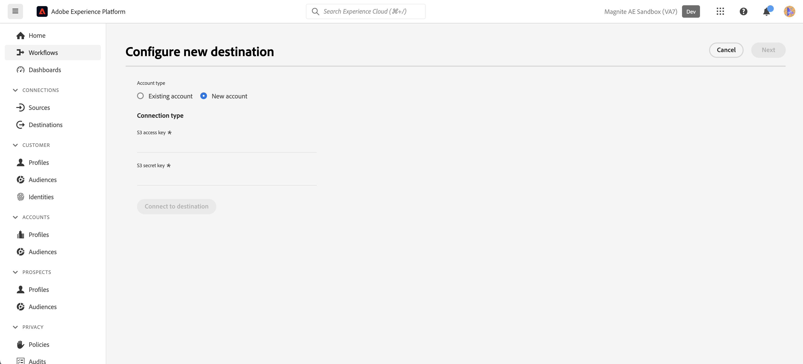
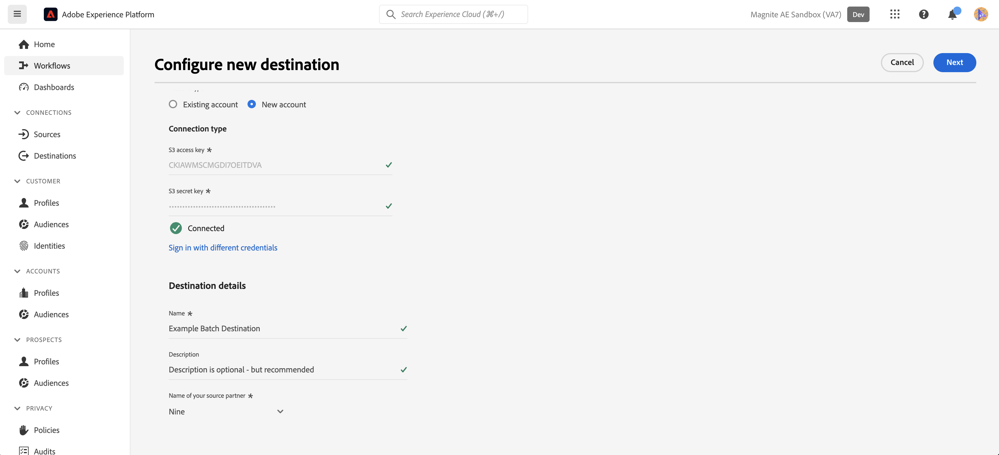
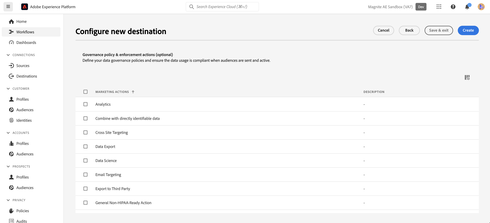
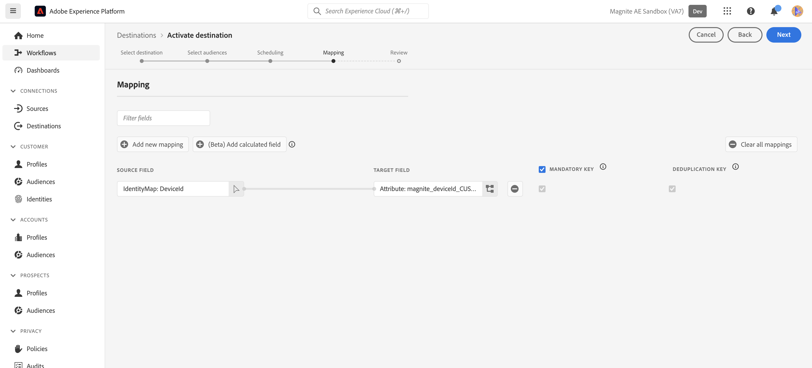
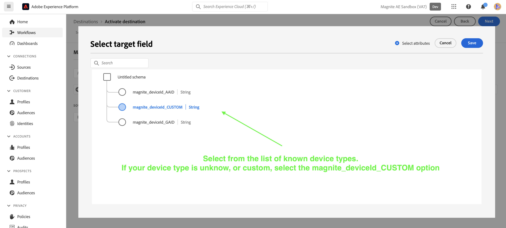

# Magnite：バッチ接続 {#magnite-streaming-batch}

## 概要 {#overview}

このドキュメントでは、Magnite：バッチ宛先について説明し、オーディエンスをアクティブ化してエクスポートする方法をより深く理解するのに役立つサンプルユースケースを提供します。

Adobe [!DNL Real-Time CDP]のオーディエンスは、1日に1回配信するか、リアルタイムで配信できるという2つの方法でMagnite Streaming Platformに配信できます。

1. 1日に1回だけオーディエンスを配信したい場合や配信する必要がある場合は、Magnite：バッチ宛先を使用できます。この宛先は、毎日のS3 バッチファイル配信を介してオーディエンスをMagnite Streamingに配信します。 バッチオーディエンスは、数日しか保存されないリアルタイムオーディエンスとは異なり、Magnite プラットフォームに無期限に保存されます。

2. ただし、より頻繁にオーディエンスを配信する必要がある場合は、[Magnite Real-Time](/help/destinations/catalog/advertising/magnite-streaming.md)宛先を使用する必要があります。 リアルタイムの宛先を使用する場合、Magnite Streamingはリアルタイムでオーディエンスを受け取りますが、Magniteはリアルタイムのオーディエンスをプラットフォームに一時的に保存することしかできず、数日以内にシステムから削除されます。 このため、Magnite リアルタイム宛先を使用する場合は、*また*&#x200B;がMagnite: バッチ宛先 – リアルタイム宛先に対してアクティブ化する各オーディエンスを使用する必要があります。また、バッチ宛先に対してもアクティブ化する必要があります。

まとめ：1日に1回だけAdobe [!DNL Real-Time CDP]のオーディエンスを配信したい場合は、Magnite：バッチ宛先のみを使用し、オーディエンスは1日に1回配信されます。 Adobe [!DNL Real-Time CDP]のオーディエンスをリアルタイムで配信する場合は、Magnite: バッチ宛先とMagnite Real-Time宛先の両方&#x200B;*2}を使用します。*&#x200B;詳しくは、Magnite: Streamingをご覧ください。

Magniteについて詳しくは、以下を引き続きお読みください。バッチの宛先、バッチに接続する方法、およびAdobe [!DNL Real-Time CDP] オーディエンスをアクティブ化する方法について。
リアルタイムの宛先について詳しくは、代わりに[このドキュメントページ ](magnite-streaming.md)を参照してください。

>[!IMPORTANT]
>
>宛先コネクタとドキュメント ページは、[!DNL Magnite] チームによって作成および管理されます。 問い合わせや更新のリクエストについては、`adobe-tech@magnite.com`から直接お問い合わせください。

## ユースケース {#use-cases}

Magnite: バッチ宛先を使用する方法とタイミングをより深く理解するために、[!DNL Adobe Experience Platform]のお客様がこの宛先を使用して解決できるユースケースの例を次に示します。

### ユースケース #1 {#use-case-1}

Magnite Real-Time宛先でオーディエンスをアクティブ化しました。

Magnite Real-Time宛先を介してアクティブ化されたオーディエンスは、バッチ配信のデータがMagnite Streaming Platform内のReal-Time配信のデータを置き換えたり保持したりすることを目的としているため、Magnite：バッチ宛先も使用する必要があります。

### ユースケース #2 {#use-case-2}

Magnite ストリーミングプラットフォームに対して、バッチ/毎日のケイデンスでのみオーディエンスをアクティベートする必要があります。

Magniteを介してアクティブ化されたオーディエンス：バッチ宛先は、バッチ/毎日のケイデンスで配信され、その後、Magnite ストリーミングプラットフォームでターゲティングに使用できるようになります。

## 前提条件 {#prerequisites}

[!DNL Magnite]で[!DNL Adobe Experience Platform]の宛先を使用するには、まずMagnite Streaming アカウントが必要です。 [!DNL Magnite Streaming] アカウントをお持ちの場合は、[!DNL Magnite] アカウントマネージャーに連絡して、資格情報を提供して[!DNL Magnite's]宛先にアクセスしてください。 [!DNL Magnite Streaming] アカウントをお持ちでない場合は、adobe-tech@magnite.comにお問い合わせください。

## サポートされている ID {#supported-identities}

Magnite: バッチ宛先は、Adobe CDPから&#x200B;*any*&#x200B;個のID ソースを受信できます。 現在、この宛先には、マッピングする3つのターゲット ID フィールドがあります。

>[!NOTE]
>
>*任意の*&#x200B;個のID ソースは、任意の`magnite_deviceId`個のターゲット IDにマッピングできます。

| ターゲット ID | 説明 | 注意点 |
|:--------------------------- |:------------------------------------------------------------------------------------------------ |:------------------------------------------------------------------------------------- |
| magnite_deviceId_GAID | GOOGLE ADVERTISING ID | ソース IDがGAIDの場合は、このターゲット IDを選択します |
| magnite_deviceId_IDFA | Apple の広告主 ID | ソース IDがIDFAの場合は、このターゲット IDを選択します |
| magnite_deviceId_CUSTOM | カスタム/ユーザー定義ID | ソース IDがGAIDまたはIDFAでない場合、またはカスタム IDまたはユーザー定義IDである場合は、このターゲット IDを選択します |

{style="table-layout:auto"}

## サポートされるオーディエンス {#supported-audiences}

| オーディエンスの由来 | サポートあり | 説明 |
|-----------------------------|----------|----------|
| [!DNL Segmentation Service] | ○ | Experience Platform [ セグメント化サービス ](../../../segmentation/home.md)を通じて生成されたオーディエンス。 |
| その他すべてのオーディエンスの生成元 | ○ | このカテゴリには、[!DNL Segmentation Service]を通じて生成されたオーディエンス以外のすべてのオーディエンスのオリジンが含まれます。 [様々なオーディエンスの起源](/help/segmentation/ui/audience-portal.md#customize)について読みます。 次に例を示します。 <ul><li> カスタムアップロードオーディエンス [がCSV ファイルからExperience Platformに](../../../segmentation/ui/audience-portal.md#import-audience)をインポートしました。</li><li> 類似オーディエンス， </li><li> 連合オーディエンス， </li><li> [!DNL Adobe Journey Optimizer]などの他のExperience Platform アプリで生成されたオーディエンス </li><li> その他。 </li></ul> |

{style="table-layout:auto"}

オーディエンスのデータタイプ別にサポートされるオーディエンス：

| オーディエンスのデータタイプ | サポートあり | 説明 | ユースケース |
|--------------------|-----------|-------------|-----------|
| [人物オーディエンス ](/help/segmentation/types/people-audiences.md) | ○ | 顧客プロファイルにもとづいて、マーケティング施策の特定のグループをターゲットにすることができます。 | 買い物客やカートの放棄が多い |
| [ アカウントオーディエンス ](/help/segmentation/types/account-audiences.md) | × | アカウントベースドマーケティング戦略のために、特定の組織内の個人をターゲットにします。 | B2B マーケティング |
| [見込みオーディエンス ](/help/segmentation/types/prospect-audiences.md) | × | まだ顧客ではないが、ターゲットオーディエンスと特徴を共有する個人をターゲットにします。 | サードパーティデータによる見込み顧客の開拓 |
| [ データセットの書き出し](/help/catalog/datasets/overview.md) | × | [!DNL Adobe Experience Platform] データ レイクに保存されている構造化データのコレクション。 | レポート，データサイエンスワークフロー |

{style="table-layout:auto"}

## 書き出しのタイプと頻度 {#export-type-frequency}

| 項目 | タイプ | メモ |
|-----------------------------|----------|----------|
| 書き出しタイプ | オーディエンスの書き出し | オーディエンスのすべてのメンバーを、Magnite：バッチ宛先で使用されている識別子（名前、電話番号など）を使用して書き出します。 |
| 書き出し頻度 | バッチ | バッチ宛先では、ファイルが 3 時間、6 時間、8 時間、12 時間、24 時間の単位でダウンストリームプラットフォームに書き出されます。 バッチ [ ファイルベースの宛先](/help/destinations/destination-types.md)について詳しく説明します。 |

{style="table-layout:auto"}

## 宛先への接続 {#connect}

宛先の使用が承認され、Magnite Streamingが資格情報を共有したら、次の手順に従ってデータの認証、マッピング、共有を行います。

### 宛先に対する認証 {#authenticate}

Adobe Experience カタログでMagnite：バッチの宛先を探します。 追加オプションボタン（\...）をクリックし、宛先接続/インスタンスを設定します。

既存のアカウントがある場合は、「アカウントの種類」オプションを「既存のアカウント」に変更して、アカウントを見つけることができます。 それ以外の場合は、以下のアカウントを作成します。

新しいアカウントを作成し、初めて宛先に認証するには、必須の「S3 アクセスキー」フィールドと「S3 シークレットキー」フィールド（アカウントマネージャーから提供）に入力し、**[!UICONTROL Connect to destination]**&#x200B;を選択します

>[!NOTE]
>
>Magnite Streamingのセキュリティポリシーでは、S3 キーを定期的にローテーションする必要があります。 今後、新しいS3 アクセスとS3 シークレット キーを使用してアカウントを更新することを想定しておく必要があります。 アカウント自体を更新する必要があるだけです。そのアカウントを使用する宛先は、更新されたキーを自動的に使用します。 新しいキーのアップロードに失敗すると、データがこの宛先に送信できなくなります。

### 宛先の詳細を入力 {#destination-details}

宛先の詳細を設定するには、以下の必須フィールドとオプションフィールドに入力します。UI のフィールドの横のアスタリスクは、そのフィールドが必須であることを示します。

* **[!UICONTROL Name]**：この宛先接続/インスタンスを認識する際に使用する名前
将来：
* **[!UICONTROL Description]**：特定に役立つ説明
destination connection/instanceを使用します。
* **[!UICONTROL Your company name]**：お客様/会社名。 サポートされている[!DNL Magnite Streaming] クライアントのみが選択できます。

>[!NOTE]
>
>会社名は、Magniteで設定し、[宛先への認証](#authenticate)手順で設定したAmazon S3 デリバリーバケットの名前と一致する文字列である必要があります。 サポートされる文字には、「a-z」、「A-Z」、「0-9」、「 – 」（ダッシュ）または「_」（アンダースコア）が含まれます。

>[!NOTE]
>
>バッチ宛先を使用して複数のID タイプ（GAID、IDFAなど）を送信する場合は、それぞれに新しい宛先接続/インスタンスが必要です。 詳細については、Magnite アカウント担当者にお問い合わせください。

次に、**[!UICONTROL Next]**&#x200B;を選択して続行できます

次の画面「ガバナンスポリシーと履行アクション（オプション）」で、関連するデータガバナンスポリシーをオプションで選択できます。 一般的に、「データ書き出し」はMagnite：バッチ宛先に対して選択されます。

選択したら、またはオプション画面をスキップする場合は、**[!UICONTROL Create]**&#x200B;を選択します

### アラートの有効化 {#enable-alerts}

アラートを有効にすると、宛先へのデータフローのステータスに関する通知を受け取ることができます。リストからアラートを選択して、データフローのステータスに関する通知を受け取るよう登録します。アラートについて詳しくは、[UI を使用した宛先アラートの購読](../../ui/alerts.md)についてのガイドを参照してください。

宛先接続の詳細の提供が完了したら、**[!UICONTROL Next]**&#x200B;を選択します。

### この宛先に対してオーディエンスをアクティブ化 {#activate}

>[!IMPORTANT]
>
>* データをアクティブ化するには、**[!UICONTROL View Destinations]**、**[!UICONTROL Activate Destinations]**、**[!UICONTROL View Profiles]**&#x200B;および&#x200B;**[!UICONTROL View Segments]** [ アクセス制御権限](/help/access-control/home.md#permissions)が必要です。 [アクセス制御の概要](/help/access-control/ui/overview.md)を参照するか、製品管理者に問い合わせて必要な権限を取得してください。
>* *ID*&#x200B;をエクスポートするには、**[!UICONTROL View Identity Graph]** [ アクセス制御権限](/help/access-control/home.md#permissions)が必要です。  {width="100" zoomable="yes"}

この宛先に対してオーディエンスセグメントをアクティブ化する手順については、[バッチプロファイル書き出し宛先に対するオーディエンスデータのアクティブ化](/help/destinations/ui/activate-batch-profile-destinations.md)を参照してください。

### 属性と ID のマッピング {#map}

**[!UICONTROL Source field]**で、デバイスの任意の属性またはIDを選択できます。 この例では、「DeviceId」というカスタム IdentityMapを選択しました

**[!UICONTROL Target field]**で：
詳細については、[ サポートされているID](#supported-identities)を参照してください。
この例では、**[!UICONTROL Target field]**: magnite_deviceId_CUSTOMを選択しました。これは、**[!UICONTROL Source field]**&#x200B;がカスタム IdentityMap: DeviceIDとして定義されているからです。

>[!NOTE]
>
>バッチ宛先を使用して複数のID タイプ（GAID、IDFAなど）を送信/マッピングする場合は、それぞれに新しい宛先接続/インスタンスが必要です。 詳細については、Magnite アカウント担当者にお問い合わせください。

「各オーディエンスのファイル名と書き出しスケジュールの設定」画面で、各オーディエンスの開始日（必須）、終了日（オプション）、マッピング ID （必須）を設定する必要があります。

>[!IMPORTANT]
>
> この宛先には、マッピング IDまたは「なし」が必要です。
>
> マッピング IDは、オーディエンスが以前にMagnite Streamingで知られていた既存のセグメント IDを持っている場合に提供する必要があります。 そうでない場合は、「NONE」をマッピング IDとして使用する必要があります。
>
> 各オーディエンスのファイル名を設定する場合は、追加する「カスタムテキスト」フィールドにマッピング IDを含めてください。 マッピング IDは次のように追加されます。`{previous_filename}\_\[MAPPING_ID\].`このオーディエンスがMagnite Streamingを初めて使用する場合、マッピング IDを指定しない場合は、「カスタムテキスト」フィールドに「NONE」を入力する必要があります。 この場合、新しいファイル名は`{previous_filename}\_\[NONE\]`である必要があります。

## 書き出されたデータ／データ書き出しの検証 {#exported-data}

オーディエンスがアップロードされたら、オーディエンスが正しく作成され、アップロードされたことを検証できます。

* Magnite：バッチ宛先は、毎日の頻度でS3 ファイルをMagnite Streamingに配信します。 配信と取り込みの後、オーディエンス/セグメントはMagnite Streamingに表示されることが期待されており、契約に適用できます。 これを確認するには、[!DNL Adobe Experience Platform]のアクティベーション手順で共有されたセグメント IDまたはセグメント名を検索します。

>[!NOTE]
>
>Magniteにアクティベート/配信されたオーディエンス：バッチ宛先は、Magnite Real-Time宛先経由でアクティベート/配信されたオーディエンスと同じオーディエンスを&#x200B;*置換*&#x200B;します。 セグメント名を使用してセグメントを検索する場合、バッチがMagnite Streaming プラットフォームによって取り込まれ、処理されるまで、リアルタイムでセグメントが見つからない場合があります。

## データの使用とガバナンス {#data-usage-governance}

[!DNL Adobe Experience Platform] のすべての宛先は、データを処理する際のデータ使用ポリシーに準拠しています。[!DNL Adobe Experience Platform] がどのように データガバナンスを実施するかについて詳しくは、[データガバナンスの概要](/help/data-governance/home.md)を参照してください。

## その他のリソース {#additional-resources}

その他のヘルプドキュメントについては、[Magnite ヘルプセンター](https://help.magnite.com/help)を参照してください。
