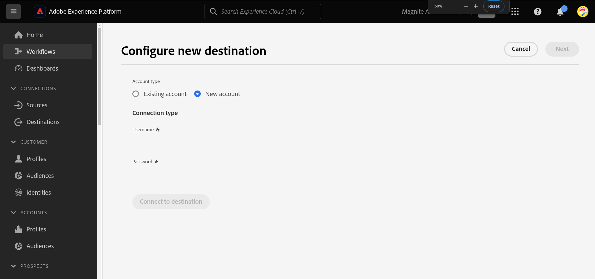
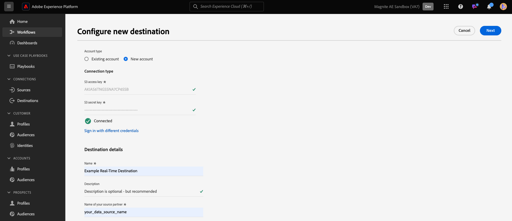
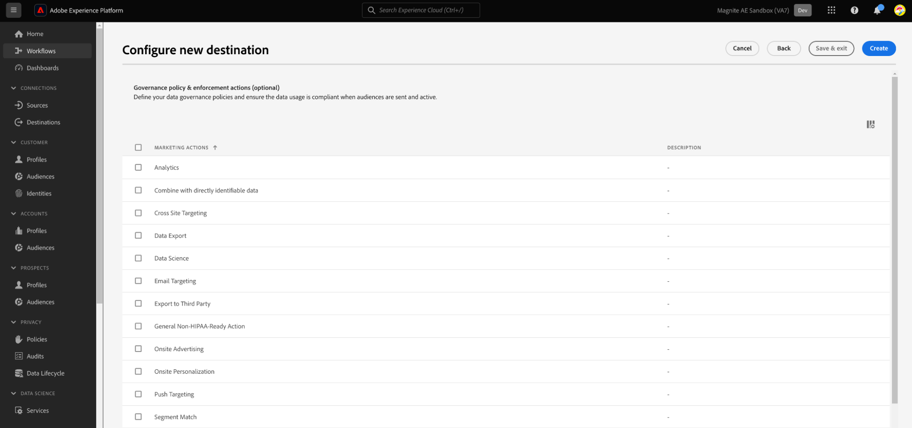
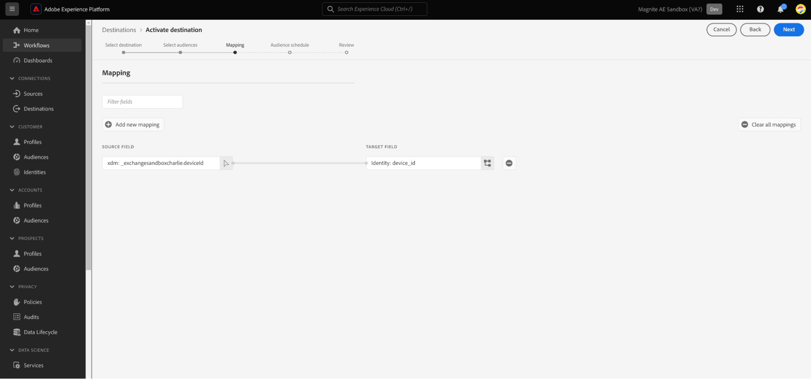
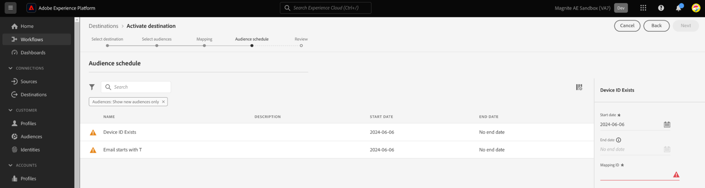
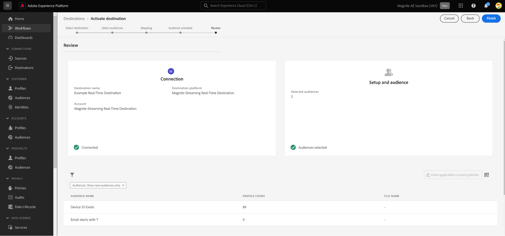

# Magnite：リアルタイムの宛先接続

## 概要 {#overview}

[!DNL Magnite: Real-Time]と[Magnite: バッチ &#x200B;](/help/destinations/catalog/advertising/magnite-batch.md)の[!DNL Adobe Experience Platform]宛先は、Magnite ストリーミングプラットフォームでのターゲティングとアクティブ化のためにオーディエンスをマッピングおよびエクスポートするのに役立ちます。

[!DNL Magnite Streaming] プラットフォームにオーディエンスをアクティブ化するには、2つの手順を実行する必要があります。これには、Magnite: Real-TimeとMagnite: Batch destinationsの両方を使用する必要があります。

オーディエンスを[!DNL Magnite Streaming]にアクティベートするには、次の操作を行う必要があります。

* このページに示すように、[!DNL Magnite: Real-Time]宛先のオーディエンスをアクティブ化します。
* Magnite：バッチ宛先で同じオーディエンスをアクティベートします。 [!DNL Magnite: Batch]宛先は必須コンポーネントです。 [!DNL Magnite Streaming] バッチ宛先でオーディエンスをアクティブ化できないと、統合が失敗し、オーディエンスはアクティブ化されません。

>[!NOTE]
>
>リアルタイム宛先を使用する場合、[!DNL Magnite Streaming]はリアルタイムでオーディエンスを受け取りますが、Magniteはリアルタイムのオーディエンスをプラットフォームに一時的にしか保存できず、数日以内にシステムから削除されます。 このため、Magnite: Real-Time宛先を使用する場合は、*また*&#x200B;がMagnite: バッチ宛先を使用する必要があります – リアルタイム宛先に対してアクティブ化する各オーディエンスも、バッチ宛先に対してアクティブ化する必要があります。

>[!IMPORTANT]
>
>宛先コネクタとドキュメント ページは、[!DNL Magnite] チームによって作成および管理されます。 問い合わせや更新のリクエストについては、`adobe-tech@magnite.com`から直接お問い合わせください。

## ユースケース {#use-cases}

[!DNL Magnite: Real-Time]宛先を使用する方法とタイミングをより理解しやすくするために、[!DNL Adobe Experience Platform]のお客様がこの宛先を使用して解決できる使用例を次に示します。

### アクティブ化とターゲティング {#activation-and-targeting}

Magniteとの統合により、顧客は広告ターゲティングのために、[!DNL Adobe Experience Platform]からMagniteにCDP オーディエンスを渡すことができます。 オーディエンスは、ポジティブなターゲティングとネガティブなターゲティング（抑制）のために、Magnite内で選択することができます。

## 前提条件 {#prerequisites}

[!DNL Magnite]の[!DNL Adobe Experience Platform]宛先を使用するには、まず[!DNL Magnite Streaming] アカウントが必要です。 [!DNL Magnite Streaming] アカウントをお持ちの場合は、[!DNL Magnite] アカウントマネージャーに連絡して、資格情報を提供して[!DNL Magnite's]宛先にアクセスしてください。
[!DNL Magnite Streaming] アカウントをお持ちでない場合は、adobe-tech@magnite.comにお問い合わせください。

## サポートされている ID {#supported-identities}

[!DNL Magnite: Real-Time]宛先は、次の表に示すIDのアクティブ化をサポートしています。 [ID](/help/identity-service/features/namespaces.md) についての詳細情報。

| ターゲット ID | 説明 | 注意点 |
|-------------------|--------------------------------------------------------------------------------------------------|--------------------------------------------------------------------------------------|
| device_id | デバイスまたはIDの一意のID。 種類に関係なく、デバイス IDとファーストパーティ IDを使用できます。 | MagniteでサポートされているID タイプには、PPUID、GAID、IDFA、TV デバイス IDが含まれますが、これらに限定されません。 |

{style="table-layout:auto"}

## サポートされるオーディエンス {#supported-audiences}

この節では、この宛先に書き出すことができるオーディエンスのタイプについて説明します。

| オーディエンスの由来 | サポートあり | 説明 |
|-----------------------------|----------|----------|
| [!DNL Segmentation Service] | ○ | Experience Platform [&#x200B; セグメント化サービス &#x200B;](../../../segmentation/home.md)を通じて生成されたオーディエンス。 |
| その他すべてのオーディエンスの生成元 | ○ | このカテゴリには、[!DNL Segmentation Service]を通じて生成されたオーディエンス以外のすべてのオーディエンスのオリジンが含まれます。 [様々なオーディエンスの起源](/help/segmentation/ui/audience-portal.md#customize)について読みます。 次に例を示します。 <ul><li> カスタムアップロードオーディエンス [がCSV ファイルからExperience Platformに](../../../segmentation/ui/audience-portal.md#import-audience)をインポートしました。</li><li> 類似オーディエンス， </li><li> 連合オーディエンス， </li><li> [!DNL Adobe Journey Optimizer]などの他のExperience Platform アプリで生成されたオーディエンス </li><li> その他。 </li></ul> |

{style="table-layout:auto"}

オーディエンスのデータタイプ別にサポートされるオーディエンス：

| オーディエンスのデータタイプ | サポートあり | 説明 | ユースケース |
|--------------------|-----------|-------------|-----------|
| [人物オーディエンス &#x200B;](/help/segmentation/types/people-audiences.md) | ○ | 顧客プロファイルにもとづいて、マーケティング施策の特定のグループをターゲットにすることができます。 | 買い物客やカートの放棄が多い |
| [&#x200B; アカウントオーディエンス &#x200B;](/help/segmentation/types/account-audiences.md) | × | アカウントベースドマーケティング戦略のために、特定の組織内の個人をターゲットにします。 | B2B マーケティング |
| [見込みオーディエンス &#x200B;](/help/segmentation/types/prospect-audiences.md) | × | まだ顧客ではないが、ターゲットオーディエンスと特徴を共有する個人をターゲットにします。 | サードパーティデータによる見込み顧客の開拓 |
| [&#x200B; データセットの書き出し](/help/catalog/datasets/overview.md) | × | [!DNL Adobe Experience Platform] データ レイクに保存されている構造化データのコレクション。 | レポート，データサイエンスワークフロー |

{style="table-layout:auto"}

## 書き出しのタイプと頻度 {#export-type-frequency}

宛先の書き出しのタイプと頻度について詳しくは、以下の表を参照してください。

| 項目 | タイプ | メモ |
|------------------|---------------------------------|------------------------------------------------------------------------------------------------------------------------------------------------------------------------------------------------------------------------------------------------------------------------------------------------------------------------------------|
| 書き出しタイプ | **[!UICONTROL Segment export]** | [!DNL Magnite: Real-Time] 宛先で使用される識別子（名前、電話番号など）を使用して、セグメント（オーディエンス）のすべてのメンバーを書き出します。 |
| 書き出し頻度 | **[!UICONTROL Streaming]** | ストリーミングの宛先は常に、API ベースの接続です。セグメント評価に基づいて Experience Platform 内でプロファイルが更新されるとすぐに、コネクタは更新を宛先プラットフォームに送信します。詳しくは、[ストリーミングの宛先](/help/destinations/destination-types.md#streaming-destinations)を参照してください。 |

{style="table-layout:auto"}

## 宛先への接続 {#connect}

>[!IMPORTANT]
>
>宛先に接続するには、**[!UICONTROL View destinations]**&#x200B;および&#x200B;**[!UICONTROL Manage destinations]** [&#x200B; アクセス制御権限](/help/access-control/home.md#permissions)が必要です。 詳しくは、[アクセス制御の概要](/help/access-control/ui/overview.md)または製品管理者に問い合わせて、必要な権限を取得してください。

この宛先に接続するには、[宛先設定のチュートリアル](../../ui/connect-destination.md)の手順に従ってください。宛先の設定ワークフローで、以下の 2 つのセクションにリストされているフィールドに入力します。

### 宛先に対する認証 {#authenticate}

宛先に対して認証を行うには、必須フィールドに入力し、**[!UICONTROL Connect to destination]**&#x200B;を選択します。

* **[!UICONTROL Username]**: [!DNL Magnite]様から提供されたユーザー名。
* **[!UICONTROL Password]**: [!DNL Magnite]様から提供されたパスワード。

### 宛先の詳細を入力 {#destination-details}

宛先の詳細を設定するには、以下の必須フィールドとオプションフィールドに入力します。UI のフィールドの横のアスタリスクは、そのフィールドが必須であることを示します。

* **[!UICONTROL Name]**：今後この宛先を認識する際に使用する名前。
* **[!UICONTROL Description]**：今後この宛先を特定するのに役立つ説明です。
* **[!UICONTROL Your company name]**：お客様/会社名。 サポートされている[!DNL Magnite Streaming] クライアントのみが選択できます。

>[!NOTE]
>
>会社名は、Magniteで設定し、[宛先への認証](#authenticate)手順で設定したAmazon S3 デリバリーバケットの名前と一致する文字列である必要があります。 サポートされる文字には、「a-z」、「A-Z」、「0-9」、「 – 」（ダッシュ）または「_」（アンダースコア）が含まれます。

完了したら、**[!UICONTROL Create]** ボタンを選択します。

### アラートの有効化 {#enable-alerts}

アラートを有効にすると、宛先へのデータフローのステータスに関する通知を受け取ることができます。リストからアラートを選択して、データフローのステータスに関する通知を受け取るよう登録します。アラートについて詳しくは、[UI を使用した宛先アラートの購読](../../ui/alerts.md)についてのガイドを参照してください。

宛先接続の詳細の提供が完了したら、**[!UICONTROL Next]**&#x200B;を選択します。

## この宛先に対してオーディエンスをアクティブ化 {#activate}

>[!IMPORTANT]
>
>* データをアクティブ化するには、**[!UICONTROL View destinations]**、**[!UICONTROL Activate destinations]**、**[!UICONTROL View Profiles]**&#x200B;および&#x200B;**[!UICONTROL View Segments]** [&#x200B; アクセス制御権限](/help/access-control/home.md#permissions)が必要です。 [アクセス制御の概要](/help/access-control/ui/overview.md)を参照するか、製品管理者に問い合わせて必要な権限を取得してください。
>* *ID*&#x200B;をエクスポートするには、**[!UICONTROL View Identity Graph]** [&#x200B; アクセス制御権限](/help/access-control/home.md#permissions)が必要です。  {width="100" zoomable="yes"}

この宛先に対してオーディエンスをアクティブ化する手順については、[&#x200B; ストリーミング宛先に対するオーディエンスのアクティブ化](/help/destinations/ui/activate-segment-streaming-destinations.md)を参照してください。

宛先接続を作成したら、オーディエンスアクティベーションフローに進むことができます。 次の節では、リアルタイム宛先を使用してオーディエンスをアクティブ化する方法について説明します。

### 属性と ID のマッピング {#map}

次のステップは、ソース識別子をMagnite device_id識別子にマッピングすることです。

* **[!UICONTROL Add new mapping]**&#x200B;を選択して、必要な数のマッピングを追加できます。

Real-Time destinationを使用したこの例では、Magnite device_id ターゲットフィールドにマッピングされた汎用deviceId ソース識別子を含む行を示しています。 マッピングを行う場合は、[!UICONTROL Next]を選択します。

マッピング IDをアクティブなすべてのオーディエンスに設定するか、マッピング IDが存在しない場合はNONEを設定してください。

各オーディエンスに開始日（必須）、終了日（オプション）、マッピング IDを設定する必要があります。

**マッピング ID**

* オーディエンスが、以前にMagniteに知られていた既存のセグメント IDを持っている場合は、**[!UICONTROL Mapping ID]** フィールドを使用します。

* オーディエンスに&#x200B;**[!UICONTROL Mapping ID]**&#x200B;を追加するには、各オーディエンス行を個別に選択し、右側の列にデータを入力します（上の画像を参照）。 マッピング IDを追加しない場合は、「マッピング ID」フィールドに「なし」を入力してください。

**[!UICONTROL Next]**&#x200B;を選択し、アクティベーション フローを確定します。

## 書き出されたデータ／データ書き出しの検証 {#exported-data}

オーディエンスがアップロードされたら、次の手順を使用して、オーディエンスが正しく作成およびアップロードされたことを検証できます。

<!--

* In 95% of cases, audiences will be delivered to Magnite Streaming in under 10 minutes. The actual receipt and processing of the events within Magnite Streaming depends on the shared data volume.

-->

* 取り込み後、オーディエンスは数分以内に[!DNL Magnite Streaming]に表示されることが期待され、取引に適用できます。 これを確認するには、[!DNL Adobe Experience Platform]のアクティブ化手順で共有されたセグメント IDを検索します。

## [!DNL Magnite: Batch]宛先を通じて同じオーディエンスをアクティブ化 {#activate-magnite-batch}

リアルタイム宛先を使用して[!DNL Magnite Streaming]と共有されたオーディエンスも、Magnite：バッチ宛先を使用して共有する必要があります。 正しく設定すると、[!DNL Magnite Streaming] UIのセグメント名が更新され、毎日の更新後に[!DNL Adobe Experience Platform]で使用されるセグメント名が反映されます。

最後に、統合用にバッチ宛先が設定されていない場合は、Magnite：バッチ宛先ドキュメントを使用して今すぐ設定します。

## データの使用とガバナンス {#data-usage-governance}

[!DNL Adobe Experience Platform] のすべての宛先は、データを処理する際のデータ使用ポリシーに準拠しています。[!DNL Adobe Experience Platform] がどのように データガバナンスを実施するかについて詳しくは、[データガバナンスの概要](/help/data-governance/home.md)を参照してください。

## その他のリソース {#additional-resources}

その他のヘルプドキュメントについては、[Magnite ヘルプセンター](https://help.magnite.com/help)を参照してください。
