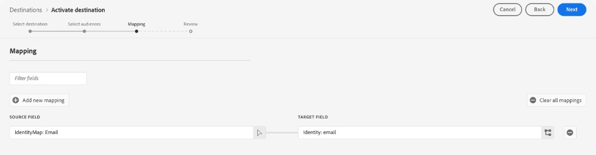

# [!DNL Microsoft Ads Customer Match] 接続 {#microsoft-ads-customer-match-destination}

>[!AVAILABILITY]
>
>この宛先コネクタは現在限定提供です。 アクセス権を取得するには、アドビ担当者にお問い合わせください。

## 概要 {#overview}

[!DNL Microsoft Ads Customer Match] の宛先を使用してメールアドレスで顧客を照合し、検索やオーディエンス広告を含む [!DNL Microsoft Advertising Network] 全体で顧客と再び関わり合います。 [!DNL Microsoft Advertising] アカウントをReal-Time CDPにリンクして、Experience Platformから直接顧客一致リストの作成と管理を自動化します。

## ユースケース {#use-cases}

[!DNL Microsoft Ads Customer Match] の宛先を使用する方法とタイミングをより深く理解するために、Adobe Experience Platformのお客様がこの機能を使用して解決できるサンプルユースケースを以下に示します。

### のユースケース#1

E コマースブランドは、[!DNL Microsoft Search] や [!DNL Microsoft Audience Network] を通じて既存の顧客にリーチし、過去の購入と閲覧履歴に基づいてオファーをパーソナライズしたいと考えています。 ブランドは、独自の CRM からExperience Platformにメールアドレスを取り込み、独自のオフラインデータからオーディエンスを作成し、これらのオーディエンスを [!DNL Microsoft Ads Customer Match] に送信して、検索およびオーディエンス広告で使用できるようにし、広告費用を最適化できます。

### のユースケース#2

ある技術会社が新製品を発売した。 この新製品を宣伝するために、以前に関連製品を購入したお客様の認知度を高めようとしています。 メールアドレスを識別子として使用して、CRM データベースからExperience Platformにメールアドレスをアップロードします。 オーディエンスは、関連製品を所有する顧客に基づいて作成されます。 これらのオーディエンスは [!DNL Microsoft Ads Customer Match] に送信されるので、会社は [!DNL Microsoft Advertising Network] 全体で現在の顧客や類似の顧客をターゲットにすることができます。

## サポートされている ID {#supported-identities}

[!DNL Microsoft Ads Customer Match] では、以下の表で説明する ID のアクティブ化をサポートしています。 [ID](/help/identity-service/features/namespaces.md) についての詳細情報。

| ターゲット ID | 説明 | 注意点 |
|---|---|---|
| `email` | プレーンテキストのメールアドレス | [!DNL Microsoft Ads Customer Match] 接続では、プレーンテキストのメールアドレスのみがサポートされます。 Experience Platformは、Microsoftの要件に一致するように、書き出し時にメールアドレスを自動的にハッシュ化します。 |

{style="table-layout:auto"}

## サポートされるオーディエンス {#supported-audiences}

この節では、この宛先に書き出すことができるオーディエンスのタイプについて説明します。

| オーディエンスオリジン | サポートあり | 説明 |
|---------|----------|----------|
| [!DNL Segmentation Service] | ○ | Experience Platform [ セグメント化サービス ](../../../segmentation/home.md) を通じて生成されたオーディエンス。 |
| その他すべてのオーディエンスの接触チャネル | ○ | このカテゴリには、[!DNL Segmentation Service] を通じて生成されたオーディエンス以外のすべてのオーディエンスの接触チャネルが含まれます。 [ 様々なオーディエンスのオリジン ](/help/segmentation/ui/audience-portal.md#customize) について確認する。 次に例を示します。 <ul><li> csv ファイルからExperience Platformへのカスタムアップロードオーディエンス [ 読み込み ](../../../segmentation/ui/audience-portal.md#import-audience)</li><li> 類似オーディエンス、 </li><li> 連合オーディエンス、 </li><li> Adobe Journey Optimizerなど、他のExperience Platform アプリで生成されたオーディエンス。 </li><li> その他。 </li></ul> |

{style="table-layout:auto"}

オーディエンスデータタイプでサポートされるオーディエンス：

| オーディエンスデータタイプ | サポートあり | 説明 | ユースケース |
|--------------------|-----------|-------------|-----------|
| [ 人物オーディエンス ](/help/segmentation/types/people-audiences.md) | ○ | 顧客プロファイルに基づき、マーケティングキャンペーンの対象となる人物のグループを指定できます。 | 頻繁な購入、買い物かごの放棄 |
| [ アカウントオーディエンス ](/help/segmentation/types/account-audiences.md) | × | アカウントベースのマーケティング戦略では、特定の組織内の個人をターゲットに設定します。 | B2B マーケティング |
| [ 見込み客オーディエンス ](/help/segmentation/types/prospect-audiences.md) | × | まだ顧客ではないものの、ターゲットオーディエンスと特性を共有する個人をターゲットに設定します。 | サードパーティデータを使用した予測 |
| [ データセットの書き出し ](/help/catalog/datasets/overview.md) | × | Adobe Experience Platform Data Lake に保存された構造化データのコレクション。 | レポート、データサイエンスワークフロー |

{style="table-layout:auto"}

## 書き出しのタイプと頻度 {#export-type-frequency}

宛先の書き出しのタイプと頻度について詳しくは、以下の表を参照してください。

| 項目 | タイプ | メモ |
|---------|----------|---------|
| 書き出しタイプ | **[!UICONTROL Audience export]** | [!DNL Microsoft Ads Customer Match] ースの宛先で使用される識別子（メールアドレス）を使用して、オーディエンスのすべてのメンバーを書き出します。 |
| 書き出し頻度 | **[!UICONTROL Streaming]** | ストリーミングの宛先は常に、API ベースの接続です。オーディエンス評価に基づいて Experience Platform 内でプロファイルが更新されるとすぐに、コネクタは更新を宛先プラットフォームに送信します。[ストリーミングの宛先](/help/destinations/destination-types.md#streaming-destinations)の詳細についてはこちらを参照してください。 |

{style="table-layout:auto"}

## 前提条件 {#prerequisites}

オーディエンスデータを [!DNL Microsoft Ads] に送信するには、アクティブな [!DNL Microsoft Advertising] アカウントが必要です。 アカウントの作成について詳しくは、[Microsoft Advertising ドキュメント ](https://help.ads.microsoft.com/#apex/ads/en/53090/0) を参照してください。

### カスタマーマッチの利用条件に同意 {#accept-customer-match-terms}

この宛先を通じてオーディエンスをアクティブ化する前に、まず [!DNL Microsoft Advertising] アカウントに顧客一致リストを手動で作成する必要があります。 この最初の手動作成は、カスタマーマッチの利用条件に同意するために必要です。これにより、Experience Platformから送信されるオーディエンスを自動的に作成できます。 この手順を完了しないと、オーディエンスをアクティブ化する際にエラーが発生する場合があります。

### アカウント設定 {#account-configuration}

宛先を設定する際には、次の情報を指定する必要があります。

* [!UICONTROL Customer ID]：整数の形式の [!DNL Microsoft Ads] 顧客 ID （CID）。 お客様 ID を見つける手順については Microsoft Advertisingのドキュメント } を参照してください。
* [!UICONTROL Customer Account ID]:[!DNL Microsoft Ads] 顧客アカウント ID。 お客様のアカウント ID を見つける方法については Microsoft Advertisingのドキュメント } を参照してください。

## 宛先への接続 {#connect}

>[!IMPORTANT]
> 
>宛先に接続するには、**[!UICONTROL View Destinations]** および **[!UICONTROL Manage Destinations]**[ アクセス制御権限 ](/help/access-control/home.md#permissions) が必要です。 [アクセス制御の概要](/help/access-control/ui/overview.md)を参照するか、製品管理者に問い合わせて必要な権限を取得してください。

この宛先に接続するには、[宛先設定のチュートリアル](../../ui/connect-destination.md)の手順に従ってください。

### 宛先の詳細の入力 {#parameters}

>[!CONTEXTUALHELP]
>id="platform_destinations_microsoft_ads_cm_customer_id"
>title="顧客 ID"
>abstract="Microsoft Advertising顧客 ID （別名：管理者アカウント ID）。 これは、Microsoft Advertisingの最上位の識別子で、その下に複数の広告主アカウント（顧客アカウント ID）を持つことができます。"
>additional-url="https://learn.microsoft.com/en-us/advertising/guides/get-started?view=bingads-13#get-ids" text="顧客 ID を見つける"

>[!CONTEXTUALHELP]
>id="platform_destinations_microsoft_ads_cm_customer_account_id"
>title="顧客アカウント ID"
>abstract="Microsoft Advertising顧客アカウント ID （広告主アカウント ID とも呼ばれます）。 これにより、顧客 ID で特定の広告主アカウントが識別されます。"
>additional-url="https://learn.microsoft.com/en-us/advertising/guides/get-started?view=bingads-13#get-ids" text="顧客アカウント ID を見つける"

>[!CONTEXTUALHELP]
>id="platform_destinations_microsoft_ads_cm_membership_duration"
>title="メンバーシップの期間"
>abstract="ユーザーが顧客一致リストに残る日数。 指定できる値は、1 ～ 390 日です。"

>[!CONTEXTUALHELP]
>id="platform_destinations_microsoft_ads_cm_list_availability"
>title="顧客一致リストの可用性"
>abstract="顧客一致リストを 1 つの広告主アカウントで使用するか、管理者アカウントの下のすべてのアカウントで使用するかを選択します。 顧客 ID を選択すると、顧客 ID の下にあるすべての広告主アカウントでリストを使用できるようになります。 顧客アカウント ID を選択して、特定の顧客アカウント ID にリストを制限します。"
>additional-url="https://help.ads.microsoft.com/apex/index/3/en/56727" text="Microsoft Advertisingでのオーディエンスリストの共有について詳しく説明します"

この宛先を[設定](../../ui/connect-destination.md)するとき、次の情報を指定する必要があります。

* **[!UICONTROL Name]**：今後この宛先を認識するための名前。
* **[!UICONTROL Description]**：今後この宛先を識別するのに役立つ説明。
* **[!UICONTROL Customer ID]**:[!DNL Microsoft Ads] 顧客 ID （CID）。 お客様 ID を見つける手順については Microsoft Advertisingのドキュメント } を参照してください。
* **[!UICONTROL Customer Account ID]**:[!DNL Microsoft Ads] 顧客アカウント ID。 お客様のアカウント ID を見つける方法については Microsoft Advertisingのドキュメント } を参照してください。
* **[!UICONTROL Membership Duration]**：ユーザーがカスタマーマッチリストに残る日数。 指定できる値は、1 ～ 390 日です。
* **[!UICONTROL Customer Match List Availability]**：顧客一致リストの可用性を選択します。 ま [!DNL Microsoft Advertising]、1 つの顧客 ID の下に複数の顧客アカウント ID （広告主アカウント）を含めることができます。 **[!UICONTROL Customer ID (all advertising accounts)]** を選択すると、顧客 ID のすべての広告主アカウントでリストを使用できるようになります。**[!UICONTROL Customer Account ID (single advertising account)]** を選択する場合は、上記で指定した特定の顧客アカウント ID にリストを制限します。 詳しくは、[Microsoft Advertising ドキュメント ](https://help.ads.microsoft.com/apex/index/3/en/56727) を参照してください。

### アラートの有効化 {#enable-alerts}

アラートを有効にすると、宛先へのデータフローのステータスに関する通知を受け取ることができます。リストからアラートを選択して、データフローのステータスに関する通知を受け取るよう登録します。アラートについて詳しくは、[UI を使用した宛先アラートの購読](../../ui/alerts.md)についてのガイドを参照してください。

宛先接続への詳細の入力を終えたら「**[!UICONTROL Next]**」を選択します。

## この宛先に対してオーディエンスをアクティブ化 {#activate}

>[!IMPORTANT]
> 
>* データをアクティブ化するには、**[!UICONTROL View Destinations]**、**[!UICONTROL Activate Destinations]**、**[!UICONTROL View Profiles]**、**[!UICONTROL View Segments]** [ アクセス制御権限 ](/help/access-control/home.md#permissions) が必要です。 [アクセス制御の概要](/help/access-control/ui/overview.md)を参照するか、製品管理者に問い合わせて必要な権限を取得してください。
>* 宛先に *ID* を書き出すには、**[!UICONTROL View Identity Graph]** [ アクセス制御権限 ](/help/access-control/home.md#permissions) が必要です。  {width="100" zoomable="yes"}

この宛先にオーディエンスをアクティブ化する手順については、[ストリーミングオーディエンス書き出し宛先に対するオーディエンスデータのアクティブ化](../../ui/activate-segment-streaming-destinations.md)を参照してください。

### マッピング {#mapping}

**[!UICONTROL Mapping]** の手順では、ソースプロファイルのメール ID を [!DNL Microsoft Ads Customer Match] のターゲット ID にマッピングする必要があります。

* **Source フィールド**: プロファイルからメール ID をマッピングするためのソースフィールドとして `IdentityMap: Email` を選択します。 または、`personalEmail.address` などの XDM 属性をソースフィールドとして選択できます。
* **ターゲットフィールド**：ターゲットフィールドとして `Identity: email` を選択します。

>[!IMPORTANT]
>
>ハッシュ化されていない（プレーンテキストの）ソースフィールドを使用する必要があります。 `Emails (SHA256, lowercased)` など、事前にハッシュ化されたソース ID は使用しないでください。 Experience Platformは、Microsoftの要件に一致するように、書き出し時にメールアドレスを自動的にハッシュ化します。

## 書き出したデータ {#exported-data}

データがに正常に [!DNL Microsoft Ads Customer Match] の宛先に書き出されたかどうかを確認するには、[!DNL Microsoft Advertising] アカウントを確認します。 アクティベーションに成功すると、オーディエンスが顧客一致リストとしてお使いのアカウントに入力されます。

## その他のリソース {#additional-resources}

詳しくは、[Microsoft Advertising ヘルプセンター ](https://help.ads.microsoft.com/) を参照してください。
