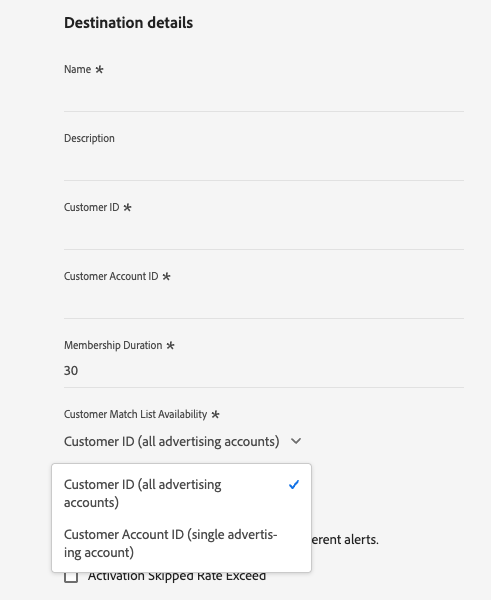

# [!DNL Microsoft Ads Customer Match] 接続 {#microsoft-ads-customer-match-destination}

>[!AVAILABILITY]
>
>この宛先コネクタは現在限定的に利用できます。 アクセス権を取得するには、アドビ担当者にお問い合わせください。

## 概要 {#overview}

[!DNL Microsoft Ads Customer Match]の宛先を使用して、電子メールアドレスで顧客を照合し、検索広告やオーディエンス広告を含む[!DNL Microsoft Advertising Network]全体で顧客と再エンゲージします。 [!DNL Microsoft Advertising] アカウントを[!DNL Real-Time CDP]にリンクして、Experience Platformから直接カスタマーマッチリストの作成と管理を自動化します。

## ユースケース {#use-cases}

[!DNL Microsoft Ads Customer Match]宛先を使用する方法とタイミングをより正確に把握するために、Adobe Experience Platformのお客様がこの機能を使用して解決できるユースケースの例を次に示します。

### パーソナライズされたオファーで既存顧客をリターゲティング {#use-case-1}

e コマース企業が、[!DNL Microsoft Search]および[!DNL Microsoft Audience Network]を通じて既存顧客にリーチし、過去の購入履歴や閲覧履歴に基づいてオファーをパーソナライズしたいと考えています。 自社のCRMからADOBE Experience Platformにメールアドレスを取り込み、自社のオフラインデータからオーディエンスを構築し、これらのオーディエンスを[!DNL Microsoft Ads Customer Match]に送信して、検索およびオーディエンス広告で使用することで、広告費を最適化することができます。

### 既存顧客への新製品のプロモーション {#use-case-2}

あるテクノロジー企業は、新製品を発売しました。以前に関連製品を購入した顧客の間で、認知度を高めたいのです。 メールアドレスを識別子としてCRM データベースからExperience Platformにアップロードします。 オーディエンスは、関連商品を所有する顧客に基づいて作成されます。 これらのオーディエンスは[!DNL Microsoft Ads Customer Match]に送信されるので、会社は[!DNL Microsoft Advertising Network]の現在の顧客や類似の顧客をターゲットにできます。

## サポートされている ID {#supported-identities}

[!DNL Microsoft Ads Customer Match]は、次の表に示すIDのアクティブ化をサポートしています。 [ID](/help/identity-service/features/namespaces.md) についての詳細情報。

| ターゲット ID | 説明 | 注意点 |
|---|---|---|
| `email` | プレーンテキストのメールアドレス | マッピング手順では、プレーンテキスト（ハッシュ化されていない）電子メールアドレスのみが&#x200B;**source** フィールドとしてサポートされます。 事前にハッシュ化されたソースフィールドはサポートされていません。 Experience Platformは、電子メールアドレスを[!DNL Microsoft Ads]に書き出す前に常にハッシュ化します。 |

{style="table-layout:auto"}

## サポートされるオーディエンス {#supported-audiences}

この節では、この宛先に書き出すことができるオーディエンスのタイプについて説明します。

| オーディエンスの由来 | サポートあり | 説明 |
|---------|----------|----------|
| [!DNL Segmentation Service] | ○ | Experience Platform [&#x200B; セグメント化サービス &#x200B;](../../../segmentation/home.md)を通じて生成されたオーディエンス。 |
| その他すべてのオーディエンスの生成元 | ○ | このカテゴリには、[!DNL Segmentation Service]を通じて生成されたオーディエンス以外のすべてのオーディエンスのオリジンが含まれます。 [様々なオーディエンスの起源](/help/segmentation/ui/audience-portal.md#customize)について読みます。 次に例を示します。 <ul><li> カスタムアップロードオーディエンス [がCSV ファイルからExperience Platformに](../../../segmentation/ui/audience-portal.md#import-audience)をインポートしました。</li><li> 類似オーディエンス， </li><li> 連合オーディエンス， </li><li> [!DNL Adobe Journey Optimizer]などの他のExperience Platform アプリで生成されたオーディエンス </li><li> その他。 </li></ul> |

{style="table-layout:auto"}

オーディエンスのデータタイプ別にサポートされるオーディエンス：

| オーディエンスのデータタイプ | サポートあり | 説明 | ユースケース |
|--------------------|-----------|-------------|-----------|
| [人物オーディエンス &#x200B;](/help/segmentation/types/people-audiences.md) | ○ | 顧客プロファイルにもとづいて、マーケティング施策の特定のグループをターゲットにすることができます。 | 買い物客やカートの放棄が多い |
| [&#x200B; アカウントオーディエンス &#x200B;](/help/segmentation/types/account-audiences.md) | × | アカウントベースドマーケティング戦略のために、特定の組織内の個人をターゲットにします。 | B2B マーケティング |
| [見込みオーディエンス &#x200B;](/help/segmentation/types/prospect-audiences.md) | × | まだ顧客ではないが、ターゲットオーディエンスと特徴を共有する個人をターゲットにします。 | サードパーティデータによる見込み顧客の開拓 |
| [&#x200B; データセットの書き出し](/help/catalog/datasets/overview.md) | × | [!DNL Adobe Experience Platform] データ レイクに保存されている構造化データのコレクション。 | レポート，データサイエンスワークフロー |

{style="table-layout:auto"}

## 書き出しのタイプと頻度 {#export-type-frequency}

宛先の書き出しのタイプと頻度について詳しくは、以下の表を参照してください。

| 項目 | タイプ | メモ |
|---------|----------|---------|
| 書き出しタイプ | **[!UICONTROL Audience export]** | [!DNL Microsoft Ads Customer Match]宛先で使用されている識別子（電子メールアドレス）を使用して、オーディエンスのすべてのメンバーを書き出しています。 |
| 書き出し頻度 | **[!UICONTROL Streaming]** | ストリーミングの宛先は常に、API ベースの接続です。オーディエンス評価に基づいて Experience Platform 内でプロファイルが更新されるとすぐに、コネクタは更新を宛先プラットフォームに送信します。[ストリーミングの宛先](/help/destinations/destination-types.md#streaming-destinations)の詳細についてはこちらを参照してください。 |

{style="table-layout:auto"}

## 前提条件 {#prerequisites}

オーディエンスデータを[!DNL Microsoft Ads]に送信するには、アクティブな[!DNL Microsoft Advertising] アカウントが必要です。 アカウントの作成について詳しくは、[Microsoft Advertising ドキュメント &#x200B;](https://help.ads.microsoft.com/#apex/ads/en/53090/0)を参照してください。

### 顧客マッチの条件に同意 {#accept-customer-match-terms}

この宛先を通じてオーディエンスをアクティブ化する前に、最初に[!DNL Microsoft Advertising] アカウントで顧客一致リストを手動で作成する必要があります。 この最初の手動作成は、Experience Platformから送信されたオーディエンスを自動作成できるようにするために、カスタマーマッチの利用条件に同意する必要があります。 この手順を完了しないと、オーディエンスをアクティベートする際にエラーが発生する可能性があります。

### 作業アカウント （MS Entra） IT管理者の承認 {#work-account-admin-approval}

Microsoftの作業アカウント （Microsoft Entra アカウントとも呼ばれます）で認証する場合、組織のIT管理者は、[!DNL Microsoft Advertising]に接続する前に承認を付与する必要がある場合があります。

作業アカウントを使用して認証を試みると、**承認必須** ページにリダイレクトされる可能性があります。 このページでは、アプリをリンクする理由を要求し、`ads.manage`を含む必要な権限を一覧表示します。 リクエストを送信すると、IT管理者はそれをレビューするための通知を受け取ります。 リクエストが送信されたことを確認するメールも届きます。

IT管理者がAzure ポータルでリクエストを承認したら、Experience Platformに戻り、作業アカウントを使用して認証できます。 ガイダンスについては、Microsoftのドキュメントを参照してください。

* [管理者の同意要求を確認してアクションを実行](https://learn.microsoft.com/en-us/entra/identity/enterprise-apps/review-admin-consent-requests)
* [管理者同意ワークフローの設定](https://learn.microsoft.com/en-us/entra/identity/enterprise-apps/configure-admin-consent-workflow)
* [&#x200B; ユーザーがアプリケーションに同意する方法を設定](https://learn.microsoft.com/en-us/entra/identity/enterprise-apps/configure-user-consent)

IT管理者がまだリクエストを承認していない場合、認証は次のエラーで失敗します：`AADSTS650052: The app needs access to a service ('https://ads.microsoft.com') that your organization has not subscribed to or enabled. Contact your IT Admin to review the configuration of your service subscriptions.`

### アカウント設定 {#account-configuration}

宛先を設定する際には、次の情報を指定する必要があります。

* [!UICONTROL Customer ID]: [!DNL Microsoft Ads]のお客様ID （CID） （整数形式）。 お客様IDの検索方法については、[Microsoft Advertising ドキュメント &#x200B;](https://learn.microsoft.com/en-us/advertising/guides/get-started?view=bingads-13#get-ids)を参照してください。
* [!UICONTROL Customer Account ID]: [!DNL Microsoft Ads]のお客様アカウント ID。 お客様アカウント IDの検索方法については、[Microsoft Advertising ドキュメント &#x200B;](https://learn.microsoft.com/en-us/advertising/guides/get-started?view=bingads-13#get-ids)を参照してください。

## 宛先への接続 {#connect}

>[!IMPORTANT]
>
>宛先に接続するには、**[!UICONTROL View Destinations]**&#x200B;および&#x200B;**[!UICONTROL Manage Destinations]** [&#x200B; アクセス制御権限](/help/access-control/home.md#permissions)が必要です。 [アクセス制御の概要](/help/access-control/ui/overview.md)を参照するか、製品管理者に問い合わせて必要な権限を取得してください。

この宛先に接続するには、[宛先設定のチュートリアル](../../ui/connect-destination.md)の手順に従ってください。

### 宛先の詳細の入力 {#parameters}

>[!CONTEXTUALHELP]
>id="platform_destinations_microsoft_ads_cm_customer_id"
>title="顧客 ID"
>abstract="Microsoft Advertising顧客 ID （別名：管理者アカウント ID）。 これは、Microsoft Advertisingの最上位の識別子で、その下に複数の広告主アカウント（顧客アカウント ID）を持つことができます。"
>additional-url="https://learn.microsoft.com/en-us/advertising/guides/get-started?view=bingads-13#get-ids" text="顧客 ID を見つける"

>[!CONTEXTUALHELP]
>id="platform_destinations_microsoft_ads_cm_customer_account_id"
>title="顧客アカウント ID"
>abstract="Microsoft Advertising顧客アカウント ID （広告主アカウント ID とも呼ばれます）。 これにより、顧客 ID で特定の広告主アカウントが識別されます。"
>additional-url="https://learn.microsoft.com/en-us/advertising/guides/get-started?view=bingads-13#get-ids" text="顧客アカウント ID を見つける"

>[!CONTEXTUALHELP]
>id="platform_destinations_microsoft_ads_cm_membership_duration"
>title="メンバーシップの期間"
>abstract="ユーザーが顧客一致リストに残る日数。 指定できる値は、1 ～ 390 日です。"

>[!CONTEXTUALHELP]
>id="platform_destinations_microsoft_ads_cm_list_availability"
>title="顧客一致リストの可用性"
>abstract="顧客一致リストを 1 つの広告主アカウントで使用するか、管理者アカウントの下のすべてのアカウントで使用するかを選択します。 顧客 ID を選択すると、顧客 ID の下にあるすべての広告主アカウントでリストを使用できるようになります。 顧客アカウント ID を選択して、特定の顧客アカウント ID にリストを制限します。"
>additional-url="https://help.ads.microsoft.com/apex/index/3/en/56727" text="Microsoft Advertisingでのオーディエンスリストの共有について詳しく説明します"

この宛先を[設定](../../ui/connect-destination.md)するとき、次の情報を指定する必要があります。

* **[!UICONTROL Name]**：今後この宛先を認識する際に使用する名前。
* **[!UICONTROL Description]**：今後この宛先を特定するのに役立つ説明です。
* **[!UICONTROL Customer ID]**：お客様の[!DNL Microsoft Ads]の顧客ID （CID）。 お客様IDの検索方法については、[Microsoft Advertising ドキュメント &#x200B;](https://learn.microsoft.com/en-us/advertising/guides/get-started?view=bingads-13#get-ids)を参照してください。
* **[!UICONTROL Customer Account ID]**: [!DNL Microsoft Ads]のお客様アカウント ID。 お客様アカウント IDの検索方法については、[Microsoft Advertising ドキュメント &#x200B;](https://learn.microsoft.com/en-us/advertising/guides/get-started?view=bingads-13#get-ids)を参照してください。
* **[!UICONTROL Membership Duration]**: ユーザーがカスタマーマッチリストに残っている日数。 指定できる値は、1 ～ 390 日です。
* **[!UICONTROL Customer Match List Availability]**：顧客マッチリストの可用性を選択します。 [!DNL Microsoft Advertising]では、顧客IDは、その下に複数の顧客アカウント ID （広告主アカウント）を持つことができます。 リストを顧客IDのすべての広告主アカウントで利用できるようにするには、**[!UICONTROL Customer ID (all advertising accounts)]**&#x200B;を選択します。上記で指定した特定の顧客アカウント IDにリストを制限するには、**[!UICONTROL Customer Account ID (single advertising account)]**&#x200B;を選択します。 詳しくは、[Microsoft Advertising ドキュメント &#x200B;](https://help.ads.microsoft.com/apex/index/3/en/56727)を参照してください。

  Microsoft Ads Customer Matchの宛先の宛先の詳細フィールドを示す

### アラートの有効化 {#enable-alerts}

アラートを有効にすると、宛先へのデータフローのステータスに関する通知を受け取ることができます。リストからアラートを選択して、データフローのステータスに関する通知を受け取るよう登録します。アラートについて詳しくは、[UI を使用した宛先アラートの購読](../../ui/alerts.md)についてのガイドを参照してください。

宛先接続の詳細の提供が完了したら、**[!UICONTROL Next]**&#x200B;を選択します。

## この宛先に対してオーディエンスをアクティブ化 {#activate}

>[!IMPORTANT]
>
>* データをアクティブ化するには、**[!UICONTROL View Destinations]**、**[!UICONTROL Activate Destinations]**、**[!UICONTROL View Profiles]**&#x200B;および&#x200B;**[!UICONTROL View Segments]** [&#x200B; アクセス制御権限](/help/access-control/home.md#permissions)が必要です。 [アクセス制御の概要](/help/access-control/ui/overview.md)を参照するか、製品管理者に問い合わせて必要な権限を取得してください。
>* *ID*&#x200B;を宛先にエクスポートするには、**[!UICONTROL View Identity Graph]** [&#x200B; アクセス制御権限](/help/access-control/home.md#permissions)が必要です。  {width="100" zoomable="yes"}

この宛先にオーディエンスをアクティブ化する手順については、[ストリーミングオーディエンス書き出し宛先に対するオーディエンスデータのアクティブ化](../../ui/activate-segment-streaming-destinations.md)を参照してください。

### マッピング {#mapping}

**[!UICONTROL Mapping]** ステップでは、ソースプロファイルの電子メール IDを[!DNL Microsoft Ads Customer Match]のターゲット IDにマッピングする必要があります。

* **Source フィールド**: プロファイルからメール IDをマッピングするソースフィールドとして`IdentityMap: Email`を選択します。 または、`personalEmail.address`などのXDM属性をソースフィールドとして選択することもできます。
* **ターゲットフィールド**: ターゲットフィールドとして`Identity: email`を選択します。

>[!IMPORTANT]
>
>プレーンテキスト（ハッシュ化されていない）電子メールアドレスを&#x200B;**ソース** フィールドとしてマッピングする必要があります。 `Emails (SHA256, lowercased)`などの事前にハッシュ化されたソース IDはサポートされていません。 Experience Platformは、電子メールアドレスを[!DNL Microsoft Ads]に書き出す前に常にハッシュ化します。

ID電子メールにマッピングされたIdentityMap電子メールを含むマッピングステップを示す

## 書き出したデータ {#exported-data}

データがに正常に [!DNL Microsoft Ads Customer Match] の宛先に書き出されたかどうかを確認するには、[!DNL Microsoft Advertising] アカウントを確認します。 アクティベーションが成功した場合、オーディエンスは顧客マッチリストとしてアカウントに入力されます。

## その他のリソース {#additional-resources}

詳しくは、[Microsoft Advertising ヘルプセンター](https://help.ads.microsoft.com/)を参照してください。
