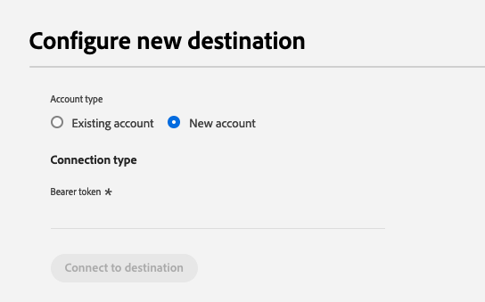
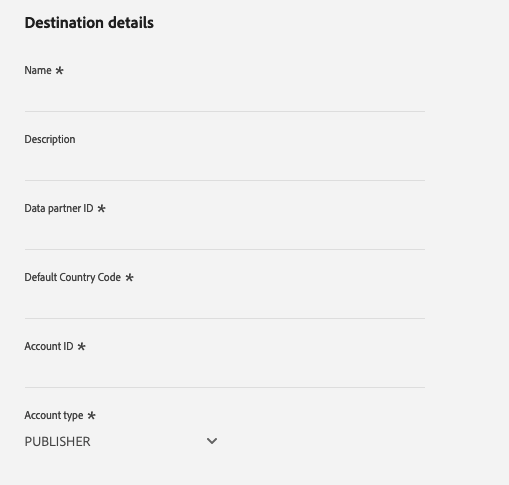

# PubMatic Connectの宛先 {#pubmatic-connect}

## 概要 {#overview}

将来のプログラマティック デジタル マーケティング supply chainを提供することで、顧客価値を最大化するために[!DNL PubMatic Connect]を使用します。 [!DNL PubMatic Connect]は、プラットフォーム技術と専用サービスを組み合わせて、在庫とデータのパッケージ化および取引方法を強化します。

PubMatic Connect プラットフォームにオーディエンスデータを送信できる宛先は2つあります。 彼らは彼らの機能的にわずかに異なります：

1. PubMatic Connect

   最初のアクティブ化中、この宛先は自動的にPubMatic プラットフォームにオーディエンスを登録し、マッピングに内部[!DNL Adobe Experience Platform] IDを使用します。

2. PubMatic Connect （カスタムオーディエンス ID マッピング）

   この宛先では、アクティベーションワークフロー中にマッピング IDを手動で追加することを選択できます。 PubMatic プラットフォームの既存のオーディエンスにデータを送信する必要がある場合、またはカスタムの「Source Audience ID」が必要な場合は、この宛先を使用します。

>[!IMPORTANT]
>
> 宛先コネクタとドキュメント ページは、[!DNL PubMatic] チームによって作成および管理されます。 問い合わせや更新のリクエストについては、`support@pubmatic.com`から直接お問い合わせください。

## ユースケース {#use-cases}

[!DNL PubMatic Connect]宛先を使用する方法とタイミングをより理解しやすくするために、[!DNL Adobe Experience Platform]のお客様がこの宛先を使用して解決できる使用例を次に示します。

### モバイル、web、CTV プラットフォームの利用者をターゲットにする {#targeting}

メディア企業やデータプロバイダーは、モバイルプラットフォーム、web プラットフォーム、CTV プラットフォームのターゲットユーザーに対して、幅広い識別子を使用して、[!DNL Adobe Experience Platform]から[!DNL PubMatic Connect]までのオーディエンスを送信したいと考えています。

## 前提条件 {#prerequisites}

アカウントが正しく設定され、オーディエンスセグメントのオンボーディングがサポートされていることを確認するには、[!DNL PubMatic] アカウントマネージャーにお問い合わせください。 また、この宛先を使用し、セットアップ中にサポートを提供するために、関連するすべての詳細を確認します。

## サポートされている ID {#supported-identities}

[!DNL PubMatic Connect]は、次の表に示すIDのアクティブ化をサポートしています。 [ID](/help/identity-service/features/namespaces.md) についての詳細情報。

| ターゲット ID | 説明 | 注意点 |
| --------------- | ------------------------ | ------------------------------------------------------------------------------- |
| GAID | GOOGLE ADVERTISING ID | ソース IDがGAID名前空間である場合は、GAID ターゲット IDを選択します。 |
| IDFA | Apple の広告主 ID | ソース IDがIDFA名前空間の場合は、IDFA ターゲット IDを選択します。 |
| extern_id | カスタムユーザーID | ソース IDがカスタム名前空間である場合は、このターゲット IDを選択します。 |

{style="table-layout:auto"}

## サポートされるオーディエンス {#supported-audiences}

この節では、この宛先に書き出すことができるオーディエンスのタイプについて説明します。

| オーディエンスの由来 | サポートあり | 説明 |
|---------|----------|----------|
| [!DNL Segmentation Service] | ○ | Experience Platform [&#x200B; セグメント化サービス &#x200B;](../../../segmentation/home.md)を通じて生成されたオーディエンス。 |
| その他すべてのオーディエンスの生成元 | × | このカテゴリには、[!DNL Segmentation Service]を通じて生成されたオーディエンス以外のすべてのオーディエンスのオリジンが含まれます。 [様々なオーディエンスの起源](/help/segmentation/ui/audience-portal.md#customize)について読みます。 次に例を示します。 <ul><li> カスタムアップロードオーディエンス [がCSV ファイルからExperience Platformに](../../../segmentation/ui/audience-portal.md#import-audience)をインポートしました。</li><li> 類似オーディエンス， </li><li> 連合オーディエンス， </li><li> [!DNL Adobe Journey Optimizer]などの他のExperience Platform アプリで生成されたオーディエンス </li><li> その他。 </li></ul> |

{style="table-layout:auto"}

オーディエンスのデータタイプ別にサポートされるオーディエンス：

| オーディエンスのデータタイプ | サポートあり | 説明 | ユースケース |
|--------------------|-----------|-------------|-----------|
| [人物オーディエンス &#x200B;](/help/segmentation/types/people-audiences.md) | ○ | 顧客プロファイルにもとづいて、マーケティング施策の特定のグループをターゲットにすることができます。 | 買い物客やカートの放棄が多い |
| [&#x200B; アカウントオーディエンス &#x200B;](/help/segmentation/types/account-audiences.md) | × | アカウントベースドマーケティング戦略のために、特定の組織内の個人をターゲットにします。 | B2B マーケティング |
| [見込みオーディエンス &#x200B;](/help/segmentation/types/prospect-audiences.md) | × | まだ顧客ではないが、ターゲットオーディエンスと特徴を共有する個人をターゲットにします。 | サードパーティデータによる見込み顧客の開拓 |
| [&#x200B; データセットの書き出し](/help/catalog/datasets/overview.md) | × | [!DNL Adobe Experience Platform] データ レイクに保存されている構造化データのコレクション。 | レポート，データサイエンスワークフロー |

{style="table-layout:auto"}

## 書き出しのタイプと頻度 {#export-type-frequency}

宛先の書き出しのタイプと頻度について詳しくは、以下の表を参照してください。

| 項目 | タイプ | メモ |
| ---------------- | ------------------------------- | ---------------------------------------------------------------------------------------------------------------------------------------------------------------------------------------------------------------------------------------------------------------------------------------------------------------------------- |
| 書き出しタイプ | **[!UICONTROL Segment export]** | PubMatic Connectの宛先で使用されている識別子（名前、電話番号など）を使用して、セグメント（オーディエンス）のすべてのメンバーを書き出します。 |
| 書き出し頻度 | **[!UICONTROL Streaming]** | ストリーミングの宛先は常に、API ベースの接続です。セグメント評価に基づいてExperience Platformでプロファイルが更新されると、コネクターは更新をダウンストリームの宛先プラットフォームに送信します。 詳しくは、[ストリーミングの宛先](/help/destinations/destination-types.md#streaming-destinations)を参照してください。 |

{style="table-layout:auto"}

## 宛先への接続 {#connect}

>[!IMPORTANT]
>
> 宛先に接続するには、**[!UICONTROL Manage Destinations]** [&#x200B; アクセス制御権限](/help/access-control/home.md#permissions)が必要です。 詳しくは、[アクセス制御の概要](/help/access-control/ui/overview.md)または製品管理者に問い合わせて、必要な権限を取得してください。

この宛先に接続するには、[宛先設定のチュートリアル](../../ui/connect-destination.md)の手順に従ってください。宛先の設定ワークフローで、以下の 2 つの節でリストされているフィールドに入力します。

### 宛先に対する認証 {#authenticate}

宛先に対して認証を行うには、必須フィールドに入力し、**[!UICONTROL Connect to destination]**&#x200B;を選択します。

- **[!UICONTROL Bearer token]**: ベアラートークンを入力して、宛先に対する認証を行います。

### 宛先の詳細を入力 {#destination-details}

宛先の詳細を設定するには、以下の必須フィールドとオプションフィールドに入力します。UI のフィールドの横のアスタリスクは、そのフィールドが必須であることを示します。

- **[!UICONTROL Name]**：今後この宛先を認識する際に使用する名前。
- **[!UICONTROL Description]**：今後この宛先を特定するのに役立つ説明です。
- **[!UICONTROL Data partner ID]**：この統合のために[!DNL PubMatic] アカウントで設定されたデータパートナーID。
- **[!UICONTROL Default country code]**: プロファイルで指定されていない場合にすべてのIDに適用する既定の国コード。
- **[!UICONTROL Account ID]**: [!DNL PubMatic Connect] アカウント ID。
- **[!UICONTROL Account type]**: [!DNL PubMatic] プラットフォームアカウントのアカウントタイプ。 選択する方法について質問がある場合は、[!DNL PubMatic] アカウント マネージャーにお問い合わせください。 使用できる選択肢は次のとおりです。
   - [!UICONTROL PUBLISHER]
   - [!UICONTROL DEMAND_PARTNER]
   - [!UICONTROL BUYER]

### アラートの有効化 {#enable-alerts}

アラートを有効にすると、宛先へのデータフローのステータスに関する通知を受け取ることができます。リストからアラートを選択して、データフローのステータスに関する通知を受け取るよう登録します。アラートについて詳しくは、[UI を使用した宛先アラートの購読](../../ui/alerts.md)についてのガイドを参照してください。

宛先接続の詳細の提供が完了したら、**[!UICONTROL Next]**&#x200B;を選択します。

## この宛先に対してオーディエンスをアクティブ化 {#activate}

>[!IMPORTANT]
>
> - データをアクティブ化するには、**[!UICONTROL View Destinations]**、**[!UICONTROL Activate Destinations]**、**[!UICONTROL View Profiles]**&#x200B;および&#x200B;**[!UICONTROL View Segments]** [&#x200B; アクセス制御権限](/help/access-control/home.md#permissions)が必要です。 [アクセス制御の概要](/help/access-control/ui/overview.md)を参照するか、製品管理者に問い合わせて必要な権限を取得してください。
>
> - _ID_&#x200B;をエクスポートするには、**[!UICONTROL View Identity Graph]** [&#x200B; アクセス制御権限](/help/access-control/home.md#permissions)が必要です。  {width="100" zoomable="yes"}

この宛先に対してオーディエンスをアクティブ化する手順については、[&#x200B; ストリーミング宛先に対するオーディエンスのアクティブ化](/help/destinations/ui/activate-segment-streaming-destinations.md)を参照してください。

### 属性と ID のマッピング {#map}

ソースフィールドの選択：

- 識別子（通常はIDFAやカスタム ID名前空間などの名前空間）を選択します。

ターゲットフィールドの選択：

- この手順で正しいUIDの種類を確認するには、[!DNL PubMatic] アカウント マネージャーにお問い合わせください。
- 最初の手順で選択した識別子に一致する[!DNL PubMatic UID] タイプ番号を選択します。

### オーディエンスのスケジュール {#audience-scheduling}

PubMatic Connect （カスタムオーディエンス ID マッピング）宛先を使用している場合は、PubMatic プラットフォームの「Source Audience ID」に対応する各オーディエンスのマッピング IDを指定する必要があります。

## 書き出されたデータ／データ書き出しの検証 {#exported-data}

[!DNL PubMatic] UIを使用して、データが正しくプッシュされたかどうか、およびセグメントが使用可能かどうかを確認します。 データをプッシュしてから[!DNL PubMatic] UIを更新するには、最大で24時間かかる場合があります。

## データの使用とガバナンス {#data-usage-governance}

[!DNL Adobe Experience Platform] のすべての宛先は、データを処理する際のデータ使用ポリシーに準拠しています。[!DNL Adobe Experience Platform] がどのように データガバナンスを実施するかについて詳しくは、[データガバナンスの概要](/help/data-governance/home.md)を参照してください。
