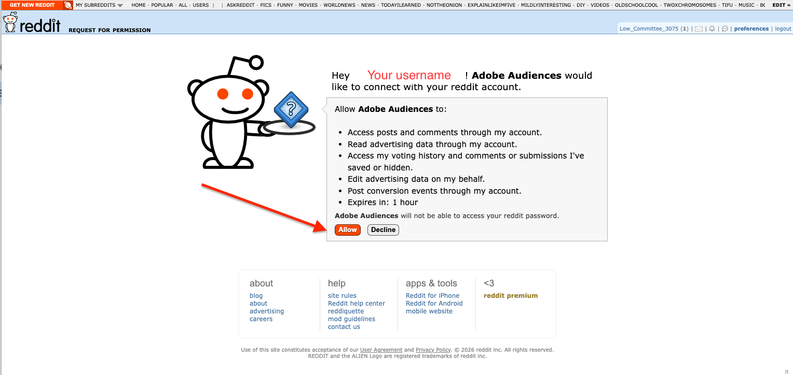
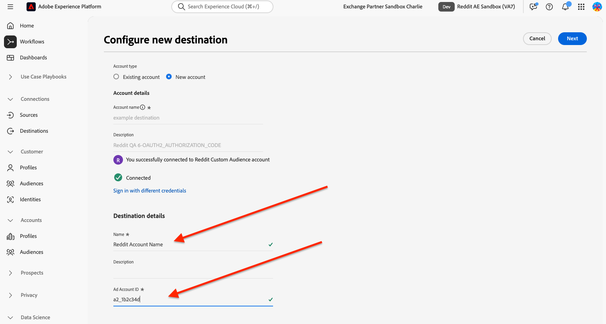

# [!DNL Reddit Custom Audience] 接続 {#reddit-custom-audience-connection}

## 概要 {#overview}

[!DNL Reddit Ads]自分の情熱や問題をリアルタイムで積極的に探求している人々にブランドを接続します。 [!DNL Reddit Ads]は、意図の高いコミュニティ主導の会話と、柔軟な広告フォーマットおよび堅牢なターゲティングを組み合わせることで、広告主がエンゲージメントの高いオーディエンスにリーチし、パフォーマンス成果を促進し、オンラインで文化を形成するコミュニティから直接学習することを支援します。

このガイドは、[!DNL Adobe Experience Platform]を使用して[!DNL Reddit Ads]にオーディエンスを送信する広告主およびメディアチーム向けです。 アカウントの連携、IDのマッピング、オーディエンスのアクティベーションに必要なことを説明します。

>[!IMPORTANT]
>
>この宛先コネクタとドキュメント ページは、[!DNL Reddit] チームによって作成および管理されています。 問い合わせや更新のリクエストについては、<adsapi-partner-support@reddit.com>から直接お問い合わせください。

## ユースケース {#use-cases}

[!DNL Reddit Custom Audience]宛先を使用する方法とタイミングをより理解しやすくするために、[!DNL Adobe Experience Platform]のお客様がこの宛先を使用して解決できるユースケースの例を次に示します。

### パーソナライズされたオファーによる既存顧客のリターゲティング {#use-case-1}

オンラインのretailerでは、ソーシャルメディアを通じて既存顧客にリーチし、過去の注文にもとづいてパーソナライズされたオファーを提供したいと考えています。 オンライン retailerでは、独自のCRMから[!DNL Adobe Experience Platform]に電子メールアドレスとデバイス ID （IDFAおよびGAID）を取り込み、独自のオフラインデータからオーディエンスを構築し、これらのオーディエンスを[!DNL Reddit Ads]に送信して、広告費を最適化できます。

## 前提条件 {#prerequisites}

この宛先を設定する前に、次の前提条件を満たしていることを確認してください。

* カスタムオーディエンスと顧客リストの使用が許可されている[!DNL Reddit Ads] アカウント。
* 接続を認証する権限。 これは、[!DNL Reddit]にログインし、広告アカウントの代理で[!DNL Experience Platform]のオーディエンスを管理するためのアクセス権を承認できるユーザーである必要があります。
* [!DNL Reddit]広告アカウント ID: オーディエンスが作成される広告アカウントの識別子。 広告アカウント IDは[ アカウント ](https://ads.reddit.com/accounts)で見つけることができます。 例：`a2_1b2c34d`。

## サポートされている ID {#supported-identities}

[!DNL Reddit Custom Audience]は、次の表に示すIDのアクティブ化をサポートしています。 [ID](/help/identity-service/features/namespaces.md) についての詳細情報。

| ターゲット ID | 説明 | 注意点 |
| --- | --- | --- |
| email_lc_sha256 | SHA256 アルゴリズムでハッシュ化されたメールアドレス | プレーンテキストとSHA256 ハッシュ化された電子メールアドレスの両方が[!DNL Adobe Experience Platform]でサポートされています。 ソースフィールドにハッシュ化されていない属性が含まれている場合は、**[!UICONTROL Apply transformation]** オプションをチェックして、[!DNL Platform]がアクティベーション時にデータを自動的にハッシュします。 |
| メイド | 広告主向けのGoogle Advertising IDまたはApple ID。両方ともSHA256 アルゴリズムでハッシュ化されています | GAIDまたはIDFAを&#x200B;**maid**&#x200B;にマッピングします。 ソースフィールドにハッシュ化されていない属性が含まれている場合は、**[!UICONTROL Apply transformation]** オプションをチェックして、[!DNL Platform]がアクティベーション時にデータを自動的にハッシュします。 |

{style="table-layout:auto"}

## サポートされるオーディエンス {#supported-audiences}

この節では、この宛先に書き出すことができるオーディエンスのタイプについて説明します。

| オーディエンスの由来 | サポートあり | 説明 |
| --- | --- | --- |
| [!DNL Segmentation Service] | ○ | [!DNL Experience Platform] [ セグメント化サービス ](../../../segmentation/home.md)を通じて生成されたオーディエンス。 |
| その他すべてのオーディエンスの生成元 | ○ | このカテゴリには、セグメンテーションサービスを通じて生成されたオーディエンス以外のすべてのオーディエンスのオリジンが含まれます。 [様々なオーディエンスの起源](/help/segmentation/ui/audience-portal.md#customize)について読みます。 |

{style="table-layout:auto"}

データタイプ別にサポートされるオーディエンス：

| オーディエンスのデータタイプ | サポートあり | 説明 | ユースケース |
| --- | --- | --- | --- |
| [人物オーディエンス ](/help/segmentation/types/people-audiences.md) | ○ | 顧客プロファイルにもとづいて、マーケティング施策の特定のグループをターゲットにすることができます。 | 買い物客やカートの放棄が多い |
| [ アカウントオーディエンス ](/help/segmentation/types/account-audiences.md) | × | アカウントベースドマーケティング戦略のために、特定の組織内の個人をターゲットにします。 | B2B マーケティング |
| [見込みオーディエンス ](/help/segmentation/types/prospect-audiences.md) | × | まだ顧客ではないが、ターゲットオーディエンスと特徴を共有する個人をターゲットにします。 | サードパーティデータによる見込み顧客の開拓 |
| [ データセットの書き出し](/help/catalog/datasets/overview.md) | × | [!DNL Adobe Experience Platform] データ レイクに保存されている構造化データのコレクション。 | レポート，データサイエンスワークフロー |

{style="table-layout:auto"}

## 書き出しのタイプと頻度 {#export-type-frequency}

宛先の書き出しのタイプと頻度について詳しくは、以下の表を参照してください。

| 項目 | タイプ | メモ |
| --- | --- | --- |
| 書き出しタイプ | **[!UICONTROL Audience export]** | [!DNL Reddit Custom Audience] 宛先で使用される識別子（氏名、電話番号など）を使用して、オーディエンスのすべてのメンバーを書き出します。 |
| 書き出し頻度 | **[!UICONTROL Streaming]** | ストリーミングの宛先は常に、API ベースの接続です。オーディエンス評価に基づいて Experience Platform 内でプロファイルが更新されるとすぐに、コネクタは更新を宛先プラットフォームに送信します。詳しくは、[ストリーミングの宛先](/help/destinations/destination-types.md#streaming-destinations)を参照してください。 |

{style="table-layout:auto"}

## 宛先への接続 {#connect}

>[!IMPORTANT]
>
>宛先に接続するには、**[!UICONTROL View Destinations]**&#x200B;および&#x200B;**[!UICONTROL Manage Destinations]** [ アクセス制御権限](/help/access-control/home.md#permissions)が必要です。 詳しくは、[アクセス制御の概要](/help/access-control/ui/overview.md)または製品管理者に問い合わせて、必要な権限を取得してください。

この宛先に接続するには、[宛先設定のチュートリアル](../../ui/connect-destination.md)の手順に従ってください。宛先の設定ワークフローで、以下の 2 つのセクションにリストされているフィールドに入力します。

### 宛先に対する認証 {#authenticate}

宛先に対して認証を行うには、必須フィールドに入力し、**[!UICONTROL Connect to destination]**&#x200B;を選択します。


[!DNL Reddit]でログインするようにリダイレクトされます。 要求された権限を確認したら、**[!UICONTROL Allow]**&#x200B;を選択して、[!DNL Experience Platform]が広告アカウントの代理でオーディエンスを作成し、メンバーシップを更新できるようにします。



### 宛先の詳細を入力 {#destination-details}

宛先の詳細を設定するには、以下の必須フィールドとオプションフィールドに入力します。UI のフィールドの横のアスタリスクは、そのフィールドが必須であることを示します。



* **[!UICONTROL Name]**：この宛先を識別する名前。
* **[!UICONTROL Description]**：この宛先の特定に役立つ説明です。
* **[!UICONTROL Ad Account ID]**: [!DNL Reddit]の広告アカウント ID。

### アラートの有効化 {#enable-alerts}

アラートを有効にすると、宛先へのデータフローのステータスに関する通知を受け取ることができます。リストからアラートを選択して、データフローのステータスに関する通知を受け取るよう登録します。アラートについて詳しくは、[UI を使用した宛先アラートの購読](../../ui/alerts.md)についてのガイドを参照してください。

宛先接続の詳細の提供が完了したら、**[!UICONTROL Next]**&#x200B;を選択します。

## この宛先に対してオーディエンスをアクティブ化 {#activate}

>[!IMPORTANT]
>
>* データをアクティブ化するには、**[!UICONTROL View Destinations]**、**[!UICONTROL Activate Destinations]**、**[!UICONTROL View Profiles]**&#x200B;および&#x200B;**[!UICONTROL View Segments]** [ アクセス制御権限](/help/access-control/home.md#permissions)が必要です。 [アクセス制御の概要](/help/access-control/ui/overview.md)を参照するか、製品管理者に問い合わせて必要な権限を取得してください。
>* *ID*&#x200B;をエクスポートするには、**[!UICONTROL View Identity Graph]** [ アクセス制御権限](/help/access-control/home.md#permissions)が必要です。<br> {width="100" zoomable="yes"}

この宛先にオーディエンスをアクティベートする手順は、[ストリーミングオーディエンスの書き出し宛先へのプロファイルとオーディエンスのアクティベート](/help/destinations/ui/activate-segment-streaming-destinations.md)を参照してください。

### 属性と ID のマッピング {#map}

ユースケースに応じて、次のターゲット ID名前空間をマッピングする必要があります。

| ソースフィールド | ターゲットフィールド | メモ |
| --- | --- | --- |
| 電子メール（プレーンテキストまたはハッシュ化） | email_lc_sha256 | ソースフィールドはハッシュ化またはハッシュ解除できます。 [!DNL Reddit]はハッシュ化された値のみを受け入れます。 **[!UICONTROL Apply transformation]**&#x200B;が送信前に電子メールをハッシュするように、[!DNL Experience Platform]を有効にします。 |
| MAID （プレーンテキストまたはハッシュ化） | メイド | ソースフィールドはハッシュ化またはハッシュ解除できます。 [!DNL Reddit]はハッシュ化された値のみを受け入れます。 **[!UICONTROL Apply transformation]**&#x200B;が送信前に値をハッシュするように、[!DNL Experience Platform]を有効にします。 |

少なくとも1つのIDをマッピングする必要があります。


## 書き出されたデータ／データ書き出しの検証 {#exported-data}

オーディエンスをアクティブ化すると、[!DNL Reddit] Ads Manager アカウントにオーディエンスが表示されます。

[!DNL Reddit]で新しく作成されたオーディエンスは、保留状態で表示されます。 データフローの実行とプロファイルのエクスポートが完了すると、[!DNL Reddit]は[!DNL Reddit]人のユーザーに対してプロファイルを照合します。 データが処理されると、オーディエンスのステータスが&#x200B;**[!UICONTROL Valid]**&#x200B;に変わります。 オーディエンスサイズが有効と見なすには、[1,000 ユーザー以上](https://ads-api.reddit.com/docs/v3/manage-customer-lists)に達する必要があります。 必要なサイズを満たさないオーディエンスは&#x200B;**[!UICONTROL Invalid]**&#x200B;として表示されます。


次に、[!DNL Reddit]に送信されたペイロードの例を示します。

```json
{
  "data": {
    "action_type": "ADD",
    "column_order": [
      "EMAIL_SHA256",
      "MAID_SHA256"
    ],
    "user_data": [
      [
        "d7ef2e7b2a3663c25284a3d6d13b1ca727fc8c659474b81afe0cec997a4737d2",
        "510870d7b3e47a28a2b2f3aef27a4c81aab0b2eefda27dea50bc4c991d9e5435"
      ]
    ]
  }
}
```

詳細については、[Reddit API ドキュメント ](https://ads-api.reddit.com/docs/v3/operations/Update%20Custom%20Audience%20Users)を参照してください。

## データの使用とガバナンス {#data-usage-governance}

[!DNL Adobe Experience Platform] のすべての宛先は、データを処理する際のデータ使用ポリシーに準拠しています。[!DNL Adobe Experience Platform] がどのように データガバナンスを実施するかについて詳しくは、[データガバナンスの概要](/help/data-governance/home.md)を参照してください。

## その他のリソース {#additional-resources}

カスタムオーディエンスエンドポイントがどのように機能するかについては、[Reddit API ドキュメント ](https://ads-api.reddit.com/docs/v3/operations/Update%20Custom%20Audience%20Users)を参照してください。
