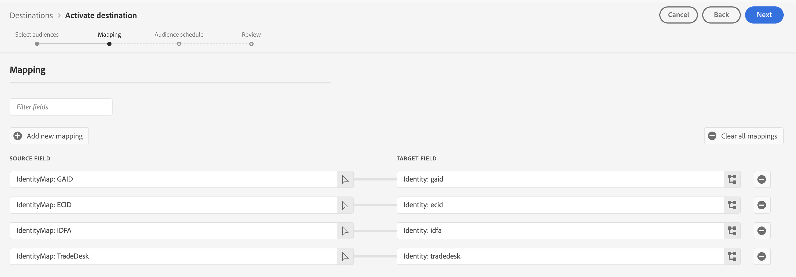

# [!DNL The Trade Desk] 接続

## 概要 {#overview}

この宛先コネクタを使用して、プロファイル データを[!DNL The Trade Desk]に送信します。 このコネクタは、[!DNL The Trade Desk] ファーストパーティエンドポイントにデータを送信します。 [!DNL Adobe Experience Platform]と[!DNL The Trade Desk]の間の統合では、[!DNL The Trade Desk] サードパーティ エンドポイントへのデータの書き出しはサポートされていません。

[!DNL The Trade Desk]は、広告バイヤー向けのセルフサービス プラットフォームです。ディスプレイ、ビデオ、モバイルのインベントリ ソースをまたいで、リターゲティングとオーディエンスをターゲットにしたデジタルキャンペーンを実行できます。

プロファイルデータを[!DNL The Trade Desk]に送信するには、このページの次の節で説明しているように、まず宛先に接続する必要があります。

## ユースケース {#use-cases}

マーケターとして、[!DNL Trade Desk IDs]またはデバイス IDから構築されたオーディエンスを使用して、リターゲティングまたはオーディエンスをターゲットにしたデジタルキャンペーンを作成できるようにしたいと考えています。

## サポートされている ID {#supported-identities}

[!DNL The Trade Desk]は、次の表に示すIDに基づいてオーディエンスをアクティブ化することをサポートしています。 [ID](/help/identity-service/features/namespaces.md) についての詳細情報。

以下は、[!DNL The Trade Desk]宛先でサポートされているIDです。 これらのIDを使用して、[!DNL The Trade Desk]に対するオーディエンスをアクティブ化します。

以下の表のすべてのIDは、アクティベーション時に事前設定され、自動的にマッピングされます。 アクティベーションワークフローでこれらのマッピングを手動で設定する必要はありません。

| ターゲット ID | 説明 | 注意点 |
|---|---|---|
| GAID | GOOGLE ADVERTISING ID | GAIDがプロファイルに存在する場合にアクティブ化されます。 |
| IDFA | Apple の広告主 ID | IDFAがプロファイルに存在する場合にアクティブ化されます。 |
| ECID | Experience Cloud ID | ECIDを表す名前空間。 この名前空間は、「Adobe Marketing Cloud ID」、「[!DNL Adobe Experience Cloud] ID」、「[!DNL Adobe Experience Platform] ID」というエイリアスでも参照できます。 詳しくは、[ECID](/help/identity-service/features/ecid.md)に関する次のドキュメントを参照してください。 |
| [!DNL Tradedesk] | [!DNL The Trade Desk] プラットフォームの[!DNL TDID] | プロファイルにECIDがあり、ECIDとTrade Desk ID マッピングがExperience Platformに存在する場合にアクティブ化されます。 |

{style="table-layout:auto"}

## サポートされるオーディエンス {#supported-audiences}

この節では、この宛先に書き出すことができるオーディエンスのタイプについて説明します。

| オーディエンスの由来 | サポートあり | 説明 |
|---------|----------|----------|
| [!DNL Segmentation Service] | ○ | Experience Platform [&#x200B; セグメント化サービス &#x200B;](../../../segmentation/home.md)を通じて生成されたオーディエンス。 |
| その他すべてのオーディエンスの生成元 | ○ | このカテゴリには、[!DNL Segmentation Service]を通じて生成されたオーディエンス以外のすべてのオーディエンスのオリジンが含まれます。 [様々なオーディエンスの起源](/help/segmentation/ui/audience-portal.md#customize)について読みます。 次に例を示します。 <ul><li> カスタムアップロードオーディエンス [がCSV ファイルからExperience Platformに](../../../segmentation/ui/audience-portal.md#import-audience)をインポートしました。</li><li> 類似オーディエンス， </li><li> 連合オーディエンス， </li><li> [!DNL Adobe Journey Optimizer]などの他のExperience Platform アプリで生成されたオーディエンス </li><li> その他。 </li></ul> |

{style="table-layout:auto"}

オーディエンスのデータタイプ別にサポートされるオーディエンス：

| オーディエンスのデータタイプ | サポートあり | 説明 | ユースケース |
|--------------------|-----------|-------------|-----------|
| [人物オーディエンス &#x200B;](/help/segmentation/types/people-audiences.md) | ○ | 顧客プロファイルにもとづいて、マーケティング施策の特定のグループをターゲットにすることができます。 | 買い物客やカートの放棄が多い |
| [&#x200B; アカウントオーディエンス &#x200B;](/help/segmentation/types/account-audiences.md) | × | アカウントベースドマーケティング戦略のために、特定の組織内の個人をターゲットにします。 | B2B マーケティング |
| [見込みオーディエンス &#x200B;](/help/segmentation/types/prospect-audiences.md) | × | まだ顧客ではないが、ターゲットオーディエンスと特徴を共有する個人をターゲットにします。 | サードパーティデータによる見込み顧客の開拓 |
| [&#x200B; データセットの書き出し](/help/catalog/datasets/overview.md) | × | [!DNL Adobe Experience Platform] データ レイクに保存されている構造化データのコレクション。 | レポート，データサイエンスワークフロー |

{style="table-layout:auto"}

## 書き出しのタイプと頻度 {#export-type-frequency}

宛先の書き出しのタイプと頻度について詳しくは、以下の表を参照してください。

| 項目 | タイプ | メモ |
|---------|----------|---------|
| 書き出しタイプ | **[!UICONTROL Audience export]** | オーディエンスのすべてのメンバーを宛先に書き出しています。 |
| 書き出し頻度 | **[!UICONTROL Streaming]** | ストリーミングの宛先は常に、API ベースの接続です。 オーディエンス評価に基づいて Experience Platform 内でプロファイルが更新されるとすぐに、コネクタは更新を宛先プラットフォームに送信します。 詳しくは、[ストリーミングの宛先](/help/destinations/destination-types.md#streaming-destinations)を参照してください。 |

{style="table-layout:auto"}

## 前提条件 {#prerequisites}

前提条件は、オーディエンスのアクティベーションに使用するID タイプによって異なります。

**モバイル IDのライセンス認証のみ**&#x200B;の場合、前提条件はありません。 お客様のID （GAIDまたはIDFA）を収集して管理している限り、[!DNL The Trade Desk]へのオーディエンスのアクティブ化を開始できます。

**[!DNL The Trade Desk]**&#x200B;でのcookie ベースのターゲティングの場合、ECIDと[!DNL Trade Desk ID]のマッピングが確立されていることを確認してください。 次の手順を実行します。

1. **ID同期機能を有効にする**：これが初めて[!DNL The Trade Desk ID]のアクティベーションを設定する場合で、過去に（Adobe Audience Managerまたはその他のアプリケーションで）Experience Cloud ID サービスで[ID同期機能](https://experienceleague.adobe.com/en/docs/id-service/using/id-service-api/methods/idsync)を有効にしていない場合は、Adobe Consultingまたはカスタマーケアにお問い合わせください。
   * 以前にAudience Managerで[!DNL The Trade Desk]統合を設定したことがある場合、既存のID同期は自動的にExperience Platformに引き継がれます。

2. **web ページをインストルメント化**: web ページにコードを実装して、[!DNL The Trade Desk ID]とAdobe ECIDの間のマッピングを作成します。 これにより、Experience PlatformはTrade Desk IDを顧客プロファイルに関連付けることができます。

## 宛先への接続 {#connect}

>[!IMPORTANT]
>
>宛先に接続するには、**[!UICONTROL View Destinations]**&#x200B;および&#x200B;**[!UICONTROL Manage Destinations]** [&#x200B; アクセス制御権限](/help/access-control/home.md#permissions)が必要です。 詳しくは、[アクセス制御の概要](/help/access-control/ui/overview.md)または製品管理者に問い合わせて、必要な権限を取得してください。

この宛先に接続するには、[宛先設定のチュートリアル](../../ui/connect-destination.md)の手順に従ってください。

### 接続パラメーター {#parameters}

この宛先を[設定](../../ui/connect-destination.md)するとき、次の情報を指定する必要があります。

* **[!UICONTROL Name]**：今後この宛先を認識する際に使用する名前。
* **[!UICONTROL Description]**：今後この宛先を特定するのに役立つ説明です。
* **[!UICONTROL Account ID]**：あなたの[!DNL The Trade Desk] [!UICONTROL Account ID]。
* **[!UICONTROL Server Location]**: [!DNL The Trade Desk]の担当者に、使用する地域サーバーを尋ねます。 以下は、使用可能な地域サーバーの一覧です。

   * **[!UICONTROL APAC]**
   * **[!UICONTROL China]**
   * **[!UICONTROL Tokyo]**
   * **[!UICONTROL UK/EU]**
   * **[!UICONTROL US East Coast]**
   * **[!UICONTROL US West Coast]**

### アラートの有効化 {#enable-alerts}

アラートを有効にすると、宛先へのデータフローのステータスに関する通知を受け取ることができます。 リストからアラートを選択して、データフローのステータスに関する通知を受け取るよう登録します。 アラートについて詳しくは、[UI を使用した宛先アラートの購読](../../ui/alerts.md)についてのガイドを参照してください。

宛先接続の詳細の提供が完了したら、**[!UICONTROL Next]**&#x200B;を選択します。

## この宛先に対してオーディエンスをアクティブ化 {#activate}

>[!IMPORTANT]
>
>* データをアクティブ化するには、**[!UICONTROL View Destinations]**、**[!UICONTROL Activate Destinations]**、**[!UICONTROL View Profiles]**&#x200B;および&#x200B;**[!UICONTROL View Segments]** [&#x200B; アクセス制御権限](/help/access-control/home.md#permissions)が必要です。 [アクセス制御の概要](/help/access-control/ui/overview.md)を参照するか、製品管理者に問い合わせて必要な権限を取得してください。
>* *ID*&#x200B;をエクスポートするには、**[!UICONTROL View Identity Graph]** [&#x200B; アクセス制御権限](/help/access-control/home.md#permissions)が必要です。  {width="100" zoomable="yes"}

この宛先にオーディエンスをアクティブ化する手順については、[ストリーミングオーディエンス書き出し宛先に対するオーディエンスデータのアクティブ化](../../ui/activate-segment-streaming-destinations.md)を参照してください。

[&#x200B; オーディエンススケジュール &#x200B;](../../ui/activate-segment-streaming-destinations.md#scheduling)手順では、オーディエンスを宛先プラットフォームの対応するIDまたはわかりやすい名前に手動でマッピングする必要があります。

オーディエンスをマッピングする場合、Adobeでは、使いやすいようにExperience Platform オーディエンス名またはその短縮形を使用することをお勧めします。 ただし、宛先内のオーディエンス IDまたは名前がExperience Platform アカウントのIDと一致する必要はありません。 マッピングフィールドに挿入した値は、宛先に反映されます。

### 事前設定済みマッピング {#preconfigured-mappings}

>[!CONTEXTUALHELP]
>id="platform_destinations_required_mappings_ttd"
>title="事前設定済みのマッピングセット"
>abstract="これら 4 つのマッピングセットは事前設定されています。 The Trade Desk に対してデータをアクティブ化する場合、この宛先はここに示されているターゲット ID のいずれかで動作するので、アクティブ化されたオーディエンスに認定されたプロファイルに、4 つの ID すべてが揃っていなくてもかまいません：  The Trade Desk ID に基づく Cookie ベースのターゲティングでは、プロファイルに ECID が存在し、The Trade Desk ID と ECID の間で ID 同期マッピングを行う必要があります。"
>additional-url="https://experienceleague.adobe.com/jp/docs/experience-platform/destinations/catalog/advertising/tradedesk#preconfigured-mappings" text="詳しくは、事前設定されたマッピングを参照してください。"

次のID マッピングは、**事前設定され、オーディエンスアクティベーションワークフローに自動的に入力されます**。

* GAID （Google Advertising ID）
* IDFA （広告主向けApple ID）
* ECID （Experience Cloud ID）
* [!DNL The Trade Desk ID]

必須マッピングを示す

これらのマッピングはグレー表示され、読み取り専用です。 この手順で設定する必要はありません。 続行するには、**[!UICONTROL Next]**&#x200B;を選択してください。

Experience Platformは、アクティベーションワークフローにマッピングされたオーディエンスに属する各プロファイルを、サポートされているすべてのID タイプについて自動的にチェックし、存在するIDを使用してプロファイルをアクティベートします。

### アクティベーションタイプ別のID要件 {#identity-requirements-by-activation-type}

**モバイル IDのアクティブ化（GAID/IDFA）:** GAIDまたはIDFAのみを使用するプロファイルは、アクティブ化に十分です。 追加のIDや前提条件は必要ありません。

**Cookie ベースのターゲティング （[!DNL Trade Desk ID]）:**&#x200B;には両方が必要です：

* プロファイルに存在するECID
* [!DNL Trade Desk ID]とECID間のID同期マッピング（[前提条件](#prerequisites) セクションで説明されているように設定）

**複数のIDの動作：** プロファイルにサポートされているIDが複数ある場合、各IDは[!DNL The Trade Desk]に対して個別にアクティブ化されます。 これにより、オーディエンスのアクティベーションにおいて、最大限のリーチと柔軟性を実現できます。

### アクティベーションの例 {#activation-examples}

* **モバイル ID プロファイル：** GAIDおよび/またはIDFAを持つプロファイルは、それぞれの広告IDを使用してアクティブ化されます。 プロファイルにGAIDとIDFAの両方が含まれている場合、各IDは個別にアクティブ化されます。
* **Cookie ベースのプロファイル：** ECIDと対応する[!DNL Trade Desk ID] マッピングを持つプロファイルは、Cookie ベースのターゲティングにTrade Desk IDを使用してアクティブ化されます。
* **ECIDのみのプロファイル：** ECIDのみで[!DNL Trade Desk ID] マッピングのないプロファイルは&#x200B;**エクスポートされません**。 ECIDだけでは、アクティベーションを実行することはできません。

## 書き出したデータ {#exported-data}

データがに正常に [!DNL The Trade Desk] の宛先に書き出されたかどうかを確認するには、[!DNL The Trade Desk] アカウントを確認します。 アクティベーションに成功すると、オーディエンスがお使いのアカウントに入力されます。
