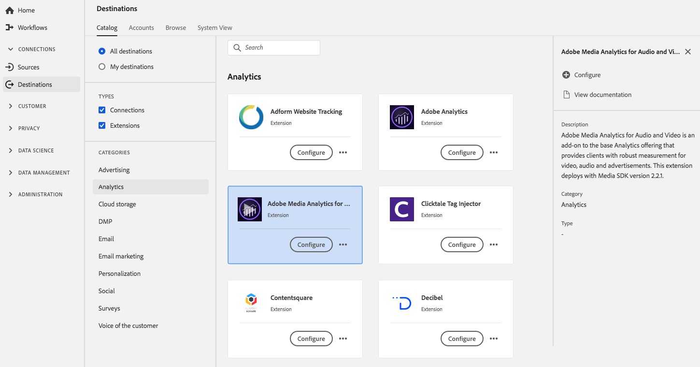

# Adobe Media Analytics for Audio and Video 拡張機能 {#adobe-analytics-for-video-extension}

## 概要 {#overview}

Adobe Media Analytics for Audio and Video は基本的な分析機能のアドオンで、ビデオ、オーディオおよび広告における堅牢な測定機能をクライアントに提供します。

Adobe MediumAnalytics for Audio and Video は、Adobe Experience Platformの分析拡張機能です。 拡張機能について詳しくは、[Adobe Exchange](https://exchange.adobe.com/experiencecloud.details.100157.html) の拡張機能のページを参照してください。

この宛先はタグ拡張です。 Platform でのタグ拡張の動作について詳しくは、「[ タグ拡張の概要 ](../launch-extensions/overview.md)」を参照してください。

## 前提条件 {#prerequisites}

この拡張機能は、Platform を購入したすべてのお客様の [!DNL Destinations] カタログで利用できます。

この拡張機能を使用するには、Adobe Experience Platformのタグにアクセスする必要があります。 タグは、Adobe Experience Cloudのお客様に、付属の付加価値機能として提供されます。 組織の管理者に問い合わせてタグへのアクセス権を取得し、タグに拡張機能のインストールに必要な **[!UICONTROL manage_properties]** 権限を付与するよう依頼します。

## 拡張機能のインストール {#install-extension}

Adobe Analytics for Video 拡張機能をインストールするには：

[Platform インターフェイス ](https://platform.adobe.com/) で、**[!UICONTROL 宛先]** / **[!UICONTROL カタログ]** に移動します。

カタログから拡張機能を選択するか、検索バーを使用します。

宛先をクリックしてハイライトし、右側のレールで「**[!UICONTROL 設定]**」を選択します。 **[!UICONTROL Configure]** コントロールがグレー表示になっている場合は、**[!UICONTROL manage_properties]** 権限がありません。 [前提条件](#prerequisites)を確認してください。

拡張機能をインストールするタグプロパティを選択します。 また、新しいプロパティを作成することもできます。 プロパティは、ルール、データ要素、設定された拡張機能、環境およびライブラリの集まりです。[ タグのドキュメント ](../../../tags/ui/administration/companies-and-properties.md) でプロパティについて説明します。

ワークフローに従ってデータ収集 UI が表示され、インストールが完了します。

拡張機能の設定オプションについて詳しくは、Adobe Mediumドキュメントの [Analytics for Audio and Video 拡張機能のページ ](../../../tags/extensions/web/media-analytics/overview.md) を参照してください。

拡張機能は、[ データ収集 UI](https://experience.adobe.com/#/data-collection/) に直接インストールすることもできます。 詳しくは、[ 新しい拡張機能の追加 ](../../../tags/ui/managing-resources/extensions/overview.md#add-a-new-extension) のガイドを参照してください。

## 拡張機能の使用方法 {#how-to-use}

拡張機能をインストールしたら、ルールの設定を開始できます。 データ収集 UI では、特定の状況でのみ拡張機能の宛先にイベントデータを送信するように、インストール済みの拡張機能のルールを設定できます。 拡張機能のルールの設定について詳しくは、タグのドキュメントの [rules](../../../tags/ui/managing-resources/rules.md) の概要を参照してください。

## 拡張機能の設定、アップグレード、削除 {#configure-upgrade-delete}

データ収集 UI で、拡張機能の設定、アップグレード、削除をおこなうことができます。

>[!TIP]
>
>拡張機能が既にいずれかのプロパティにインストールされている場合、UI には拡張機能の **[!UICONTROL Install]** が表示されます。 「[ 拡張機能のインストール ](#install-extension)」の説明に従って、インストールワークフローを開始し、拡張機能を設定または削除します。

拡張機能をアップグレードするには、タグのドキュメントの [ 拡張機能のアップグレードプロセス ](../../../tags/ui/managing-resources/extensions/extension-upgrade.md) のガイドを参照してください。
