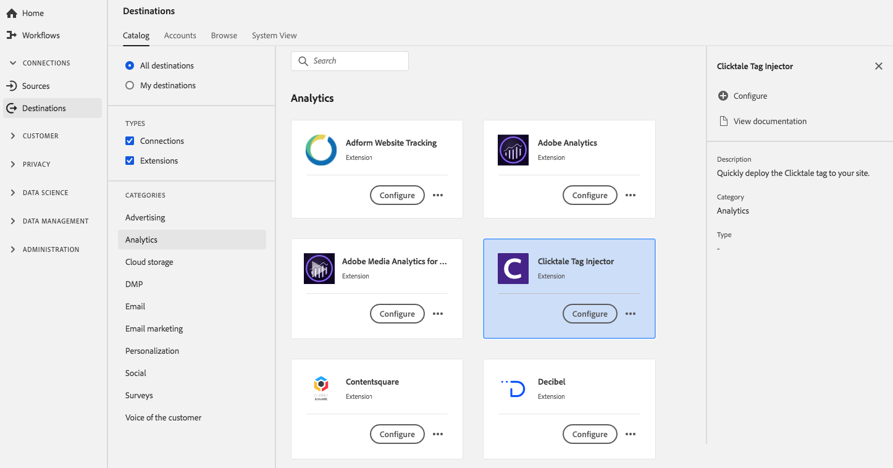

# [!DNL Clicktale] 拡張機能 {#clicktale-extension}

## 概要 {#overview}

[!DNL Clicktale]タグ拡張機能を使用すると、 [!DNL Clicktale's]ビジュアルエディターを使用して、コードのデプロイとデータ要素のマッピングをおこなうことができます。

[!DNL Clicktale] は、Adobe Experience Platformのanalytics拡張機能です。拡張機能について詳しくは、[Adobe Exchange](https://exchange.adobe.com/experiencecloud.details.100082.html) の拡張機能のページを参照してください。

この宛先はタグ拡張です。 Platformでのタグ拡張の動作について詳しくは、「[タグ拡張の概要](../launch-extensions/overview.md)」を参照してください。

## 前提条件 {#prerequisites}

この拡張機能は、Platformを購入したすべての顧客の[!DNL Destinations]カタログで利用できます。

この拡張機能を使用するには、Adobe Experience Platformのタグにアクセスする必要があります。 タグは、Adobe Experience Cloudのお客様に、付属の付加価値機能として提供されます。 組織の管理者に問い合わせてタグへのアクセス権を取得し、タグに拡張機能のインストールに必要な&#x200B;**[!UICONTROL manage_properties]**&#x200B;権限を付与するよう依頼します。

## 拡張機能のインストール {#install-extension}

[!DNL Clicktale]拡張機能をインストールするには：

[Platformインターフェイス](https://platform.adobe.com/)で、**[!UICONTROL 宛先]**/**[!UICONTROL カタログ]**&#x200B;に移動します。

カタログから拡張機能を選択するか、検索バーを使用します。

宛先をクリックしてハイライトし、右側のレールで「**[!UICONTROL 設定]**」を選択します。 **[!UICONTROL Configure]**&#x200B;コントロールがグレー表示になっている場合は、**[!UICONTROL manage_properties]**&#x200B;権限がありません。 [前提条件](#prerequisites)を確認してください。

拡張機能をインストールするプロパティを選択します。 また、新しいプロパティを作成することもできます。 プロパティは、ルール、データ要素、設定された拡張機能、環境およびライブラリの集まりです。プロパティについては、タグドキュメントの[プロパティページの節](../../../tags/ui/administration/companies-and-properties.md#properties-page)を参照してください。

このワークフローでは、インストールを完了する手順について説明します。

拡張機能の設定オプションについて詳しくは、Adobe Exchange の [Clicktale 拡張機能のページ](https://exchange.adobe.com/experiencecloud.details.100082.html)を参照してください。

拡張機能は、[データ収集UI](https://experience.adobe.com/#/data-collection/)に直接インストールすることもできます。 詳しくは、タグのドキュメントの[新しい拡張子](../../../tags/ui/managing-resources/extensions/overview.md#add-a-new-extension)の追加に関する節を参照してください。

## 拡張機能の使用方法 {#how-to-use}

拡張機能をインストールしたら、ルールの設定を開始できます。

特定の状況でのみ拡張機能の宛先にイベントデータを送信するよう、インストールした拡張機能のルールを設定できます。 拡張機能のルールの設定について詳しくは、[タグのドキュメント](../../../tags/ui/managing-resources/rules.md)を参照してください。

## 拡張機能の設定、アップグレード、削除 {#configure-upgrade-delete}

データ収集UIで、拡張機能の設定、アップグレード、削除をおこなうことができます。

>[!TIP]
>
>拡張機能が既にいずれかのプロパティにインストールされている場合、Platform UIには、拡張機能に対して&#x200B;**[!UICONTROL Install]**&#x200B;が表示されます。 「[拡張機能のインストール](#install-extension)」の説明に従って、拡張機能を設定または削除するインストールワークフローを開始します。

拡張機能をアップグレードするには、タグのドキュメントの[拡張機能のアップグレードプロセス](../../../tags/ui/managing-resources/extensions/extension-upgrade.md)のガイドを参照してください。
