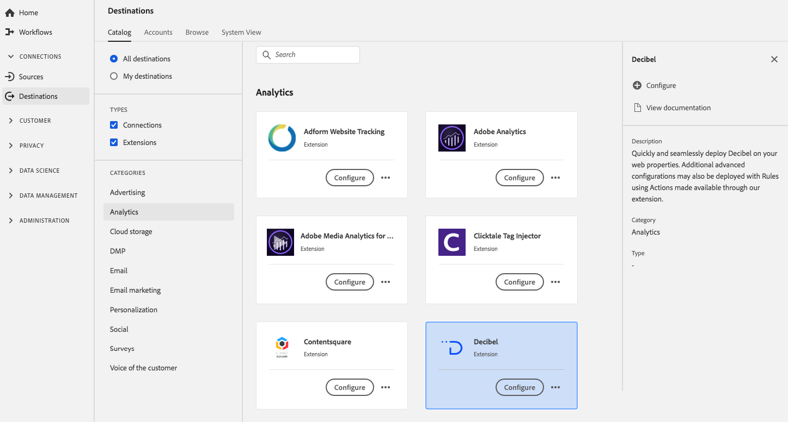

# [!DNL Decibel] 拡張機能 {#decibel-extension}

## 概要 {#overview}

Web プロパティに[!DNL Decibel]をすばやくシームレスにデプロイします。 また、拡張機能を通じて使用可能なアクションを使用して、追加の高度な設定をルールと共にデプロイすることもできます。

[!DNL Decibel]は[!DNL Adobe Experience Platform]のAnalytics拡張機能です。 拡張機能について詳しくは、[Adobe Exchange](https://exchange.adobe.com/experiencecloud.details.100913.html) の拡張機能のページを参照してください。

この宛先はタグ拡張機能です。 Experience Platformでのタグ拡張機能の仕組みについて詳しくは、[&#x200B; タグ拡張機能の概要](../launch-extensions/overview.md)を参照してください。

## 前提条件 {#prerequisites}

この拡張機能は、[!DNL Destinations] カタログで、Experience Platformを購入したすべてのお客様が利用できます。

この拡張機能を使用するには、[!DNL Adobe Experience Platform]のタグにアクセスする必要があります。 タグは、含まれている付加価値機能として[!DNL Adobe Experience Cloud]のお客様に提供されます。 タグへのアクセス権を取得するには、組織の管理者に連絡し、拡張機能をインストールできるように&#x200B;**[!UICONTROL manage_properties]**&#x200B;権限を付与するように依頼してください。

## 拡張機能のインストール {#install-extension}

[!DNL Decibel] 拡張機能をインストールします。

[Experience Platform インターフェイス &#x200B;](https://platform.adobe.com/)で、**[!UICONTROL Destinations]** > **[!UICONTROL Catalog]**&#x200B;に移動します。

カタログから拡張機能を選択するか、検索バーを使用します。

宛先を選択し、右側のパネルで「**[!UICONTROL Configure]**」を選択します。 **[!UICONTROL Configure]** コントロールがグレー表示されている場合、**[!UICONTROL manage_properties]**&#x200B;権限がありません。 [前提条件](#prerequisites)を確認してください。

拡張機能をインストールするプロパティを選択します。 また、新しいプロパティを作成するオプションもあります。プロパティは、ルール、データ要素、設定された拡張機能、環境およびライブラリの集まりです。プロパティについては、タグドキュメントの [「プロパティ」ページに関する節](../../../tags/ui/administration/companies-and-properties.md#properties-page) を参照してください。

このワークフローでは、インストールを完了する手順について説明します。

拡張機能の設定オプションについて詳しくは、Adobe Exchange の[Decibel 拡張機能ページ](https://exchange.adobe.com/experiencecloud.details.100913.html)を参照してください。

拡張機能は、[データ収集 UI](https://experience.adobe.com/#/data-collection/) で直接インストールできます。詳しくは、[新しい拡張機能の追加](../../../tags/ui/managing-resources/extensions/overview.md#add-a-new-extension) （タグドキュメント）を参照してください。

## 拡張機能の使用方法 {#how-to-use}

拡張機能をインストールしたら、ルールの設定を開始できます。

特定の状況でのみ拡張機能の宛先にイベントデータを送信するように、インストール済みの拡張機能のルールを設定できます。拡張機能のルールの設定について詳しくは、[ルールに関するドキュメント](../../../tags/ui/managing-resources/rules.md)を参照してください。

## 拡張機能の設定、アップグレード、削除 {#configure-upgrade-delete}

データ収集 UI で、拡張機能の設定、アップグレードおよび削除を行うことができます。

>[!TIP]
>
>拡張機能が既にいずれかのプロパティにインストールされている場合でも、Experience Platform UIには拡張機能の&#x200B;**[!UICONTROL Install]**&#x200B;が表示されます。 [拡張機能のインストール](#install-extension)の説明に従ってインストールワークフローを開始し、拡張機能を設定または削除します。

拡張機能をアップグレードするには、[拡張機能のアップグレードプロセス](../../../tags/ui/managing-resources/extensions/extension-upgrade.md) （タグドキュメント）のガイドを参照してください。
