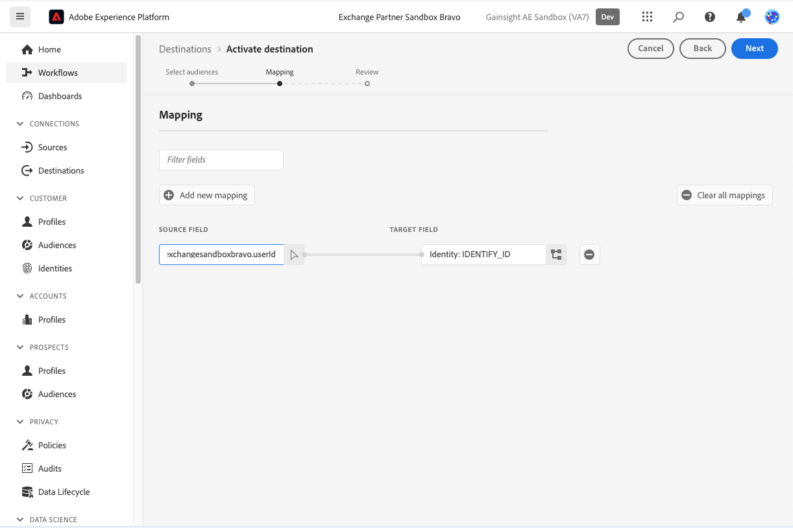
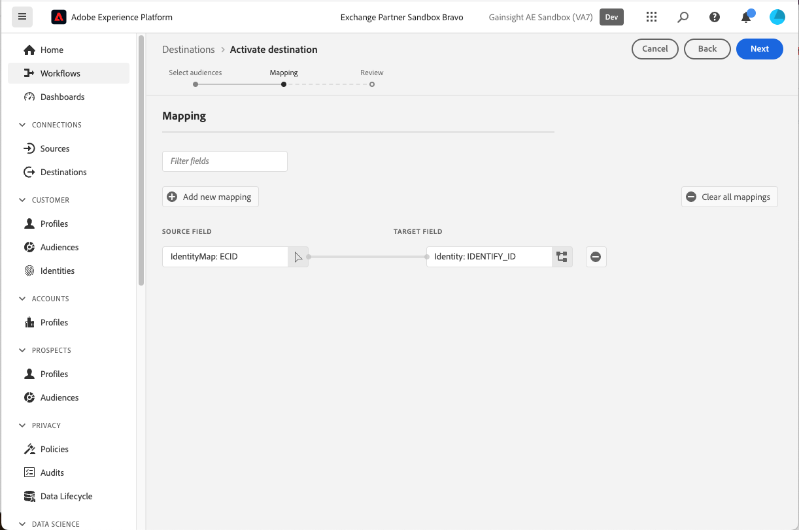

# Gainsight PX 接続 {#gainsight-px}

## 概要 {#overview}

[[!DNL Gainsight PX]](https://www.gainsight.com/product-experience/) は、ユーザーが製品をどのように使用しているかを製品チームが理解できるようにする製品エクスペリエンスプラットフォームです。フィードバックを収集し、製品のウォークスルーなどのアプリ内エンゲージメントを作成して、ユーザーのオンボーディングと製品採用を促進します。

>[!IMPORTANT]
>
>宛先コネクタおよびドキュメントページは、*Gainsight PX* チームによって作成および管理されます。 お問い合わせや更新のリクエストについては、*`pxsupport@gainsight.com`* まで直接ご連絡ください。

## ユースケース {#use-cases}

*Gainsight PX* 宛先を使用する方法とタイミングをより深く理解するために、Adobe Experience Platformのお客様がこの宛先を使用して解決できるサンプルユースケースを以下に示します。

### アプリ内エンゲージメントのターゲティング {#targeting-in-app-engagements}

ある SaaS 企業は、Gainsight PX 上に構築されたアプリケーション内ガイドを通じて顧客とのエンゲージメントを図りたいと考えています。 このエンゲージメントを受け取るオーディエンスは、Adobe Experience Platformに基づいて作成されました。 Gainsight PX 宛先はオーディエンスを受け取り、Gainsight PX 環境内で利用できるようにします。

## 前提条件 {#prerequisites}

* [!DNL Gainsight] サポートチームに連絡し、サブスクリプションの外部セグメント機能のアクティベーションをリクエストします。
* [ 会社の詳細ページ ](https://app.aptrinsic.com/settings/subscription) の下部にある「**[!UICONTROL 新しいシークレットの生成]**」ボタンを使用して、PX サブスクリプションの OAuth シークレット値を生成します
  

## サポートされている ID {#supported-identities}

Gainsight PX は、以下の表に示す ID のアクティブ化をサポートしています。 [ID](../../../identity-service/features/namespaces.md) についての詳細情報。

| ターゲット ID | 説明 |
|---|----|
| IdentifyID | Gainsight PX およびAdobe Experience Platformでユーザーを一意に識別する共通ユーザー ID |

{style="table-layout:auto"}

## サポートされるオーディエンス {#supported-audiences}

この節では、この宛先に書き出すことができるオーディエンスのタイプについて説明します。

| オーディエンスオリジン | サポートあり | 説明 |
|---|---|---|
| [!DNL Segmentation Service] | ✓ | Experience Platform[ セグメント化サービス ](../../../segmentation/home.md) を通じて生成されたオーディエンス。 |
| カスタムアップロード | X | CSV ファイルから Experience Platform に[読み込まれた](../../../segmentation/ui/audience-portal.md#import-audience)オーディエンス。 |

{style="table-layout:auto"}

## 書き出しのタイプと頻度 {#export-type-frequency}

宛先の書き出しのタイプと頻度について詳しくは、以下の表を参照してください。

| 項目 | タイプ | メモ |
|---|---|---|
| 書き出しタイプ | **[!UICONTROL セグメントの書き出し]** | [!DNL Gainsight PX] 宛先で使用される識別子（氏名、電話番号など）を使用して、オーディエンスのすべてのメンバーを書き出します。 |
| 書き出し頻度 | **[!UICONTROL ストリーミング]** | ストリーミングの宛先は常に、API ベースの接続です。オーディエンスの評価に基づいてExperience Platform内でプロファイルが更新されると、コネクタは更新を宛先プラットフォームに送信します。 詳しくは、[ストリーミングの宛先](/help/destinations/destination-types.md#streaming-destinations)を参照してください。 |

{style="table-layout:auto"}

## 宛先への接続 {#connect}

>[!IMPORTANT]
>
>宛先に接続するには、**[!UICONTROL 宛先の管理]** [アクセス制御権限](/help/access-control/home.md#permissions)が必要です。詳しくは、[アクセス制御の概要](/help/access-control/ui/overview.md)または製品管理者に問い合わせて、必要な権限を取得してください。

この宛先に接続するには、[宛先設定のチュートリアル](../../ui/connect-destination.md)の手順に従ってください。宛先の設定ワークフローで、以下の 2 つの節でリストされているフィールドに入力します。

### 宛先に対する認証 {#authenticate}

宛先に対して認証するには、必須フィールドに入力し、「**[!UICONTROL 宛先に接続]**」を選択します。

* **[!UICONTROL パスワード]**:[[!DNL Gainsight PX]](https://app.aptrinsic.com) へのログインに使用するパスワード
* **[!UICONTROL クライアント ID]**: [ 会社の詳細ページ ](https://app.aptrinsic.com/settings/subscription) の Gainsight PX サブスクリプション ID
* **[!UICONTROL クライアントシークレット]**:[!DNL Gainsight PX] UI の [ 会社の詳細ページ ](https://app.aptrinsic.com/settings/subscription) の下部に生成される OAuth 秘密鍵。
* **[!UICONTROL ユーザー名]**:[[!DNL Gainsight PX]](https://app.aptrinsic.com) UI へのログインに使用するメール

### 宛先の詳細を入力 {#destination-details}

宛先の詳細を設定するには、以下の必須フィールドとオプションフィールドに入力します。UI のフィールドの横のアスタリスクは、そのフィールドが必須であることを示します。

* **[!UICONTROL 名前]**：今後この宛先を認識するための名前。
* **[!UICONTROL 説明]**：今後この宛先を識別するのに役立つ説明。

宛先接続の詳細の入力を終えたら「**[!UICONTROL 次へ]**」を選択します。

## この宛先に対してセグメントをアクティブ化 {#activate}

>[!IMPORTANT]
>
>* データをアクティブ化するには、**[!UICONTROL 宛先の管理]**、**[!UICONTROL 宛先のアクティブ化]**、**[!UICONTROL プロファイルの表示]**&#x200B;および&#x200B;**[!UICONTROL セグメントの表示]**[に対するアクセス制御権限](/help/access-control/home.md#permissions)が必要です。詳しくは、[アクセス制御の概要](/help/access-control/ui/overview.md)または製品管理者に問い合わせて、必要な権限を取得してください。
>* *ID* を書き出すには、**[!UICONTROL ID グラフの表示]**[ アクセス制御権限 ](/help/access-control/home.md#permissions) が必要です。  {width="100" zoomable="yes"}

この宛先にオーディエンスセグメントをアクティベートする手順は、[ストリーミングセグメントの書き出し宛先へのプロファイルとセグメントのアクティベート](/help/destinations/ui/activate-segment-streaming-destinations.md)を参照してください。

### ID のマッピング {#map}

この宛先は、プロファイル属性と ID 名前空間のマッピングをサポートしています。 ターゲットマッピングは、常に **[!UICONTROL IDENTIFY_ID]** ID 名前空間である必要があります。

マッピングの設定方法について詳しくは、以下の例を参照してください。

#### プロファイル属性のマッピング {#map-profile-attribute}

以下に示す例では、ソースフィールドは、ターゲット名前空間 IDENTIFY_ID にマッピングされる XDM プロファイル属性です。

#### ID 名前空間のマッピング {#map-identity-namespace}

以下に示す例では、ソースフィールドは ID 名前空間（**[!UICONTROL ECID]**）であり、ターゲット名前空間 **[!UICONTROL IDENTIFY_ID]** にマッピングされます。

## 書き出されたデータ／データ書き出しの検証 {#exported-data}

セグメントデータはExperience Platformから Gainsight PX にストリーミングされます。

セグメントメタデータは、[!DNL Gainsight PX] UI のセグメント画面に表示されます。

セグメントメンバーシップ情報は、[!DNL Gainsight PX] UI のオーディエンスエクスプローラー画面の「セグメント」タブに表示されます。

## データの使用とガバナンス {#data-usage-governance}

[!DNL Adobe Experience Platform] のすべての宛先は、データを処理する際のデータ使用ポリシーに準拠しています。[!DNL Adobe Experience Platform] がどのように データガバナンスを実施するかについて詳しくは、[データガバナンスの概要](/help/data-governance/home.md)を参照してください。
