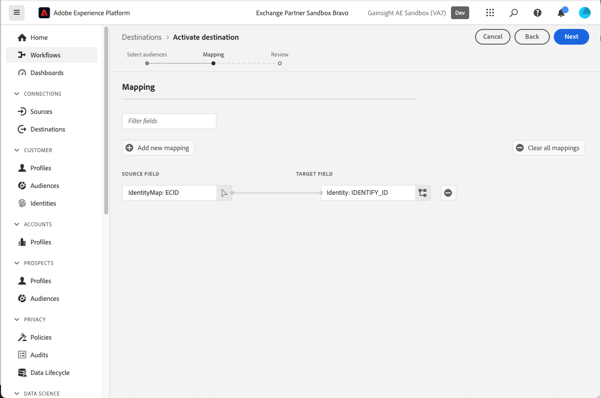
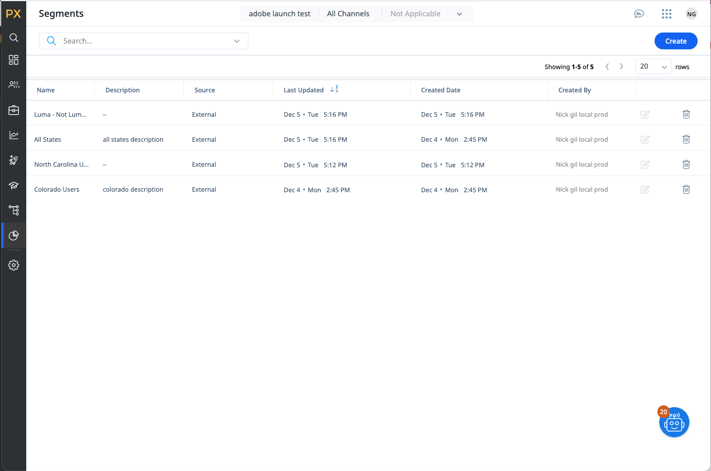
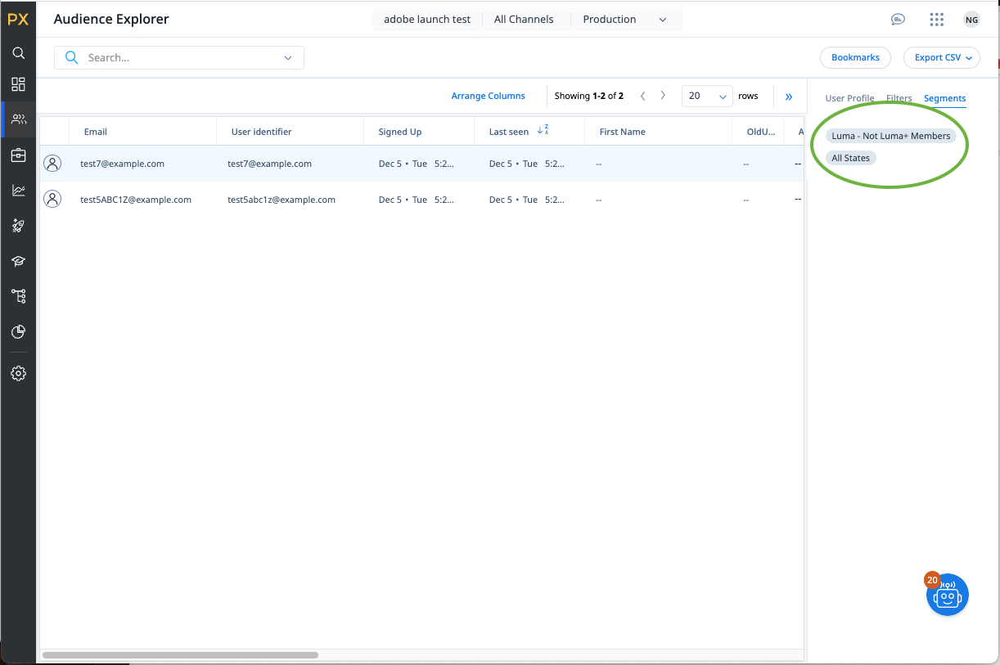

# Gainsight PX接続 {#gainsight-px}

## 概要 {#overview}

[[!DNL Gainsight PX]](https://www.gainsight.com/product-experience/)は、製品チームが、ユーザーによる製品の使用方法を理解し、フィードバックを収集し、製品ウォークスルーなどのアプリ内エンゲージメントを作成して、ユーザーのオンボーディングと製品の採用を促進できるようにする製品体験プラットフォームです。

>[!IMPORTANT]
>
>宛先コネクタとドキュメント ページは、*Gainsight PX* チームによって作成および管理されます。 問い合わせや更新のリクエストについては、*`pxsupport@gainsight.com`*&#x200B;から直接お問い合わせください。

## ユースケース {#use-cases}

*Gainsight PX*&#x200B;の宛先を使用する方法とタイミングをより深く理解するために、[!DNL Adobe Experience Platform]のお客様がこの宛先を使用して解決できるユースケースの例を次に示します。

### アプリ内エンゲージメントのターゲティング {#targeting-in-app-engagements}

SaaS企業が、Gainsight PXで構築されたアプリケーション内ガイドを通じて、顧客とエンゲージする方法について解説します。 このエンゲージメントを受け取るオーディエンスが[!DNL Adobe Experience Platform]に作成されました。 Gainsight PXの宛先はオーディエンスを受け取り、Gainsight PX環境内で使用できるようにします。

## 前提条件 {#prerequisites}

* [!DNL Gainsight] サポートチームに連絡し、サブスクリプションの外部セグメント機能の有効化をリクエストしてください。
* **[!UICONTROL Generate New Secret]**&#x200B;会社詳細ページ [の下部にある](https://app.aptrinsic.com/settings/subscription) ボタンを使用して、PX サブスクリプションのOAuth シークレット値を生成します
  

## サポートされている ID {#supported-identities}

Gainsight PXは、以下の表に記載されているIDのアクティベーションをサポートしています。 [ID](../../../identity-service/features/namespaces.md) についての詳細情報。

| ターゲット ID | 説明 |
|---|----|
| IdentifyID | Gainsight PXおよび[!DNL Adobe Experience Platform]のユーザーを一意に識別する共通のユーザー識別子 |

{style="table-layout:auto"}

## サポートされるオーディエンス {#supported-audiences}

この節では、この宛先に書き出すことができるオーディエンスのタイプについて説明します。

| オーディエンスの由来 | サポートあり | 説明 |
|---------|----------|----------|
| [!DNL Segmentation Service] | ○ | Experience Platform [&#x200B; セグメント化サービス &#x200B;](../../../segmentation/home.md)を通じて生成されたオーディエンス。 |
| その他すべてのオーディエンスの生成元 | × | このカテゴリには、[!DNL Segmentation Service]を通じて生成されたオーディエンス以外のすべてのオーディエンスのオリジンが含まれます。 [様々なオーディエンスの起源](/help/segmentation/ui/audience-portal.md#customize)について読みます。 次に例を示します。 <ul><li> カスタムアップロードオーディエンス [がCSV ファイルからExperience Platformに](../../../segmentation/ui/audience-portal.md#import-audience)をインポートしました。</li><li> 類似オーディエンス， </li><li> 連合オーディエンス， </li><li> [!DNL Adobe Journey Optimizer]などの他のExperience Platform アプリで生成されたオーディエンス </li><li> その他。 </li></ul> |

{style="table-layout:auto"}

オーディエンスのデータタイプ別にサポートされるオーディエンス：

| オーディエンスのデータタイプ | サポートあり | 説明 | ユースケース |
|--------------------|-----------|-------------|-----------|
| [人物オーディエンス &#x200B;](/help/segmentation/types/people-audiences.md) | ○ | 顧客プロファイルにもとづいて、マーケティング施策の特定のグループをターゲットにすることができます。 | 買い物客やカートの放棄が多い |
| [&#x200B; アカウントオーディエンス &#x200B;](/help/segmentation/types/account-audiences.md) | × | アカウントベースドマーケティング戦略のために、特定の組織内の個人をターゲットにします。 | B2B マーケティング |
| [見込みオーディエンス &#x200B;](/help/segmentation/types/prospect-audiences.md) | × | まだ顧客ではないが、ターゲットオーディエンスと特徴を共有する個人をターゲットにします。 | サードパーティデータによる見込み顧客の開拓 |
| [&#x200B; データセットの書き出し](/help/catalog/datasets/overview.md) | × | [!DNL Adobe Experience Platform] データ レイクに保存されている構造化データのコレクション。 | レポート，データサイエンスワークフロー |

{style="table-layout:auto"}

## 書き出しのタイプと頻度 {#export-type-frequency}

宛先の書き出しのタイプと頻度について詳しくは、以下の表を参照してください。

| 項目 | タイプ | メモ |
|---|---|---|
| 書き出しタイプ | **[!UICONTROL Segment export]** | [!DNL Gainsight PX] 宛先で使用される識別子（氏名、電話番号など）を使用して、オーディエンスのすべてのメンバーを書き出します。 |
| 書き出し頻度 | **[!UICONTROL Streaming]** | ストリーミングの宛先は常に、API ベースの接続です。オーディエンス評価に基づいてExperience Platformでプロファイルが更新されると、コネクターは更新をダウンストリームの宛先プラットフォームに送信します。 詳しくは、[ストリーミングの宛先](/help/destinations/destination-types.md#streaming-destinations)を参照してください。 |

{style="table-layout:auto"}

## 宛先への接続 {#connect}

>[!IMPORTANT]
>
>宛先に接続するには、**[!UICONTROL Manage Destinations]** [&#x200B; アクセス制御権限](/help/access-control/home.md#permissions)が必要です。 詳しくは、[アクセス制御の概要](/help/access-control/ui/overview.md)または製品管理者に問い合わせて、必要な権限を取得してください。

この宛先に接続するには、[宛先設定のチュートリアル](../../ui/connect-destination.md)の手順に従ってください。宛先の設定ワークフローで、以下の 2 つの節でリストされているフィールドに入力します。

### 宛先に対する認証 {#authenticate}

宛先に対して認証を行うには、必須フィールドに入力し、**[!UICONTROL Connect to destination]**&#x200B;を選択します。

* **[!UICONTROL Password]**: [[!DNL Gainsight PX]](https://app.aptrinsic.com)へのログインに使用するパスワード
* **[!UICONTROL Client ID]**: [会社詳細ページ &#x200B;](https://app.aptrinsic.com/settings/subscription)のGainsight PX サブスクリプション ID
* **[!UICONTROL Client secret]**: [&#x200B; UIの](https://app.aptrinsic.com/settings/subscription)会社詳細ページ [!DNL Gainsight PX]の下部で生成されたOAuth秘密鍵。
* **[!UICONTROL Username]**: [[!DNL Gainsight PX]](https://app.aptrinsic.com) UIへのログインに使用された電子メール

### 宛先の詳細を入力 {#destination-details}

宛先の詳細を設定するには、以下の必須フィールドとオプションフィールドに入力します。UI のフィールドの横のアスタリスクは、そのフィールドが必須であることを示します。

* **[!UICONTROL Name]**：今後この宛先を認識する際に使用する名前。
* **[!UICONTROL Description]**：今後この宛先を特定するのに役立つ説明です。

宛先接続の詳細の提供が完了したら、**[!UICONTROL Next]**&#x200B;を選択します。

## この宛先に対してオーディエンスをアクティブ化 {#activate}

>[!IMPORTANT]
>
>* データをアクティブ化するには、**[!UICONTROL Manage Destinations]**、**[!UICONTROL Activate Destinations]**、**[!UICONTROL View Profiles]**&#x200B;および&#x200B;**[!UICONTROL View Segments]** [&#x200B; アクセス制御権限](/help/access-control/home.md#permissions)が必要です。 [アクセス制御の概要](/help/access-control/ui/overview.md)を参照するか、製品管理者に問い合わせて必要な権限を取得してください。
>* *ID*&#x200B;をエクスポートするには、**[!UICONTROL View Identity Graph]** [&#x200B; アクセス制御権限](/help/access-control/home.md#permissions)が必要です。  {width="100" zoomable="yes"}

この宛先に対してオーディエンスをアクティブ化する手順については、[&#x200B; ストリーミング宛先に対するオーディエンスのアクティブ化](/help/destinations/ui/activate-segment-streaming-destinations.md)を参照してください。

### ID のマッピング {#map}

この宛先では、プロファイル属性とID名前空間のマッピングがサポートされています。 ターゲットマッピングは常に&#x200B;**[!UICONTROL IDENTIFY_ID]** ID名前空間である必要があります。

マッピングの設定方法について詳しくは、以下の例を参照してください。

#### プロファイル属性のマッピング {#map-profile-attribute}

下の例では、ソースフィールドはXDM プロファイル属性で、IDENTIFY_ID ターゲット名前空間にマッピングされます。

ソース値とターゲット値の選択方法を示す

#### ID名前空間のマッピング {#map-identity-namespace}

次の例では、ソースフィールドは&#x200B;**[!UICONTROL ECID]** ターゲット名前空間にマッピングされるID名前空間（**[!UICONTROL IDENTIFY_ID]**）です。

ソース値とターゲット値を選択する方法を示す

## 書き出されたデータ／データ書き出しの検証 {#exported-data}

セグメンテーションデータは、Experience PlatformからGainsight PXにストリーミングされます。

セグメントメタデータは、[!DNL Gainsight PX] UI内のセグメント画面に表示されます。

外部セグメントを表示するGainsight PXの

セグメントメンバーシップ情報は、[!DNL Gainsight PX] UIのAudience Explorer画面の「セグメント」タブに表示されます。

ユーザーの関連セグメントを表示するGainsight PXの

## データの使用とガバナンス {#data-usage-governance}

[!DNL Adobe Experience Platform] のすべての宛先は、データを処理する際のデータ使用ポリシーに準拠しています。[!DNL Adobe Experience Platform] がどのように データガバナンスを実施するかについて詳しくは、[データガバナンスの概要](/help/data-governance/home.md)を参照してください。
