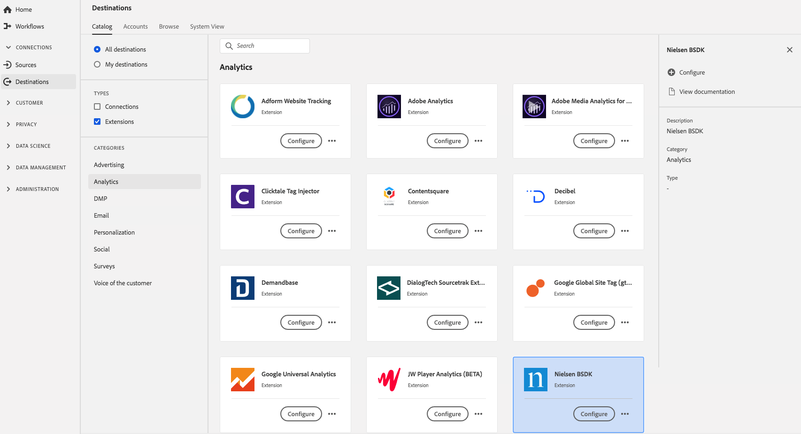

# [!DNL Nielsen BSDK] 拡張機能 {#nielsen-bsdk-extension}

## 概要 {#overview}

[!DNL Nielsen Digital SDK] launch拡張機能は、次のデジタル測定製品を介してaudience measurementを提供します。

DCR：広告を含む非線形デジタルコンテンツの日々の測定を提供する測定ソリューションは、デスクトップ、モバイル、タブレット、および接続されたデバイスにわたるデジタルコンテンツオーディエンスの消費を包括的に表示します。

DTVR：これは、参加しているプログラミングソースのデスクトップおよびモバイルデバイスで発生する線形 TV 視聴を考慮したものです。これは、MRC から認定を受けた最初のソリューションで、コンピューターや携帯端末での視聴プログラミングに対する TV オーディエンス測定への貢献度を示します。

[!DNL Nielsen BSDK] は、Adobe Experience Platformのanalytics拡張機能です。拡張機能について詳しくは、[Adobe Exchange](https://exchange.adobe.com/experiencecloud.details.101361.html) の拡張機能のページを参照してください。

この宛先は、Adobe Experience Platform Launch拡張機能です。 PlatformでのPlatform launch拡張機能の仕組みについて詳しくは、「[Adobe Experience Platform Launch拡張機能の概要](../launch-extensions/overview.md)」を参照してください。

## 前提条件 {#prerequisites}

この拡張機能は、Platformを購入したすべての顧客の[!DNL Destinations]カタログで利用できます。

この拡張機能を使用するには、Adobe Experience Platform Launchにアクセスする必要があります。  Platform Launch は、Adobe Experience Cloud に付属の付加価値機能として提供されています。組織の管理者に問い合わせてPlatform launchへのアクセス権を取得し、拡張機能のインストールに必要な&#x200B;**[!UICONTROL manage_properties]**&#x200B;権限を付与するよう管理者に依頼します。

## 拡張機能のインストール {#install-extension}

[!DNL Nielsen BSDK]拡張機能をインストールするには：

[Platformインターフェイス](http://platform.adobe.com/)で、**[!UICONTROL 宛先]**/**[!UICONTROL カタログ]**&#x200B;に移動します。

カタログから拡張機能を選択するか、検索バーを使用します。

宛先をクリックしてハイライトし、右側のレールで「**[!UICONTROL 設定]**」を選択します。 **[!UICONTROL Configure]**&#x200B;コントロールがグレー表示になっている場合は、**[!UICONTROL manage_properties]**&#x200B;権限がありません。 [前提条件](#prerequisites)を確認してください。

**[!UICONTROL 使用可能なPlatform launchプロパティを選択]**&#x200B;ウィンドウで、拡張機能をインストールするPlatform launchプロパティを選択します。 また、「 」で新しいプロパティを作成するオプションもあります。Platform launch プロパティは、ルール、データ要素、設定された拡張機能、環境およびライブラリの集まりです。プロパティについては、Platform launchドキュメントの[プロパティページの節](../../../tags/ui/administration/companies-and-properties.md#properties-page)を参照してください。

ワークフローに従って、Platform launchが表示され、インストールが完了します。

拡張機能の設定オプションとインストールのサポートについて詳しくは、[Adobe Exchange の Nielsen BSDK のページ](https://exchange.adobe.com/experiencecloud.details.101361.html)を参照してください。

拡張機能は、[Adobe Experience Platform Launchインターフェイス](https://launch.adobe.com/)に直接インストールすることもできます。 platform launchのドキュメントの[新しい拡張子](../../../tags/ui/managing-resources/extensions/overview.md#add-a-new-extension)の追加を参照してください。

## 拡張機能の使用方法 {#how-to-use}

拡張機能をインストールしたら、その拡張機能のルールを直接Platform launchで設定できます。

platform launchでは、特定の状況でのみ拡張機能の宛先にイベントデータを送信するように、インストールした拡張機能のルールを設定できます。 拡張機能のルールの設定について詳しくは、[ルールに関するドキュメント](../../../tags/ui/managing-resources/rules.md)を参照してください。

## 拡張機能の設定、アップグレード、削除 {#configure-upgrade-delete}

拡張機能インターフェイスで、拡張機能の設定、アップグレードおよび削除をPlatform launchできます。

>[!TIP]
>
>拡張機能が既にいずれかのプロパティにインストールされている場合、Platform UIには、拡張機能に対して&#x200B;**[!UICONTROL Install]**&#x200B;が表示されます。 「[拡張機能のインストール](#install-extension)」の説明に従ってインストールワークフローを開始し、Platform launchに移動して拡張機能を設定または削除します。

拡張機能をアップグレードするには、拡張機能のドキュメントの「[拡張機能のアップグレード](../../../tags/ui/managing-resources/extensions/extension-upgrade.md)」を参照してください。
