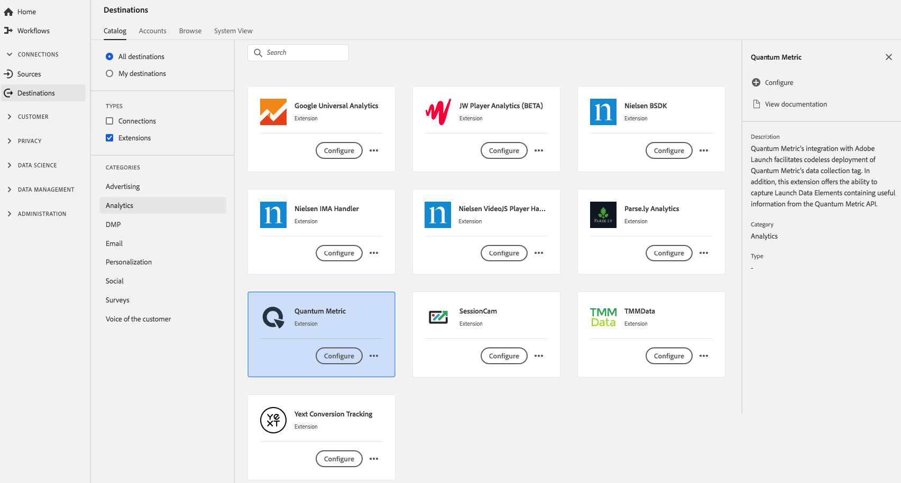

# [!DNL Quantum Metric] 拡張機能 {#quantum-metric-extension}

[!DNL Quantum Metric's] Adobe開始との統合により、 [!DNL Quantum Metric's] データ収集タグのコードレス導入が容易になります。さらに、この拡張機能は、[!DNL Quantum Metric] APIから役立つ情報を含む起動データ要素を取り込む機能をオファーします。

[!DNL Quantum Metric] は、Adobe Experience Platformのanalytics拡張です。拡張機能について詳しくは、[Adobe Exchange](https://exchange.adobe.com/experiencecloud.details.101535.quantum-metric-extension-for-adobe-launch.html) の拡張機能のページを参照してください。

この目的地はAdobe Experience Platform Launchの延長線です。 プラットフォーム起動の拡張機能の動作について詳しくは、[Adobe Experience Platform Launch拡張機能の概要](../launch-extensions/overview.md)を参照してください。

## 前提条件 {#prerequisites}

この拡張機能は、[!DNL Destinations]カタログにあり、プラットフォームを購入したすべてのお客様に提供されます。

この拡張機能を使用するには、Adobe Experience Platform Launchにアクセスする必要があります。  Platform Launch は、Adobe Experience Cloud に付属の付加価値機能として提供されています。組織の管理者に連絡して、プラットフォームの起動へのアクセスを取得し、**[!UICONTROL manage_properties]**&#x200B;の権限を付与して、拡張機能をインストールするよう依頼してください。

## 拡張機能のインストール {#install-extension}

[!DNL Quantum Metric]拡張機能をインストールするには：

[プラットフォームインターフェイス](http://platform.adobe.com/)で、**[!UICONTROL 宛先]**/**[!UICONTROL カタログ]**&#x200B;に移動します。

カタログから拡張機能を選択するか、検索バーを使用します。

リンク先をクリックしてハイライトし、右側のパネルで「**[!UICONTROL 設定]**」を選択します。 **[!UICONTROL Configure]**&#x200B;コントロールがグレー表示になっている場合は、**[!UICONTROL manage_properties]**&#x200B;権限がありません。 [前提条件](#prerequisites)を確認してください。

**[!UICONTROL 利用可能なプラットフォームの起動プロパティを選択]**&#x200B;ウィンドウで、拡張機能をインストールするプラットフォームの起動プロパティを選択します。 また、「プラットフォームの起動」で新しいプロパティを作成するオプションもあります。 プロパティは、ルール、データ要素、設定された拡張機能、環境およびライブラリの集まりです。プラットフォーム起動ドキュメントの[プロパティページセクション](https://experienceleague.adobe.com/docs/launch/using/reference/admin/companies-and-properties.html#properties-page)でプロパティについて説明します。

このワークフローにより、プラットフォーム起動に移動してインストールを完了します。

この拡張機能の設定オプションとインストールのサポートについて詳しくは、[Adobe Exchange の Quantum Metric ページ](https://exchange.adobe.com/experiencecloud.details.101535.quantum-metric-extension-for-adobe-launch.html)を参照してください。

[Adobe Experience Platform Launchインターフェイス](https://launch.adobe.com/)に直接インストールすることもできます。 プラットフォーム起動ドキュメントの追加[新しい拡張子](https://experienceleague.adobe.com/docs/launch/using/reference/manage-resources/extensions/overview.html?lang=en#add-a-new-extension)を参照してください。

## 拡張機能の使用方法 {#how-to-use}

拡張機能をインストールすると、「プラットフォームの起動」で直接、拡張機能のルール設定を開始できます。

Platform Launchでは、特定の状況でのみイベントデータを拡張の宛先に送信するように、インストール済みの拡張機能のルールを設定できます。 拡張機能のルールの設定について詳しくは、[ルールに関するドキュメント](https://experienceleague.adobe.com/docs/launch/using/reference/manage-resources/rules.html)を参照してください。

## 拡張機能の設定、アップグレード、削除 {#configure-upgrade-delete}

プラットフォーム起動インターフェイスで、拡張機能の設定、アップグレードおよび削除ができます。

>[!TIP]
>
>拡張機能が既にプロパティの1つにインストールされている場合、プラットフォームUIには、拡張機能の&#x200B;**[!UICONTROL Install]**&#x200B;が表示されます。 [Install extension](#install-extension)の説明に従って、インストールワークフローを開始し、プラットフォーム起動に移動して、拡張機能を設定または削除します。

拡張機能をアップグレードするには、プラットフォーム起動ドキュメントの[拡張機能のアップグレード](https://experienceleague.adobe.com/docs/launch/using/reference/manage-resources/extensions/extension-upgrade.html)を参照してください。