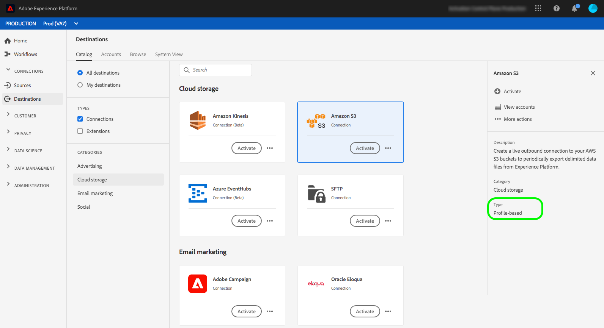

# [!DNL Amazon S3] 接続 {#s3-connection}

## 宛先の変更ログ {#changelog}

+++ 変更ログを表示


| リリース月 | 更新タイプ | 説明 |
|---|---|---|
| 2024年1月 | 機能とドキュメントの更新 | Amazon S3宛先コネクタで、新しい想定ロール認証タイプがサポートされるようになりました。 詳しくは、[認証セクション ](#assumed-role-authentication)を参照してください。 |
| 2023年7月 | 機能とドキュメントの更新 | 2023年7月のExperience Platform リリースでは、[!DNL Amazon S3]の宛先に新しい機能が提供されます（以下を参照）。<br><ul><li>[ データセット書き出しのサポート ](/help/destinations/ui/export-datasets.md)</li><li>追加の[ファイル命名オプション](/help/destinations/ui/activate-batch-profile-destinations.md#scheduling)。</li><li>書き出されたファイルにカスタムファイルヘッダーを設定する機能（[マッピングステップの改善](/help/destinations/ui/activate-batch-profile-destinations.md#mapping)による）</li><li>[書き出された CSV データファイルの形式をカスタマイズする機能](/help/destinations/ui/batch-destinations-file-formatting-options.md)。</li></ul> |

{style="table-layout:auto"}

+++

## APIまたはUIを介して[!DNL Amazon S3] ストレージに接続する {#connect-api-or-ui}

* Experience Platform ユーザーインターフェイスを使用して[!DNL Amazon S3] ストレージの場所に接続するには、以下の「[宛先に接続](#connect)」と「[この宛先にオーディエンスをアクティブ化](#activate)」の節を参照してください。
* プログラムで[!DNL Amazon S3]のストレージの場所に接続するには、Flow Service API チュートリアル [を使用してファイルベースの宛先にオーディエンスを](../../api/activate-segments-file-based-destinations.md) アクティブ化する方法に関するガイドを参照してください。

## サポートされるオーディエンス {#supported-audiences}

この節では、この宛先に書き出すことができるオーディエンスのタイプについて説明します。

| オーディエンスの由来 | サポートあり | 説明 |
|---------|----------|----------|
| [!DNL Segmentation Service] | ○ | Experience Platform [ セグメント化サービス ](../../../segmentation/home.md)を通じて生成されたオーディエンス。 |
| その他すべてのオーディエンスの生成元 | ○ | このカテゴリには、[!DNL Segmentation Service]を通じて生成されたオーディエンス以外のすべてのオーディエンスのオリジンが含まれます。 [様々なオーディエンスの起源](/help/segmentation/ui/audience-portal.md#customize)について読みます。 次に例を示します。 <ul><li> カスタムアップロードオーディエンス [がCSV ファイルからExperience Platformに](../../../segmentation/ui/audience-portal.md#import-audience)をインポートしました。</li><li> 類似オーディエンス， </li><li> 連合オーディエンス， </li><li> [!DNL Adobe Journey Optimizer]などの他のExperience Platform アプリで生成されたオーディエンス </li><li> その他。 </li></ul> |

{style="table-layout:auto"}


オーディエンスのデータタイプ別にサポートされるオーディエンス：

| オーディエンスのデータタイプ | サポートあり | 説明 | ユースケース |
|--------------------|-----------|-------------|-----------|
| [人物オーディエンス ](/help/segmentation/types/people-audiences.md) | ○ | 顧客プロファイルにもとづいて、マーケティング施策の特定のグループをターゲットにすることができます。 | 買い物客やカートの放棄が多い |
| [ アカウントオーディエンス ](/help/segmentation/types/account-audiences.md) | ○ | アカウントベースドマーケティング戦略のために、特定の組織内の個人をターゲットにします。 | B2B マーケティング |
| [見込みオーディエンス ](/help/segmentation/types/prospect-audiences.md) | ○ | まだ顧客ではないが、ターゲットオーディエンスと特徴を共有する個人をターゲットにします。 | サードパーティデータによる見込み顧客の開拓 |
| [ データセットの書き出し](/help/catalog/datasets/overview.md) | ○ | [!DNL Adobe Experience Platform] データ レイクに保存されている構造化データのコレクション。 | レポート，データサイエンスワークフロー |

{style="table-layout:auto"}


## 書き出しのタイプと頻度 {#export-type-frequency}

宛先の書き出しタイプと頻度については、次の表を参照してください。

| 項目 | タイプ | メモ |
|---------|----------|---------|
| 書き出しタイプ | **[!UICONTROL Profile-based]** | [宛先のアクティベーションワークフロー](../../ui/activate-batch-profile-destinations.md#select-attributes)のプロファイル属性選択画面で選択した目的のスキーマフィールド（例：メールアドレス、電話番号、姓）と共に、セグメントのすべてのメンバーを書き出します。 |
| 書き出し頻度 | **[!UICONTROL Batch]** | バッチ宛先では、ファイルが 3 時間、6 時間、8 時間、12 時間、24 時間の単位でダウンストリームプラットフォームに書き出されます。 詳しくは、[バッチ（ファイルベース）宛先](/help/destinations/destination-types.md#file-based)を参照してください。 |

{style="table-layout:auto"}

でハイライト表示されました

## データセットの書き出し {#export-datasets}

この宛先では、データセットの書き出しをサポートしています。 データセットの書き出しを設定する方法について詳しくは、チュートリアルを参照してください。

* Experience Platform ユーザーインターフェイス [を使用してデータセットを](/help/destinations/ui/export-datasets.md) エクスポートする方法。
* Flow Service APIを使用してデータセットをプログラムで[ エクスポートする方法](/help/destinations/api/export-datasets.md)。

## 書き出されたデータのファイル形式 {#file-format}

*オーディエンスデータ*&#x200B;を書き出すと、Experience Platformは、指定した保存場所に`.csv`、`parquet`、または`.json`個のファイルを作成します。 ファイルについて詳しくは、オーディエンスアクティベーションのチュートリアルの「[ サポートされている書き出し用ファイル形式](../../ui/activate-batch-profile-destinations.md#supported-file-formats-export)」セクションを参照してください。

*データセット*&#x200B;を書き出すと、Experience Platformは、指定したストレージの場所に`.parquet`または`.json`個のファイルを作成します。 ファイルについて詳しくは、データセットの書き出しチュートリアルの「[成功したデータセットの書き出しを検証する](../../ui/export-datasets.md#verify)」セクションを参照してください。

## 宛先への接続 {#connect}

>[!IMPORTANT]
>
>宛先に接続するには、**[!UICONTROL View Destinations]**&#x200B;および&#x200B;**[!UICONTROL Manage Destinations]** [ アクセス制御権限](/help/access-control/home.md#permissions)が必要です。 詳しくは、[アクセス制御の概要](/help/access-control/ui/overview.md)または製品管理者に問い合わせて、必要な権限を取得してください。

この宛先に接続するには、[宛先設定のチュートリアル](../../ui/connect-destination.md)の手順に従ってください。宛先の設定ワークフローで、以下の 2 つの節でリストされているフィールドに入力します。

### 宛先に対する認証 {#authenticate}

>[!CONTEXTUALHELP]
>id="platform_destinations_connect_s3_rsa"
>title="RSA 公開鍵"
>abstract="必要に応じて、RSA 形式の公開鍵を添付して、書き出したファイルに暗号化を追加できます。正しい形式のキーの例については、以下のドキュメントリンクを参照してください。"

宛先に対して認証を行うには、必須フィールドに入力し、**[!UICONTROL Connect to destination]**&#x200B;を選択します。 Amazon S3の宛先は、次の2つの認証方法をサポートしています。

* アクセスキーと秘密鍵の認証
* 想定される役割認証

#### S3 アクセスキーと秘密鍵を使用した認証 {#s3-access-key-secret-key-auth}

この認証方法は、Amazon S3 アクセスキーと秘密鍵を入力して、Experience PlatformがAmazon S3 プロパティにデータを書き出せるようにする場合に使用します。


* **[!DNL Amazon S3]アクセスキー**&#x200B;と&#x200B;**[!DNL Amazon S3]秘密鍵**: [!DNL Amazon S3]で`access key - secret access key` ペアを生成して、Experience Platformに[!DNL Amazon S3] アカウントへのアクセス権を付与します。 詳しくは、[Amazon Web Services に関するドキュメント](https://docs.aws.amazon.com/ja_jp/IAM/latest/UserGuide/id_credentials_access-keys.html)を参照してください。
* **[!UICONTROL Encryption key]**: オプションで、RSA形式の公開鍵を添付して、書き出したファイルに暗号化を追加できます。 正しい形式の暗号化キーの例については、以下の画像を参照してください。

  

#### S3 で想定される役割による認証 {#assumed-role-authentication}

>[!CONTEXTUALHELP]
>id="platform_destinations_connect_s3_assumed_role"
>title="想定される役割認証"
>abstract="アカウントキーと秘密鍵をアドビと共有したくない場合は、この認証タイプを使用します。代わりに、Experience Platform は、役割ベースのアクセス権を使用して Amazon S3 の場所に接続します。アドビユーザー用に AWS で作成した役割の ARN をペーストします。このパターンは、`arn:aws:iam::800873819705:role/destinations-role-customer` のようになります "

アカウントキーと秘密鍵をアドビと共有したくない場合は、この認証タイプを使用します。代わりに、Experience Platformはロールベースのアクセスを使用してAmazon S3の場所に接続します。


* **[!DNL Role]**: Adobe ユーザー用にAWSで作成したロールのARNを貼り付けます。 パターンは`arn:aws:iam::800873819705:role/destinations-role-customer`に似ています。 S3 アクセスを正しく設定する方法について詳しくは、以下の手順を参照してください。
* **[!UICONTROL Encryption key]**: オプションで、RSA形式の公開鍵を添付して、書き出したファイルに暗号化を追加できます。 正しい形式の暗号化キーの例については、以下の画像を参照してください。

これを行うには、AWS コンソールで、Adobe S3 バケットへの書き込みに必要な[権限](#minimum-permissions-iam-user)を持つAmazonの役割を想定する必要があります。

**必要な権限を持つポリシーを作成**

1. AWS コンソールを開き、IAM / ポリシー/ ポリシーの作成に移動します
2. ポリシーエディター / JSONを選択し、以下の権限を追加します。

   ```json
   {
       "Version": "2012-10-17",
       "Statement": [
           {
               "Sid": "VisualEditor0",
               "Effect": "Allow",
               "Action": [
                   "s3:PutObject",
                   "s3:GetObject",
                   "s3:DeleteObject",
                   "s3:GetBucketLocation",
                   "s3:ListMultipartUploadParts"
               ],
               "Resource": "arn:aws:s3:::bucket/folder/*"
           },
           {
               "Sid": "VisualEditor1",
               "Effect": "Allow",
               "Action": [
                   "s3:ListBucket"
               ],
               "Resource": "arn:aws:s3:::bucket"
           }
       ]
   }
   ```

3. 次のページで、ポリシーの名前を入力し、参照用に保存します。 次の手順で役割を作成する際には、このポリシー名が必要です。

**S3顧客アカウントでユーザーの役割を作成**

1. AWS コンソールを開き、IAM/役割/新しい役割を作成に移動します
2. **信頼済みエンティティの種類** > **AWS アカウント**&#x200B;を選択します
3. **AWS アカウント** > **別のAWS アカウント**&#x200B;を選択し、Adobe アカウント IDを入力します：`670664943635`
4. 前に作成したポリシーを使用して権限を追加する
5. 役割の名前（例：`destinations-role-customer`）を入力します。 役割名は、パスワードと同様に機密情報として扱う必要があります。 最大64文字まで指定でき、英数字と次の特殊文字を含めることができます：`+=,.@-_`。 次のことを確認します。
   * Adobe アカウント ID `670664943635`は&#x200B;**[!UICONTROL Select trusted entities]** セクションに存在します
   * 以前に作成されたポリシーが&#x200B;**[!UICONTROL Permissions policy summary]**&#x200B;に存在します

**Adobeが**&#x200B;を引き受ける役割を提供する

AWSでロールを作成した後、ロール ARNをAdobeに提供する必要があります。 ARNは、次のパターンに従います：`arn:aws:iam::800873819705:role/destinations-role-customer`

AWS コンソールでロールを作成した後、メインページでARNを見つけることができます。 宛先の作成時にこのARNを使用します。

**役割の権限と信頼関係の確認**

役割に次の設定があることを確認します。

* **権限**：役割には、S3へのアクセス権が必要です（フルアクセスまたは&#x200B;**必要な権限を持つポリシーの作成**&#x200B;手順で指定された最小権限のいずれか）
* **信頼関係**: ロールの信頼関係には、ルート Adobe アカウント （`670664943635`）が必要です

**代替案：特定のAdobe ユーザーに制限（オプション）**

Adobe アカウント全体を許可しない場合は、特定のAdobe ユーザーのみにアクセスを制限できます。 これを行うには、次の設定で信頼ポリシーを編集します。

```json
{
    "Version": "2012-10-17",
    "Statement": [
        {
            "Effect": "Allow",
            "Principal": {
                "AWS": "arn:aws:iam::670664943635:user/destinations-adobe-user"
            },
            "Action": "sts:AssumeRole",
            "Condition": {}
        }
    ]
}
```

詳しくは、[AWSのロールの作成に関するドキュメント ](https://docs.aws.amazon.com/IAM/latest/UserGuide/id_roles_create_for-user.html)を参照してください。


### 宛先の詳細を入力 {#destination-details}

>[!CONTEXTUALHELP]
>id="platform_destinations_connect_s3_bucket"
>title="バケット名"
>abstract="3～63 文字の長さにする必要があります。先頭および末尾は文字または数字にする必要があります。小文字、数字、ハイフン（-）のみを含める必要があります。IP アドレス（例：192.100.1.1）の形式にはできません。"

>[!CONTEXTUALHELP]
>id="platform_destinations_connect_s3_folderpath"
>title="フォルダーパス"
>abstract="A～Z、a～z、0～9 の文字のみを含める必要があります。また、次の特殊文字を含めることができます。`/!-_.'()"^[]+$%.*"`オーディエンスファイルごとにフォルダーを作成するには、`/%SEGMENT_NAME%` または `/%SEGMENT_ID%` または `/%SEGMENT_NAME%/%SEGMENT_ID%` のマクロをテキストフィールドに挿入します。マクロは、フォルダーパスの最後にのみ挿入できます。マクロの例については、ドキュメントを参照してください。"
>additional-url="https://experienceleague.adobe.com/docs/experience-platform/destinations/catalog/cloud-storage/overview.html?lang=ja#use-macros" text="マクロを使用して、ストレージの場所にフォルダーを作成する"

宛先の詳細を設定するには、以下の必須フィールドとオプションフィールドに入力します。UI のフィールドの横のアスタリスクは、そのフィールドが必須であることを示します。

* **[!UICONTROL Name]**：この宛先を識別するのに役立つ名前を入力してください。
* **[!UICONTROL Description]**：この宛先の説明を入力します。
* **[!UICONTROL Bucket name]**：この宛先で使用する[!DNL Amazon S3] バケットの名前を入力します。
* **[!UICONTROL Folder path]**：書き出されたファイルをホストする宛先フォルダーへのパスを入力します。
* **[!UICONTROL File type]**：書き出したファイルにExperience Platformで使用する形式を選択します。 [!UICONTROL CSV] オプションを選択する際に、[ ファイル形式オプションを設定することもできます](../../ui/batch-destinations-file-formatting-options.md)。
* **[!UICONTROL Compression format]**：書き出したファイルにExperience Platformで使用する圧縮タイプを選択します。
* **[!UICONTROL Include manifest file]**：書き出しの場所や書き出しサイズなどの情報を含むマニフェスト JSON ファイルを書き出しに含める場合は、このオプションをオンに切り替えます。 マニフェストの名前は、形式`manifest-<<destinationId>>-<<dataflowRunId>>.json`を使用して指定されています。 [ サンプルマニフェストファイル ](/help/destinations/assets/common/manifest-d0420d72-756c-4159-9e7f-7d3e2f8b501e-0ac8f3c0-29bd-40aa-82c1-f1b7e0657b19.json)を表示します。 マニフェストファイルには、次のフィールドが含まれます。
   * `flowRunId`: エクスポートされたファイルを生成した[ データフロー実行](/help/dataflows/ui/monitor-destinations.md#dataflow-runs-for-batch-destinations)。
   * `scheduledTime`: ファイルがエクスポートされたUTCの時間。
   * `exportResults.sinkPath`：書き出されたファイルが格納されているストレージの場所のパス。
   * `exportResults.name`: エクスポートされたファイルの名前。
   * `size`：書き出されたファイルのサイズ （バイト単位）。

>[!TIP]
>
>接続先ワークフローでは、書き出されたオーディエンスファイルごとにAmazon S3 ストレージにカスタムフォルダーを作成できます。 手順については、[マクロを使用して、ストレージの場所にフォルダーを作成する](overview.md#use-macros)を参照してください。

### アラートの有効化 {#enable-alerts}

アラートを有効にすると、宛先へのデータフローのステータスに関する通知を受け取ることができます。リストからアラートを選択して、データフローのステータスに関する通知を受け取るよう登録します。アラートについて詳しくは、[UI を使用した宛先アラートの購読](../../ui/alerts.md)についてのガイドを参照してください。

宛先接続の詳細の提供が完了したら、**[!UICONTROL Next]**&#x200B;を選択します。

### 必要な [!DNL Amazon S3] 権限 {#required-s3-permission}

[!DNL Amazon S3] ストレージの場所に正常に接続してデータを書き出すには、[!DNL Amazon S3] で [!DNL Experience Platform] の IAM（Identity and Access Management）ユーザーを作成し、次のアクションに対する権限を割り当てます。

* `s3:DeleteObject`
* `s3:GetBucketLocation`
* `s3:GetObject`
* `s3:ListBucket`
* `s3:PutObject`
* `s3:ListMultipartUploadParts`

#### IAMが想定する役割の認証に必要な最小権限 {#minimum-permissions-iam-user}

IAM役割を顧客として設定する場合、役割に関連付けられた権限ポリシーに、バケットのターゲットフォルダーに対する必要なアクションと、バケットのルートに対する`s3:ListBucket` アクションが含まれていることを確認します。 この認証タイプの最小権限ポリシーの例を以下に示します。

```json
{
    "Version": "2012-10-17",
    "Statement": [
        {
            "Sid": "VisualEditor0",
            "Effect": "Allow",
            "Action": [
                "s3:PutObject",
                "s3:GetObject",
                "s3:DeleteObject",
                "s3:GetBucketLocation",
                "s3:ListMultipartUploadParts"
            ],
            "Resource": "arn:aws:s3:::bucket/folder/*"
        },
        {
            "Sid": "VisualEditor1",
            "Effect": "Allow",
            "Action": [
                "s3:ListBucket"
            ],
            "Resource": "arn:aws:s3:::bucket"
        }
    ]
}  
```

<!--

Commenting out this note, as write permissions are assigned through the s3:PutObject permission.

>[!IMPORTANT]
>
>Experience Platform needs `write` permissions on the bucket object where the export files will be delivered.

-->

## この宛先に対してオーディエンスをアクティブ化 {#activate}

>[!IMPORTANT]
>
>* データをアクティブ化するには、**[!UICONTROL View Destinations]**、**[!UICONTROL Activate Destinations]**、**[!UICONTROL View Profiles]**&#x200B;および&#x200B;**[!UICONTROL View Segments]** [ アクセス制御権限](/help/access-control/home.md#permissions)が必要です。 [アクセス制御の概要](/help/access-control/ui/overview.md)を参照するか、製品管理者に問い合わせて必要な権限を取得してください。
>* *ID*&#x200B;をエクスポートするには、**[!UICONTROL View Identity Graph]** [ アクセス制御権限](/help/access-control/home.md#permissions)が必要です。<br> {width="100" zoomable="yes"}

この宛先に対するオーディエンスのアクティブ化の手順については、[ バッチプロファイル書き出し宛先に対するオーディエンスデータのアクティブ化](../../ui/activate-batch-profile-destinations.md)を参照してください。

## データの正常な書き出しの検証 {#exported-data}

データが正常に書き出されたかどうかを確認するには、[!DNL Amazon S3] ストレージを確認し、書き出されたファイルに想定されるプロファイル母集団が含まれていることを確認してください。

## IP アドレスの許可リスト {#ip-address-allow-list}

Adobe IPを契約許可リストに追加する必要がある場合は、「[IP アドレス契約](ip-address-allow-list.md)」を参照してください。