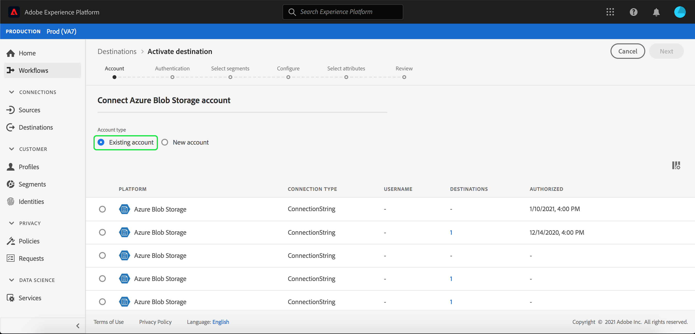

# [!DNL Azure Blob] connection

[!DNL Azure Blob] (以下「[!DNL Blob]」と呼ばれる)は、Microsoftが提供するクラウド向けのオブジェクトストレージソリューションです。このチュートリアルでは、[!DNL Platform]ユーザーインターフェイスを使用して[!DNL Blob]宛先を作成する手順を説明します。

## はじめに

このチュートリアルは、Adobe Experience Platform の次のコンポーネントを実際に利用および理解しているユーザーを対象としています。

- [[!DNL Experience Data Model (XDM)] システム](../../../xdm/home.md):Experience Platformが顧客体験データを編成する際に使用する標準化されたフレームワーク。
   - [スキーマ構成の基本](../../../xdm/schema/composition.md)：スキーマ構成の主要な原則やベストプラクティスなど、XDM スキーマの基本的な構成要素について学びます。
   - [スキーマエディタのチュートリアル](../../../xdm/tutorials/create-schema-ui.md):スキーマエディターのUIを使用してカスタムスキーマを作成する方法を説明します。
- [[!DNL Real-time Customer Profile]](../../../profile/home.md):複数のソースからの集計データに基づいて、統合されたリアルタイムの消費者プロファイルを提供します。

既に有効なBlobの宛先がある場合は、このドキュメントの残りの部分をスキップして、[宛先](../../ui/activate-destinations.md)へのセグメントのアクティブ化に関するチュートリアルに進むことができます。

### サポートされているファイル形式

[!DNL Experience Platform] は、次の書き出し先のファイル形式をサポートしてい [!DNL Blob]ます。

- 区切り文字区切り値(DSV):DSV形式のデータ・ファイルのサポートは、現在、コンマ区切り値に制限されています。 一般的なDSVファイルは、今後サポートされる予定です。 サポートされるファイルの詳細については、[宛先のアクティブ化](../../ui/activate-destinations.md#esp-and-cloud-storage)のチュートリアルのクラウドストレージの節を参照してください

## BLOBアカウントに接続{#connect-destination}

[Adobe Experience Platform](https://platform.adobe.com)にログインし、左のナビゲーションバーで「**[!UICONTROL 宛先]**」を選択して、**[!UICONTROL 宛先]**&#x200B;ワークスペースにアクセスします。 **[!UICONTROL カタログ]**&#x200B;画面には、アカウントを作成するための様々なリンク先が表示されます。

画面の左側にあるカタログから適切なカテゴリを選択できます。 または、検索オプションを使用して、操作対象の特定の宛先を見つけることもできます。

**[!UICONTROL クラウドストレージ]**&#x200B;カテゴリの下で、**[!UICONTROL Azure Blobストレージ]**&#x200B;を選択し、**[!UICONTROL アクティブ化]**&#x200B;を選択します。

**[!UICONTROL Azure Blobストレージ]**&#x200B;に接続ページが表示されます。 このページでは、新しい秘密鍵証明書または既存の秘密鍵証明書を使用できます。

### 新しいアカウント{#new-account}

新しい資格情報を使用する場合は、「**[!UICONTROL 新しいアカウント]**」を選択します。 表示される入力フォームで、接続文字列を指定します。 BLOBストレージのデータにアクセスするために必要な接続文字列です。 [!DNL Blob]接続文字列のパターン開始:`DefaultEndpointsProtocol=https;AccountName={ACCOUNT_NAME};AccountKey={ACCOUNT_KEY}`.

必要に応じて、RSA形式の公開鍵を添付して、書き出したファイルに暗号化を追加できます。 この公開鍵&#x200B;**は、Base64エンコードされた文字列として書かれる必要があります。**

### 既存のアカウント

既存のアカウントに接続するには、接続する[!DNL Blob]アカウントを選択し、**次へ**&#x200B;を選択して次に進みます。

## 認証 {#authentication}

**認証**&#x200B;ページが表示されます。 表示される入力フォームで、ファイルの名前、オプションの説明、フォルダーパス、コンテナーを入力します。 終了したら、「**[!UICONTROL 宛先を作成]**」を選択します。

## 次の手順 {#activate-segments}

このチュートリアルに従うと、[!DNL Blob]アカウントへの接続が確立されます。 次のチュートリアルに進み、[目的の](../../ui/activate-destinations.md)にセグメントをアクティブにすることができます。
