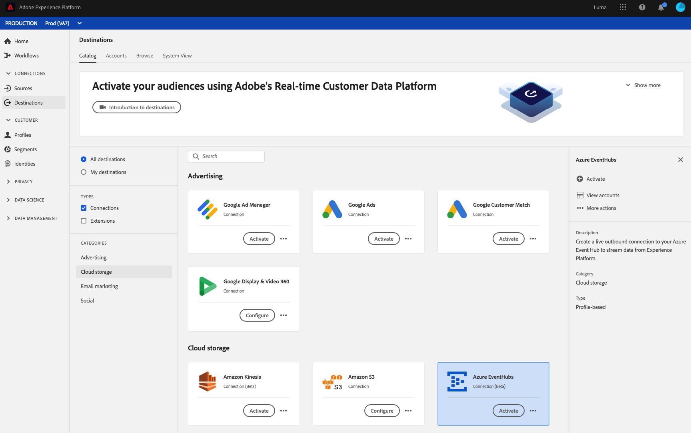
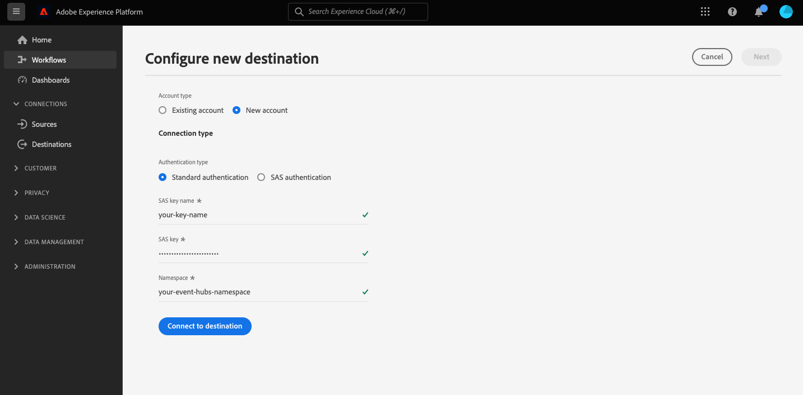
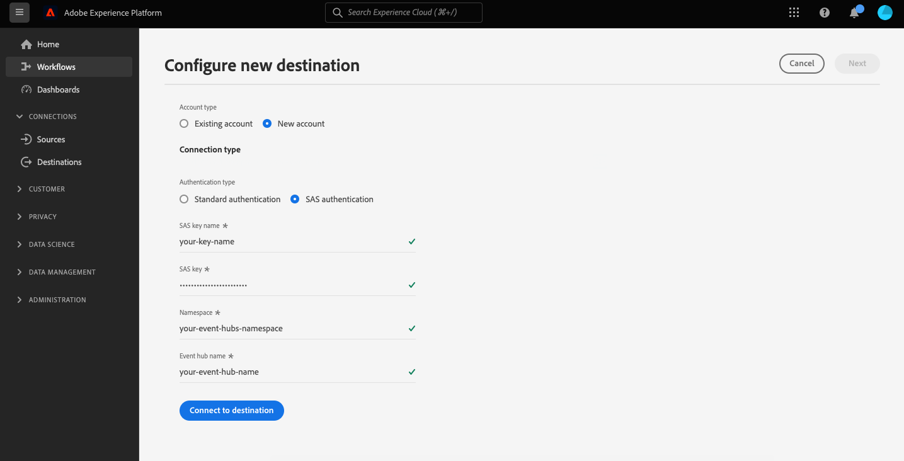
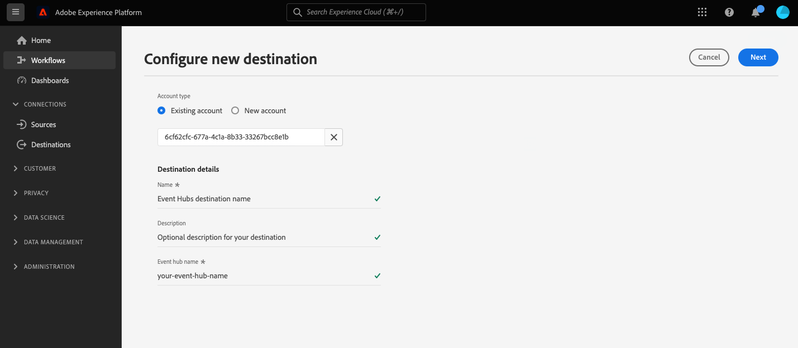

# [!DNL Azure Event Hubs] 接続

## 概要 {#overview}

>[!IMPORTANT]
>
> この宛先を使用できるのは [Adobe Real-time Customer Data Platform Ultimate](https://helpx.adobe.com/jp/legal/product-descriptions/real-time-customer-data-platform.html) の顧客のみです。

[!DNL Azure Event Hubs]はビッグデータ ストリーミング プラットフォームおよびイベント取り込みサービスです。 毎秒数百万件のイベントを受信して処理できます。 イベントハブに送信されたデータは、リアルタイム分析プロバイダーやバッチ/ストレージアダプターを使用して変換および保存できます。

[!DNL Azure Event Hubs] ストレージへのリアルタイムのアウトバウンド接続を作成して、[!DNL Adobe Experience Platform]からデータをストリーミングできます。

* [!DNL Azure Event Hubs]について詳しくは、[Microsoftのドキュメント ](https://docs.microsoft.com/en-us/azure/event-hubs/event-hubs-about)を参照してください。
* プログラムで[!DNL Azure Event Hubs]に接続するには、[ ストリーミング宛先API チュートリアル ](../../api/streaming-destinations.md)を参照してください。
* Experience Platform ユーザーインターフェイスを使用して[!DNL Azure Event Hubs]に接続するには、以下の節を参照してください。



## ユースケース {#use-cases}

[!DNL Azure Event Hubs]などのストリーミング宛先を使用すると、価値の高いセグメンテーションイベントと関連するプロファイル属性を、選択したシステムに簡単にフィードできます。

たとえば、見込み客が「コンバージョン傾向が高い」セグメントに分類されるホワイトペーパーをダウンロードしたとします。 見込み客が属するオーディエンスを[!DNL Azure Event Hubs]宛先にマッピングすると、[!DNL Azure Event Hubs]にこのイベントが表示されます。 そこで、日曜大工のアプローチを採用し、イベントの上にビジネスロジックを記述することができます。エンタープライズ IT システムで最も機能すると思うからです。

## サポートされるオーディエンス {#supported-audiences}

この節では、この宛先に書き出すことができるオーディエンスのタイプについて説明します。

| オーディエンスの由来 | サポートあり | 説明 |
|---------|----------|----------|
| [!DNL Segmentation Service] | ○ | Experience Platform [ セグメント化サービス ](../../../segmentation/home.md)を通じて生成されたオーディエンス。 |
| その他すべてのオーディエンスの生成元 | × | このカテゴリには、[!DNL Segmentation Service]を通じて生成されたオーディエンス以外のすべてのオーディエンスのオリジンが含まれます。 [様々なオーディエンスの起源](/help/segmentation/ui/audience-portal.md#customize)について読みます。 次に例を示します。 <ul><li> カスタムアップロードオーディエンス [がCSV ファイルからExperience Platformに](../../../segmentation/ui/audience-portal.md#import-audience)をインポートしました。</li><li> 類似オーディエンス， </li><li> 連合オーディエンス， </li><li> [!DNL Adobe Journey Optimizer]などの他のExperience Platform アプリで生成されたオーディエンス </li><li> その他。 </li></ul> |

{style="table-layout:auto"}


オーディエンスのデータタイプ別にサポートされるオーディエンス：

| オーディエンスのデータタイプ | サポートあり | 説明 | ユースケース |
|--------------------|-----------|-------------|-----------|
| [人物オーディエンス ](/help/segmentation/types/people-audiences.md) | ○ | 顧客プロファイルにもとづいて、マーケティング施策の特定のグループをターゲットにすることができます。 | 買い物客やカートの放棄が多い |
| [ アカウントオーディエンス ](/help/segmentation/types/account-audiences.md) | × | アカウントベースドマーケティング戦略のために、特定の組織内の個人をターゲットにします。 | B2B マーケティング |
| [見込みオーディエンス ](/help/segmentation/types/prospect-audiences.md) | × | まだ顧客ではないが、ターゲットオーディエンスと特徴を共有する個人をターゲットにします。 | サードパーティデータによる見込み顧客の開拓 |
| [ データセットの書き出し](/help/catalog/datasets/overview.md) | × | [!DNL Adobe Experience Platform] データ レイクに保存されている構造化データのコレクション。 | レポート，データサイエンスワークフロー |

{style="table-layout:auto"}


## 書き出しのタイプと頻度 {#export-type-frequency}

宛先の書き出しのタイプと頻度について詳しくは、以下の表を参照してください。

| 項目 | タイプ | メモ |
|---------|----------|---------|
| 書き出しタイプ | **[!UICONTROL Profile-based]** | [宛先のアクティベーションワークフロー](../../ui/activate-batch-profile-destinations.md#select-attributes)のプロファイル属性選択画面で選択した目的のスキーマフィールド（例：メールアドレス、電話番号、姓）と共に、セグメントのすべてのメンバーを書き出します。 |
| 書き出し頻度 | **[!UICONTROL Streaming]** | ストリーミングの宛先は常に、API ベースの接続です。オーディエンス評価に基づいて Experience Platform 内でプロファイルが更新されるとすぐに、コネクタは更新を宛先プラットフォームに送信します。[ストリーミングの宛先](/help/destinations/destination-types.md#streaming-destinations)の詳細についてはこちらを参照してください。 |

{style="table-layout:auto"}

## IP アドレスの許可リスト {#ip-address-allowlist}

お客様のセキュリティとコンプライアンス要件を満たすために、Experience Platformでは、[!DNL Azure Event Hubs]宛先に対して許可リストに加えるできる静的IPの一覧を提供しています。 許可リストに加えるするIPの完全なリストについては、[ ストリーミング宛先のIP アドレスの許可リストに加える](/help/destinations/catalog/streaming/ip-address-allow-list.md)を参照してください。

## 宛先への接続 {#connect}

>[!IMPORTANT]
>
>宛先に接続するには、**[!UICONTROL View Destinations]**&#x200B;および&#x200B;**[!UICONTROL Manage Destinations]** [ アクセス制御権限](/help/access-control/home.md#permissions)が必要です。 詳しくは、[アクセス制御の概要](/help/access-control/ui/overview.md)または製品管理者に問い合わせて、必要な権限を取得してください。

この宛先に接続するには、[宛先設定のチュートリアル](../../ui/connect-destination.md)の手順に従ってください。この宛先に接続する際は、次の情報を指定する必要があります。

### 認証情報 {#authentication-information}

#### 標準認証 {#standard-authentication}



HTTP エンドポイントに接続する&#x200B;**[!UICONTROL Standard authentication]** タイプを選択した場合は、以下のフィールドを入力し、**[!UICONTROL Connect to destination]**&#x200B;を選択します。

* **[!UICONTROL SAS Key Name]**：認証ルールの名前。これはSAS キー名とも呼ばれます。
* **[!UICONTROL SAS Key]**: イベントハブ名前空間のプライマリキー。 `sasPolicy`が対応する`sasKey`には、イベントハブのリストを入力するために&#x200B;**manage**&#x200B;権限が設定されている必要があります。 SAS キーを使用して[!DNL Azure Event Hubs]への認証を行う方法については、[Microsoftのドキュメント ](https://docs.microsoft.com/en-us/azure/event-hubs/authenticate-shared-access-signature)を参照してください。
* **[!UICONTROL Namespace]**: [!DNL Azure Event Hubs]の名前空間を入力します。 [!DNL Azure Event Hubs]名前空間について詳しくは、[Microsoft ドキュメント ](https://docs.microsoft.com/en-us/azure/event-hubs/event-hubs-create#create-an-event-hubs-namespace)を参照してください。

#### Shared Access Signature （SAS）認証 {#sas-authentication}



HTTP エンドポイントに接続する&#x200B;**[!UICONTROL Standard authentication]** タイプを選択した場合は、以下のフィールドを入力し、**[!UICONTROL Connect to destination]**&#x200B;を選択します。

* **[!UICONTROL SAS Key Name]**：認証ルールの名前。これはSAS キー名とも呼ばれます。
* **[!UICONTROL SAS Key]**: イベントハブ名前空間のプライマリキー。 `sasPolicy`が対応する`sasKey`には、イベントハブのリストを入力するために&#x200B;**manage**&#x200B;権限が設定されている必要があります。 SAS キーを使用して[!DNL Azure Event Hubs]への認証を行う方法については、[Microsoftのドキュメント ](https://docs.microsoft.com/en-us/azure/event-hubs/authenticate-shared-access-signature)を参照してください。
* **[!UICONTROL Namespace]**: [!DNL Azure Event Hubs]の名前空間を入力します。 [!DNL Azure Event Hubs]名前空間について詳しくは、[Microsoft ドキュメント ](https://docs.microsoft.com/en-us/azure/event-hubs/event-hubs-create#create-an-event-hubs-namespace)を参照してください。
* **[!UICONTROL Event Hub Name]**: [!DNL Azure Event Hub]の名前を入力します。 [!DNL Azure Event Hubs]の名前について詳しくは、[Microsoft ドキュメント ](https://learn.microsoft.com/en-us/azure/event-hubs/event-hubs-create#create-an-event-hub)を参照してください。

### 宛先の詳細の入力 {#destination-details}

>[!CONTEXTUALHELP]
>id="platform_destinations_connect_eventhubs_includesegmentnames"
>title="セグメント名を含める"
>abstract="書き出すオーディエンスの名前をデータの書き出しに含めるかどうかを切り替えます。このオプションを選択したデータの書き出しの例に関するドキュメントを表示します。"

>[!CONTEXTUALHELP]
>id="platform_destinations_connect_eventhubs_includesegmenttimestamps"
>title="セグメントのタイムスタンプを含める"
>abstract="オーディエンスが作成および更新された際の UNIX タイムスタンプと、アクティブ化のためにオーディエンスが宛先にマップされた際の UNIX タイムスタンプをデータの書き出しに含めるかどうかを切り替えます。このオプションを選択したデータの書き出しの例に関するドキュメントを表示します。"

宛先の詳細を設定するには、以下の必須フィールドとオプションフィールドに入力します。UI のフィールドの横のアスタリスクは、そのフィールドが必須であることを示します。



* **[!UICONTROL Name]**: [!DNL Azure Event Hubs]への接続の名前を入力します。
* **[!UICONTROL Description]**：接続の説明を入力します。 例：「プレミアム層のお客様」、「カイトサーフィンに興味のある方」
* **[!UICONTROL eventHubName]**: [!DNL Azure Event Hubs]宛先にストリームの名前を指定します。
* **[!UICONTROL Include Segment Names]**: データの書き出しに、書き出すオーディエンスの名前を含めるかどうかを切り替えます。 このオプションを選択したデータの書き出しの例については、[書き出されたデータ](#exported-data)の節を参照してください。
* **[!UICONTROL Include Segment Timestamps]**: オーディエンスを作成および更新した際のUNIX タイムスタンプと、オーディエンスをアクティブ化する宛先にマッピングした際のUNIX タイムスタンプをデータ書き出しに含める場合に、切り替えます。 このオプションを選択したデータの書き出しの例については、[書き出されたデータ](#exported-data)の節を参照してください。

### アラートの有効化 {#enable-alerts}

アラートを有効にすると、宛先へのデータフローのステータスに関する通知を受け取ることができます。リストからアラートを選択して、データフローのステータスに関する通知を受け取るよう登録します。アラートについて詳しくは、[UI を使用した宛先アラートの購読](../../ui/alerts.md)についてのガイドを参照してください。

宛先接続の詳細の提供が完了したら、**[!UICONTROL Next]**&#x200B;を選択します。

## この宛先に対してオーディエンスをアクティブ化 {#activate}

>[!IMPORTANT]
>
>* データをアクティブ化するには、**[!UICONTROL View Destinations]**、**[!UICONTROL Activate Destinations]**、**[!UICONTROL View Profiles]**&#x200B;および&#x200B;**[!UICONTROL View Segments]** [ アクセス制御権限](/help/access-control/home.md#permissions)が必要です。 [アクセス制御の概要](/help/access-control/ui/overview.md)を参照するか、製品管理者に問い合わせて必要な権限を取得してください。
>* [同意ポリシー評価](/help/data-governance/enforcement/auto-enforcement.md#consent-policy-evaluation)は、現在、Azure Event Hubs宛先への書き出しではサポートされていません。 [詳細情報](/help/destinations/ui/activate-streaming-profile-destinations.md#consent-policy-evaluation)。

この宛先に対するオーディエンスのアクティブ化の手順については、[ ストリーミングプロファイル書き出し宛先に対するオーディエンスデータのアクティブ化](../../ui/activate-streaming-profile-destinations.md)を参照してください。

## プロファイルの書き出し動作 {#profile-export-behavior}

Experience Platformは、プロファイルの書き出し動作を[!DNL Azure Event Hubs]宛先に最適化し、オーディエンスの選定やその他の重要なイベントの後にプロファイルに関連する更新が発生した場合にのみ、宛先にデータを書き出します。 プロファイルは、以下の状況で宛先に書き出されます。

* プロファイルの更新は、宛先にマッピングされたオーディエンスの少なくとも1つのオーディエンスメンバーシップの変更によって決定されました。 例えば、プロファイルは、宛先にマッピングされたいずれかのオーディエンスに適合しているか、宛先にマッピングされたいずれかのオーディエンスから退出しています。
* プロファイルの更新が、[ID マップ](/help/xdm/field-groups/profile/identitymap.md)の変更によって決定する場合。例えば、宛先にマッピングされたオーディエンスの 1 つに対して既に適合しているプロファイルの ID マップ属性に新しい ID が追加されたとします。
* プロファイルの更新は、宛先にマッピングされた属性のうち、少なくとも 1 つの属性が変更されたことで判断されました。例えば、マッピング手順で宛先にマッピングされた属性の 1 つがプロファイルに追加されます。

上記のすべての場合で、適切な更新が行われたプロファイルのみが宛先に書き出されます。例えば、宛先フローにマッピングされたオーディエンスに 100 人のメンバーがいて、5 つの新しいプロファイルがセグメントに適合している場合、宛先への書き出しは増分で行われ、5 つの新しいプロファイルのみが含まれます。

変更箇所に関わらず、マッピングされたすべての属性がプロファイルに対して書き出されることに注意してください。 したがって、上の例では、属性自体が変更されていない場合でも、これら 5 つの新しいプロファイルに対してマッピングされた属性がすべて書き出されます。

### データの書き出しを決定する要素と、書き出しに含まれる内容 {#what-determines-export-what-is-included}

特定のプロファイルに対して書き出されるデータについては、*書き出しに含まれるデータが[!DNL Azure Event Hubs]宛先*&#x200B;と&#x200B;*のデータ書き出しを決定するの2つの異なる概念を理解することが重要です*。

| 宛先の書き出しを決定する要素 | 宛先の書き出しに含まれる内容 |
|---------|----------|
| <ul><li>マッピングされた属性とセグメントは、宛先の書き出しのキューとして機能します。つまり、プロファイルの`segmentMembership` ステータスが`realized`または`exiting`に変更されたり、マッピングされた属性が更新されたりすると、宛先の書き出しが開始されます。</li><li>IDは現在[!DNL Azure Event Hubs]の宛先にマッピングできないため、特定のプロファイル上のIDの変更によって、宛先の書き出しも決定されます。</li><li>属性の変更は、同じ値であるかどうかに関わらず、属性に対する更新として定義されます。つまり、値自体が変更されていない場合でも、属性の上書きは変更と見なされます。</li></ul> | <ul><li>`segmentMembership` オブジェクトには、アクティブ化データフローでマッピングされたセグメントが含まれます。このセグメントについて、プロファイルのステータスが選定またはセグメント出口イベントの後に変更されました。なお、これらのセグメントが、アクティブ化データフローでマッピングされたセグメントと同じ[結合ポリシー](/help/profile/merge-policies/overview.md)に属する場合、プロファイルが適していた他のマッピングされていないセグメントを宛先の書き出しに含めることができます。 </li><li>`identityMap` オブジェクト内のすべてのIDも同様に含まれます（現在、Experience Platformは[!DNL Azure Event Hubs]の宛先でのID マッピングをサポートしていません）。</li><li>マッピングされた属性のみが宛先の書き出しに含まれます。</li></ul> |

{style="table-layout:fixed"}

>[!BEGINSHADEBOX]

例えば、このデータフローを[!DNL Azure Event Hubs]宛先に対して考えてみましょう。この宛先では、3つのオーディエンスがデータフローで選択され、4つの属性が宛先にマッピングされます。


宛先へのプロファイルの書き出しは、*3 つのマッピングされたセグメント*&#x200B;のいずれかに適合またはいずれかを離脱するプロファイルによって決定されます。データの書き出しでは、`segmentMembership` オブジェクトに、その特定のプロファイルがそのメンバーであり、書き出しをトリガーしたオーディエンスと同じ結合ポリシーを共有している場合、他のマッピングされたオーディエンスが表示される場合があります（下の[書き出されたデータ ](#exported-data)節を参照）。 プロファイルが&#x200B;**Customer with DeLorean Cars** セグメントに適格であり、**Basic Site ActiveおよびCity - Dallas** セグメントのメンバーでもある場合、これらの2つのオーディエンスは、データフローでマッピングされているため、データエクスポートの`segmentMembership` オブジェクトにも存在します。これらはDeLorean Cars **セグメントを持つ顧客と同じ結合ポリシーを共有する場合です。**

プロファイル属性の観点から、上記でマッピングした 4 つの属性に対する変更によって、書き出しの宛先が決定し、プロファイルに存在する 4 つのマッピング済み属性のいずれかがデータ書き出しに表示されます。

>[!ENDSHADEBOX]

## 履歴データのバックフィル {#historical-data-backfill}

既存の宛先に新しいオーディエンスを追加する場合、または新しい宛先を作成してオーディエンスをマッピングする場合、Experience Platformは過去のオーディエンスの選定データを宛先に書き出します。 オーディエンスが宛先に追加された&#x200B;*前*&#x200B;のオーディエンスに適格なプロファイルは、約1時間以内に宛先に書き出されます。

## 書き出したデータ {#exported-data}

書き出された [!DNL Experience Platform] データは、JSON 形式で [!DNL Azure Event Hubs] の宛先に格納されます。例えば、以下の書き出しには、特定のセグメントに適合し、別の 2 つのセグメントのメンバーであり、別のセグメントから離脱したプロファイルが含まれています。 書き出しには、プロファイル属性の名、姓、生年月日、個人メールアドレスも含まれます。 このプロファイルの ID は、ECID とメールです。

```json
{
  "person": {
    "birthDate": "YYYY-MM-DD",
    "name": {
      "firstName": "John",
      "lastName": "Doe"
    }
  },
  "personalEmail": {
    "address": "john.doe@acme.com"
  },
  "segmentMembership": {
   "ups":{
      "7841ba61-23c1-4bb3-a495-00d3g5fe1e93":{
         "lastQualificationTime":"2022-01-11T21:24:39Z",
         "status":"exited"
      },
      "59bd2fkd-3c48-4b18-bf56-4f5c5e6967ae":{
         "lastQualificationTime":"2022-01-02T23:37:33Z",
         "status":"realized"
      },
      "947c1c46-008d-40b0-92ec-3af86eaf41c1":{
         "lastQualificationTime":"2021-08-25T23:37:33Z",
         "status":"realized"
      },
      "5114d758-ce71-43ba-b53e-e2a91d67b67f":{
         "lastQualificationTime":"2022-01-11T23:37:33Z",
         "status":"realized"
      }
   }
},
  "identityMap": {
    "ecid": [
      {
        "id": "14575006536349286404619648085736425115"
      },
      {
        "id": "66478888669296734530114754794777368480"
      }
    ],
    "email_lc_sha256": [
      {
        "id": "655332b5fa2aea4498bf7a290cff017cb4"
      },
      {
        "id": "66baf76ef9de8b42df8903f00e0e3dc0b7"
      }
    ]
  }
}
```

**[!UICONTROL Include Segment Names]**&#x200B;および&#x200B;**[!UICONTROL Include Segment Timestamps]** オプションの接続先フローで選択したUI設定に応じて、書き出されたデータの詳細な例を次に示します。

+++ 以下のデータ書き出しサンプルには、`segmentMembership` セクションにオーディエンス名が含まれています

```json
"segmentMembership": {
        "ups": {
          "5b998cb9-9488-4ec3-8d95-fa8338ced490": {
            "lastQualificationTime": "2019-04-15T02:41:50+0000",
            "status": "realized",
            "createdAt": 1648553325000,
            "updatedAt": 1648553330000,
            "mappingCreatedAt": 1649856570000,
            "mappingUpdatedAt": 1649856570000,
            "name": "First name equals John"
          }
        }
      }
```

+++

+++ 以下のデータ書き出しサンプルには、`segmentMembership` セクションにオーディエンスのタイムスタンプが含まれています

```json
"segmentMembership": {
        "ups": {
          "5b998cb9-9488-4ec3-8d95-fa8338ced490": {
            "lastQualificationTime": "2019-04-15T02:41:50+0000",
            "status": "realized",
            "createdAt": 1648553325000,
            "updatedAt": 1648553330000,
            "mappingCreatedAt": 1649856570000,
            "mappingUpdatedAt": 1649856570000,
          }
        }
      }
```

+++

## 制限と再試行ポリシー {#limits-retry-policy}

Experience Platform は 95％ の確率で、HTTP 宛先の各データフローにおいて、送信に成功したメッセージのスループット待ち時間を 10 分未満、リクエスト数を 1 秒あたり 10,000 件未満で提供しようと試みます。

HTTP API 宛先へのリクエストが失敗した場合、Experience Platform は失敗したリクエストを保存し、リクエストをエンドポイントに送信するために 2 回再試行します。

>[!MORELIKETHIS]
>
>* [Azure Event Hubsに接続し、Flow Service APIを使用してデータをアクティブ化](../../api/streaming-destinations.md)
>* [AWS Kinesisの宛先](./amazon-kinesis.md)
>* [宛先のタイプとカテゴリ](../../destination-types.md)
