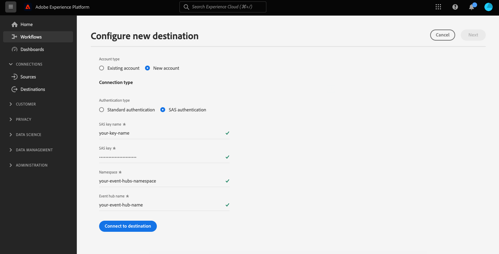

# [!DNL Azure Event Hubs] 接続

## 概要 {#overview}

>[!IMPORTANT]
>
> この宛先を使用できるのは [Adobe Real-time Customer Data Platform Ultimate](https://helpx.adobe.com/jp/legal/product-descriptions/real-time-customer-data-platform.html) の顧客のみです。

[!DNL Azure Event Hubs] は、ビッグデータストリーミングプラットフォームおよびイベント取り込みサービスです。 1 秒あたりに数百万件のイベントを受信して処理できます。 イベントハブに送信されるデータは、任意のリアルタイム分析プロバイダーまたはバッチ/ストレージアダプターを使用して、変換および保存できます。

へのリアルタイムアウトバウンド接続を作成できます [!DNL Azure Event Hubs] Adobe Experience Platformからデータをストリーミングするためのストレージ。

* 詳しくは、 [!DNL Azure Event Hubs]を参照し、 [Microsoftドキュメント](https://docs.microsoft.com/en-us/azure/event-hubs/event-hubs-about).
* 接続するには [!DNL Azure Event Hubs] プログラムを使用して、 [ストリーミング宛先 API のチュートリアル](../../api/streaming-destinations.md).
* 接続するには [!DNL Azure Event Hubs] Platform ユーザーインターフェイスを使用する場合は、以下の節を参照してください。


## ユースケース {#use-cases}

次のようなストリーミング宛先を使用する [!DNL Azure Event Hubs]を使用すると、高価値のセグメントイベントや関連するプロファイル属性を、選択したシステムに簡単にフィードできます。

例えば、見込み客がホワイトペーパーをダウンロードし、それを「コンバージョン傾向が高い」セグメントに認定したとします。 見込み客が属するオーディエンスをマッピングする [!DNL Azure Event Hubs] の宛先に指定した場合、このイベントは [!DNL Azure Event Hubs]. 企業の IT システムに最適に対応できると思われるように、このイベントの上に、自らのアプローチを使用し、ビジネスロジックを説明することができます。

## サポートされるオーディエンス {#supported-audiences}

この節では、この宛先に書き出すことができるすべてのオーディエンスについて説明します。

この宛先では、Experience Platform [セグメント化サービス](../../../segmentation/home.md).

*さらに*&#x200B;の場合、この宛先では、以下の表で説明するオーディエンスのアクティブ化もサポートされます。

| オーディエンスタイプ | 説明 |
---------|----------|
| カスタムアップロード | オーディエンス [インポート済み](../../../segmentation/ui/overview.md#import-audience) を CSV ファイルからExperience Platformに追加します。 |

{style="table-layout:auto"}

## 書き出しのタイプと頻度 {#export-type-frequency}

宛先の書き出しのタイプと頻度について詳しくは、以下の表を参照してください。

| 項目 | タイプ | メモ |
---------|----------|---------|
| 書き出しタイプ | **[!UICONTROL プロファイルベース]** | [宛先のアクティベーションワークフロー](../../ui/activate-batch-profile-destinations.md#select-attributes)のプロファイル属性選択画面で選択した目的のスキーマフィールド（例：メールアドレス、電話番号、姓）と共に、セグメントのすべてのメンバーを書き出します。 |
| 書き出し頻度 | **[!UICONTROL ストリーミング]** | ストリーミングの宛先は常に、API ベースの接続です。オーディエンス評価に基づいてExperience Platform内でプロファイルが更新されるとすぐに、コネクタは更新を宛先プラットフォームに送信します。 [ストリーミングの宛先](/help/destinations/destination-types.md#streaming-destinations)の詳細についてはこちらを参照してください。 |

{style="table-layout:auto"}

## IP アドレスの許可リスト {#ip-address-allowlist}

お客様のセキュリティおよびコンプライアンス要件を満たすために、Experience Platformは、 [!DNL Azure Event Hubs] 宛先。 許可リストに使用できる IP のリストについて詳しくは、[ストリーミング宛先用 IP アドレスの許可リスト](/help/destinations/catalog/streaming/ip-address-allow-list.md)を参照してください。

## 宛先への接続 {#connect}

>[!IMPORTANT]
> 
>宛先に接続するには、**[!UICONTROL 宛先の管理]** [アクセス制御権限](/help/access-control/home.md#permissions)が必要です。詳しくは、[アクセス制御の概要](/help/access-control/ui/overview.md)または製品管理者に問い合わせて、必要な権限を取得してください。

この宛先に接続するには、[宛先設定のチュートリアル](../../ui/connect-destination.md)の手順に従ってください。この宛先に接続する際は、次の情報を指定する必要があります。

### 認証情報 {#authentication-information}

#### 標準認証 {#standard-authentication}


次を選択した場合、 **[!UICONTROL 標準認証]** HTTP エンドポイントに接続するには、以下のフィールドに入力し、「 」を選択します。 **[!UICONTROL 宛先に接続]**:

* **[!UICONTROL SAS キー名]**：認証ルールの名前。SAS キー名とも呼ばれます。
* **[!UICONTROL SAS キー]**:Event Hubs 名前空間のプライマリキー。 The `sasPolicy` この `sasKey` 必ず～に対応する **管理** [Event Hubs] リストに値が入力されるように設定された権限。 認証の詳細 [!DNL Azure Event Hubs] に SAS キーを設定 [Microsoftドキュメント](https://docs.microsoft.com/en-us/azure/event-hubs/authenticate-shared-access-signature).
* **[!UICONTROL 名前空間]**：に入力します。 [!DNL Azure Event Hubs] 名前空間。 詳細 [!DNL Azure Event Hubs] 名前空間 [Microsoftドキュメント](https://docs.microsoft.com/en-us/azure/event-hubs/event-hubs-create#create-an-event-hubs-namespace).

#### 共有アクセス署名 (SAS) 認証 {#sas-authentication}



次を選択した場合、 **[!UICONTROL 標準認証]** HTTP エンドポイントに接続するには、以下のフィールドに入力し、「 」を選択します。 **[!UICONTROL 宛先に接続]**:

* **[!UICONTROL SAS キー名]**：認証ルールの名前。SAS キー名とも呼ばれます。
* **[!UICONTROL SAS キー]**:Event Hubs 名前空間のプライマリキー。 The `sasPolicy` この `sasKey` 必ず～に対応する **管理** [Event Hubs] リストに値が入力されるように設定された権限。 認証の詳細 [!DNL Azure Event Hubs] に SAS キーを設定 [Microsoftドキュメント](https://docs.microsoft.com/en-us/azure/event-hubs/authenticate-shared-access-signature).
* **[!UICONTROL 名前空間]**：に入力します。 [!DNL Azure Event Hubs] 名前空間。 詳細 [!DNL Azure Event Hubs] 名前空間 [Microsoftドキュメント](https://docs.microsoft.com/en-us/azure/event-hubs/event-hubs-create#create-an-event-hubs-namespace).
* **[!UICONTROL イベントハブ名]**：に入力します。 [!DNL Azure Event Hub] 名前を入力します。 詳細 [!DNL Azure Event Hubs] 名前を [Microsoftドキュメント](https://learn.microsoft.com/en-us/azure/event-hubs/event-hubs-create#create-an-event-hub).

### 宛先の詳細の入力 {#destination-details}

>[!CONTEXTUALHELP]
>id="platform_destinations_connect_eventhubs_includesegmentnames"
>title="セグメント名を含める"
>abstract="書き出すオーディエンスの名前をデータの書き出しに含めるかどうかを切り替えます。このオプションを選択したデータの書き出しの例に関するドキュメントを表示します。"

>[!CONTEXTUALHELP]
>id="platform_destinations_connect_eventhubs_includesegmenttimestamps"
>title="セグメントのタイムスタンプを含める"
>abstract="オーディエンスが作成および更新された際の UNIX タイムスタンプと、アクティブ化のためにオーディエンスが宛先にマップされた際の UNIX タイムスタンプをデータの書き出しに含めるかどうかを切り替えます。このオプションを選択したデータの書き出しの例に関するドキュメントを表示します。"

宛先の詳細を設定するには、以下の必須フィールドとオプションフィールドに入力します。UI のフィールドの横のアスタリスクは、そのフィールドが必須であることを示します。


* **[!UICONTROL 名前]**：への接続の名前を入力します。 [!DNL Azure Event Hubs].
* **[!UICONTROL 説明]**：接続の説明を入力します。  例：「プレミアム層のお客様」、「Kitesurfing に興味を持つお客様」。
* **[!UICONTROL eventHubName]**：にストリームの名前を指定します。 [!DNL Azure Event Hubs] 宛先。
* **[!UICONTROL セグメント名を含める]**：データの書き出しで、書き出すオーディエンスの名前を含めるかどうかを切り替えます。 このオプションを選択したデータの書き出しの例については、[書き出されたデータ](#exported-data)の節を参照してください。
* **[!UICONTROL セグメントのタイムスタンプを含める]**：オーディエンスが作成および更新された際の UNIX タイムスタンプと、オーディエンスがアクティベーション用に宛先にマッピングされた際の UNIX タイムスタンプをデータ書き出しに含める場合は切り替えます。 このオプションを選択したデータの書き出しの例については、[書き出されたデータ](#exported-data)の節を参照してください。

### アラートの有効化 {#enable-alerts}

アラートを有効にすると、宛先へのデータフローのステータスに関する通知を受け取ることができます。リストからアラートを選択して、データフローのステータスに関する通知を受け取るよう登録します。アラートについて詳しくは、[UI を使用した宛先アラートの購読](../../ui/alerts.md)についてのガイドを参照してください。

宛先接続への詳細の入力を終えたら「**[!UICONTROL 次へ]**」を選択します。

## この宛先に対するオーディエンスをアクティブ化 {#activate}

>[!IMPORTANT]
> 
>データをアクティブ化するには、**[!UICONTROL 宛先の管理]**、**[!UICONTROL 宛先のアクティブ化]**、**[!UICONTROL プロファイルの表示]**&#x200B;および&#x200B;**[!UICONTROL セグメントの表示]** [に対するアクセス制御権限](/help/access-control/home.md#permissions)が必要です。詳しくは、[アクセス制御の概要](/help/access-control/ui/overview.md)または製品管理者に問い合わせて、必要な権限を取得してください。

詳しくは、 [ストリーミングプロファイルの書き出し先に対するオーディエンスデータのアクティブ化](../../ui/activate-streaming-profile-destinations.md) を参照してください。

## プロファイルの書き出し動作 {#profile-export-behavior}

Experience Platformにより、プロファイルの書き出し動作を [!DNL Azure Event Hubs] 宛先：オーディエンスの選定やその他の重要なイベントに続いてプロファイルに関連する更新が発生した場合にのみ、宛先にデータを書き出します。 プロファイルは、以下の状況で宛先に書き出されます。

* プロファイルの更新は、宛先にマッピングされた少なくとも 1 つのオーディエンスのオーディエンスメンバーシップの変更によって決定されました。 例えば、プロファイルが宛先にマッピングされた 1 つのオーディエンスの対象として認定されたか、宛先にマッピングされた 1 つのオーディエンスから出たとします。
* プロファイルの更新は、[ID マップ](/help/xdm/field-groups/profile/identitymap.md)の変更によって決定します。例えば、宛先にマッピングされたオーディエンスの 1 つに対して既に資格を持っているプロファイルが、ID マップ属性に新しい ID として追加されたとします。
* プロファイルの更新は、宛先にマッピングされた属性のうち、少なくとも 1 つの属性が変更されたことで判断されました。例えば、マッピング手順で宛先にマッピングされた属性の 1 つがプロファイルに追加されます。

上記のすべての場合で、適切な更新が行われたプロファイルのみが宛先に書き出されます。例えば、宛先フローにマッピングされたオーディエンスのメンバーが 100 人で、5 つの新しいプロファイルがセグメントに認定された場合、宛先への書き出しは増分で、5 つの新しいプロファイルのみが含まれます。

変更箇所に関わらず、マッピングされたすべての属性がプロファイルに対して書き出されることに注意してください。 したがって、上の例では、属性自体が変更されていない場合でも、これら 5 つの新しいプロファイルに対してマッピングされた属性がすべて書き出されます。

### データの書き出しを決定する要素と、書き出しに含まれる内容 {#what-determines-export-what-is-included}

特定のプロファイルに対して書き出されるデータに関しては、 *が、 [!DNL Azure Event Hubs] 宛先* および *書き出しに含まれるデータ*.

| 宛先の書き出しを決定する要素 | 宛先の書き出しに含まれる内容 |
|---------|----------|
| <ul><li>マッピングされた属性とオーディエンスは、宛先の書き出しのキューとなります。 つまり、マッピングされたオーディエンスが ( `null` から `realized` またはから `realized` から `exiting`) またはマッピングされた属性が更新されると、宛先の書き出しがキックオフされます。</li><li>ID は現在にマッピングできないので [!DNL Azure Event Hubs] 宛先、特定のプロファイル上の ID の変更によって、宛先の書き出しも決まります。</li><li>属性の変更は、同じ値であるかどうかに関わらず、属性に対する更新として定義されます。つまり、値自体が変更されていない場合でも、属性の上書きは変更と見なされます。</li></ul> | <ul><li>The `segmentMembership` オブジェクトには、activation データフローにマッピングされたオーディエンスが含まれます。このオーディエンスに対して、認定またはオーディエンスの終了イベント後にプロファイルのステータスが変更されます。 これらのオーディエンスが同じに属する場合、そのプロファイルが書き出し先のエクスポートに含めることができる、マッピングされていないオーディエンスが他にも存在することに注意してください [結合ポリシー](/help/profile/merge-policies/overview.md) activation データフローにマッピングされたオーディエンスとして。 </li><li>`identityMap` オブジェクト内のすべての ID も含まれます（Experience Platform は現在、 の宛先で ID マッピングをサポートしていません）。[!DNL Azure Event Hubs]</li><li>マッピングされた属性のみが宛先の書き出しに含まれます。</li></ul> |

{style="table-layout:fixed"}

例えば、このデータフローを [!DNL Azure Event Hubs] 宛先。3 つのオーディエンスがデータフローで選択され、4 つの属性が宛先にマッピングされます。


宛先へのプロファイルの書き出しは、*3 つのマッピングされたセグメント*&#x200B;のいずれかに適合またはいずれかを離脱するプロファイルによって決定されます。ただし、データエクスポートでは、 `segmentMembership` オブジェクト ( [書き出されたデータ](#exported-data) 以下の節を参照 )、その特定のプロファイルがメンバーであり、書き出しをトリガーしたオーディエンスと同じ結合ポリシーを共有している場合は、他のマッピングされていないオーディエンスが表示されることがあります。 プロファイルが **DeLorean Cars を使用するお客様** オーディエンスに加えて、 **「未来に戻る」を視聴** 映画と **SF ファン** セグメントの場合、他の 2 つのオーディエンスも `segmentMembership` データエクスポートのオブジェクト（これらがデータフローで同じ結合ポリシーを共有している場合） **DeLorean Cars を使用するお客様** セグメント。

プロファイル属性の観点から、上記でマッピングした 4 つの属性に対する変更によって、書き出しの宛先が決定し、プロファイルに存在する 4 つのマッピング済み属性のいずれかがデータ書き出しに表示されます。

## 履歴データのバックフィル {#historical-data-backfill}

既存の宛先に新しいオーディエンスを追加する場合、または新しい宛先を作成してオーディエンスをマッピングする場合、Experience Platformは宛先にオーディエンスの資格履歴データをエクスポートします。 オーディエンスに適合するプロファイル *前* オーディエンスが宛先に追加され、約 1 時間以内に宛先に書き出されます。

## 書き出したデータ {#exported-data}

書き出された [!DNL Experience Platform] データは、JSON 形式で [!DNL Azure Event Hubs] の宛先に格納されます。例えば、以下の書き出しには、特定のセグメントに適合し、別の 2 つのセグメントのメンバーであり、別のセグメントから離脱したプロファイルが含まれています。 書き出しには、プロファイル属性の名、姓、生年月日、個人メールアドレスも含まれます。 このプロファイルの ID は、ECID とメールです。

```json
{
  "person": {
    "birthDate": "YYYY-MM-DD",
    "name": {
      "firstName": "John",
      "lastName": "Doe"
    }
  },
  "personalEmail": {
    "address": "john.doe@acme.com"
  },
  "segmentMembership": {
   "ups":{
      "7841ba61-23c1-4bb3-a495-00d3g5fe1e93":{
         "lastQualificationTime":"2022-01-11T21:24:39Z",
         "status":"exited"
      },
      "59bd2fkd-3c48-4b18-bf56-4f5c5e6967ae":{
         "lastQualificationTime":"2022-01-02T23:37:33Z",
         "status":"realized"
      },
      "947c1c46-008d-40b0-92ec-3af86eaf41c1":{
         "lastQualificationTime":"2021-08-25T23:37:33Z",
         "status":"realized"
      },
      "5114d758-ce71-43ba-b53e-e2a91d67b67f":{
         "lastQualificationTime":"2022-01-11T23:37:33Z",
         "status":"realized"
      }
   }
},
  "identityMap": {
    "ecid": [
      {
        "id": "14575006536349286404619648085736425115"
      },
      {
        "id": "66478888669296734530114754794777368480"
      }
    ],
    "email_lc_sha256": [
      {
        "id": "655332b5fa2aea4498bf7a290cff017cb4"
      },
      {
        "id": "66baf76ef9de8b42df8903f00e0e3dc0b7"
      }
    ]
  }
}
```

書き出されたデータのその他の例を以下に示します。これらは「**[!UICONTROL セグメント名を含める]**」および「**[!UICONTROL セグメントのタイムスタンプを含める]**」オプションに対して接続データフローで選択した UI 設定によって異なります。

+++ 以下のデータエクスポートのサンプルでは、 `segmentMembership` セクション

```json
"segmentMembership": {
        "ups": {
          "5b998cb9-9488-4ec3-8d95-fa8338ced490": {
            "lastQualificationTime": "2019-04-15T02:41:50+0000",
            "status": "realized",
            "createdAt": 1648553325000,
            "updatedAt": 1648553330000,
            "mappingCreatedAt": 1649856570000,
            "mappingUpdatedAt": 1649856570000,
            "name": "First name equals John"
          }
        }
      }
```

+++

+++ 以下のデータエクスポートの例では、オーディエンスのタイムスタンプが `segmentMembership` セクション

```json
"segmentMembership": {
        "ups": {
          "5b998cb9-9488-4ec3-8d95-fa8338ced490": {
            "lastQualificationTime": "2019-04-15T02:41:50+0000",
            "status": "realized",
            "createdAt": 1648553325000,
            "updatedAt": 1648553330000,
            "mappingCreatedAt": 1649856570000,
            "mappingUpdatedAt": 1649856570000,
          }
        }
      }
```

+++

## 制限と再試行ポリシー {#limits-retry-policy}

Experience Platform は 95％ の確率で、HTTP 宛先の各データフローにおいて、送信に成功したメッセージのスループット待ち時間を 10 分未満、リクエスト数を 1 秒あたり 10,000 件未満で提供しようと試みます。

HTTP API 宛先へのリクエストが失敗した場合、Experience Platform は失敗したリクエストを保存し、リクエストをエンドポイントに送信するために 2 回再試行します。

>[!MORELIKETHIS]
>
>* [Azure Event Hubs に接続し、フローサービス API を使用してデータをアクティブ化する](../../api/streaming-destinations.md)
>* [AWS Kinesisの宛先](./amazon-kinesis.md)
>* [宛先のタイプとカテゴリ](../../destination-types.md)
