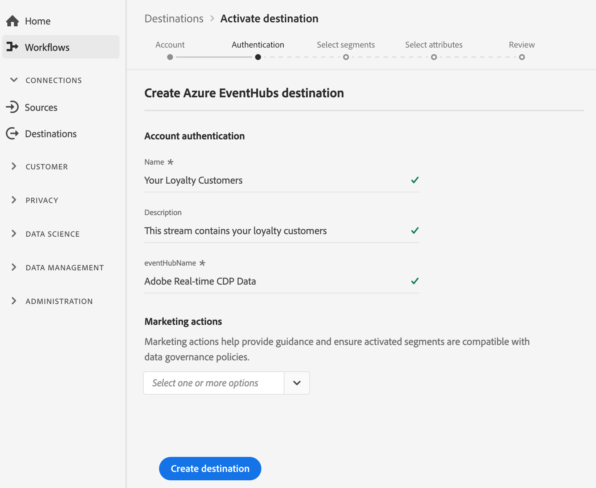

# （ベータ） [!DNL Azure Event Hubs] 宛先

>[!IMPORTANT]
>
>リアルタイムCDPの [!DNL Azure Event Hubs] 宛先は、現在ベータ版です。 ドキュメントと機能は変更される場合があります。

## 概要 {#overview}

[!DNL Azure Event Hubs] は、大規模なデータストリーミングプラットフォームおよびイベント取り込みサービスです。 1秒あたり数百万個のイベントを受信し、処理できます。 イベントハブに送信されたデータは、任意のリアルタイム分析プロバイダーまたはバッチ/ストレージアダプターを使用して、変換および保存できます。

Adobe Experience Platformからのデータをストリーミングするために、 [!DNL Azure Event Hubs] ストレージへのリアルタイムの送信接続を作成できます。

* 詳細については、 [!DNL Azure Event Hubs]Microsoftのマニュアルを参照してください [](https://docs.microsoft.com/en-us/azure/event-hubs/event-hubs-about)。
* API呼び出しを [!DNL Azure Event Hubs] 使用して接続するには、 [ストリーミング宛先APIチュートリアルを参照してください](../../api/streaming-destinations.md)。
* Real-time CDPユーザー・インターフェイスを [!DNL Azure Event Hubs] 使用して接続するには、以下のセクションを参照してください。


## 使用例 {#use-cases}

などのストリーミング送信先を使用すると [!DNL Azure Event Hubs]、高価値のセグメントイベントや関連するプロファイル属性を、選択したシステムに簡単にフィードできます。

例えば、見込み客が、「コンバージョンする傾向が高い」セグメントに該当するホワイトペーパーをダウンロードしたとします。 見込み客が属するセグメントを [!DNL Azure Event Hubs] 宛先にマッピングすると、このイベントがに表示され [!DNL Azure Event Hubs]ます。 企業のITシステムで最も効果的に機能すると考えられるように、Do-It-Yoursenアプローチを採用し、イベントの上にビジネスロジックを記述することができます。

## 書き出しタイプ {#export-type}

**プロファイルベース** — セグメントのすべてのメンバーを、必要なスキーマフィールド(例：電子メールアドレス、電話番号、姓)。 [宛先アクティベーションワークフローの属性を選択画面で選択](../../ui/activate-destinations.md#select-attributes)。

## 宛先の接続 {#connect-destination}

See [Cloud storage destinations workflow ](./workflow.md)for instructions on how to connect to your cloud storage destinations, including [!DNL Azure Event Hubs].

For [!DNL Azure Event Hubs] destinations, enter the following information in the create destination workflow:

### 認証手順の {#authentication-step}

* **[!UICONTROL SASキー名]** と **[!UICONTROL SASキー]**:SASキーの名前とキーを入力します。 SASキーを使用し [!DNL Azure Event Hubs] たときの認証については、 [Microsoftのドキュメントを参照してください](https://docs.microsoft.com/en-us/azure/event-hubs/authenticate-shared-access-signature)。
* **[!UICONTROL 名前空間]**:名前空間を入力し [!DNL Azure Event Hubs] ます。 [!DNL Azure Event Hubs] Microsoftのドキュメントの [名前空間について説明します](https://docs.microsoft.com/en-us/azure/event-hubs/event-hubs-create#create-an-event-hubs-namespace)。



### 設定手順で {#setup-step}

* **[!UICONTROL 名前]**:接続先の名前を入力し [!DNL Azure Event Hubs]ます。
* **[!UICONTROL 説明]**:接続の説明を入力します。  例：「Premium tier customers」、「Osins in kitesurfing」
* **[!UICONTROL eventHubName]**:目的のストリームの名前を指定し [!DNL Azure Event Hubs] ます。


## セグメントのアクティブ化 {#activate-segments}

セグメントのアクティベーションワークフローについて詳しくは、「[宛先へのプロファイルとセグメントのアクティブ化](../../ui/activate-destinations.md)」を参照してください。


## 書き出されたデータ {#exported-data}

書き出された [!DNL Experience Platform] データはJSON形式 [!DNL Azure Event Hubs] で取得されます。 例えば、次のイベントには、特定のセグメントに該当し、別のセグメントから離脱したオーディエンスの電子メールアドレスプロファイル属性が含まれています。 この見込み客のIDは、ECIDと電子メールです。

```json
{
  "person": {
    "email": "yourstruly@adobe.con"
  },
  "segmentMembership": {
    "ups": {
      "7841ba61-23c1-4bb3-a495-00d3g5fe1e93": {
        "lastQualificationTime": "2020-05-25T21:24:39Z",
        "status": "exited"
      },
      "59bd2fkd-3c48-4b18-bf56-4f5c5e6967ae": {
        "lastQualificationTime": "2020-05-25T23:37:33Z",
        "status": "existing"
      }
    }
  },
  "identityMap": {
    "ecid": [
      {
        "id": "14575006536349286404619648085736425115"
      },
      {
        "id": "66478888669296734530114754794777368480"
      }
    ],
    "email_lc_sha256": [
      {
        "id": "655332b5fa2aea4498bf7a290cff017cb4"
      },
      {
        "id": "66baf76ef9de8b42df8903f00e0e3dc0b7"
      }
    ]
  }
}
```


>[!MORELIKETHIS]
>
>* [Azureイベントハブに接続し、API呼び出しを使用してデータをアクティブにする](../../api/streaming-destinations.md)
>* [AWSKinesisの宛先](./amazon-kinesis.md)
>* [宛先のタイプとカテゴリ](../../destination-types.md)