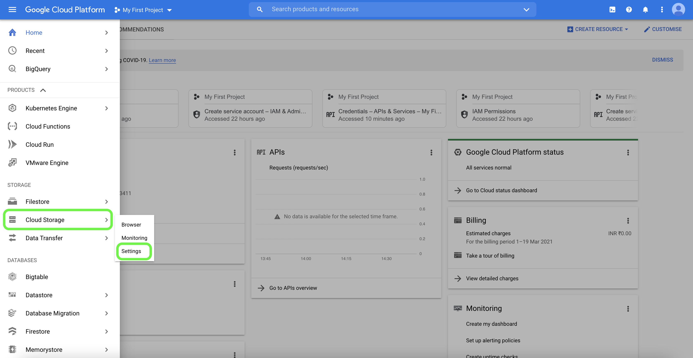
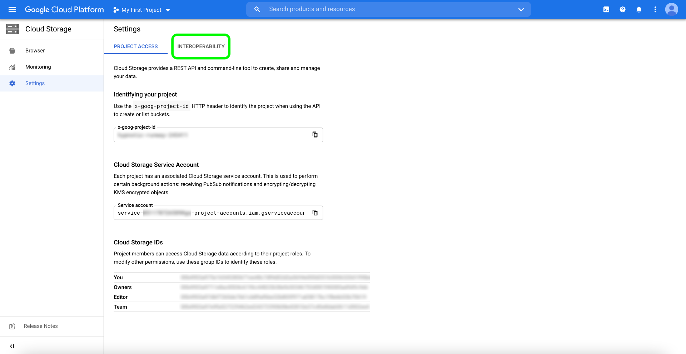
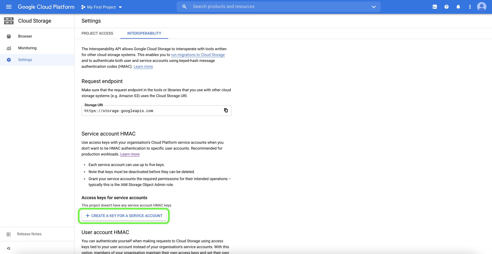
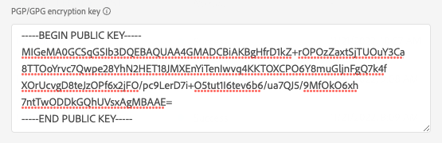

# [!DNL Google Cloud Storage] 接続

## 概要 {#overview}

[!DNL Google Cloud Storage]へのライブアウトバウンド接続を作成して、[!DNL Adobe Experience Platform]から独自のバケットにデータファイルを定期的に書き出します。

## APIまたはUIを介して[!DNL Google Cloud Storage] ストレージに接続する {#connect-api-or-ui}

* Experience Platform ユーザーインターフェイスを使用して[!DNL Google Cloud Storage] ストレージの場所に接続するには、以下の「[宛先に接続](#connect)」と「[この宛先にオーディエンスをアクティブ化](#activate)」の節を参照してください。
* プログラムで[!DNL Google Cloud Storage]のストレージの場所に接続するには、[Flow Service API チュートリアルを使用してファイルベースの宛先にオーディエンスをアクティブ化する](../../api/activate-segments-file-based-destinations.md)を参照してください。

## サポートされるオーディエンス {#supported-audiences}

この節では、この宛先に書き出すことができるオーディエンスのタイプについて説明します。

| オーディエンスの由来 | サポートあり | 説明 |
|---------|----------|----------|
| [!DNL Segmentation Service] | ○ | Experience Platform [ セグメント化サービス ](../../../segmentation/home.md)を通じて生成されたオーディエンス。 |
| その他すべてのオーディエンスの生成元 | ○ | このカテゴリには、[!DNL Segmentation Service]を通じて生成されたオーディエンス以外のすべてのオーディエンスのオリジンが含まれます。 [様々なオーディエンスの起源](/help/segmentation/ui/audience-portal.md#customize)について読みます。 次に例を示します。 <ul><li> カスタムアップロードオーディエンス [がCSV ファイルからExperience Platformに](../../../segmentation/ui/audience-portal.md#import-audience)をインポートしました。</li><li> 類似オーディエンス， </li><li> 連合オーディエンス， </li><li> [!DNL Adobe Journey Optimizer]などの他のExperience Platform アプリで生成されたオーディエンス </li><li> その他。 </li></ul> |

{style="table-layout:auto"}

オーディエンスのデータタイプ別にサポートされるオーディエンス：

| オーディエンスのデータタイプ | サポートあり | 説明 | ユースケース |
|--------------------|-----------|-------------|-----------|
| [人物オーディエンス ](/help/segmentation/types/people-audiences.md) | ○ | 顧客プロファイルにもとづいて、マーケティング施策の特定のグループをターゲットにすることができます。 | 買い物客やカートの放棄が多い |
| [ アカウントオーディエンス ](/help/segmentation/types/account-audiences.md) | × | アカウントベースドマーケティング戦略のために、特定の組織内の個人をターゲットにします。 | B2B マーケティング |
| [見込みオーディエンス ](/help/segmentation/types/prospect-audiences.md) | ○ | まだ顧客ではないが、ターゲットオーディエンスと特徴を共有する個人をターゲットにします。 | サードパーティデータによる見込み顧客の開拓 |
| [ データセットの書き出し](/help/catalog/datasets/overview.md) | ○ | [!DNL Adobe Experience Platform] データ レイクに保存されている構造化データのコレクション。 | レポート，データサイエンスワークフロー |

{style="table-layout:auto"}

## 書き出しのタイプと頻度 {#export-type-frequency}

宛先の書き出しタイプと頻度については、次の表を参照してください。

| 項目 | タイプ | メモ |
|---------|----------|---------|
| 書き出しタイプ | **[!UICONTROL Profile-based]** | [宛先のアクティベーションワークフロー](/help/destinations/ui/activate-batch-profile-destinations.md#select-attributes)のプロファイル属性の選択画面で選択したように、セグメントのすべてのメンバーを該当するスキーマフィールドと共に書き出します。 |
| 書き出し頻度 | **[!UICONTROL Batch]** | バッチ宛先では、ファイルが 3 時間、6 時間、8 時間、12 時間、24 時間の単位でダウンストリームプラットフォームに書き出されます。 詳しくは、[バッチ（ファイルベース）宛先](/help/destinations/destination-types.md#file-based)を参照してください。 |

{style="table-layout:auto"}

## データセットの書き出し {#export-datasets}

この宛先では、データセットの書き出しをサポートしています。 データセットの書き出しを設定する方法について詳しくは、チュートリアルを参照してください。

* Experience Platform ユーザーインターフェイス [を使用してデータセットを](/help/destinations/ui/export-datasets.md) エクスポートする方法。
* Flow Service APIを使用してデータセットをプログラムで[ エクスポートする方法](/help/destinations/api/export-datasets.md)。

## 書き出されたデータのファイル形式 {#file-format}

*オーディエンスデータ*&#x200B;を書き出すと、Experience Platformは、指定した保存場所に`.csv`、`parquet`、または`.json`個のファイルを作成します。 ファイルについて詳しくは、オーディエンスアクティベーションのチュートリアルの「[ サポートされている書き出し用ファイル形式](../../ui/activate-batch-profile-destinations.md#supported-file-formats-export)」セクションを参照してください。

*データセット*&#x200B;を書き出すと、Experience Platformは、指定したストレージの場所に`.parquet`または`.json`個のファイルを作成します。 ファイルについて詳しくは、データセットの書き出しチュートリアルの「[成功したデータセットの書き出しを検証する](../../ui/export-datasets.md#verify)」セクションを参照してください。

## [!DNL Google Cloud Storage] アカウントを接続するための前提条件の設定 {#prerequisites}

Experience Platformを[!DNL Google Cloud Storage]に接続するには、まず[!DNL Google Cloud Storage] アカウントの相互運用性を有効にする必要があります。 相互運用性の設定にアクセスするには、[!DNL Google Cloud Platform]を開き、ナビゲーションパネルの&#x200B;**[!UICONTROL Settings]** オプションから&#x200B;**[!UICONTROL Cloud Storage]**&#x200B;を選択します。

**[!UICONTROL Settings]** ページが表示されます。 ここから、[!DNL Google] プロジェクト ID に関する情報と [!DNL Google Cloud Storage] アカウントの詳細を確認できます。相互運用性の設定にアクセスするには、上部ヘッダーから「**[!UICONTROL Interoperability]**」を選択します。

**[!UICONTROL Interoperability]** ページには、認証、アクセスキー、およびサービスアカウントに関連付けられているデフォルトプロジェクトに関する情報が含まれています。 新しいアクセス キーIDとサービス アカウントの秘密アクセス キーを生成するには、**[!UICONTROL Create a Key for a Service Account]**&#x200B;を選択します。

新しく生成したアクセス キーIDと秘密アクセス キーを使用して、[!DNL Google Cloud Storage] アカウントをExperience Platformに接続できます。

## 宛先への接続 {#connect}

>[!IMPORTANT]
>
>宛先に接続するには、**[!UICONTROL View Destinations]**&#x200B;および&#x200B;**[!UICONTROL Manage Destinations]** [ アクセス制御権限](/help/access-control/home.md#permissions)が必要です。 詳しくは、[アクセス制御の概要](/help/access-control/ui/overview.md)または製品管理者に問い合わせて、必要な権限を取得してください。

この宛先に接続するには、[宛先設定のチュートリアル](/help/destinations/ui/connect-destination.md)の手順に従ってください。宛先の設定ワークフローで、以下の 2 つの節でリストされているフィールドに入力します。

### 宛先に対する認証 {#authenticate}

宛先に対して認証を行うには、必須フィールドに入力し、**[!UICONTROL Connect to destination]**&#x200B;を選択します。

* **[!UICONTROL Access key ID]**: [!DNL Google Cloud Storage] アカウントをExperience Platformに認証するために使用される61文字の英数字の文字列。 この値の取得方法について詳しくは、上記の[前提条件](#prerequisites)の節を参照してください。
* **[!UICONTROL Secret access key]**: [!DNL Google Cloud Storage] アカウントをExperience Platformに認証するために使用される、40文字のbase64 エンコードされた文字列。 この値の取得方法について詳しくは、上記の[前提条件](#prerequisites)の節を参照してください。
* **[!UICONTROL Encryption key]**: オプションで、RSA形式の公開鍵を添付して、書き出したファイルに暗号化を追加できます。 正しい形式の暗号化キーの例については、以下の画像を参照してください。

  

これらの値について詳しくは、[Google Cloud Storage の HMAC キー](https://cloud.google.com/storage/docs/authentication/hmackeys#overview)ガイドを参照してください。独自のアクセスキーIDとシークレットアクセスキーを生成する手順については、[[!DNL Google Cloud Storage]  ソースの概要](/help/sources/connectors/cloud-storage/google-cloud-storage.md)を参照してください。

### 宛先の詳細を入力 {#destination-details}

宛先の詳細を設定するには、以下の必須フィールドとオプションフィールドに入力します。UI のフィールドの横のアスタリスクは、そのフィールドが必須であることを示します。

* **[!UICONTROL Name]**：この宛先の優先名を入力します。
* **[!UICONTROL Description]**：オプション。例えば、この宛先を使用しているキャンペーンを指定できます。
* **[!UICONTROL Bucket name]**：この宛先で使用する[!DNL Google Cloud Storage] バケットの名前を入力します。
* **[!UICONTROL Folder path]**：書き出されたファイルをホストする宛先フォルダーへのパスを入力します。
* **[!UICONTROL File type]**：書き出したファイルにExperience Platformで使用する形式を選択します。 [!UICONTROL CSV] オプションを選択する際に、[ ファイル形式オプションを設定することもできます](../../ui/batch-destinations-file-formatting-options.md)。
* **[!UICONTROL Compression format]**：書き出したファイルにExperience Platformで使用する圧縮タイプを選択します。
* **[!UICONTROL Include manifest file]**：書き出しの場所や書き出しサイズなどの情報を含むマニフェスト JSON ファイルを書き出しに含める場合は、このオプションをオンに切り替えます。 マニフェストの名前は、形式`manifest-<<destinationId>>-<<dataflowRunId>>.json`を使用して指定されています。 [ サンプルマニフェストファイル ](/help/destinations/assets/common/manifest-d0420d72-756c-4159-9e7f-7d3e2f8b501e-0ac8f3c0-29bd-40aa-82c1-f1b7e0657b19.json)を表示します。 マニフェストファイルには、次のフィールドが含まれます。
   * `flowRunId`: エクスポートされたファイルを生成した[ データフロー実行](/help/dataflows/ui/monitor-destinations.md#dataflow-runs-for-batch-destinations)。
   * `scheduledTime`: ファイルがエクスポートされたUTCの時間。
   * `exportResults.sinkPath`：書き出されたファイルが格納されているストレージの場所のパス。
   * `exportResults.name`: エクスポートされたファイルの名前。
   * `size`：書き出されたファイルのサイズ （バイト単位）。

### アラートの有効化 {#enable-alerts}

アラートを有効にすると、宛先へのデータフローのステータスに関する通知を受け取ることができます。リストからアラートを選択して、データフローのステータスに関する通知を受け取るよう登録します。アラートについて詳しくは、[UI を使用した宛先アラートの購読](../../ui/alerts.md)についてのガイドを参照してください。

宛先接続の詳細の提供が完了したら、**[!UICONTROL Next]**&#x200B;を選択します。

### 必要な [!DNL Google Cloud Storage] 権限 {#required-google-cloud-storage-permission}

データを接続して[!DNL Google Cloud Storage] ストレージの場所に正常にエクスポートするには、バケットに対して次の[!DNL Google Cloud Storage]権限が必要です。

* `orgpolicy.policy.get`
* `resourcemanager.projects.get`
* `resourcemanager.projects.list`
* `storage.managedFolders.create`
* `storage.multipartUploads.abort`
* `storage.multipartUploads.create`
* `storage.multipartUploads.listParts`
* `storage.objects.create`
* `storage.objects.list`

[の](https://cloud.google.com/storage/docs/access-control/iam-permissions) アクセス制御と権限[!DNL Google Cloud Storage]の詳細をご覧ください。

## この宛先に対してオーディエンスをアクティブ化 {#activate}

>[!IMPORTANT]
>
>* データをアクティブ化するには、**[!UICONTROL View Destinations]**、**[!UICONTROL Activate Destinations]**、**[!UICONTROL View Profiles]**&#x200B;および&#x200B;**[!UICONTROL View Segments]** [ アクセス制御権限](/help/access-control/home.md#permissions)が必要です。 [アクセス制御の概要](/help/access-control/ui/overview.md)を参照するか、製品管理者に問い合わせて必要な権限を取得してください。
>* *ID*&#x200B;をエクスポートするには、**[!UICONTROL View Identity Graph]** [ アクセス制御権限](/help/access-control/home.md#permissions)が必要です。  {width="100" zoomable="yes"}

この宛先に対するオーディエンスのアクティブ化の手順については、[ バッチプロファイル書き出し宛先に対するオーディエンスデータのアクティブ化](../../ui/activate-batch-profile-destinations.md)を参照してください。

### スケジュール設定 {#scheduling}

**[!UICONTROL Scheduling]**&#x200B;手順では、[宛先に対して](/help/destinations/ui/activate-batch-profile-destinations.md#scheduling)書き出しスケジュール [!DNL Google Cloud Storage]を設定でき、書き出したファイルの名前を[設定することもできます](/help/destinations/ui/activate-batch-profile-destinations.md#configure-file-names)。

### 属性と ID のマッピング {#map}

**[!UICONTROL Mapping]** ステップでは、プロファイルにエクスポートする属性フィールドとID フィールドを選択できます。 また、書き出したファイル内のヘッダーを選択して、任意のわかりやすい名前に変更することもできます。詳しくは、「バッチの宛先をアクティベート」UI チュートリアルの[マッピング手順](/help/destinations/ui/activate-batch-profile-destinations.md#mapping)を参照してください。

## データの正常な書き出しの検証 {#exported-data}

データが正常に書き出されたかどうかを確認するには、[!DNL Google Cloud Storage] バケットを確認し、書き出したファイルに、期待されたプロファイルの母集団が含まれていることを確認します。

## IP アドレスの許可リスト {#ip-address-allow-list}

Adobe IPを契約許可リストに追加する必要がある場合は、「[IP アドレス契約](ip-address-allow-list.md)」を参照してください。