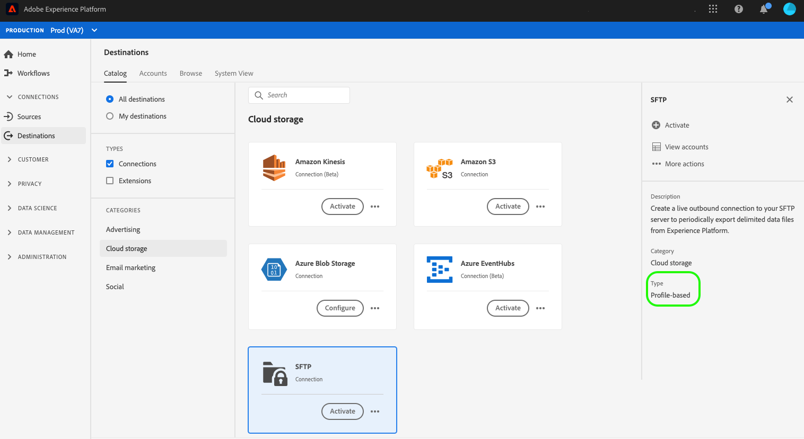
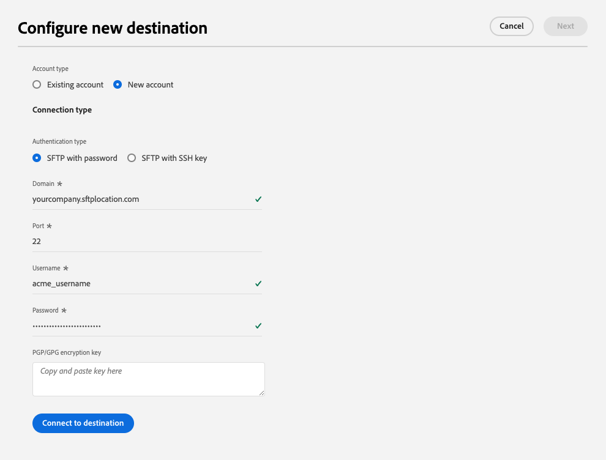
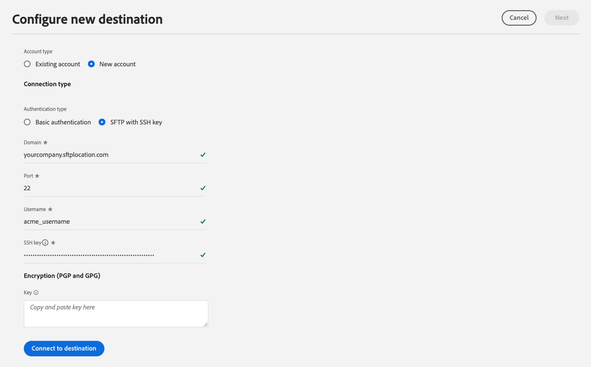
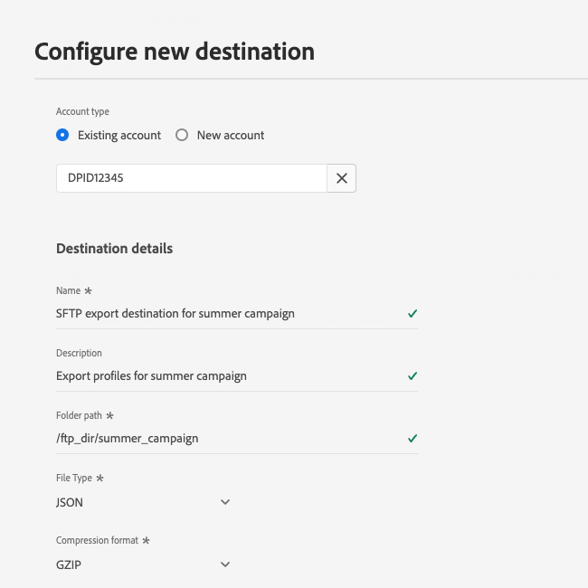

# SFTP 接続

## 宛先の変更ログ {#changelog}

2023年7月のExperience Platform リリースでは、SFTPの宛先は次のように新しい機能を提供します。

* [データセット書き出しのサポート](/help/destinations/ui/export-datasets.md)。
* 追加の[ファイル命名オプション](/help/destinations/ui/activate-batch-profile-destinations.md#scheduling)。
* 書き出されたファイルにカスタムファイルヘッダーを設定する機能（[マッピングステップの改善](/help/destinations/ui/activate-batch-profile-destinations.md#mapping)による）
* [書き出された CSV データファイルの形式をカスタマイズする機能](/help/destinations/ui/batch-destinations-file-formatting-options.md)。

## 概要 {#overview}

SFTP サーバーへのライブアウトバウンド接続を作成して、[!DNL Adobe Experience Platform]から区切られたデータファイルを定期的にエクスポートします。

>[!IMPORTANT]
>
> Experience Platform では SFTP サーバーへのデータの書き出しをサポートしていますが、データを書き出す際に推奨されるクラウドストレージの場所は [!DNL Amazon S3] と [!DNL Azure Blob] です。

## APIまたはUIを介したSFTPへの接続 {#connect-api-or-ui}

* Experience Platform ユーザーインターフェイスを使用してSFTP ストレージの場所に接続するには、以下の「[宛先に接続](#connect)」および「[この宛先にオーディエンスをアクティブ化](#activate)」の節を参照してください。
* SFTP ストレージの場所にプログラムで接続するには、[Flow Service API チュートリアルを使用してファイルベースの宛先にオーディエンスをアクティベートする](../../api/activate-segments-file-based-destinations.md)を参照してください。

## サポートされるオーディエンス {#supported-audiences}

この節では、この宛先に書き出すことができるオーディエンスのタイプについて説明します。

| オーディエンスの由来 | サポートあり | 説明 |
|---------|----------|----------|
| [!DNL Segmentation Service] | ○ | Experience Platform [ セグメント化サービス ](../../../segmentation/home.md)を通じて生成されたオーディエンス。 |
| その他すべてのオーディエンスの生成元 | ○ | このカテゴリには、[!DNL Segmentation Service]を通じて生成されたオーディエンス以外のすべてのオーディエンスのオリジンが含まれます。 [様々なオーディエンスの起源](/help/segmentation/ui/audience-portal.md#customize)について読みます。 次に例を示します。 <ul><li> カスタムアップロードオーディエンス [がCSV ファイルからExperience Platformに](../../../segmentation/ui/audience-portal.md#import-audience)をインポートしました。</li><li> 類似オーディエンス， </li><li> 連合オーディエンス， </li><li> [!DNL Adobe Journey Optimizer]などの他のExperience Platform アプリで生成されたオーディエンス </li><li> その他。 </li></ul> |

{style="table-layout:auto"}

オーディエンスのデータタイプ別にサポートされるオーディエンス：

| オーディエンスのデータタイプ | サポートあり | 説明 | ユースケース |
|--------------------|-----------|-------------|-----------|
| [人物オーディエンス ](/help/segmentation/types/people-audiences.md) | ○ | 顧客プロファイルにもとづいて、マーケティング施策の特定のグループをターゲットにすることができます。 | 買い物客やカートの放棄が多い |
| [ アカウントオーディエンス ](/help/segmentation/types/account-audiences.md) | ○ | アカウントベースドマーケティング戦略のために、特定の組織内の個人をターゲットにします。 | B2B マーケティング |
| [見込みオーディエンス ](/help/segmentation/types/prospect-audiences.md) | ○ | まだ顧客ではないが、ターゲットオーディエンスと特徴を共有する個人をターゲットにします。 | サードパーティデータによる見込み顧客の開拓 |
| [ データセットの書き出し](/help/catalog/datasets/overview.md) | ○ | [!DNL Adobe Experience Platform] データ レイクに保存されている構造化データのコレクション。 | レポート，データサイエンスワークフロー |

{style="table-layout:auto"}

## 書き出しのタイプと頻度 {#export-type-frequency}

宛先の書き出しのタイプと頻度について詳しくは、以下の表を参照してください。

| 項目 | タイプ | メモ |
|---------|----------|---------|
| 書き出しタイプ | **[!UICONTROL Profile-based]** | [宛先のアクティベーションワークフロー](../../ui/activate-batch-profile-destinations.md#select-attributes)のプロファイル属性選択画面で選択した目的のスキーマフィールド（例：メールアドレス、電話番号、姓）と共に、セグメントのすべてのメンバーを書き出します。 |
| 書き出し頻度 | **[!UICONTROL Batch]** | バッチ宛先では、ファイルが 3 時間、6 時間、8 時間、12 時間、24 時間の単位でダウンストリームプラットフォームに書き出されます。 詳しくは、[バッチ（ファイルベース）宛先](/help/destinations/destination-types.md#file-based)を参照してください。 |

{style="table-layout:auto"}

宛先カタログで

## データセットの書き出し {#export-datasets}

この宛先では、データセットの書き出しをサポートしています。 データセットの書き出しを設定する方法について詳しくは、チュートリアルを参照してください。

* Experience Platform ユーザーインターフェイス [を使用してデータセットを](/help/destinations/ui/export-datasets.md) エクスポートする方法。
* Flow Service APIを使用してデータセットをプログラムで[ エクスポートする方法](/help/destinations/api/export-datasets.md)。

## 書き出されたデータのファイル形式 {#file-format}

*オーディエンスデータ*&#x200B;を書き出すと、Experience Platformは、指定した保存場所に`.csv`、`parquet`、または`.json`個のファイルを作成します。 ファイルについて詳しくは、オーディエンスアクティベーションのチュートリアルの「[ サポートされている書き出し用ファイル形式](../../ui/activate-batch-profile-destinations.md#supported-file-formats-export)」セクションを参照してください。

*データセット*&#x200B;を書き出すと、Experience Platformは、指定したストレージの場所に`.parquet`または`.json`個のファイルを作成します。 ファイルについて詳しくは、データセットの書き出しチュートリアルの「[成功したデータセットの書き出しを検証する](../../ui/export-datasets.md#verify)」セクションを参照してください。

## SFTP サーバーの接続要件 {#sftp-connection-requirements}

データの書き出しを成功させるには、十分な数の同時接続を許可するようにターゲット SFTP サーバーを設定する必要があります。 SFTP サーバーで同時に接続できる数が制限されている場合、特に複数のオーディエンスまたはデータセットを同時に書き出すと、書き出しジョブの失敗が発生する可能性があります。

**推奨事項**
最適なパフォーマンスを得るには、SFTP サーバーで、書き出すオーディエンスまたはデータセットごとに少なくとも1つの同時接続を許可する必要があります。 少なくとも、サーバーは、同時に書き出しがスケジュールされているオーディエンスまたはデータセットの合計数の30%以上をサポートする必要があります。

**例**\
100個のオーディエンスまたはデータセットの書き出しを同時にスケジュールする場合、SFTP サーバーは少なくとも30個の同時接続を許可する必要があります。

SFTP サーバーの接続制限を適切に設定すると、書き出しの失敗を防ぎ、[!DNL Adobe Experience Platform]からの信頼性の高いデータ配信を確保できます。

## 宛先への接続 {#connect}

>[!IMPORTANT]
>
>宛先に接続するには、**[!UICONTROL View Destinations]**&#x200B;および&#x200B;**[!UICONTROL Manage Destinations]** [ アクセス制御権限](/help/access-control/home.md#permissions)が必要です。 詳しくは、[アクセス制御の概要](/help/access-control/ui/overview.md)または製品管理者に問い合わせて、必要な権限を取得してください。

この宛先に接続するには、[宛先設定のチュートリアル](../../ui/connect-destination.md)の手順に従ってください。宛先の設定ワークフローで、以下の 2 つのセクションにリストされているフィールドに入力します。

### 認証情報 {#authentication-information}

>[!CONTEXTUALHELP]
>id="platform_destinations_connect_sftp_rsa"
>title="RSA 公開鍵"
>abstract="必要に応じて、RSA 形式の公開鍵を添付して、書き出したファイルに暗号化を追加できます。正しい形式のキーの例については、以下のドキュメントリンクを参照してください。"

>[!CONTEXTUALHELP]
>id="platform_destinations_connect_sftp_ssh"
>title="SSH 秘密鍵"
>abstract="SSH 秘密鍵は、RSA 形式の Base64 でエンコードされた文字列にする必要があり、パスワードで保護しないでください。"

**[!UICONTROL SFTP with password]**&#x200B;認証タイプを選択してSFTPの場所に接続する場合：

* **[!UICONTROL Domain]**: SFTP ストレージの場所のアドレス。
* **[!UICONTROL Username]**: SFTP ストレージの場所にログインするユーザー名。
* **[!UICONTROL Port]**: SFTP ストレージの場所で使用されるポート。
* **[!UICONTROL Password]**: SFTP ストレージの場所にログインするためのパスワード。
* **[!UICONTROL Encryption key]**: オプションで、RSA形式の公開鍵を添付して、書き出したファイルに暗号化を追加できます。 正しい形式の暗号化キーの例については、以下の画像を参照してください。

  

**[!UICONTROL SFTP with SSH key]**&#x200B;認証タイプを選択してSFTPの場所に接続する場合：

* **[!UICONTROL Domain]**: SFTP アカウントのIP アドレスまたはドメイン名を入力します
* **[!UICONTROL Port]**: SFTP ストレージの場所で使用されるポート。
* **[!UICONTROL Username]**: SFTP ストレージの場所にログインするユーザー名。
* **[!UICONTROL SSH Key]**: SFTP ストレージの場所へのログインに使用される秘密SSH キー。 秘密鍵はRSA形式のBase64でエンコードされた文字列で、パスワードで保護してはなりません。
* **[!UICONTROL Encryption key]**: オプションで、RSA形式の公開鍵を添付して、書き出したファイルに暗号化を追加できます。 正しい形式の暗号化キーの例については、以下の画像を参照してください。

  

### 宛先の詳細 {#destination-details}

SFTP ストレージの場所への認証接続を確立したら、宛先の次の情報を指定します。

* **[!UICONTROL Name]**: Experience Platform ユーザーインターフェイスでこの宛先を識別するのに役立つ名前を入力します。
* **[!UICONTROL Description]**：この宛先の説明を入力します。
* **[!UICONTROL Folder path]**: ファイルが書き出されるSFTPの場所にあるフォルダーへのパスを入力します。
* **[!UICONTROL File type]**：書き出したファイルにExperience Platformで使用する形式を選択します。 [!UICONTROL CSV] オプションを選択する際に、[ ファイル形式オプションを設定することもできます](../../ui/batch-destinations-file-formatting-options.md)。
* **[!UICONTROL Compression format]**：書き出したファイルにExperience Platformで使用する圧縮タイプを選択します。
* **[!UICONTROL Include manifest file]**：書き出しの場所や書き出しサイズなどの情報を含むマニフェスト JSON ファイルを書き出しに含める場合は、このオプションをオンに切り替えます。 マニフェストの名前は、形式`manifest-<<destinationId>>-<<dataflowRunId>>.json`を使用して指定されています。 [ サンプルマニフェストファイル ](/help/destinations/assets/common/manifest-d0420d72-756c-4159-9e7f-7d3e2f8b501e-0ac8f3c0-29bd-40aa-82c1-f1b7e0657b19.json)を表示します。 マニフェストファイルには、次のフィールドが含まれます。
   * `flowRunId`: エクスポートされたファイルを生成した[ データフロー実行](/help/dataflows/ui/monitor-destinations.md#dataflow-runs-for-batch-destinations)。
   * `scheduledTime`: ファイルがエクスポートされたUTCの時間。
   * `exportResults.sinkPath`：書き出されたファイルが格納されているストレージの場所のパス。
   * `exportResults.name`: エクスポートされたファイルの名前。
   * `size`：書き出されたファイルのサイズ （バイト単位）。

## この宛先に対してオーディエンスをアクティブ化 {#activate}

>[!IMPORTANT]
>
>* データをアクティブ化するには、**[!UICONTROL View Destinations]**、**[!UICONTROL Activate Destinations]**、**[!UICONTROL View Profiles]**&#x200B;および&#x200B;**[!UICONTROL View Segments]** [ アクセス制御権限](/help/access-control/home.md#permissions)が必要です。 [アクセス制御の概要](/help/access-control/ui/overview.md)を参照するか、製品管理者に問い合わせて必要な権限を取得してください。
>* *ID*&#x200B;をエクスポートするには、**[!UICONTROL View Identity Graph]** [ アクセス制御権限](/help/access-control/home.md#permissions)が必要です。  {width="100" zoomable="yes"}

この宛先に対するオーディエンスのアクティブ化の手順については、[ バッチプロファイル書き出し宛先に対するオーディエンスデータのアクティブ化](../../ui/activate-batch-profile-destinations.md)を参照してください。

## データの正常な書き出しの検証 {#exported-data}

データが正常に書き出されたかどうかを確認するには、SFTP ストレージを確認し、書き出されたファイルに想定されるプロファイル母集団が含まれていることを確認します。

## IP アドレスの許可リスト {#ip-address-allow-list}

Adobe IPを契約許可リストに追加する必要がある場合は、「[IP アドレス契約](ip-address-allow-list.md)」を参照してください。
