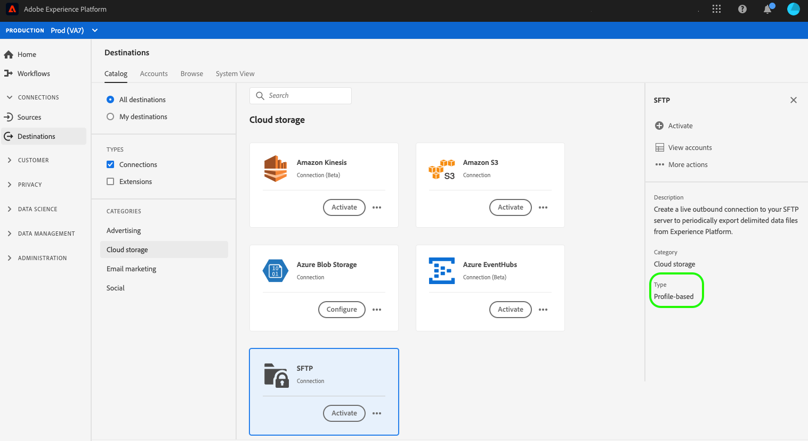

# SFTP 接続

## 宛先の変更ログ {#changelog}

2023 年 7 月のExperience Platformリリースでは、SFTP の宛先は次に示す新しい機能を提供します。

* [!BADGE Beta]{type=Informative}[データセット書き出しのサポート](/help/destinations/ui/export-datasets.md)。
* 追加の[ファイル命名オプション](/help/destinations/ui/activate-batch-profile-destinations.md#scheduling)。
* 書き出されたファイルにカスタムファイルヘッダーを設定する機能（[マッピングステップの改善](/help/destinations/ui/activate-batch-profile-destinations.md#mapping)による）
* [書き出された CSV データファイルの形式をカスタマイズする機能](/help/destinations/ui/batch-destinations-file-formatting-options.md)。

## 概要 {#overview}

SFTP サーバーへのライブアウトバウンド接続を作成して、区切りデータファイルを定期的に Adobe Experience Platform から書き出します。

>[!IMPORTANT]
>
> Experience Platform では SFTP サーバーへのデータの書き出しをサポートしていますが、データを書き出す際に推奨されるクラウドストレージの場所は [!DNL Amazon S3] と [!DNL SFTP] です。

## API または UI を使用した SFTP への接続 {#connect-api-or-ui}

* Platform ユーザーインターフェイスを使用して SFTP ストレージの場所に接続するには、以下の節を参照してください [宛先に接続](#connect) および [この宛先に対するオーディエンスをアクティブ化](#activate) 下
* プログラムで SFTP ストレージの場所に接続するには、 [フローサービス API のチュートリアルを使用して、ファイルベースの宛先に対するオーディエンスをアクティブ化します](../../api/activate-segments-file-based-destinations.md).

## サポートされるオーディエンス {#supported-audiences}

この節では、この宛先に書き出すことができるすべてのオーディエンスについて説明します。

この宛先では、Experience Platform [セグメント化サービス](../../../segmentation/home.md).

*さらに*&#x200B;の場合、この宛先では、以下の表で説明するオーディエンスのアクティブ化もサポートされます。

| オーディエンスタイプ | 説明 |
---------|----------|
| カスタムアップロード | オーディエンス [インポート済み](../../../segmentation/ui/overview.md#import-audience) を CSV ファイルからExperience Platformに追加します。 |

{style="table-layout:auto"}

## 書き出しのタイプと頻度 {#export-type-frequency}

宛先の書き出しのタイプと頻度について詳しくは、以下の表を参照してください。

| 項目 | タイプ | メモ |
---------|----------|---------|
| 書き出しタイプ | **[!UICONTROL プロファイルベース]** | [宛先のアクティベーションワークフロー](../../ui/activate-batch-profile-destinations.md#select-attributes)のプロファイル属性選択画面で選択した目的のスキーマフィールド（例：メールアドレス、電話番号、姓）と共に、セグメントのすべてのメンバーを書き出します。 |
| 書き出し頻度 | **[!UICONTROL バッチ]** | バッチ宛先では、ファイルが 3 時間、6 時間、8 時間、12 時間、24 時間の単位でダウンストリームプラットフォームに書き出されます。 詳しくは、[バッチ（ファイルベース）宛先](/help/destinations/destination-types.md#file-based)を参照してください。 |

{style="table-layout:auto"}

## 宛先への接続 {#connect}

>[!IMPORTANT]
> 
>宛先に接続するには、**[!UICONTROL 宛先の管理]** [アクセス制御権限](/help/access-control/home.md#permissions)が必要です。詳しくは、[アクセス制御の概要](/help/access-control/ui/overview.md)または製品管理者に問い合わせて、必要な権限を取得してください。

この宛先に接続するには、[宛先設定のチュートリアル](../../ui/connect-destination.md)の手順に従ってください。宛先の設定ワークフローで、以下の 2 つのセクションにリストされているフィールドに入力します。

### 認証情報 {#authentication-information}

>[!CONTEXTUALHELP]
>id="platform_destinations_connect_sftp_rsa"
>title="RSA 公開鍵"
>abstract="必要に応じて、RSA 形式の公開鍵を添付して、書き出したファイルに暗号化を追加できます。正しい形式のキーの例については、以下のドキュメントリンクを参照してください。"

>[!CONTEXTUALHELP]
>id="platform_destinations_connect_sftp_ssh"
>title="SSH 秘密鍵"
>abstract="SSH 秘密鍵は、RSA 形式の Base64 でエンコードされた文字列にする必要があり、パスワードで保護しないでください。"

次を選択した場合、 **[!UICONTROL パスワード付き SFTP]** SFTP ロケーションに接続するための認証タイプ：

* **[!UICONTROL ドメイン]**:SFTP ストレージの場所のアドレス。
* **[!UICONTROL ユーザー名]**：SFTP ストレージの場所にログインするためのユーザー名
* **[!UICONTROL ポート]**：SFTP ストレージの場所で使用されるポート
* **[!UICONTROL パスワード]**：SFTP ストレージの場所にログインするためのパスワード
* **[!UICONTROL 暗号化キー]**：必要に応じて、RSA 形式の公開鍵を添付して、書き出したファイルに暗号化を追加できます。 正しい形式の暗号化キーの例については、以下の画像を参照してください。

  

**[!UICONTROL SSH キーを使用した SFTP]** 認証タイプを選択して SFTP ストレージの場所に接続する場合：

* **[!UICONTROL ドメイン]**：SFTP アカウントの IP アドレスまたはドメイン名を入力します
* **[!UICONTROL ポート]**：SFTP ストレージの場所で使用されるポート
* **[!UICONTROL ユーザー名]**：SFTP ストレージの場所にログインするためのユーザー名
* **[!UICONTROL SSH キー]**：SFTP ストレージの場所へのログインに使用する SSH 秘密鍵。  秘密鍵は、RSA 形式の Base64 でエンコードされた文字列にする必要があり、パスワードで保護しないでください。
* **[!UICONTROL 暗号化キー]**：必要に応じて、RSA 形式の公開鍵を添付して、書き出したファイルに暗号化を追加できます。正しい形式の暗号化キーの例については、以下の画像を参照してください。

  

### 宛先の詳細 {#destination-details}

SFTP ストレージの場所への認証接続を確立したら、宛先の次の情報を指定します。

* **[!UICONTROL 名前]**:Experience Platformユーザーインターフェイスでこの宛先を識別するのに役立つ名前を入力します。
* **[!UICONTROL 説明]**：この宛先の説明を入力します
* **[!UICONTROL フォルダーパス]**：SFTP でファイルを書き出す場所のフォルダーのパスを入力します。
* **[!UICONTROL ファイルタイプ]**：書き出すファイルに使用する形式Experience Platformを選択します。 選択時に、 [!UICONTROL CSV] オプションを選択する場合は、 [ファイル形式設定オプションの設定](../../ui/batch-destinations-file-formatting-options.md).
* **[!UICONTROL 圧縮形式]**：書き出したファイルにExperience Platformが使用する圧縮タイプを選択します。
* **[!UICONTROL マニフェストファイルを含める]**：書き出しの場所や書き出しサイズなどに関する情報を含むマニフェスト JSON ファイルを書き出しに含める場合は、このオプションをオンにします。

## この宛先に対するオーディエンスをアクティブ化 {#activate}

>[!IMPORTANT]
> 
>データをアクティブ化するには、**[!UICONTROL 宛先の管理]**、**[!UICONTROL 宛先のアクティブ化]**、**[!UICONTROL プロファイルの表示]**&#x200B;および&#x200B;**[!UICONTROL セグメントの表示]** [に対するアクセス制御権限](/help/access-control/home.md#permissions)が必要です。詳しくは、[アクセス制御の概要](/help/access-control/ui/overview.md)または製品管理者に問い合わせて、必要な権限を取得してください。

詳しくは、 [プロファイルの一括書き出し先に対するオーディエンスデータのアクティブ化](../../ui/activate-batch-profile-destinations.md) を参照してください。

## （ベータ版）データセットの書き出し {#export-datasets}

この宛先では、データセットの書き出しをサポートしています。 データセットエクスポートの設定方法について詳しくは、次のチュートリアルを参照してください。

* 方法 [Platform ユーザーインターフェイスを使用したデータセットの書き出し](/help/destinations/ui/export-datasets.md).
* 方法 [フローサービス API を使用したデータセットの書き出し](/help/destinations/api/export-datasets.md).

## 書き出したデータ {#exported-data}

[!DNL SFTP] 宛先の場合、Platform は `.csv` ファイルを指定したストレージの場所に保存します。 ファイルについて詳しくは、 [プロファイルの一括書き出し先に対するオーディエンスデータのアクティブ化](../../ui/activate-batch-profile-destinations.md) （ audience activation チュートリアル）を参照してください。

## IP アドレス許可リスト {#ip-address-allow-list}

参照： [SFTP の宛先の IP アドレス許可リスト](ip-address-allow-list.md) 許可リストにAdobeIP を追加する必要がある場合。
