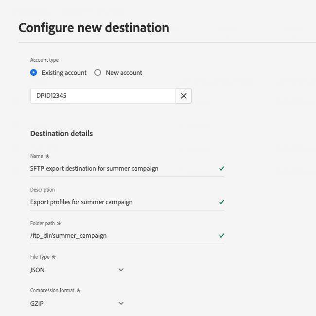

# SFTP 接続

## 宛先の変更ログ {#changelog}

2023 年 7 月のExperience Platformリリースでは、以下に示すように、SFTP 宛先が新しい機能を提供します。

* [データセット書き出しのサポート](/help/destinations/ui/export-datasets.md)。
* 追加の[ファイル命名オプション](/help/destinations/ui/activate-batch-profile-destinations.md#scheduling)。
* 書き出されたファイルにカスタムファイルヘッダーを設定する機能（[マッピングステップの改善](/help/destinations/ui/activate-batch-profile-destinations.md#mapping)による）
* [書き出された CSV データファイルの形式をカスタマイズする機能](/help/destinations/ui/batch-destinations-file-formatting-options.md)。

## 概要 {#overview}

SFTP サーバーへのライブアウトバウンド接続を作成して、区切りデータファイルを定期的に Adobe Experience Platform から書き出します。

>[!IMPORTANT]
>
> Experience Platform では SFTP サーバーへのデータの書き出しをサポートしていますが、データを書き出す際に推奨されるクラウドストレージの場所は [!DNL Amazon S3] と [!DNL Azure Blob] です。

## API または UI を使用した SFTP への接続 {#connect-api-or-ui}

* Platform ユーザーインターフェイスを使用して SFTP ストレージの場所に接続するには、以下の節を参照してください [宛先への接続](#connect) および [この宛先に対してオーディエンスをアクティブ化](#activate) 下。
* プログラムで SFTP ストレージの場所に接続するには、次をお読みください [Flow Service API チュートリアルを使用して、ファイルベースの宛先に対するオーディエンスをアクティブ化します](../../api/activate-segments-file-based-destinations.md).

## サポートされるオーディエンス {#supported-audiences}

この節では、この宛先に書き出すことができるオーディエンスのタイプについて説明します。

| オーディエンスオリジン | サポートあり | 説明 |
|---------|----------|----------|
| [!DNL Segmentation Service] | ✓ | Experience Platformを通じて生成されたオーディエンス [セグメント化サービス](../../../segmentation/home.md). |
| カスタムアップロード | ✓ | CSV ファイルから Experience Platform に[読み込まれた](../../../segmentation/ui/audience-portal.md#import-audience)オーディエンス。 |

{style="table-layout:auto"}

## 書き出しのタイプと頻度 {#export-type-frequency}

宛先の書き出しのタイプと頻度について詳しくは、以下の表を参照してください。

| 項目 | タイプ | メモ |
---------|----------|---------|
| 書き出しタイプ | **[!UICONTROL プロファイルベース]** | [宛先のアクティベーションワークフロー](../../ui/activate-batch-profile-destinations.md#select-attributes)のプロファイル属性選択画面で選択した目的のスキーマフィールド（例：メールアドレス、電話番号、姓）と共に、セグメントのすべてのメンバーを書き出します。 |
| 書き出し頻度 | **[!UICONTROL バッチ]** | バッチ宛先では、ファイルが 3 時間、6 時間、8 時間、12 時間、24 時間の単位でダウンストリームプラットフォームに書き出されます。 詳しくは、[バッチ（ファイルベース）宛先](/help/destinations/destination-types.md#file-based)を参照してください。 |

{style="table-layout:auto"}

## データセットを書き出し {#export-datasets}

この宛先では、データセットの書き出しをサポートしています。 データセットの書き出しを設定する方法について詳しくは、次のチュートリアルを参照してください。

* 方法 [platform ユーザーインターフェイスを使用したデータセットの書き出し](/help/destinations/ui/export-datasets.md).
* 方法 [flow Service API を使用したプログラムによるデータセットの書き出し](/help/destinations/api/export-datasets.md).

## 書き出されたデータのファイル形式 {#file-format}

書き出し時 *オーディエンスデータ*、Platform は `.csv`, `parquet`、または `.json` ファイルは、指定したストレージの場所にあります。 ファイルの詳細については、を参照してください [書き出しでサポートされるファイル形式](../../ui/activate-batch-profile-destinations.md#supported-file-formats-export) Audience Activation チュートリアルの「」の節。

書き出し時 *データセット*、Platform は `.parquet` または `.json` ファイルは、指定したストレージの場所にあります。 ファイルの詳細については、を参照してください [データセットの正常な書き出しの確認](../../ui/export-datasets.md#verify) データセットの書き出しに関するチュートリアルの「」節。

## 宛先への接続 {#connect}

>[!IMPORTANT]
> 
>宛先に接続するには、 **[!UICONTROL 宛先の表示]** および **[!UICONTROL 宛先の管理]** [アクセス制御権限](/help/access-control/home.md#permissions). 詳しくは、[アクセス制御の概要](/help/access-control/ui/overview.md)または製品管理者に問い合わせて、必要な権限を取得してください。

この宛先に接続するには、[宛先設定のチュートリアル](../../ui/connect-destination.md)の手順に従ってください。宛先の設定ワークフローで、以下の 2 つのセクションにリストされているフィールドに入力します。

### 認証情報 {#authentication-information}

>[!CONTEXTUALHELP]
>id="platform_destinations_connect_sftp_rsa"
>title="RSA 公開鍵"
>abstract="必要に応じて、RSA 形式の公開鍵を添付して、書き出したファイルに暗号化を追加できます。正しい形式のキーの例については、以下のドキュメントリンクを参照してください。"

>[!CONTEXTUALHELP]
>id="platform_destinations_connect_sftp_ssh"
>title="SSH 秘密鍵"
>abstract="SSH 秘密鍵は、RSA 形式の Base64 でエンコードされた文字列にする必要があり、パスワードで保護しないでください。"

を選択した場合、 **[!UICONTROL パスワード付き SFTP]** sftp の場所に接続するための認証タイプ：

* **[!UICONTROL ドメイン]**:SFTP ストレージの場所のアドレス
* **[!UICONTROL ユーザー名]**：SFTP ストレージの場所にログインするためのユーザー名
* **[!UICONTROL ポート]**：SFTP ストレージの場所で使用されるポート
* **[!UICONTROL パスワード]**：SFTP ストレージの場所にログインするためのパスワード
* **[!UICONTROL 暗号化キー]**：必要に応じて、RSA 形式の公開鍵を添付して、書き出したファイルに暗号化を追加できます。 正しい形式の暗号化キーの例については、以下の画像を参照してください。

  

**[!UICONTROL SSH キーを使用した SFTP]** 認証タイプを選択して SFTP ストレージの場所に接続する場合：

* **[!UICONTROL ドメイン]**：SFTP アカウントの IP アドレスまたはドメイン名を入力します
* **[!UICONTROL ポート]**：SFTP ストレージの場所で使用されるポート
* **[!UICONTROL ユーザー名]**：SFTP ストレージの場所にログインするためのユーザー名
* **[!UICONTROL SSH キー]**：SFTP ストレージの場所へのログインに使用する SSH 秘密鍵。 この秘密鍵は、RSA 形式の Base64 エンコード文字列である必要があり、パスワードで保護しないでください。
* **[!UICONTROL 暗号化キー]**：必要に応じて、RSA 形式の公開鍵を添付して、書き出したファイルに暗号化を追加できます。正しい形式の暗号化キーの例については、以下の画像を参照してください。

  

### 宛先の詳細 {#destination-details}

SFTP ストレージの場所への認証接続を確立したら、宛先の次の情報を指定します。

* **[!UICONTROL 名前]**:Experience Platformユーザーインターフェイスでこの宛先を識別するのに役立つ名前を入力します。
* **[!UICONTROL 説明]**：この宛先の説明を入力します
* **[!UICONTROL フォルダーパス]**:SFTP でファイルを書き出す場所のフォルダーのパスを入力します。
* **[!UICONTROL ファイルタイプ]**：書き出したファイルでExperience Platformが使用するフォーマットを選択します。 を選択した場合 [!UICONTROL CSV] オプションを使用すると、次のこともできます [ファイル形式オプションの設定](../../ui/batch-destinations-file-formatting-options.md).
* **[!UICONTROL 圧縮フォーマット]**：書き出したファイルにExperience Platformで使用する圧縮タイプを選択します。
* **[!UICONTROL マニフェストファイルを含める]**：書き出しに、書き出しの場所、書き出しサイズなどに関する情報を含んだマニフェスト JSON ファイルを含める場合は、このオプションをオンに切り替えます。 マニフェストには、形式を使用して名前を付けます `manifest-<<destinationId>>-<<dataflowRunId>>.json`. を表示 [サンプルマニフェストファイル](/help/destinations/assets/common/manifest-d0420d72-756c-4159-9e7f-7d3e2f8b501e-0ac8f3c0-29bd-40aa-82c1-f1b7e0657b19.json). マニフェストファイルには、次のフィールドが含まれています。
   * `flowRunId`：です [データフローの実行](/help/dataflows/ui/monitor-destinations.md#dataflow-runs-for-batch-destinations) 書き出されたファイルを生成した。
   * `scheduledTime`：ファイルが書き出された時間（UTC 単位）。
   * `exportResults.sinkPath`：書き出したファイルを格納するストレージの場所のパス。
   * `exportResults.name`：書き出すファイルの名前。
   * `size`：書き出したファイルのサイズ（バイト単位）。

## この宛先に対してオーディエンスをアクティブ化 {#activate}

>[!IMPORTANT]
> 
>* データをアクティブ化するには、 **[!UICONTROL 宛先の表示]**, **[!UICONTROL 宛先のアクティブ化]**, **[!UICONTROL プロファイルの表示]**、および **[!UICONTROL セグメントの表示]** [アクセス制御権限](/help/access-control/home.md#permissions). [アクセス制御の概要](/help/access-control/ui/overview.md)を参照するか、製品管理者に問い合わせて必要な権限を取得してください。
>* エクスポートする *id*、が必要です **[!UICONTROL ID グラフの表示]** [アクセス制御権限](/help/access-control/home.md#permissions).   {width="100" zoomable="yes"}

参照： [プロファイル書き出しのバッチ宛先に対するオーディエンスデータの有効化](../../ui/activate-batch-profile-destinations.md) この宛先に対してオーディエンスをアクティブ化する手順については、を参照してください。

## データの正常な書き出しの検証 {#exported-data}

データが正常に書き出されたかどうかを確認するには、SFTP ストレージを確認し、書き出されたファイルに、想定どおりのプロファイル母集団が含まれていることを確認してください。

## IP アドレスの許可リスト {#ip-address-allow-list}

を参照してください。 [IP アドレス許可リスト](ip-address-allow-list.md) Adobe IP を許可リストに追加する必要がある場合の記事。
