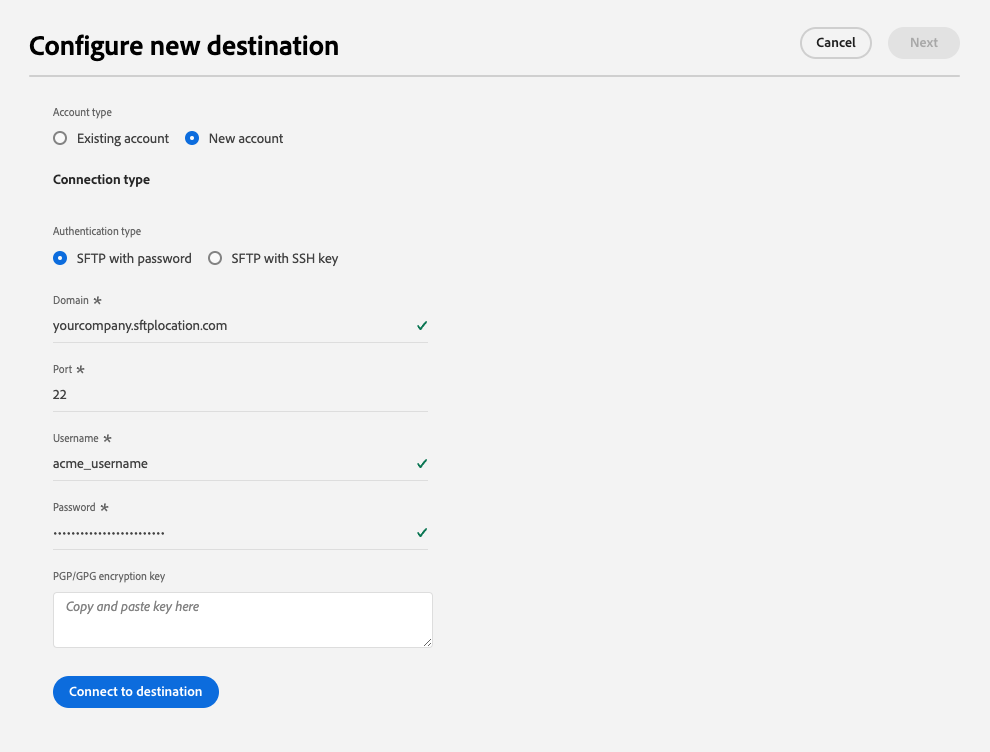

# SFTP 接続

## 宛先の変更ログ {#changelog}

2023 年 7 月のExperience Platform リリースでは、以下に示す新しい機能が SFTP 宛先で提供されます。

* [データセット書き出しのサポート](/help/destinations/ui/export-datasets.md)。
* 追加の[ファイル命名オプション](/help/destinations/ui/activate-batch-profile-destinations.md#scheduling)。
* 書き出されたファイルにカスタムファイルヘッダーを設定する機能（[マッピングステップの改善](/help/destinations/ui/activate-batch-profile-destinations.md#mapping)による）
* [書き出された CSV データファイルの形式をカスタマイズする機能](/help/destinations/ui/batch-destinations-file-formatting-options.md)。

## 概要 {#overview}

SFTP サーバーへのライブアウトバウンド接続を作成して、区切りデータファイルを定期的に Adobe Experience Platform から書き出します。

>[!IMPORTANT]
>
> Experience Platform では SFTP サーバーへのデータの書き出しをサポートしていますが、データを書き出す際に推奨されるクラウドストレージの場所は [!DNL Amazon S3] と [!DNL Azure Blob] です。

## API または UI を使用した SFTP への接続 {#connect-api-or-ui}

* Experience Platform ユーザーインターフェイスを使用して SFTP ストレージの場所に接続するには、以下の [ 宛先への接続 ](#connect) および [ この宛先に対するオーディエンスのアクティブ化 ](#activate) の節を参照してください。
* プログラムによって SFTP ストレージの場所に接続するには、[Flow Service API チュートリアルを使用した、ファイルベースの宛先に対するオーディエンスのアクティブ化 ](../../api/activate-segments-file-based-destinations.md) を参照してください。

## サポートされるオーディエンス {#supported-audiences}

この節では、この宛先に書き出すことができるオーディエンスのタイプについて説明します。

| オーディエンスオリジン | サポートあり | 説明 |
|---------|----------|----------|
| [!DNL Segmentation Service] | ✓ | Experience Platform [ セグメント化サービス ](../../../segmentation/home.md) を通じて生成されたオーディエンス。 |
| カスタムアップロード | ✓ | CSV ファイルから Experience Platform に[読み込まれた](../../../segmentation/ui/audience-portal.md#import-audience)オーディエンス。 |

{style="table-layout:auto"}

## 書き出しのタイプと頻度 {#export-type-frequency}

宛先の書き出しのタイプと頻度について詳しくは、以下の表を参照してください。

| 項目 | タイプ | メモ |
---------|----------|---------|
| 書き出しタイプ | **[!UICONTROL プロファイルベース]** | [宛先のアクティベーションワークフロー](../../ui/activate-batch-profile-destinations.md#select-attributes)のプロファイル属性選択画面で選択した目的のスキーマフィールド（例：メールアドレス、電話番号、姓）と共に、セグメントのすべてのメンバーを書き出します。 |
| 書き出し頻度 | **[!UICONTROL バッチ]** | バッチ宛先では、ファイルが 3 時間、6 時間、8 時間、12 時間、24 時間の単位でダウンストリームプラットフォームに書き出されます。 詳しくは、[バッチ（ファイルベース）宛先](/help/destinations/destination-types.md#file-based)を参照してください。 |

{style="table-layout:auto"}

## データセットを書き出し {#export-datasets}

この宛先では、データセットの書き出しをサポートしています。 データセットの書き出しを設定する方法について詳しくは、次のチュートリアルを参照してください。

* [Experience Platform ユーザーインターフェイスを使用したデータセットの書き出し ](/help/destinations/ui/export-datasets.md) 方法。
* [Flow Service API を使用してプログラムでデータセットを書き出す ](/help/destinations/api/export-datasets.md) 方法。

## 書き出されたデータのファイル形式 {#file-format}

*オーディエンスデータ* を書き出すと、Experience Platformは、指定されたストレージの場所に `.csv`、`parquet` または `.json` ファイルを作成します。 ファイルについて詳しくは、Audience Activation チュートリアルの [ 書き出しでサポートされるファイル形式 ](../../ui/activate-batch-profile-destinations.md#supported-file-formats-export) の節を参照してください。

*データセット* を書き出すと、Experience Platformは、指定されたストレージの場所に `.parquet` または `.json` ファイルを保存します。 ファイルについて詳しくは、データセットの書き出しチュートリアルの [ データセットの書き出しが成功したことを確認する ](../../ui/export-datasets.md#verify) の節を参照してください。

## SFTP サーバーの接続要件 {#sftp-connection-requirements}

データの書き出しを正常に行うには、十分な数の同時接続を許可するようにターゲット SFTP サーバーを設定する必要があります。 SFTP サーバーで同時接続数が制限されている場合、特に複数のオーディエンスやデータセットを同時に書き出す場合に、書き出しジョブでエラーが発生することがあります。

**推奨事項**
最適なパフォーマンスを得るには、書き出すオーディエンスまたはデータセットごとに少なくとも 1 つの同時接続を SFTP サーバーで許可する必要があります。 少なくとも、サーバーは、書き出し用に同時にスケジュールされたオーディエンスまたはデータセットの合計数の 30% 以上をサポートする必要があります。

**例**\
100 個のオーディエンスまたはデータセットの書き出しを同時にスケジュールする場合、SFTP サーバーは少なくとも 30 個の同時接続を許可する必要があります。

SFTP サーバーの接続の制限を適切に設定すると、書き出しの失敗を防ぎ、Adobe Experience Platformからの信頼性の高いデータ配信を確保できます。

## 宛先への接続 {#connect}

>[!IMPORTANT]
> 
>宛先に接続するには、**[!UICONTROL 宛先の表示]** および **[!UICONTROL 宛先の管理]**&#x200B;[ アクセス制御権限 ](/help/access-control/home.md#permissions) が必要です。 詳しくは、[アクセス制御の概要](/help/access-control/ui/overview.md)または製品管理者に問い合わせて、必要な権限を取得してください。

この宛先に接続するには、[宛先設定のチュートリアル](../../ui/connect-destination.md)の手順に従ってください。宛先の設定ワークフローで、以下の 2 つのセクションにリストされているフィールドに入力します。

### 認証情報 {#authentication-information}

>[!CONTEXTUALHELP]
>id="platform_destinations_connect_sftp_rsa"
>title="RSA 公開鍵"
>abstract="必要に応じて、RSA 形式の公開鍵を添付して、書き出したファイルに暗号化を追加できます。正しい形式のキーの例については、以下のドキュメントリンクを参照してください。"

>[!CONTEXTUALHELP]
>id="platform_destinations_connect_sftp_ssh"
>title="SSH 秘密鍵"
>abstract="SSH 秘密鍵は、RSA 形式の Base64 でエンコードされた文字列にする必要があり、パスワードで保護しないでください。"

**[!UICONTROL パスワード付き SFTP]** 認証タイプを選択して SFTP ストレージの場所に接続する場合：

* **[!UICONTROL ドメイン]**:SFTP ストレージの場所のアドレス
* **[!UICONTROL ユーザー名]**：SFTP ストレージの場所にログインするためのユーザー名
* **[!UICONTROL ポート]**：SFTP ストレージの場所で使用されるポート
* **[!UICONTROL パスワード]**：SFTP ストレージの場所にログインするためのパスワード
* **[!UICONTROL 暗号化キー]**：必要に応じて、RSA 形式の公開鍵を添付して、書き出したファイルに暗号化を追加できます。 正しい形式の暗号化キーの例については、以下の画像を参照してください。

  

**[!UICONTROL SSH キーを使用した SFTP]** 認証タイプを選択して SFTP ストレージの場所に接続する場合：

* **[!UICONTROL ドメイン]**：SFTP アカウントの IP アドレスまたはドメイン名を入力します
* **[!UICONTROL ポート]**：SFTP ストレージの場所で使用されるポート
* **[!UICONTROL ユーザー名]**：SFTP ストレージの場所にログインするためのユーザー名
* **[!UICONTROL SSH キー]**：SFTP ストレージの場所へのログインに使用する SSH 秘密鍵。 この秘密鍵は、RSA 形式の Base64 エンコード文字列である必要があり、パスワードで保護しないでください。
* **[!UICONTROL 暗号化キー]**：必要に応じて、RSA 形式の公開鍵を添付して、書き出したファイルに暗号化を追加できます。正しい形式の暗号化キーの例については、以下の画像を参照してください。

  

### 宛先の詳細 {#destination-details}

SFTP ストレージの場所への認証接続を確立したら、宛先の次の情報を指定します。

* **[!UICONTROL 名前]**:Experience Platform ユーザーインターフェイスでこの宛先を識別するのに役立つ名前を入力します。
* **[!UICONTROL 説明]**：この宛先の説明を入力します
* **[!UICONTROL フォルダーパス]**:SFTP でファイルを書き出す場所のフォルダーのパスを入力します。
* **[!UICONTROL ファイルの種類]**：書き出したファイルにExperience Platformで使用する形式を選択します。 [!UICONTROL CSV] オプションを選択する場合、[ ファイル形式オプションを設定 ](../../ui/batch-destinations-file-formatting-options.md) することもできます。
* **[!UICONTROL 圧縮形式]**：書き出したファイルにExperience Platformで使用する圧縮タイプを選択します。
* **[!UICONTROL マニフェストファイルを含める]**：書き出しに、書き出しの場所や書き出しのサイズなどに関する情報を含んだマニフェスト JSON ファイルを含めたい場合は、このオプションをオンに切り替えます。 マニフェストには、形式 `manifest-<<destinationId>>-<<dataflowRunId>>.json` を使用して名前を付けます。 [ サンプル マニフェスト ファイル ](/help/destinations/assets/common/manifest-d0420d72-756c-4159-9e7f-7d3e2f8b501e-0ac8f3c0-29bd-40aa-82c1-f1b7e0657b19.json) を表示します。 マニフェストファイルには、次のフィールドが含まれています。
   * `flowRunId`：書き出されたファイルを生成した [ データフロー実行 ](/help/dataflows/ui/monitor-destinations.md#dataflow-runs-for-batch-destinations)。
   * `scheduledTime`: ファイルが書き出された時間（UTC 単位）。
   * `exportResults.sinkPath`：書き出されたファイルが格納されるストレージの場所のパス。
   * `exportResults.name`：書き出すファイルの名前。
   * `size`：書き出されたファイルのサイズ（バイト単位）。

## この宛先に対してオーディエンスをアクティブ化 {#activate}

>[!IMPORTANT]
> 
>* データをアクティブ化するには、**[!UICONTROL 宛先の表示]**、**[!UICONTROL 宛先のアクティブ化]**、**[!UICONTROL プロファイルの表示]** および **[!UICONTROL セグメントの表示]**&#x200B;[ アクセス制御権限 ](/help/access-control/home.md#permissions) が必要です。 [アクセス制御の概要](/help/access-control/ui/overview.md)を参照するか、製品管理者に問い合わせて必要な権限を取得してください。
>* *ID* を書き出すには、**[!UICONTROL ID グラフの表示]**&#x200B;[ アクセス制御権限 ](/help/access-control/home.md#permissions) が必要です。  {width="100" zoomable="yes"}

この宛先に対してオーディエンスをアクティブ化する手順については、[ プロファイル書き出しのバッチ宛先に対するオーディエンスデータのアクティブ化 ](../../ui/activate-batch-profile-destinations.md) を参照してください。

## データの正常な書き出しの検証 {#exported-data}

データが正常に書き出されたかどうかを確認するには、SFTP ストレージを確認し、書き出されたファイルに、想定どおりのプロファイル母集団が含まれていることを確認してください。

## IP アドレスの許可リスト {#ip-address-allow-list}

許可リストにAdobe許可リストに加えるの IP を登録する必要がある場合は、[IP アドレス ](ip-address-allow-list.md) の記事を参照してください。
