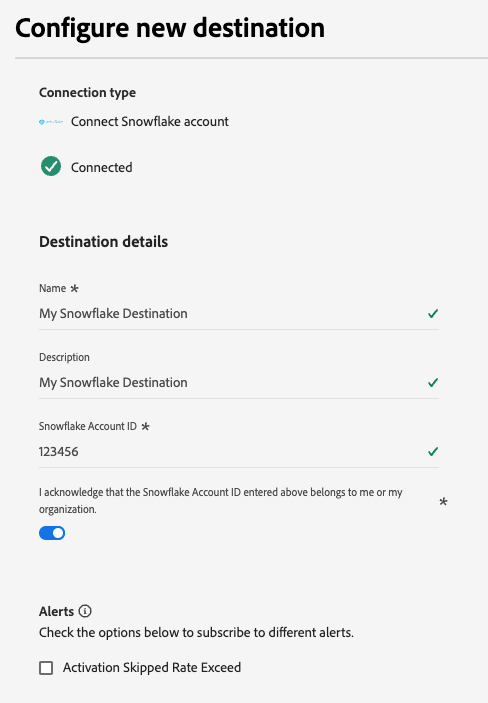

# Snowflake バッチ接続 {#snowflake-destination}

>[!IMPORTANT]
>
>この宛先コネクタはベータ版で、Real-Time CDP Ultimateのお客様のみが利用できます。 機能とドキュメントは変更される場合があります。

## 概要 {#overview}

オーディエンスデータをSnowflake アカウントの動的テーブルに送信する場合は、この宛先を使用します。 動的テーブルを使用すると、物理的なデータコピーを必要とせずにデータにアクセスできます。

Snowflakeの宛先の仕組みと、AdobeとSnowflakeの間でのデータの転送方法については、次の節を参照してください。

### Snowflake データ共有の仕組み {#data-sharing}

この宛先は、[!DNL Snowflake] データ共有を使用します。つまり、データが物理的に書き出されたり、独自のSnowflake インスタンスに転送されたりすることはありません。 代わりに、Adobeでは、Adobe Snowflake環境内でホストされるライブテーブルへの読み取り専用アクセスが許可されます。 この共有テーブルに対してSnowflake アカウントから直接クエリを実行できますが、テーブルを所有しておらず、指定した保持期間を超えてテーブルを変更または保持することはできません。 Adobeは、共有テーブルのライフサイクルと構造を完全に管理します。

AdobeからSnowflake アカウントに初めてデータフローを設定した後、Adobeからの非公開リストへの登録を受け入れるように求められます。

### データ保持と有効期間（TTL） {#ttl}

この統合を通じて共有されるすべてのデータでは、7 日間の固定有効期限（TTL）が設定されています。 最後のエクスポートから 7 日後、データフローがまだアクティブであるかどうかに関係なく、動的テーブルは自動的に期限切れになり、アクセスできなくなります。 7 日を超えてデータを保持する必要がある場合、TTL の有効期限が切れる前に、内容を独自のSnowflake インスタンスで所有するテーブルにコピーする必要があります。

>[!IMPORTANT]
>
>Experience Platformでデータフローを削除すると、動的テーブルがSnowflake アカウントから表示されなくなります。

### オーディエンスの更新動作 {#audience-update-behavior}

オーディエンスが [ バッチモード ](../../../segmentation/methods/batch-segmentation.md) で評価される場合、共有テーブルのデータは 24 時間ごとに更新されます。 つまり、オーディエンスメンバーシップの変更と共有テーブルに変更が反映される間に、最大 24 時間の遅延が発生する可能性があります。

### バッチデータ共有ロジック {#batch-data-sharing}

データフローが初めてオーディエンスに対して実行されると、バックフィルが実行され、現在認定されているすべてのプロファイルが共有されます。 この最初のバックフィル後、宛先は、完全なオーディエンスメンバーシップのスナップショットを定期的に提供します。 各スナップショットは、共有テーブル内の以前のデータを置き換え、履歴データのないオーディエンスの最新の完全なビューを常に表示できるようにします。

## ストリーミングとバッチデータ共有 {#batch-vs-streaming}

Experience Platformには、[Snowflake ストリーミングと ](/help/destinations/catalog/cloud-storage/snowflake.md)2}Snowflake バッチ [ の 2 種類のSnowflake宛先が用意されています。](snowflake-batch.md)

どちらの宛先でも、ゼロコピー方式でSnowflakeのデータにアクセスできますが、各コネクタのユースケースに関しては、いくつかの推奨されるベストプラクティスがあります。

次の表に、各データ共有方法が最も適したシナリオを概説することで、使用するコネクタを決定するのに役立ちます。

|  | 必要に応じて [0}Snowflake バッチ } を選択](snowflake-batch.md) | 必要に応じて [0}Snowflake ストリーミング } を選択](/help/destinations/catalog/cloud-storage/snowflake.md) |
|--------|-------------------|----------------------|
| **更新頻度** | 定期的なスナップショット | リアルタイムでの継続的な更新 |
| **データ表示** | 以前のデータを置き換えるオーディエンススナップショットの完了 | プロファイルの変更に基づいた増分更新 |
| **ユースケースのフォーカス** | レイテンシが重視されない分析/ML ワークロード | リアルタイムの更新が必要な緊急のアクションシナリオ |
| **データ管理** | 最新の完全なスナップショットを常に表示 | オーディエンスメンバーシップの変更に基づく増分更新 |
| **シナリオの例** | ビジネスレポート、データ分析、ML モデルトレーニング | マーケティングキャンペーンの抑制、リアルタイムパーソナライゼーション |

ストリーミングデータ共有について詳しくは、[Snowflake ストリーミング接続 ](../cloud-storage/snowflake.md) ドキュメントを参照してください。

## ユースケース {#use-cases}

バッチデータ共有は、オーディエンスの完全なスナップショットが必要で、リアルタイムの更新が不要な状況に最適です。例えば、次のような場合です。

* **分析ワークロード**：オーディエンスメンバーシップの完全な表示を必要とするデータ分析、レポートまたはビジネスインテリジェンスタスクを実行する場合
* **機械学習ワークフロー**：機械学習モデルのトレーニングや、オーディエンスの完全なスナップショットのメリットを得る予測分析の実行に使用します
* **データウェアハウス**：オーディエンスデータの現在のコピーを独自のSnowflake インスタンスに保持する必要がある場合
* **定期的なレポート**：履歴変更のトラッキングを行わない最新のオーディエンス状態が必要な、通常のビジネスレポート用
* **ETL プロセス**：オーディエンスデータをバッチで変換または処理する必要がある場合

バッチデータ共有は、完全なスナップショットを提供することでデータ管理を簡素化し、増分更新や結合の変更を手動で管理する必要をなくします。

## サポートされるオーディエンス {#supported-audiences}

この節では、この宛先に書き出すことができるオーディエンスのタイプについて説明します。 以下の 2 つの表は、このコネクタがサポートするオーディエンスを、_オーディエンスオリジン_ および _オーディエンスに含まれるプロファイルタイプ_ 別に示しています。

| オーディエンスオリジン | サポートあり | 説明 |
|---------|----------|----------|
| [!DNL Segmentation Service] | ✓ | Experience Platform [ セグメント化サービス ](../../../segmentation/home.md) を通じて生成されたオーディエンス。 |
| その他すべてのオーディエンスの接触チャネル | ✓ | このカテゴリには、[!DNL Segmentation Service] を通じて生成されたオーディエンス以外のすべてのオーディエンスの接触チャネルが含まれます。 [ 様々なオーディエンスのオリジン ](/help/segmentation/ui/audience-portal.md#customize) について確認する。 次に例を示します。 <ul><li> csv ファイルからExperience Platformへのカスタムアップロードオーディエンス [ 読み込み ](../../../segmentation/ui/audience-portal.md#import-audience)</li><li> 類似オーディエンス、 </li><li> 連合オーディエンス、 </li><li> Adobe Journey Optimizerなど、他のExperience Platform アプリで生成されたオーディエンス。 </li><li> その他。 </li></ul> |

{style="table-layout:auto"}

オーディエンスデータタイプでサポートされるオーディエンス：

| オーディエンスデータタイプ | サポートあり | 説明 | ユースケース |
|--------------------|-----------|-------------|-----------|
| [ 人物オーディエンス ](/help/segmentation/types/people-audiences.md) | ✓ | 顧客プロファイルに基づき、マーケティングキャンペーンの対象となる人物のグループを指定できます。 | 頻繁な購入、買い物かごの放棄 |
| [ アカウントオーディエンス ](/help/segmentation/types/account-audiences.md) | × | アカウントベースのマーケティング戦略では、特定の組織内の個人をターゲットに設定します。 | B2B マーケティング |
| [ 見込み客オーディエンス ](/help/segmentation/types/prospect-audiences.md) | × | まだ顧客ではないものの、ターゲットオーディエンスと特性を共有する個人をターゲットに設定します。 | サードパーティデータを使用した予測 |
| [ データセットの書き出し ](/help/catalog/datasets/overview.md) | × | Adobe Experience Platform Data Lake に保存された構造化データのコレクション。 | レポート、データサイエンスワークフロー |

{style="table-layout:auto"}

## 書き出しのタイプと頻度 {#export-type-frequency}

宛先の書き出しのタイプと頻度について詳しくは、以下の表を参照してください。

| 項目 | タイプ | メモ |
---------|----------|---------|
| 書き出しタイプ | **[!UICONTROL オーディエンスの書き出し]** | [!DNL Snowflake] 宛先で使用される識別子（氏名、電話番号など）を使用して、オーディエンスのすべてのメンバーを書き出します。 |
| 書き出し頻度 | **[!UICONTROL バッチ]** | この宛先は、Snowflake データ共有を通じて、オーディエンスメンバーシップ全体の定期的なスナップショットを提供します。 各スナップショットで以前のデータが置き換わるので、オーディエンスの完全なビューを常に最新に保つことができます。 |

{style="table-layout:auto"}

## 宛先への接続 {#connect}

>[!IMPORTANT]
> 
>宛先に接続するには、**[!UICONTROL 宛先の表示]** および **[!UICONTROL 宛先の管理]**[ アクセス制御権限 ](/help/access-control/home.md#permissions) が必要です。 詳しくは、[アクセス制御の概要](/help/access-control/ui/overview.md)または製品管理者に問い合わせて、必要な権限を取得してください。

この宛先に接続するには、[宛先設定のチュートリアル](../../ui/connect-destination.md)の手順に従ってください。宛先の設定ワークフローで、以下の 2 つのセクションにリストされているフィールドに入力します。

### 宛先に対する認証 {#authenticate}

宛先を認証するには、「**[!UICONTROL 宛先に接続]**」を選択し、アカウント名と、オプションでアカウントの説明を入力します。

### 宛先の詳細の入力 {#destination-details}

>[!CONTEXTUALHELP]
>id="platform_destinations_snowflake_batch_accountID"
>title="Snowflake アカウント ID を入力"
>abstract="アカウントが組織にリンクされている場合は、`OrganizationName.AccountName`   という形式を使用します。アカウントが組織にリンクされていない場合は、`AccountName` という形式を使用します"

宛先の詳細を設定するには、以下の必須フィールドとオプションフィールドに入力します。UI のフィールドの横のアスタリスクは、そのフィールドが必須であることを示します。

* **[!UICONTROL 名前]**：今後この宛先を認識するための名前。
* **[!UICONTROL 説明]**：今後この宛先を識別するのに役立つ説明。
* **[!UICONTROL Snowflake アカウント ID]**：お使いのSnowflake アカウント ID。 アカウントが組織にリンクされているかどうかに応じて、次のアカウント ID 形式を使用します。
   * アカウントが組織にリンクされている場合：`OrganizationName.AccountName`。
   * アカウントが組織にリンクされていない場合：`AccountName`。
* **[!UICONTROL アカウントの確認]**:「Snowflake アカウント ID の確認」をオンにして、アカウント ID が正しく、自分に属していることを確認します。

>[!IMPORTANT]
>
> 宛先名とExperience Platform サンドボックス名で使用される特殊文字は、Snowflakeではアンダースコア（`_`）に自動変換されます。 混乱を避けるために、宛先とサンドボックス名には特殊文字を使用しないでください。

### アラートの有効化 {#enable-alerts}

アラートを有効にすると、宛先へのデータフローのステータスに関する通知を受け取ることができます。リストからアラートを選択して、データフローのステータスに関する通知を受け取るよう登録します。アラートについて詳しくは、[UI を使用した宛先アラートの購読](../../ui/alerts.md)に関するガイドを参照してください。

宛先接続の詳細の入力を終えたら「**[!UICONTROL 次へ]**」を選択します。

## この宛先に対してオーディエンスをアクティブ化 {#activate}

>[!IMPORTANT]
> 
>* データをアクティブ化するには、**[!UICONTROL 宛先の表示]**、**[!UICONTROL 宛先のアクティブ化]**、**[!UICONTROL プロファイルの表示]** および **[!UICONTROL セグメントの表示]**[ アクセス制御権限 ](/help/access-control/home.md#permissions) が必要です。 [アクセス制御の概要](/help/access-control/ui/overview.md)を参照するか、製品管理者に問い合わせて必要な権限を取得してください。
>* *ID* を書き出すには、**[!UICONTROL ID グラフの表示]**[ アクセス制御権限 ](/help/access-control/home.md#permissions) が必要です。  {width="100" zoomable="yes"}

この宛先に対してオーディエンスをアクティブ化する手順については、[バッチプロファイル書き出し宛先に対するオーディエンスデータのアクティブ化](/help/destinations/ui/activate-batch-profile-destinations.md)を参照してください。

### 属性のマッピング {#map}

この宛先に ID およびプロファイル属性を書き出すことができます。

[ 計算フィールドコントロール ](../../ui/data-transformations-calculated-fields.md) を使用して、配列に対する操作をエクスポートしたり実行したりできます。

ターゲット属性は、「**[!UICONTROL 属性名]** フィールドに指定した属性名を使用して、Snowflakeで自動的に作成されます。

## 書き出されたデータ／データ書き出しの検証 {#exported-data}

データは、動的テーブルを介してSnowflake アカウントにステージングされます。 データが正しく書き出されたことをSnowflake アカウントで確認します。

### データ構造 {#data-structure}

動的テーブルには、次の列が含まれます。

* **TS**：各行が最後に更新された日時を表すタイムスタンプ列
* **マッピング属性**：アクティベーションワークフロー中に選択したすべてのマッピング属性は、Snowflakeでは列ヘッダーとして表されます
* **オーディエンスメンバーシップ**：データフローにマッピングされたオーディエンスのメンバーシップは、対応するセルの `active` エントリを介して示されます

## 既知の制限事項 {#known-limitations}

### 複数の結合ポリシー

複数の結合ポリシーを持つオーディエンスは、単一のデータフローではサポートされません。 結合ポリシーが異なると、スナップショットが異なり、実際には、一方のオーディエンスに関連するデータは、両方のオーディエンスのデータが期待どおりに書き出されるのではなく、もう一方のオーディエンスのデータで上書きされます。

## データの使用とガバナンス {#data-usage-governance}

[!DNL Adobe Experience Platform] のすべての宛先は、データを処理する際のデータ使用ポリシーに準拠しています。[!DNL Adobe Experience Platform] がどのように データガバナンスを実施するかについて詳しくは、[データガバナンスの概要](/help/data-governance/home.md)を参照してください。
