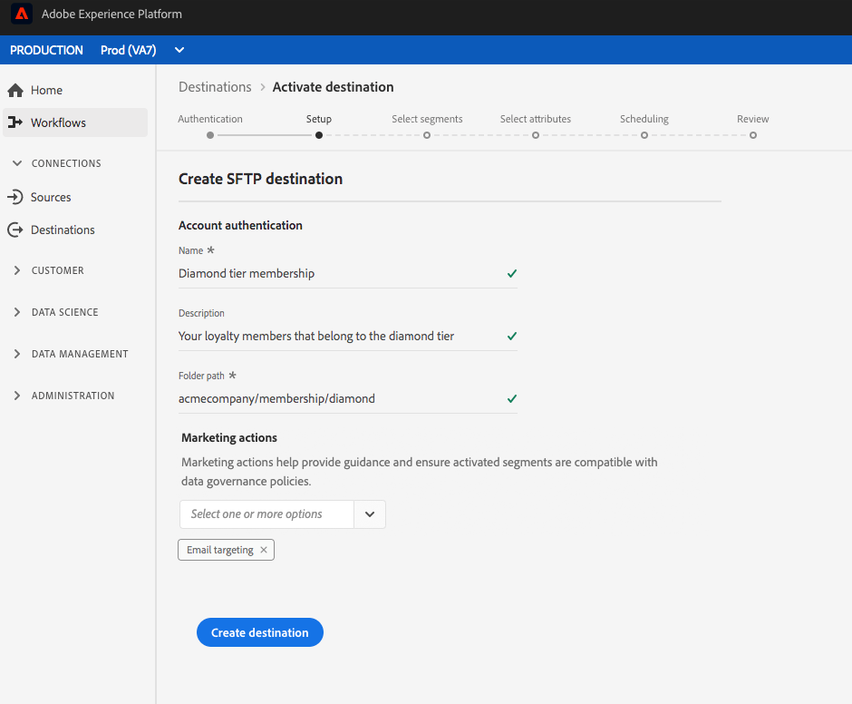
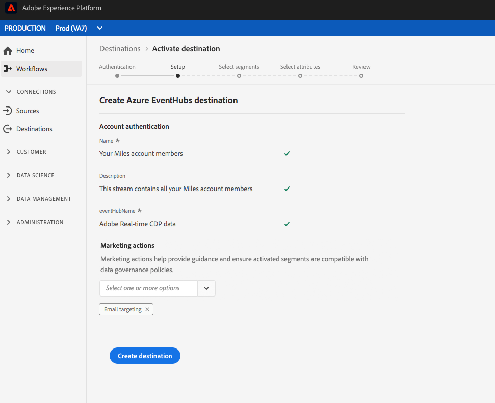

# クラウドストレージの保存先の作成

## 概要 {#overview}

このページでは、Adobe Experience Platformのクラウドストレージの場所に接続する方法を説明します。

**[!UICONTROL ストレージ]**/**[!UICONTROL 宛先]**&#x200B;で、希望するクラウド接続先を選択し、**[!UICONTROL 設定]**&#x200B;を選択します。

>[!NOTE]
>
>この宛先との接続が既に存在する場合は、宛先カードに「**[!UICONTROL Activate]**」ボタンが表示されます。 「**[!UICONTROL アクティブ化]**」と「**[!UICONTROL 設定]**」の違いについて詳しくは、保存先のワークスペースドキュメントの「[カタログ](../../ui/destinations-workspace.md#catalog)」の節を参照してください。

## 認証手順{#authentication}

クラウドストレージの宛先への接続を既に設定している場合は、**[!UICONTROL 認証]**&#x200B;手順で「**[!UICONTROL 既存のアカウント]**」を選択し、既存の接続を選択します。または、「**[!UICONTROL 新しいアカウント]**」を選択して、クラウドストレージの宛先への新しい接続を設定できます。アカウント認証資格情報を入力し、「**[!UICONTROL 宛先に接続]**」を選択します。必要に応じて、RSA形式の公開鍵を添付して、書き出したファイルに暗号化を追加できます。 この公開鍵&#x200B;**は、Base64エンコードされた文字列として書かれる必要があります。**

**認証**&#x200B;手順の資格情報の入力に関する詳細は、[AmazonS3](./amazon-s3.md)宛先、[[!DNL Amazon Kinesis]](./amazon-kinesis.md)宛先、[[!DNL Azure Event Hubs]](./azure-event-hubs.md)宛先、[SFTP](./sftp.md)宛先を参照してください。

>[!NOTE]
>
>プラットフォームは、認証プロセスで資格情報の検証をサポートしており、クラウドストレージの場所に誤った資格情報を入力すると、エラーメッセージを表示します。 これにより、間違った資格情報を使用してワークフローを完了できなくします。

## 設定手順{#setup}

「**[!UICONTROL 設定]**」手順で、アクティベーションフローの「**[!UICONTROL 名前]**」と「**[!UICONTROL 説明]**」を入力します。

また、この手順では、この宛先に適用する&#x200B;**[!UICONTROL マーケティングアクション]**&#x200B;を選択できます。 マーケティングアクションは、データをエクスポート先にエクスポートする意図を示します。 Adobe定義のマーケティングアクションから選択するか、独自のマーケティングアクションを作成することができます。 マーケティングアクションについて詳しくは、[データ使用ポリシーの概要](../../../data-governance/policies/overview.md)を参照してください。

Amazon S3 の宛先の場合は、ファイルが配信されるクラウドストレージの宛先に「**[!UICONTROL バケット名]**」と「**[!UICONTROL フォルダーパス]**」を挿入します。上記のフィールドに入力した後、「**[!UICONTROL 宛先を作成]**」を選択します。

SFTP の宛先の場合は、ファイルが配信される「**[!UICONTROL フォルダーパス]**」を挿入します。上記のフィールドに入力した後、「**[!UICONTROL 宛先を作成]**」を選択します。

[!DNL Amazon Kinesis]宛先には、[!DNL Amazon Kinesis]アカウント内の既存のデータストリームの名前を指定します。 プラットフォームは、このストリームにデータをエクスポートします。 上記のフィールドに入力した後、「**[!UICONTROL 宛先を作成]**」を選択します。

[!DNL Azure Event Hubs]宛先には、[!DNL Amazon Event Hubs]アカウント内の既存のデータストリームの名前を指定します。 プラットフォームは、このストリームにデータをエクスポートします。 上記のフィールドに入力した後、「**[!UICONTROL 宛先を作成]**」を選択します。

これで宛先が作成されました。後でセグメントをアクティブにする場合は、「**[!UICONTROL 保存して終了]**」を選択します。また、「**[!UICONTROL 次へ]**」を選択してワークフローを続行し、アクティブ化するセグメントを選択することもできます。いずれの場合も、データをエクスポートする残りのワークフローについては、次の「[セグメントのアクティブ化](#activate-segments)」の節を参照してください。

## セグメントのアクティブ化 {#activate-segments}

セグメントのアクティベーションワークフローについて詳しくは、「[宛先へのプロファイルとセグメントのアクティブ化](../../ui/activate-destinations.md)」を参照してください。