# [!DNL HubSpot] 接続

[[!DNL HubSpot]](https://www.hubspot.com)は、マーケティング、セールス、コンテンツ管理、カスタマーサービスの連携に必要なあらゆるソフトウェア、統合、リソースを備えたCRM プラットフォームです。 単一のCRM プラットフォーム上で、データ、チーム、顧客を結び付けることができます。

この[!DNL Adobe Experience Platform] [宛先](/help/destinations/home.md)は、[[!DNL HubSpot] 連絡先API](https://developers.hubspot.com/docs/api/crm/contacts)を活用して、アクティブ化後に既存のExperience Platform オーディエンスから[!DNL HubSpot]以内の連絡先を更新します。

[!DNL HubSpot] インスタンスを認証する手順は、さらに下の[宛先に対する認証](#authenticate)の節にあります。

## ユースケース {#use-cases}

[!DNL HubSpot]宛先を使用する方法とタイミングをより理解しやすくするために、[!DNL Adobe Experience Platform]のお客様がこの宛先を使用して解決できる使用例を次に示します。

[!DNL HubSpot]件の連絡先には、自社と接触した個人に関する情報が保存されています。 チームは[!DNL HubSpot]に存在する連絡先を使用して、Experience Platform オーディエンスを構築します。 これらのオーディエンスを[!DNL HubSpot]に送信すると、情報が更新され、各コンタクトには、そのコンタクトがどのオーディエンスに属しているかを示すオーディエンス名として、その値を持つプロパティが割り当てられます。

## 前提条件 {#prerequisites}

Experience Platformおよび[!DNL HubSpot]で設定する必要がある前提条件と、[!DNL HubSpot]の宛先を操作する前に収集する必要がある情報については、以下の節を参照してください。

### Experience Platform の前提条件 {#prerequisites-in-experience-platform}

[!DNL HubSpot]宛先にデータをアクティブ化する前に、[で](/help/xdm/schema/composition.md) スキーマ [、](https://experienceleague.adobe.com/docs/platform-learn/tutorials/data-ingestion/create-datasets-and-ingest-data.html) データセット [、および](https://experienceleague.adobe.com/docs/platform-learn/tutorials/audiences/create-audiences.html) オーディエンス [!DNL Experience Platform]を作成しておく必要があります。

オーディエンスのステータスに関するガイダンスが必要な場合は、[&#x200B; オーディエンスメンバーシップの詳細スキーマフィールドグループ &#x200B;](/help/xdm/field-groups/profile/segmentation.md)のExperience Platform ドキュメントを参照してください。

### [!DNL HubSpot]宛先の前提条件 {#prerequisites-destination}

Experience Platformから[!DNL HubSpot] アカウントにデータをエクスポートするには、次の前提条件に注意してください。

#### [!DNL HubSpot] アカウントが必要です {#prerequisites-account}

Experience Platformから[!DNL Hubspot] アカウントにデータをエクスポートするには、[!DNL HubSpot] アカウントが必要です。 まだアカウントをお持ちでない場合は、[HubSpot アカウントの設定](https://knowledge.hubspot.com/get-started/set-up-your-account) ページにアクセスし、ガイダンスに従ってアカウントを登録および作成してください。

#### [!DNL HubSpot] プライベートアプリアクセストークンの収集 {#gather-credentials}

[!DNL HubSpot] アカウント内の`Access token` プライベートアプリを通じて[!DNL HubSpot]宛先がAPI呼び出しを行うことを許可するには、[!DNL HubSpot] [!DNL HubSpot]が必要です。 `Access token`は、`Bearer token`宛先を認証する[際の](#authenticate)として機能します。

プライベートアプリをお持ちでない場合は、ドキュメントの[Create a private app in [!DNL HubSpot]](https://developers.hubspot.com/docs/api/private-apps)に従ってください。

>[!IMPORTANT]
>
> プライベートアプリには、以下のスコープを割り当てる必要があります。
> `crm.objects.contacts.write`, `crm.objects.contacts.read`
> `crm.schemas.contacts.write`, `crm.schemas.contacts.read`

| 資格情報 | 説明 | 例 |
| --- | --- | --- |
| `Bearer token` | `Access token` プライベートアプリの[!DNL HubSpot]。  お客様の[!DNL HubSpot] `Access token`を取得するには、[!DNL HubSpot] ドキュメントに従って、アプリのアクセストークン [を使用して](https://developers.hubspot.com/docs/api/private-apps#make-api-calls-with-your-app-s-access-token)API呼び出しを行います。 | `pat-na1-11223344-abcde-12345-9876-1234a1b23456` |

## ガードレール {#guardrails}

[!DNL HubSpot]個のプライベートアプリには[&#x200B; レート制限](https://developers.hubspot.com/docs/api/usage-details)が適用されます。 プライベートアプリが実行できる呼び出しの数は、お使いの[!DNL HubSpot] アカウントのサブスクリプションと、API アドオンを購入したかどうかに基づきます。 さらに、[その他の制限](https://developers.hubspot.com/docs/api/usage-details#other-limits)も参照してください。

## サポートされる ID {#supported-identities}

[!DNL HubSpot] では、以下の表で説明する ID の更新をサポートしています。[ID](/help/identity-service/features/namespaces.md) についての詳細情報。

| ターゲット ID | 例 | 説明 | 注意点 |
|---|---|---|---|
| `email` | `test@test.com` | 連絡先のメールアドレス。 | 必須 |

## サポートされるオーディエンス {#supported-audiences}

この節では、この宛先に書き出しできるすべてのオーディエンスについて説明します。

この宛先では、Experience Platform の[セグメント化サービス](../../../segmentation/home.md)で生成したすべてのオーディエンスのアクティブ化をサポートします。

この宛先は、次の表に記載されているオーディエンスのアクティブ化もサポートしています。

| オーディエンスの由来 | サポートあり | 説明 |
|---------|----------|----------|
| [!DNL Segmentation Service] | ○ | Experience Platform [&#x200B; セグメント化サービス &#x200B;](../../../segmentation/home.md)を通じて生成されたオーディエンス。 |
| その他すべてのオーディエンスの生成元 | × | このカテゴリには、[!DNL Segmentation Service]を通じて生成されたオーディエンス以外のすべてのオーディエンスのオリジンが含まれます。 [様々なオーディエンスの起源](/help/segmentation/ui/audience-portal.md#customize)について読みます。 次に例を示します。 <ul><li> カスタムアップロードオーディエンス [がCSV ファイルからExperience Platformに](../../../segmentation/ui/audience-portal.md#import-audience)をインポートしました。</li><li> 類似オーディエンス， </li><li> 連合オーディエンス， </li><li> [!DNL Adobe Journey Optimizer]などの他のExperience Platform アプリで生成されたオーディエンス </li><li> その他。 </li></ul> |

{style="table-layout:auto"}

オーディエンスのデータタイプ別にサポートされるオーディエンス：

| オーディエンスのデータタイプ | サポートあり | 説明 | ユースケース |
|--------------------|-----------|-------------|-----------|
| [人物オーディエンス &#x200B;](/help/segmentation/types/people-audiences.md) | ○ | 顧客プロファイルにもとづいて、マーケティング施策の特定のグループをターゲットにすることができます。 | 買い物客やカートの放棄が多い |
| [&#x200B; アカウントオーディエンス &#x200B;](/help/segmentation/types/account-audiences.md) | × | アカウントベースドマーケティング戦略のために、特定の組織内の個人をターゲットにします。 | B2B マーケティング |
| [見込みオーディエンス &#x200B;](/help/segmentation/types/prospect-audiences.md) | × | まだ顧客ではないが、ターゲットオーディエンスと特徴を共有する個人をターゲットにします。 | サードパーティデータによる見込み顧客の開拓 |
| [&#x200B; データセットの書き出し](/help/catalog/datasets/overview.md) | × | [!DNL Adobe Experience Platform] データ レイクに保存されている構造化データのコレクション。 | レポート，データサイエンスワークフロー |

{style="table-layout:auto"}

## 書き出しのタイプと頻度 {#export-type-frequency}

宛先の書き出しのタイプと頻度について詳しくは、以下の表を参照してください。

| 項目 | タイプ | メモ |
|---------|----------|---------|
| 書き出しタイプ | **[!UICONTROL Profile-based]** | <ul><li>オーディエンスのすべてのメンバーを、フィールドマッピングに従って、目的のスキーマフィールド *（例：電子メールアドレス、電話番号、姓）*&#x200B;と共に書き出します。</li><li> さらに、[!DNL HubSpot]で新しいプロパティがオーディエンス名を使用して作成され、その値は、選択した各オーディエンスについて、Experience Platformの対応するオーディエンスステータスになります。</li></ul> |
| 書き出し頻度 | **[!UICONTROL Streaming]** | <ul><li>ストリーミングの宛先は常に、API ベースの接続です。オーディエンス評価に基づいて Experience Platform 内でプロファイルが更新されるとすぐに、コネクタは更新を宛先プラットフォームに送信します。詳しくは、[ストリーミングの宛先](/help/destinations/destination-types.md#streaming-destinations)を参照してください。</li></ul> |

{style="table-layout:auto"}

## 宛先への接続 {#connect}

>[!IMPORTANT]
>
>宛先に接続するには、**[!UICONTROL View Destinations]**&#x200B;および&#x200B;**[!UICONTROL Manage Destinations]** [&#x200B; アクセス制御権限](/help/access-control/home.md#permissions)が必要です。 詳しくは、[アクセス制御の概要](/help/access-control/ui/overview.md)または製品管理者に問い合わせて、必要な権限を取得してください。

この宛先に接続するには、[宛先設定のチュートリアル](../../ui/connect-destination.md)の手順に従ってください。宛先の設定ワークフローで、以下の 2 つのセクションにリストされているフィールドに入力します。

**[!UICONTROL Destinations]** > **[!UICONTROL Catalog]**&#x200B;内で[!DNL HubSpot]を検索します。 または、**[!UICONTROL CRM]** カテゴリの下に配置することもできます。

### 宛先に対する認証 {#authenticate}

以下の必須のフィールドに入力します。ガイダンスについては、[&#x200B; プライベートアプリアクセストークン  [!DNL HubSpot] を収集](#gather-credentials)の節を参照してください。

* **[!UICONTROL Bearer token]**: [!DNL HubSpot] プライベートアプリのアクセストークン。

宛先に対する認証を行うには、**[!UICONTROL Connect to destination]**&#x200B;を選択します。
認証方法を示す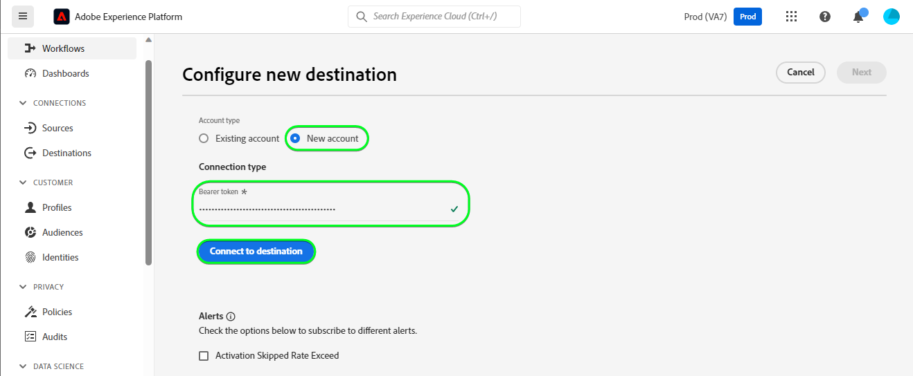

指定された詳細が有効な場合、UIには緑色のチェックマークが付いた&#x200B;**[!UICONTROL Connected]** ステータスが表示されます。 その後、次の手順に進むことができます。

### 宛先の詳細を入力 {#destination-details}

宛先の詳細を設定するには、以下の必須フィールドとオプションフィールドに入力します。UI のフィールドの横にアスタリスクが表示される場合は、そのフィールドが必須であることを示します。
宛先の詳細を示す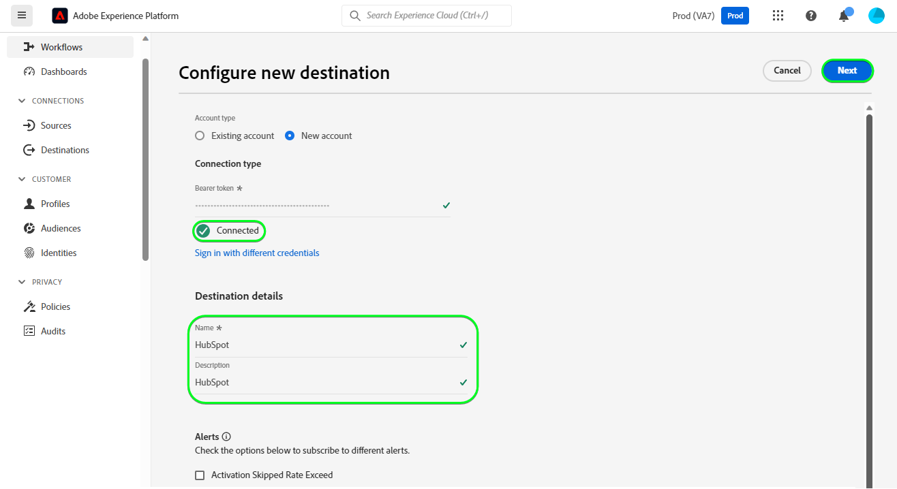

* **[!UICONTROL Name]**：今後この宛先を認識する際に使用する名前。
* **[!UICONTROL Description]**：今後この宛先を特定するのに役立つ説明です。

### アラートの有効化 {#enable-alerts}

アラートを有効にすると、宛先へのデータフローのステータスに関する通知を受け取ることができます。リストからアラートを選択して、データフローのステータスに関する通知を受け取るよう登録します。アラートについて詳しくは、[UI を使用した宛先アラートの購読](../../ui/alerts.md)についてのガイドを参照してください。

宛先接続の詳細の提供が完了したら、**[!UICONTROL Next]**&#x200B;を選択します。

## この宛先に対してオーディエンスをアクティブ化 {#activate}

>[!IMPORTANT]
>
>データをアクティブ化するには、**[!UICONTROL View Destinations]**、**[!UICONTROL Activate Destinations]**、**[!UICONTROL View Profiles]**&#x200B;および&#x200B;**[!UICONTROL View Segments]** [&#x200B; アクセス制御権限](/help/access-control/home.md#permissions)が必要です。 [アクセス制御の概要](/help/access-control/ui/overview.md)を参照するか、製品管理者に問い合わせて必要な権限を取得してください。

この宛先にオーディエンスをアクティベートする手順は、[ストリーミングオーディエンスの書き出し宛先へのプロファイルとオーディエンスのアクティベート](/help/destinations/ui/activate-segment-streaming-destinations.md)を参照してください。

### 属性と ID のマッピング {#map}

オーディエンスデータを[!DNL Adobe Experience Platform]から[!DNL HubSpot]宛先に正しく送信するには、フィールドマッピング手順を実行する必要があります。 マッピングでは、Experience Platform アカウントのExperience Data Model （XDM）スキーマフィールドと、ターゲット先の対応するスキーマフィールドとの間にリンクを作成します。

XDM フィールドを[!DNL HubSpot]宛先フィールドに正しくマッピングするには、次の手順に従います。

#### `Email` IDのマッピング {#map-email-identity}

`Email` IDは、この宛先の必須マッピングです。 マッピングするには、次の手順に従います。

1. **[!UICONTROL Mapping]** ステップで、**[!UICONTROL Add new mapping]**&#x200B;を選択します。 新しいマッピング行が画面に表示されるようになりました。
   「新しいマッピングを追加」ボタンがハイライト表示された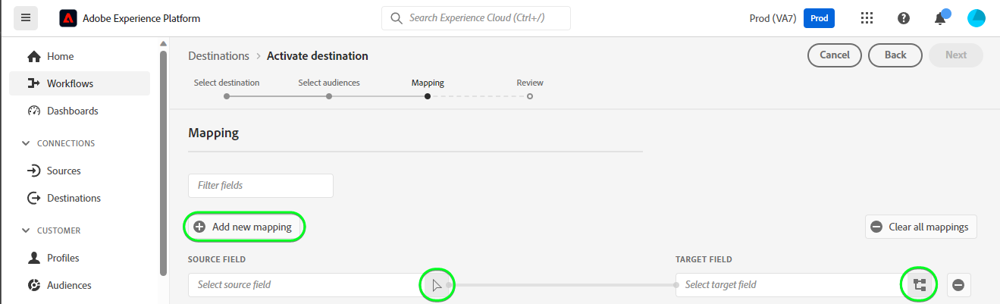
1. **[!UICONTROL Select source field]** ウィンドウで、**[!UICONTROL Select identity namespace]**&#x200B;を選択し、IDを選択します。
   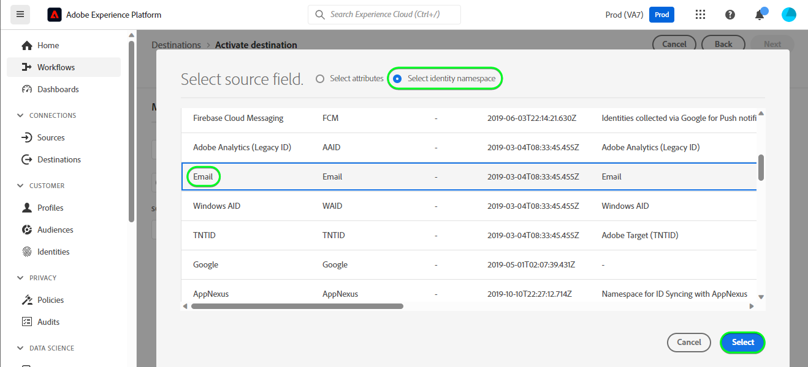
1. **[!UICONTROL Select target field]** ウィンドウで、**[!UICONTROL Select attributes]**&#x200B;を選択し、`email`を選択します。
   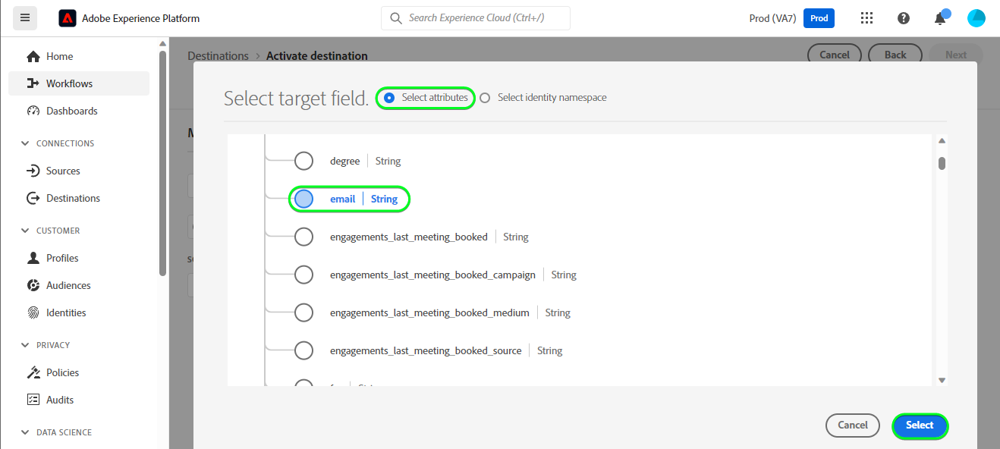

| ソースフィールド | ターゲットフィールド | 必須 |
| --- | --- | --- |
| `IdentityMap: Email` | `Identity: email` | ○ |

ID マッピングの例を次に示します。
電子メール ID マッピングを使用した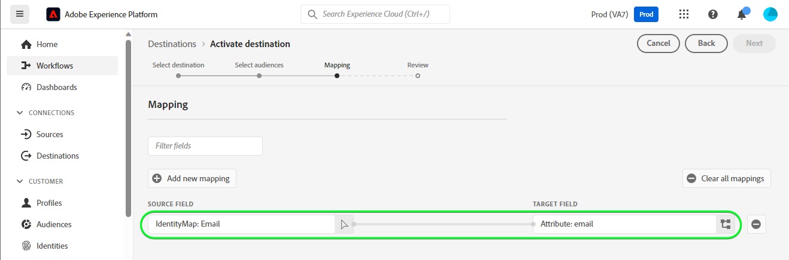

#### **オプション**&#x200B;属性のマッピング {#mapping-optional-attributes}

XDM プロファイルスキーマと[!DNL HubSpot] アカウントの間で更新するその他の属性を追加するには、次の手順を繰り返します。

1. **[!UICONTROL Mapping]** ステップで、**[!UICONTROL Add new mapping]**&#x200B;を選択します。 新しいマッピング行が画面に表示されるようになりました。
   「新しいマッピングを追加」ボタンがハイライト表示された
1. **[!UICONTROL Select source field]** ウィンドウで、**[!UICONTROL Select attributes]** カテゴリを選択し、XDM属性を選択します。
   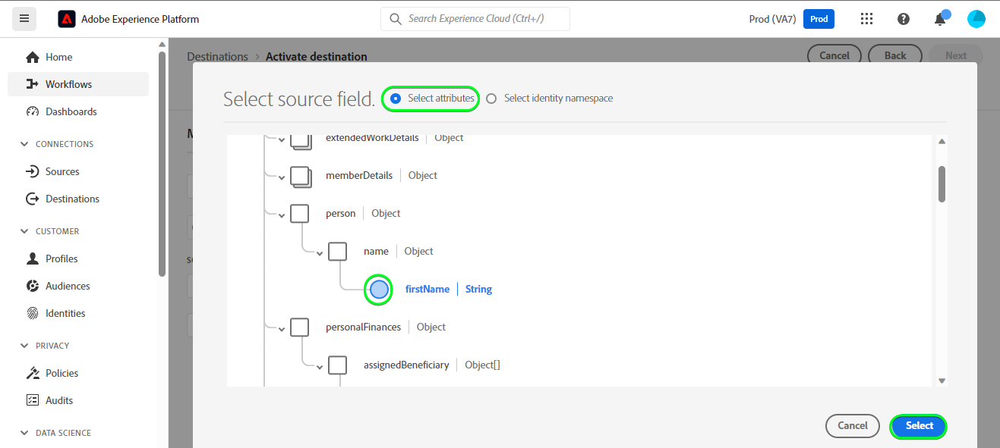
1. **[!UICONTROL Select target field]** ウィンドウで、**[!UICONTROL Select attributes]** カテゴリを選択し、[!DNL HubSpot] アカウントから自動的に入力される属性のリストから選択します。 宛先は[[!DNL HubSpot]  プロパティ &#x200B;](https://developers.hubspot.com/docs/api/crm/properties) APIを使用して、この情報を取得します。 [!DNL HubSpot] [&#x200B; デフォルトのプロパティ &#x200B;](https://knowledge.hubspot.com/contacts/hubspots-default-contact-properties)とカスタムプロパティの両方が、ターゲットフィールドとして選択用に取得されます。
   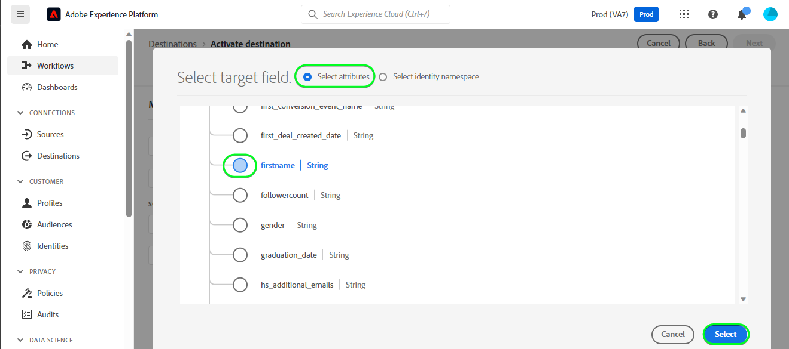

XDM プロファイルスキーマと[!DNL Hubspot]間の使用可能なマッピングをいくつか次に示します。

| ソースフィールド | ターゲットフィールド |
| --- | --- |
| `xdm: person.name.firstName` | `Attribute: firstname` |
| `xdm: person.name.lastName` | `Attribute: lastname` |
| `xdm: workAddress.street1` | `Attribute: address` |
| `xdm: workAddress.city` | `Attribute: city` |
| `xdm: workAddress.country` | `Attribute: country` |

これらの属性マッピングを使用した例を次に示します。
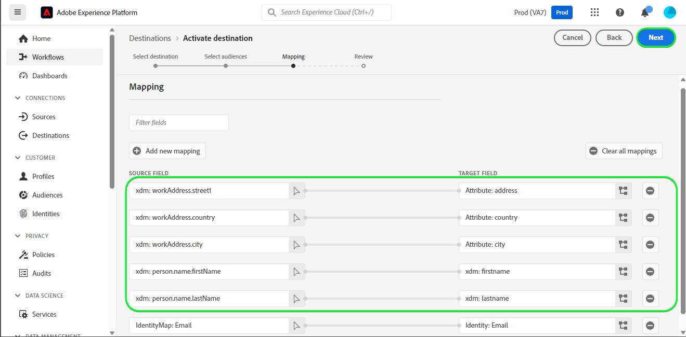

宛先接続のマッピングの提供が完了したら、**[!UICONTROL Next]**&#x200B;を選択します。

## データの書き出しを検証する {#exported-data}

宛先が正しく設定されていることを検証するには、次の手順に従います。

1. [!DNL HubSpot] web サイトにログインし、**[!UICONTROL Contacts]** ページに移動して、オーディエンスのステータスを確認します。 このリストは、オーディエンス名で作成されたカスタムプロパティの列を、その値がオーディエンスステータスで表示するように設定できます。
   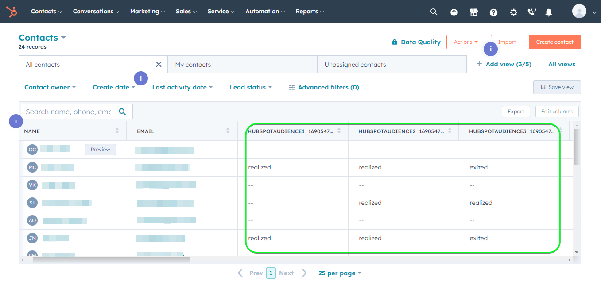

1. または、個々の&#x200B;**[!UICONTROL Person]** ページにドリルダウンして、オーディエンス名とオーディエンスのステータスを表示するプロパティに移動することもできます。
   オーディエンス名とオーディエンスのステータスを表示するカスタムプロパティを含む連絡先ページを示す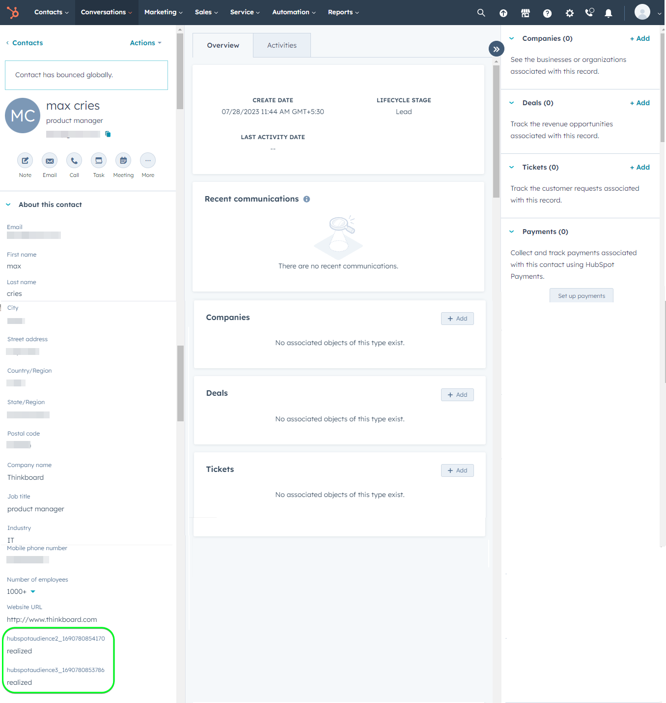

## データの使用とガバナンス {#data-usage-governance}

[!DNL Adobe Experience Platform] のすべての宛先は、データを処理する際のデータ使用ポリシーに準拠しています。[!DNL Adobe Experience Platform] がどのようにデータガバナンスを実施するかについて詳しくは、[データガバナンスの概要](/help/data-governance/home.md)を参照してください。

## その他のリソース {#additional-resources}

[!DNL HubSpot] ドキュメントのその他の有用な情報は次のとおりです。

* [HubSpotでの認証方法](https://developers.hubspot.com/docs/api/intro-to-auth)
* [!DNL HubSpot]連絡先[および](https://developers.hubspot.com/docs/api/crm/contacts) プロパティ [&#x200B; APIに対する](https://developers.hubspot.com/docs/api/crm/properties)個のAPI参照。

### 変更ログ {#changelog}

この節では、この宛先コネクタに対する機能の概要と重要なドキュメントの更新について説明します。

+++ 変更ログを表示

| リリース月 | 更新タイプ | 説明 |
|---|---|---|
| 2023年9月 | 初回リリース | 最初の宛先リリースとドキュメントの公開。 |

{style="table-layout:auto"}

+++
