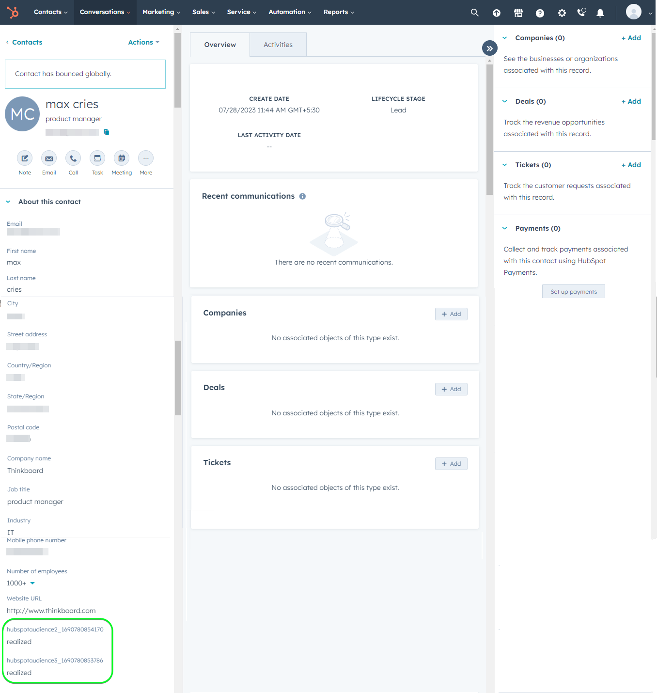

# [!DNL HubSpot] 接続

[[!DNL HubSpot]](https://www.hubspot.com) は、マーケティング、セールス、コンテンツ管理、カスタマーサービスを結び付けるために必要なすべてのソフトウェア、統合、リソースを備えた CRM プラットフォームです。 データ、チーム、顧客を 1 つの CRM プラットフォームに接続できます。

この [!DNL Adobe Experience Platform] [宛先](/help/destinations/home.md) は [[!DNL HubSpot] 連絡先 API](https://developers.hubspot.com/docs/api/crm/contacts)内の連絡先を更新する [!DNL HubSpot] アクティブ化後に既存のExperience Platformオーディエンスから。

[!DNL HubSpot] インスタンスを認証する手順は、さらに下の[宛先に対する認証](#authenticate)の節にあります。

## ユースケース {#use-cases}

[!DNL HubSpot] 宛先を使用する方法とタイミングを理解しやすくするために、Adobe Experience Platform のお客様がこの宛先を使用して解決できるユースケースのサンプルを以下に示します。

[!DNL HubSpot] 連絡先には、ビジネスとやり取りする個人に関する情報が保存されます。 チームが以下に存在する連絡先を使用 [!DNL HubSpot] Experience Platformオーディエンスを作成します。 これらのオーディエンスをに送信した後 [!DNL HubSpot]に設定すると、情報が更新され、各連絡先にはプロパティが割り当てられます。プロパティの値は、連絡先が属するオーディエンスを示すオーディエンス名になります。

## 前提条件 {#prerequisites}

Experience Platformで設定する必要がある前提条件については、以下の節を参照してください [!DNL HubSpot] を使用する前に収集しておく必要がある情報について [!DNL HubSpot] の宛先。

### Experience Platform の前提条件 {#prerequisites-in-experience-platform}

へのデータのアクティブ化の前に [!DNL HubSpot] の宛先。には必要です [スキーマ](/help/xdm/schema/composition.md), a [データセット](https://experienceleague.adobe.com/docs/platform-learn/tutorials/data-ingestion/create-datasets-and-ingest-data.html)、および [オーディエンス](https://experienceleague.adobe.com/docs/platform-learn/tutorials/audiences/create-audiences.html) 作成場所 [!DNL Experience Platform].

については、Experience Platformドキュメントを参照してください。 [オーディエンスメンバーシップの詳細スキーマフィールドグループ](/help/xdm/field-groups/profile/segmentation.md) オーディエンスのステータスのガイダンスが必要な場合。

### の前提条件 [!DNL HubSpot] 宛先 {#prerequisites-destination}

Platform からにデータを書き出すには、次の前提条件に注意してください [!DNL HubSpot] アカウント :

#### 以下が必要です [!DNL HubSpot] アカウント {#prerequisites-account}

Platform からユーザーの [!DNL Hubspot] 必須アカウント [!DNL HubSpot] アカウント。 まだない場合は、 [HubSpot アカウントの設定](https://knowledge.hubspot.com/get-started/set-up-your-account) ページに移動し、ガイダンスに従ってアカウントを登録し作成します。

#### を収集 [!DNL HubSpot] プライベートアプリアクセストークン {#gather-credentials}

必要なのは [!DNL HubSpot] `Access token` を許可する [!DNL HubSpot] を介して API 呼び出しを行う宛先 [!DNL HubSpot] 内のプライベートアプリ [!DNL HubSpot] アカウント。 この `Access token` 次の役割を果たす `Bearer token` 実行する場合 [宛先の認証](#authenticate).

プライベートアプリがない場合は、ドキュメントに従って、次の操作を行います [でのプライベートアプリの作成 [!DNL HubSpot]](https://developers.hubspot.com/docs/api/private-apps).

>[!IMPORTANT]
>
> プライベートアプリには、次の範囲を割り当てる必要があります。
> `crm.objects.contacts.write`, `crm.objects.contacts.read`
> `crm.schemas.contacts.write`, `crm.schemas.contacts.read`

| 資格情報 | 説明 | 例 |
| --- | --- | --- |
| `Bearer token` | この `Access token` の [!DNL HubSpot] プライベートアプリ。  を入手するには [!DNL HubSpot] `Access token` に従う [!DNL HubSpot] のドキュメント化 [アプリのアクセストークンを使用して API 呼び出しを行います。](https://developers.hubspot.com/docs/api/private-apps#make-api-calls-with-your-app-s-access-token). | `pat-na1-11223344-abcde-12345-9876-1234a1b23456` |

## ガードレール {#guardrails}

[!DNL HubSpot] プライベートアプリは次の対象となります [レート制限](https://developers.hubspot.com/docs/api/usage-details). プライベートアプリで実行できる呼び出しの数は、 [!DNL HubSpot] アカウントのサブスクリプションと、API アドオンを購入したかどうか。 また、も参照してください。 [その他の制限](https://developers.hubspot.com/docs/api/usage-details#other-limits).

## サポートされる ID {#supported-identities}

[!DNL HubSpot] では、以下の表で説明する ID の更新をサポートしています。[ID](/help/identity-service/features/namespaces.md) についての詳細情報。

| ターゲット ID | 例 | 説明 | 注意点 |
|---|---|---|---|
| `email` | `test@test.com` | 連絡先のメールアドレス。 | 必須 |

## サポートされるオーディエンス {#supported-audiences}

この節では、この宛先に書き出しできるすべてのオーディエンスについて説明します。

この宛先では、Experience Platform の[セグメント化サービス](../../../segmentation/home.md)で生成したすべてのオーディエンスのアクティブ化をサポートします。

この宛先では、以下の表で説明するオーディエンスのアクティブ化もサポートされています。

| オーディエンスタイプ | 説明 |
|---------|----------|
| カスタムアップロード | CSV ファイルから Experience Platform に[読み込まれた](../../../segmentation/ui/audience-portal.md#import-audience)オーディエンス。 |

{style="table-layout:auto"}

## 書き出しのタイプと頻度 {#export-type-frequency}

宛先の書き出しのタイプと頻度について詳しくは、以下の表を参照してください。

| 項目 | タイプ | メモ |
---------|----------|---------|
| 書き出しタイプ | **[!UICONTROL プロファイルベース]** | <ul><li>オーディエンスのすべてのメンバーを、目的のスキーマフィールドと共に書き出します *（例：メールアドレス、電話番号、姓）*&#x200B;フィールドマッピングに従って調整します。</li><li> さらに、新しいプロパティがに作成されます。 [!DNL HubSpot] オーディエンス名とその値を、選択した各オーディエンスに対して Platform の対応するオーディエンスステータスと共に使用します。</li></ul> |
| 書き出し頻度 | **[!UICONTROL ストリーミング]** | <ul><li>ストリーミングの宛先は常に、API ベースの接続です。オーディエンス評価に基づいて Experience Platform 内でプロファイルが更新されるとすぐに、コネクタは更新を宛先プラットフォームに送信します。詳しくは、[ストリーミングの宛先](/help/destinations/destination-types.md#streaming-destinations)を参照してください。</li></ul> |

{style="table-layout:auto"}

## 宛先への接続 {#connect}

>[!IMPORTANT]
>
>宛先に接続するには、 **[!UICONTROL 宛先の表示]** および **[!UICONTROL 宛先の管理]** [アクセス制御権限](/help/access-control/home.md#permissions). 詳しくは、[アクセス制御の概要](/help/access-control/ui/overview.md)または製品管理者に問い合わせて、必要な権限を取得してください。

この宛先に接続するには、[宛先設定のチュートリアル](../../ui/connect-destination.md)の手順に従ってください。宛先の設定ワークフローで、以下の 2 つのセクションにリストされているフィールドに入力します。

**[!UICONTROL 宛先]**／**[!UICONTROL カタログ]**&#x200B;内で [!DNL HubSpot] を検索します。または、**[!UICONTROL CRM]** カテゴリの下に配置することもできます。

### 宛先に対する認証 {#authenticate}

以下の必須のフィールドに入力します。を参照してください。 [を収集 [!DNL HubSpot] プライベートアプリアクセストークン](#gather-credentials) ガイダンスのセクション。
* **[!UICONTROL ベアラートークン]**：のアクセストークン [!DNL HubSpot] プライベートアプリ。

宛先を認証するには、「 **[!UICONTROL 宛先に接続]**」を選択します。

指定した詳細が有効な場合、UI で&#x200B;**[!UICONTROL 接続済み]**&#x200B;ステータスに緑色のチェックマークが付きます。その後、次の手順に進むことができます。

### 宛先の詳細を入力 {#destination-details}

宛先の詳細を設定するには、以下の必須フィールドとオプションフィールドに入力します。UI のフィールドの横にアスタリスクが表示される場合は、そのフィールドが必須であることを示します。

* **[!UICONTROL 名前]**：今後この宛先を認識するための名前。
* **[!UICONTROL 説明]**：今後この宛先を識別するのに役立つ説明。

### アラートの有効化 {#enable-alerts}

アラートを有効にすると、宛先へのデータフローのステータスに関する通知を受け取ることができます。リストからアラートを選択して、データフローのステータスに関する通知を受け取るよう登録します。アラートについて詳しくは、[UI を使用した宛先アラートの購読](../../ui/alerts.md)についてのガイドを参照してください。

宛先接続の詳細の入力を終えたら「**[!UICONTROL 次へ]**」を選択します。

## この宛先に対してオーディエンスをアクティブ化 {#activate}

>[!IMPORTANT]
>
>データをアクティブ化するには、 **[!UICONTROL 宛先の表示]**, **[!UICONTROL 宛先のアクティブ化]**, **[!UICONTROL プロファイルの表示]**、および **[!UICONTROL セグメントの表示]** [アクセス制御権限](/help/access-control/home.md#permissions). [アクセス制御の概要](/help/access-control/ui/overview.md)を参照するか、製品管理者に問い合わせて必要な権限を取得してください。

この宛先にオーディエンスをアクティベートする手順は、[ストリーミングオーディエンスの書き出し宛先へのプロファイルとオーディエンスのアクティベート](/help/destinations/ui/activate-segment-streaming-destinations.md)を参照してください。

### 属性と ID のマッピング {#map}

Adobe Experience Platformからにオーディエンスデータを正しく送信するには、以下を行います [!DNL HubSpot] 宛先については、フィールドマッピングの手順を実行する必要があります。 マッピングは、Platform アカウント内の Experience Data Model （XDM）スキーマフィールドと、ターゲット宛先から対応する同等のスキーマフィールドとの間にリンクを作成して構成されます。

XDM フィールドをに正しくマッピングするには [!DNL HubSpot] 宛先フィールドは、次の手順に従います。

#### マッピング： `Email` id

この `Email` id は、この宛先に必須のマッピングです。 マッピングするには、次の手順に従います。
1. **[!UICONTROL マッピング]**&#x200B;手順で、「**[!UICONTROL 新しいマッピングを追加]**」を選択します。これで、新しいマッピング行が画面に表示されます。
   
1. が含まれる **[!UICONTROL ソースフィールドを選択]** ウィンドウで、 **[!UICONTROL ID 名前空間を選択]** ID を選択します。
   
1. が含まれる **[!UICONTROL ターゲットフィールドを選択]** ウィンドウで、 **[!UICONTROL 属性を選択]** を選択して、 `email`.
   

| ソースフィールド | ターゲットフィールド | 必須 |
| --- | --- | --- |
| `IdentityMap: Email` | `Identity: email` | ○ |

ID マッピングの例を以下に示します。

#### マッピング **optional** 属性

XDM プロファイルスキーマとのその他の更新対象の属性を追加するには、次の手順に従います [!DNL HubSpot] アカウント次の手順を繰り返します。
1. **[!UICONTROL マッピング]**&#x200B;手順で、「**[!UICONTROL 新しいマッピングを追加]**」を選択します。これで、新しいマッピング行が画面に表示されます。
   
1. が含まれる **[!UICONTROL ソースフィールドを選択]** ウィンドウで、 **[!UICONTROL 属性を選択]** カテゴリを選択し、XDM 属性を選択します。
   
1. が含まれる **[!UICONTROL ターゲットフィールドを選択]** ウィンドウ、を選択 **[!UICONTROL 属性を選択]** カテゴリとを、から自動的に入力される属性のリストから選択します [!DNL HubSpot] アカウント。 宛先は、 [[!DNL HubSpot] プロパティ](https://developers.hubspot.com/docs/api/crm/properties) この情報を取得するための API。 両方 [!DNL HubSpot] [デフォルトのプロパティ](https://knowledge.hubspot.com/contacts/hubspots-default-contact-properties) およびのカスタムプロパティが取得され、ターゲットフィールドとして選択されます。
   

XDM プロファイルスキーマとの間で使用できるマッピング [!DNL Hubspot] 次に示します。

| ソースフィールド | ターゲットフィールド |
| --- | --- |
| `xdm: person.name.firstName` | `Attribute: firstname` |
| `xdm: person.name.lastName` | `Attribute: lastname` |
| `xdm: workAddress.street1` | `Attribute: address` |
| `xdm: workAddress.city` | `Attribute: city` |
| `xdm: workAddress.country` | `Attribute: country` |

これらの属性マッピングの使用例を次に示します。

宛先接続のマッピングの指定を終えたら、次を選択します **[!UICONTROL 次]**.

## データの書き出しを検証する {#exported-data}

宛先が正しく設定されていることを検証するには、次の手順に従います。

1. にログインします [!DNL HubSpot] web サイトで、に移動します。 **[!UICONTROL 連絡先]** オーディエンスのステータスを確認するページ。 このリストは、オーディエンス名で作成されたカスタムプロパティの列を表示し、その値がオーディエンスステータスになるように設定できます。
   

1. または、個人にドリルダウンすることもできます **[!UICONTROL 人物]** オーディエンス名とオーディエンスのステータスを表示するページに移動し、プロパティに移動します。
   

## データの使用とガバナンス {#data-usage-governance}

[!DNL Adobe Experience Platform] のすべての宛先は、データを処理する際のデータ使用ポリシーに準拠しています。[!DNL Adobe Experience Platform] がどのようにデータガバナンスを実施するかについて詳しくは、[データガバナンスの概要](/help/data-governance/home.md)を参照してください。

## その他のリソース {#additional-resources}

その他の役に立つ情報 [!DNL HubSpot] ドキュメントは以下のとおりです。
* [HubSpot の認証方法](https://developers.hubspot.com/docs/api/intro-to-auth)
* [!DNL HubSpot] の API リファレンス [連絡先](https://developers.hubspot.com/docs/api/crm/contacts) および [プロパティ](https://developers.hubspot.com/docs/api/crm/properties) API です。

### 変更ログ

この節では、この宛先コネクタに対する機能の概要と重要なドキュメントの更新について説明します。

+++ 変更ログを表示

| リリース月 | 更新タイプ | 説明 |
|---|---|---|
| 2023年9月 | 初回リリース | 宛先の初回リリースとドキュメントの公開。 |

{style="table-layout:auto"}

+++
