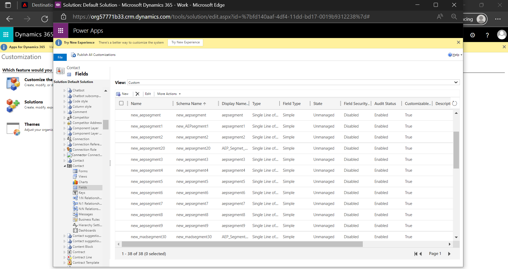

# [!DNL Microsoft Dynamics 365] 接続

## 概要 {#overview}

[[!DNL Microsoft Dynamics 365]](https://dynamics.microsoft.com/en-us/) は、企業リソース計画 (ERP) と顧客関係管理 (CRM) を生産性アプリケーションと AI ツールと組み合わせ、エンドツーエンドのスムーズで制御可能な運用を実現し、成長の可能性を高め、コストを削減するクラウドベースのビジネスアプリケーションプラットフォームです。

この [!DNL Adobe Experience Platform] [宛先](/help/destinations/home.md) は [[!DNL Contact Entity Reference API]](https://docs.microsoft.com/en-us/dynamics365/customerengagement/on-premises/developer/entities/contact?view=op-9-1)：セグメント内の id をに更新できます。 [!DNL Dynamics 365].

[!DNL Dynamics 365] は、認証付与を使用する OAuth 2 を、 [!DNL Contact Entity Reference API]. への認証手順 [!DNL Dynamics 365] インスタンスは、 [宛先に対する認証](#authenticate) 」セクションに入力します。

## ユースケース {#use-cases}

マーケターは、Adobe Experience Platformプロファイルの属性に基づいて、ユーザーにパーソナライズされたエクスペリエンスを提供できます。 オフラインデータからセグメントを作成し、それらのセグメントをに送信できます。 [!DNL Dynamics 365]、Adobe Experience Platformでセグメントとプロファイルが更新されるとすぐに、ユーザーのフィードに表示されます。

## 前提条件 {#prerequisites}

### Experience Platformの前提条件 {#prerequisites-in-experience-platform}

に対してデータをアクティブ化する前に [!DNL Dynamics 365] 宛先の [スキーマ](/help/xdm/schema/composition.md), a [データセット](https://experienceleague.adobe.com/docs/platform-learn/tutorials/data-ingestion/create-datasets-and-ingest-data.html?lang=en)、および [セグメント](https://experienceleague.adobe.com/docs/platform-learn/tutorials/segments/create-segments.html?lang=en) 次で作成： [!DNL Experience Platform].

詳しくは、Adobeのドキュメントを参照してください。 [セグメントメンバーシップの詳細スキーマフィールドグループ](/help/xdm/field-groups/profile/segmentation.md) セグメントのステータスに関するガイダンスが必要な場合。

### [!DNL Microsoft Dynamics 365] 前提条件 {#prerequisites-destination}

次の前提条件に注意してください。 [!DNL Dynamics 365]を使用して、Platform からにデータを書き出す [!DNL Dynamics 365] アカウント：

#### 次の条件を満たすには、 [!DNL Microsoft Dynamics 365] アカウント {#prerequisites-account}

次に移動： [!DNL Dynamics 365] [裁判](https://dynamics.microsoft.com/en-us/dynamics-365-free-trial/) アカウントを登録および作成するページ（まだ存在しない場合）。

#### 内にフィールドを作成 [!DNL Dynamics 365] {#prerequisites-custom-field}

タイプのカスタムフィールドの作成 `Simple` フィールドのデータ型を次のように設定 `Single Line of Text` どのExperience Platformが、 [!DNL Dynamics 365].
詳しくは、 [!DNL Dynamics 365] ～に関する文書 [フィールド（属性）の作成](https://docs.microsoft.com/en-us/dynamics365/customerengagement/on-premises/customize/create-edit-fields?view=op-9-1) 追加のガイダンスが必要な場合は、を参照してください。

内の設定例 [!DNL Dynamics 365] は次のように表示されます。

#### Azure Active Directory 内にアプリケーションとアプリケーションユーザーを登録する {#prerequisites-app-user}

有効にするには [!DNL Dynamics 365] を使用して、 [!DNL Azure Account] から [[!DNL Azure Active Directory]](https://docs.microsoft.com/en-us/azure/active-directory/develop/howto-create-service-principal-portal#register-an-application-with-azure-ad-and-create-a-service-principal) をクリックし、以下を作成します。
* An [!DNL Azure Active Directory] アプリ
* サービスプリンシパル
* アプリケーション秘密鍵

また、 [アプリケーションユーザーの作成](https://docs.microsoft.com/en-us/power-platform/admin/manage-application-users#create-an-application-user) in [!DNL Azure Active Directory] 新しく作成したアプリケーションに関連付けます。

#### 収集 [!DNL Dynamics 365] 資格情報 {#gather-credentials}

を認証する前に、以下の項目をメモしておきます。 [!DNL Dynamics 365] CRM の宛先：

| 認証情報 | 説明 | 例 |
| --- | --- | --- |
| `Client ID` | この [!DNL Dynamics 365] のクライアント ID [!DNL Azure Active Directory] アプリケーション。 詳しくは、 [[!DNL Dynamics 365] ドキュメント](https://docs.microsoft.com/en-us/azure/active-directory/develop/howto-create-service-principal-portal#get-tenant-and-app-id-values-for-signing-in) 指導のために | `ababbaba-abab-baba-acac-acacacacacac` |
| `Client Secret` | この [!DNL Dynamics 365] のクライアント秘密鍵 [!DNL Azure Active Directory] アプリケーション。 オプション#2を [[!DNL Dynamics 365] ドキュメント](https://docs.microsoft.com/en-us/azure/active-directory/develop/howto-create-service-principal-portal#authentication-two-options). | `abcde~abcdefghijklmnopqrstuvwxyz12345678` 指導のために |
| `Tenant ID` | この [!DNL Dynamics 365] のテナント ID [!DNL Azure Active Directory] アプリケーション。 詳しくは、 [[!DNL Dynamics 365] ドキュメント](https://docs.microsoft.com/en-us/azure/active-directory/develop/howto-create-service-principal-portal#get-tenant-and-app-id-values-for-signing-in) 指導のために | `1234567-aaaa-12ab-ba21-1234567890` |
| `Environment URL` | 詳しくは、 [[!DNL Dynamics 365] ドキュメント](https://docs.microsoft.com/en-us/dynamics365/customerengagement/on-premises/developer/org-service/discover-url-organization-organization-service?view=op-9-1) 指導のために | 次に、 [!DNL Dynamics 365] ドメインが以下のようになっている場合は、ハイライト表示された値が必要です。  *`org57771b33`.crm.dynamics.com* |

## ガードレール {#guardrails}

この [リクエストの制限と割り当て](https://docs.microsoft.com/en-us/power-platform/admin/api-request-limits-allocations) ページの詳細 [!DNL Dynamics 365] に関連する API 制限 [!DNL Dynamics 365] ライセンス。 データとペイロードがこれらの制約内にあることを確認する必要があります。

## サポートされる ID {#supported-identities}

[!DNL Dynamics 365] では、以下の表で説明する id の更新をサポートしています。 詳細情報： [id](/help/identity-service/namespaces.md).

| ターゲット ID | 例 | 説明 | 注意点 |
|---|---|---|---|
| `contactId` | 7eb682f1-ca75-e511-80d4-00155d2a68d1 | 連絡先の一意の ID。 | **必須**. 詳しくは、 [[!DNL Dynamics 365] ドキュメント](https://docs.microsoft.com/en-us/dynamics365/customerengagement/on-premises/developer/entities/contact?view=op-9-1) 詳しくは、を参照してください。 |

## エクスポートのタイプと頻度 {#export-type-frequency}

宛先の書き出しのタイプと頻度について詳しくは、次の表を参照してください。

| 項目 | タイプ | 備考 |
---------|----------|---------|
| 書き出しタイプ | **[!UICONTROL プロファイルベース]** | <ul><li>セグメントのすべてのメンバーを、必要なスキーマフィールドと共に書き出します *( 例：メールアドレス、電話番号、姓*（フィールドマッピングに従います）</li><li> 各セグメントのステータス ( [!DNL Dynamics 365] は、 **[!UICONTROL マッピング ID]** 期間中に指定された値 [セグメントスケジュール](#schedule-segment-export-example) 手順</li></ul> |
| 書き出し頻度 | **[!UICONTROL ストリーミング]** | <ul><li>ストリーミングの宛先は、API ベースの接続です。 セグメント評価に基づいてExperience Platform内でプロファイルが更新されるとすぐに、コネクタは更新を宛先プラットフォームに送信します。 詳細を表示 [ストリーミング先](/help/destinations/destination-types.md#streaming-destinations).</li></ul> |

{style=&quot;table-layout:auto&quot;}

## 宛先への接続 {#connect}

>[!IMPORTANT]
>
>宛先に接続するには、 **[!UICONTROL 宛先の管理]** [アクセス制御権限](/help/access-control/home.md#permissions). 詳しくは、 [アクセス制御の概要](/help/access-control/ui/overview.md) または製品管理者に問い合わせて、必要な権限を取得してください。

この宛先に接続するには、[宛先設定のチュートリアル](../../ui/connect-destination.md)の手順に従ってください。宛先の設定ワークフローで、以下の 2 つのセクションに記載されているフィールドに入力します。

内 **[!UICONTROL 宛先]** > **[!UICONTROL カタログ]** 検索 [!DNL Dynamics 365]. または、 **[!UICONTROL CRM]** カテゴリ。

### 宛先に対する認証 {#authenticate}

宛先を認証するには、「 」を選択します。 **[!UICONTROL 宛先に接続]**.

以下の必須フィールドに入力します。 詳しくは、 [Dynamics 365 認証情報の収集](#gather-credentials) 」の節を参照してください。
* **[!UICONTROL クライアント ID]**:この [!DNL Dynamics 365] のクライアント ID [!DNL Azure Active Directory] アプリケーション。
* **[!UICONTROL テナント ID]**:この [!DNL Dynamics 365] のテナント ID [!DNL Azure Active Directory] アプリケーション。
* **[!UICONTROL クライアント秘密鍵]**:この [!DNL Dynamics 365] のクライアント秘密鍵 [!DNL Azure Active Directory] アプリケーション。
* **[!UICONTROL 環境 URL]**:お使いの [!DNL Dynamics 365] 環境 URL。

指定した詳細が有効な場合、UI に **[!UICONTROL 接続済み]** ステータスに緑色のチェックマークが付きます。 その後、次の手順に進むことができます。

### 宛先の詳細を入力 {#destination-details}

宛先の詳細を設定するには、以下の必須フィールドとオプションフィールドに入力します。 UI でフィールドの横にアスタリスクが表示される場合は、そのフィールドが必須であることを示します。

* **[!UICONTROL 名前]**:将来この宛先を認識するための名前。
* **[!UICONTROL 説明]**:今後この宛先を識別するのに役立つ説明。

### アラートの有効化 {#enable-alerts}

アラートを有効にして、宛先へのデータフローのステータスに関する通知を受け取ることができます。 リストからアラートを選択して、データフローのステータスに関する通知を受け取るよう登録します。アラートの詳細については、 [UI を使用した宛先アラートの購読](../../ui/alerts.md).

宛先接続の詳細の指定が完了したら、 **[!UICONTROL 次へ]**.

## この宛先に対してセグメントをアクティブ化 {#activate}

>[!IMPORTANT]
>
>データをアクティブ化するには、 **[!UICONTROL 宛先の管理]**, **[!UICONTROL 宛先のアクティブ化]**, **[!UICONTROL プロファイルの表示]**、および **[!UICONTROL セグメントを表示]** [アクセス制御権限](/help/access-control/home.md#permissions). 詳しくは、 [アクセス制御の概要](/help/access-control/ui/overview.md) または製品管理者に問い合わせて、必要な権限を取得してください。

読み取り [ストリーミングセグメントの書き出し先に対するプロファイルとセグメントのアクティブ化](/help/destinations/ui/activate-segment-streaming-destinations.md) を参照してください。

### マッピングの考慮事項と例 {#mapping-considerations-example}

Adobe Experience Platformからにオーディエンスデータを正しく送信するには [!DNL Dynamics 365] の宛先に移動する場合は、フィールドマッピングの手順を実行する必要があります。 マッピングは、Platform アカウント内の Experience Data Model(XDM) スキーマフィールドと、ターゲット宛先から対応する同等のスキーマフィールドとの間にリンクを作成することで構成されます。 XDM フィールドを [!DNL Dynamics 365] 宛先フィールドは、次の手順に従います。

1. 内 **[!UICONTROL マッピング]** ステップ、選択 **[!UICONTROL 新しいマッピングを追加]**. 画面に新しいマッピング行が表示されます。
   

1. 内 **[!UICONTROL ソースフィールドを選択]** ウィンドウで、 **[!UICONTROL ID 名前空間を選択]** カテゴリと選択 `contactId`.
   

1. 内 **[!UICONTROL ターゲットフィールドを選択]** ウィンドウで、ソースフィールドをマッピングするターゲットフィールドのタイプを選択します。
   * **[!UICONTROL ID 名前空間を選択]**:このオプションを選択して、ソースフィールドをリストから id 名前空間にマップします。
      

   * XDM プロファイルスキーマと [!DNL Dynamics 365] インスタンス： |XDM プロファイルスキーマ|[!DNL Dynamics 365] インスタンス|必須| |—|—|—| |`contactId`|`contactId`|はい |

   * **[!UICONTROL カスタム属性を選択]**:このオプションを選択して、ソースフィールドを、 **[!UICONTROL 属性名]** フィールドに入力します。 参照： [[!DNL Dynamics 365] ドキュメント](https://docs.microsoft.com/en-us/dynamics365/customerengagement/on-premises/developer/entities/contact?view=op-9-1#entity-properties) を参照してください。
      

      >[!IMPORTANT]
      >
      >日付またはタイムスタンプのソースフィールドが、 [!DNL Dynamics 365] [日付またはタイムスタンプ](https://docs.microsoft.com/en-us/power-apps/developer/data-platform/webapi/reference/timestampdatemapping?view=dataverse-latest) ターゲットフィールドで、マッピングされた値が空でないことを確認します。 渡された値が空の場合、 *`Bad request reported while pushing events to the destination. Please contact the administrator and try again.`* エラーメッセージが表示され、データは更新されません。 これは、 [!DNL Dynamics 365] 制限

   * 例えば、更新する値に応じて、XDM プロファイルスキーマと [!DNL Dynamics 365] インスタンス： |XDM プロファイルスキーマ|[!DNL Dynamics 365] インスタンス| |—|—| |`person.name.firstName`|`FirstName`| |`person.name.lastName`|`LastName`| |`personalEmail.address`|`Email`|

   * これらのマッピングの使用例を次に示します。
      

### セグメントのエクスポートと例をスケジュール {#schedule-segment-export-example}

内 [[!UICONTROL セグメントの書き出しをスケジュール]](/help/destinations/ui/activate-segment-streaming-destinations.md#scheduling) アクティベーションワークフローの手順では、Platform セグメントを [!DNL Dynamics 365].

これをおこなうには、各セグメントを選択し、次の場所から対応するカスタムフィールド属性を入力します。 [!DNL Dynamics 365] 内 **[!UICONTROL マッピング ID]** フィールドに入力します。

>[!IMPORTANT]
>
>に使用する値 **[!UICONTROL マッピング ID]** は、 [!DNL Dynamics 365]. 詳しくは、 [[!DNL Dynamics 365] ドキュメント](https://docs.microsoft.com/en-us/dynamics365/customerengagement/on-premises/customize/create-edit-fields?view=op-9-1) カスタムフィールド属性の検索に関するガイダンスが必要な場合は、を参照してください。

次に例を示します。

## データの書き出しを検証する {#exported-data}

宛先が正しく設定されていることを検証するには、次の手順に従います。

1. 選択 **[!UICONTROL 宛先]** > **[!UICONTROL 参照]** をクリックして、宛先のリストに移動します。
   

1. 宛先を選択し、ステータスが「 **[!UICONTROL 有効]**.
   

1. 次に切り替え： **[!DNL Activation data]** 」タブをクリックし、セグメント名を選択します。
   

1. セグメント概要を監視し、プロファイルの数がセグメント内で作成された数に一致していることを確認します。
   

1. にログインします。 [!DNL Dynamics 365] web サイトに移動し、 [!DNL Customers] > [!DNL Contacts] ページを開き、セグメントのプロファイルが追加されたかどうかを確認します。 各セグメントのステータスは、 [!DNL Dynamics 365] は、 **[!UICONTROL マッピング ID]** 期間中に指定された値 [セグメントスケジュール](#schedule-segment-export-example) 手順
   

## データの使用とガバナンス {#data-usage-governance}

[!DNL Adobe Experience Platform] のすべての宛先は、データを処理する際のデータ使用ポリシーに準拠しています。詳しくは、 [!DNL Adobe Experience Platform] データガバナンスを強制します。詳しくは、 [データガバナンスの概要](/help/data-governance/home.md).

## エラーとトラブルシューティング {#errors-and-troubleshooting}

### イベントを宛先にプッシュする際に不明なエラーが発生しました {#unknown-errors}

データフローの実行をチェックする際に、次のエラーメッセージが表示される場合。 `Bad request reported while pushing events to the destination. Please contact the administrator and try again.`

このエラーを修正するには、 **[!UICONTROL マッピング ID]** 指定した [!DNL Dynamics 365] は、Platform セグメントが有効で、内に存在する [!DNL Dynamics 365].

## その他のリソース {#additional-resources}

次の役に立つ追加情報： [[!DNL Dynamics 365] ドキュメント](https://docs.microsoft.com/en-us/dynamics365/) は以下です。
* [IOrganizationService.Update(Entity) メソッド](https://docs.microsoft.com/en-us/dotnet/api/microsoft.xrm.sdk.iorganizationservice.update?view=dataverse-sdk-latest)
* [Web API を使用したテーブル行の更新および削除](https://docs.microsoft.com/en-us/power-apps/developer/data-platform/webapi/update-delete-entities-using-web-api#basic-update)