# [!DNL Microsoft Dynamics 365] 接続

## 概要 {#overview}

[[!DNL Microsoft Dynamics 365]](https://dynamics.microsoft.com/ja-jp/) は、クラウドベースのビジネスアプリケーションプラットフォームです。エンタープライズリソースプランニング（ERP）と顧客関係管理（CRM）を生産性アプリケーションと AI ツールと組み合わせて、エンドツーエンドのスムーズで制御可能な運用、優れた成長の可能性およびコスト削減を実現します。

この[!DNL Adobe Experience Platform] [宛先](/help/destinations/home.md)では、[[!DNL Contact Entity Reference API]](https://docs.microsoft.com/ja-jp/dynamics365/customerengagement/on-premises/developer/entities/contact?view=op-9-1)を利用しています。これにより、オーディエンス内のIDを[!DNL Dynamics 365]に更新できます。

[!DNL Dynamics 365] は、認証付与を使用する OAuth 2 を認証メカニズムとして使用して、[!DNL Contact Entity Reference API] と通信します。[!DNL Dynamics 365] インスタンスを認証する手順は、さらに下の[宛先に対する認証](#authenticate)の節にあります。

## ユースケース {#use-cases}

マーケターは、[!DNL Adobe Experience Platform]のプロファイルの属性に基づいて、パーソナライズされたエクスペリエンスをユーザーに配信できます。 オフラインデータからオーディエンスを作成し、これらのオーディエンスを[!DNL Dynamics 365]に送信すると、[!DNL Adobe Experience Platform]でオーディエンスとプロファイルが更新されるとすぐに、ユーザーのフィードに表示できます。

## 前提条件 {#prerequisites}

### Experience Platform の前提条件 {#prerequisites-in-experience-platform}

[!DNL Dynamics 365]宛先にデータをアクティブ化する前に、[で](/help/xdm/schema/composition.md) スキーマ [、](https://experienceleague.adobe.com/docs/platform-learn/tutorials/data-ingestion/create-datasets-and-ingest-data.html) データセット [、および](https://experienceleague.adobe.com/docs/platform-learn/tutorials/audiences/create-audiences.html) オーディエンス [!DNL Experience Platform]を作成しておく必要があります。

オーディエンスのステータスに関するガイダンスが必要な場合は、[&#x200B; オーディエンスメンバーシップの詳細スキーマフィールドグループ &#x200B;](/help/xdm/field-groups/profile/segmentation.md)に関するAdobeのドキュメントを参照してください。

### [!DNL Microsoft Dynamics 365] 前提条件 {#prerequisites-destination}

Experience Platformから[!DNL Dynamics 365] アカウントにデータをエクスポートするには、[!DNL Dynamics 365]の次の前提条件に注意してください。

#### [!DNL Microsoft Dynamics 365] アカウントが必要です {#prerequisites-account}

アカウントをまだお持ちでない場合は、[!DNL Dynamics 365] [体験版](https://dynamics.microsoft.com/ja-jp/dynamics-365-free-trial/)ページに移動し、アカウントを登録して作成してください。

#### [!DNL Dynamics 365] 内にフィールドを作成 {#prerequisites-custom-field}

フィールドのデータタイプが`Simple`のタイプ `Single Line of Text`のカスタムフィールドを作成します。このフィールドをExperience Platformで[!DNL Dynamics 365]内のオーディエンスステータスの更新に使用します。

追加のガイダンスが必要な場合は、[!DNL Dynamics 365] [&#x200B; フィールド（属性） &#x200B;](https://docs.microsoft.com/ja-jp/dynamics365/customerengagement/on-premises/customize/create-edit-fields?view=op-9-1)の作成または編集に関するドキュメントを参照してください。

**[!UICONTROL Customization prefix]**&#x200B;で作成したカスタムフィールドの[!DNL Dynamics 365]を書き留めます。 このプレフィックスは、[宛先の詳細を入力](#destination-details)手順の間に必要になります。 詳しくは、[&#x200B; ドキュメントの](https://learn.microsoft.com/en-us/dynamics365/customerengagement/on-premises/customize/create-edit-fields?view=op-9-1#create-and-edit-fields) フィールドの作成と編集[!DNL Dynamics 365] セクションを参照してください。
カスタマイズのプレフィックスを示す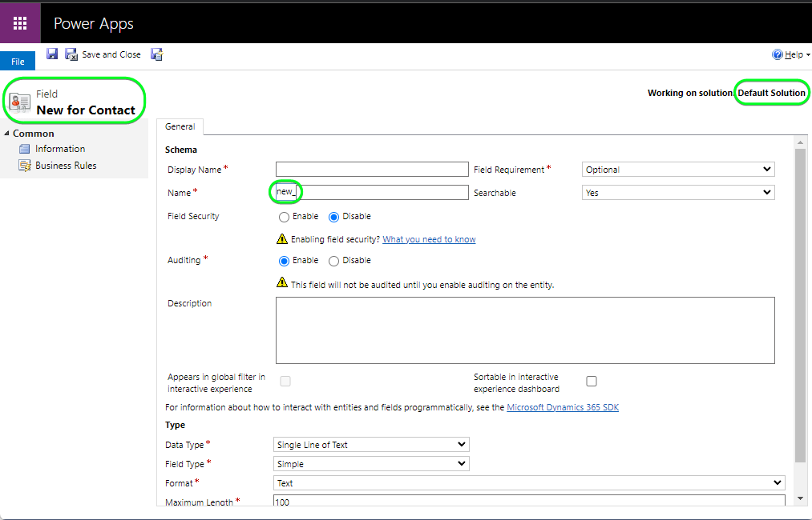

[!DNL Dynamics 365] 内の設定例を次に示します。
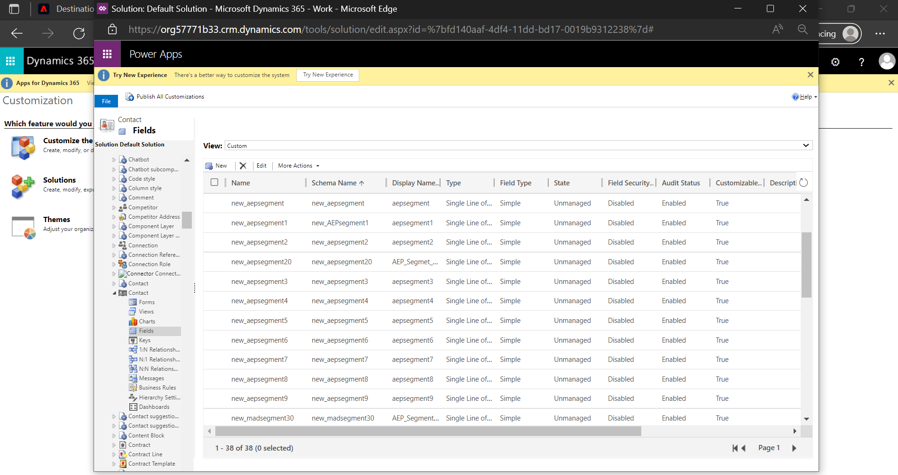

#### Azure Active Directory 内でのアプリケーションとアプリケーションユーザーの登録 {#prerequisites-app-user}

[!DNL Dynamics 365] をリソースにアクセスできるようにするには、[!DNL Azure Account] を使用して [[!DNL Azure Active Directory]](https://docs.microsoft.com/ja-jp/azure/active-directory/develop/howto-create-service-principal-portal#register-an-application-with-azure-ad-and-create-a-service-principal) にログインし、以下を作成する必要があります。

* [!DNL Azure Active Directory] アプリケーション
* サービスプリンシパル
* アプリケーション秘密鍵

また、[!DNL Azure Active Directory] で[アプリケーションユーザーを作成](https://docs.microsoft.com/ja-jp/power-platform/admin/manage-application-users#create-an-application-user)し、新しく作成したアプリケーションに関連付ける必要があります。

#### [!DNL Dynamics 365] 資格情報の収集 {#gather-credentials}

[!DNL Dynamics 365] CRM 宛先に対して認証を行う前に、以下の項目をメモしておきます。

| 資格情報 | 説明 | 例 |
| --- | --- | --- |
| `Client ID` | お使いの [!DNL Azure Active Directory] アプリケーションの [!DNL Dynamics 365] クライアント ID。詳しくは、[[!DNL Dynamics 365] ドキュメント](https://docs.microsoft.com/ja-jp/azure/active-directory/develop/howto-create-service-principal-portal#get-tenant-and-app-id-values-for-signing-in)を参照してください。 | `ababbaba-abab-baba-acac-acacacacacac` |
| `Client Secret` | お使いの [!DNL Azure Active Directory] アプリケーションの [!DNL Dynamics 365] クライアント秘密鍵。[[!DNL Dynamics 365] ドキュメント](https://docs.microsoft.com/ja-jp/azure/active-directory/develop/howto-create-service-principal-portal#authentication-two-options)内のオプション #2 を使用することになります。 | 説明のための `abcde~abcdefghijklmnopqrstuvwxyz12345678`。 |
| `Tenant ID` | お使いの [!DNL Azure Active Directory] アプリケーションの [!DNL Dynamics 365] テナント ID。詳しくは、[[!DNL Dynamics 365] ドキュメント](https://docs.microsoft.com/ja-jp/azure/active-directory/develop/howto-create-service-principal-portal#get-tenant-and-app-id-values-for-signing-in)を参照してください。 | `1234567-aaaa-12ab-ba21-1234567890` |
| `Region` | 環境URLに関連付けられているMicrosoft リージョン。  ガイダンスについては、[[!DNL Dynamics 365]  ドキュメント &#x200B;](https://learn.microsoft.com/en-us/power-platform/admin/new-datacenter-regions)を参照してください。 | ドメインが以下の場合、[destination](#authenticate)に対する認証時に、ドロップダウンセレクターのCRM フィールドに強調表示された値を指定する必要があります。  *org57771b33。`crm`.dynamics.com* &#x200B;例：会社が北米（NAM）地域にプロビジョニングされている場合、URLは`crm.dynamics.com`になり、`crm`を選択する必要があります。 会社がカナダ （CAN） リージョンでプロビジョニングされている場合、URLは`crm3.dynamics.com`になり、`crm3`を選択する必要があります。 |
| `Environment URL` | 詳しくは、[[!DNL Dynamics 365] ドキュメント](https://docs.microsoft.com/ja-jp/dynamics365/customerengagement/on-premises/developer/org-service/discover-url-organization-organization-service?view=op-9-1)を参照してください。 | お使いの [!DNL Dynamics 365] ドメインが以下のようになっている場合は、ハイライト表示された値が必要です。  *`org57771b33`.crm.dynamics.com* |

{style="table-layout:auto"}

## ガードレール {#guardrails}

[リクエストの制限と割り当て](https://docs.microsoft.com/ja-jp/power-platform/admin/api-request-limits-allocations)ページでは、[!DNL Dynamics 365] ライセンスに関連する [!DNL Dynamics 365] API 制限を詳細に説明しています。データとペイロードがこれらの制約内にあることを確認する必要があります。

## サポートされる ID {#supported-identities}

[!DNL Dynamics 365] では、以下の表で説明する ID の更新をサポートしています。[ID](/help/identity-service/features/namespaces.md) についての詳細情報。

| ターゲット ID | 例 | 説明 | 注意点 |
|---|---|---|---|
| `contactid` | 77eb682f1-ca75-e511-80d4-00155d2a68d1 | 連絡先の一意の ID。 | **必須**。詳しくは、[[!DNL Dynamics 365] ドキュメント](https://docs.microsoft.com/ja-jp/dynamics365/customerengagement/on-premises/developer/entities/contact?view=op-9-1)を参照してください。 |

{style="table-layout:auto"}

## サポートされるオーディエンス {#supported-audiences}

この節では、この宛先に書き出すことができるオーディエンスのタイプについて説明します。

| オーディエンスの由来 | サポートあり | 説明 |
|---------|----------|----------|
| [!DNL Segmentation Service] | ○ | Experience Platform [&#x200B; セグメント化サービス &#x200B;](../../../segmentation/home.md)を通じて生成されたオーディエンス。 |
| その他すべてのオーディエンスの生成元 | × | このカテゴリには、[!DNL Segmentation Service]を通じて生成されたオーディエンス以外のすべてのオーディエンスのオリジンが含まれます。 [様々なオーディエンスの起源](/help/segmentation/ui/audience-portal.md#customize)について読みます。 次に例を示します。 <ul><li> カスタムアップロードオーディエンス [がCSV ファイルからExperience Platformに](../../../segmentation/ui/audience-portal.md#import-audience)をインポートしました。</li><li> 類似オーディエンス， </li><li> 連合オーディエンス， </li><li> [!DNL Adobe Journey Optimizer]などの他のExperience Platform アプリで生成されたオーディエンス </li><li> その他。 </li></ul> |

{style="table-layout:auto"}

オーディエンスのデータタイプ別にサポートされるオーディエンス：

| オーディエンスのデータタイプ | サポートあり | 説明 | ユースケース |
|--------------------|-----------|-------------|-----------|
| [人物オーディエンス &#x200B;](/help/segmentation/types/people-audiences.md) | ○ | 顧客プロファイルにもとづいて、マーケティング施策の特定のグループをターゲットにすることができます。 | 買い物客やカートの放棄が多い |
| [&#x200B; アカウントオーディエンス &#x200B;](/help/segmentation/types/account-audiences.md) | × | アカウントベースドマーケティング戦略のために、特定の組織内の個人をターゲットにします。 | B2B マーケティング |
| [見込みオーディエンス &#x200B;](/help/segmentation/types/prospect-audiences.md) | × | まだ顧客ではないが、ターゲットオーディエンスと特徴を共有する個人をターゲットにします。 | サードパーティデータによる見込み顧客の開拓 |
| [&#x200B; データセットの書き出し](/help/catalog/datasets/overview.md) | × | [!DNL Adobe Experience Platform] データ レイクに保存されている構造化データのコレクション。 | レポート，データサイエンスワークフロー |

{style="table-layout:auto"}

## 書き出しのタイプと頻度 {#export-type-frequency}

宛先の書き出しのタイプと頻度について詳しくは、以下の表を参照してください。

| 項目 | タイプ | メモ |
|---------|----------|---------|
| 書き出しタイプ | **[!UICONTROL Profile-based]** | <ul><li>オーディエンスのすべてのメンバーを、フィールドマッピングに従って、目的のスキーマフィールド *（例：電子メールアドレス、電話番号、姓）*&#x200B;と共に書き出します。</li><li> [!DNL Dynamics 365]の各オーディエンスステータスは、**[!UICONTROL Mapping ID]** オーディエンススケジュール [手順で指定した](#schedule-audience-export-example)値に基づいて、Experience Platformからの対応するオーディエンスステータスで更新されます。</li></ul> |
| 書き出し頻度 | **[!UICONTROL Streaming]** | <ul><li>ストリーミングの宛先は常に、API ベースの接続です。オーディエンス評価に基づいて Experience Platform 内でプロファイルが更新されるとすぐに、コネクタは更新を宛先プラットフォームに送信します。詳しくは、[ストリーミングの宛先](/help/destinations/destination-types.md#streaming-destinations)を参照してください。</li></ul> |

{style="table-layout:auto"}

## 宛先への接続 {#connect}

>[!IMPORTANT]
>
>宛先に接続するには、**[!UICONTROL View Destinations]**&#x200B;および&#x200B;**[!UICONTROL Manage Destinations]** [&#x200B; アクセス制御権限](/help/access-control/home.md#permissions)が必要です。 詳しくは、[アクセス制御の概要](/help/access-control/ui/overview.md)または製品管理者に問い合わせて、必要な権限を取得してください。

この宛先に接続するには、[宛先設定のチュートリアル](../../ui/connect-destination.md)の手順に従ってください。宛先の設定ワークフローで、以下の 2 つのセクションにリストされているフィールドに入力します。

**[!UICONTROL Destinations]** > **[!UICONTROL Catalog]**&#x200B;内で[!DNL Dynamics 365]を検索します。 または、**[!UICONTROL CRM]** カテゴリの下に配置することもできます。

### 宛先に対する認証 {#authenticate}

宛先に対する認証を行うには、**[!UICONTROL Connect to destination]**&#x200B;を選択します。
認証方法を示す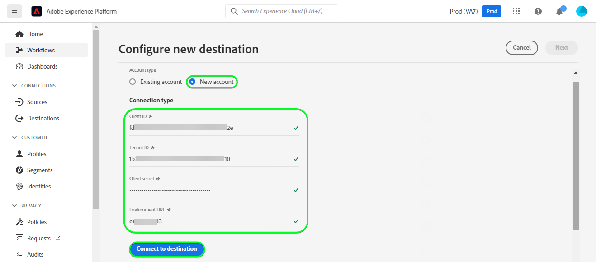

以下の必須のフィールドに入力します。詳しくは、[Dynamics 365 資格情報の収集](#gather-credentials)の節を参照してください。

* **[!UICONTROL Client ID]**: [!DNL Dynamics 365] アプリケーションの[!DNL Azure Active Directory] クライアント ID。
* **[!UICONTROL Tenant ID]**: [!DNL Dynamics 365] アプリケーションの[!DNL Azure Active Directory] テナント ID。
* **[!UICONTROL Client Secret]**: [!DNL Dynamics 365] アプリケーションの[!DNL Azure Active Directory] クライアント秘密鍵。
* **[!UICONTROL Region]**：お客様の[[!DNL Dynamics 365]](https://learn.microsoft.com/en-us/power-platform/admin/new-datacenter-regions)地域。 例：会社が北米（NAM）地域でプロビジョニングされている場合、URLは`crm.dynamics.com`になり、`crm`を選択する必要があります。 会社がカナダ （CAN） リージョンでプロビジョニングされている場合、URLは`crm3.dynamics.com`になり、`crm3`を選択する必要があります。
* **[!UICONTROL Environment URL]**: [!DNL Dynamics 365]環境のURL。

指定された詳細が有効な場合、UIには緑色のチェックマークが付いた&#x200B;**[!UICONTROL Connected]** ステータスが表示されます。 その後、次の手順に進むことができます。

### 宛先の詳細を入力 {#destination-details}

宛先の詳細を設定するには、以下の必須フィールドとオプションフィールドに入力します。UI のフィールドの横にアスタリスクが表示される場合は、そのフィールドが必須であることを示します。
宛先の詳細を示す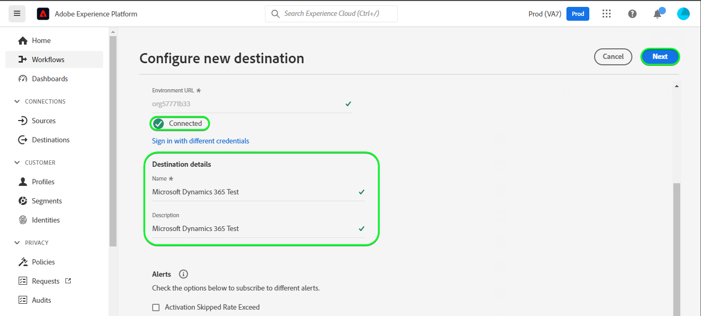

* **[!UICONTROL Name]**：今後この宛先を認識する際に使用する名前。
* **[!UICONTROL Description]**：今後この宛先を特定するのに役立つ説明です。
* **[!UICONTROL Customization Prefix]**: `Customization prefix`で作成したカスタムフィールドの[!DNL Dynamics 365]。 詳しくは、[&#x200B; ドキュメントの](https://learn.microsoft.com/en-us/dynamics365/customerengagement/on-premises/customize/create-edit-fields?view=op-9-1#create-and-edit-fields) フィールドの作成と編集[!DNL Dynamics 365] セクションを参照してください。

### アラートの有効化 {#enable-alerts}

アラートを有効にすると、宛先へのデータフローのステータスに関する通知を受け取ることができます。リストからアラートを選択して、データフローのステータスに関する通知を受け取るよう登録します。アラートについて詳しくは、[UI を使用した宛先アラートの購読](../../ui/alerts.md)についてのガイドを参照してください。

宛先接続の詳細の提供が完了したら、**[!UICONTROL Next]**&#x200B;を選択します。

## この宛先に対してオーディエンスをアクティブ化 {#activate}

>[!IMPORTANT]
>
>* データをアクティブ化するには、**[!UICONTROL View Destinations]**、**[!UICONTROL Activate Destinations]**、**[!UICONTROL View Profiles]**&#x200B;および&#x200B;**[!UICONTROL View Segments]** [&#x200B; アクセス制御権限](/help/access-control/home.md#permissions)が必要です。 [アクセス制御の概要](/help/access-control/ui/overview.md)を参照するか、製品管理者に問い合わせて必要な権限を取得してください。
>* *ID*&#x200B;をエクスポートするには、**[!UICONTROL View Identity Graph]** [&#x200B; アクセス制御権限](/help/access-control/home.md#permissions)が必要です。  {width="100" zoomable="yes"}

この宛先にオーディエンスをアクティベートする手順は、[ストリーミングオーディエンスの書き出し宛先へのプロファイルとオーディエンスのアクティベート](/help/destinations/ui/activate-segment-streaming-destinations.md)を参照してください。

### マッピングの考慮事項と例 {#mapping-considerations-example}

オーディエンスデータを[!DNL Adobe Experience Platform]から[!DNL Dynamics 365]宛先に正しく送信するには、フィールドマッピング手順を実行する必要があります。 マッピングでは、Experience Platform アカウントのExperience Data Model （XDM）スキーマフィールドと、ターゲット先の対応するスキーマフィールドとの間にリンクを作成します。 XDM フィールドを [!DNL Dynamics 365] 宛先フィールドに正しくマッピングするには、次の手順に従います。

1. **[!UICONTROL Mapping]** ステップで、**[!UICONTROL Add new mapping]**&#x200B;を選択します。 画面に新しいマッピング行が表示されます。
   

1. **[!UICONTROL Select source field]** ウィンドウで、**[!UICONTROL Select identity namespace]** カテゴリを選択し、`contactid`を選択します。
   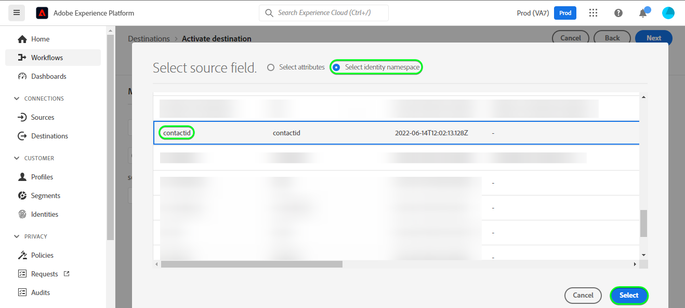

1. **[!UICONTROL Select target field]** ウィンドウで、ソースフィールドをマッピングするターゲットフィールドのタイプを選択します。
   * **[!UICONTROL Select identity namespace]**: ソースフィールドをリストからID名前空間にマッピングするには、このオプションを選択します。
     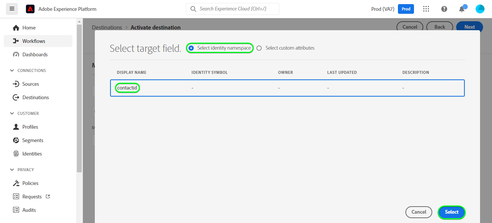

   * XDM プロファイルスキーマと[!DNL Dynamics 365] インスタンスの間に次のマッピングを追加します。

     | XDM プロファイルスキーマ | [!DNL Dynamics 365] インスタンス | 必須 |
     |---|---|---|
     | `contactid` | `contactid` | ○ |

   * **[!UICONTROL Select custom attributes]**: ソースフィールドを&#x200B;**[!UICONTROL Attribute name]** フィールドで定義したカスタム属性にマッピングするには、このオプションを選択します。 サポートされる属性の包括的なリストについては、[[!DNL Dynamics 365] ドキュメント](https://docs.microsoft.com/ja-jp/dynamics365/customerengagement/on-premises/developer/entities/contact?view=op-9-1#entity-properties)を参照してください。
     メールのTarget マッピングを示す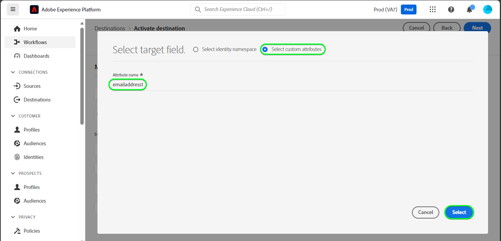

     >[!IMPORTANT]
     >
     > * ターゲットフィールド名は`lowercase`にする必要があります。
     > * さらに、[!DNL Dynamics 365] [日付またはタイムスタンプ &#x200B;](https://docs.microsoft.com/ja-jp/power-apps/developer/data-platform/webapi/reference/timestampdatemapping?view=dataverse-latest) ターゲットフィールドにマッピングされた日付またはタイムスタンプソースフィールドがある場合は、マッピングされた値が空でないことを確認してください。 書き出されたフィールド値が空の場合、*`Bad request reported while pushing events to the destination. Please contact the administrator and try again.`* エラーメッセージが表示され、データは更新されません。 （これは [!DNL Dynamics 365] の制限です。）

   * 例えば、更新する値に応じて、XDM プロファイルスキーマと[!DNL Dynamics 365] インスタンスの間に次のマッピングを追加します。

     | XDM プロファイルスキーマ | [!DNL Dynamics 365] インスタンス |
     |---|---|
     | `person.name.firstName` | `firstname` |
     | `person.name.lastName` | `lastname` |
     | `personalEmail.address` | `emailaddress1` |

   * これらのマッピングの使用例を次に示します。

   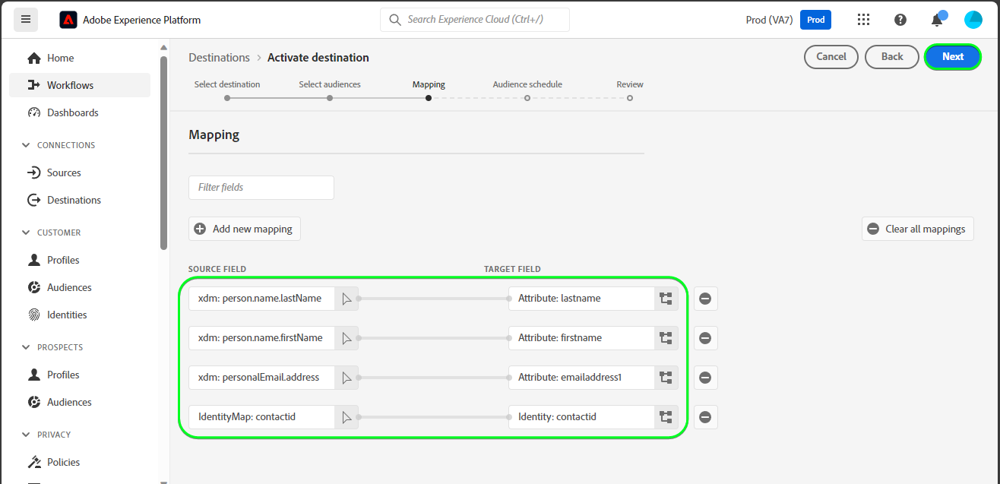

### オーディエンスの書き出しのスケジュールと例 {#schedule-audience-export-example}

アクティベーション ワークフローの[[!UICONTROL Schedule audience export]](/help/destinations/ui/activate-segment-streaming-destinations.md#scheduling) ステップでは、Experience Platform オーディエンスを[!DNL Dynamics 365]のカスタム フィールド属性に手動でマッピングする必要があります。

これを行うには、各オーディエンスを選択し、[!DNL Dynamics 365] フィールドに&#x200B;**[!UICONTROL Mapping ID]**&#x200B;から対応するカスタムフィールド属性を入力します。

>[!IMPORTANT]
>
>**[!UICONTROL Mapping ID]**&#x200B;に使用される値は、[!DNL Dynamics 365]内で作成されたカスタムフィールド属性の名前と完全に一致する必要があります。 カスタムフィールド属性を見つけるガイダンスが必要な場合は、[[!DNL Dynamics 365] ドキュメント](https://docs.microsoft.com/ja-jp/dynamics365/customerengagement/on-premises/customize/create-edit-fields?view=op-9-1) を参照してください。

例を次に示します。
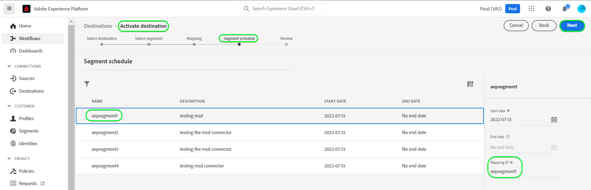

## データの書き出しを検証する {#exported-data}

宛先が正しく設定されていることを検証するには、次の手順に従います。

1. 宛先のリストに移動するには、**[!UICONTROL Destinations]** > **[!UICONTROL Browse]**&#x200B;を選択します。
   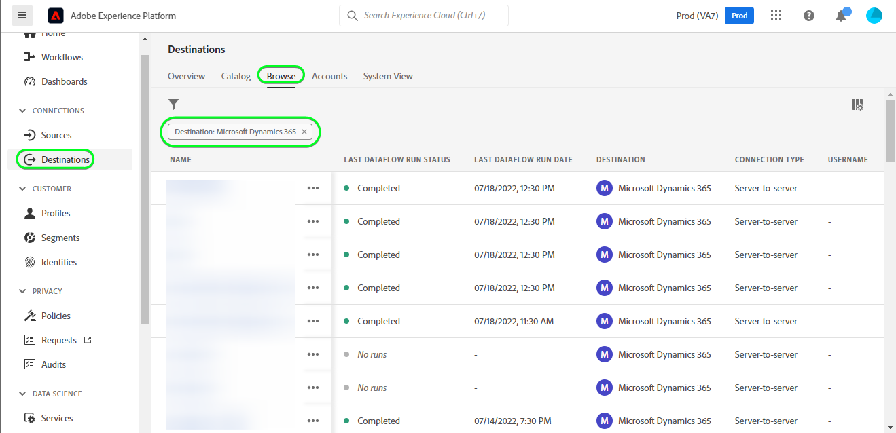

1. 宛先を選択し、ステータスが&#x200B;**[!UICONTROL enabled]**&#x200B;であることを検証します。
   宛先データフロー実行を示す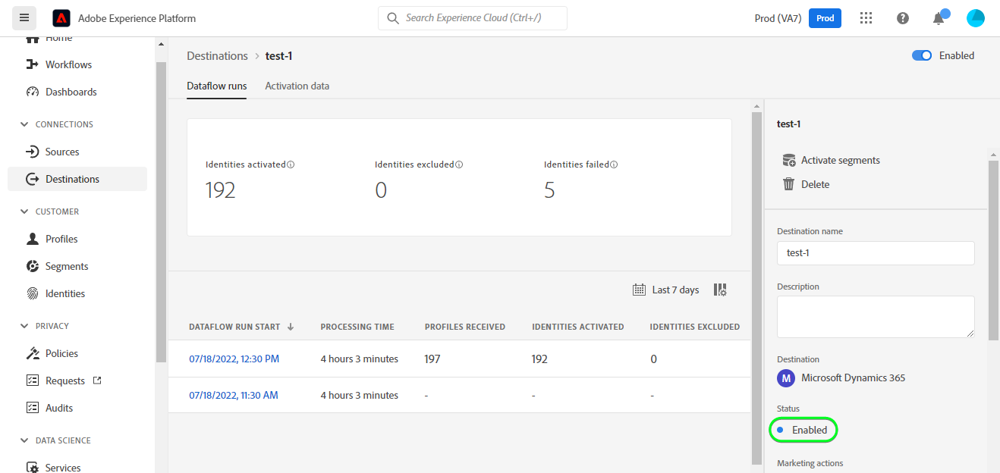

1. 「**[!DNL Activation data]**」タブに切り替えて、オーディエンス名を選択します。
   宛先アクティベーションデータを示す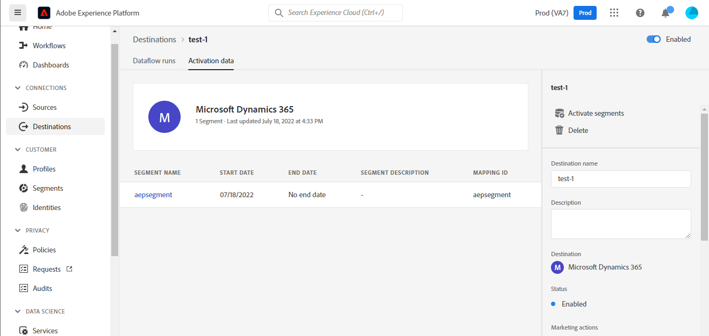

1. オーディエンスの概要を監視し、プロファイルの数がオーディエンス内で作成された数に対応していることを確認します。
   オーディエンスを示す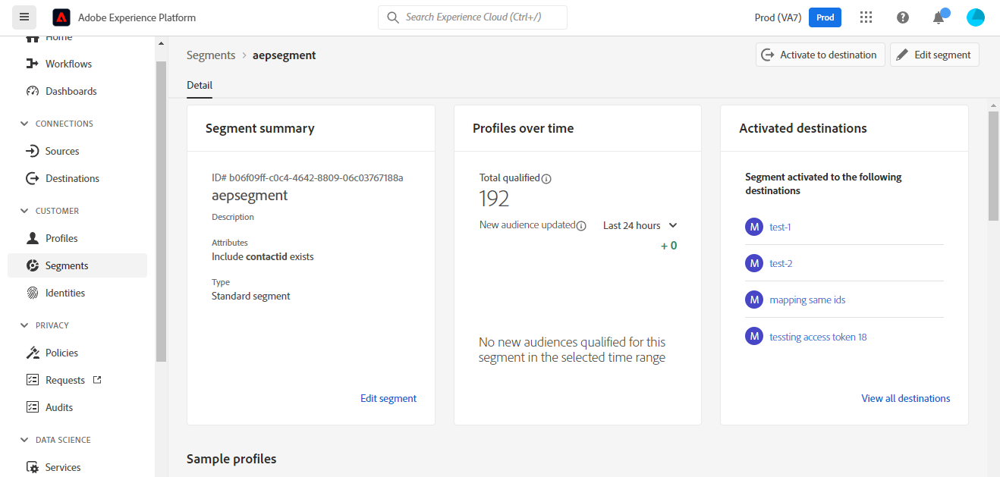

1. [!DNL Dynamics 365] web サイトにログインし、[!DNL Customers] > [!DNL Contacts] ページに移動して、オーディエンスのプロファイルが追加されているかどうかを確認します。 [!DNL Dynamics 365]の各オーディエンスステータスが、**[!UICONTROL Mapping ID]** オーディエンススケジュール [手順で指定した](#schedule-audience-export-example)値に基づいて、Experience Platformの対応するオーディエンスステータスで更新されていることがわかります。
   更新されたオーディエンスのステータスを含む連絡先ページを示す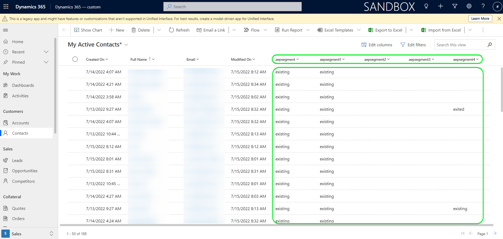

## データの使用とガバナンス {#data-usage-governance}

[!DNL Adobe Experience Platform] のすべての宛先は、データを処理する際のデータ使用ポリシーに準拠しています。[!DNL Adobe Experience Platform] がどのようにデータガバナンスを実施するかについて詳しくは、[データガバナンスの概要](/help/data-governance/home.md)を参照してください。

## エラーとトラブルシューティング {#errors-and-troubleshooting}

### イベントを宛先にプッシュする際に不明なエラーが発生しました {#unknown-errors}

データフローの実行を確認する際に、次のエラーメッセージが表示される場合。`Bad request reported while pushing events to the destination. Please contact the administrator and try again.`

不正なリクエストエラーを示す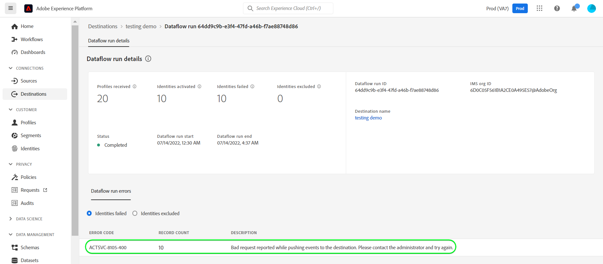

このエラーを修正するには、**[!UICONTROL Mapping ID]**&#x200B;で指定したExperience Platform オーディエンスの[!DNL Dynamics 365]が有効であり、[!DNL Dynamics 365]内に存在することを確認してください。

## その他のリソース {#additional-resources}

[[!DNL Dynamics 365]  ドキュメント](https://docs.microsoft.com/ja-jp/dynamics365/)からのその他の役に立つ情報は次のとおりです。

* [IOrganizationService.Update(Entity) メソッド](https://docs.microsoft.com/ja-jp/dotnet/api/microsoft.xrm.sdk.iorganizationservice.update?view=dataverse-sdk-latest)
* [Web API を使用したテーブル行の更新と削除](https://docs.microsoft.com/ja-jp/power-apps/developer/data-platform/webapi/update-delete-entities-using-web-api#basic-update)

### 変更ログ {#changelog}

この節では、この宛先コネクタに対する機能の概要と重要なドキュメントの更新について説明します。

+++ 変更ログを表示

| リリース月 | 更新タイプ | 説明 |
|---|---|---|
| 2023年10月 | ドキュメントの更新 | すべてのターゲット属性名を小文字にする必要があることを示すガイダンスが、[&#x200B; マッピングの考慮事項と例](#mapping-considerations-example)の手順で更新されました。 |
| 2023年8月 | 機能とドキュメントの更新 | [!DNL Dynamics 365]のデフォルトソリューション内で作成されなかったカスタムフィールドの[!DNL Dynamics 365] カスタムフィールド接頭辞のサポートを追加しました。 新しい入力フィールド **[!UICONTROL Customization Prefix]**&#x200B;が、[宛先の詳細を入力](#destination-details)手順で追加されました。 （PLATIR-31602）。 |
| 2022年11月 | 初回リリース | 最初の宛先リリースとドキュメントの公開。 |

{style="table-layout:auto"}

+++
