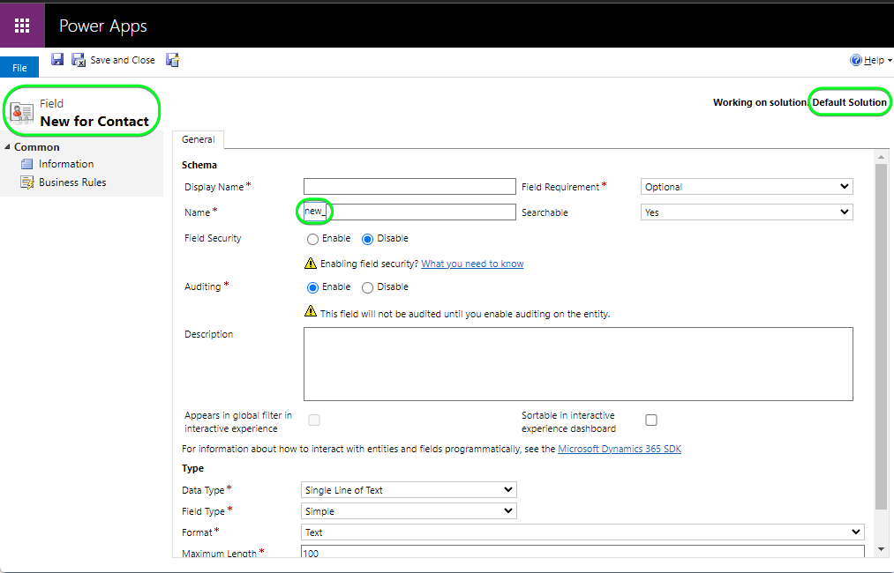
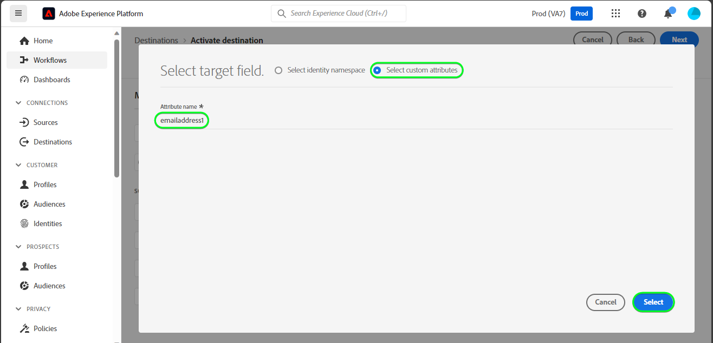
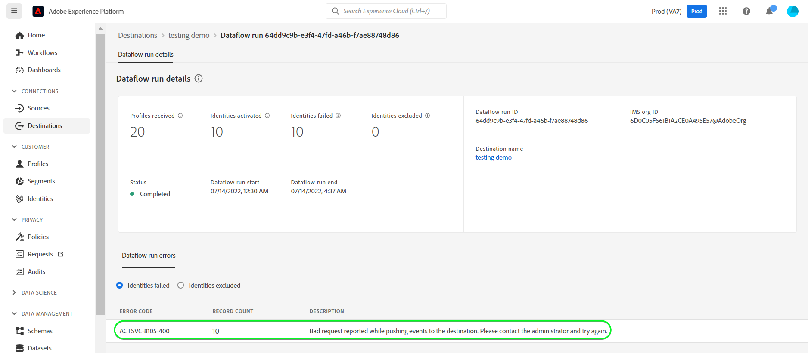

# [!DNL Microsoft Dynamics 365] 接続

## 概要 {#overview}

[[!DNL Microsoft Dynamics 365]](https://dynamics.microsoft.com/ja-jp/) は、クラウドベースのビジネスアプリケーションプラットフォームです。エンタープライズリソースプランニング（ERP）と顧客関係管理（CRM）を生産性アプリケーションと AI ツールと組み合わせて、エンドツーエンドのスムーズで制御可能な運用、優れた成長の可能性およびコスト削減を実現します。

この [!DNL Adobe Experience Platform][ 宛先 ](/help/destinations/home.md) は [[!DNL Contact Entity Reference API]](https://docs.microsoft.com/ja-jp/dynamics365/customerengagement/on-premises/developer/entities/contact?view=op-9-1) を利用しており、オーディエンス内の ID を [!DNL Dynamics 365] に更新できます。

[!DNL Dynamics 365] は、認証付与を使用する OAuth 2 を認証メカニズムとして使用して、[!DNL Contact Entity Reference API] と通信します。[!DNL Dynamics 365] インスタンスを認証する手順は、さらに下の[宛先に対する認証](#authenticate)の節にあります。

## ユースケース {#use-cases}

マーケターは、Adobe Experience Platform プロファイルの属性に基づいて、ユーザーにパーソナライズされたエクスペリエンスを提供できます。 オフラインデータからオーディエンスを作成し、それらのオーディエンスを [!DNL Dynamics 365] に送信して、Adobe Experience Platformでオーディエンスとプロファイルが更新されるとすぐにユーザーのフィードに表示することができます。

## 前提条件 {#prerequisites}

### Experience Platform の前提条件 {#prerequisites-in-experience-platform}

[!DNL Dynamics 365] の宛先へのデータをアクティブ化する前に、[ スキーマ ](/help/xdm/schema/composition.md)、[ データセット ](https://experienceleague.adobe.com/docs/platform-learn/tutorials/data-ingestion/create-datasets-and-ingest-data.html) および [ オーディエンス ](https://experienceleague.adobe.com/docs/platform-learn/tutorials/audiences/create-audiences.html) を [!DNL Experience Platform] で作成する必要があります。

オーディエンスのステータスに関するガイダンスが必要な場合は、[ オーディエンスメンバーシップの詳細スキーマフィールドグループ ](/help/xdm/field-groups/profile/segmentation.md) に関するAdobeのドキュメントを参照してください。

### [!DNL Microsoft Dynamics 365] 前提条件 {#prerequisites-destination}

Experience Platformから [!DNL Dynamics 365] アカウントにデータを書き出すには、[!DNL Dynamics 365] で次の前提条件に注意してください。

#### [!DNL Microsoft Dynamics 365] アカウントが必要です {#prerequisites-account}

アカウントをまだお持ちでない場合は、[!DNL Dynamics 365] [体験版](https://dynamics.microsoft.com/ja-jp/dynamics-365-free-trial/)ページに移動し、アカウントを登録して作成してください。

#### [!DNL Dynamics 365] 内にフィールドを作成 {#prerequisites-custom-field}

Experience Platformが [!DNL Dynamics 365] 内のオーディエンスステータスの更新に使用する `Single Line of Text` のフィールドデータタイプを使用して、タイプ `Simple` のカスタムフィールドを作成します。

追加のガイダンスが必要な場合は、[!DNL Dynamics 365][ フィールド（属性）の作成または編集） ](https://docs.microsoft.com/ja-jp/dynamics365/customerengagement/on-premises/customize/create-edit-fields?view=op-9-1) ドキュメントを参照してください。

[!DNL Dynamics 365] で作成するカスタムフィールドの **[!UICONTROL Customization prefix]** を書き留めます。 [ 宛先の詳細の入力 ](#destination-details) 手順で、このプレフィックスが必要になります。 詳しくは、[!DNL Dynamics 365] ドキュメントの [ フィールドの作成と編集 ](https://learn.microsoft.com/en-us/dynamics365/customerengagement/on-premises/customize/create-edit-fields?view=op-9-1#create-and-edit-fields) の節を参照してください。

[!DNL Dynamics 365] 内の設定例を次に示します。

#### Azure Active Directory 内でのアプリケーションとアプリケーションユーザーの登録 {#prerequisites-app-user}

[!DNL Dynamics 365] をリソースにアクセスできるようにするには、[!DNL Azure Account] を使用して [[!DNL Azure Active Directory]](https://docs.microsoft.com/ja-jp/azure/active-directory/develop/howto-create-service-principal-portal#register-an-application-with-azure-ad-and-create-a-service-principal) にログインし、以下を作成する必要があります。
* [!DNL Azure Active Directory] アプリケーション
* サービスプリンシパル
* アプリケーション秘密鍵

また、[!DNL Azure Active Directory] で[アプリケーションユーザーを作成](https://docs.microsoft.com/ja-jp/power-platform/admin/manage-application-users#create-an-application-user)し、新しく作成したアプリケーションに関連付ける必要があります。

#### [!DNL Dynamics 365] 資格情報の収集 {#gather-credentials}

[!DNL Dynamics 365] CRM 宛先に対して認証を行う前に、以下の項目をメモしておきます。

| 資格情報 | 説明 | 例 |
| --- | --- | --- |
| `Client ID` | お使いの [!DNL Azure Active Directory] アプリケーションの [!DNL Dynamics 365] クライアント ID。詳しくは、[[!DNL Dynamics 365] ドキュメント](https://docs.microsoft.com/ja-jp/azure/active-directory/develop/howto-create-service-principal-portal#get-tenant-and-app-id-values-for-signing-in)を参照してください。 | `ababbaba-abab-baba-acac-acacacacacac` |
| `Client Secret` | お使いの [!DNL Azure Active Directory] アプリケーションの [!DNL Dynamics 365] クライアント秘密鍵。[[!DNL Dynamics 365] ドキュメント](https://docs.microsoft.com/ja-jp/azure/active-directory/develop/howto-create-service-principal-portal#authentication-two-options)内のオプション #2 を使用することになります。 | 説明のための `abcde~abcdefghijklmnopqrstuvwxyz12345678`。 |
| `Tenant ID` | お使いの [!DNL Azure Active Directory] アプリケーションの [!DNL Dynamics 365] テナント ID。詳しくは、[[!DNL Dynamics 365] ドキュメント](https://docs.microsoft.com/ja-jp/azure/active-directory/develop/howto-create-service-principal-portal#get-tenant-and-app-id-values-for-signing-in)を参照してください。 | `1234567-aaaa-12ab-ba21-1234567890` |
| `Region` | 環境 URL に関連付けられたMicrosoft地域。  詳しくは、[[!DNL Dynamics 365]  ドキュメント ](https://learn.microsoft.com/en-us/power-platform/admin/new-datacenter-regions) を参照してください。 | お使いのドメインが以下のようになっている場合、[ 宛先 ](#authenticate).  への認証時に、ドロップダウンセレクターの CRM フィールドのハイライト表示された値を指定する必要があります *org57771b33。`crm`.dynamics.com*  例：会社が北米（NAM）地域でプロビジョニングされている場合、URL は `crm.dynamics.com` になり、`crm` を選択する必要があります。 会社がカナダ（CAN）地域でプロビジョニングされている場合、URL は `crm3.dynamics.com` になり、`crm3` を選択する必要があります。 |
| `Environment URL` | 詳しくは、[[!DNL Dynamics 365] ドキュメント](https://docs.microsoft.com/ja-jp/dynamics365/customerengagement/on-premises/developer/org-service/discover-url-organization-organization-service?view=op-9-1)を参照してください。 | お使いの [!DNL Dynamics 365] ドメインが以下のようになっている場合は、ハイライト表示された値が必要です。  *`org57771b33`.crm.dynamics.com* |

{style="table-layout:auto"}

## ガードレール {#guardrails}

[リクエストの制限と割り当て](https://docs.microsoft.com/ja-jp/power-platform/admin/api-request-limits-allocations)ページでは、[!DNL Dynamics 365] ライセンスに関連する [!DNL Dynamics 365] API 制限を詳細に説明しています。データとペイロードがこれらの制約内にあることを確認する必要があります。

## サポートされる ID {#supported-identities}

[!DNL Dynamics 365] では、以下の表で説明する ID の更新をサポートしています。[ID](/help/identity-service/features/namespaces.md) についての詳細情報。

| ターゲット ID | 例 | 説明 | 注意点 |
|---|---|---|---|
| `contactid` | 77eb682f1-ca75-e511-80d4-00155d2a68d1 | 連絡先の一意の ID。 | **必須**。詳しくは、[[!DNL Dynamics 365] ドキュメント](https://docs.microsoft.com/ja-jp/dynamics365/customerengagement/on-premises/developer/entities/contact?view=op-9-1)を参照してください。 |

{style="table-layout:auto"}

## サポートされるオーディエンス {#supported-audiences}

この節では、この宛先に書き出しできるすべてのオーディエンスについて説明します。

この宛先では、Experience Platform の[セグメント化サービス](../../../segmentation/home.md)で生成したすべてのオーディエンスのアクティブ化をサポートします。

## 書き出しのタイプと頻度 {#export-type-frequency}

宛先の書き出しのタイプと頻度について詳しくは、以下の表を参照してください。

| 項目 | タイプ | メモ |
---------|----------|---------|
| 書き出しタイプ | **[!UICONTROL プロファイルベース]** | <ul><li>フィールドマッピングに従って、目的のスキーマフィールド *（例：メールアドレス、電話番号、姓）* と共に、オーディエンスのすべてのメンバーを書き出します。</li><li> [!DNL Dynamics 365] の各オーディエンスステータスは、[ オーディエンススケジュール ](#schedule-audience-export-example) 手順で提供された **[!UICONTROL マッピング ID]** 値に基づいて、Experience Platformの対応するオーディエンスステータスとともに更新されます。</li></ul> |
| 書き出し頻度 | **[!UICONTROL ストリーミング]** | <ul><li>ストリーミングの宛先は常に、API ベースの接続です。オーディエンス評価に基づいて Experience Platform 内でプロファイルが更新されるとすぐに、コネクタは更新を宛先プラットフォームに送信します。詳しくは、[ストリーミングの宛先](/help/destinations/destination-types.md#streaming-destinations)を参照してください。</li></ul> |

{style="table-layout:auto"}

## 宛先への接続 {#connect}

>[!IMPORTANT]
>
>宛先に接続するには、**[!UICONTROL 宛先の表示]** および **[!UICONTROL 宛先の管理]**[ アクセス制御権限 ](/help/access-control/home.md#permissions) が必要です。 詳しくは、[アクセス制御の概要](/help/access-control/ui/overview.md)または製品管理者に問い合わせて、必要な権限を取得してください。

この宛先に接続するには、[宛先設定のチュートリアル](../../ui/connect-destination.md)の手順に従ってください。宛先の設定ワークフローで、以下の 2 つのセクションにリストされているフィールドに入力します。

**[!UICONTROL 宛先]**／**[!UICONTROL カタログ]**&#x200B;内で [!DNL Dynamics 365] を検索します。または、**[!UICONTROL CRM]** カテゴリの下に配置することもできます。

### 宛先に対する認証 {#authenticate}

宛先を認証するには、「 **[!UICONTROL 宛先に接続]**」を選択します。

以下の必須のフィールドに入力します。詳しくは、[Dynamics 365 資格情報の収集](#gather-credentials)の節を参照してください。
* **[!UICONTROL クライアント ID]**：お使いの [!DNL Azure Active Directory] アプリケーションの [!DNL Dynamics 365] クライアント ID 。
* **[!UICONTROL テナント ID]**：お使いの [!DNL Azure Active Directory] アプリケーションの [!DNL Dynamics 365] テナント ID 。
* **[!UICONTROL クライアント秘密鍵]**：お使いの [!DNL Azure Active Directory] アプリケーションの [!DNL Dynamics 365] クライアント秘密鍵。
* **[!UICONTROL 地域]**:[[!DNL Dynamics 365]](https://learn.microsoft.com/en-us/power-platform/admin/new-datacenter-regions) の地域。 例えば、会社が北米（NAM）地域にプロビジョニングされている場合、URL は `crm.dynamics.com` になり、`crm` を選択する必要があります。 会社がカナダ（CAN）地域でプロビジョニングされている場合、URL は `crm3.dynamics.com` になり、`crm3` を選択する必要があります。
* **[!UICONTROL 環境 URL]**：お使いの [!DNL Dynamics 365] 環境 URL。

指定した詳細が有効な場合、UI で&#x200B;**[!UICONTROL 接続済み]**&#x200B;ステータスに緑色のチェックマークが付きます。その後、次の手順に進むことができます。

### 宛先の詳細を入力 {#destination-details}

宛先の詳細を設定するには、以下の必須フィールドとオプションフィールドに入力します。UI のフィールドの横にアスタリスクが表示される場合は、そのフィールドが必須であることを示します。

* **[!UICONTROL 名前]**：今後この宛先を認識するための名前。
* **[!UICONTROL 説明]**：今後この宛先を識別するのに役立つ説明。
* **[!UICONTROL Customization Prefix]**:[!DNL Dynamics 365] で作成したカスタムフィールドの `Customization prefix`。 詳しくは、[!DNL Dynamics 365] ドキュメントの [ フィールドの作成と編集 ](https://learn.microsoft.com/en-us/dynamics365/customerengagement/on-premises/customize/create-edit-fields?view=op-9-1#create-and-edit-fields) の節を参照してください。

### アラートの有効化 {#enable-alerts}

アラートを有効にすると、宛先へのデータフローのステータスに関する通知を受け取ることができます。リストからアラートを選択して、データフローのステータスに関する通知を受け取るよう登録します。アラートについて詳しくは、[UI を使用した宛先アラートの購読](../../ui/alerts.md)についてのガイドを参照してください。

宛先接続の詳細の入力を終えたら「**[!UICONTROL 次へ]**」を選択します。

## この宛先に対してオーディエンスをアクティブ化 {#activate}

>[!IMPORTANT]
> 
>* データをアクティブ化するには、**[!UICONTROL 宛先の表示]**、**[!UICONTROL 宛先のアクティブ化]**、**[!UICONTROL プロファイルの表示]** および **[!UICONTROL セグメントの表示]**[ アクセス制御権限 ](/help/access-control/home.md#permissions) が必要です。 [アクセス制御の概要](/help/access-control/ui/overview.md)を参照するか、製品管理者に問い合わせて必要な権限を取得してください。
>* *ID* を書き出すには、**[!UICONTROL ID グラフの表示]**[ アクセス制御権限 ](/help/access-control/home.md#permissions) が必要です。  {width="100" zoomable="yes"}

この宛先にオーディエンスをアクティベートする手順は、[ストリーミングオーディエンスの書き出し宛先へのプロファイルとオーディエンスのアクティベート](/help/destinations/ui/activate-segment-streaming-destinations.md)を参照してください。

### マッピングの考慮事項と例 {#mapping-considerations-example}

Adobe Experience Platform から [!DNL Dynamics 365] 宛先にオーディエンスデータを正しく送信するには、フィールドマッピングの手順を実行する必要があります。マッピングは、Experience Platform アカウント内の Experience Data Model （XDM）スキーマフィールドと、ターゲット宛先から対応する同等のスキーマフィールドとの間にリンクを作成して構成されます。 XDM フィールドを [!DNL Dynamics 365] 宛先フィールドに正しくマッピングするには、次の手順に従います。

1. **[!UICONTROL マッピング]**&#x200B;手順で、「**[!UICONTROL 新しいマッピングを追加]**」を選択します。画面に新しいマッピング行が表示されます。
   

1. **[!UICONTROL ソースフィールドを選択]**&#x200B;ウィンドウで、「**[!UICONTROL ID 名前空間カテゴリを選択]**」を選択します。`contactid`
   

1. **[!UICONTROL ターゲットフィールドを選択]**&#x200B;ウィンドウで、ソースフィールドにマッピングするターゲットフィールドのタイプを選択します。
   * **[!UICONTROL ID 名前空間を選択]**：このオプションを選択して、ソースフィールドをリストから ID 名前空間にマッピングします。
      のターゲットマッピングを示すExperience Platform UI のスクリーンショット

   * XDM プロファイルスキーマと [!DNL Dynamics 365] インスタンスの間に次のマッピングを追加します。

     | XDM プロファイルスキーマ | [!DNL Dynamics 365] Instance | 必須 |
     |---|---|---|
     | `contactid` | `contactid` | ○ |

   * **[!UICONTROL カスタム属性を選択]**：このオプションを選択して、「**[!UICONTROL 属性名]**」フィールドに定義するカスタム属性にマッピングするソースフィールドを選択します。サポートされる属性の包括的なリストについては、[[!DNL Dynamics 365] ドキュメント](https://docs.microsoft.com/ja-jp/dynamics365/customerengagement/on-premises/developer/entities/contact?view=op-9-1#entity-properties)を参照してください。
     

     >[!IMPORTANT]
     >
     > * ターゲットフィールド名は `lowercase` にする必要があります。
     > * さらに、[!DNL Dynamics 365] [ 日付またはタイムスタンプ ](https://docs.microsoft.com/ja-jp/power-apps/developer/data-platform/webapi/reference/timestampdatemapping?view=dataverse-latest) ターゲットフィールドでマッピングされた日付またはタイムスタンプのソースフィールドがある場合、マッピングされた値が空でないことを確認します。 書き出されたフィールドの値が空の場合、*`Bad request reported while pushing events to the destination. Please contact the administrator and try again.`* のエラーメッセージが表示され、データは更新されません。 （これは [!DNL Dynamics 365] の制限です。）

   * 例えば、更新する値に応じて、XDM プロファイルスキーマと [!DNL Dynamics 365] インスタンスの間に次のようなマッピングを追加します。

     | XDM プロファイルスキーマ | [!DNL Dynamics 365] Instance |
     |---|---|
     | `person.name.firstName` | `firstname` |
     | `person.name.lastName` | `lastname` |
     | `personalEmail.address` | `emailaddress1` |

   * これらのマッピングの使用例を次に示します。

   

### オーディエンスの書き出しのスケジュールと例 {#schedule-audience-export-example}

アクティベーションワークフローの [[!UICONTROL  オーディエンスの書き出しをスケジュール ]](/help/destinations/ui/activate-segment-streaming-destinations.md#scheduling) 手順では、Experience Platform オーディエンスを [!DNL Dynamics 365] のカスタムフィールド属性に手動でマッピングする必要があります。

これを行うには、各オーディエンスを選択し、対応するカスタムフィールド属性を [!DNL Dynamics 365] から **[!UICONTROL マッピング ID]** フィールドに入力します。

>[!IMPORTANT]
>
>**[!UICONTROL マッピング ID]** に使用する値は、[!DNL Dynamics 365] 内で作成されたカスタムフィールド属性の名前と正確に一致している必要があります。カスタムフィールド属性を見つけるガイダンスが必要な場合は、[[!DNL Dynamics 365] ドキュメント](https://docs.microsoft.com/ja-jp/dynamics365/customerengagement/on-premises/customize/create-edit-fields?view=op-9-1) を参照してください。

次に例を示します。

## データの書き出しを検証する {#exported-data}

宛先が正しく設定されていることを検証するには、次の手順に従います。

1. **[!UICONTROL 宛先]**／**[!UICONTROL 参照]** を選択して、宛先のリストに移動します。
   

1. 宛先を選択し、ステータスが「 **[!UICONTROL 有効]**」であることを確認します。
   

1. 「**[!DNL Activation data]**」タブに切り替えて、オーディエンス名を選択します。
   

1. オーディエンスの概要を監視し、プロファイルの数がオーディエンス内で作成された数と一致していることを確認します。
   

1. [!DNL Dynamics 365] web サイトににログインして、[!DNL Customers] / [!DNL Contacts] ページに移動し、オーディエンスのプロファイルが追加されたかどうかを確認します。 [!DNL Dynamics 365] の各オーディエンスステータスが、[ オーディエンスのスケジュール設定 ](#schedule-audience-export-example) 手順で提供された **[!UICONTROL マッピング ID]** 値に基づいて、Experience Platformの対応するオーディエンスステータスで更新されたことがわかります。
   

## データの使用とガバナンス {#data-usage-governance}

[!DNL Adobe Experience Platform] のすべての宛先は、データを処理する際のデータ使用ポリシーに準拠しています。[!DNL Adobe Experience Platform] がどのようにデータガバナンスを実施するかについて詳しくは、[データガバナンスの概要](/help/data-governance/home.md)を参照してください。

## エラーとトラブルシューティング {#errors-and-troubleshooting}

### イベントを宛先にプッシュする際に不明なエラーが発生しました {#unknown-errors}

データフローの実行を確認する際に、次のエラーメッセージが表示される場合。`Bad request reported while pushing events to the destination. Please contact the administrator and try again.`

このエラーを修正するには、[!DNL Dynamics 365] で指定したExperience Platform オーディエンスの **[!UICONTROL マッピング ID]** が有効であり、[!DNL Dynamics 365] 内に存在することを確認します。

## その他のリソース {#additional-resources}

[[!DNL Dynamics 365]  ドキュメント](https://docs.microsoft.com/ja-jp/dynamics365/)からのその他の役に立つ情報は次のとおりです。
* [IOrganizationService.Update(Entity) メソッド](https://docs.microsoft.com/ja-jp/dotnet/api/microsoft.xrm.sdk.iorganizationservice.update?view=dataverse-sdk-latest)
* [Web API を使用したテーブル行の更新と削除](https://docs.microsoft.com/ja-jp/power-apps/developer/data-platform/webapi/update-delete-entities-using-web-api#basic-update)

### 変更ログ

この節では、この宛先コネクタに対する機能の概要と重要なドキュメントの更新について説明します。

+++ 変更ログを表示

| リリース月 | 更新タイプ | 説明 |
|---|---|---|
| 2023年10月 | ドキュメントの更新 | [ マッピングに関する考慮事項と例 ](#mapping-considerations-example) の手順で、すべてのターゲット属性名を小文字にする必要があることを示すガイダンスを更新しました。 |
| 2023年8月 | 機能とドキュメントの更新 | [!DNL Dynamics 365] のデフォルトソリューション内 [!DNL Dynamics 365] 作成されなかったカスタムフィールドのカスタムフィールドプレフィックスに対するサポートを追加しました。 **[!UICONTROL 宛先の詳細の入力]** 手順に、新しい入力フィールド [Customization Prefix](#destination-details) が追加されました。 （PLATIR-31602）。 |
| 2022 年 11 月 | 初回リリース | 宛先の初回リリースとドキュメントの公開。 |

{style="table-layout:auto"}

+++