# [!DNL Outreach] 接続

## 概要 {#overview}

[[!DNL Outreach]](https://www.outreach.io/) は、世界で最も B2B のバイヤーとセラーのインタラクションデータを扱う Sales Execution Platform で、販売データをインテリジェンスに変換するための独自の AI テクノロジーへの大量の投資を行っています。[!DNL Outreach] は、組織がセールスエンゲージメントを自動化、収益インテリジェンスに基づいて行動し、効率、予測可能性、成長を向上させるのに役立ちます。

この[!DNL Adobe Experience Platform] [宛先](/help/destinations/home.md)は、[&#x200B; アウトリーチ更新リソース API](https://api.outreach.io/api/v2/docs#update-an-existing-resource)を活用して、[!DNL Outreach]の見込み客に対応するオーディエンス内のIDを更新します。

[!DNL Outreach]は、[!DNL Outreach] [!DNL Update Resource API]と通信するための認証メカニズムとして、承認付与を含むOAuth 2を使用しています。 [!DNL Outreach] インスタンスに対する認証手順は、[宛先に対する認証](#authenticate) セクション内で、さらに下にあります。

## ユースケース {#use-cases}

マーケターは、見込み客の[!DNL Adobe Experience Platform] プロファイルの属性に基づいて、パーソナライズされたエクスペリエンスを見込み客に配信できます。 オフラインデータからオーディエンスを作成し、これらのオーディエンスを[!DNL Outreach]に送信すると、[!DNL Adobe Experience Platform]でオーディエンスとプロファイルが更新されるとすぐに、見込み客のフィードに表示されます。

## 前提条件 {#prerequisites}

### Experience Platform の前提条件 {#prerequisites-in-experience-platform}

[!DNL Outreach] 宛先へのデータをアクティブ化する前に、[スキーマ](/help/xdm/schema/composition.md)、[データセット](https://experienceleague.adobe.com/docs/platform-learn/tutorials/data-ingestion/create-datasets-and-ingest-data.html)および[セグメント](https://experienceleague.adobe.com/docs/platform-learn/tutorials/segments/create-segments.html)を [!DNL Experience Platform] で作成する必要があります。

オーディエンスのステータスに関するガイダンスが必要な場合は、[&#x200B; オーディエンスメンバーシップの詳細スキーマフィールドグループ &#x200B;](/help/xdm/field-groups/profile/segmentation.md)に関するAdobeのドキュメントを参照してください。

### アウトリーチの前提条件 {#prerequisites-destination}

Experience Platformから[!DNL Outreach] アカウントにデータをエクスポートするには、[!DNL Outreach]の次の前提条件に注意してください。

#### Outreach アカウントも必要です {#prerequisites-account}

アカウントを既にお持ちでない場合は、[!DNL Outreach] [&#x200B; ログイン &#x200B;](https://accounts.outreach.io/users/sign_in) ページに移動して、アカウントを登録および作成します。 詳細については、[!DNL Outreach] サポート [&#x200B; ページ &#x200B;](https://support.outreach.io/hc/en-us/articles/207238607-Claim-Your-Outreach-Account)も参照してください。

[!DNL Outreach] CRM 宛先に対して認証を行う前に、以下の項目をメモしておきます。

| 資格情報 | 説明 |
|---|---|
| メール | [!DNL Outreach] アカウントの電子メール |
| パスワード | [!DNL Outreach] アカウントのパスワード |

#### カスタムフィールドラベルの設定 {#prerequisites-custom-fields}

[!DNL Outreach]は、[見込客](https://support.outreach.io/hc/en-us/articles/360001557554-Outreach-Prospect-Profile-Overview)のカスタムフィールドをサポートしています。 追加のガイダンスについては、[Outreach](https://support.outreach.io/hc/en-us/articles/219124908-How-To-Add-a-Custom-Field-in-Outreach)でカスタムフィールドを追加する方法を参照してください。 識別しやすいように、デフォルトを維持する代わりに、対応するオーディエンス名にラベルを手動で更新することをお勧めします。 例えば、次のように指定します。

カスタムフィールドを表示する見込客の[!DNL Outreach]設定ページ。
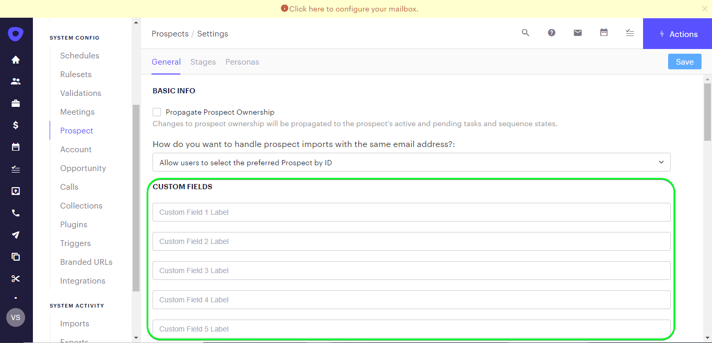

オーディエンス名に一致する[!DNL Outreach] ユーザーに適した&#x200B;*ラベルのカスタムフィールドを表示する見込み顧客の*設定ページ。 これらのラベルに対する見込み客ページのオーディエンスステータスを表示できます。
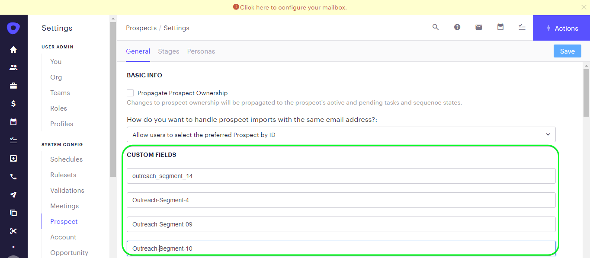

>[!NOTE]
>
> ラベル名は識別を容易にするためだけに使用します。 見込み客を更新する際には使用されません。

## ガードレール {#guardrails}

[!DNL Outreach] APIのレート制限は、1 ユーザーあたり1時間あたり10,000 リクエストです。 この制限に達すると、次のメッセージを含む`429`応答が返されます：`You have exceeded your permitted rate limit of 10,000; please try again at 2017-01-01T00:00:00.`。

このメッセージを受け取った場合は、レートしきい値に従ってオーディエンス書き出しスケジュールを更新する必要があります。

詳細については、[[!DNL Outreach]  ドキュメント &#x200B;](https://api.outreach.io/api/v2/docs#rate-limiting)を参照してください。

## サポートされる ID {#supported-identities}

[!DNL Outreach] では、以下の表で説明する ID の更新をサポートしています。[ID](/help/identity-service/features/namespaces.md) についての詳細情報。

| ターゲット ID | 説明 | 注意点 |
|---|---|---|
| `OutreachId` | <ul><li>[!DNL Outreach]識別子。 これは、見込み客プロファイルに対応する数値です。</li><li>IDは、更新される見込み客の[!DNL Outreach] URL内のIDと一致する必要があります。</li><li>詳しくは、[[!DNL Outreach] ドキュメント](https://api.outreach.io/api/v2/docs#update-an-existing-resource)を参照してください。</li></ul> | 必須 |

## サポートされるオーディエンス {#supported-audiences}

この節では、この宛先に書き出すことができるオーディエンスのタイプについて説明します。

| オーディエンスの由来 | サポートあり | 説明 |
|---------|----------|----------|
| [!DNL Segmentation Service] | ○ | Experience Platform [&#x200B; セグメント化サービス &#x200B;](../../../segmentation/home.md)を通じて生成されたオーディエンス。 |
| その他すべてのオーディエンスの生成元 | × | このカテゴリには、[!DNL Segmentation Service]を通じて生成されたオーディエンス以外のすべてのオーディエンスのオリジンが含まれます。 [様々なオーディエンスの起源](/help/segmentation/ui/audience-portal.md#customize)について読みます。 次に例を示します。 <ul><li> カスタムアップロードオーディエンス [がCSV ファイルからExperience Platformに](../../../segmentation/ui/audience-portal.md#import-audience)をインポートしました。</li><li> 類似オーディエンス， </li><li> 連合オーディエンス， </li><li> [!DNL Adobe Journey Optimizer]などの他のExperience Platform アプリで生成されたオーディエンス </li><li> その他。 </li></ul> |

{style="table-layout:auto"}

オーディエンスのデータタイプ別にサポートされるオーディエンス：

| オーディエンスのデータタイプ | サポートあり | 説明 | ユースケース |
|--------------------|-----------|-------------|-----------|
| [人物オーディエンス &#x200B;](/help/segmentation/types/people-audiences.md) | ○ | 顧客プロファイルにもとづいて、マーケティング施策の特定のグループをターゲットにすることができます。 | 買い物客やカートの放棄が多い |
| [&#x200B; アカウントオーディエンス &#x200B;](/help/segmentation/types/account-audiences.md) | × | アカウントベースドマーケティング戦略のために、特定の組織内の個人をターゲットにします。 | B2B マーケティング |
| [見込みオーディエンス &#x200B;](/help/segmentation/types/prospect-audiences.md) | × | まだ顧客ではないが、ターゲットオーディエンスと特徴を共有する個人をターゲットにします。 | サードパーティデータによる見込み顧客の開拓 |
| [&#x200B; データセットの書き出し](/help/catalog/datasets/overview.md) | × | [!DNL Adobe Experience Platform] データ レイクに保存されている構造化データのコレクション。 | レポート，データサイエンスワークフロー |

{style="table-layout:auto"}

## 書き出しのタイプと頻度 {#export-type-frequency}

宛先の書き出しタイプと頻度については、次の表を参照してください。

| 項目 | タイプ | メモ |
|---------|----------|---------|
| 書き出しタイプ | **[!UICONTROL Profile-based]** | <ul><li> セグメントのすべてのメンバーを、フィールドマッピングに従って、必要なスキーマフィールドと共に書き出します&#x200B;*（例：メールアドレス、電話番号、姓）*。</li><li> [!DNL Outreach]の各セグメントステータスは、[!UICONTROL Mapping ID] オーディエンススケジュール [手順で指定した](#schedule-segment-export-example)値に基づいて、Experience Platformからの対応するオーディエンスステータスで更新されます。</li></ul> |
| 書き出し頻度 | **[!UICONTROL Streaming]** | <ul><li> ストリーミングの宛先は常に、API ベースの接続です。オーディエンス評価に基づいて Experience Platform 内でプロファイルが更新されるとすぐに、コネクタは更新を宛先プラットフォームに送信します。詳しくは、[ストリーミングの宛先](/help/destinations/destination-types.md#streaming-destinations)を参照してください。</li></ul> |

{style="table-layout:auto"}

## 宛先への接続 {#connect}

>[!IMPORTANT]
>
> 宛先に接続するには、**[!UICONTROL Manage Destinations]** [&#x200B; アクセス制御権限](/help/access-control/home.md#permissions)が必要です。 詳しくは、[アクセス制御の概要](/help/access-control/ui/overview.md)または製品管理者に問い合わせて、必要な権限を取得してください。

この宛先に接続するには、[宛先設定のチュートリアル](../../ui/connect-destination.md)の手順に従ってください。宛先の設定ワークフローで、以下の 2 つのセクションにリストされているフィールドに入力します。

**[!UICONTROL Destinations]** > **[!UICONTROL Catalog]**&#x200B;内で[!DNL Outreach]を検索します。 または、CRM カテゴリの下に配置することもできます。

### 宛先に対する認証 {#authenticate}

宛先に対する認証を行うには、**[!UICONTROL Connect to destination]**&#x200B;を選択します。

Outreachへの認証方法を示す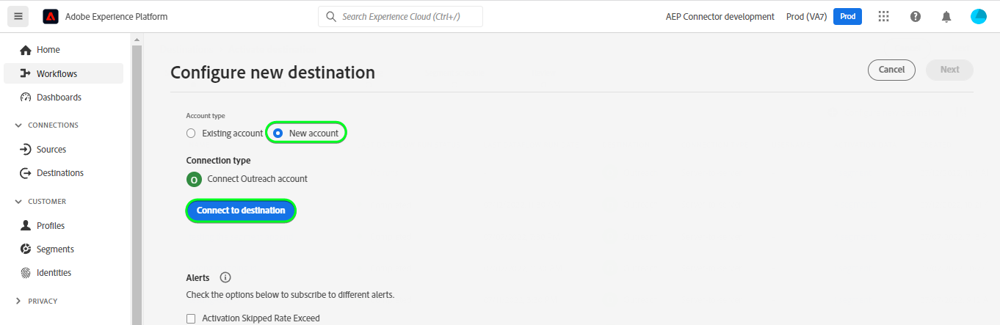

[!DNL Outreach] ログインページが表示されます。 メールアドレスを入力してください。

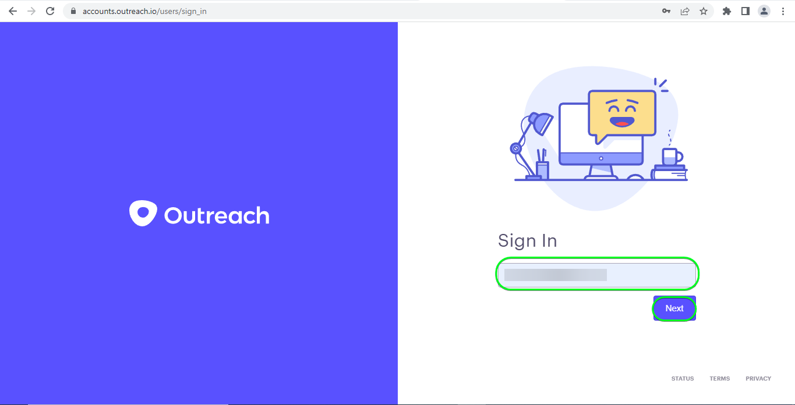

次に、パスワードを入力します。

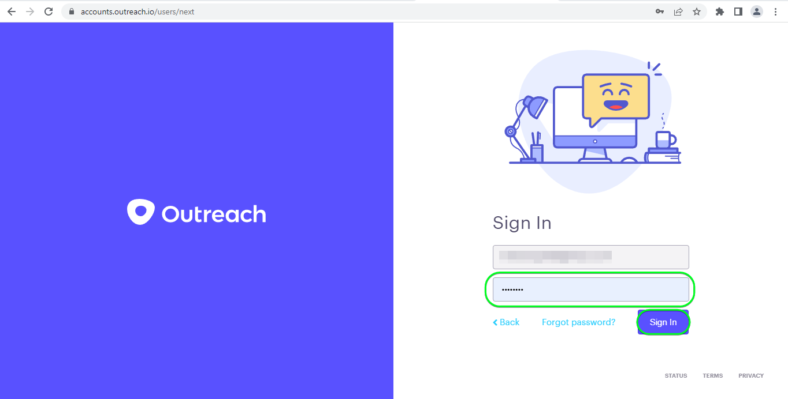

* **[!UICONTROL Username]**: [!DNL Outreach] アカウントのメールアドレス。
* **[!UICONTROL Password]**: [!DNL Outreach] アカウントのパスワード。

指定した詳細が有効な場合、UI には&#x200B;**接続済み**&#x200B;ステータスに緑色のチェックマークが表示されます。その後、次の手順に進むことができます。

### 宛先の詳細を入力 {#destination-details}

宛先の詳細を設定するには、以下の必須フィールドとオプションフィールドに入力します。UI のフィールドの横にアスタリスクが表示される場合は、そのフィールドが必須であることを示します。
アウトリーチの宛先の詳細を入力する方法を示す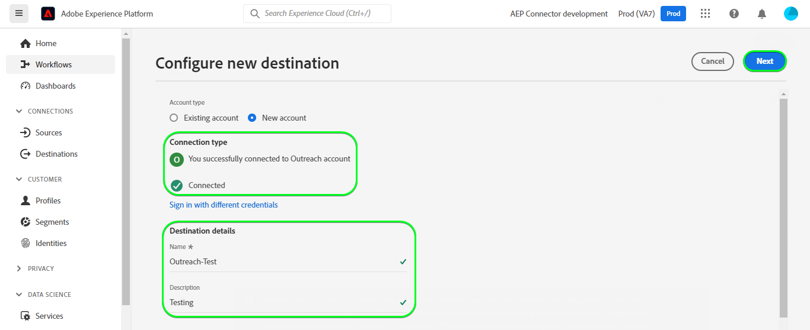

* **[!UICONTROL Name]**：今後この宛先を認識する際に使用する名前。
* **[!UICONTROL Description]**：今後この宛先を特定するのに役立つ説明です。

### アラートの有効化 {#enable-alerts}

アラートを有効にすると、宛先へのデータフローのステータスに関する通知を受け取ることができます。リストからアラートを選択して、データフローのステータスに関する通知を受け取るよう登録します。アラートについて詳しくは、[UI を使用した宛先アラートの購読](../../ui/alerts.md)についてのガイドを参照してください。

宛先接続の詳細の提供が完了したら、**[!UICONTROL Next]**&#x200B;を選択します。

## この宛先に対してオーディエンスをアクティブ化 {#activate}

>[!IMPORTANT]
>
>* データをアクティブ化するには、**[!UICONTROL View Destinations]**、**[!UICONTROL Activate Destinations]**、**[!UICONTROL View Profiles]**&#x200B;および&#x200B;**[!UICONTROL View Segments]** [&#x200B; アクセス制御権限](/help/access-control/home.md#permissions)が必要です。 [アクセス制御の概要](/help/access-control/ui/overview.md)を参照するか、製品管理者に問い合わせて必要な権限を取得してください。
>* *ID*&#x200B;をエクスポートするには、**[!UICONTROL View Identity Graph]** [&#x200B; アクセス制御権限](/help/access-control/home.md#permissions)が必要です。  {width="100" zoomable="yes"}

この宛先にオーディエンスをアクティベートする手順は、[ストリーミングオーディエンスの書き出し宛先へのプロファイルとオーディエンスのアクティベート](../../ui/activate-segment-streaming-destinations.md)を参照してください。

### マッピングの考慮事項と例 {#mapping-considerations-example}

オーディエンスデータを[!DNL Adobe Experience Platform]から[!DNL Outreach]宛先に正しく送信するには、フィールドマッピング手順を実行する必要があります。 マッピングでは、Experience Platform アカウントのExperience Data Model （XDM）スキーマフィールドと、ターゲット先の対応するスキーマフィールドとの間にリンクを作成します。 XDM フィールドを [!DNL Outreach] 宛先フィールドに正しくマッピングするには、次の手順に従います。

1. [!UICONTROL Mapping] ステップで、**[!UICONTROL Add new mapping]**&#x200B;を選択します。 画面に新しいマッピング行が表示されます。
   新しいマッピングを追加する方法を示す

1. [!UICONTROL Select source field] ウィンドウで、**[!UICONTROL Select identity namespace]** カテゴリを選択し、目的のマッピングを追加します。
   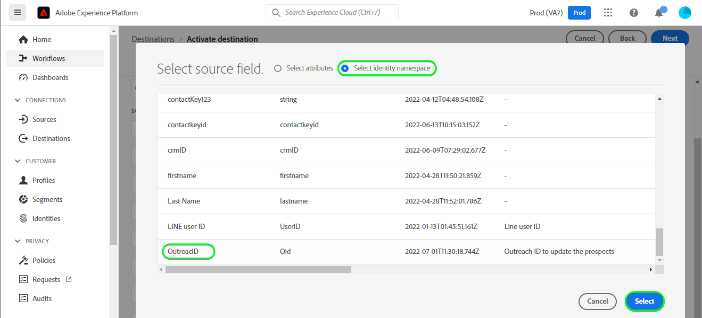

1. [!UICONTROL Select target field] ウィンドウで、ソースフィールドをマッピングするターゲットフィールドのタイプを選択します。
   * **[!UICONTROL Select identity namespace]**: ソースフィールドをリストからID名前空間にマッピングするには、このオプションを選択します。
     OutreachIdを使用したTarget マッピングを示す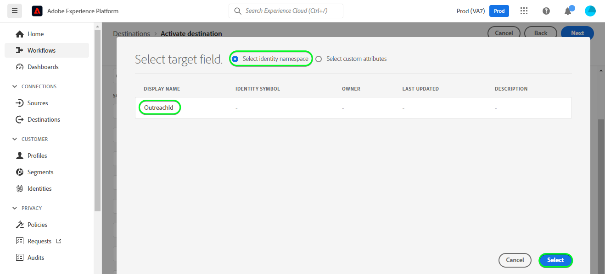

   * XDM プロファイルスキーマと[!DNL Outreach] インスタンスの間に次のマッピングを追加します。

     | XDM プロファイルスキーマ | [!DNL Outreach] インスタンス | 必須 |
     |---|---|---|
     | `Oid` | `OutreachId` | ○ |

   * **[!UICONTROL Select custom attributes]**: ソースフィールドを[!UICONTROL Attribute name] フィールドで定義したカスタム属性にマッピングするには、このオプションを選択します。 サポートされる属性の包括的なリストについては、[[!DNL Outreach] 見込み客ドキュメント &#x200B;](https://api.outreach.io/api/v2/docs#prospect)を参照してください。
     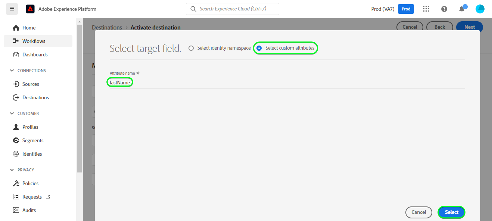

   * 例えば、更新する値に応じて、XDM プロファイルスキーマと[!DNL Outreach] インスタンスの間に次のマッピングを追加します。

     | XDM プロファイルスキーマ | [!DNL Outreach] インスタンス |
     |---|---|
     | `person.name.firstName` | `firstName` |
     | `person.name.lastName` | `lastName` |

   * これらのマッピングの使用例を次に示します。
     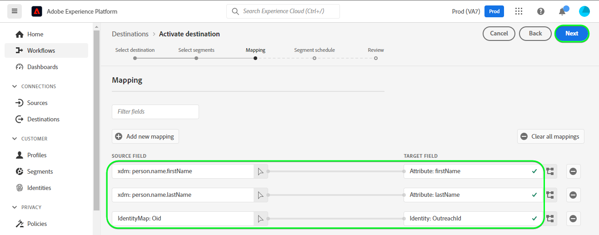

### オーディエンスの書き出しのスケジュールと例 {#schedule-segment-export-example}

* [&#x200B; オーディエンスの書き出しをスケジュール &#x200B;](../../ui/activate-segment-streaming-destinations.md)する手順を実行する場合は、Experience Platform オーディエンスを[!DNL Outreach]のカスタムフィールド属性に手動でマッピングする必要があります。

* これを行うには、各セグメントを選択し、*フィールドの`N`から* カスタムフィールド [!DNL Outreach] ラベル **[!UICONTROL Mapping ID]** フィールドに対応する数値を入力します。

  >[!IMPORTANT]
  >
  > * *内で使用される数値`N` （*） [!UICONTROL Mapping ID]は、[!DNL Outreach]内の数値に接尾辞が付いたカスタム属性キーと一致する必要があります。 例：*カスタムフィールド `N` ラベル*。
  > * 数値を指定するだけで、カスタムフィールドラベル全体を指定する必要はありません。
  > * [!DNL Outreach]は、最大150個のカスタムラベルフィールドをサポートしています。
  > * 詳しくは、[[!DNL Outreach] 見込み客ドキュメント &#x200B;](https://api.outreach.io/api/v2/docs#prospect)を参照してください。

   * 例：

     | [!DNL Outreach] フィールド | Experience Platform マッピング ID |
     |---|---|
     | カスタムフィールド `4` ラベル | `4` |

     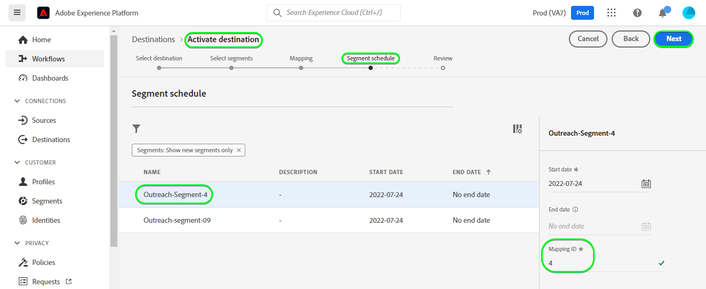

## データの書き出しを検証する {#exported-data}

宛先が正しく設定されていることを検証するには、次の手順に従います。

1. 宛先のリストに移動するには、**[!UICONTROL Destinations]** > **[!UICONTROL Browse]**&#x200B;を選択します。
   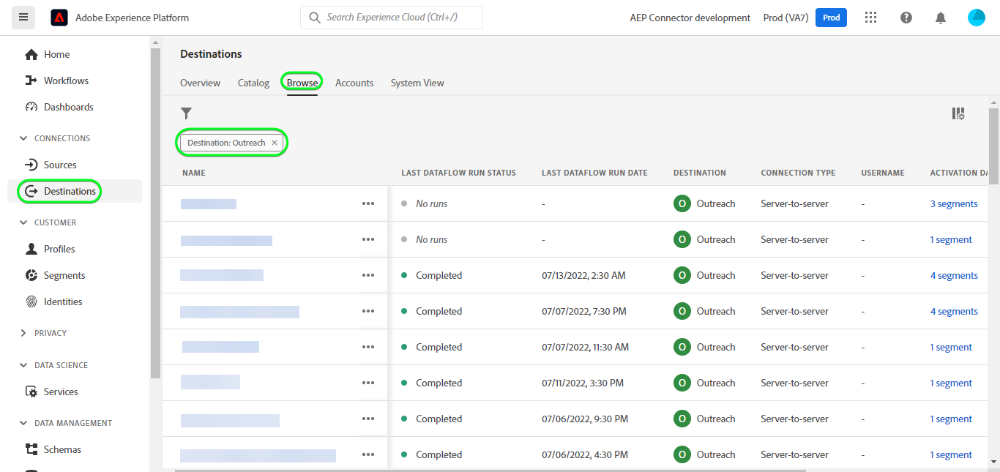

1. 宛先を選択し、ステータスが&#x200B;**[!UICONTROL enabled]**&#x200B;であることを検証します。
   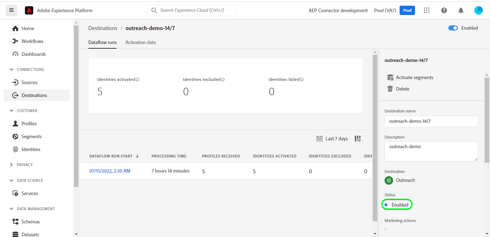

1. 「**[!DNL Activation data]**」タブに切り替えて、オーディエンス名を選択します。
   宛先のアクティベーション データを示す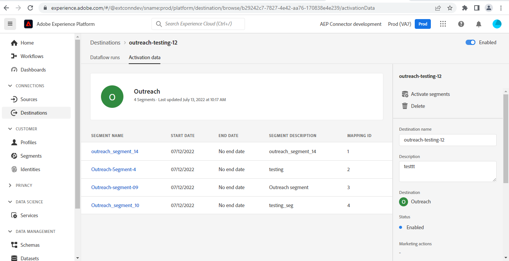

1. オーディエンスの概要を監視し、プロファイルの数がセグメント内で作成された数に対応していることを確認します。
   セグメントの概要を示す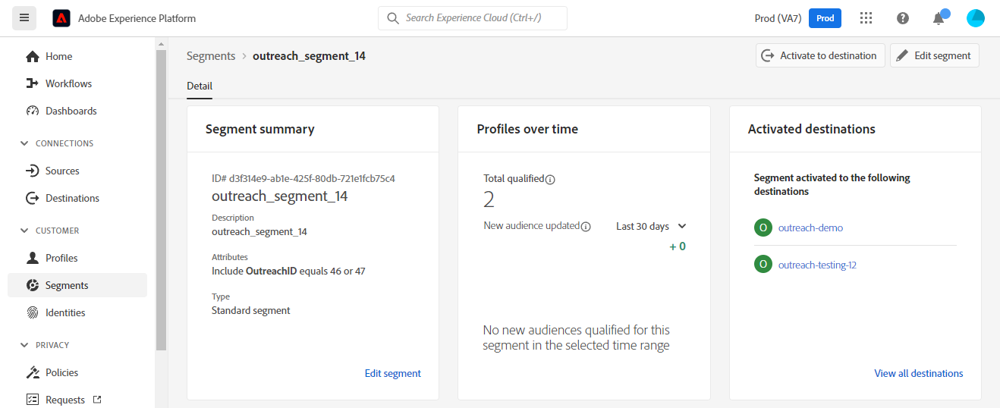

1. [!DNL Outreach] web サイトに移動し、[!DNL Apps] > [!DNL Contacts] ページに移動して、オーディエンスのプロファイルが追加されているかどうかを確認します。 [!DNL Outreach]の各オーディエンスステータスが、[!UICONTROL Mapping ID] オーディエンススケジュール [手順で指定した](#schedule-segment-export-example)値に基づいて、Experience Platformの対応するオーディエンスステータスで更新されていることがわかります。

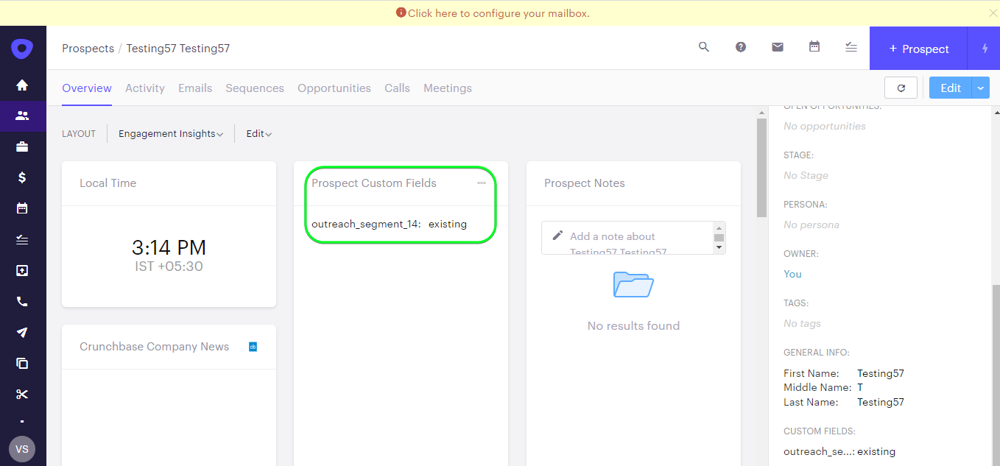

## データの使用とガバナンス {#data-usage-governance}

[!DNL Adobe Experience Platform] のすべての宛先は、データを処理する際のデータ使用ポリシーに準拠しています。[!DNL Adobe Experience Platform] がどのようにデータガバナンスを実施するかについて詳しくは、[データガバナンスの概要](/help/data-governance/home.md)を参照してください。

## エラーとトラブルシューティング {#errors-and-troubleshooting}

データフロー実行を確認すると、次のエラーメッセージが表示される場合があります：`Bad request reported while pushing events to the destination. Please contact the administrator and try again.`

不正なリクエストエラーを示す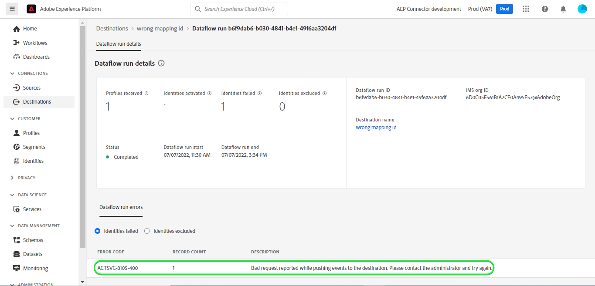

このエラーを修正するには、[!UICONTROL Mapping ID] オーディエンスに対してExperience Platformで指定した[!DNL Outreach]が有効であり、[!DNL Outreach]に存在することを確認してください。

## その他のリソース {#additional-resources}

[[!DNL Outreach]  ドキュメント &#x200B;](https://api.outreach.io/api/v2/docs/)には、[&#x200B; エラー応答](https://api.outreach.io/api/v2/docs#error-responses)の詳細が記載されており、問題のデバッグに使用できます。
