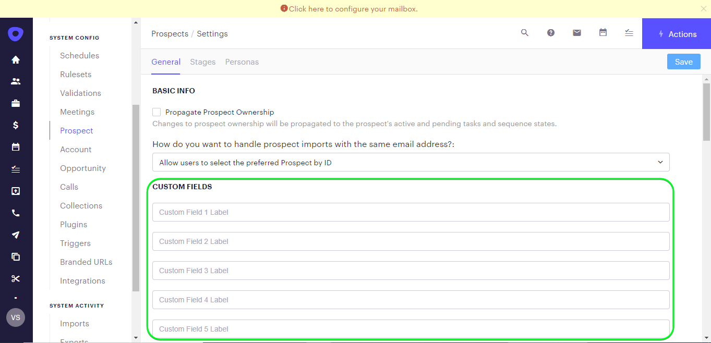

# [!DNL Outreach] 接続

## 概要 {#overview}

[[!DNL Outreach]](https://www.outreach.io/) は、世界で最も B2B のバイヤーとセラーのインタラクションデータを扱う Sales Execution Platform で、販売データをインテリジェンスに変換するための独自の AI テクノロジーへの大量の投資を行っています。[!DNL Outreach] は、組織がセールスエンゲージメントを自動化、収益インテリジェンスに基づいて行動し、効率、予測可能性、成長を向上させるのに役立ちます。

この [!DNL Adobe Experience Platform] [宛先](/help/destinations/home.md) は、 [リソース更新 API のアウトリーチ](https://api.outreach.io/api/v2/docs#update-an-existing-resource): [!DNL Outreach].

[!DNL Outreach] は、認証付与を使用する OAuth 2 を、 [!DNL Outreach] [!DNL Update Resource API]. に対する認証手順 [!DNL Outreach] インスタンスは、以下、内 [宛先に対する認証](#authenticate) 」セクションに入力します。

## ユースケース {#use-cases}

マーケターは、Adobe Experience Platformプロファイルの属性に基づいて、見込み客にパーソナライズされたエクスペリエンスを提供できます。 オフラインデータからオーディエンスを構築し、そのオーディエンスをに送信できます。 [!DNL Outreach]:Adobe Experience Platformでオーディエンスとプロファイルが更新されるとすぐに、見込み客のフィードに表示されます。

## 前提条件 {#prerequisites}

### Experience Platform の前提条件 {#prerequisites-in-experience-platform}

[!DNL Outreach] 宛先へのデータをアクティブ化する前に、[スキーマ](/help/xdm/schema/composition.md)、[データセット](https://experienceleague.adobe.com/docs/platform-learn/tutorials/data-ingestion/create-datasets-and-ingest-data.html?lang=ja)および[セグメント](https://experienceleague.adobe.com/docs/platform-learn/tutorials/segments/create-segments.html)を [!DNL Experience Platform] で作成する必要があります。

詳しくは、Adobeのドキュメントを参照してください。 [オーディエンスメンバーシップ詳細スキーマフィールドグループ](/help/xdm/field-groups/profile/segmentation.md) オーディエンスのステータスに関するガイダンスが必要な場合は、を参照してください。

### アウトリーチの前提条件 {#prerequisites-destination}

Platform から [!DNL Outreach] アカウントにデータを書き出すには、[!DNL Outreach] で次の前提条件に注意してください。

#### Outreach アカウントが必要です {#prerequisites-account}

次に移動： [!DNL Outreach] [サインイン](https://accounts.outreach.io/users/sign_in) アカウントを登録および作成するページ（まだ存在しない場合）。 また、 [!DNL Outreach] サポート [ページ](https://support.outreach.io/hc/en-us/articles/207238607-Claim-Your-Outreach-Account) を参照してください。

[!DNL Outreach] CRM 宛先に対して認証を行う前に、以下の項目をメモしておきます。

| 資格情報 | 説明 |
|---|---|
| メール | お使いの [!DNL Outreach] アカウントの電子メール |
| パスワード | お使いの [!DNL Outreach] アカウントパスワード |

#### カスタムフィールドラベルの設定 {#prerequisites-custom-fields}

[!DNL Outreach] は、次のカスタムフィールドをサポートします： [見込み客](https://support.outreach.io/hc/en-us/articles/360001557554-Outreach-Prospect-Profile-Overview). 参照： [Outreach にカスタムフィールドを追加する方法](https://support.outreach.io/hc/en-us/articles/219124908-How-To-Add-a-Custom-Field-in-Outreach) を参照してください。 識別しやすくするために、デフォルトを維持する代わりに、ラベルを対応するオーディエンス名に手動で更新することをお勧めします。 次に例を示します。

[!DNL Outreach] カスタムフィールドを表示する見込み客の設定ページです。

[!DNL Outreach] カスタムフィールドを表示する見込み客の設定ページ： *使いやすい* オーディエンス名に一致するラベル。 これらのラベルに対して、見込み客ページでオーディエンスのステータスを表示できます。

>[!NOTE]
>
> ラベル名は識別しやすいようにするためにのみ使用します。 これらは、見込み客を更新する際には使用されません。

## ガードレール

The [!DNL Outreach] API には、ユーザーあたり 1 時間に 10,000 件のリクエストのレート制限があります。 この制限に達すると、 `429` 応答に次のメッセージが表示されます。 `You have exceeded your permitted rate limit of 10,000; please try again at 2017-01-01T00:00:00.`.

このメッセージが表示された場合は、レートしきい値に従ってオーディエンスの書き出しスケジュールを更新する必要があります。

詳しくは、 [[!DNL Outreach] ドキュメント](https://api.outreach.io/api/v2/docs#rate-limiting) を参照してください。

## サポートされる ID {#supported-identities}

[!DNL Outreach] では、以下の表で説明する ID の更新をサポートしています。[ID](/help/identity-service/namespaces.md) についての詳細情報。

| ターゲット ID | 説明 | 注意点 |
|---|---|---|
| `OutreachId` | <ul><li>[!DNL Outreach] 識別子。 これは、見込み客のプロファイルに対応する数値です。</li><li>ID は、 [!DNL Outreach] 更新中の見込み客の URL。</li><li>詳しくは、[[!DNL Outreach] ドキュメント](https://api.outreach.io/api/v2/docs#update-an-existing-resource)を参照してください。</li></ul> | 必須 |

## 書き出しのタイプと頻度 {#export-type-frequency}

宛先の書き出しのタイプと頻度について詳しくは、以下の表を参照してください。

| 項目 | タイプ | メモ |
---------|----------|---------|
| 書き出しタイプ | **[!UICONTROL プロファイルベース]** | <ul><li> セグメントのすべてのメンバーを、フィールドマッピングに従って、必要なスキーマフィールドと共に書き出します&#x200B;*（例：メールアドレス、電話番号、姓）*。</li><li> 各セグメントのステータス ( [!DNL Outreach] は、 [!UICONTROL マッピング ID] 期間中に指定された値 [オーディエンススケジュール](#schedule-segment-export-example) 手順</li></ul> |
| 書き出し頻度 | **[!UICONTROL ストリーミング]** | <ul><li> ストリーミングの宛先は常に、API ベースの接続です。オーディエンス評価に基づいて Experience Platform 内でプロファイルが更新されるとすぐに、コネクタは更新を宛先プラットフォームに送信します。詳しくは、[ストリーミングの宛先](/help/destinations/destination-types.md#streaming-destinations)を参照してください。</li></ul> |

{style="table-layout:auto"}

## 宛先への接続 {#connect}

>[!IMPORTANT]
> 
> 宛先に接続するには、**[!UICONTROL 宛先の管理]** [アクセス制御権限](/help/access-control/home.md#permissions)が必要です。詳しくは、[アクセス制御の概要](/help/access-control/ui/overview.md)または製品管理者に問い合わせて、必要な権限を取得してください。

この宛先に接続するには、[宛先設定のチュートリアル](../../ui/connect-destination.md)の手順に従ってください。宛先の設定ワークフローで、以下の 2 つのセクションにリストされているフィールドに入力します。

**[!UICONTROL 宛先]**／**[!UICONTROL カタログ]**&#x200B;内で [!DNL Outreach] を検索します。または、CRM カテゴリの下に配置することもできます。

### 宛先に対する認証 {#authenticate}

宛先を認証するには、「 **[!UICONTROL 宛先に接続]**」を選択します。

次の項目が表示されます。 [!DNL Outreach] ログインページ。 電子メールを入力します。

次に、パスワードを入力します。

* **[!UICONTROL ユーザー名]**: [!DNL Outreach] アカウントの電子メール。
* **[!UICONTROL パスワード]**: [!DNL Outreach] アカウントのパスワード。

指定した詳細が有効な場合、UI で&#x200B;**接続済み**&#x200B;ステータスに緑色のチェックマークが付きます。その後、次の手順に進むことができます。

### 宛先の詳細を入力 {#destination-details}

宛先の詳細を設定するには、以下の必須フィールドとオプションフィールドに入力します。UI のフィールドの横にアスタリスクが表示される場合は、そのフィールドが必須であることを示します。

* **[!UICONTROL 名前]**：今後この宛先を認識するための名前。
* **[!UICONTROL 説明]**：今後この宛先を識別するのに役立つ説明。

### アラートの有効化 {#enable-alerts}

アラートを有効にすると、宛先へのデータフローのステータスに関する通知を受け取ることができます。リストからアラートを選択して、データフローのステータスに関する通知を受け取るよう登録します。アラートについて詳しくは、[UI を使用した宛先アラートの購読](../../ui/alerts.md)についてのガイドを参照してください。

宛先接続の詳細の入力を終えたら「**[!UICONTROL 次へ]**」を選択します。

## この宛先に対してオーディエンスをアクティブ化 {#activate}

>[!IMPORTANT]
> 
>* データをアクティブ化するには、**[!UICONTROL 宛先の管理]**、**[!UICONTROL 宛先のアクティブ化]**、**[!UICONTROL プロファイルの表示]**&#x200B;および&#x200B;**[!UICONTROL セグメントの表示]** [に対するアクセス制御権限](/help/access-control/home.md#permissions)が必要です。詳しくは、[アクセス制御の概要](/help/access-control/ui/overview.md)または製品管理者に問い合わせて、必要な権限を取得してください。
>* 書き出す *id*、 **[!UICONTROL ID グラフを表示]** [アクセス制御権限](/help/access-control/home.md#permissions).   {width="100" zoomable="yes"}

この宛先にオーディエンスをアクティベートする手順は、[ストリーミングオーディエンスの書き出し宛先へのプロファイルとオーディエンスのアクティベート](../../ui/activate-segment-streaming-destinations.md)を参照してください。

### マッピングの考慮事項と例 {#mapping-considerations-example}

Adobe Experience Platform から [!DNL Outreach] 宛先にオーディエンスデータを正しく送信するには、フィールドマッピングの手順を実行する必要があります。マッピングは、Platform アカウント内の Experience Data Model（XDM）スキーマフィールドと、ターゲット宛先から対応する同等のスキーマフィールドとの間にリンクを作成して構成されます。 XDM フィールドを [!DNL Outreach] 宛先フィールドに正しくマッピングするには、次の手順に従います。

1. Adobe Analytics の [!UICONTROL マッピング] ステップ、クリック **[!UICONTROL 新しいマッピングを追加]**. 画面に新しいマッピング行が表示されます。
   

1. Adobe Analytics の [!UICONTROL ソースフィールドを選択] ウィンドウで、 **[!UICONTROL ID 名前空間を選択]** 」カテゴリに追加し、目的のマッピングを追加します。
   

1. [!UICONTROL ターゲットフィールドを選択]ウィンドウで、ソースフィールドにマッピングするターゲットフィールドのタイプを選択します。
   * **[!UICONTROL ID 名前空間を選択]**：このオプションを選択して、ソースフィールドをリストから ID 名前空間にマッピングします。
     

   * XDM プロファイルスキーマと [!DNL Outreach] インスタンスの間の次のマッピングを追加：
|XDM プロファイルスキーマ|[!DNL Outreach] インスタンス| 必須|
|—|—|—| 
|`Oid`|`OutreachId`| はい |

   * **[!UICONTROL カスタム属性を選択]**：このオプションを選択して、「[!UICONTROL 属性名]」フィールドに定義するカスタム属性にマッピングするソースフィールドを選択します。参照： [[!DNL Outreach] 見込み客向けドキュメント](https://api.outreach.io/api/v2/docs#prospect) を参照してください。
     

   * 例えば、更新する値に応じて、XDM プロファイルスキーマと [!DNL Outreach] インスタンス： |XDM プロファイルスキーマ|[!DNL Outreach] インスタンス| |—|—| |`person.name.firstName`|`firstName`| |`person.name.lastName`|`lastName`|

   * これらのマッピングの使用例を次に示します。
     

### オーディエンスのエクスポートと例のスケジュール設定 {#schedule-segment-export-example}

* 実行時に、 [オーディエンスの書き出しをスケジュール](../../ui/activate-segment-streaming-destinations.md) 手順 Platform オーディエンスを、 [!DNL Outreach].

* これをおこなうには、各セグメントを選択し、 *カスタムフィールド `N` ラベル* ～から離れる [!DNL Outreach] （内） **[!UICONTROL マッピング ID]** フィールドに入力します。

  >[!IMPORTANT]
  >
  > * 数値 *(`N`)* 内で使用される [!UICONTROL マッピング ID] は、の数値でサフィックスが付いたカスタム属性キーに一致する必要があります [!DNL Outreach]. 例： *カスタムフィールド `N` ラベル*.
  > * 指定する必要があるのは数値のみで、カスタムフィールドのラベル全体は指定できません。
  > * [!DNL Outreach] では、最大 150 個のカスタムラベルフィールドをサポートしています。
  > * 参照： [[!DNL Outreach] 見込み客向けドキュメント](https://api.outreach.io/api/v2/docs#prospect) 」を参照してください。

   * 以下に例を示します。

     | [!DNL Outreach] フィールド | プラットフォームマッピング ID |
     |---|---|
     | カスタムフィールド `4` ラベル | `4` |

     

## データの書き出しを検証する {#exported-data}

宛先が正しく設定されていることを検証するには、次の手順に従います。

1. **[!UICONTROL 宛先]**／**[!UICONTROL 参照]** を選択して、宛先のリストに移動します。
   

1. 宛先を選択し、ステータスが「 **[!UICONTROL 有効]**」であることを確認します。
   

1. 次に切り替え： **[!DNL Activation data]** 」タブをクリックし、オーディエンス名を選択します。
   

1. オーディエンスの概要を監視し、プロファイルの数がセグメント内で作成された数に対応していることを確認します。
   

1. にログインします。 [!DNL Outreach] web サイトに移動し、 [!DNL Apps] > [!DNL Contacts] ページを開き、オーディエンスからのプロファイルが追加されたかどうかを確認します。 各オーディエンスのステータスは、 [!DNL Outreach] は、 [!UICONTROL マッピング ID] 期間中に指定された値 [オーディエンススケジュール](#schedule-segment-export-example) 手順

## データの使用とガバナンス {#data-usage-governance}

[!DNL Adobe Experience Platform] のすべての宛先は、データを処理する際のデータ使用ポリシーに準拠しています。[!DNL Adobe Experience Platform] がどのようにデータガバナンスを実施するかについて詳しくは、[データガバナンスの概要](/help/data-governance/home.md)を参照してください。

## エラーとトラブルシューティング {#errors-and-troubleshooting}

データフローの実行をチェックする際に、次のエラーメッセージが表示される場合があります。 `Bad request reported while pushing events to the destination. Please contact the administrator and try again.`

このエラーを修正するには、 [!UICONTROL マッピング ID] Platform で指定した [!DNL Outreach] オーディエンスが有効で、次に存在する [!DNL Outreach].

## その他のリソース {#additional-resources}

The [[!DNL Outreach] ドキュメント](https://api.outreach.io/api/v2/docs/) には、の詳細があります [エラー応答](https://api.outreach.io/api/v2/docs#error-responses) 問題のデバッグに使用できます。
