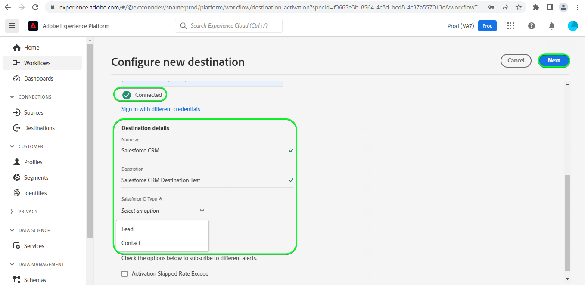
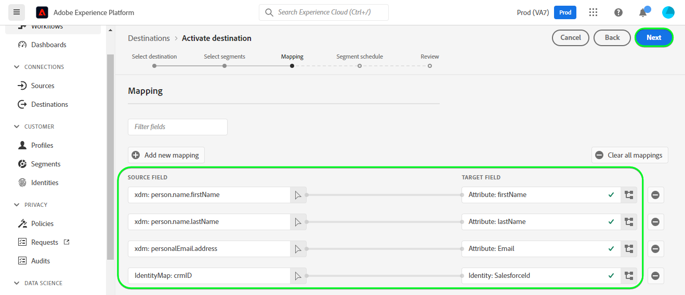
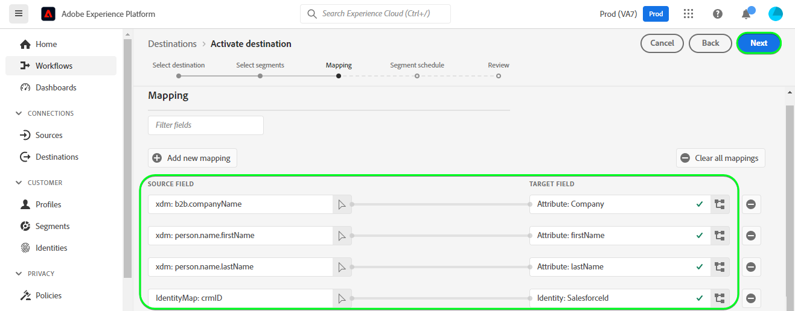

# [!DNL Salesforce CRM] 接続

## 概要 {#overview}

[[!DNL Salesforce CRM]](https://www.salesforce.com/crm/) は、人気のある顧客関係管理 (CRM) プラットフォームで、次のものをサポートします。

* [リード](https://developer.salesforce.com/docs/atlas.en-us.object_reference.meta/object_reference/sforce_api_objects_lead.htm)  — リードとは、販売する製品やサービスに関心を持つ（または興味を持たない）人または会社の名前です。
* [連絡先](https://developer.salesforce.com/docs/atlas.en-us.object_reference.meta/object_reference/sforce_api_objects_contact.htm)  — 連絡先とは、担当者の 1 人が関係を確立し、潜在的な顧客として認定された個人です。

この [!DNL Adobe Experience Platform] [宛先](/help/destinations/home.md) は、 [[!DNL Salesforce composite API]](https://developer.salesforce.com/docs/atlas.en-us.api_rest.meta/api_rest/resources_composite_sobjects_collections_update.htm)：前述の両方のタイプのプロファイルをサポートします。

条件 [セグメントのアクティブ化](#activate)を使用する場合は、リードまたは連絡先のいずれかを選択し、属性とオーディエンスデータを [!DNL Salesforce CRM].

[!DNL Salesforce CRM] は、Salesforce REST API と通信するための認証メカニズムとして、パスワード付与付きの OAuth 2 を使用しています。 [!DNL Salesforce CRM] インスタンスを認証する手順は、さらに下の[宛先に対する認証](#authenticate)の節にあります。

## ユースケース {#use-cases}

マーケターは、Adobe Experience Platform プロファイルの属性に基づいて、ユーザーにパーソナライズされたエクスペリエンスを提供できます。 オフラインデータからオーディエンスを構築し、Salesforce CRM に送信して、Adobe Experience Platformでオーディエンスとプロファイルが更新されるとすぐに、ユーザーのフィードに表示できます。

## 前提条件 {#prerequisites}

### Experience Platformの前提条件 {#prerequisites-in-experience-platform}

Salesforce CRM の宛先に対してデータをアクティブ化する前に、 [スキーマ](/help/xdm/schema/composition.md), a [データセット](https://experienceleague.adobe.com/docs/platform-learn/tutorials/data-ingestion/create-datasets-and-ingest-data.html?lang=ja)、および [セグメント](https://experienceleague.adobe.com/docs/platform-learn/tutorials/segments/create-segments.html?lang=ja) 次で作成： [!DNL Experience Platform].

### の前提条件 [!DNL Salesforce CRM] {#prerequisites-destination}

次の前提条件に注意してください。 [!DNL Salesforce CRM]Platform から Salesforce アカウントにデータをエクスポートするには、次の手順を実行します。

#### [!DNL Salesforce] アカウントが必要です {#prerequisites-account}

次に移動： [!DNL Salesforce] [体験版](https://www.salesforce.com/in/form/signup/freetrial-sales/) 登録して作成するページ [!DNL Salesforce] アカウントを作成します。

#### 内での接続アプリの設定 [!DNL Salesforce] {#prerequisites-connected-app}

まず、 [[!DNL Salesforce] 接続されたアプリ](https://help.salesforce.com/s/articleView?id=sf.connected_app_create.htm&amp;language=en_US&amp;r=https%3A%2F%2Fhelp.salesforce.com%2F&amp;type=5) の [!DNL Salesforce] アカウントを作成します。 [!DNL Salesforce CRM] 接続したアプリを活用して [!DNL Salesforce].

次に、有効にします。 [!DNL OAuth Settings for API Integration] （の） [!DNL Salesforce connected app]. 詳しくは、 [[!DNL Salesforce]](https://help.salesforce.com/s/articleView?id=connected_app_create_api_integration.htm&amp;type=5&amp;language=en_US) ガイダンスに関するドキュメント。

また、 [スコープ](https://help.salesforce.com/s/articleView?id=connected_app_create_api_integration.htm&amp;type=5&amp;language=en_US) 以下に、 [!DNL Salesforce connected app].

* ``chatter_api``
* ``lightning``
* ``visualforce``
* ``content``
* ``openid``
* ``full``
* ``api``
* ``web``
* ``refresh_token``
* ``offline_access``

最後に、 `password` 許可は [!DNL Salesforce] アカウント。 詳しくは、 [!DNL Salesforce] [特別なシナリオでの OAuth 2.0 ユーザー名 — パスワードフロー](https://help.salesforce.com/s/articleView?id=sf.remoteaccess_oauth_username_password_flow.htm&amp;type=5) ガイダンスが必要な場合は、ドキュメントを参照してください。

>[!IMPORTANT]
>
>次の場合、 [!DNL Salesforce] アカウント管理者が信頼済み IP 範囲へのアクセスを制限しています。アカウント管理者に連絡して、 [Experience PlatformIP](/help/destinations/catalog/streaming/ip-address-allow-list.md) 許可リストに加える。 詳しくは、 [!DNL Salesforce] [接続アプリの信頼済み IP 範囲へのアクセスを制限する](https://help.salesforce.com/s/articleView?id=sf.connected_app_edit_ip_ranges.htm&amp;type=5) 追加のガイダンスが必要な場合は、ドキュメントを参照してください。

#### 内にカスタムフィールドを作成する [!DNL Salesforce] {#prerequisites-custom-field}

オーディエンスを [!DNL Salesforce CRM] 宛先の場合、 **[!UICONTROL マッピング ID]** フィールドをアクティブ化したオーディエンスごとに、 **[オーディエンススケジュール](#schedule-segment-export-example)** 手順

[!DNL Salesforce CRM] では、この値がExperience Platformからのオーディエンスを正しく読み取り、解釈し、内でオーディエンスのステータスを更新するために必要です。 [!DNL Salesforce]. 詳しくは、Experience Platformドキュメントを参照してください。 [オーディエンスメンバーシップ詳細スキーマフィールドグループ](/help/xdm/field-groups/profile/segmentation.md) オーディエンスのステータスに関するガイダンスが必要な場合は、を参照してください。

Platform からに対してアクティブ化する各オーディエンスに対して、 [!DNL Salesforce CRM]の場合は、タイプのカスタムフィールドを作成する必要があります `Text Area (Long)` 範囲 [!DNL Salesforce]. ビジネス要件に応じて、256～131,072 文字の任意のサイズのフィールド文字長を定義できます。 詳しくは、 [!DNL Salesforce] [カスタムフィールドタイプ](https://help.salesforce.com/s/articleView?id=sf.custom_field_types.htm&amp;type=5) カスタムフィールドタイプの追加情報については、ドキュメントページを参照してください。 また、 [!DNL Salesforce] ～に関する文書 [カスタムフィールドの作成](https://help.salesforce.com/s/articleView?id=mc_cab_create_an_attribute.htm&amp;type=5&amp;language=en_US) フィールドの作成に関するサポートが必要な場合は、を参照してください。

>[!IMPORTANT]
>
>フィールド名に空白文字を含めないでください。 代わりに、アンダースコアを使用します。 `(_)` 文字を区切り文字として使用します。
>Within [!DNL Salesforce] カスタムフィールドは、 **[!UICONTROL フィールド名]** で指定された値と完全に一致する **[!UICONTROL マッピング ID]** 」と入力します。 例えば、以下のスクリーンショットには、という名前のカスタムフィールドが表示されています。 `crm_2_seg`. この宛先に対してオーディエンスをアクティブ化する場合は、 `crm_2_seg` as **[!UICONTROL マッピング ID]** オーディエンスオーディエンスをExperience Platformからこのカスタムフィールドに入力する場合。

でのカスタムフィールド作成の例 [!DNL Salesforce], *手順 1 — データタイプの選択*を使用する場合、は以下のようになります。

でのカスタムフィールド作成の例 [!DNL Salesforce], *手順 2 — カスタムフィールドの詳細を入力する*を使用する場合、は以下のようになります。

>[!TIP]
>
>* Platform オーディエンスに使用されるカスタムフィールドと、 [!DNL Salesforce] カスタムフィールドの作成時には、認識可能なプレフィックスまたはサフィックスを含めることができます。 例えば、の代わりに `test_segment`，使用 `Adobe_test_segment` または `test_segment_Adobe`
>* 他のカスタムフィールドが既にで作成されている場合は、 [!DNL Salesforce]を使用すると、Platform セグメントと同じ名前を使用して、 [!DNL Salesforce].

>[!NOTE]
>
>* Salesforce 内のオブジェクトは 25 個の外部フィールドに制限されています。詳しくは、 [カスタムフィールド属性](https://help.salesforce.com/s/articleView?id=sf.custom_field_attributes.htm&amp;type=5).
>* この制限は、いつでもアクティブなExperience Platformオーディエンスメンバーシップを最大 25 個まで持つことができることを意味します。
>* Salesforce 内でこの制限に達した場合は、新しい **[!UICONTROL マッピング ID]** を使用できます。

#### [!DNL Salesforce CRM] 資格情報の収集 {#gather-credentials}

[!DNL Salesforce CRM] 宛先に対して認証を行う前に、以下の項目をメモしておきます。

| 資格情報 | 説明 | 例 |
| --- | --- | --- |
| `Username` | お使いの [!DNL Salesforce] アカウントのユーザー名。 | |
| `Password` | お使いの [!DNL Salesforce] アカウントのパスワード。 | |
| `Security Token` | お使いの [!DNL Salesforce] 後で追加するセキュリティトークン [!DNL Salesforce] 連結された文字列を作成し、 **[!UICONTROL パスワード]** when [宛先への認証](#authenticate).  詳しくは、 [!DNL Salesforce] ～に関する文書 [セキュリティトークンをリセット](https://help.salesforce.com/s/articleView?id=sf.user_security_token.htm&amp;type=5) 再生する方法を学ぶ [!DNL Salesforce] インターフェイスを使用します（セキュリティトークンがない場合）。 |  |
| `Custom Domain` | お使いの [!DNL Salesforce] ドメインプレフィックス。   詳しくは、 [[!DNL Salesforce] ドキュメント](https://help.salesforce.com/s/articleView?id=sf.domain_name_setting_login_policy.htm&amp;type=5) この値を [!DNL Salesforce] インターフェイス。 | 次の場合、 [!DNL Salesforce] ドメインは  *`d5i000000isb4eak-dev-ed`.my.salesforce.com*,  必要なもの `d5i000000isb4eak-dev-ed` を値として使用します。 |
| `Client ID` | Salesforce `Consumer Key`.   詳しくは、 [[!DNL Salesforce] ドキュメント](https://help.salesforce.com/s/articleView?id=sf.connected_app_rotate_consumer_details.htm&amp;type=5) この値を [!DNL Salesforce] インターフェイス。 | |
| `Client Secret` | Salesforce `Consumer Secret`.   詳しくは、 [[!DNL Salesforce] ドキュメント](https://help.salesforce.com/s/articleView?id=sf.connected_app_rotate_consumer_details.htm&amp;type=5) この値を [!DNL Salesforce] インターフェイス。 | |

### ガードレール {#guardrails}

[!DNL Salesforce] 要求、レートおよびタイムアウト制限を課すことによって、トランザクションの負荷を分散します。 詳しくは、 [API リクエストの制限と割り当て](https://developer.salesforce.com/docs/atlas.en-us.salesforce_app_limits_cheatsheet.meta/salesforce_app_limits_cheatsheet/salesforce_app_limits_platform_api.htm) 」を参照してください。

次の場合、 [!DNL Salesforce] アカウント管理者が IP 制限を適用しました。 [Experience Platformの IP アドレス](/help/destinations/catalog/streaming/ip-address-allow-list.md) を [!DNL Salesforce] アカウントの信頼済み IP 範囲。 詳しくは、 [!DNL Salesforce] [接続アプリの信頼済み IP 範囲へのアクセスを制限する](https://help.salesforce.com/s/articleView?id=sf.connected_app_edit_ip_ranges.htm&amp;type=5) 追加のガイダンスが必要な場合は、ドキュメントを参照してください。

>[!IMPORTANT]
>
>条件 [セグメントのアクティブ化](#activate) 次のいずれかを選択する必要があります。 *連絡先* または *リード* タイプ。 選択したタイプに従って、オーディエンスに適切なデータマッピングがあることを確認する必要があります。

## サポートされる ID {#supported-identities}

[!DNL Salesforce CRM] では、以下の表で説明する ID の更新をサポートしています。[ID](/help/identity-service/namespaces.md) についての詳細情報。

| ターゲット ID | 説明 | 注意点 |
|---|---|---|
| `SalesforceId` | The [!DNL Salesforce CRM] セグメントを通じて書き出しまたは更新する連絡先 ID またはリード ID の識別子。 | 必須 |

## 書き出しのタイプと頻度 {#export-type-frequency}

宛先の書き出しのタイプと頻度について詳しくは、以下の表を参照してください。

| 項目 | タイプ | メモ |
---------|----------|---------|
| 書き出しタイプ | **[!UICONTROL プロファイルベース]** | <ul><li>セグメントのすべてのメンバーを、フィールドマッピングに従って、必要なスキーマフィールドと共に書き出します&#x200B;*（例：メールアドレス、電話番号、姓）*。</li><li> での各オーディエンスのステータス [!DNL Salesforce CRM] は、 **[!UICONTROL マッピング ID]** 期間中に指定された値 [オーディエンススケジュール](#schedule-segment-export-example) 手順</li></ul> |
| 書き出し頻度 | **[!UICONTROL ストリーミング]** | <ul><li>ストリーミングの宛先は常に、API ベースの接続です。オーディエンス評価に基づいて Experience Platform 内でプロファイルが更新されるとすぐに、コネクタは更新を宛先プラットフォームに送信します。詳しくは、[ストリーミングの宛先](/help/destinations/destination-types.md#streaming-destinations)を参照してください。</li></ul> |

{style="table-layout:auto"}

## 宛先への接続 {#connect}

>[!IMPORTANT]
>
>宛先に接続するには、**[!UICONTROL 宛先の管理]** [アクセス制御権限](/help/access-control/home.md#permissions)が必要です。詳しくは、[アクセス制御の概要](/help/access-control/ui/overview.md)または製品管理者に問い合わせて、必要な権限を取得してください。

この宛先に接続するには、[宛先設定のチュートリアル](../../ui/connect-destination.md)の手順に従ってください。宛先の設定ワークフローで、以下の 2 つのセクションにリストされているフィールドに入力します。

**[!UICONTROL 宛先]**／**[!UICONTROL カタログ]**&#x200B;内で [!DNL Salesforce CRM] を検索します。または、**[!UICONTROL CRM]** カテゴリの下に配置することもできます。

### 宛先に対する認証 {#authenticate}

宛先を認証するには、以下の必須フィールドに入力し、を選択します。 **[!UICONTROL 宛先に接続]**. 詳しくは、[ [!DNL Salesforce CRM]  資格情報の収集](#gather-credentials)の節を参照してください。|資格情報 |説明 | | — | — | | **[!UICONTROL ユーザー名]** |お客様の [!DNL Salesforce] アカウントのユーザー名。 | | **[!UICONTROL パスワード]** |次の文字列で構成される連結文字列： [!DNL Salesforce] アカウントのパスワードが追加されました [!DNL Salesforce] セキュリティトークン。 連結された値は、 `{PASSWORD}{TOKEN}`.  なお、中括弧やスペースは使用しないでください。 例えば、 [!DNL Salesforce] パスワード： `MyPa$$w0rd123` および [!DNL Salesforce] セキュリティトークンは `TOKEN12345....0000`に設定する場合、 **[!UICONTROL パスワード]** フィールドが次の値 `MyPa$$w0rd123TOKEN12345....0000`. | | **[!UICONTROL カスタムドメイン]** |お客様の [!DNL Salesforce] ドメインプレフィックス。  例えば、ドメインが *`d5i000000isb4eak-dev-ed`.my.salesforce.com*&#x200B;を指定する場合は、 `d5i000000isb4eak-dev-ed` を値として使用します。 | | **[!UICONTROL クライアント ID]** |お客様の [!DNL Salesforce] 接続されたアプリ `Consumer Key`. | | **[!UICONTROL クライアントの秘密鍵]** |お客様の [!DNL Salesforce] 接続されたアプリ `Consumer Secret`. |

指定した詳細が有効な場合、UI に **[!UICONTROL 接続済み]** ステータスに緑色のチェックマークが付いている場合は、次の手順に進むことができます。

### 宛先の詳細を入力 {#destination-details}

宛先の詳細を設定するには、以下の必須フィールドとオプションフィールドに入力します。UI のフィールドの横のアスタリスクは、そのフィールドが必須であることを示します。
* **[!UICONTROL 名前]**：今後この宛先を認識するための名前。
* **[!UICONTROL 説明]**：今後この宛先を識別するのに役立つ説明。
* **[!UICONTROL Salesforce ID タイプ]**:
   * 選択 **[!UICONTROL 連絡先]** 書き出しまたは更新する id のタイプがの場合 *連絡先*.
   * 選択 **[!UICONTROL リード]** 書き出しまたは更新する id のタイプがの場合 *リード*.

### アラートの有効化 {#enable-alerts}

アラートを有効にすると、宛先へのデータフローのステータスに関する通知を受け取ることができます。リストからアラートを選択して、データフローのステータスに関する通知を受け取るよう登録します。アラートについて詳しくは、[UI を使用した宛先アラートの購読](../../ui/alerts.md)についてのガイドを参照してください。

宛先接続の詳細の入力を終えたら「**[!UICONTROL 次へ]**」を選択します。

## この宛先に対してオーディエンスをアクティブ化 {#activate}

>[!IMPORTANT]
> 
>* データをアクティブ化するには、**[!UICONTROL 宛先の管理]**、**[!UICONTROL 宛先のアクティブ化]**、**[!UICONTROL プロファイルの表示]**&#x200B;および&#x200B;**[!UICONTROL セグメントの表示]** [に対するアクセス制御権限](/help/access-control/home.md#permissions)が必要です。詳しくは、[アクセス制御の概要](/help/access-control/ui/overview.md)または製品管理者に問い合わせて、必要な権限を取得してください。
>* 書き出す *id*、 **[!UICONTROL ID グラフを表示]** [アクセス制御権限](/help/access-control/home.md#permissions).   {width="100" zoomable="yes"}

この宛先にオーディエンスをアクティベートする手順は、[ストリーミングオーディエンスの書き出し宛先へのプロファイルとオーディエンスのアクティベート](/help/destinations/ui/activate-segment-streaming-destinations.md)を参照してください。

### マッピングの考慮事項と例 {#mapping-considerations-example}

Adobe Experience Platform から [!DNL Salesforce CRM] 宛先にオーディエンスデータを正しく送信するには、フィールドマッピングの手順を実行する必要があります。マッピングは、Platform アカウント内の Experience Data Model（XDM）スキーマフィールドと、ターゲット宛先から対応する同等のスキーマフィールドとの間にリンクを作成して構成されます。 

で指定された属性 **[!UICONTROL ターゲットフィールド]** は、属性マッピングテーブルで説明されたとおりに名前を付ける必要があります。これらの属性は、リクエスト本文を形成します。

で指定された属性 **[!UICONTROL ソースフィールド]** このような制限に従わないでください。 必要に応じてマッピングできますが、入力データの形式が [[!DNL Salesforce] ドキュメント](https://help.salesforce.com/s/articleView?id=sf.custom_field_attributes.htm&amp;type=5). 入力データが無効な場合、に対する更新呼び出し [!DNL Salesforce] が失敗し、連絡先/リードが更新されませんでした。

XDM フィールドを [!DNL (API) Salesforce CRM] 宛先フィールドに正しくマッピングするには、次の手順に従います。

1. Adobe Analytics の **[!UICONTROL マッピング]** ステップ、選択 **[!UICONTROL 新しいマッピングを追加]**に値を指定しない場合、新しいマッピング行が画面に表示されます。
   
1. Adobe Analytics の **[!UICONTROL ソースフィールドを選択]** ウィンドウで、 **[!UICONTROL 属性を選択]** カテゴリを選択して XDM 属性を選択するか、 **[!UICONTROL ID 名前空間を選択]** ID を選択します。
1. Adobe Analytics の **[!UICONTROL ターゲットフィールドを選択]** ウィンドウで、 **[!UICONTROL ID 名前空間を選択]** ID を選択するか、 **[!UICONTROL カスタム属性を選択]** カテゴリを選択し、属性を選択するか、 **[!UICONTROL 属性名]** 必要に応じてフィールドに入力します。 詳しくは、 [[!DNL Salesforce CRM] ドキュメント](https://help.salesforce.com/s/articleView?id=sf.custom_field_attributes.htm&amp;type=5) を参照してください。
   * これらの手順を繰り返して、XDM プロファイルスキーマとの間に次のマッピングを追加します。 [!DNL (API) Salesforce CRM]:

   **連絡先の操作**

   * を使用して *連絡先* セグメント内で、Salesforce のオブジェクト参照を参照してください。 [連絡先](https://developer.salesforce.com/docs/atlas.en-us.object_reference.meta/object_reference/sforce_api_objects_contact.htm) ：更新するフィールドのマッピングを定義します。
   * 単語を検索することで、必須フィールドを識別できます *必須*：前述のリンクのフィールドの説明で説明されています。
   * 書き出しまたは更新するフィールドに応じて、XDM プロファイルスキーマと [!DNL (API) Salesforce CRM]: |ソースフィールド|ターゲットフィールド|メモ | | — | — | — | |`IdentityMap: crmID`|`Identity: SalesforceId`|`Mandatory`| |`xdm: person.name.lastName`|`Attribute: LastName`| `Mandatory`. 連絡先の姓（最大 80 文字）。 |\
     |`xdm: person.name.firstName`|`Attribute: FirstName`|連絡先の名（40 文字以内）。 | |`xdm: personalEmail.address`|`Attribute: Email`|連絡先の電子メールアドレス。 |

   * これらのマッピングの使用例を次に示します。
     

   **リードの使用**

   * を使用して *リード* セグメント内で、Salesforce のオブジェクト参照を参照してください。 [リード](https://developer.salesforce.com/docs/atlas.en-us.object_reference.meta/object_reference/sforce_api_objects_lead.htm) ：更新するフィールドのマッピングを定義します。
   * 単語を検索することで、必須フィールドを識別できます *必須*：前述のリンクのフィールドの説明で説明されています。
   * 書き出しまたは更新するフィールドに応じて、XDM プロファイルスキーマと [!DNL (API) Salesforce CRM]: |ソースフィールド|ターゲットフィールド|メモ | | — | — | — | |`IdentityMap: crmID`|`Identity: SalesforceId`|`Mandatory`| |`xdm: person.name.lastName`|`Attribute: LastName`| `Mandatory`. 80 文字までのリードの姓です。 |\
     |`xdm: b2b.companyName`|`Attribute: Company`| `Mandatory`. リードの会社。 | |`xdm: personalEmail.address`|`Attribute: Email`|リードの電子メールアドレス。 |

   * これらのマッピングの使用例を次に示します。
     

宛先接続のマッピングの指定が完了したら、「 」を選択します。 **[!UICONTROL 次へ]**.

### オーディエンスのエクスポートと例のスケジュール設定 {#schedule-segment-export-example}

実行時に、 [オーディエンスの書き出しをスケジュール](/help/destinations/ui/activate-segment-streaming-destinations.md#scheduling) 手順 Platform からアクティブ化されたオーディエンスを、 [!DNL Salesforce].

これをおこなうには、各セグメントを選択し、次の場所からカスタムフィールド名を入力します。 [!DNL Salesforce] （内） [!DNL Salesforce CRM] **[!UICONTROL マッピング ID]** フィールドに入力します。 詳しくは、 [内にカスタムフィールドを作成する [!DNL Salesforce]](#prerequisites-custom-field) のカスタムフィールドの作成に関するガイダンスとベストプラクティスの節 [!DNL Salesforce].

例えば、 [!DNL Salesforce] カスタムフィールド： `crm_2_seg`を使用する場合は、この値を [!DNL Salesforce CRM] **[!UICONTROL マッピング ID]** オーディエンスオーディエンスをExperience Platformからこのカスタムフィールドに入力する場合。

のカスタムフィールドの例 [!DNL Salesforce] は次のように表示されます。
![[!DNL Salesforce] カスタムフィールドを示す UI スクリーンショット。](../../assets/catalog/crm/salesforce/salesforce-custom-field.png)

の場所を示す例 [!DNL Salesforce CRM] **[!UICONTROL マッピング ID]** は次のように表示されます。

上記の [!DNL Salesforce] **[!UICONTROL フィールド名]** で指定された値と完全に一致 [!DNL Salesforce CRM] **[!UICONTROL マッピング ID]**.

使用例に応じて、アクティブ化されたすべてのオーディエンスを同じにマッピングできます [!DNL Salesforce] カスタムフィールドまたは異なる **[!UICONTROL フィールド名]** in [!DNL Salesforce CRM]. 上記の画像に基づく典型的な例は、次のようになります。
| [!DNL Salesforce CRM] セグメント名 | [!DNL Salesforce] **[!UICONTROL フィールド名]** | [!DNL Salesforce CRM] **[!UICONTROL マッピング ID]** | | — | — | — | | crm_1_seg | `crm_1_seg` | `crm_1_seg` | | crm_2_seg | `crm_2_seg` | `crm_2_seg` |

アクティブ化された Platform セグメントごとに、このセクションを繰り返します。

## データの書き出しを検証する {#exported-data}

宛先が正しく設定されていることを検証するには、次の手順に従います。

1. **[!UICONTROL 宛先]**／**[!UICONTROL 参照]** を選択して、宛先のリストに移動します。
   

1. 宛先を選択し、ステータスが「 **[!UICONTROL 有効]**」であることを確認します。
   

1. 次に切り替え： **[!UICONTROL アクティベーションデータ]** 」タブをクリックし、オーディエンス名を選択します。
   

1. オーディエンスの概要を監視し、プロファイルの数がセグメント内で作成された数に対応していることを確認します。
   

1. 最後に、Salesforce Web サイトにログインし、オーディエンスからのプロファイルが追加または更新されたかどうかを検証します。

   **連絡先の操作**

   * 次を選択した場合、 *連絡先* Platform セグメント内で、 **[!DNL Apps]** > **[!DNL Contacts]** ページに貼り付けます。
     

   * を選択します。 *連絡先* フィールドが更新されたかどうかを確認します。 各オーディエンスのステータスは、 [!DNL Salesforce CRM] は、 **[!UICONTROL マッピング ID]** 期間中に指定された値 [オーディエンススケジュール](#schedule-segment-export-example).
     

   **リードの使用**

   * 次を選択した場合、 *リード* を Platform セグメント内でクリックし、 **[!DNL Apps]** > **[!DNL Leads]** ページに貼り付けます。
     

   * を選択します。 *リード* フィールドが更新されたかどうかを確認します。 各オーディエンスのステータスは、 [!DNL Salesforce CRM] は、 **[!UICONTROL マッピング ID]** 期間中に指定された値 [オーディエンススケジュール](#schedule-segment-export-example).
     

## データの使用とガバナンス {#data-usage-governance}

[!DNL Adobe Experience Platform] のすべての宛先は、データを処理する際のデータ使用ポリシーに準拠しています。[!DNL Adobe Experience Platform] がどのようにデータガバナンスを実施するかについて詳しくは、[データガバナンスの概要](/help/data-governance/home.md)を参照してください。

## エラーとトラブルシューティング {#errors-and-troubleshooting}

### イベントを宛先にプッシュする際に不明なエラーが発生しました {#unknown-errors}

* データフローの実行をチェックする際に、次のエラーメッセージが表示される場合があります。 `Unknown errors encountered while pushing events to the destination. Please contact the administrator and try again.`
  

   * このエラーを修正するには、 **[!UICONTROL マッピング ID]** アクティベーションワークフローで [!DNL Salesforce CRM] 宛先は、 [!DNL Salesforce]. 詳しくは、 [内にカスタムフィールドを作成する [!DNL Salesforce]](#prerequisites-custom-field) の節を参照してください。

* セグメントをアクティブ化すると、次のエラーメッセージが表示される場合があります。 `The client's IP address is unauthorized for this account. Allowlist the client's IP address...`
   * このエラーを修正するには、 [!DNL Salesforce] 追加するアカウント管理者 [Experience Platformの IP アドレス](/help/destinations/catalog/streaming/ip-address-allow-list.md) を [!DNL Salesforce] アカウントの信頼済み IP 範囲。 詳しくは、 [!DNL Salesforce] [接続アプリの信頼済み IP 範囲へのアクセスを制限する](https://help.salesforce.com/s/articleView?id=sf.connected_app_edit_ip_ranges.htm&amp;type=5) 追加のガイダンスが必要な場合は、ドキュメントを参照してください。

## その他のリソース {#additional-resources}

以下に示すその他の役に立つ情報 [Salesforce 開発者ポータル](https://developer.salesforce.com/) は以下です。
* [クイックスタート](https://developer.salesforce.com/docs/atlas.en-us.api_rest.meta/api_rest/quickstart.htm)
* [レコードの作成](https://developer.salesforce.com/docs/atlas.en-us.api_rest.meta/api_rest/dome_sobject_create.htm)
* [カスタム Recommendation オーディエンス](https://developer.salesforce.com/docs/atlas.en-us.236.0.chatterapi.meta/chatterapi/connect_resources_recommendation_audiences_list.htm)
* [複合リソースの使用](https://developer.salesforce.com/docs/atlas.en-us.api_rest.meta/api_rest/using_composite_resources.htm?q=composite)
* この宛先では、 [複数のレコードのアップサート](https://developer.salesforce.com/docs/atlas.en-us.api_rest.meta/api_rest/resources_composite_sobjects_collections_update.htm) API( [単一レコードのアップサート](https://developer.salesforce.com/docs/atlas.en-us.api_rest.meta/api_rest/dome_composite_upsert_example.htm?q=contacts) API 呼び出し。