# [!DNL Salesforce CRM] 接続

## 概要 {#overview}

[[!DNL Salesforce CRM]](https://www.salesforce.com/crm/)は一般的な顧客関係管理（CRM）プラットフォームであり、以下に説明するタイプのプロファイルをサポートしています。

* [&#x200B; リード &#x200B;](https://developer.salesforce.com/docs/atlas.en-us.object_reference.meta/object_reference/sforce_api_objects_lead.htm) - リードとは、販売する製品やサービスに関心を持つ可能性がある（または持たない可能性がある）人物または会社の名前です。
* [連絡先](https://developer.salesforce.com/docs/atlas.en-us.object_reference.meta/object_reference/sforce_api_objects_contact.htm) – 担当者の1人が関係を確立し、潜在顧客として認定された個人です。

この[!DNL Adobe Experience Platform] [宛先](/help/destinations/home.md)は、[[!DNL Salesforce composite API]](https://developer.salesforce.com/docs/atlas.en-us.api_rest.meta/api_rest/resources_composite_sobjects_collections_update.htm)を活用しています。これは、上記の両方のタイプのプロファイルをサポートしています。

[&#x200B; セグメントをアクティブ化](#activate)する場合、リードまたは連絡先のいずれかを選択し、属性とオーディエンスデータを[!DNL Salesforce CRM]に更新できます。

[!DNL Salesforce CRM]は、Salesforce REST APIと通信するための認証メカニズムとして、パスワード付与を含むOAuth 2を使用しています。 [!DNL Salesforce CRM] インスタンスを認証する手順は、さらに下の[宛先に対する認証](#authenticate)の節にあります。

## ユースケース {#use-cases}

マーケターは、[!DNL Adobe Experience Platform]のプロファイルの属性に基づいて、パーソナライズされたエクスペリエンスをユーザーに配信できます。 オフラインデータからオーディエンスを構築し、これらのオーディエンスをSalesforce CRMに送信して、オーディエンスとプロファイルが[!DNL Adobe Experience Platform]で更新されるとすぐにCRM メンバーシップを更新できます。

## 前提条件 {#prerequisites}

### Experience Platformの前提条件 {#prerequisites-in-experience-platform}

Salesforce CRM宛先にデータをアクティブ化する前に、[で](/help/xdm/schema/composition.md) スキーマ [、](https://experienceleague.adobe.com/docs/platform-learn/tutorials/data-ingestion/create-datasets-and-ingest-data.html) データセット [、および](https://experienceleague.adobe.com/docs/platform-learn/tutorials/segments/create-segments.html) セグメント [!DNL Experience Platform]を作成しておく必要があります。

### [!DNL Salesforce CRM]の前提条件 {#prerequisites-destination}

Experience PlatformからSalesforce アカウントにデータを書き出すには、[!DNL Salesforce CRM]の次の前提条件に注意してください。

#### [!DNL Salesforce] アカウントが必要です {#prerequisites-account}

[!DNL Salesforce] [体験版](https://www.salesforce.com/in/form/signup/freetrial-sales/) ページに移動して、[!DNL Salesforce] アカウントを登録して作成します（まだアカウントをお持ちでない場合）。

#### [!DNL Salesforce]内の接続されたアプリの設定 {#prerequisites-connected-app}

まず、[[!DNL Salesforce]  アカウント内に](https://help.salesforce.com/s/articleView?id=sf.connected_app_create.htm&language=en_US&r=https%3A%2F%2Fhelp.salesforce.com%2F&type=5)接続アプリ [!DNL Salesforce]を設定する必要があります（まだ設定していない場合）。 [!DNL Salesforce CRM]は、接続されたアプリを活用して[!DNL Salesforce]に接続します。

次に、[!DNL OAuth Settings for API Integration]に対して[!DNL Salesforce connected app]を有効にします。 ガイダンスについては、[[!DNL Salesforce]](https://help.salesforce.com/s/articleView?id=connected_app_create_api_integration.htm&type=5&language=en_US) ドキュメントを参照してください。

また、以下の[&#x200B; スコープ &#x200B;](https://help.salesforce.com/s/articleView?id=connected_app_create_api_integration.htm&type=5&language=en_US)が[!DNL Salesforce connected app]に対して選択されていることを確認してください。

* ``chatter_api``
* ``lightning``
* ``visualforce``
* ``content``
* ``openid``
* ``full``
* ``api``
* ``web``
* ``refresh_token``
* ``offline_access``

最後に、`password` アカウント内で[!DNL Salesforce]付与が有効になっていることを確認します。 ガイダンスが必要な場合は、[!DNL Salesforce] [OAuth 2.0 Username-Password フローを参照してください。](https://help.salesforce.com/s/articleView?id=sf.remoteaccess_oauth_username_password_flow.htm&type=5) ドキュメント

>[!IMPORTANT]
>
>[!DNL Salesforce]のアカウント管理者が信頼できるIP範囲へのアクセスを制限している場合は、担当者に連絡して[Experience Platform IPの](/help/destinations/catalog/streaming/ip-address-allow-list.md)を許可リストに加えるしてもらう必要があります。 追加のガイダンスが必要な場合は、[!DNL Salesforce] [接続アプリの信頼できるIP範囲へのアクセスの制限](https://help.salesforce.com/s/articleView?id=sf.connected_app_edit_ip_ranges.htm&type=5) ドキュメントを参照してください。

#### [!DNL Salesforce]内にカスタムフィールドを作成する {#prerequisites-custom-field}

[!DNL Salesforce CRM]宛先に対してオーディエンスをアクティブ化する場合、**[!UICONTROL Mapping ID]** オーディエンススケジュール **[手順で、アクティブ化された各オーディエンスの](#schedule-segment-export-example)** フィールドに値を入力する必要があります。

[!DNL Salesforce CRM]では、この値を使用して、Experience Platformから受信したオーディエンスを正しく読み取り、解釈し、[!DNL Salesforce]以内にオーディエンスステータスを更新する必要があります。 オーディエンスのステータスに関するガイダンスが必要な場合は、[&#x200B; オーディエンスメンバーシップの詳細スキーマフィールドグループ &#x200B;](/help/xdm/field-groups/profile/segmentation.md)のExperience Platform ドキュメントを参照してください。

Experience Platformから[!DNL Salesforce CRM]にアクティベートする各オーディエンスについて、`Text Area (Long)`内に型[!DNL Salesforce]のカスタムフィールドを作成する必要があります。 ビジネス要件に応じて、任意のサイズの256 ～ 131,072文字のフィールド文字の長さを定義できます。 カスタムフィールドタイプについて詳しくは、[!DNL Salesforce] [&#x200B; カスタムフィールドタイプ &#x200B;](https://help.salesforce.com/s/articleView?id=sf.custom_field_types.htm&type=5) ドキュメントページを参照してください。 フィールド作成についてサポートが必要な場合は、[!DNL Salesforce] ドキュメントの[&#x200B; カスタムフィールドの作成](https://help.salesforce.com/s/articleView?id=mc_cab_create_an_attribute.htm&type=5&language=en_US)も参照してください。

>[!IMPORTANT]
>
>フィールド名には空白文字を含めないでください。 代わりに、アンダースコア `(_)`文字を区切り文字として使用してください。
>[!DNL Salesforce]内で、アクティブ化された各Experience Platform セグメントの&#x200B;**[!UICONTROL Field Name]**&#x200B;内で指定された値と完全に一致する&#x200B;**[!UICONTROL Mapping ID]**&#x200B;を持つカスタムフィールドを作成する必要があります。 例えば、下のスクリーンショットは`crm_2_seg`という名前のカスタムフィールドを示しています。 この宛先にオーディエンスをアクティブ化する場合は、`crm_2_seg`を&#x200B;**[!UICONTROL Mapping ID]**&#x200B;として追加して、Experience Platformからこのカスタムフィールドにオーディエンスオーディエンスを入力します。

[!DNL Salesforce]、*手順1 - データタイプを選択*でのカスタムフィールド作成の例を次に示します。
カスタムフィールドの作成を示す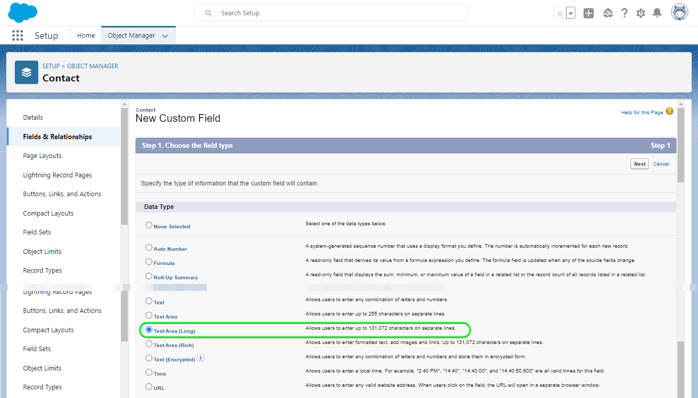

[!DNL Salesforce]、*手順2 - カスタムフィールドの詳細を入力する*でのカスタムフィールド作成の例を次に示します。
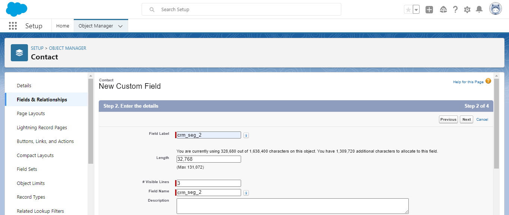

>[!TIP]
>
>* Experience Platform オーディエンスに使用されるカスタムフィールドと[!DNL Salesforce]内の他のカスタムフィールドを区別するには、カスタムフィールドの作成時に、認識可能な接頭辞または接尾辞を含めることができます。 例えば、`test_segment`の代わりに、`Adobe_test_segment`または`test_segment_Adobe`を使用します
>* 既に[!DNL Salesforce]で他のカスタムフィールドを作成している場合は、Experience Platform セグメントと同じ名前を使用して、[!DNL Salesforce]のオーディエンスを簡単に識別できます。

>[!NOTE]
>
>* Salesforceのオブジェクトは、25個の外部フィールドに制限されています。[&#x200B; カスタムフィールド属性](https://help.salesforce.com/s/articleView?id=sf.custom_field_attributes.htm&type=5)を参照してください。
>* この制限は、常に最大25人のExperience Platform オーディエンスメンバーシップをアクティブにすることができることを意味します。
>* Salesforce内でこの制限に達した場合は、新しい&#x200B;**[!UICONTROL Mapping ID]**&#x200B;を使用する前に、Experience Platform内の古いオーディエンスに対するオーディエンスステータスを保存するために使用されたカスタム属性をSalesforceから削除する必要があります。

#### [!DNL Salesforce CRM] 資格情報の収集 {#gather-credentials}

[!DNL Salesforce CRM]宛先に対する認証を行う前に、以下の項目をメモしてください。

| 資格情報 | 説明 | 例 |
| --- | --- | --- |
| `Username` | [!DNL Salesforce] アカウントのユーザー名。 | |
| `Password` | [!DNL Salesforce] アカウントのパスワード。 | |
| `Security Token` | 後で[!DNL Salesforce] パスワードの末尾に追加する[!DNL Salesforce] セキュリティトークンを使用して、**[!UICONTROL Password]**&#x200B;宛先[への認証時に](#authenticate)として使用する連結された文字列を作成します。  セキュリティトークンを持っていない場合に[!DNL Salesforce] インターフェイスからセキュリティトークンを再生成する方法については、[&#x200B; ドキュメントの](https://help.salesforce.com/s/articleView?id=sf.user_security_token.htm&type=5) リセット [!DNL Salesforce]を参照してください。 |  |
| `Custom Domain` | [!DNL Salesforce] ドメインのプレフィックス。   [[!DNL Salesforce]  インターフェイスからこの値を取得する方法については、](https://help.salesforce.com/s/articleView?id=sf.domain_name_setting_login_policy.htm&type=5) ドキュメント [!DNL Salesforce]を参照してください。 | [!DNL Salesforce] ドメインが の場合 *`d5i000000isb4eak-dev-ed`.my.salesforce.com*, 値として`d5i000000isb4eak-dev-ed`が必要です。 |
| `Client ID` | お使いのSalesforce `Consumer Key`。   [[!DNL Salesforce]  インターフェイスからこの値を取得する方法については、](https://help.salesforce.com/s/articleView?id=sf.connected_app_rotate_consumer_details.htm&type=5) ドキュメント [!DNL Salesforce]を参照してください。 | |
| `Client Secret` | お使いのSalesforce `Consumer Secret`。   [[!DNL Salesforce]  インターフェイスからこの値を取得する方法については、](https://help.salesforce.com/s/articleView?id=sf.connected_app_rotate_consumer_details.htm&type=5) ドキュメント [!DNL Salesforce]を参照してください。 | |

### ガードレール {#guardrails}

[!DNL Salesforce]は、リクエスト、レート、およびタイムアウトの制限を課すことによって、トランザクションの負荷を分散します。 詳しくは、[API リクエストの制限と割り当て](https://developer.salesforce.com/docs/atlas.en-us.salesforce_app_limits_cheatsheet.meta/salesforce_app_limits_cheatsheet/salesforce_app_limits_platform_api.htm)を参照してください。

[!DNL Salesforce] アカウント管理者がIP制限を適用している場合は、[Experience Platform IP アドレス &#x200B;](/help/destinations/catalog/streaming/ip-address-allow-list.md)を[!DNL Salesforce] アカウントの信頼できるIP範囲に追加する必要があります。 追加のガイダンスが必要な場合は、[!DNL Salesforce] [接続アプリの信頼できるIP範囲へのアクセスの制限](https://help.salesforce.com/s/articleView?id=sf.connected_app_edit_ip_ranges.htm&type=5) ドキュメントを参照してください。

>[!IMPORTANT]
>
>[&#x200B; セグメントをアクティブ化](#activate)する場合、*連絡先*&#x200B;または&#x200B;*リード* タイプのいずれかを選択する必要があります。 オーディエンスが、選択したタイプに応じた適切なデータマッピングを持っていることを確認する必要があります。

## サポートされる ID {#supported-identities}

[!DNL Salesforce CRM] では、以下の表で説明する ID の更新をサポートしています。[ID](/help/identity-service/features/namespaces.md) についての詳細情報。

| ターゲット ID | 説明 | 注意点 |
|---|---|---|
| `SalesforceId` | セグメントを通じてエクスポートまたは更新した連絡先またはリード IDの[!DNL Salesforce CRM]識別子。 | 必須 |

## サポートされるオーディエンス {#supported-audiences}

この節では、この宛先に書き出すことができるオーディエンスのタイプについて説明します。

| オーディエンスの由来 | サポートあり | 説明 |
|---------|----------|----------|
| [!DNL Segmentation Service] | ○ | Experience Platform [&#x200B; セグメント化サービス &#x200B;](../../../segmentation/home.md)を通じて生成されたオーディエンス。 |
| その他すべてのオーディエンスの生成元 | × | このカテゴリには、[!DNL Segmentation Service]を通じて生成されたオーディエンス以外のすべてのオーディエンスのオリジンが含まれます。 [様々なオーディエンスの起源](/help/segmentation/ui/audience-portal.md#customize)について読みます。 次に例を示します。 <ul><li> カスタムアップロードオーディエンス [がCSV ファイルからExperience Platformに](../../../segmentation/ui/audience-portal.md#import-audience)をインポートしました。</li><li> 類似オーディエンス， </li><li> 連合オーディエンス， </li><li> [!DNL Adobe Journey Optimizer]などの他のExperience Platform アプリで生成されたオーディエンス </li><li> その他。 </li></ul> |

{style="table-layout:auto"}

オーディエンスのデータタイプ別にサポートされるオーディエンス：

| オーディエンスのデータタイプ | サポートあり | 説明 | ユースケース |
|--------------------|-----------|-------------|-----------|
| [人物オーディエンス &#x200B;](/help/segmentation/types/people-audiences.md) | ○ | 顧客プロファイルにもとづいて、マーケティング施策の特定のグループをターゲットにすることができます。 | 買い物客やカートの放棄が多い |
| [&#x200B; アカウントオーディエンス &#x200B;](/help/segmentation/types/account-audiences.md) | × | アカウントベースドマーケティング戦略のために、特定の組織内の個人をターゲットにします。 | B2B マーケティング |
| [見込みオーディエンス &#x200B;](/help/segmentation/types/prospect-audiences.md) | × | まだ顧客ではないが、ターゲットオーディエンスと特徴を共有する個人をターゲットにします。 | サードパーティデータによる見込み顧客の開拓 |
| [&#x200B; データセットの書き出し](/help/catalog/datasets/overview.md) | × | [!DNL Adobe Experience Platform] データ レイクに保存されている構造化データのコレクション。 | レポート，データサイエンスワークフロー |

{style="table-layout:auto"}

## 書き出しのタイプと頻度 {#export-type-frequency}

宛先の書き出しタイプと頻度については、次の表を参照してください。

| 項目 | タイプ | メモ |
|---------|----------|---------|
| 書き出しタイプ | **[!UICONTROL Profile-based]** | <ul><li>セグメントのすべてのメンバーを、フィールドマッピングに従って、必要なスキーマフィールドと共に書き出します&#x200B;*（例：メールアドレス、電話番号、姓）*。</li><li> [!DNL Salesforce CRM]の各オーディエンスステータスは、**[!UICONTROL Mapping ID]** オーディエンススケジュール [手順で指定した](#schedule-segment-export-example)値に基づいて、Experience Platformからの対応するオーディエンスステータスで更新されます。</li></ul> |
| 書き出し頻度 | **[!UICONTROL Streaming]** | <ul><li>ストリーミングの宛先は常に、API ベースの接続です。オーディエンス評価に基づいて Experience Platform 内でプロファイルが更新されるとすぐに、コネクタは更新を宛先プラットフォームに送信します。詳しくは、[ストリーミングの宛先](/help/destinations/destination-types.md#streaming-destinations)を参照してください。</li></ul> |

{style="table-layout:auto"}

## 宛先への接続 {#connect}

>[!IMPORTANT]
>
>宛先に接続するには、**[!UICONTROL View Destinations]**&#x200B;および&#x200B;**[!UICONTROL Manage Destinations]** [&#x200B; アクセス制御権限](/help/access-control/home.md#permissions)が必要です。 詳しくは、[アクセス制御の概要](/help/access-control/ui/overview.md)または製品管理者に問い合わせて、必要な権限を取得してください。

この宛先に接続するには、[宛先設定のチュートリアル](../../ui/connect-destination.md)の手順に従ってください。宛先の設定ワークフローで、以下の 2 つのセクションにリストされているフィールドに入力します。

**[!UICONTROL Destinations]** > **[!UICONTROL Catalog]**&#x200B;内で[!DNL Salesforce CRM]を検索します。 または、**[!UICONTROL CRM]** カテゴリの下に配置することもできます。

### 宛先に対する認証 {#authenticate}

宛先に対して認証を行うには、以下の必須フィールドに入力し、**[!UICONTROL Connect to destination]**&#x200B;を選択します。 ガイダンスについては、[収集 [!DNL Salesforce CRM] 資格情報](#gather-credentials) セクションを参照してください。

| 資格情報 | 説明 |
| --- | --- |
| **[!UICONTROL Username]** | [!DNL Salesforce] アカウントのユーザー名。 |
| **[!UICONTROL Password]** | [!DNL Salesforce] アカウントのパスワードと[!DNL Salesforce] セキュリティ トークンで構成される連結された文字列。 連結された値は`{PASSWORD}{TOKEN}`の形式になります。 注意：中括弧やスペースは使用しないでください。 例えば、[!DNL Salesforce] パスワードが`MyPa$$w0rd123`、[!DNL Salesforce] セキュリティ トークンが`TOKEN12345....0000`の場合、**[!UICONTROL Password]** フィールドで使用する連結された値は`MyPa$$w0rd123TOKEN12345....0000`です。 |
| **[!UICONTROL Custom Domain]** | [!DNL Salesforce] ドメインのプレフィックス。  例えば、ドメインが&#x200B;*`d5i000000isb4eak-dev-ed`.my.salesforce.com*&#x200B;の場合、値として`d5i000000isb4eak-dev-ed`を指定する必要があります。 |
| **[!UICONTROL Client ID]** | [!DNL Salesforce]がアプリ `Consumer Key`に接続しました。 |
| **[!UICONTROL Client Secret]** | [!DNL Salesforce]がアプリ `Consumer Secret`に接続しました。 |

認証方法を示す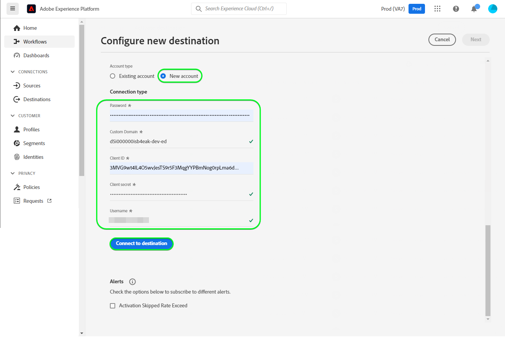

指定された詳細が有効な場合、UIに緑色のチェックマークが付いた&#x200B;**[!UICONTROL Connected]** ステータスが表示され、次の手順に進むことができます。

### 宛先の詳細を入力 {#destination-details}

宛先の詳細を設定するには、以下の必須フィールドとオプションフィールドに入力します。UI のフィールドの横のアスタリスクは、そのフィールドが必須であることを示します。

* **[!UICONTROL Name]**：今後この宛先を認識する際に使用する名前。
* **[!UICONTROL Description]**：今後この宛先を特定するのに役立つ説明です。
* **[!UICONTROL Salesforce ID Type]**：

   * 書き出しまたは更新するIDが&#x200B;**[!UICONTROL Contact]**&#x200B;連絡先&#x200B;*の種類である場合は、*&#x200B;を選択します。
   * 書き出しまたは更新するIDがタイプ **[!UICONTROL Lead]** リード *である場合は、*&#x200B;を選択します。

宛先の詳細を示す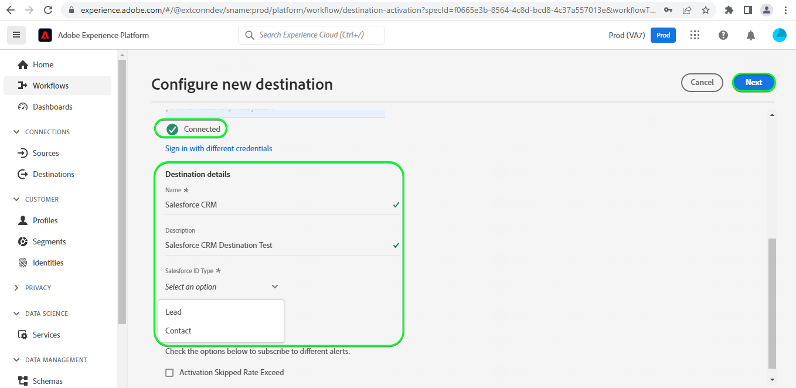

### アラートの有効化 {#enable-alerts}

アラートを有効にすると、宛先へのデータフローのステータスに関する通知を受け取ることができます。リストからアラートを選択して、データフローのステータスに関する通知を受け取るよう登録します。アラートについて詳しくは、[UI を使用した宛先アラートの購読](../../ui/alerts.md)についてのガイドを参照してください。

宛先接続の詳細の提供が完了したら、**[!UICONTROL Next]**&#x200B;を選択します。

## この宛先に対してオーディエンスをアクティブ化 {#activate}

>[!IMPORTANT]
>
>* データをアクティブ化するには、**[!UICONTROL View Destinations]**、**[!UICONTROL Activate Destinations]**、**[!UICONTROL View Profiles]**&#x200B;および&#x200B;**[!UICONTROL View Segments]** [&#x200B; アクセス制御権限](/help/access-control/home.md#permissions)が必要です。 [アクセス制御の概要](/help/access-control/ui/overview.md)を参照するか、製品管理者に問い合わせて必要な権限を取得してください。
>* *ID*&#x200B;をエクスポートするには、**[!UICONTROL View Identity Graph]** [&#x200B; アクセス制御権限](/help/access-control/home.md#permissions)が必要です。  {width="100" zoomable="yes"}

この宛先にオーディエンスをアクティベートする手順は、[ストリーミングオーディエンスの書き出し宛先へのプロファイルとオーディエンスのアクティベート](/help/destinations/ui/activate-segment-streaming-destinations.md)を参照してください。

### マッピングの考慮事項と例 {#mapping-considerations-example}

オーディエンスデータを[!DNL Adobe Experience Platform]から[!DNL Salesforce CRM]宛先に正しく送信するには、フィールドマッピング手順を実行する必要があります。 マッピングでは、Experience Platform アカウントのExperience Data Model （XDM）スキーマフィールドと、ターゲット先の対応するスキーマフィールドとの間にリンクを作成します。

**[!UICONTROL Target field]**&#x200B;で指定された属性には、属性マッピング テーブルで説明されているとおりの名前を付ける必要があります。これらの属性はリクエスト本文を形成します。

**[!UICONTROL Source field]**&#x200B;で指定された属性は、そのような制限に従っていません。 必要に応じてマッピングできますが、入力データの形式が[[!DNL Salesforce]  ドキュメント &#x200B;](https://help.salesforce.com/s/articleView?id=sf.custom_field_attributes.htm&type=5)に従って有効であることを確認してください。 入力データが無効な場合、[!DNL Salesforce]への更新呼び出しは失敗し、連絡先/リードは更新されません。

XDM フィールドを [!DNL (API) Salesforce CRM] 宛先フィールドに正しくマッピングするには、次の手順に従います。

1. **[!UICONTROL Mapping]** ステップで「**[!UICONTROL Add new mapping]**」を選択すると、新しいマッピング行が画面に表示されます。
   
1. **[!UICONTROL Select source field]** ウィンドウで、**[!UICONTROL Select attributes]** カテゴリを選択してXDM属性を選択するか、**[!UICONTROL Select identity namespace]**&#x200B;を選択してIDを選択します。
1. **[!UICONTROL Select target field]** ウィンドウで、**[!UICONTROL Select identity namespace]**&#x200B;を選択してIDを選択するか、**[!UICONTROL Select custom attributes]** カテゴリを選択し、属性を選択するか、必要に応じて&#x200B;**[!UICONTROL Attribute name]** フィールドを使用して属性を定義します。 サポートされる属性に関するガイダンスについては、[[!DNL Salesforce CRM]  ドキュメント &#x200B;](https://help.salesforce.com/s/articleView?id=sf.custom_field_attributes.htm&type=5)を参照してください。
   * これらの手順を繰り返して、XDM プロファイルスキーマと[!DNL (API) Salesforce CRM]の間に次のマッピングを追加します。

   **連絡先の操作**

   * セグメント内の&#x200B;*取引先責任者*&#x200B;と作業している場合は、[取引先責任者](https://developer.salesforce.com/docs/atlas.en-us.object_reference.meta/object_reference/sforce_api_objects_contact.htm)のSalesforceのオブジェクト参照を参照して、更新するフィールドのマッピングを定義してください。
   * 必須フィールドを識別するには、上記のリンクのフィールド説明に記載されている&#x200B;*必須*&#x200B;という単語を検索します。
   * 書き出しまたは更新するフィールドに応じて、XDM プロファイルスキーマと[!DNL (API) Salesforce CRM]の間にマッピングを追加します。

     | ソースフィールド | ターゲットフィールド | メモ |
     | --- | --- | --- |
     | `IdentityMap: crmID` | `Identity: SalesforceId` | `Mandatory` |
     | `xdm: person.name.lastName` | `Attribute: LastName` | `Mandatory`をインストールします。80文字までの連絡先の姓。 |
     | `xdm: person.name.firstName` | `Attribute: FirstName` | 連絡先の名前（40文字まで）。 |
     | `xdm: personalEmail.address` | `Attribute: Email` | 連絡先のメールアドレス。 |

   * これらのマッピングの使用例を次に示します。
     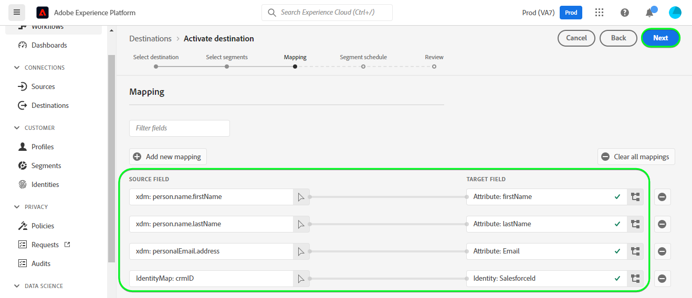

   **リードの操作**

   * セグメント内で&#x200B;*リード*&#x200B;を操作している場合は、[&#x200B; リード &#x200B;](https://developer.salesforce.com/docs/atlas.en-us.object_reference.meta/object_reference/sforce_api_objects_lead.htm)のSalesforceのオブジェクト参照を参照して、更新するフィールドのマッピングを定義してください。
   * 必須フィールドを識別するには、上記のリンクのフィールド説明に記載されている&#x200B;*必須*&#x200B;という単語を検索します。
   * 書き出しまたは更新するフィールドに応じて、XDM プロファイルスキーマと[!DNL (API) Salesforce CRM]の間にマッピングを追加します。

     | ソースフィールド | ターゲットフィールド | メモ |
     | --- | --- | --- |
     | `IdentityMap: crmID` | `Identity: SalesforceId` | `Mandatory` |
     | `xdm: person.name.lastName` | `Attribute: LastName` | `Mandatory`をインストールします。80文字までのリードの姓。 |
     | `xdm: b2b.companyName` | `Attribute: Company` | `Mandatory`をインストールします。リードの会社。 |
     | `xdm: personalEmail.address` | `Attribute: Email` | リードのメールアドレス。 |

   * これらのマッピングの使用例を次に示します。
     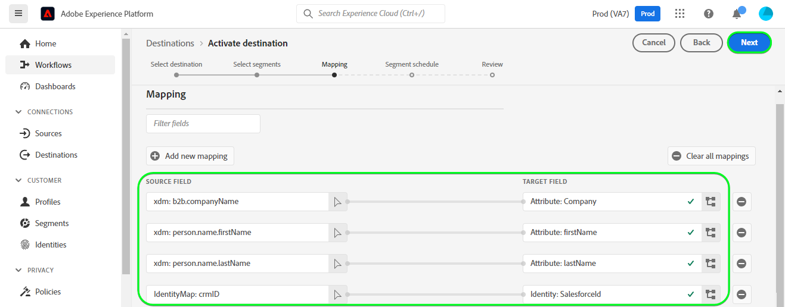

宛先接続のマッピングの提供が完了したら、**[!UICONTROL Next]**&#x200B;を選択します。

### オーディエンスの書き出しのスケジュールと例 {#schedule-segment-export-example}

[&#x200B; オーディエンスの書き出しをスケジュール &#x200B;](/help/destinations/ui/activate-segment-streaming-destinations.md#scheduling)する手順を実行する場合、Experience Platformからアクティブ化されたオーディエンスを、[!DNL Salesforce]の対応するカスタムフィールドに手動でマッピングする必要があります。

これを行うには、各セグメントを選択し、[!DNL Salesforce] [!DNL Salesforce CRM] フィールドに&#x200B;**[!UICONTROL Mapping ID]**&#x200B;のカスタムフィールド名を入力します。 [でのカスタムフィールドの作成に関するガイダンスとベストプラクティスについては、 [!DNL Salesforce]](#prerequisites-custom-field)内の[!DNL Salesforce] カスタムフィールドの作成の節を参照してください。

例えば、[!DNL Salesforce] カスタムフィールドが`crm_2_seg`の場合、[!DNL Salesforce CRM] **[!UICONTROL Mapping ID]**&#x200B;にこの値を指定して、Experience Platformのオーディエンスオーディエンスをこのカスタムフィールドに入力します。

[!DNL Salesforce]のカスタムフィールドの例を次に示します。
カスタムフィールドを示す![[!DNL Salesforce] UI スクリーンショット。](../../assets/catalog/crm/salesforce/salesforce-custom-field.png)

[!DNL Salesforce CRM] **[!UICONTROL Mapping ID]**&#x200B;の場所を示す例を次に示します。
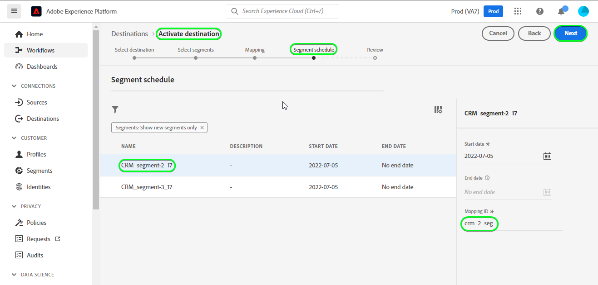

上に示すように、[!DNL Salesforce] **[!UICONTROL Field Name]**&#x200B;は[!DNL Salesforce CRM] **[!UICONTROL Mapping ID]**&#x200B;内で指定された値と完全に一致します。

ユースケースに応じて、アクティブ化されたすべてのオーディエンスを、同じ[!DNL Salesforce] カスタムフィールドまたは&#x200B;**[!UICONTROL Field Name]**&#x200B;の異なる[!DNL Salesforce CRM]にマッピングできます。 上記の画像に基づく典型的な例を以下に示す。

| [!DNL Salesforce CRM] セグメント名 | [!DNL Salesforce] **[!UICONTROL Field Name]** | [!DNL Salesforce CRM] **[!UICONTROL Mapping ID]** |
| --- | --- | --- |
| crm_1_seg | `crm_1_seg` | `crm_1_seg` |
| crm_2_seg | `crm_2_seg` | `crm_2_seg` |

アクティブ化されたExperience Platform セグメントごとに、このセクションを繰り返します。

## データの書き出しを検証する {#exported-data}

宛先が正しく設定されていることを検証するには、次の手順に従います。

1. 宛先のリストに移動するには、**[!UICONTROL Destinations]** > **[!UICONTROL Browse]**&#x200B;を選択します。
   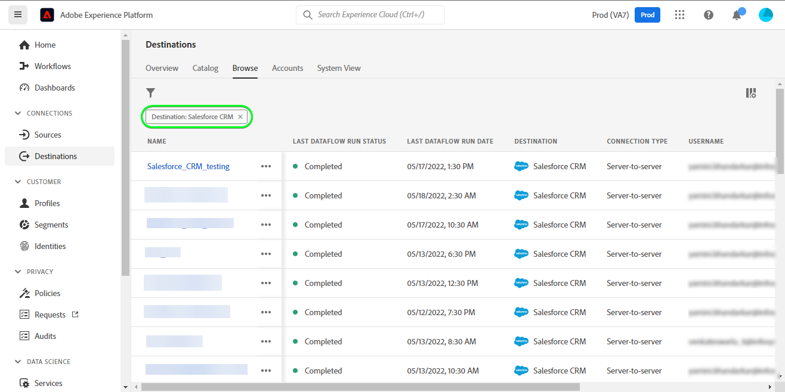

1. 宛先を選択し、ステータスが&#x200B;**[!UICONTROL enabled]**&#x200B;であることを検証します。
   宛先データフロー実行を示す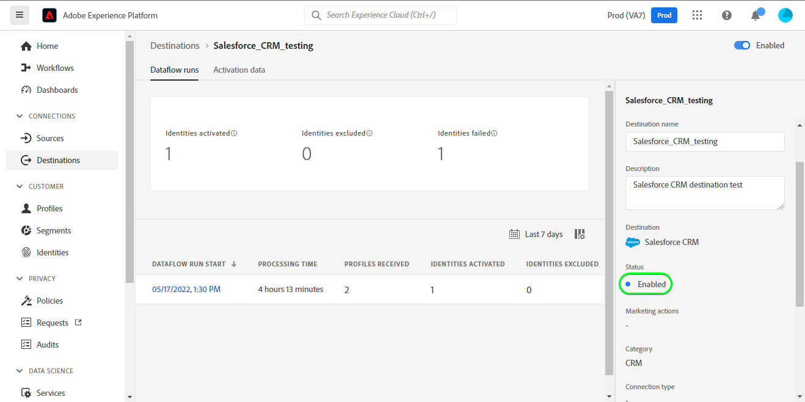

1. 「**[!UICONTROL Activation data]**」タブに切り替えて、オーディエンス名を選択します。
   宛先アクティベーションデータを示す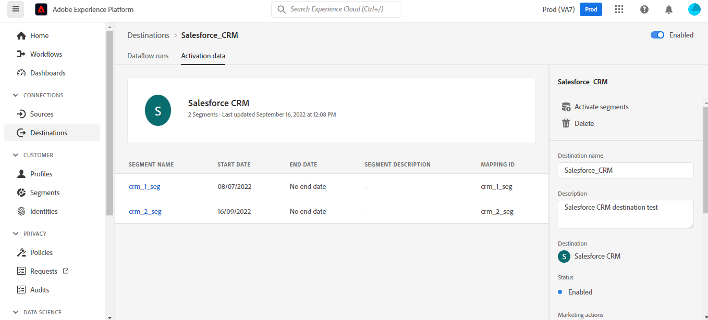

1. オーディエンスの概要を監視し、プロファイルの数がセグメント内で作成された数に対応していることを確認します。
   セグメントを示す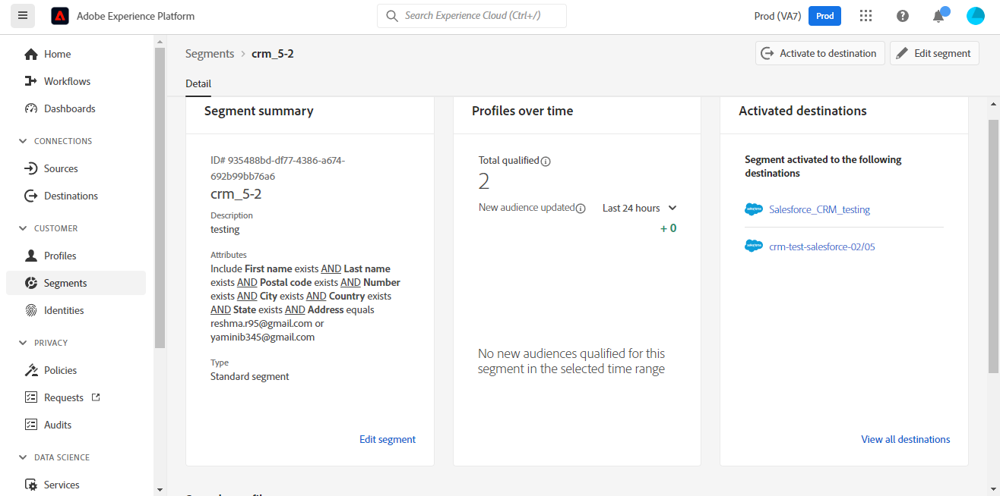

1. 最後に、Salesforceのweb サイトに移動し、オーディエンスのプロファイルが更新されているかどうかを検証します。

   **連絡先の操作**

   * Experience Platform セグメント内で&#x200B;*連絡先*&#x200B;を選択した場合は、**[!DNL Apps]** > **[!DNL Contacts]** ページに移動します。
     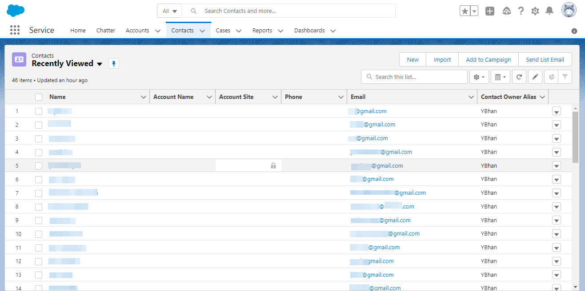

   * *連絡先*&#x200B;を選択し、フィールドが更新されているかどうかを確認します。 [!DNL Salesforce CRM]の各オーディエンスステータスが、**[!UICONTROL Mapping ID]** オーディエンススケジュール [中に提供された](#schedule-segment-export-example)値に基づいて、Experience Platformからの対応するオーディエンスステータスで更新されていることがわかります。
     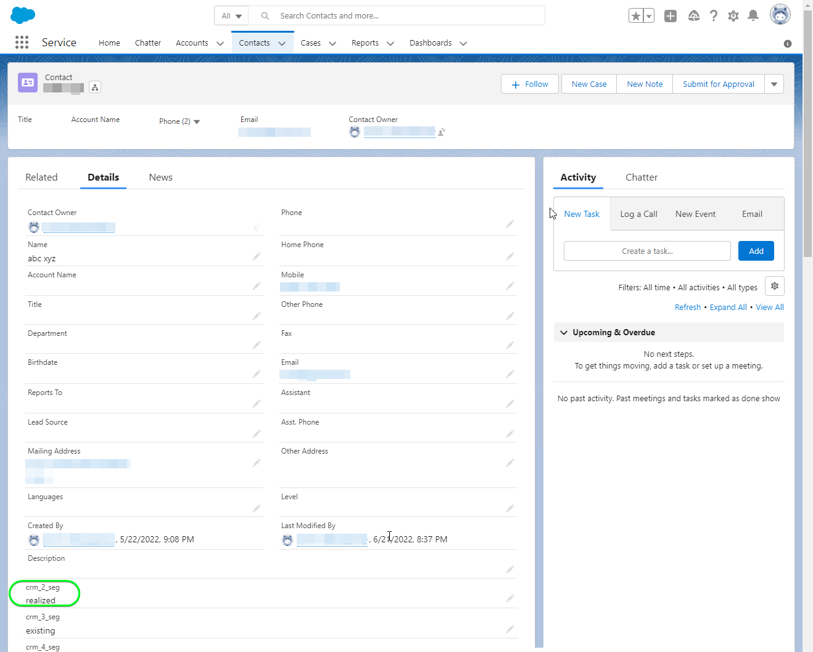

   **リードの操作**

   * Experience Platform セグメント内で&#x200B;*リード*&#x200B;を選択した場合は、**[!DNL Apps]** > **[!DNL Leads]** ページに移動します。
     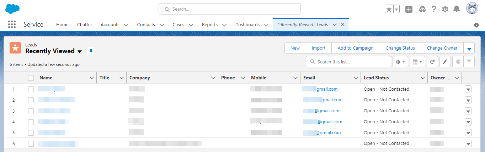

   * *リード*&#x200B;を選択し、フィールドが更新されているかどうかを確認します。 [!DNL Salesforce CRM]の各オーディエンスステータスが、**[!UICONTROL Mapping ID]** オーディエンススケジュール [中に提供された](#schedule-segment-export-example)値に基づいて、Experience Platformからの対応するオーディエンスステータスで更新されていることがわかります。
     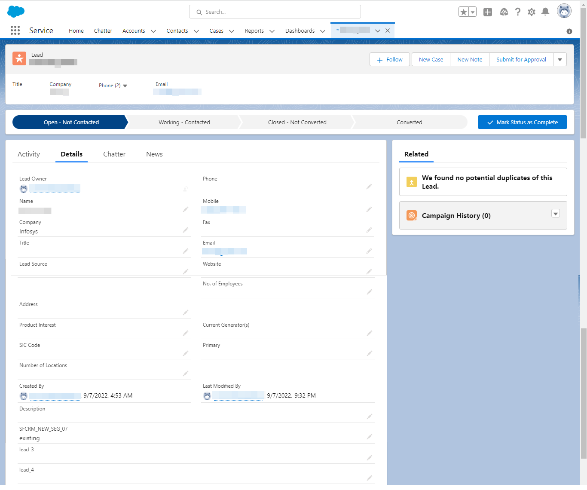

## データの使用とガバナンス {#data-usage-governance}

[!DNL Adobe Experience Platform] のすべての宛先は、データを処理する際のデータ使用ポリシーに準拠しています。[!DNL Adobe Experience Platform] がどのようにデータガバナンスを実施するかについて詳しくは、[データガバナンスの概要](/help/data-governance/home.md)を参照してください。

## エラーとトラブルシューティング {#errors-and-troubleshooting}

### イベントを宛先にプッシュ中に不明なエラーが発生しました {#unknown-errors}

* データフロー実行を確認する際に、次のエラーメッセージが表示される場合があります：`Unknown errors encountered while pushing events to the destination. Please contact the administrator and try again.`
  エラーを示す

   * このエラーを修正するには、アクティベーションワークフローで&#x200B;**[!UICONTROL Mapping ID]**&#x200B;宛先に指定した[!DNL Salesforce CRM]が、[!DNL Salesforce]で作成したカスタムフィールドタイプの値と完全に一致することを確認してください。 ガイダンスについては、[内の [!DNL Salesforce]](#prerequisites-custom-field) カスタムフィールドの作成の節を参照してください。

* セグメントをアクティブ化すると、次のエラーメッセージが表示される場合があります：`The client's IP address is unauthorized for this account. Allowlist the client's IP address...`
   * このエラーを修正するには、[!DNL Salesforce] アカウント管理者に連絡して、[Experience Platform IP アドレス &#x200B;](/help/destinations/catalog/streaming/ip-address-allow-list.md)を[!DNL Salesforce] アカウントの信頼できるIP範囲に追加してください。 追加のガイダンスが必要な場合は、[!DNL Salesforce] [接続アプリの信頼できるIP範囲へのアクセスの制限](https://help.salesforce.com/s/articleView?id=sf.connected_app_edit_ip_ranges.htm&type=5) ドキュメントを参照してください。

## その他のリソース {#additional-resources}

[Salesforce デベロッパーポータル &#x200B;](https://developer.salesforce.com/)の役に立つ追加情報を以下に示します。

* [クイックスタート](https://developer.salesforce.com/docs/atlas.en-us.api_rest.meta/api_rest/quickstart.htm)
* [&#x200B; レコードを作成](https://developer.salesforce.com/docs/atlas.en-us.api_rest.meta/api_rest/dome_sobject_create.htm)
* [&#x200B; カスタムレコメンデーションオーディエンス &#x200B;](https://developer.salesforce.com/docs/atlas.en-us.236.0.chatterapi.meta/chatterapi/connect_resources_recommendation_audiences_list.htm)
* [複合リソースの使用](https://developer.salesforce.com/docs/atlas.en-us.api_rest.meta/api_rest/using_composite_resources.htm?q=composite)
* この宛先では、[単一レコードのアップサート &#x200B;](https://developer.salesforce.com/docs/atlas.en-us.api_rest.meta/api_rest/resources_composite_sobjects_collections_update.htm) API呼び出しではなく、[複数レコードのアップサート &#x200B;](https://developer.salesforce.com/docs/atlas.en-us.api_rest.meta/api_rest/dome_composite_upsert_example.htm?q=contacts) APIを利用します。
