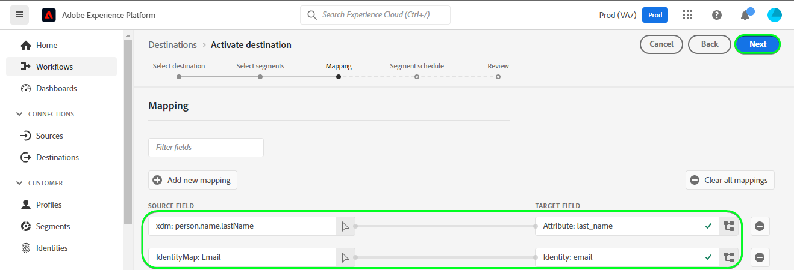

# [!DNL Zendesk] 接続

[[!DNL Zendesk]](https://www.zendesk.co.jp) は、カスタマーサービスソリューションおよびセールスツールです。 

この [!DNL Adobe Experience Platform] [宛先](/help/destinations/home.md) は、 [[!DNL Zendesk] 連絡先 API](https://developer.zendesk.com/api-reference/sales-crm/resources/contacts/)、宛先 **id の作成と更新** 内の連絡先としてオーディエンス内に [!DNL Zendesk].

[!DNL Zendesk] は、bearer トークンを認証メカニズムとして使用し、 [!DNL Zendesk] 連絡先 API [!DNL Zendesk] インスタンスを認証する手順は、さらに下の[宛先に対する認証](#authenticate)の節にあります。

## ユースケース {#use-cases}

マルチチャネル B2C プラットフォームのカスタマーサービス部門は、顧客に対してシームレスにパーソナライズされたエクスペリエンスを提供したいと考えています。 部門は、独自のオフラインデータからオーディエンスを構築して、新しいユーザープロファイルを作成したり、異なるインタラクション（購入、返品など）から既存のプロファイル情報を更新したりできます。 およびAdobe Experience Platformからにこれらのオーディエンスを送信 [!DNL Zendesk]. に更新された情報がある [!DNL Zendesk] カスタマーサービスエージェントが顧客の最新の情報をすぐに利用できるようにし、迅速な対応と解決を可能にします。

## 前提条件 {#prerequisites}

### Experience Platform の前提条件 {#prerequisites-in-experience-platform}

[!DNL Zendesk] 宛先へのデータをアクティブ化する前に、[スキーマ](/help/xdm/schema/composition.md)、[データセット](https://experienceleague.adobe.com/docs/platform-learn/tutorials/data-ingestion/create-datasets-and-ingest-data.html?lang=ja)および[セグメント](https://experienceleague.adobe.com/docs/platform-learn/tutorials/segments/create-segments.html?lang=ja)を [!DNL Experience Platform] で作成する必要があります。

詳しくは、Experience Platformドキュメントを参照してください。 [オーディエンスメンバーシップ詳細スキーマフィールドグループ](/help/xdm/field-groups/profile/segmentation.md) オーディエンスのステータスに関するガイダンスが必要な場合は、を参照してください。

### [!DNL Zendesk] 前提条件 {#prerequisites-destination}

Platform からにデータを書き出すには、以下を実行します。 [!DNL Zendesk] アカウントに [!DNL Zendesk] アカウント。

#### [!DNL Zendesk] 資格情報の収集 {#gather-credentials}

[!DNL Zendesk] 宛先に対して認証を行う前に、以下の項目をメモしておきます。

| 資格情報 | 説明 | 例 |
| --- | --- | --- |
| `Bearer token` | が [!DNL Zendesk] アカウント。   ドキュメントに従って、 [を生成する [!DNL Zendesk] アクセストークン](https://developer.zendesk.com/documentation/sales-crm/first-call/#1-generate-an-access-token) もし持っていなければ | `a0b1c2d3e4...v20w21x22y23z` |

## ガードレール {#guardrails}

The [価格とレート制限](https://developer.zendesk.com/api-reference/sales-crm/rate-limits/#pricing) ページの詳細 [!DNL Zendesk] アカウントに関連付けられた API 制限。 データとペイロードがこれらの制約内にあることを確認する必要があります。

## サポートされる ID {#supported-identities}

[!DNL Zendesk] では、以下の表で説明する ID の更新をサポートしています。[ID](/help/identity-service/namespaces.md) についての詳細情報。

| ターゲット ID | 例 | 説明 | 必須 |
|---|---|---|---|
| `email` | `test@test.com` | 連絡先の電子メールアドレス。 | ○ |

## 書き出しのタイプと頻度 {#export-type-frequency}

宛先の書き出しのタイプと頻度について詳しくは、以下の表を参照してください。

| 項目 | タイプ | メモ |
---------|----------|---------|
| 書き出しタイプ | **[!UICONTROL プロファイルベース]** | <ul><li>セグメントのすべてのメンバーを、フィールドマッピングに従って、必要なスキーマフィールドと共に書き出します&#x200B;*（例：メールアドレス、電話番号、姓）*。</li><li> 各セグメントのステータス ( [!DNL Zendesk] は、 **[!UICONTROL マッピング ID]** 期間中に指定された値 [オーディエンススケジュール](#schedule-segment-export-example) 手順</li></ul> |
| 書き出し頻度 | **[!UICONTROL ストリーミング]** | <ul><li>ストリーミングの宛先は常に、API ベースの接続です。オーディエンス評価に基づいて Experience Platform 内でプロファイルが更新されるとすぐに、コネクタは更新を宛先プラットフォームに送信します。詳しくは、[ストリーミングの宛先](/help/destinations/destination-types.md#streaming-destinations)を参照してください。</li></ul> |

{style="table-layout:auto"}

## 宛先への接続 {#connect}

>[!IMPORTANT]
>
>宛先に接続するには、**[!UICONTROL 宛先の管理]** [アクセス制御権限](/help/access-control/home.md#permissions)が必要です。詳しくは、[アクセス制御の概要](/help/access-control/ui/overview.md)または製品管理者に問い合わせて、必要な権限を取得してください。

この宛先に接続するには、[宛先設定のチュートリアル](../../ui/connect-destination.md)の手順に従ってください。宛先の設定ワークフローで、以下の 2 つのセクションにリストされているフィールドに入力します。

**[!UICONTROL 宛先]**／**[!UICONTROL カタログ]**&#x200B;内で [!DNL Zendesk] を検索します。または、**[!UICONTROL CRM]** カテゴリの下に配置することもできます。

### 宛先に対する認証 {#authenticate}

以下の必須のフィールドに入力します。詳しくは、[ [!DNL Zendesk]  資格情報の収集](#gather-credentials)の節を参照してください。
* **[!UICONTROL Bearer トークン]**: [!DNL Zendesk] アカウント。

宛先を認証するには、「 **[!UICONTROL 宛先に接続]**」を選択します。

指定した詳細が有効な場合、UI で&#x200B;**[!UICONTROL 接続済み]**&#x200B;ステータスに緑色のチェックマークが付きます。その後、次の手順に進むことができます。

### 宛先の詳細を入力 {#destination-details}

宛先の詳細を設定するには、以下の必須フィールドとオプションフィールドに入力します。UI のフィールドの横にアスタリスクが表示される場合は、そのフィールドが必須であることを示します。

* **[!UICONTROL 名前]**：今後この宛先を認識するための名前。
* **[!UICONTROL 説明]**：今後この宛先を識別するのに役立つ説明。

### アラートの有効化 {#enable-alerts}

アラートを有効にすると、宛先へのデータフローのステータスに関する通知を受け取ることができます。リストからアラートを選択して、データフローのステータスに関する通知を受け取るよう登録します。アラートについて詳しくは、[UI を使用した宛先アラートの購読](../../ui/alerts.md)についてのガイドを参照してください。

宛先接続の詳細の入力を終えたら「**[!UICONTROL 次へ]**」を選択します。

## この宛先に対してオーディエンスをアクティブ化 {#activate}

>[!IMPORTANT]
> 
>* データをアクティブ化するには、**[!UICONTROL 宛先の管理]**、**[!UICONTROL 宛先のアクティブ化]**、**[!UICONTROL プロファイルの表示]**&#x200B;および&#x200B;**[!UICONTROL セグメントの表示]** [に対するアクセス制御権限](/help/access-control/home.md#permissions)が必要です。詳しくは、[アクセス制御の概要](/help/access-control/ui/overview.md)または製品管理者に問い合わせて、必要な権限を取得してください。
>* 書き出す *id*、 **[!UICONTROL ID グラフを表示]** [アクセス制御権限](/help/access-control/home.md#permissions).   {width="100" zoomable="yes"}

この宛先にオーディエンスをアクティベートする手順は、[ストリーミングオーディエンスの書き出し宛先へのプロファイルとオーディエンスのアクティベート](/help/destinations/ui/activate-segment-streaming-destinations.md)を参照してください。

### マッピングの考慮事項と例 {#mapping-considerations-example}

Adobe Experience Platform から [!DNL Zendesk] 宛先にオーディエンスデータを正しく送信するには、フィールドマッピングの手順を実行する必要があります。マッピングは、Platform アカウント内の Experience Data Model（XDM）スキーマフィールドと、ターゲット宛先から対応する同等のスキーマフィールドとの間にリンクを作成して構成されます。 

で指定された属性 **[!UICONTROL ターゲットフィールド]** は、属性マッピングテーブルで説明されたとおりに名前を付ける必要があります。これらの属性は、リクエスト本文を形成します。

で指定された属性 **[!UICONTROL ソースフィールド]** このような制限に従わないでください。 ただし、にプッシュした際にデータ形式が正しくない場合は、必要に応じてマッピングできます。 [!DNL Zendesk] これはエラーを引き起こします。

XDM フィールドを [!DNL Zendesk] 宛先フィールドに正しくマッピングするには、次の手順に従います。

1. **[!UICONTROL マッピング]**&#x200B;手順で、「**[!UICONTROL 新しいマッピングを追加]**」を選択します。画面に新しいマッピング行が表示されます。
1. Adobe Analytics の **[!UICONTROL ソースフィールドを選択]** ウィンドウで、 **[!UICONTROL 属性を選択]** カテゴリを選択して XDM 属性を選択するか、 **[!UICONTROL ID 名前空間を選択]** ID を選択します。
1. Adobe Analytics の **[!UICONTROL ターゲットフィールドを選択]** ウィンドウで、 **[!UICONTROL ID 名前空間を選択]** カテゴリを選択してターゲット id を選択するか、 **[!UICONTROL 属性を選択]** カテゴリを選択し、サポートされているスキーマ属性の 1 つを選択します。
   * これらの手順を繰り返して、次の必須マッピングを追加します。XDM プロファイルスキーマと [!DNL Zendesk] インスタンス： |ソースフィールド|ターゲットフィールド|必須| |—|—|—| |`xdm: person.name.lastName`|`xdm: last_name`|はい | |`IdentityMap: Email`|`Identity: email`|はい | |`xdm: person.name.firstName`|`xdm: first_name`| |

   * これらのマッピングの使用例を次に示します。
     

>[!IMPORTANT]
>
>The `Attribute: last_name` および `Identity: email` この宛先では、ターゲットマッピングは必須です。 これらのマッピングが見つからない場合、他のマッピングは無視され、には送信されません。 [!DNL Zendesk].

宛先接続のマッピングの指定が完了したら、「 」を選択します。 **[!UICONTROL 次へ]**.

### オーディエンスのエクスポートと例のスケジュール設定 {#schedule-segment-export-example}

Adobe Analytics の [[!UICONTROL オーディエンスの書き出しをスケジュール]](/help/destinations/ui/activate-segment-streaming-destinations.md#scheduling) アクティベーションワークフローの手順では、Platform オーディエンスを、 [!DNL Zendesk].

これを行うには、各セグメントを選択し、対応するカスタムフィールド属性を [!DNL Zendesk] の「**[!UICONTROL マッピング ID]**」フィールドから入力します。

次に例を示します。

## データの書き出しを検証する {#exported-data}

宛先が正しく設定されていることを検証するには、次の手順に従います。

1. 選択 **[!UICONTROL 宛先]** > **[!UICONTROL 参照]** をクリックし、宛先のリストに移動します。
1. 次に、宛先を選択し、 **[!UICONTROL アクティベーションデータ]** 」タブをクリックし、オーディエンス名を選択します。
   

1. オーディエンスの概要を監視し、プロファイルの数がセグメント内の数に対応していることを確認します。
   

1. にログインします。 [!DNL Zendesk] web サイトに移動し、 **[!UICONTROL 連絡先]** ページを使用して、オーディエンスからのプロファイルが追加されたかどうかを確認します。 このリストは、オーディエンスで作成された追加のフィールドの列を表示するように設定できます**[!UICONTROL マッピング ID]**およびオーディエンスのステータス。
   

1. 別の方法として、個人にドリルダウンすることもできます。 **[!UICONTROL 人物]** ページを開き、 **[!UICONTROL 追加のフィールド]** オーディエンス名とオーディエンスのステータスを表示するセクション
   

## データの使用とガバナンス {#data-usage-governance}

[!DNL Adobe Experience Platform] のすべての宛先は、データを処理する際のデータ使用ポリシーに準拠しています。[!DNL Adobe Experience Platform] がどのようにデータガバナンスを実施するかについて詳しくは、[データガバナンスの概要](/help/data-governance/home.md)を参照してください。

## その他のリソース {#additional-resources}

[!DNL Zendesk] ドキュメントからのその他の役に立つ情報は次のとおりです。
* [最初の呼び出し](https://developer.zendesk.com/documentation/sales-crm/first-call/)
* [カスタムフィールド](https://developer.zendesk.com/api-reference/sales-crm/requests/#custom-fields)

### 変更ログ

この節では、この宛先コネクタに対する機能の概要と重要なドキュメントの更新について説明します。

+++ 変更ログを表示

| リリース月 | 更新タイプ | 説明 |
|---|---|---|
| 2023年4月 | ドキュメントの更新 | <ul><li>更新： [使用例](#use-cases) の節を参照し、この宛先を使用した方がメリットが得られるタイミングの例をより明確に示します。</li> <li>更新： [マッピング](#mapping-considerations-example) 」セクションで、正しい必須マッピングを反映させる必要があります。 The `Attribute: last_name` および `Identity: email` この宛先では、ターゲットマッピングは必須です。 これらのマッピングが見つからない場合、他のマッピングは無視され、には送信されません。 [!DNL Zendesk].</li> <li>更新： [マッピング](#mapping-considerations-example) 節に、必須とオプションの両方のマッピングの明確な例を示します。</li></ul> |
| 2023年3月 | 初回リリース | 宛先の初回リリースとドキュメントの公開。 |

{style="table-layout:auto"}

+++
