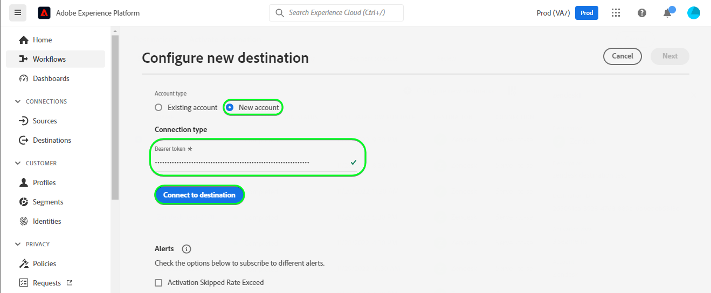
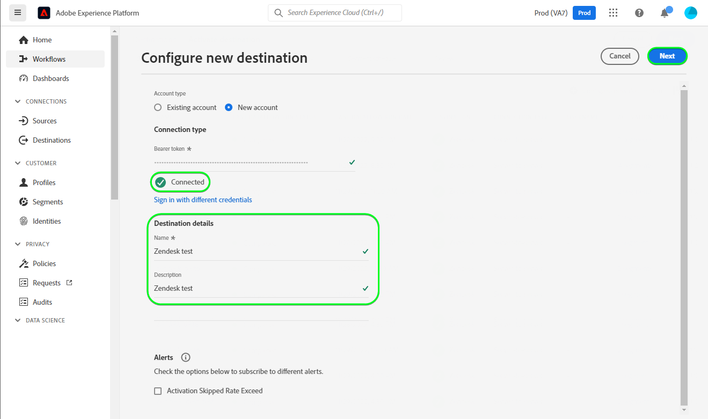
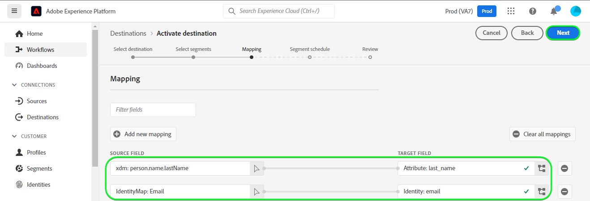
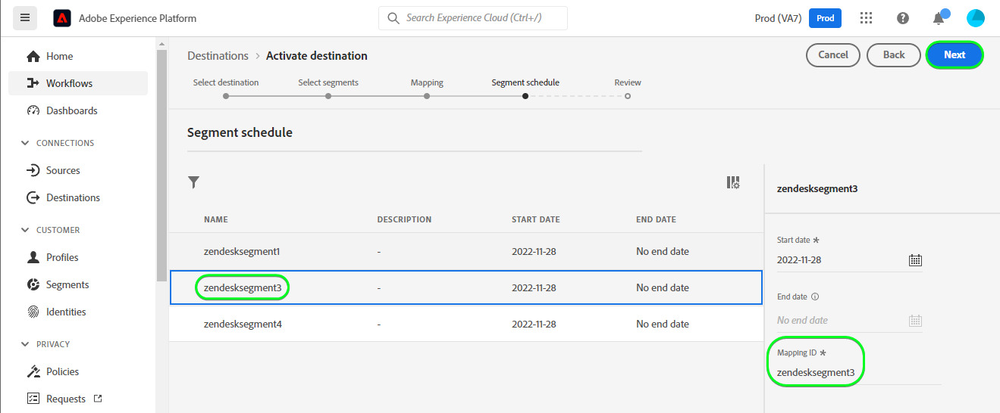
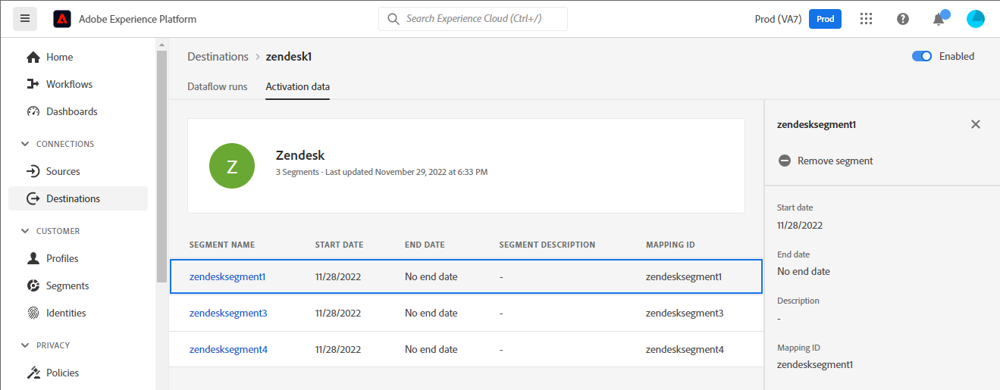
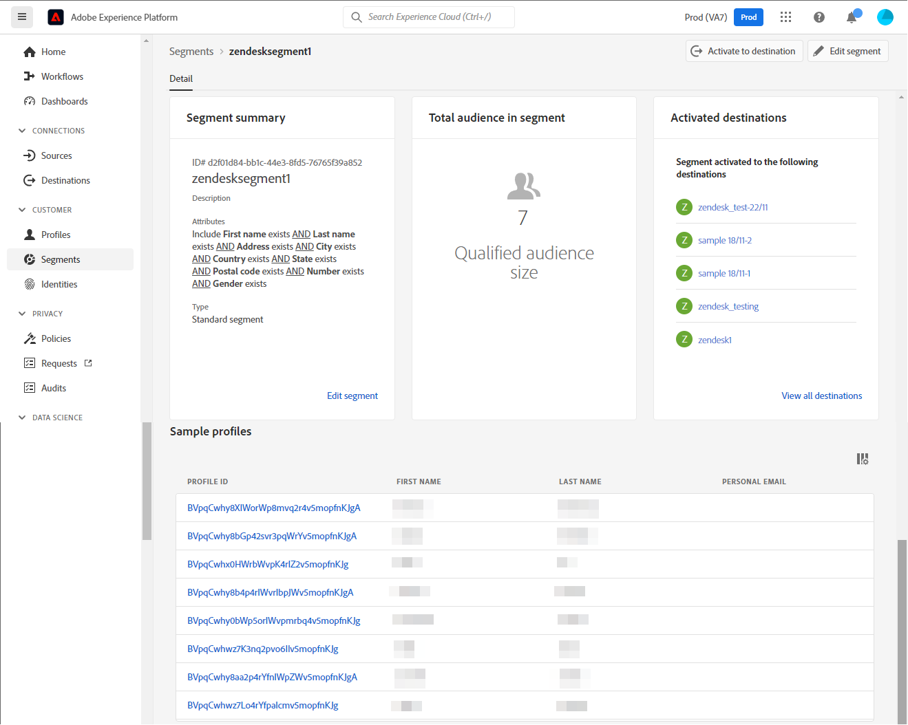
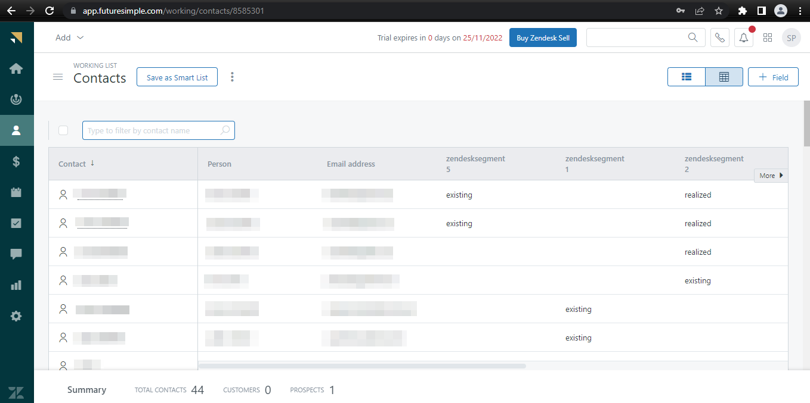
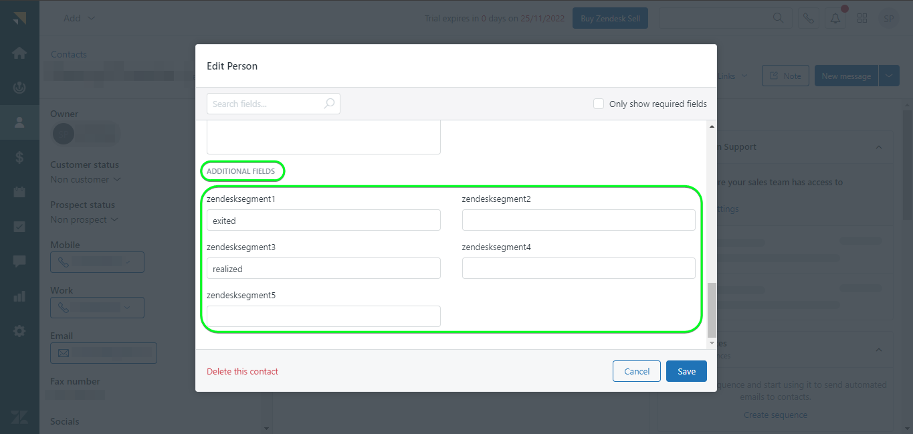

# [!DNL Zendesk] 接続

[[!DNL Zendesk]](https://www.zendesk.co.jp)は、カスタマーサービス ソリューションおよびセールス ツールです。

この[!DNL Adobe Experience Platform] [宛先](/help/destinations/home.md)は、[[!DNL Zendesk] 連絡先API](https://developer.zendesk.com/api-reference/sales-crm/resources/contacts/)を活用して、オーディエンス内の&#x200B;**作成および更新ID**&#x200B;を[!DNL Zendesk]内の連絡先として作成します。

[!DNL Zendesk]は、ベアラートークンを[!DNL Zendesk]連絡先APIと通信するための認証メカニズムとして使用します。 [!DNL Zendesk] インスタンスを認証する手順は、さらに下の[宛先に対する認証](#authenticate)の節にあります。

## ユースケース {#use-cases}

マルチチャネル B2C プラットフォームのカスタマーサービス部門では、顧客にシームレスなパーソナライズされた体験を提供したいと考えています。 同部門は、独自のオフラインデータからオーディエンスを構築して、新しいユーザープロファイルを作成したり、様々なインタラクション（購入、返品など）から既存のプロファイル情報を更新したりして、これらのオーディエンスを[!DNL Adobe Experience Platform]から[!DNL Zendesk]まで送信することができます。 [!DNL Zendesk]に更新された情報を持つことで、カスタマーサービス担当者は顧客の最新情報をすぐに利用できるようになり、迅速な応答と解決が可能になります。

## 前提条件 {#prerequisites}

### Experience Platform の前提条件 {#prerequisites-in-experience-platform}

[!DNL Zendesk] 宛先へのデータをアクティブ化する前に、[スキーマ](/help/xdm/schema/composition.md)、[データセット](https://experienceleague.adobe.com/docs/platform-learn/tutorials/data-ingestion/create-datasets-and-ingest-data.html)および[セグメント](https://experienceleague.adobe.com/docs/platform-learn/tutorials/segments/create-segments.html)を [!DNL Experience Platform] で作成する必要があります。

オーディエンスのステータスに関するガイダンスが必要な場合は、[ オーディエンスメンバーシップの詳細スキーマフィールドグループ ](/help/xdm/field-groups/profile/segmentation.md)のExperience Platform ドキュメントを参照してください。

### [!DNL Zendesk] 前提条件 {#prerequisites-destination}

Experience Platformから[!DNL Zendesk] アカウントにデータをエクスポートするには、[!DNL Zendesk] アカウントが必要です。

#### [!DNL Zendesk] 資格情報の収集 {#gather-credentials}

[!DNL Zendesk]宛先に対する認証を行う前に、以下の項目をメモしてください。

| 資格情報 | 説明 | 例 |
| --- | --- | --- |
| `Bearer token` | [!DNL Zendesk] アカウントで生成したアクセストークン。   ドキュメントに従って、[ アクセストークンを生成 [!DNL Zendesk] します（お持ちでない場合）。](https://developer.zendesk.com/documentation/sales-crm/first-call/#1-generate-an-access-token) | `a0b1c2d3e4...v20w21x22y23z` |

## ガードレール {#guardrails}

[価格設定とレート制限](https://developer.zendesk.com/api-reference/sales-crm/rate-limits/#pricing) ページには、アカウントに関連付けられている[!DNL Zendesk] API制限の詳細が表示されます。 データとペイロードがこれらの制約内にあることを確認する必要があります。

## サポートされる ID {#supported-identities}

[!DNL Zendesk] では、以下の表で説明する ID の更新をサポートしています。[ID](/help/identity-service/features/namespaces.md) についての詳細情報。

| ターゲット ID | 例 | 説明 | 必須 |
|---|---|---|---|
| `email` | `test@test.com` | 連絡先のメールアドレス。 | ○ |

## サポートされるオーディエンス {#supported-audiences}

この節では、この宛先に書き出すことができるオーディエンスのタイプについて説明します。

| オーディエンスの由来 | サポートあり | 説明 |
|---------|----------|----------|
| [!DNL Segmentation Service] | ○ | Experience Platform [ セグメント化サービス ](../../../segmentation/home.md)を通じて生成されたオーディエンス。 |
| その他すべてのオーディエンスの生成元 | × | このカテゴリには、[!DNL Segmentation Service]を通じて生成されたオーディエンス以外のすべてのオーディエンスのオリジンが含まれます。 [様々なオーディエンスの起源](/help/segmentation/ui/audience-portal.md#customize)について読みます。 次に例を示します。 <ul><li> カスタムアップロードオーディエンス [がCSV ファイルからExperience Platformに](../../../segmentation/ui/audience-portal.md#import-audience)をインポートしました。</li><li> 類似オーディエンス， </li><li> 連合オーディエンス， </li><li> [!DNL Adobe Journey Optimizer]などの他のExperience Platform アプリで生成されたオーディエンス </li><li> その他。 </li></ul> |

{style="table-layout:auto"}

オーディエンスのデータタイプ別にサポートされるオーディエンス：

| オーディエンスのデータタイプ | サポートあり | 説明 | ユースケース |
|--------------------|-----------|-------------|-----------|
| [人物オーディエンス ](/help/segmentation/types/people-audiences.md) | ○ | 顧客プロファイルにもとづいて、マーケティング施策の特定のグループをターゲットにすることができます。 | 買い物客やカートの放棄が多い |
| [ アカウントオーディエンス ](/help/segmentation/types/account-audiences.md) | × | アカウントベースドマーケティング戦略のために、特定の組織内の個人をターゲットにします。 | B2B マーケティング |
| [見込みオーディエンス ](/help/segmentation/types/prospect-audiences.md) | × | まだ顧客ではないが、ターゲットオーディエンスと特徴を共有する個人をターゲットにします。 | サードパーティデータによる見込み顧客の開拓 |
| [ データセットの書き出し](/help/catalog/datasets/overview.md) | × | [!DNL Adobe Experience Platform] データ レイクに保存されている構造化データのコレクション。 | レポート，データサイエンスワークフロー |

{style="table-layout:auto"}

## 書き出しのタイプと頻度 {#export-type-frequency}

宛先の書き出しタイプと頻度については、次の表を参照してください。

| 項目 | タイプ | メモ |
|---------|----------|---------|
| 書き出しタイプ | **[!UICONTROL Profile-based]** | <ul><li>セグメントのすべてのメンバーを、フィールドマッピングに従って、必要なスキーマフィールドと共に書き出します&#x200B;*（例：メールアドレス、電話番号、姓）*。</li><li> [!DNL Zendesk]の各セグメントステータスは、**[!UICONTROL Mapping ID]** オーディエンススケジュール [手順で指定した](#schedule-segment-export-example)値に基づいて、Experience Platformからの対応するオーディエンスステータスで更新されます。</li></ul> |
| 書き出し頻度 | **[!UICONTROL Streaming]** | <ul><li>ストリーミングの宛先は常に、API ベースの接続です。オーディエンス評価に基づいて Experience Platform 内でプロファイルが更新されるとすぐに、コネクタは更新を宛先プラットフォームに送信します。詳しくは、[ストリーミングの宛先](/help/destinations/destination-types.md#streaming-destinations)を参照してください。</li></ul> |

{style="table-layout:auto"}

## 宛先への接続 {#connect}

>[!IMPORTANT]
>
>宛先に接続するには、**[!UICONTROL View Destinations]**&#x200B;および&#x200B;**[!UICONTROL Manage Destinations]** [ アクセス制御権限](/help/access-control/home.md#permissions)が必要です。 詳しくは、[アクセス制御の概要](/help/access-control/ui/overview.md)または製品管理者に問い合わせて、必要な権限を取得してください。

この宛先に接続するには、[宛先設定のチュートリアル](../../ui/connect-destination.md)の手順に従ってください。宛先の設定ワークフローで、以下の 2 つのセクションにリストされているフィールドに入力します。

**[!UICONTROL Destinations]** > **[!UICONTROL Catalog]**&#x200B;内で[!DNL Zendesk]を検索します。 または、**[!UICONTROL CRM]** カテゴリの下に配置することもできます。

### 宛先に対する認証 {#authenticate}

以下の必須のフィールドに入力します。ガイダンスについては、[収集 [!DNL Zendesk] 資格情報](#gather-credentials) セクションを参照してください。

* **[!UICONTROL Bearer Token]**: [!DNL Zendesk] アカウントで生成したアクセストークン。

宛先に対する認証を行うには、**[!UICONTROL Connect to destination]**を選択します。
認証方法を示す

指定された詳細が有効な場合、UIには緑色のチェックマークが付いた&#x200B;**[!UICONTROL Connected]** ステータスが表示されます。 その後、次の手順に進むことができます。

### 宛先の詳細を入力 {#destination-details}

宛先の詳細を設定するには、以下の必須フィールドとオプションフィールドに入力します。UI のフィールドの横にアスタリスクが表示される場合は、そのフィールドが必須であることを示します。
宛先の詳細を示す

* **[!UICONTROL Name]**：今後この宛先を認識する際に使用する名前。
* **[!UICONTROL Description]**：今後この宛先を特定するのに役立つ説明です。

### アラートの有効化 {#enable-alerts}

アラートを有効にすると、宛先へのデータフローのステータスに関する通知を受け取ることができます。リストからアラートを選択して、データフローのステータスに関する通知を受け取るよう登録します。アラートについて詳しくは、[UI を使用した宛先アラートの購読](../../ui/alerts.md)についてのガイドを参照してください。

宛先接続の詳細の提供が完了したら、**[!UICONTROL Next]**&#x200B;を選択します。

## この宛先に対してオーディエンスをアクティブ化 {#activate}

>[!IMPORTANT]
>
>* データをアクティブ化するには、**[!UICONTROL View Destinations]**、**[!UICONTROL Activate Destinations]**、**[!UICONTROL View Profiles]**&#x200B;および&#x200B;**[!UICONTROL View Segments]** [ アクセス制御権限](/help/access-control/home.md#permissions)が必要です。 [アクセス制御の概要](/help/access-control/ui/overview.md)を参照するか、製品管理者に問い合わせて必要な権限を取得してください。
>* *ID*&#x200B;をエクスポートするには、**[!UICONTROL View Identity Graph]** [ アクセス制御権限](/help/access-control/home.md#permissions)が必要です。  {width="100" zoomable="yes"}

この宛先にオーディエンスをアクティベートする手順は、[ストリーミングオーディエンスの書き出し宛先へのプロファイルとオーディエンスのアクティベート](/help/destinations/ui/activate-segment-streaming-destinations.md)を参照してください。

### マッピングの考慮事項と例 {#mapping-considerations-example}

オーディエンスデータを[!DNL Adobe Experience Platform]から[!DNL Zendesk]宛先に正しく送信するには、フィールドマッピング手順を実行する必要があります。 マッピングでは、Experience Platform アカウントのExperience Data Model （XDM）スキーマフィールドと、ターゲット先の対応するスキーマフィールドとの間にリンクを作成します。

**[!UICONTROL Target field]**&#x200B;で指定された属性には、属性マッピング テーブルで説明されているとおりの名前を付ける必要があります。これらの属性はリクエスト本文を形成します。

**[!UICONTROL Source field]**&#x200B;で指定された属性は、そのような制限に従っていません。 必要に応じてマッピングできますが、[!DNL Zendesk]にプッシュしたときにデータ形式が正しくない場合は、エラーが発生します。

XDM フィールドを [!DNL Zendesk] 宛先フィールドに正しくマッピングするには、次の手順に従います。

1. **[!UICONTROL Mapping]** ステップで、**[!UICONTROL Add new mapping]**&#x200B;を選択します。 画面に新しいマッピング行が表示されます。
1. **[!UICONTROL Select source field]** ウィンドウで、**[!UICONTROL Select attributes]** カテゴリを選択してXDM属性を選択するか、**[!UICONTROL Select identity namespace]**&#x200B;を選択してIDを選択します。
1. **[!UICONTROL Select target field]** ウィンドウで、**[!UICONTROL Select identity namespace]** カテゴリを選択してターゲット IDを選択するか、**[!UICONTROL Select attributes]** カテゴリを選択して、サポートされているスキーマ属性のいずれかを選択します。

   * これらの手順を繰り返して、次の必須マッピングを追加します。XDM プロファイルスキーマと[!DNL Zendesk] インスタンスの間で更新するその他の属性を追加することもできます。

     | ソースフィールド | ターゲットフィールド | 必須 |
     |---|---|---|
     | `xdm: person.name.lastName` | `xdm: last_name` | ○ |
     | `IdentityMap: Email` | `Identity: email` | ○ |
     | `xdm: person.name.firstName` | `xdm: first_name` | |

   * これらのマッピングの使用例を次に示します。
     

>[!IMPORTANT]
>
>この宛先には、`Attribute: last_name`と`Identity: email`のターゲットマッピングが必須です。 これらのマッピングが見つからない場合、他のマッピングは無視され、[!DNL Zendesk]には送信されません。

宛先接続のマッピングの提供が完了したら、**[!UICONTROL Next]**&#x200B;を選択します。

### オーディエンスの書き出しのスケジュールと例 {#schedule-segment-export-example}

アクティベーション ワークフローの[[!UICONTROL Schedule audience export]](/help/destinations/ui/activate-segment-streaming-destinations.md#scheduling) ステップでは、Experience Platform オーディエンスを[!DNL Zendesk]のカスタム フィールド属性に手動でマッピングする必要があります。

これを行うには、各セグメントを選択し、[!DNL Zendesk] フィールドに&#x200B;**[!UICONTROL Mapping ID]**&#x200B;から対応するカスタムフィールド属性を入力します。

例を次に示します。

## データの書き出しを検証する {#exported-data}

宛先が正しく設定されていることを検証するには、次の手順に従います。

1. **[!UICONTROL Destinations]** > **[!UICONTROL Browse]**&#x200B;を選択し、宛先のリストに移動します。
1. 次に、宛先を選択して&#x200B;**[!UICONTROL Activation data]** タブに切り替え、オーディエンス名を選択します。
   宛先アクティベーションデータを示す

1. オーディエンスの概要を監視し、プロファイルの数がセグメント内の数に対応していることを確認します。
   セグメントを示す

1. [!DNL Zendesk] web サイトに移動し、**[!UICONTROL Contacts]** ページに移動して、オーディエンスのプロファイルが追加されたかどうかを確認します。 このリストは、オーディエンス**[!UICONTROL Mapping ID]**およびオーディエンスステータスで作成された追加フィールドの列を表示するように設定できます。
   オーディエンス名で作成された追加フィールドを含む連絡先ページを示す

1. または、個々の&#x200B;**[!UICONTROL Person]** ページにドリルダウンして、オーディエンス名とオーディエンスのステータスを表示する&#x200B;**[!UICONTROL Additional fields]** セクションを確認することもできます。
   オーディエンス名とオーディエンスのステータスを表示する追加フィールドセクションを含む人物ページを示す

## データの使用とガバナンス {#data-usage-governance}

[!DNL Adobe Experience Platform] のすべての宛先は、データを処理する際のデータ使用ポリシーに準拠しています。[!DNL Adobe Experience Platform] がどのようにデータガバナンスを実施するかについて詳しくは、[データガバナンスの概要](/help/data-governance/home.md)を参照してください。

## その他のリソース {#additional-resources}

[!DNL Zendesk] ドキュメントのその他の有用な情報は次のとおりです。

* [最初の通話を行う](https://developer.zendesk.com/documentation/sales-crm/first-call/)
* [ カスタムフィールド ](https://developer.zendesk.com/api-reference/sales-crm/requests/#custom-fields)

### 変更ログ {#changelog}

この節では、この宛先コネクタに対する機能の概要と重要なドキュメントの更新について説明します。

+++ 変更ログを表示

| リリース月 | 更新タイプ | 説明 |
|---|---|---|
| 2023年4月 | ドキュメントの更新 | <ul><li>[ ユースケース ](#use-cases) セクションを更新し、顧客がこの宛先を使用することでメリットを得られるタイミングをより明確に示しました。</li> <li>[ マッピング ](#mapping-considerations-example) セクションを更新して、正しい必須マッピングを反映しました。 この宛先には、`Attribute: last_name`と`Identity: email`のターゲットマッピングが必須です。 これらのマッピングが見つからない場合、他のマッピングは無視され、[!DNL Zendesk]には送信されません。</li> <li>必須マッピングと任意マッピングの両方の明確な例を使用して、[ マッピング ](#mapping-considerations-example) セクションを更新しました。</li></ul> |
| 2023年3月 | 初回リリース | 最初の宛先リリースとドキュメントの公開。 |

{style="table-layout:auto"}

+++
