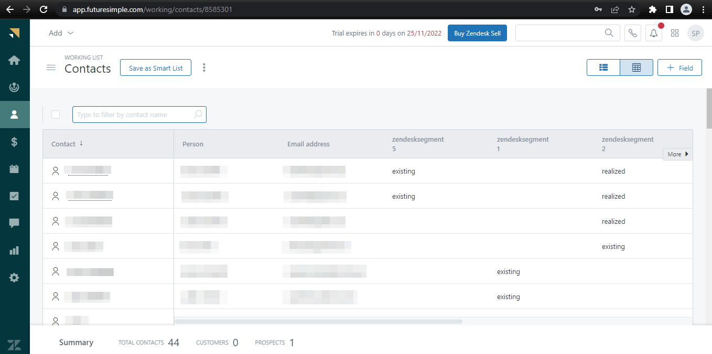

# [!DNL Zendesk] 接続

[[!DNL Zendesk]](https://www.zendesk.co.jp) は、カスタマーサービスソリューションおよびセールスツールです。

この [!DNL Adobe Experience Platform][ 宛先 ](/help/destinations/home.md) は、[[!DNL Zendesk] Contacts API](https://developer.zendesk.com/api-reference/sales-crm/resources/contacts/) を活用して、オーディエンス内の **ID の作成と更新** を [!DNL Zendesk] 内の連絡先として実行します。

[!DNL Zendesk] は、[!DNL Zendesk] Contacts API と通信するための認証メカニズムとしてベアラートークンを使用します。 [!DNL Zendesk] インスタンスを認証する手順は、さらに下の[宛先に対する認証](#authenticate)の節にあります。

## ユースケース {#use-cases}

マルチチャネル B2C プラットフォームのカスタマーサービス部門は、顧客にシームレスでパーソナライズされたエクスペリエンスを提供したいと考えています。 部門は、独自のオフラインデータからオーディエンスを作成して、新しいユーザープロファイルを作成したり、様々なインタラクション（購入、返品など）から既存のプロファイル情報を更新したりできます。 これらのオーディエンスをAdobe Experience Platformから [!DNL Zendesk] に送信します。 最新情報を [!DNL Zendesk] に入手することで、カスタマー・サービス・エージェントが顧客の最新情報をすぐに入手できるようになり、迅速な対応と解決が可能になります。

## 前提条件 {#prerequisites}

### Experience Platform の前提条件 {#prerequisites-in-experience-platform}

[!DNL Zendesk] 宛先へのデータをアクティブ化する前に、[スキーマ](/help/xdm/schema/composition.md)、[データセット](https://experienceleague.adobe.com/docs/platform-learn/tutorials/data-ingestion/create-datasets-and-ingest-data.html)および[セグメント](https://experienceleague.adobe.com/docs/platform-learn/tutorials/segments/create-segments.html)を [!DNL Experience Platform] で作成する必要があります。

オーディエンスのステータスに関するガイダンスが必要な場合は、[ オーディエンスメンバーシップの詳細スキーマフィールドグループ ](/help/xdm/field-groups/profile/segmentation.md) に関するExperience Platformドキュメントを参照してください。

### [!DNL Zendesk] 前提条件 {#prerequisites-destination}

Platform から [!DNL Zendesk] アカウントにデータを書き出すには、[!DNL Zendesk] アカウントが必要です。

#### [!DNL Zendesk] 資格情報の収集 {#gather-credentials}

[!DNL Zendesk] の宛先に対して認証を行う前に、以下の項目をメモしておきます。

| 資格情報 | 説明 | 例 |
| --- | --- | --- |
| `Bearer token` | [!DNL Zendesk] アカウントで生成したアクセストークン。   アクセストークンがない場合は、ドキュメントに従って [ アクセストークン  [!DNL Zendesk]  生成 ](https://developer.zendesk.com/documentation/sales-crm/first-call/#1-generate-an-access-token) します。 | `a0b1c2d3e4...v20w21x22y23z` |

## ガードレール {#guardrails}

[ 価格とレート制限 ](https://developer.zendesk.com/api-reference/sales-crm/rate-limits/#pricing) ページは、アカウントに関連する [!DNL Zendesk] API 制限の詳細を説明します。 データとペイロードがこれらの制約内にあることを確認する必要があります。

## サポートされる ID {#supported-identities}

[!DNL Zendesk] では、以下の表で説明する ID の更新をサポートしています。[ID](/help/identity-service/features/namespaces.md) についての詳細情報。

| ターゲット ID | 例 | 説明 | 必須 |
|---|---|---|---|
| `email` | `test@test.com` | 連絡先のメールアドレス。 | ○ |

## 書き出しのタイプと頻度 {#export-type-frequency}

宛先の書き出しのタイプと頻度について詳しくは、以下の表を参照してください。

| 項目 | タイプ | メモ |
---------|----------|---------|
| 書き出しタイプ | **[!UICONTROL プロファイルベース]** | <ul><li>セグメントのすべてのメンバーを、フィールドマッピングに従って、必要なスキーマフィールドと共に書き出します&#x200B;*（例：メールアドレス、電話番号、姓）*。</li><li> [!DNL Zendesk] の各セグメントのステータスは、[ オーディエンススケジュール ](#schedule-segment-export-example) 手順で提供された **[!UICONTROL マッピング ID]** 値に基づいて、Platform の対応するオーディエンスステータスとともに更新されます。</li></ul> |
| 書き出し頻度 | **[!UICONTROL ストリーミング]** | <ul><li>ストリーミングの宛先は常に、API ベースの接続です。オーディエンス評価に基づいて Experience Platform 内でプロファイルが更新されるとすぐに、コネクタは更新を宛先プラットフォームに送信します。詳しくは、[ストリーミングの宛先](/help/destinations/destination-types.md#streaming-destinations)を参照してください。</li></ul> |

{style="table-layout:auto"}

## 宛先への接続 {#connect}

>[!IMPORTANT]
>
>宛先に接続するには、**[!UICONTROL 宛先の表示]** および **[!UICONTROL 宛先の管理]**[ アクセス制御権限 ](/help/access-control/home.md#permissions) が必要です。 詳しくは、[アクセス制御の概要](/help/access-control/ui/overview.md)または製品管理者に問い合わせて、必要な権限を取得してください。

この宛先に接続するには、[宛先設定のチュートリアル](../../ui/connect-destination.md)の手順に従ってください。宛先の設定ワークフローで、以下の 2 つのセクションにリストされているフィールドに入力します。

**[!UICONTROL 宛先]**／**[!UICONTROL カタログ]**&#x200B;内で [!DNL Zendesk] を検索します。または、**[!UICONTROL CRM]** カテゴリの下に配置することもできます。

### 宛先に対する認証 {#authenticate}

以下の必須のフィールドに入力します。詳しくは、[Gather [!DNL Zendesk] credentials](#gather-credentials) の節を参照してください。
* **[!UICONTROL ベアラートークン]**:[!DNL Zendesk] アカウントに生成したアクセストークンです。

宛先を認証するには、「 **[!UICONTROL 宛先に接続]**」を選択します。

指定した詳細が有効な場合、UI で&#x200B;**[!UICONTROL 接続済み]**&#x200B;ステータスに緑色のチェックマークが付きます。その後、次の手順に進むことができます。

### 宛先の詳細を入力 {#destination-details}

宛先の詳細を設定するには、以下の必須フィールドとオプションフィールドに入力します。UI のフィールドの横にアスタリスクが表示される場合は、そのフィールドが必須であることを示します。

* **[!UICONTROL 名前]**：今後この宛先を認識するための名前。
* **[!UICONTROL 説明]**：今後この宛先を識別するのに役立つ説明。

### アラートの有効化 {#enable-alerts}

アラートを有効にすると、宛先へのデータフローのステータスに関する通知を受け取ることができます。リストからアラートを選択して、データフローのステータスに関する通知を受け取るよう登録します。アラートについて詳しくは、[UI を使用した宛先アラートの購読](../../ui/alerts.md)についてのガイドを参照してください。

宛先接続の詳細の入力を終えたら「**[!UICONTROL 次へ]**」を選択します。

## この宛先に対してオーディエンスをアクティブ化 {#activate}

>[!IMPORTANT]
> 
>* データをアクティブ化するには、**[!UICONTROL 宛先の表示]**、**[!UICONTROL 宛先のアクティブ化]**、**[!UICONTROL プロファイルの表示]** および **[!UICONTROL セグメントの表示]**[ アクセス制御権限 ](/help/access-control/home.md#permissions) が必要です。 [アクセス制御の概要](/help/access-control/ui/overview.md)を参照するか、製品管理者に問い合わせて必要な権限を取得してください。
>* *ID* を書き出すには、**[!UICONTROL ID グラフの表示]**[ アクセス制御権限 ](/help/access-control/home.md#permissions) が必要です。  {width="100" zoomable="yes"}

この宛先にオーディエンスをアクティベートする手順は、[ストリーミングオーディエンスの書き出し宛先へのプロファイルとオーディエンスのアクティベート](/help/destinations/ui/activate-segment-streaming-destinations.md)を参照してください。

### マッピングの考慮事項と例 {#mapping-considerations-example}

Adobe Experience Platform から [!DNL Zendesk] 宛先にオーディエンスデータを正しく送信するには、フィールドマッピングの手順を実行する必要があります。マッピングは、Platform アカウント内の Experience Data Model （XDM）スキーマフィールドと、ターゲット宛先から対応する同等のスキーマフィールドとの間にリンクを作成して構成されます。

**[!UICONTROL ターゲットフィールド]** で指定する属性には、属性マッピングテーブルで説明されているとおりに正確に名前を付ける必要があります。これらの属性はリクエスト本文を形成するからです。

**[!UICONTROL Source フィールドで指定された属性は]** そのような制限には従いません。 必要に応じてマッピングできますが、[!DNL Zendesk] にプッシュした際にデータ形式が正しくない場合は、エラーが発生します。

XDM フィールドを [!DNL Zendesk] 宛先フィールドに正しくマッピングするには、次の手順に従います。

1. **[!UICONTROL マッピング]**&#x200B;手順で、「**[!UICONTROL 新しいマッピングを追加]**」を選択します。画面に新しいマッピング行が表示されます。
1. **[!UICONTROL ソースフィールドを選択]** ウィンドウで、**[!UICONTROL 属性を選択]** カテゴリを選択して XDM 属性を選択するか、**[!UICONTROL ID 名前空間を選択]** を選択して ID を選択します。
1. **[!UICONTROL ターゲットフィールドを選択]** ウィンドウで、**[!UICONTROL ID 名前空間を選択]** カテゴリを選択してターゲット ID を選択するか、**[!UICONTROL 属性を選択]** カテゴリを選択して、サポートされているスキーマ属性の 1 つを選択します。

   * これらの手順を繰り返して、次の必須マッピングを追加します。また、XDM プロファイルスキーマと [!DNL Zendesk] インスタンスの間で更新したい他の属性を追加することもできます。

     | ソースフィールド | ターゲットフィールド | 必須 |
     |---|---|---|
     | `xdm: person.name.lastName` | `xdm: last_name` | ○ |
     | `IdentityMap: Email` | `Identity: email` | ○ |
     | `xdm: person.name.firstName` | `xdm: first_name` | |

   * これらのマッピングの使用例を次に示します。
     

>[!IMPORTANT]
>
>この宛先には、`Attribute: last_name` と `Identity: email` のターゲットマッピングが必須です。 これらのマッピングがない場合、他のマッピングは無視され、[!DNL Zendesk] に送信されません。

宛先接続のマッピングの指定を終えたら「**[!UICONTROL 次へ]**」を選択します。

### オーディエンスの書き出しのスケジュールと例 {#schedule-segment-export-example}

アクティベーションワークフローの [[!UICONTROL  オーディエンスの書き出しをスケジュール ]](/help/destinations/ui/activate-segment-streaming-destinations.md#scheduling) 手順では、Platform オーディエンスを [!DNL Zendesk] のカスタムフィールド属性に手動でマッピングする必要があります。

これを行うには、各セグメントを選択し、対応するカスタムフィールド属性を [!DNL Zendesk] の「**[!UICONTROL マッピング ID]**」フィールドから入力します。

次に例を示します。

## データの書き出しを検証する {#exported-data}

宛先が正しく設定されていることを検証するには、次の手順に従います。

1. **[!UICONTROL 宛先]**/**[!UICONTROL 参照]** を選択し、宛先のリストに移動します。
1. 次に、宛先を選択し、**[!UICONTROL アクティベーションデータ]** タブに切り替えて、オーディエンス名を選択します。
   

1. オーディエンスの概要を監視し、プロファイルの数がセグメント内の数と一致していることを確認します。
   

1. [!DNL Zendesk] web サイトにログインし、**[!UICONTROL 連絡先]** ページに移動して、オーディエンスのプロファイルが追加されたかどうかを確認します。 このリストは、オーディエンス**[!UICONTROL  マッピング ID]**およびオーディエンスステータスで作成された追加フィールドの列を表示するように設定できます。
   

1. または、個々の **[!UICONTROL ユーザー]** ページにドリルダウンして、オーディエンス名とオーディエンスのステータスを表示する **[!UICONTROL 追加フィールド]** セクションを確認することもできます。
   

## データの使用とガバナンス {#data-usage-governance}

[!DNL Adobe Experience Platform] のすべての宛先は、データを処理する際のデータ使用ポリシーに準拠しています。[!DNL Adobe Experience Platform] がどのようにデータガバナンスを実施するかについて詳しくは、[データガバナンスの概要](/help/data-governance/home.md)を参照してください。

## その他のリソース {#additional-resources}

[!DNL Zendesk] ドキュメントからのその他の役に立つ情報は次のとおりです。
* [ 最初の通話 ](https://developer.zendesk.com/documentation/sales-crm/first-call/)
* [ カスタムフィールド ](https://developer.zendesk.com/api-reference/sales-crm/requests/#custom-fields)

### 変更ログ

この節では、この宛先コネクタに対する機能の概要と重要なドキュメントの更新について説明します。

+++ 変更ログを表示

| リリース月 | 更新タイプ | 説明 |
|---|---|---|
| 2023年4月 | ドキュメントの更新 | <ul><li>[ ユースケース ](#use-cases) の節を更新し、この宛先を使用することで、お客様にメリットが得られるタイミングをより明確に例を示しました。</li> <li>[mapping](#mapping-considerations-example) の節を更新して、必要な正しいマッピングを反映させました。 この宛先には、`Attribute: last_name` と `Identity: email` のターゲットマッピングが必須です。 これらのマッピングがない場合、他のマッピングは無視され、[!DNL Zendesk] に送信されません。</li> <li>[ マッピング ](#mapping-considerations-example) の節を更新し、必須マッピングとオプションマッピングの両方の明確な例を追加しました。</li></ul> |
| 2023年3月 | 初回リリース | 宛先の初回リリースとドキュメントの公開。 |

{style="table-layout:auto"}

+++
