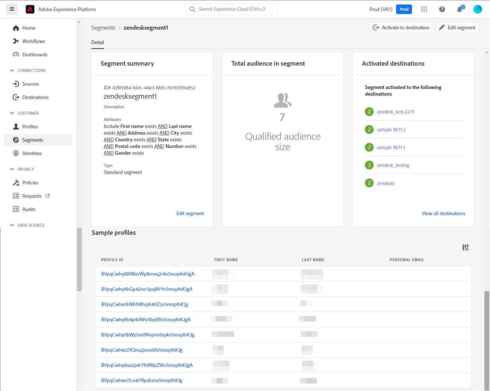

# [!DNL Zendesk] 接続

[[!DNL Zendesk]](https://www.zendesk.co.jp) は、カスタマーサービスソリューションおよびセールスツールです。 

この [!DNL Adobe Experience Platform] [宛先](/help/destinations/home.md) は [[!DNL Zendesk] 連絡先 API](https://developer.zendesk.com/api-reference/sales-crm/resources/contacts/)、セグメント内の id を内の連絡先として作成および更新する [!DNL Zendesk].

[!DNL Zendesk] は、bearer トークンを認証メカニズムとして使用し、 [!DNL Zendesk] 連絡先 API [!DNL Zendesk] インスタンスを認証する手順は、さらに下の[宛先に対する認証](#authenticate)の節にあります。

## ユースケース {#use-cases}

マーケターは、Adobe Experience Platform プロファイルの属性に基づいて、ユーザーにパーソナライズされたエクスペリエンスを提供できます。 オフラインデータからセグメントを作成し、それらのセグメントを [!DNL Zendesk] に送信して、Adobe Experience Platform でセグメントとプロファイルが更新されるとすぐにユーザーのフィードに表示することができます。

## 前提条件 {#prerequisites}

### Experience Platform の前提条件 {#prerequisites-in-experience-platform}

[!DNL Zendesk] 宛先へのデータをアクティブ化する前に、[スキーマ](/help/xdm/schema/composition.md)、[データセット](https://experienceleague.adobe.com/docs/platform-learn/tutorials/data-ingestion/create-datasets-and-ingest-data.html?lang=ja)および[セグメント](https://experienceleague.adobe.com/docs/platform-learn/tutorials/segments/create-segments.html?lang=ja)を [!DNL Experience Platform] で作成する必要があります。

詳しくは、Experience Platformドキュメントを参照してください。 [セグメントメンバーシップの詳細スキーマフィールドグループ](/help/xdm/field-groups/profile/segmentation.md) セグメントのステータスに関するガイダンスが必要な場合。

### [!DNL Zendesk] 前提条件 {#prerequisites-destination}

Platform からにデータを書き出すには、以下を実行します。 [!DNL Zendesk] アカウントに [!DNL Zendesk] アカウント

#### [!DNL Zendesk] 資格情報の収集 {#gather-credentials}

[!DNL Zendesk] 宛先に対して認証を行う前に、以下の項目をメモしておきます。

| 資格情報 | 説明 | 例 |
| --- | --- | --- |
| `Bearer token` | が [!DNL Zendesk] アカウント   ドキュメントに従って、 [を生成する [!DNL Zendesk] アクセストークン](https://developer.zendesk.com/documentation/sales-crm/first-call/#1-generate-an-access-token) もし持っていなければ | `a0b1c2d3e4...v20w21x22y23z` |

## ガードレール {#guardrails}

この [価格とレート制限](https://developer.zendesk.com/api-reference/sales-crm/rate-limits/#pricing) ページの詳細 [!DNL Zendesk] アカウントに関連付けられた API 制限。 データとペイロードがこれらの制約内にあることを確認する必要があります。

## サポートされる ID {#supported-identities}

[!DNL Zendesk] では、以下の表で説明する ID の更新をサポートしています。[ID](/help/identity-service/namespaces.md) についての詳細情報。

| ターゲット ID | 例 | 説明 | 必須 |
|---|---|---|---|
| `email` | `test@test.com` | 連絡先の電子メールアドレス。 | ○ |

## 書き出しのタイプと頻度 {#export-type-frequency}

宛先の書き出しのタイプと頻度について詳しくは、以下の表を参照してください。

| 項目 | タイプ | メモ |
---------|----------|---------|
| 書き出しタイプ | **[!UICONTROL プロファイルベース]** | <ul><li>セグメントのすべてのメンバーを、フィールドマッピングに従って、必要なスキーマフィールドと共に書き出します&#x200B;*（例：メールアドレス、電話番号、姓）*。</li><li> [!DNL Zendesk] の各セグメントのステータスは、[セグメントスケジュール](#schedule-segment-export-example)手順の最中に指定された&#x200B;**[!UICONTROL マッピング ID]** 値に基づいて、Platform の対応するセグメントステータスとともに更新されます。</li></ul> |
| 書き出し頻度 | **[!UICONTROL ストリーミング]** | <ul><li>ストリーミングの宛先は常に、API ベースの接続です。セグメント評価に基づいて Experience Platform 内でプロファイルが更新されるとすぐに、コネクタは更新を宛先プラットフォームに送信します。[ストリーミングの宛先](/help/destinations/destination-types.md#streaming-destinations)の詳細についてはこちらを参照してください。</li></ul> |

{style="table-layout:auto"}

## 宛先への接続 {#connect}

>[!IMPORTANT]
>
>宛先に接続するには、**[!UICONTROL 宛先の管理]** [アクセス制御権限](/help/access-control/home.md#permissions)が必要です。詳しくは、[アクセス制御の概要](/help/access-control/ui/overview.md)または製品管理者に問い合わせて、必要な権限を取得してください。

この宛先に接続するには、[宛先設定のチュートリアル](../../ui/connect-destination.md)の手順に従ってください。宛先の設定ワークフローで、以下の 2 つのセクションにリストされているフィールドに入力します。

**[!UICONTROL 宛先]**／**[!UICONTROL カタログ]**&#x200B;内で [!DNL Zendesk] を検索します。または、**[!UICONTROL CRM]** カテゴリの下に配置することもできます。

### 宛先に対する認証 {#authenticate}

以下の必須のフィールドに入力します。詳しくは、[ [!DNL Zendesk]  資格情報の収集](#gather-credentials)の節を参照してください。
* **[!UICONTROL Bearer トークン]**:が [!DNL Zendesk] アカウント

宛先を認証するには、「 **[!UICONTROL 宛先に接続]**」を選択します。

指定した詳細が有効な場合、UI で&#x200B;**[!UICONTROL 接続済み]**&#x200B;ステータスに緑色のチェックマークが付きます。その後、次の手順に進むことができます。

### 宛先の詳細を入力 {#destination-details}

宛先の詳細を設定するには、以下の必須フィールドとオプションフィールドに入力します。UI のフィールドの横にアスタリスクが表示される場合は、そのフィールドが必須であることを示します。

* **[!UICONTROL 名前]**：今後この宛先を認識するための名前。
* **[!UICONTROL 説明]**：今後この宛先を識別するのに役立つ説明。

### アラートの有効化 {#enable-alerts}

アラートを有効にすると、宛先へのデータフローのステータスに関する通知を受け取ることができます。リストからアラートを選択して、データフローのステータスに関する通知を受け取るよう登録します。アラートについて詳しくは、[UI を使用した宛先アラートの購読](../../ui/alerts.md)についてのガイドを参照してください。

宛先接続の詳細の入力を終えたら「**[!UICONTROL 次へ]**」を選択します。

## この宛先に対してセグメントをアクティブ化 {#activate}

>[!IMPORTANT]
>
>データをアクティブ化するには、**[!UICONTROL 宛先の管理]**、**[!UICONTROL 宛先のアクティブ化]**、**[!UICONTROL プロファイルの表示]**&#x200B;および&#x200B;**[!UICONTROL セグメントの表示]**[に対するアクセス制御権限](/help/access-control/home.md#permissions)が必要です。詳しくは、[アクセス制御の概要](/help/access-control/ui/overview.md)または製品管理者に問い合わせて、必要な権限を取得してください。

この宛先にオーディエンスセグメントをアクティベートする手順は、[ストリーミングセグメントの書き出し宛先へのプロファイルとセグメントのアクティベート](/help/destinations/ui/activate-segment-streaming-destinations.md)を参照してください。

### マッピングの考慮事項と例 {#mapping-considerations-example}

Adobe Experience Platform から [!DNL Zendesk] 宛先にオーディエンスデータを正しく送信するには、フィールドマッピングの手順を実行する必要があります。マッピングは、Platform アカウント内の Experience Data Model（XDM）スキーマフィールドと、ターゲット宛先から対応する同等のスキーマフィールドとの間にリンクを作成して構成されます。 

で指定された属性 **[!UICONTROL ターゲットフィールド]** は、属性マッピングテーブルで説明されたとおりに名前を付ける必要があります。これらの属性は、リクエスト本文を形成します。

で指定された属性 **[!UICONTROL ソースフィールド]** このような制限に従わないでください。 ただし、にプッシュした際にデータ形式が正しくない場合は、必要に応じてマッピングできます。 [!DNL Zendesk] これはエラーを引き起こします。

XDM フィールドを [!DNL Zendesk] 宛先フィールドに正しくマッピングするには、次の手順に従います。

1. **[!UICONTROL マッピング]**&#x200B;手順で、「**[!UICONTROL 新しいマッピングを追加]**」を選択します。画面に新しいマッピング行が表示されます。
1. 内 **[!UICONTROL ソースフィールドを選択]** ウィンドウで、 **[!UICONTROL 属性を選択]** カテゴリを選択して XDM 属性を選択するか、 **[!UICONTROL ID 名前空間を選択]** ID を選択します。
1. 内 **[!UICONTROL ターゲットフィールドを選択]** ウィンドウで、 **[!UICONTROL ID 名前空間を選択]** ID を選択するか、 **[!UICONTROL カスタム属性を選択]** カテゴリを選択し、必要に応じて属性を選択します。
   * これらの手順を繰り返して、XDM プロファイルスキーマと [!DNL Zendesk] インスタンス： |ソースフィールド|ターゲットフィールド|必須| |—|—|—| |`xdm: person.name.lastName`|`Attribute: last_name`  または `Attribute: name`|はい | |`IdentityMap: Email`|`Identity: email`|はい |

   * これらのマッピングの使用例を次に示します。
      

      >[!IMPORTANT]
      >
      >ターゲットフィールドのマッピングは必須で、 [!DNL Zendesk] を有効にします。
      >
      >のマッピング *姓* または *名前* が必要です。それ以外の場合は [!DNL Zendesk] API はエラーで応答せず、渡された属性値は無視されます。

宛先接続のマッピングの指定が完了したら、「 」を選択します。 **[!UICONTROL 次へ]**.

### セグメントの書き出しをスケジュールと例 {#schedule-segment-export-example}

アクティベーションワークフローの[[!UICONTROL セグメントの書き出しをスケジュール]](/help/destinations/ui/activate-segment-streaming-destinations.md#scheduling)手順では、Platform セグメントを [!DNL Zendesk] のカスタムフィールド属性に手動でマッピングする必要があります。

これを行うには、各セグメントを選択し、対応するカスタムフィールド属性を [!DNL Zendesk] の「**[!UICONTROL マッピング ID]**」フィールドから入力します。

次に例を示します。

## データの書き出しを検証する {#exported-data}

宛先が正しく設定されていることを検証するには、次の手順に従います。

1. 選択 **[!UICONTROL 宛先]** > **[!UICONTROL 参照]** をクリックし、宛先のリストに移動します。
1. 次に、宛先を選択し、 **[!UICONTROL アクティベーションデータ]** 」タブをクリックし、セグメント名を選択します。
   

1. セグメント概要を監視し、プロファイルの数がセグメント内の数に対応していることを確認します。
   

1. にログインします。 [!DNL Zendesk] web サイトに移動し、 **[!UICONTROL 連絡先]** ページを開いて、セグメントのプロファイルが追加されたかどうかを確認します。 このリストは、セグメントで作成された追加のフィールドの列を表示するように設定できます **[!UICONTROL マッピング ID]** およびセグメントのステータス。
   

1. 別の方法として、個人にドリルダウンすることもできます **[!UICONTROL 人物]** ページを開き、 **[!UICONTROL 追加のフィールド]** 「 」セクションに、セグメント名とセグメントステータスが表示されます。
   

## データの使用とガバナンス {#data-usage-governance}

[!DNL Adobe Experience Platform] のすべての宛先は、データを処理する際のデータ使用ポリシーに準拠しています。[!DNL Adobe Experience Platform] がどのようにデータガバナンスを実施するかについて詳しくは、[データガバナンスの概要](/help/data-governance/home.md)を参照してください。

## その他のリソース {#additional-resources}

[!DNL Zendesk] ドキュメントからのその他の役に立つ情報は次のとおりです。
* [最初の呼び出し](https://developer.zendesk.com/documentation/sales-crm/first-call/)
* [カスタムフィールド](https://developer.zendesk.com/api-reference/sales-crm/requests/#custom-fields)