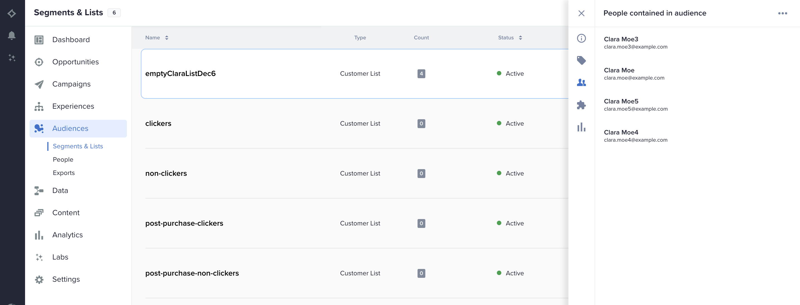

# Zeta マーケティングプラットフォーム {#zeta-marketing-platform}

## 概要 {#overview}

Zeta Marketing Platform （ZMP）は、インテリジェンス（独自のデータと AI）を活用して、より効率的に顧客を獲得、成長、保持するのに役立つクラウドベースのシステムです。 詳しくは、[Zeta Global](https://zetaglobal.com/) を参照してください。

Adobe Experience Platformで利用可能な Zeta Marketing Platform コネクタを使用すると、Experience Platformから ZMP にオーディエンスをシームレスに同期できます。

>[!IMPORTANT]
>
>宛先コネクタとドキュメントページは、*Zeta Global* チームが作成および管理します。 お問い合わせや更新のリクエストについては、チーム [&#x200B; お問い合わせ &#x200B;](https://zetaglobal.com/about/contact-us/) までお問い合わせください。

## ユースケース {#use-cases}

### オーディエンスセグメントの作成 {#use-case-build-audiences}

マーケターは、一意のオーディエンスプロファイルを作成し、最も価値のあるセグメントを特定し、Zeta Marketing Platform がサポートするデジタルチャネルをまたいで使用したいと考えています。 消費者プロファイルの真の 360 ビューを作成し、意味のあるオーディエンスを作成してアクティブ化したいと考えています。 Zeta Marketing Platform がサポートするチャネルの詳細は、[&#x200B; こちら &#x200B;](https://zetaglobal.com/platform/integrations/) をご覧ください。

### 広告によるユーザーのターゲティング {#use-case-target-users}

広告主は、ゼータDemand Side Platform（DSP）を通じて、特定のオーディエンス内のユーザーをターゲットに設定することを目的としています。 ゼータ・DSPに関する詳細は、[&#x200B; こちら &#x200B;](https://knowledgebase.zetaglobal.com/pug/) をクリックしてください。

## 前提条件 {#prerequisites}

### Zeta Marketing Platform 前提条件

* Zeta Marketing Platform の宛先への新しい接続を設定する前に、Zeta Marketing Platform アカウントに空の顧客リストを作成する必要があります。 送信するAdobe Experience Platform オーディエンスを受け取るターゲットとして、これらのカスタマーリストのいずれかを指定する必要があります。 [&#x200B; こちら &#x200B;](https://knowledgebase.zetaglobal.com/kb/creating-audiences#CreatingAudiences-CreatingaCustomerList) の手順に従って、ZMP に空の顧客リストを作成できます。
* Adobe Experience Platformでは、特定の ZMP 宛先インスタンスに対して複数のオーディエンスをアクティブ化できますが、各 ZMP 宛先インスタンスが受け取るExperience Platform オーディエンスは 1 つのみである必要があります。 Experience Platformから複数のオーディエンスを処理するには、各オーディエンスに対して追加の ZMP 宛先インスタンスを作成し、ドロップダウンから別の顧客リストを選択します。 このアプローチにより、ターゲットの ZMP オーディエンスが上書きされなくなります。 詳しくは、[&#x200B; 宛先の詳細の入力 &#x200B;](#destination-details) を参照してください。
* 次の資格情報を使用して宛先を設定します。
   * ユーザー名：**api**
   * パスワード：ZMP REST API キー。 REST API キーを見つけるには、ZMP アカウントにログインし、**設定**/**統合**/**キーとアプリ** セクションに移動します。 詳しくは、[ZMP のドキュメント &#x200B;](https://knowledgebase.zetaglobal.com/kb/integrations) を参照してください。

## サポートされている ID {#supported-identities}

[!DNL Zeta Marketing Platform] では、以下の表で説明するカスタムユーザー ID のアクティベーションをサポートしています。 詳しくは、[ID](/help/identity-service/features/namespaces.md) を参照してください。

>[!IMPORTANT]
> Zeta Marketing Platform の宛先では、ソース ID 名前空間を ZMP `uid` ターゲット ID にマッピングする必要があります。 これは、Zeta Marketing Platform が各プロファイルを一意に区別するのに役立ちます。

| ターゲット ID | 説明 | 注意点 | メモ |
---------|----------|----------|----------|
| uid | 顧客プロファイルを区別するために ZMP が使用する一意の ID | 必須 | メールアドレスを使用して一意のプロファイルを識別する場合は、`Email` の標準 ID 名前空間を選択します。 または、顧客プロファイルにメールがない場合は、カスタム名前空間を `uid` にマッピングすることもできます。 |
| email_md5_id | 各顧客プロファイルを表す E メール MD5 | オプション | メール MD5 値を使用して顧客プロファイルを一意に識別することを目的とする場合は、このターゲット ID を選択します。 Experience Platformはプレーンテキストを MD5 に変換しないので、メールアドレスがExperience Platform内で既に MD5 フォーマットになっている必要があります。 このシナリオでは、`uid` （必須）を同じメール MD5 値または別の適切な ID 名前空間に設定します。 |

{style="table-layout:auto"}

## サポートされるオーディエンス {#supported-audiences}

この節では、この宛先に書き出すことができるオーディエンスのタイプについて説明します。

| オーディエンスオリジン | サポートあり | 説明 |
|---------|----------|----------|
| [!DNL Segmentation Service] | ✓ | Experience Platform [&#x200B; セグメント化サービス &#x200B;](../../../segmentation/home.md) を通じて生成されたオーディエンス。 |
| カスタムアップロード | X | CSV ファイルから Experience Platform に[読み込まれた](../../../segmentation/ui/audience-portal.md#import-audience)オーディエンス。 |

{style="table-layout:auto"}

>[!NOTE]
> 個々のメンバーがExperience Platform オーディエンスに追加または削除されると、宛先カスタマーリストが適切に同期されるように、更新が ZMP に送信されます。

## 書き出しのタイプと頻度 {#export-type-frequency}

宛先の書き出しのタイプと頻度について詳しくは、以下の表を参照してください。

| 項目 | タイプ | メモ |
---------|----------|---------|
| 書き出し頻度 | **[!UICONTROL ストリーミング]** | ストリーミングの宛先は常に、API ベースの接続です。セグメント評価に基づいて Experience Platform 内でプロファイルが更新されるとすぐに、コネクタは更新を宛先プラットフォームに送信します。詳しくは、[ストリーミングの宛先](/help/destinations/destination-types.md#streaming-destinations)を参照してください。 |

{style="table-layout:auto"}

## 宛先への接続 {#connect}

>[!IMPORTANT]
> 
>宛先に接続するには、**[!UICONTROL 宛先の管理]** [アクセス制御権限](/help/access-control/home.md#permissions)が必要です。詳しくは、[アクセス制御の概要](/help/access-control/ui/overview.md)または製品管理者に問い合わせて、必要な権限を取得してください。

この宛先に接続するには、[宛先設定のチュートリアル](../../ui/connect-destination.md)の手順に従ってください。宛先の設定ワークフローで、以下の 2 つのセクションにリストされているフィールドに入力します。

### 宛先に対する認証 {#authenticate}

宛先に対して認証するには、必須フィールドに入力し、「**[!UICONTROL 宛先に接続]**」を選択します。

* **[!UICONTROL ユーザー名]**: `api`
* **[!UICONTROL パスワード]**:ZMP REST API キー。 REST API キーを見つけるには、ZMP アカウントにログインし、**設定**/**統合**/**キーとアプリ** セクションに移動します。 詳しくは、[ZMP のドキュメント &#x200B;](https://knowledgebase.zetaglobal.com/kb/integrations) を参照してください。

### 宛先の詳細を入力 {#destination-details}

宛先の詳細を設定するには、以下の必須フィールドとオプションフィールドに入力します。UI のフィールドの横のアスタリスクは、そのフィールドが必須であることを示します。

* **[!UICONTROL 名前]**：今後この宛先を認識するための名前。
* **[!UICONTROL 説明]**：今後この宛先を識別するのに役立つ説明。
* **[!UICONTROL ZMP アカウントサイト ID]**：オーディエンスの送信先となる ZMP **サイト ID**。 サイト ID を表示するには、**設定** / **統合** / **キーとアプリ** セクションに移動します。 詳しくは、[&#x200B; こちら &#x200B;](https://knowledgebase.zetaglobal.com/kb/integrations) を参照してください。
* **[!UICONTROL ZMP セグメント]**:Experience Platform オーディエンスで更新する ZMP サイト ID アカウントの顧客リストセグメント。

### アラートの有効化 {#enable-alerts}

アラートを有効にすると、宛先へのデータフローのステータスに関する通知を受け取ることができます。リストからアラートを選択して、データフローのステータスに関する通知を受け取るよう登録します。アラートについて詳しくは、[UI を使用した宛先アラートの購読](../../ui/alerts.md)についてのガイドを参照してください。

宛先接続の詳細の入力を終えたら「**[!UICONTROL 次へ]**」を選択します。

## この宛先に対してセグメントをアクティブ化 {#activate}

>[!IMPORTANT]
> 
>* データをアクティブ化するには、**[!UICONTROL 宛先の管理]**、**[!UICONTROL 宛先のアクティブ化]**、**[!UICONTROL プロファイルの表示]**&#x200B;および&#x200B;**[!UICONTROL セグメントの表示]**&#x200B;[に対するアクセス制御権限](/help/access-control/home.md#permissions)が必要です。詳しくは、[アクセス制御の概要](/help/access-control/ui/overview.md)または製品管理者に問い合わせて、必要な権限を取得してください。
>* *ID* を書き出すには、**[!UICONTROL ID グラフの表示]**&#x200B;[&#x200B; アクセス制御権限 &#x200B;](/help/access-control/home.md#permissions) が必要です。  {width="100" zoomable="yes"}

この宛先にオーディエンスセグメントをアクティベートする手順は、[ストリーミングセグメントの書き出し宛先へのプロファイルとセグメントのアクティベート](/help/destinations/ui/activate-segment-streaming-destinations.md)を参照してください。

### 属性と ID のマッピング {#map}

プロファイルを [!DNL Zeta Marketing Platform] に書き出す際の正しい ID マッピングの例を以下に示します。

ソースフィールドを選択中：
* Adobe Experience Platformおよび [!DNL Zeta Marketing Platform] でプロファイルを一意に識別するソース ID 名前空間（カスタムまたは標準（`Email` など）を選択します。
* [!DNL Zeta Marketing Platform] で書き出しと更新が必要な XDM ソースプロファイル属性を選択します。

ターゲットフィールドを選択：
* （必須）ソース ID 名前空間をマッピングするターゲット ID として `uid` を選択します。
* （オプション）メール md5 値を表すソース ID 名前空間をマッピングしたターゲット ID として `email_md5_id` を選択します。 Experience Platformはプレーンテキストを MD5 に変換しないので、メールアドレスがExperience Platform内で既に MD5 フォーマットになっている必要があります
* 必要に応じて、追加のターゲットマッピングを選択します。

## 書き出されたデータ／データ書き出しの検証 {#exported-data}

Experience Platformから Zeta Marketing Platform へのオーディエンスアクティベーションが成功すると、ZMP のターゲットカスタマーリストが更新されます。 ターゲット顧客リスト内のカウントとサンプルプロファイルは、正常にアクティブ化された ID の数と等しくなります。

Experience Platformからアクティブ化された各オーディエンスメンバーは、ZMP の **オーディエンス**/**人物** にも表示されます。 また、次に示すように、プロファイルが属する **顧客リスト** セグメントを単一顧客ビューで表示することもできます。

## データの使用とガバナンス {#data-usage-governance}

[!DNL Adobe Experience Platform] のすべての宛先は、データを処理する際のデータ使用ポリシーに準拠しています。[!DNL Adobe Experience Platform] がどのように データガバナンスを実施するかについて詳しくは、[データガバナンスの概要](/help/data-governance/home.md)を参照してください。

## その他のリソース {#additional-resources}

* [Zeta Knowledge Base](https://knowledgebase.zetaglobal.com/kb/)
