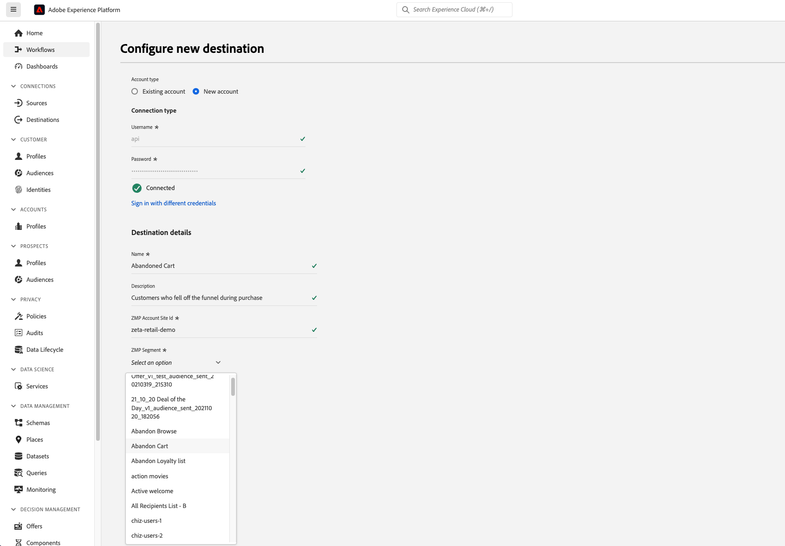
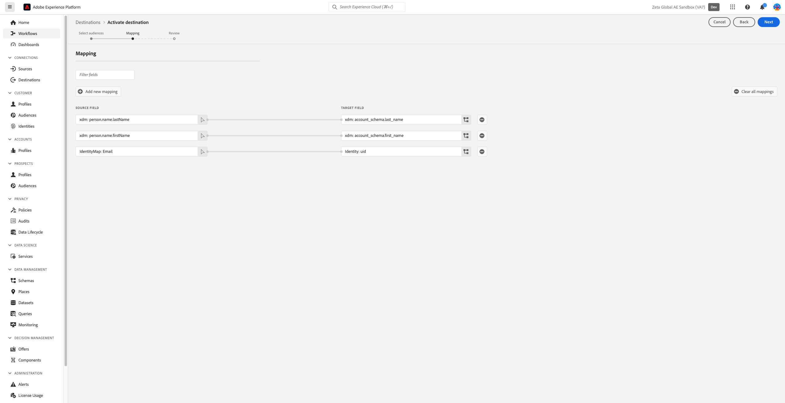
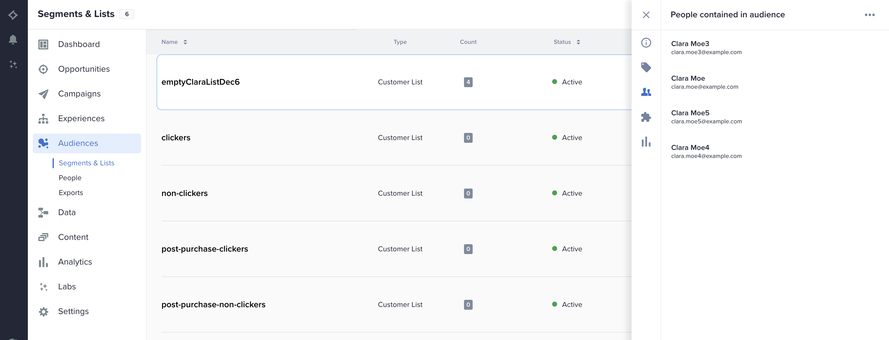
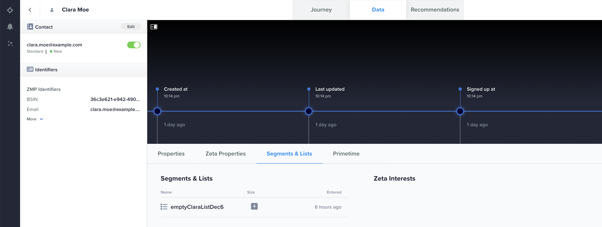

# Zeta マーケティングプラットフォーム {#zeta-marketing-platform}

## 概要 {#overview}

Zeta マーケティングプラットフォーム（ZMP）は、インテリジェンス（独自のデータとAI）を活用して、より効率的に顧客を獲得、成長、維持するのに役立つクラウドベースのシステムです。 詳細については、[Zeta Global](https://zetaglobal.com/)を参照してください。

[!DNL Adobe Experience Platform]で利用可能なZeta Marketing Platform コネクタを使用すると、Experience PlatformからZMPにオーディエンスをシームレスに同期できます。

>[!IMPORTANT]
>
>宛先コネクタとドキュメント ページは、*Zeta Global* チームによって作成および管理されます。 お問い合わせやアップデートのリクエストについては、[お問い合わせ](https://zetaglobal.com/about/contact-us/)のチームにお問い合わせください。

## ユースケース {#use-cases}

### オーディエンスセグメントの構築 {#use-case-build-audiences}

マーケターは、独自のオーディエンスプロファイルを構築し、最も価値のあるセグメントを特定し、Zeta Marketing Platformがサポートするあらゆるデジタルチャネルで使用したいと考えています。 消費者プロファイルの全体像を構築し、有意義なオーディエンスを構築して、活性化する必要があります。 Zeta Marketing Platformがサポートするチャネルの詳細については、[こちら](https://zetaglobal.com/platform/integrations/)を参照してください。

### 広告で利用者をターゲティング {#use-case-target-users}

広告主は、Zeta Demand Side Platform（DSP）を通じて、特定のオーディエンス内の利用者をターゲットにすることを目指しています。 ゼータDSPの詳細については、[こちら](https://knowledgebase.zetaglobal.com/pug/)をクリックしてください。

## 前提条件 {#prerequisites}

### Zeta マーケティングプラットフォームの前提条件 {#zmp-prerequisites}

* Zeta Marketing Platformの宛先への新しい接続を設定する前に、Zeta Marketing Platform アカウントに空の顧客リストを作成する必要があります。 送信する[!DNL Adobe Experience Platform] オーディエンスを受信するには、指定されたターゲットとして、これらの顧客リストのいずれかを選択する必要があります。 ZMPで空の顧客リストを作成するには、[こちら](https://knowledgebase.zetaglobal.com/kb/creating-audiences#CreatingAudiences-CreatingaCustomerList)の手順に従います。
* [!DNL Adobe Experience Platform]では、特定のZMP宛先インスタンスに対して複数のオーディエンスをアクティブ化できますが、各ZMP宛先インスタンスが受け取るのは、1つのExperience Platform オーディエンスのみであることが必須です。 Experience Platformから複数のオーディエンスを処理するには、各オーディエンスに対してZMP宛先インスタンスを作成し、ドロップダウンから別の顧客リストを選択します。 このアプローチにより、ターゲット ZMP オーディエンスが上書きされないようにします。 詳しくは、[宛先の詳細を入力](#destination-details)するを参照してください。
* 宛先を設定するには、次の資格情報を使用します。
   * ユーザー名：**api**
   * パスワード：ZMP REST API キー。 ZMP アカウントにログインし、**Settings** > **Integrations** > **Keys &amp; Apps** セクションに移動すると、REST API キーを見つけることができます。 詳しくは、[ZMP ドキュメント ](https://knowledgebase.zetaglobal.com/kb/integrations)を参照してください。

## サポートされている ID {#supported-identities}

[!DNL Zeta Marketing Platform]は、次の表に示すカスタム ユーザーIDのアクティブ化をサポートしています。 詳しくは、[ID](/help/identity-service/features/namespaces.md)を参照してください。

>[!IMPORTANT]
>
> Zeta Marketing Platformの宛先では、ソース ID名前空間をZMP `uid` ターゲット IDにマッピングする必要があります。 これは、Zeta マーケティングプラットフォームが各プロファイルを独自に区別するのに役立ちます。

| ターゲット ID | 説明 | 注意点 | メモ |
|---------|----------|----------|----------|
| uid | 顧客プロファイルを区別するためにZMPが使用する一意のID | 必須 | 電子メールアドレスを使用して一意のプロファイルを識別する場合は、`Email`標準ID名前空間を選択します。 または、顧客プロファイルにメールがない場合は、カスタム名前空間を`uid`にマッピングすることもできます。 |
| email_md5_id | 各顧客プロファイルを表すメール MD5 | オプション | メール MD5値を使用して顧客プロファイルを一意に識別する場合は、このターゲット IDを選択します。 Experience PlatformではプレーンテキストがMD5に変換されないため、Experience Platform内でメールアドレスが既にMD5形式になっていることが必要です。 このシナリオでは、`uid` （必須）を同じメール MD5値または別の適切なID名前空間に設定します。 |

{style="table-layout:auto"}

## サポートされるオーディエンス {#supported-audiences}

この節では、この宛先に書き出すことができるオーディエンスのタイプについて説明します。

| オーディエンスの由来 | サポートあり | 説明 |
|---------|----------|----------|
| [!DNL Segmentation Service] | ○ | Experience Platform [ セグメント化サービス ](../../../segmentation/home.md)を通じて生成されたオーディエンス。 |
| その他すべてのオーディエンスの生成元 | × | このカテゴリには、[!DNL Segmentation Service]を通じて生成されたオーディエンス以外のすべてのオーディエンスのオリジンが含まれます。 [様々なオーディエンスの起源](/help/segmentation/ui/audience-portal.md#customize)について読みます。 次に例を示します。 <ul><li> カスタムアップロードオーディエンス [がCSV ファイルからExperience Platformに](../../../segmentation/ui/audience-portal.md#import-audience)をインポートしました。</li><li> 類似オーディエンス， </li><li> 連合オーディエンス， </li><li> [!DNL Adobe Journey Optimizer]などの他のExperience Platform アプリで生成されたオーディエンス </li><li> その他。 </li></ul> |

{style="table-layout:auto"}

>[!NOTE]
>
> 個々のメンバーがExperience Platform オーディエンスに追加または削除されると、更新がZMPに送信され、宛先のお客様リストが適切に同期されます。

## 書き出しのタイプと頻度 {#export-type-frequency}

宛先の書き出しのタイプと頻度について詳しくは、以下の表を参照してください。

| 項目 | タイプ | メモ |
|---------|----------|---------|
| 書き出し頻度 | **[!UICONTROL Streaming]** | ストリーミングの宛先は常に、API ベースの接続です。セグメント評価に基づいて Experience Platform 内でプロファイルが更新されるとすぐに、コネクタは更新を宛先プラットフォームに送信します。詳しくは、[ストリーミングの宛先](/help/destinations/destination-types.md#streaming-destinations)を参照してください。 |

{style="table-layout:auto"}

オーディエンスのデータタイプ別にサポートされるオーディエンス：

| オーディエンスのデータタイプ | サポートあり | 説明 | ユースケース |
|--------------------|-----------|-------------|-----------|
| [人物オーディエンス ](/help/segmentation/types/people-audiences.md) | ○ | 顧客プロファイルにもとづいて、マーケティング施策の特定のグループをターゲットにすることができます。 | 買い物客やカートの放棄が多い |
| [ アカウントオーディエンス ](/help/segmentation/types/account-audiences.md) | × | アカウントベースドマーケティング戦略のために、特定の組織内の個人をターゲットにします。 | B2B マーケティング |
| [見込みオーディエンス ](/help/segmentation/types/prospect-audiences.md) | × | まだ顧客ではないが、ターゲットオーディエンスと特徴を共有する個人をターゲットにします。 | サードパーティデータによる見込み顧客の開拓 |
| [ データセットの書き出し](/help/catalog/datasets/overview.md) | × | [!DNL Adobe Experience Platform] データ レイクに保存されている構造化データのコレクション。 | レポート，データサイエンスワークフロー |

{style="table-layout:auto"}

## 宛先への接続 {#connect}

>[!IMPORTANT]
>
>宛先に接続するには、**[!UICONTROL Manage Destinations]** [ アクセス制御権限](/help/access-control/home.md#permissions)が必要です。 詳しくは、[アクセス制御の概要](/help/access-control/ui/overview.md)または製品管理者に問い合わせて、必要な権限を取得してください。

この宛先に接続するには、[宛先設定のチュートリアル](../../ui/connect-destination.md)の手順に従ってください。宛先の設定ワークフローで、以下の 2 つのセクションにリストされているフィールドに入力します。

### 宛先に対する認証 {#authenticate}

宛先に対して認証を行うには、必須フィールドに入力し、**[!UICONTROL Connect to destination]**&#x200B;を選択します。

* **[!UICONTROL Username]**：`api`
* **[!UICONTROL Password]**: ZMP REST API キー。 ZMP アカウントにログインし、**Settings** > **Integrations** > **Keys &amp; Apps** セクションに移動すると、REST API キーを見つけることができます。 詳しくは、[ZMP ドキュメント ](https://knowledgebase.zetaglobal.com/kb/integrations)を参照してください。

### 宛先の詳細を入力 {#destination-details}

宛先の詳細を設定するには、以下の必須フィールドとオプションフィールドに入力します。UI のフィールドの横のアスタリスクは、そのフィールドが必須であることを示します。

* **[!UICONTROL Name]**：今後この宛先を認識する際に使用する名前。
* **[!UICONTROL Description]**：今後この宛先を特定するのに役立つ説明です。
* **[!UICONTROL ZMP Account Site Id]**: オーディエンスを送信するZMP **サイト ID**。 サイト IDを表示するには、**設定** > **統合** > **キーとアプリ** セクションに移動します。 詳細については、[こちら](https://knowledgebase.zetaglobal.com/kb/integrations)を参照してください。
* **[!UICONTROL ZMP Segment]**: Experience Platform オーディエンスで更新するZMP サイト ID アカウント内のお客様リストセグメント。

### アラートの有効化 {#enable-alerts}

アラートを有効にすると、宛先へのデータフローのステータスに関する通知を受け取ることができます。リストからアラートを選択して、データフローのステータスに関する通知を受け取るよう登録します。アラートについて詳しくは、[UI を使用した宛先アラートの購読](../../ui/alerts.md)についてのガイドを参照してください。

宛先接続の詳細の提供が完了したら、**[!UICONTROL Next]**&#x200B;を選択します。

## この宛先に対してオーディエンスをアクティブ化 {#activate}

>[!IMPORTANT]
>
>* データをアクティブ化するには、**[!UICONTROL Manage Destinations]**、**[!UICONTROL Activate Destinations]**、**[!UICONTROL View Profiles]**&#x200B;および&#x200B;**[!UICONTROL View Segments]** [ アクセス制御権限](/help/access-control/home.md#permissions)が必要です。 [アクセス制御の概要](/help/access-control/ui/overview.md)を参照するか、製品管理者に問い合わせて必要な権限を取得してください。
>* *ID*&#x200B;をエクスポートするには、**[!UICONTROL View Identity Graph]** [ アクセス制御権限](/help/access-control/home.md#permissions)が必要です。  {width="100" zoomable="yes"}

この宛先に対してオーディエンスをアクティブ化する手順については、[ ストリーミング宛先に対するオーディエンスのアクティブ化](/help/destinations/ui/activate-segment-streaming-destinations.md)を参照してください。

### 属性と ID のマッピング {#map}

以下は、プロファイルを[!DNL Zeta Marketing Platform]に書き出す際の正しいID マッピングの例です。

ソースフィールドの選択：

* `Email`と[!DNL Adobe Experience Platform]のプロファイルを一意に識別するソース ID名前空間（[!DNL Zeta Marketing Platform]などのカスタムまたは標準）を選択します。
* [!DNL Zeta Marketing Platform]で書き出して更新する必要があるXDM ソースプロファイル属性を選択します。

ターゲットフィールドの選択：

* （必須） ソース ID名前空間をマッピングするターゲット IDとして`uid`を選択します。
* （オプション）電子メール md5値を表すソース ID名前空間をマッピングしたターゲット IDとして、`email_md5_id`を選択します。 Experience PlatformではプレーンテキストがMD5に変換されないため、Experience Platform内でメールアドレスが既にMD5形式になっていることが重要です
* 必要に応じて、追加のターゲットマッピングを選択します。

## 書き出されたデータ／データ書き出しの検証 {#exported-data}

Experience PlatformからZeta Marketing Platformへのオーディエンスアクティベーションが成功すると、ZMPのターゲットカスタマーリストが更新されます。 ターゲット顧客リストのカウントとサンプルプロファイルは、正常にアクティブ化されたIDの数に等しくなります。

ZMP顧客リスト

Experience Platformからアクティブ化された各オーディエンスメンバーは、ZMPの&#x200B;**Audiences** > **People**&#x200B;の下にも表示されます。 また、プロファイルが属する&#x200B;**顧客リスト** セグメントを単一の顧客ビューで表示することもできます（以下を参照）。

## データの使用とガバナンス {#data-usage-governance}

[!DNL Adobe Experience Platform] のすべての宛先は、データを処理する際のデータ使用ポリシーに準拠しています。[!DNL Adobe Experience Platform] がどのように データガバナンスを実施するかについて詳しくは、[データガバナンスの概要](/help/data-governance/home.md)を参照してください。

## その他のリソース {#additional-resources}

* [Zeta ナレッジベース ](https://knowledgebase.zetaglobal.com/kb/)
