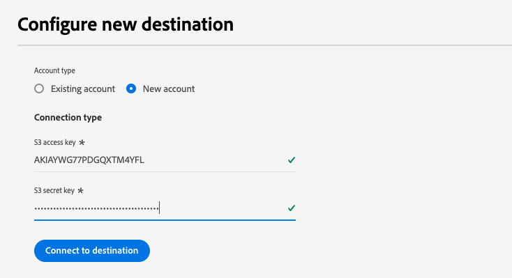

# [!DNL Acxiom Data Enhancement] 宛先接続

>[!NOTE]
>
>The [!DNL Acxiom Data Enhancement] の宛先はベータ版です。  この宛先コネクタとドキュメントページは、Acxiom チームが作成および管理します。 お問い合わせや更新のご依頼は、acxiom-adobe-help@acxiom.comから直接お問い合わせください。

## 概要 {#overview}

Acxiom Data Enhancement コネクタを使用して、分析、セグメント化、ターゲティングアプリケーションで使用する、追加の記述データをAdobeプロファイルに提供します。 数百の要素を利用できるので、ユーザーはより良いセグメント化とモデルデータを作成でき、より正確なターゲティングと予測モデリングをおこなうことができます。

このチュートリアルでは、 [!DNL Acxiom Data Enhancement] Adobe Experience Platformユーザーインターフェイスを使用した宛先接続とデータフロー。  このコネクタは、Amazon S3 をドロップポイントとして使用し、Acxiom 拡張サービスにデータを配信するために使用されます。

## ユースケース {#use-cases}

Acxiom Data Enhancement の宛先をいつどのように使用するかを理解しやすくするために、Adobe Experience Platformのお客様がこの宛先を使用して解決できる使用例を以下に示します。

### 顧客データの強化 {#enhance-customer-data}

このコネクタは、マーケティングの専門家が、選択した記述要素をAdobeプロファイルに追加し、キャンペーンのターゲットを絞り込むために、アウトリーチ戦略の効果を高めるために使用する必要があります。

例えば、マーケターは、追加のデータを使用してプロファイルをエンリッチメントすることで、既存のオーディエンスの理解を深めたい場合があります。 これにより、セグメント化とターゲティングの戦略が改善され、キャンペーンのパーソナライゼーションとコンバージョンが向上します。

このユースケースは、宛先コネクタとソースコネクタの両方を組み合わせて実行します。

まず、この宛先コネクタを使用して、エンリッチメント用に既存の顧客レコードを書き出します。 Acxiom のサービスは、ファイルを検索し、取得し、Acxiom のデータで拡張し、ファイルを生成します。

次に、対応する Acxiom データ取り込みソースカードを使用して、ハイドレートされた顧客プロファイルをAdobe Real-Time CDPに取り込みます。

## 前提条件 {#prerequisites}

>[!IMPORTANT]
>
>* 宛先に接続するには、 **[!UICONTROL 宛先の表示]** および **[!UICONTROL 宛先の管理]**, **[!UICONTROL 宛先のアクティブ化]**, **[!UICONTROL プロファイルの表示]**、および **[!UICONTROL セグメントを表示]** [アクセス制御権限](/help/access-control/home.md#permissions). [アクセス制御の概要](/help/access-control/ui/overview.md)を参照するか、製品管理者に問い合わせて必要な権限を取得してください。
>* 書き出す *id*、 **[!UICONTROL ID グラフを表示]** [アクセス制御権限](/help/access-control/home.md#permissions).   {width="100" zoomable="yes"}

## サポートされるオーディエンス {#supported-audiences}

この節では、この宛先に書き出すことができるオーディエンスのタイプについて説明します。

| オーディエンスの起源 | サポートあり | 説明 |
|-----------------------------|-----------|---------------------------------------------------------------------------------------------------------------------|
| [!DNL Segmentation Service] | ✓ | Experience Platform [セグメント化サービス](../../../segmentation/home.md). |
| カスタムアップロード | x | CSV ファイルから Experience Platform に[読み込まれた](../../../segmentation/ui/overview.md#import-audience)オーディエンス。 |

{style="table-layout:auto"}

## 書き出しのタイプと頻度 {#export-type-frequency}

宛先の書き出しのタイプと頻度について詳しくは、以下の表を参照してください。

| 項目 | タイプ | メモ |
|------------------|--------------------------------|------------------------------------------------------------------------------------------------------------------------------------------------------------------------------------------------------------------------------------------------------------------------------------------------------------------------|
| 書き出しタイプ | **[!UICONTROL プロファイルベース]** | [宛先のアクティベーションワークフロー](/help/destinations/ui/activate-batch-profile-destinations.md#select-attributes)のプロファイル属性選択画面で選択した目的のスキーマフィールド（例：メールアドレス、電話番号、姓）と共に、セグメントのすべてのメンバーを書き出します。 |
| 書き出し頻度 | **[!UICONTROL バッチ]** | バッチ宛先では、ファイルが 3 時間、6 時間、8 時間、12 時間、24 時間の単位でダウンストリームプラットフォームに書き出されます。 詳しくは、[バッチ（ファイルベース）宛先](/help/destinations/destination-types.md#file-based)を参照してください。 |

{style="table-layout:auto"}

## 宛先への接続 {#connect}

>[!IMPORTANT]
>
>宛先に接続するには、 **[!UICONTROL 宛先の表示]** および **[!UICONTROL データセットの宛先の管理とアクティブ化]** [アクセス制御権限](/help/access-control/home.md#permissions). [アクセス制御の概要](/help/access-control/ui/overview.md)を参照するか、製品管理者に問い合わせて必要な権限を取得してください。

### 宛先に対する認証 {#authenticate}

宛先に対して認証するには、必須フィールドに入力し、「**[!UICONTROL 宛先に接続]**」を選択します。

Experience Platformでバケットにアクセスするには、次の資格情報に有効な値を指定する必要があります。

| 資格情報 | 説明 |
|---------------|----------------------------------------------------------------------------------------------------------|
| S3 アクセスキー | バケットのアクセスキー ID。 この値は、 [!DNL Acxiom] チーム。 |
| S3 秘密鍵 | バケットの秘密鍵 ID。 この値は、 [!DNL Acxiom] チーム。 |
| バケット名 | これはファイルが共有されるグループです。 この値は、 [!DNL Acxiom] チーム。 |

### 新しいアカウント

新しい Acxiom Managed S3 の場所を定義するには：

### 既存のアカウント

Acxiom データ拡張カードを使用して既に定義されているアカウントは、リストポップアップに表示され、選択すると、アカウントの詳細が表示されます。  次に、UI の例で、に移動したときの例を示します。 **宛先** > **アカウント**;

### 宛先の詳細を入力 {#destination-details}

宛先の詳細を設定するには、以下の必須フィールドとオプションフィールドに入力します。UI のフィールドの横のアスタリスクは、そのフィールドが必須であることを示します。

* **名前（必須）**  — 宛先が保存される名前
* **説明** ・目的の簡単な説明
* **バケット名（必須）** - S3 で設定されているAmazon S3 バケットの名前
* **フォルダーパス（必須）**  — バケット内のサブディレクトリを使用する場合は、パスを定義する必要があります。または、ルートパスを参照するために「/」を定義する必要があります。
* **ファイルタイプ**  — 書き出すファイルに使用する形式Experience Platformを選択します。 現在、Acxiom 処理で必要なファイルタイプは CSV のみです

>[!IMPORTANT]
>
>「 CSV 」オプションを選択する場合、 *区切り*, *引用符文字*, *エスケープ文字*, *空の値*, *Null 値*, *圧縮形式*、および *マニフェストファイルを含める* オプションが表示されます。次のドキュメントでは、これらの設定の詳細を説明します。 [書式設定オプションの設定](../../ui/batch-destinations-file-formatting-options.md).

### アラートの有効化 {#enable-alerts}

アラートを有効にすると、宛先へのデータフローのステータスに関する通知を受け取ることができます。リストからアラートを選択して、データフローのステータスに関する通知を受け取るよう登録します。アラートについて詳しくは、[UI を使用した宛先アラートの購読](../../ui/alerts.md)についてのガイドを参照してください。

宛先接続の詳細の入力を終えたら「**[!UICONTROL 次へ]**」を選択します。

## この宛先に対してオーディエンスをアクティブ化 {#activate}

>[!IMPORTANT]
>
>* データをアクティブ化するには、 **[!UICONTROL 宛先の表示]**, **[!UICONTROL 宛先のアクティブ化]**, **[!UICONTROL プロファイルの表示]**、および **[!UICONTROL セグメントを表示]** [アクセス制御権限](/help/access-control/home.md#permissions). [アクセス制御の概要](/help/access-control/ui/overview.md)を参照するか、製品管理者に問い合わせて必要な権限を取得してください。
>* 書き出す *id*、 **[!UICONTROL ID グラフを表示]** [アクセス制御権限](/help/access-control/home.md#permissions).   {width="100" zoomable="yes"}

この宛先に対してオーディエンスをアクティブ化する手順については、[バッチプロファイル書き出し宛先に対するオーディエンスデータのアクティブ化](/help/destinations/ui/activate-batch-profile-destinations.md)を参照してください。

### マッピング候補

Acxiom 側で正しくファイルを処理するには、名前とアドレスの要素が必要です。 すべての要素が必要とは限りませんが、できる限り多くの要素を指定すると、照合が成功します。

マッピングの候補は、Acxiom 処理でプロファイル属性のマッピング先となる属性のリストを次の表に示します。 すべての要素が必要とは限らず、ソースの値はアカウントのニーズに応じて異なるので、これらの要素を提案として扱います。

| ターゲットフィールド | ソースの説明 |
|--------------|-------------------------------------------------------------|
| name | Experience Platformの person.name.fullName 値。 |
| firstName | Experience Platformの person.name.firstName 値。 |
| lastName | Experience Platformの person.name.lastName 値。 |
| address1 | Experience Platformの mailingAddress.street1 値。 |
| address2 | Experience Platformの mailingAddress.street2 値。 |
| 都市 | Experience Platformの mailingAddress.city 値。 |
| state | Experience Platformの mailingAddress.state 値。 |
| 郵便番号 | Experience Platformの mailingAddress.postalCode 値。 |

>[!NOTE]
>
>データフローに上記のリストにない追加フィールドをマッピングした場合、それらはデータエクスポートに含まれますが、Acxiom の処理では無視されます。

## データの書き出しを検証する {#exported-data}

データが正常に書き出されたかどうかを確認するには、[!DNL Amazon S3 Storage] バケットを確認し、書き出したファイルに、期待されたプロファイルの母集団が含まれていることを確認します。

## 次の手順

このチュートリアルに従うことで、プロファイルデータをExperience Platformからに書き出すデータフローを正常に作成しました [!DNL Acxiom] 管理された S3 の場所。 次に、処理を設定できるよう、アカウント名、ファイル名、およびバケットのパスを Acxiom 担当者に問い合わせる必要があります。

## データの使用とガバナンス {#data-usage-governance}

[!DNL Adobe Experience Platform] のすべての宛先は、データを処理する際のデータ使用ポリシーに準拠しています。[!DNL Adobe Experience Platform] がどのように データガバナンスを実施するかについて詳しくは、[データガバナンスの概要](/help/data-governance/home.md)を参照してください。

## その他のリソース {#additional-resources}

*Acxiom Infobase:* https://www.acxiom.com/wp-content/uploads/2022/02/fs-acxiom-infobase_AC-0268-22.pdf
