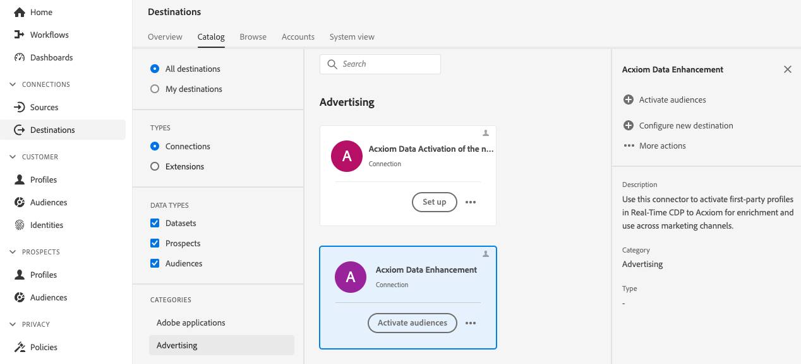
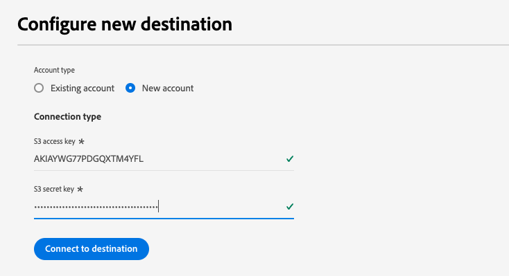
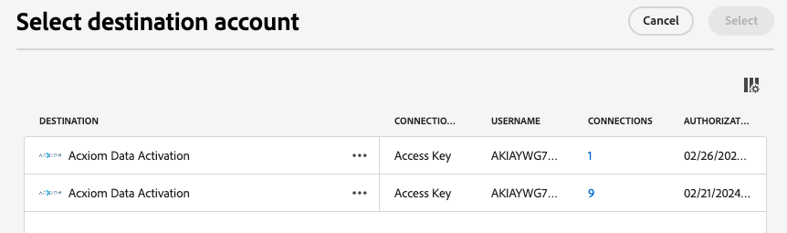
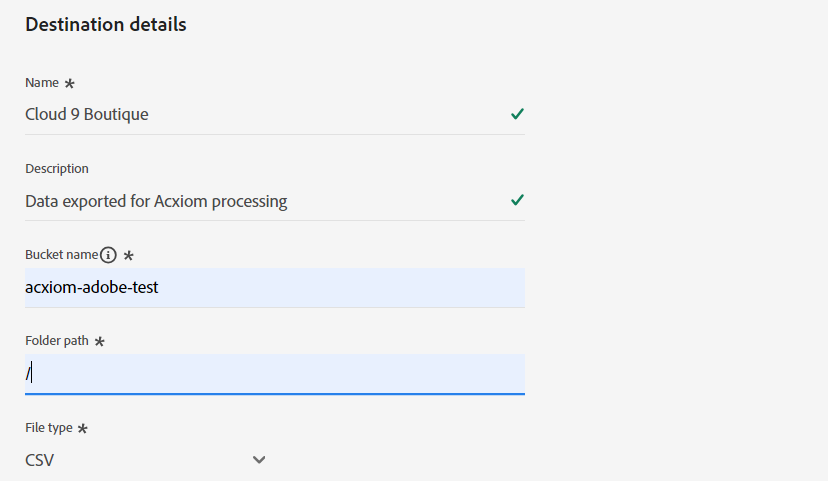
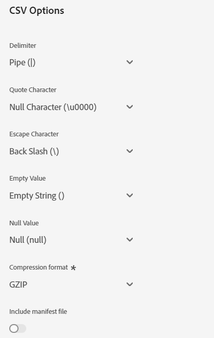

# [!DNL Acxiom Data Enhancement]宛先接続

>[!NOTE]
>
>[!DNL Acxiom Data Enhancement]宛先はベータ版です。  この宛先コネクタとドキュメントページは、Acxiom チームによって作成および管理されます。 お問い合わせやアップデートのご依頼は、acxiom-adobe-help@acxiom.comまで直接お問い合わせください。

## 概要 {#overview}

分析、セグメント化、ターゲティングアプリケーションで使用するために、顧客プロファイルに追加の記述的データを提供するには、[!DNL Acxiom Data Enhancement] コネクタを使用します。 数百もの要素を利用できるため、より優れたセグメンテーションとデータモデリングが可能になり、より正確なターゲティングと予測モデリングが可能になります。

このチュートリアルでは、[!DNL Acxiom Data Enhancement] ユーザーインターフェイスを使用して[!DNL Adobe Experience Platform]宛先接続とデータフローを作成する手順を説明します。 このコネクタは、Amazon S3をドロップポイントとして使用して、Acxiom拡張サービスにデータを配信します。

## ユースケース {#use-cases}

[!DNL Acxiom Data Enhancement]宛先を使用する方法とタイミングをより理解しやすくするために、[!DNL Adobe Experience Platform]のお客様がこの宛先を使用して解決できるユースケースの例を次に示します。

### 顧客データの強化 {#enhance-customer-data}

このコネクタは、顧客プロファイルに選択した記述要素を追加し、キャンペーンをより適切にターゲティングするために、アウトリーチ戦略の効果を高めることを目的としたマーケティング担当者が使用する必要があります。

たとえば、マーケターは、追加データでプロファイルを充実させることで、既存のオーディエンスに対する理解を深めることができるかもしれません。 これにより、セグメンテーションとターゲティング戦略が改善され、キャンペーンのパーソナライゼーションとコンバージョンが向上します。

ユースケースは、宛先コネクタとソースコネクタの両方を組み合わせて実行します。

まず、この宛先コネクタを使用して、既存の顧客レコードをエンリッチメント用にエクスポートします。 Acxiomのサービスは、ファイルを検索して取得し、Acxiomのデータでエンリッチしてファイルを生成します。

お客様は、対応する[Acxiom Data Ingestion](/help/sources/connectors/data-partners/acxiom-data-ingestion.md) ソースカードを使用して、ハイドレートされた顧客プロファイルをAdobe [!DNL Real-Time CDP]に取り込みます。

## 前提条件 {#prerequisites}

>[!IMPORTANT]
>
>* 宛先に接続するには、**[!UICONTROL View Destinations]**&#x200B;および&#x200B;**[!UICONTROL Manage Destinations]**、**[!UICONTROL Activate Destinations]**、**[!UICONTROL View Profiles]**&#x200B;および&#x200B;**[!UICONTROL View Segments]** アクセス制御権限[が必要です。 &#x200B;](/help/access-control/home.md#permissions) [アクセス制御の概要](/help/access-control/ui/overview.md)を参照するか、製品管理者に問い合わせて必要な権限を取得してください。
>* *ID*&#x200B;をエクスポートするには、**[!UICONTROL View Identity Graph]** [&#x200B; アクセス制御権限](/help/access-control/home.md#permissions)が必要です。  {width="100" zoomable="yes"}

## サポートされるオーディエンス {#supported-audiences}

この節では、この宛先に書き出すことができるオーディエンスのタイプについて説明します。

| オーディエンスの由来 | サポートあり | 説明 |
|---------|----------|----------|
| [!DNL Segmentation Service] | ○ | Experience Platform [&#x200B; セグメント化サービス &#x200B;](../../../segmentation/home.md)を通じて生成されたオーディエンス。 |
| その他すべてのオーディエンスの生成元 | × | このカテゴリには、[!DNL Segmentation Service]を通じて生成されたオーディエンス以外のすべてのオーディエンスのオリジンが含まれます。 [様々なオーディエンスの起源](/help/segmentation/ui/audience-portal.md#customize)について読みます。 次に例を示します。 <ul><li> カスタムアップロードオーディエンス [がCSV ファイルからExperience Platformに](../../../segmentation/ui/audience-portal.md#import-audience)をインポートしました。</li><li> 類似オーディエンス， </li><li> 連合オーディエンス， </li><li> [!DNL Adobe Journey Optimizer]などの他のExperience Platform アプリで生成されたオーディエンス </li><li> その他。 </li></ul> |

{style="table-layout:auto"}

オーディエンスのデータタイプ別にサポートされるオーディエンス：

| オーディエンスのデータタイプ | サポートあり | 説明 | ユースケース |
|--------------------|-----------|-------------|-----------|
| [人物オーディエンス &#x200B;](/help/segmentation/types/people-audiences.md) | ○ | 顧客プロファイルにもとづいて、マーケティング施策の特定のグループをターゲットにすることができます。 | 買い物客やカートの放棄が多い |
| [&#x200B; アカウントオーディエンス &#x200B;](/help/segmentation/types/account-audiences.md) | × | アカウントベースドマーケティング戦略のために、特定の組織内の個人をターゲットにします。 | B2B マーケティング |
| [見込みオーディエンス &#x200B;](/help/segmentation/types/prospect-audiences.md) | × | まだ顧客ではないが、ターゲットオーディエンスと特徴を共有する個人をターゲットにします。 | サードパーティデータによる見込み顧客の開拓 |
| [&#x200B; データセットの書き出し](/help/catalog/datasets/overview.md) | × | [!DNL Adobe Experience Platform] データ レイクに保存されている構造化データのコレクション。 | レポート，データサイエンスワークフロー |

{style="table-layout:auto"}

## 書き出しのタイプと頻度 {#export-type-frequency}

宛先の書き出しタイプと頻度については、次の表を参照してください。

| 項目 | タイプ | メモ |
|------------------|--------------------------------|------------------------------------------------------------------------------------------------------------------------------------------------------------------------------------------------------------------------------------------------------------------------------------------------------------------------|
| 書き出しタイプ | **[!UICONTROL Profile-based]** | [宛先のアクティベーションワークフロー](/help/destinations/ui/activate-batch-profile-destinations.md#select-attributes)のプロファイル属性選択画面で選択した目的のスキーマフィールド（例：メールアドレス、電話番号、姓）と共に、セグメントのすべてのメンバーを書き出します。 |
| 書き出し頻度 | **[!UICONTROL Batch]** | バッチ宛先では、ファイルが 3 時間、6 時間、8 時間、12 時間、24 時間の単位でダウンストリームプラットフォームに書き出されます。 詳しくは、[バッチ（ファイルベース）宛先](/help/destinations/destination-types.md#file-based)を参照してください。 |

{style="table-layout:auto"}

## 宛先への接続 {#connect}

>[!IMPORTANT]
>
>宛先に接続するには、**[!UICONTROL View Destinations]**&#x200B;および&#x200B;**[!UICONTROL Manage and Activate Dataset Destinations]** [&#x200B; アクセス制御権限](/help/access-control/home.md#permissions)が必要です。 詳しくは、[アクセス制御の概要](/help/access-control/ui/overview.md)または製品管理者に問い合わせて、必要な権限を取得してください。

この宛先に接続するには、[宛先設定のチュートリアル](../../ui/connect-destination.md)の手順に従ってください。宛先の設定ワークフローで、以下の 2 つの節でリストされているフィールドに入力します。

### 宛先に対する認証 {#authenticate}

宛先に対して認証を行うには、必須フィールドに入力し、**[!UICONTROL Connect to destination]**&#x200B;を選択します。

Experience Platformでバケットにアクセスするには、次の資格情報に有効な値を指定する必要があります。

| 資格情報 | 説明 |
|---------------|----------------------------------------------------------------------------------------------------------|
| S3 アクセスキー | バケットのアクセスキーID。 この値は、[!DNL Acxiom] チームから取得できます。 |
| S3秘密鍵 | バケットの秘密鍵ID。 この値は、[!DNL Acxiom] チームから取得できます。 |
| バケット名 | これはファイルが共有されるバケットです。 この値は、[!DNL Acxiom] チームから取得できます。 |

### 新規アカウント {#new-account}

新しいAcxiom Managed S3の場所を定義するには：

### 既存アカウント {#existing-account}

[!DNL Acxiom Data Enhancement]宛先を使用して既に定義されているアカウントが、リストポップアップに表示されます。 選択すると、右側のパネルにアカウントの詳細が表示されます。 **[!UICONTROL Destinations]** > **[!UICONTROL Accounts]**&#x200B;に移動すると、UIから例を表示します。

### 宛先の詳細を入力 {#destination-details}

宛先の詳細を設定するには、以下の必須フィールドとオプションフィールドに入力します。UI のフィールドの横のアスタリスクは、そのフィールドが必須であることを示します。

* **名前（必須）** – 宛先が保存される名前
* **説明** – 宛先の目的の短い説明
* **バケット名（必須）** - S3に設定されたAmazon S3 バケットの名前
* **フォルダーパス （必須）** - バケット内のサブディレクトリを使用する場合は、ルートパスを参照するためにパスを定義するか、&#39;/&#39;する必要があります。
* **ファイルの種類** – 書き出したファイルにExperience Platformで使用する形式を選択します。 現在、Acxiom処理で想定される唯一のファイルタイプはCSVです

>[!IMPORTANT]
>
>CSV オプションを選択すると、*区切り記号*、*引用符*、*エスケープ文字*、*空の値*、*ヌル値*、*圧縮形式*、*マニフェストファイルを含める* オプションが表示されます。次のドキュメントでは、これらの設定について詳しく説明しています。[書式設定](../../ui/batch-destinations-file-formatting-options.md)。

### アラートの有効化 {#enable-alerts}

アラートを有効にすると、宛先へのデータフローのステータスに関する通知を受け取ることができます。リストからアラートを選択して、データフローのステータスに関する通知を受け取るよう登録します。アラートについて詳しくは、[UI を使用した宛先アラートの購読](../../ui/alerts.md)についてのガイドを参照してください。

宛先接続の詳細の提供が完了したら、**[!UICONTROL Next]**&#x200B;を選択します。

## この宛先に対してオーディエンスをアクティブ化 {#activate}

>[!IMPORTANT]
>
>* データをアクティブ化するには、**[!UICONTROL View Destinations]**、**[!UICONTROL Activate Destinations]**、**[!UICONTROL View Profiles]**&#x200B;および&#x200B;**[!UICONTROL View Segments]** [&#x200B; アクセス制御権限](/help/access-control/home.md#permissions)が必要です。 [アクセス制御の概要](/help/access-control/ui/overview.md)を参照するか、製品管理者に問い合わせて必要な権限を取得してください。
>* *ID*&#x200B;をエクスポートするには、**[!UICONTROL View Identity Graph]** [&#x200B; アクセス制御権限](/help/access-control/home.md#permissions)が必要です。  {width="100" zoomable="yes"}

この宛先に対してオーディエンスをアクティブ化する手順については、[バッチプロファイル書き出し宛先に対するオーディエンスデータのアクティブ化](/help/destinations/ui/activate-batch-profile-destinations.md)を参照してください。

### マッピングの提案 {#mapping-suggestions}

Acxiom側のファイルの正しい処理には、名前とアドレス要素が必要です。 すべての要素が必要なわけではありませんが、できるだけ多くの要素を提供することで、マッチングを成功させることができます。

マッピングの提案は、次の表に、宛先側の属性のリストを示します。この属性は、顧客がプロファイル属性をマッピングできるAcxiom処理で使用されます。 すべての要素が必要ではなく、ソース値はアカウントのニーズに応じて異なるため、これらの要素を提案として扱います。

| ターゲットフィールド | Sourceの説明 |
|--------------|-------------------------------------------------------------|
| name | Experience Platformの`person.name.fullName`値。 |
| firstName | Experience Platformの`person.name.firstName`値。 |
| lastName | Experience Platformの`person.name.lastName`値。 |
| address1 | Experience Platformの`mailingAddress.street1`値。 |
| address2 | Experience Platformの`mailingAddress.street2`値。 |
| 都市 | Experience Platformの`mailingAddress.city`値。 |
| state | Experience Platformの`mailingAddress.state`値。 |
| zip | Experience Platformの`mailingAddress.postalCode`値。 |

>[!NOTE]
>
>上記のデータフロー以外の追加フィールドをマッピングする場合、これらのフィールドはデータ書き出しに含まれますが、Acxiom処理では無視されます。

## データの書き出しを検証する {#exported-data}

データが正常に書き出されたかどうかを確認するには、[!DNL Amazon S3 Storage] バケットを確認し、書き出したファイルに、期待されたプロファイルの母集団が含まれていることを確認します。

## 次の手順 {#next-steps}

Experience Platformから[!DNL Acxiom]管理S3の場所にプロファイルデータを書き出すデータフローが正常に作成されました。 次に、処理をセットアップできるように、Acxiom担当者にアカウント名、ファイル名、バケットパスを連絡する必要があります。

## データの使用とガバナンス {#data-usage-governance}

[!DNL Adobe Experience Platform] のすべての宛先は、データを処理する際のデータ使用ポリシーに準拠しています。[!DNL Adobe Experience Platform] がどのように データガバナンスを実施するかについて詳しくは、[データガバナンスの概要](/help/data-governance/home.md)を参照してください。

## その他のリソース {#additional-resources}

*Acxiom インフォベース：* https://www.acxiom.com/wp-content/uploads/2022/02/fs-acxiom-infobase_AC-0268-22.pdf
