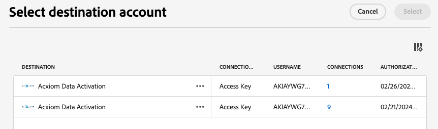

# [!DNL Acxiom Data Enhancement] 宛先接続

>[!NOTE]
>
>[!DNL Acxiom Data Enhancement] の宛先はベータ版です。  この宛先コネクタとドキュメント・ページは、Acxiom チームが作成および管理します。 お問い合わせや更新のリクエストについては、acxiom-adobe-help@acxiom.comまで直接ご連絡ください。

## 概要 {#overview}

[!DNL Acxiom Data Enhancement] コネクタを使用して、分析、セグメント化、ターゲティングアプリケーションで使用する追加の説明データを顧客プロファイルに提供します。 何百もの要素を使用できるので、データのセグメントとモデル化が改善され、より正確なターゲティングと予測モデリングが可能になります。

このチュートリアルでは、Adobe Experience Platform ユーザーインターフェイスを使用して、[!DNL Acxiom Data Enhancement] しい宛先接続とデータフローを作成する手順を説明します。 このコネクタは、Amazon S3 をドロップ・ポイントとして使用して、Acxiom Enhancement Service にデータを配信するために使用されます。

## ユースケース {#use-cases}

[!DNL Acxiom Data Enhancement] の宛先を使用する方法とタイミングをより深く理解するために、Adobe Experience Platformのお客様がこの宛先を使用して解決できるユースケースのサンプルを以下に示します。

### 顧客データの強化 {#enhance-customer-data}

このコネクタは、選択した説明的な要素を顧客プロファイルに追加して、キャンペーンのターゲットを絞り込むことで、アウトリーチ戦略の有効性を高めることを目指すマーケティング担当者が使用する必要があります。

例えば、マーケターの場合、追加のデータでプロファイルを充実させることで、既存オーディエンスの理解を深めたいと考えるかもしれません。 これにより、セグメント化とターゲティング戦略が改善され、キャンペーンのパーソナライゼーションとコンバージョンが大幅に向上します。

ユースケースは、宛先コネクタとソースコネクタの両方を組み合わせて実行されます。

まず、この宛先コネクタを使用して既存の顧客レコードを書き出し、エンリッチメントを行います。 Acxiom のサービスは、ファイルを検索して取得し、Acxiom のデータで拡張してファイルを生成します。

次に、対応する [Acxiom Data Ingestion](/help/sources/connectors/data-partners/acxiom-data-ingestion.md) ソースカードを使用して、ハイドレートされた顧客プロファイルをAdobe Real-Time CDPに取り込みます。

## 前提条件 {#prerequisites}

>[!IMPORTANT]
>
>* 宛先に接続するには、**[!UICONTROL 宛先の表示]** および **[!UICONTROL 宛先の管理]**、**[!UICONTROL 宛先のアクティブ化]**、**[!UICONTROL プロファイルの表示]**、**[!UICONTROL セグメントの表示]**&#x200B;[&#x200B; アクセス制御権限 &#x200B;](/help/access-control/home.md#permissions) が必要です。 [アクセス制御の概要](/help/access-control/ui/overview.md)を参照するか、製品管理者に問い合わせて必要な権限を取得してください。
>* *ID* を書き出すには、**[!UICONTROL ID グラフの表示]**&#x200B;[&#x200B; アクセス制御権限 &#x200B;](/help/access-control/home.md#permissions) が必要です。  {width="100" zoomable="yes"}

## サポートされるオーディエンス {#supported-audiences}

この節では、この宛先に書き出すことができるオーディエンスのタイプについて説明します。

| オーディエンスオリジン | サポートあり | 説明 |
|-----------------------------|-----------|---------------------------------------------------------------------------------------------------------------------|
| [!DNL Segmentation Service] | ✓ | Experience Platform[&#x200B; セグメント化サービス &#x200B;](../../../segmentation/home.md) を通じて生成されたオーディエンス。 |
| カスタムアップロード | x | CSV ファイルから Experience Platform に[読み込まれた](../../../segmentation/ui/audience-portal.md#import-audience)オーディエンス。 |

{style="table-layout:auto"}

## 書き出しのタイプと頻度 {#export-type-frequency}

宛先の書き出しのタイプと頻度について詳しくは、以下の表を参照してください。

| 項目 | タイプ | メモ |
|------------------|--------------------------------|------------------------------------------------------------------------------------------------------------------------------------------------------------------------------------------------------------------------------------------------------------------------------------------------------------------------|
| 書き出しタイプ | **[!UICONTROL プロファイルベース]** | [宛先のアクティベーションワークフロー](/help/destinations/ui/activate-batch-profile-destinations.md#select-attributes)のプロファイル属性選択画面で選択した目的のスキーマフィールド（例：メールアドレス、電話番号、姓）と共に、セグメントのすべてのメンバーを書き出します。 |
| 書き出し頻度 | **[!UICONTROL バッチ]** | バッチ宛先では、ファイルが 3 時間、6 時間、8 時間、12 時間、24 時間の単位でダウンストリームプラットフォームに書き出されます。 詳しくは、[バッチ（ファイルベース）宛先](/help/destinations/destination-types.md#file-based)を参照してください。 |

{style="table-layout:auto"}

## 宛先への接続 {#connect}

>[!IMPORTANT]
>
>宛先に接続するには、**[!UICONTROL 宛先の表示]** および **[!UICONTROL データセット宛先の管理とアクティブ化]**&#x200B;[&#x200B; アクセス制御権限 &#x200B;](/help/access-control/home.md#permissions) が必要です。 詳しくは、[アクセス制御の概要](/help/access-control/ui/overview.md)または製品管理者に問い合わせて、必要な権限を取得してください。

この宛先に接続するには、[宛先設定のチュートリアル](../../ui/connect-destination.md)の手順に従ってください。宛先の設定ワークフローで、以下の 2 つの節でリストされているフィールドに入力します。

### 宛先に対する認証 {#authenticate}

宛先に対して認証するには、必須フィールドに入力し、「**[!UICONTROL 宛先に接続]**」を選択します。

Experience Platformのバケットにアクセスするには、次の資格情報に対して有効な値を指定する必要があります。

| 資格情報 | 説明 |
|---------------|----------------------------------------------------------------------------------------------------------|
| S3 アクセスキー | バケットのアクセスキー ID。 この値は [!DNL Acxiom] チームから取得できます。 |
| S3 シークレットキー | バケットの秘密鍵 ID。 この値は [!DNL Acxiom] チームから取得できます。 |
| バケット名 | これは、ファイルが共有されるバケットです。 この値は [!DNL Acxiom] チームから取得できます。 |

### 新しいアカウント

Acxiom Managed S3 の新しい場所を定義するには、以下の手順に従ってください。

### 既存のアカウント

[!DNL Acxiom Data Enhancement] の宛先を使用して既に定義されているアカウントがリストポップアップに表示されます。 選択すると、右側のパネルにアカウントの詳細が表示されます。 **[!UICONTROL Destinations]**/**[!UICONTROL Accounts]** に移動すると、UI から例を表示できます。

### 宛先の詳細を入力 {#destination-details}

宛先の詳細を設定するには、以下の必須フィールドとオプションフィールドに入力します。UI のフィールドの横のアスタリスクは、そのフィールドが必須であることを示します。

* **名前（必須）** – 宛先を保存する名前
* **説明** – 宛先の目的の短い説明
* **バケット名（必須）** - S3 に設定されたAmazon S3 バケットの名前
* **フォルダーパス （必須）** - バケット内のサブディレクトリを使用する場合は、パスを定義するか、「/」を使用してルートパスを参照する必要があります。
* **ファイルの種類** – 書き出したファイルに使用するExperience Platformの形式を選択します。 現在、Acxiom の処理で期待されるファイル・タイプは CSV のみです

>[!IMPORTANT]
>
>CSV オプション *区切り文字*、*引用符文字*、*エスケープ文字*、*空の値*、*Null 値*、*圧縮形式*、*マニフェストファイルを含める* を選択すると、次のドキュメントでこれらの設定について詳しく説明します [&#x200B; 書式設定オプションの設定 &#x200B;](../../ui/batch-destinations-file-formatting-options.md)。

### アラートの有効化 {#enable-alerts}

アラートを有効にすると、宛先へのデータフローのステータスに関する通知を受け取ることができます。リストからアラートを選択して、データフローのステータスに関する通知を受け取るよう登録します。アラートについて詳しくは、[UI を使用した宛先アラートの購読](../../ui/alerts.md)についてのガイドを参照してください。

宛先接続の詳細の入力を終えたら「**[!UICONTROL 次へ]**」を選択します。

## この宛先に対してオーディエンスをアクティブ化 {#activate}

>[!IMPORTANT]
>
>* データをアクティブ化するには、**[!UICONTROL 宛先の表示]**、**[!UICONTROL 宛先のアクティブ化]**、**[!UICONTROL プロファイルの表示]** および **[!UICONTROL セグメントの表示]**&#x200B;[&#x200B; アクセス制御権限 &#x200B;](/help/access-control/home.md#permissions) が必要です。 [アクセス制御の概要](/help/access-control/ui/overview.md)を参照するか、製品管理者に問い合わせて必要な権限を取得してください。
>* *ID* を書き出すには、**[!UICONTROL ID グラフの表示]**&#x200B;[&#x200B; アクセス制御権限 &#x200B;](/help/access-control/home.md#permissions) が必要です。  {width="100" zoomable="yes"}

この宛先に対してオーディエンスをアクティブ化する手順については、[バッチプロファイル書き出し宛先に対するオーディエンスデータのアクティブ化](/help/destinations/ui/activate-batch-profile-destinations.md)を参照してください。

### マッピングの提案

Acxiom 側でのファイルの正しい処理には、名前とアドレスの要素が必要です。 すべての要素が必要なわけではありませんが、できるだけ多くを提供すると、マッチングを成功させるのに役立ちます。

以下の表に、マッピングの提案を示します。この提案は、Acxiom の処理で使用され、顧客がプロファイル属性をマッピングできる宛先側の属性をリストしています。 すべての要素が必要とは限らず、ソース値はアカウントのニーズに応じて異なるので、これらの要素を候補として扱います。

| ターゲットフィールド | Sourceの説明 |
|--------------|-------------------------------------------------------------|
| name | Experience Platform内の `person.name.fullName` 値。 |
| firstName | Experience Platform内の `person.name.firstName` 値。 |
| lastName | Experience Platform内の `person.name.lastName` 値。 |
| 住所 1 | Experience Platform内の `mailingAddress.street1` 値。 |
| 住所 2 | Experience Platform内の `mailingAddress.street2` 値。 |
| 都市 | Experience Platform内の `mailingAddress.city` 値。 |
| state | Experience Platform内の `mailingAddress.state` 値。 |
| 郵便番号 | Experience Platform内の `mailingAddress.postalCode` 値。 |

>[!NOTE]
>
>上記のリストにない追加のフィールドをデータフローにマッピングすると、これらはデータのエクスポートに含まれますが、Acxiom の処理では無視されます。

## データの書き出しを検証する {#exported-data}

データが正常に書き出されたかどうかを確認するには、[!DNL Amazon S3 Storage] バケットを確認し、書き出したファイルに、期待されたプロファイルの母集団が含まれていることを確認します。

## 次の手順

このチュートリアルでは、Experience Platformから [!DNL Acxiom] managed S3 の場所にプロファイルデータを書き出すデータフローを正常に作成しました。 次に、処理をセットアップできるように、アカウント名、ファイル名、バケット パスを Acxiom 担当者に連絡する必要があります。

## データの使用とガバナンス {#data-usage-governance}

[!DNL Adobe Experience Platform] のすべての宛先は、データを処理する際のデータ使用ポリシーに準拠しています。[!DNL Adobe Experience Platform] がどのように データガバナンスを実施するかについて詳しくは、[データガバナンスの概要](/help/data-governance/home.md)を参照してください。

## その他のリソース {#additional-resources}

*Acxiom Infobase:* https://www.acxiom.com/wp-content/uploads/2022/02/fs-acxiom-infobase_AC-0268-22.pdf
