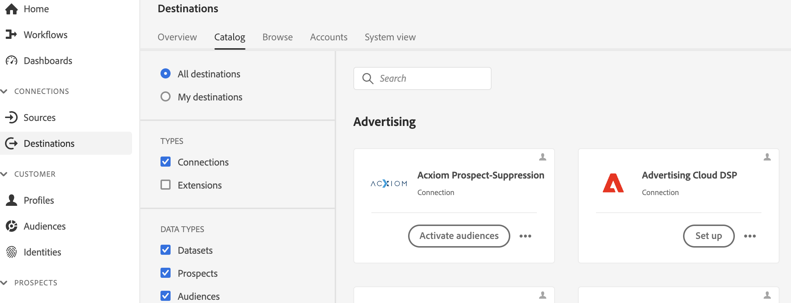
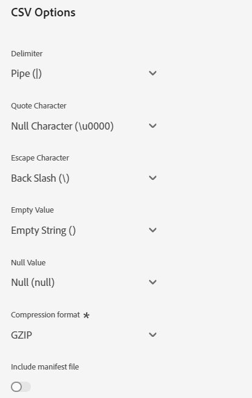

# [!DNL Acxiom Prospect-Suppression] 宛先接続

>[!NOTE]
>
>[!DNL Acxiom Prospect-Suppression] の宛先はベータ版です。 この宛先コネクタとドキュメント・ページは、Acxiom チームが作成および管理します。 お問い合わせや更新のリクエストについては、acxiom-adobe-help@acxiom.comまで直接ご連絡ください。

## 概要 {#overview}

[!DNL Acxiom Prospect-Suppression] を使用すると、可能な限り生産的な見込み客オーディエンスを提供できます。 このコネクタは、Real-Time Customer Data Platformからファーストパーティデータを安全に書き出し、賞を受賞したハイジーンおよび ID 解決を通じて実行され、抑制リストとして使用されるデータファイルを生成します。 これは [!DNL Acxiom Global] データベースと照合され、見込み客リストをインポート用にカスタマイズできます。 次に、[[!DNL Acxiom Prospecting Data Import]](/help/sources/connectors/data-partners/acxiom-prospecting-data-import.md) ソース・コネクタを使用して、Acxiom からReal-Time CDPに見込み客リストを戻し、既知のお客様またはコンバート済みのお客様を削除します。

Acxiom は、業界で最もパフォーマンスの高いオーディエンスを提供し、パーソナライズされたエクスペリエンスの提供に特化した 12,000 を超えるグローバルなデータ属性から成る最大のカタログを提供します。 高品質のデータを無限に組み合わせて利用し、オーディエンスを作成および配布して、特定のキャンペーンニーズを満たします。

このチュートリアルでは、Adobe Experience Platform ユーザーインターフェイスを使用して、[!DNL Acxiom Prospect-Suppression] しい宛先接続とデータフローを作成する手順を説明します。 このコネクタは、Amazon S3 をドロップ・ポイントとして使用して、Acxiom 見込み客サービスにデータを配信するために使用されます。 Amazon S3 ドロップ・ポイントへのファイルのエクスポートを開始したら、Acxiom アカウント担当者にお問い合わせください。

## ユースケース {#use-cases}

[!DNL Acxiom Prospect-Suppression] の宛先を使用する方法とタイミングをより深く理解するために、Adobe Experience Platformのお客様がこの宛先を使用して解決できるユースケースのサンプルを以下に示します。

### データセットを予測するための抑制リストの作成 {#create-suppression-list}

アウトリーチ戦略の有効性を高めることを目的とするマーケティング担当者は、多くの場合、抑制リストの作成を使用します。 このリストには、既存の顧客と特定のセグメントが含まれており、ターゲットキャンペーン中の予測アクティビティから除外されるようにします。 この戦略的なアプローチは、オーディエンスを絞り込み、重複したコミュニケーションを回避し、より焦点を絞った効率的なマーケティング作業に貢献します。

例えば、マーケターは、指定したセグメント化および抑制条件に基づいてターゲットを絞った見込み客プロファイルをキャンペーンに追加することで、キャンペーンのリーチを広げることができます。

ユースケースは、宛先コネクタとソースコネクタの両方を組み合わせて実行されます。

最初は、抑制ファイルとして使用するこの宛先コネクタを使用して既存の顧客プロファイルを書き出すことから始めます。 これにより、既存の顧客レコードが含まれなくなります。

Acxiom のサービスは、ファイルを検索して取得し、追加の選択基準とともに使用して、見込み客ファイルを生成します。 次に、対応する [[!DNL Acxiom Prospecting Data Import]](/help/sources/connectors/data-partners/acxiom-prospecting-data-import.md) ソースコネクタを使用して、見込み客プロファイルをAdobe Real-Time CDPに取り込みます。

## 前提条件 {#prerequisites}

>[!IMPORTANT]
>
>* 宛先に接続するには、**[!UICONTROL View Destinations]** と **[!UICONTROL Manage Destinations]**、**[!UICONTROL Activate Destinations]**、**[!UICONTROL View Profiles]**、**[!UICONTROL View Segments]** [&#x200B; アクセス制御権限 &#x200B;](/help/access-control/home.md#permissions) が必要です。 [アクセス制御の概要](/help/access-control/ui/overview.md)を参照するか、製品管理者に問い合わせて必要な権限を取得してください。
>* *ID* を書き出すには、**[!UICONTROL View Identity Graph]** [&#x200B; アクセス制御権限 &#x200B;](/help/access-control/home.md#permissions) が必要です。  {width="100" zoomable="yes"}

## サポートされるオーディエンス {#supported-audiences}

この節では、この宛先に書き出すことができるオーディエンスのタイプについて説明します。

| オーディエンスオリジン | サポートあり | 説明 |
|---------|----------|----------|
| [!DNL Segmentation Service] | ○ | Experience Platform [&#x200B; セグメント化サービス &#x200B;](../../../segmentation/home.md) を通じて生成されたオーディエンス。 |
| その他すべてのオーディエンスの接触チャネル | × | このカテゴリには、[!DNL Segmentation Service] を通じて生成されたオーディエンス以外のすべてのオーディエンスの接触チャネルが含まれます。 [&#x200B; 様々なオーディエンスのオリジン &#x200B;](/help/segmentation/ui/audience-portal.md#customize) について確認する。 次に例を示します。 <ul><li> csv ファイルからExperience Platformへのカスタムアップロードオーディエンス [&#x200B; 読み込み &#x200B;](../../../segmentation/ui/audience-portal.md#import-audience)</li><li> 類似オーディエンス、 </li><li> 連合オーディエンス、 </li><li> Adobe Journey Optimizerなど、他のExperience Platform アプリで生成されたオーディエンス。 </li><li> その他。 </li></ul> |

{style="table-layout:auto"}

オーディエンスデータタイプでサポートされるオーディエンス：

| オーディエンスデータタイプ | サポートあり | 説明 | ユースケース |
|--------------------|-----------|-------------|-----------|
| [&#x200B; 人物オーディエンス &#x200B;](/help/segmentation/types/people-audiences.md) | ○ | 顧客プロファイルに基づき、マーケティングキャンペーンの対象となる人物のグループを指定できます。 | 頻繁な購入、買い物かごの放棄 |
| [&#x200B; アカウントオーディエンス &#x200B;](/help/segmentation/types/account-audiences.md) | × | アカウントベースのマーケティング戦略では、特定の組織内の個人をターゲットに設定します。 | B2B マーケティング |
| [&#x200B; 見込み客オーディエンス &#x200B;](/help/segmentation/types/prospect-audiences.md) | × | まだ顧客ではないものの、ターゲットオーディエンスと特性を共有する個人をターゲットに設定します。 | サードパーティデータを使用した予測 |
| [&#x200B; データセットの書き出し &#x200B;](/help/catalog/datasets/overview.md) | × | Adobe Experience Platform Data Lake に保存された構造化データのコレクション。 | レポート、データサイエンスワークフロー |

{style="table-layout:auto"}

## 書き出しのタイプと頻度 {#export-type-frequency}

宛先の書き出しのタイプと頻度について詳しくは、以下の表を参照してください。

| 項目 | タイプ | メモ |
|------------------|--------------------------------|------------------------------------------------------------------------------------------------------------------------------------------------------------------------------------------------------------------------------------------------------------------------------------------------------------------------|
| 書き出しタイプ | **[!UICONTROL Profile-based]** | [宛先のアクティベーションワークフロー](/help/destinations/ui/activate-batch-profile-destinations.md#select-attributes)のプロファイル属性選択画面で選択した目的のスキーマフィールド（例：メールアドレス、電話番号、姓）と共に、セグメントのすべてのメンバーを書き出します。 |
| 書き出し頻度 | **[!UICONTROL Batch]** | バッチ宛先では、ファイルが 3 時間、6 時間、8 時間、12 時間、24 時間の単位でダウンストリームプラットフォームに書き出されます。 詳しくは、[バッチ（ファイルベース）宛先](/help/destinations/destination-types.md#file-based)を参照してください。 |

{style="table-layout:auto"}

## 宛先への接続 {#connect}

>[!IMPORTANT]
> 
>宛先に接続するには、**[!UICONTROL View Destinations]** および **[!UICONTROL Manage Destinations]**&#x200B;[&#x200B; アクセス制御権限 &#x200B;](/help/access-control/home.md#permissions) が必要です。 詳しくは、[アクセス制御の概要](/help/access-control/ui/overview.md)または製品管理者に問い合わせて、必要な権限を取得してください。

この宛先に接続するには、[宛先設定のチュートリアル](../../ui/connect-destination.md)の手順に従ってください。宛先の設定ワークフローで、以下の 2 つの節でリストされているフィールドに入力します。

### 宛先に対する認証 {#authenticate}

宛先に対する認証を行うには、必須フィールドに入力し、「**[!UICONTROL Connect to destination]**」を選択します。

Experience Platform上のバケットにアクセスするには、次の資格情報に対して有効な値を指定する必要があります。

| 資格情報 | 説明 |
|---------------|----------------------------------------------------------------------------------------------------------|
| S3 アクセスキー | バケットのアクセスキー ID。 この値は [!DNL Acxiom] チームから取得できます。 |
| S3 シークレットキー | バケットの秘密鍵 ID。 この値は [!DNL Acxiom] チームから取得できます。 |
| バケット名 | これは、ファイルが共有されるバケットです。 この値は [!DNL Acxiom] チームから取得できます。 |

### 新しいアカウント

Acxiom Managed S3 の新しい場所を定義するには、以下の手順に従ってください。

### 既存のアカウント

[!DNL Acxiom Prospect Suppression] の宛先を使用して既に定義されているアカウントがリストポップアップに表示されます。 選択すると、右側のパネルにアカウントの詳細が表示されます。 **[!UICONTROL Destinations]**/**[!UICONTROL Accounts]** に移動すると、UI から例を表示できます。

### 宛先の詳細を入力 {#destination-details}

宛先の詳細を設定するには、以下の必須フィールドとオプションフィールドに入力します。UI のフィールドの横のアスタリスクは、そのフィールドが必須であることを示します。

* **名前（必須）** – 宛先を保存する名前
* **説明** – 宛先の目的の短い説明
* **バケット名（必須）** - S3 に設定されたAmazon S3 バケットの名前
* **フォルダーパス （必須）** - バケット内のサブディレクトリを使用する場合は、パスを定義するか、「/」を使用してルートパスを参照する必要があります。
* **ファイルタイプ** – 書き出したファイルにExperience Platformで使用する形式を選択します。 現在、Acxiom の処理で期待されるファイル・タイプは CSV のみです

>[!IMPORTANT]
>
>CSV オプション *区切り文字*、*引用符文字*、*エスケープ文字*、*空の値*、*Null 値*、*圧縮形式*、*マニフェストファイルを含める* を選択すると、次のドキュメントでこれらの設定について詳しく説明します [&#x200B; 書式設定オプションの設定 &#x200B;](../../ui/batch-destinations-file-formatting-options.md)。

### アラートの有効化 {#enable-alerts}

アラートを有効にすると、宛先へのデータフローのステータスに関する通知を受け取ることができます。リストからアラートを選択して、データフローのステータスに関する通知を受け取るよう登録します。アラートについて詳しくは、[UI を使用した宛先アラートの購読](../../ui/alerts.md)についてのガイドを参照してください。

宛先接続への詳細の入力を終えたら「**[!UICONTROL Next]**」を選択します。

## この宛先に対してオーディエンスをアクティブ化 {#activate}

>[!IMPORTANT]
>
>* データをアクティブ化するには、**[!UICONTROL View Destinations]**、**[!UICONTROL Activate Destinations]**、**[!UICONTROL View Profiles]**、**[!UICONTROL View Segments]** [&#x200B; アクセス制御権限 &#x200B;](/help/access-control/home.md#permissions) が必要です。 [アクセス制御の概要](/help/access-control/ui/overview.md)を参照するか、製品管理者に問い合わせて必要な権限を取得してください。
>* *ID* を書き出すには、**[!UICONTROL View Identity Graph]** [&#x200B; アクセス制御権限 &#x200B;](/help/access-control/home.md#permissions) が必要です。  {width="100" zoomable="yes"}

この宛先に対してオーディエンスをアクティブ化する手順については、[バッチプロファイル書き出し宛先に対するオーディエンスデータのアクティブ化](/help/destinations/ui/activate-batch-profile-destinations.md)を参照してください。

### マッピングの提案

処理には name 要素と address 要素が必要ですが、すべての要素が必要なわけではなく、できるだけ多くの情報を提供することが、照合の成功に役立ちます。  以下の表に、マッピングの提案を示します。この提案は、Acxiom の処理で使用され、顧客がプロファイル属性をマッピングできる宛先側の属性をリストしています。  これは、すべての要素が必要なわけではなく、ソースの値はアカウントのニーズに応じるので、提案として扱う必要があります。

| ターゲットフィールド | Sourceの説明 |
|--------------|-------------------------------------------------------------|
| name | Experience Platformの `person.name.fullName` 値。 |
| firstName | Experience Platformの `person.name.firstName` 値。 |
| lastName | Experience Platformの `person.name.lastName` 値。 |
| 住所 1 | Experience Platformの `mailingAddress.street1` 値。 |
| 住所 2 | Experience Platformの `mailingAddress.street2` 値。 |
| 都市 | Experience Platformの `mailingAddress.city` 値。 |
| state | Experience Platformの `mailingAddress.state` 値。 |
| 郵便番号 | Experience Platformの `mailingAddress.postalCode` 値。 |

{style="table-layout:auto"}

>[!NOTE]
>
>上記以外の追加フィールドはエクスポートに含まれますが、Acxiom の処理では無視されます。

## データフローのレビュー

送信前にデータフローの概要を確認するためのレビューページを使用する

## データの書き出しを検証する {#exported-data}

データが正常に書き出されたかどうかを確認するには、[!DNL Amazon S3 Storage] バケットを確認し、書き出したファイルに、期待されたプロファイルの母集団が含まれていることを確認します。

## 次の手順

このチュートリアルでは、Experience Platformから [!DNL Acxiom] managed S3 の場所にバッチデータを書き出すデータフローを正常に作成しました。 処理をセットアップできるように、アカウント名、ファイル名、バケット・パスを Acxiom 担当者に連絡する必要があります。

## データの使用とガバナンス {#data-usage-governance}

[!DNL Adobe Experience Platform] のすべての宛先は、データを処理する際のデータ使用ポリシーに準拠しています。[!DNL Adobe Experience Platform] がどのように データガバナンスを実施するかについて詳しくは、[データガバナンスの概要](/help/data-governance/home.md)を参照してください。

## その他のリソース {#additional-resources}

*Acxiom のオーディエンス・データおよび配布資料：* https://www.acxiom.com/customer-data/audience-data-distribution/
