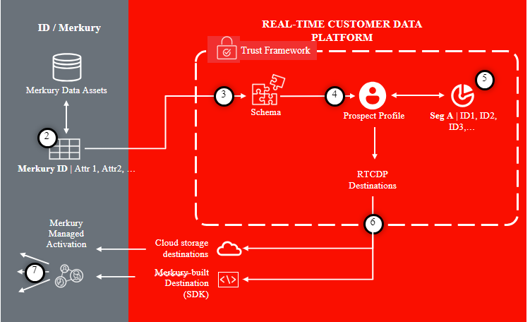
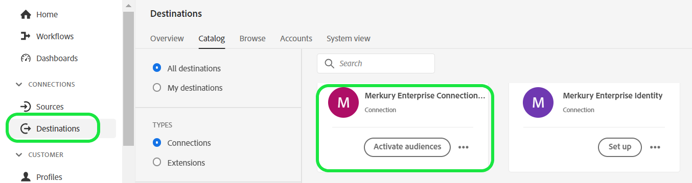
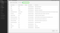
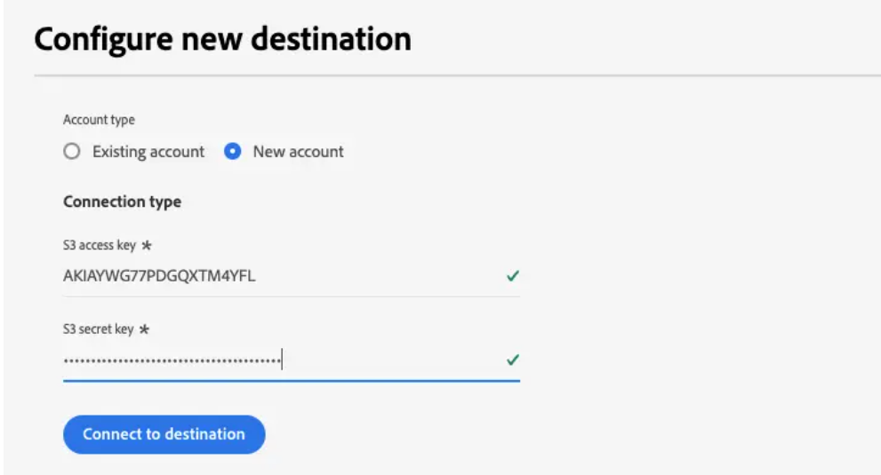
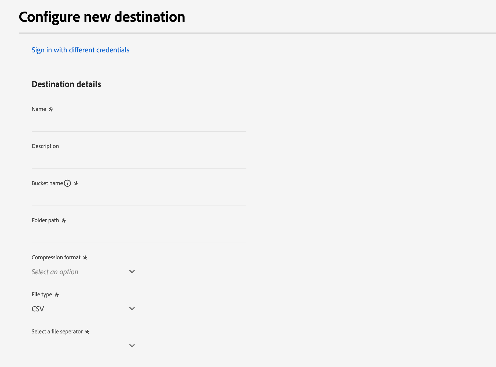
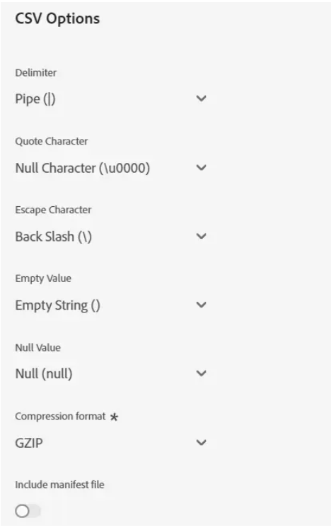
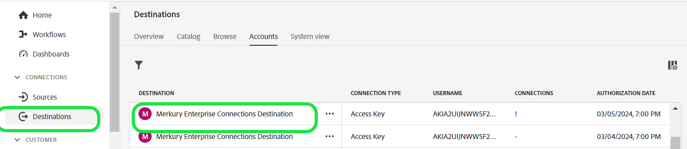

# Merkury Enterprise Connectionsの宛先

>[!NOTE]
>
>宛先コネクタとドキュメント ページは、[!DNL Merkury] チームによって作成および管理されます。 お問い合わせや更新のリクエストについては、[!DNL Merkury] アカウント担当者にお問い合わせください。

## 概要 {#overview}

[!DNL Merkury Enterprise Connections]宛先を使用して、オーディエンスを[!DNL Merkury]に安全に配信します。 [!DNL Merkury]は、マーケターが[!DNL Merkury]の80以上のプレミアムアドレス可能なTV/CTV、パブリッシャー、およびアドテク接続に対して、個人ベースのオーディエンスを簡単にマッチングおよび配信できるようにします。 [!DNL Merkury]は、2億6,800万人以上のアメリカの包括的な成人の消費者ID グラフを利用しています。

このドキュメントページの手順に従って、[!DNL Merkury Connections]宛先接続を作成し、[!DNL Adobe Experience Platform] ユーザーインターフェイスを使用してオーディエンスをアクティブ化します。

>[!NOTE]
>
>[!DNL Merkury Connect] アカウントでメディア宛先に対してオーディエンスをアクティブ化する場合は、代わりに[!DNL Merkury Connections]宛先を使用してください。

## ユースケース {#use-cases}

* **デジタルメディアのアクティベーション**：オーディエンスプロファイルを簡単に照合して、[!DNL Merkury]の50以上のプレミアムアドレス可能なパブリッシャーとアドテク接続に配信できます。
* **効率性の向上**: Cookieを使用しないアドレス可能なメディアリーチを強化し、ターゲティング効率を向上させ、AdvertisingのROAS （投資回収率）を向上させます。

## 前提条件 {#prerequisites}

>[!IMPORTANT]
>
>* 宛先に接続するには、**宛先を表示**&#x200B;および&#x200B;**宛先を管理**、**宛先をアクティブ化**、**プロファイルを表示**&#x200B;および&#x200B;**セグメントを表示**&#x200B;[[ アクセス制御の権限]](https://experienceleague.adobe.com/ja/docs/experience-platform/access-control/home#permissions)が必要です。 [[ アクセス制御の概要]](https://experienceleague.adobe.com/ja/docs/experience-platform/access-control/ui/overview)を読むか、製品管理者に連絡して必要な権限を取得してください。
>* *ID*&#x200B;をエクスポートするには、**ID グラフの表示** [[ アクセス制御権限]](https://experienceleague.adobe.com/ja/docs/experience-platform/access-control/home#permissions)が必要です。\

## サポートされている ID {#supported-identities}

| ターゲット ID | 説明 | 注意点 |
|---|---|---|
| GAID | GOOGLE ADVERTISING ID | ソース IDがGAID名前空間である場合は、GAID ターゲット IDを選択します。 |
| IDFA | Apple の広告主 ID | ソース IDがIDFA名前空間の場合は、IDFA ターゲット IDを選択します。 |
| ECID | Experience Cloud ID | ECIDを表す名前空間。 この名前空間は、「Adobe Marketing Cloud ID」、「[!DNL Adobe Experience Cloud] ID」、「[!DNL Adobe Experience Platform] ID」というエイリアスでも参照できます。 詳しくは、[ECID](/help/identity-service/features/ecid.md)の次のドキュメントを参照してください。 |
| phone_sha256 | SHA256 アルゴリズムでハッシュ化された電話番号 | プレーンテキストとSHA256 ハッシュ化された電話番号の両方が[!DNL Adobe Experience Platform]でサポートされています。 ソースフィールドにハッシュ化されていない属性が含まれている場合は、**[!UICONTROL Apply transformation]** オプションをチェックして、[!DNL Experience Platform]がアクティベーション時にデータを自動的にハッシュします。 |
| email_lc_sha256 | SHA256 アルゴリズムでハッシュ化されたメールアドレス | プレーンテキストとSHA256 ハッシュ化された電子メールアドレスの両方が[!DNL Adobe Experience Platform]でサポートされています。 ソースフィールドにハッシュ化されていない属性が含まれている場合は、**[!UICONTROL Apply transformation]** オプションをチェックして、[!DNL Experience Platform]がアクティベーション時にデータを自動的にハッシュします。 |
| extern_id | カスタムユーザーID | ソース IDがカスタム名前空間である場合は、このターゲット IDを選択します。 |

{style="table-layout:auto"}

## サポートされるオーディエンス {#supported-audiences}

この節では、この宛先に書き出すことができるオーディエンスのタイプについて説明します。

| オーディエンスの由来 | サポートあり | 説明 |
|---------|----------|----------|
| [!DNL Segmentation Service] | ○ | Experience Platform [&#x200B; セグメント化サービス &#x200B;](../../../segmentation/home.md)を通じて生成されたオーディエンス。 |
| その他すべてのオーディエンスの生成元 | × | このカテゴリには、[!DNL Segmentation Service]を通じて生成されたオーディエンス以外のすべてのオーディエンスのオリジンが含まれます。 [様々なオーディエンスの起源](/help/segmentation/ui/audience-portal.md#customize)について読みます。 次に例を示します。 <ul><li> カスタムアップロードオーディエンス [がCSV ファイルからExperience Platformに](../../../segmentation/ui/audience-portal.md#import-audience)をインポートしました。</li><li> 類似オーディエンス， </li><li> 連合オーディエンス， </li><li> [!DNL Adobe Journey Optimizer]などの他のExperience Platform アプリで生成されたオーディエンス </li><li> その他。 </li></ul> |

{style="table-layout:auto"}

オーディエンスのデータタイプ別にサポートされるオーディエンス：

| オーディエンスのデータタイプ | サポートあり | 説明 | ユースケース |
|--------------------|-----------|-------------|-----------|
| [人物オーディエンス &#x200B;](/help/segmentation/types/people-audiences.md) | ○ | 顧客プロファイルにもとづいて、マーケティング施策の特定のグループをターゲットにすることができます。 | 買い物客やカートの放棄が多い |
| [&#x200B; アカウントオーディエンス &#x200B;](/help/segmentation/types/account-audiences.md) | × | アカウントベースドマーケティング戦略のために、特定の組織内の個人をターゲットにします。 | B2B マーケティング |
| [見込みオーディエンス &#x200B;](/help/segmentation/types/prospect-audiences.md) | × | まだ顧客ではないが、ターゲットオーディエンスと特徴を共有する個人をターゲットにします。 | サードパーティデータによる見込み顧客の開拓 |
| [&#x200B; データセットの書き出し](/help/catalog/datasets/overview.md) | × | [!DNL Adobe Experience Platform] データ レイクに保存されている構造化データのコレクション。 | レポート，データサイエンスワークフロー |

{style="table-layout:auto"}

## 書き出しのタイプと頻度 {#export-type-frequency}

宛先の書き出しのタイプと頻度について詳しくは、以下の表を参照してください。

| **項目** | **タイプ** | **メモ** |
|---|---|---|  
| 書き出しタイプ | **プロファイルベース** | [[宛先アクティベーションワークフロー]](https://experienceleague.adobe.com/ja/docs/experience-platform/destinations/ui/activate/activate-batch-profile-destinations#select-attributes)の「プロファイル属性を選択」画面で選択した目的のスキーマフィールド（電子メールアドレス、電話番号、姓など）と共に、セグメントのすべてのメンバーを書き出します。 |
| 頻度 | **バッチ** | バッチ宛先では、ファイルが 3 時間、6 時間、8 時間、12 時間、24 時間の単位でダウンストリームプラットフォームに書き出されます。 詳しくは、[[ バッチファイルベースの配信先]](https://experienceleague.adobe.com/ja/docs/experience-platform/destinations/destination-types#file-based)を参照してください。 |

{style="table-layout:auto"}

## 宛先への接続 {#connect}

>[!IMPORTANT]
>
>宛先に接続するには、**宛先を表示**&#x200B;および&#x200B;**データセット宛先を管理およびアクティブ化** [[ アクセス制御権限]](https://experienceleague.adobe.com/ja/docs/experience-platform/access-control/home#permissions)が必要です。 [[ アクセス制御の概要]](https://experienceleague.adobe.com/ja/docs/experience-platform/access-control/ui/overview)を読むか、製品管理者に連絡して必要な権限を取得してください。

この宛先に接続するには、[[宛先設定チュートリアル ]](https://experienceleague.adobe.com/ja/docs/experience-platform/destinations/ui/connect-destination)に記載されている手順に従います。 宛先の設定ワークフローで、以下の 2 つの節でリストされているフィールドに入力します。

### 宛先に対する認証 {#authenticate}

宛先に対して認証を行うには、必須フィールドに入力し、**宛先に接続**&#x200B;を選択します。

Experience Platformでバケットにアクセスするには、次の資格情報に有効な値を指定する必要があります。

| **資格情報** | **説明** |
|---|---|
| アクセスキー | バケットのアクセスキーID。 この値は、Merkury チームから取得できます。 |
| 秘密鍵 | バケットの秘密鍵ID。 この値は、Merkury チームから取得できます。 |
| バケット名 | これはファイルが共有されるバケットです。 この値は、Merkury チームから取得できます。 |

{style="table-layout:auto"}

### 宛先の詳細を入力 {#destination-details}

宛先の詳細を設定するには、以下の必須フィールドとオプションフィールドに入力します。UI のフィールドの横のアスタリスクは、そのフィールドが必須であることを示します。

* **名前（必須）** – 宛先が保存される名前
* **説明** – 宛先の目的の短い説明
* **バケット名（必須）** - S3に設定されたAmazon S3 バケットの名前
* **フォルダーパス （必須）** - バケット内のサブディレクトリを使用する場合は、ルートパスを参照するためにパスを定義するか、&#39;/&#39;する必要があります。
* **ファイルの種類** – 書き出したファイルにExperience Platformで使用する形式を選択します。 アカウントに必要なファイルタイプについては、Merkury チームを参照してください。

>[!NOTE]
>
>CSV オプション、区切り文字、引用符、エスケープ文字、空の値、ヌル値、圧縮形式、マニフェストファイルオプションを含めるを選択する場合は、アカウントの適切な設定についてMerkury チームに相談してください。

### 既存アカウント {#existing-account}

Merkury Enterprise Connections宛先を使用して既に定義されているアカウントが、リストポップアップに表示されます。 選択すると、右側のパネルにアカウントの詳細が表示されます。 **宛先** > **アカウント**&#x200B;に移動すると、UIから例を表示します。

## アラートの有効化 {#enable-alerts}

アラートを有効にすると、宛先へのデータフローのステータスに関する通知を受け取ることができます。リストからアラートを選択して、データフローのステータスに関する通知を受け取るよう登録します。アラートについて詳しくは、[UIを使用した宛先アラートの購読](https://experienceleague.adobe.com/ja/docs/experience-platform/destinations/ui/alerts)に関するガイドを参照してください。

宛先接続の詳細の提供が完了したら、**次へ**&#x200B;を選択します。

## この宛先に対してオーディエンスをアクティブ化 {#activate}

>[!IMPORTANT]
>
>* データをアクティブ化するには、**宛先の表示**、**宛先のアクティブ化**、**プロファイルの表示**&#x200B;および&#x200B;**セグメントの表示**&#x200B;のアクセス制御権限が必要です。 アクセス制御の概要を確認するか、製品管理者に問い合わせて、必要な権限を取得します。
>* IDをエクスポートするには、**ID グラフを表示** アクセス制御権限が必要です。

この宛先に対するオーディエンスのアクティブ化に関する手順については、[&#x200B; バッチプロファイル書き出し宛先へのオーディエンスデータのアクティブ化](https://experienceleague.adobe.com/ja/docs/experience-platform/destinations/ui/activate/activate-batch-profile-destinations)を参照してください。

## マッピングの提案 {#mapping-suggestions}

[!DNL Merkury]側のファイルを正しく処理するには、名前とアドレス要素が必要です。 すべての要素が必要なわけではありませんが、できるだけ多くの要素を提供することで、マッチングを成功させることができます。

マッピングの提案は、次の表に、宛先側の属性のリストを示しています。この属性は、顧客がプロファイル属性をマッピングできる[!DNL Merkury]処理で使用されます。 すべての要素が必要なわけではないので、これらの要素を提案として扱います。また、ソース値はアカウントのニーズに応じて異なります。

| ターゲットフィールド | Sourceの説明 |
|---|---|
| ID | [!DNL Merkury] Source コネクタを介して[!DNL Merkury Enterprise Identity] データをExperience Platformにマッピングするために使用するID フィールド |
| Input_First_Name | Experience Platformの`person.name.firstName`値。 |
| Input_Last_Name | Experience Platformの`person.name.lastName`値。 |
| Input_Address_Line_1 | Experience Platformの`mailingAddress.street`値。 |
| Input_City | Experience Platformの`mailingAddress.city`値。 |
| Input_State_Province_Code | Experience Platformの`mailingAddress.state`値。 状態が2文字コードフォームにある場合に使用します。 |
| Input_State_Province_Name | Experience Platformの`mailingAddress.state`値。 状態が完全な状態名の場合に使用します |
| Input_Postal_Code | Experience Platformの`mailingAddress.postalCode`値。 |
| Input_Email_Address | プロファイルのメールアドレスとしてマッピングする値。 |
| Input_Phone | プロファイルの電話番号としてマッピングする値。 |

{style="table-layout:auto"}

## データの書き出しを検証する {#validate-data-export}

データが正常に書き出されたかどうかを確認するには、Amazon S3 ストレージバケットを確認し、書き出されたファイルに想定されるプロファイル母集団が含まれていることを確認します。

## データの使用とガバナンス {#data-usage-governance}

[!DNL Adobe Experience Platform] のすべての宛先は、データを処理する際のデータ使用ポリシーに準拠しています。[!DNL Adobe Experience Platform]がデータガバナンスを適用する方法について詳しくは、[&#x200B; データガバナンスの概要](https://experienceleague.adobe.com/ja/docs/experience-platform/data-governance/home)を参照してください。

## 次の手順 {#next-steps}

このチュートリアルに従うことで、Experience Platformから[!DNL Merkury]管理S3の場所にプロファイルデータを書き出すデータフローを正常に作成しました。 次に、処理を設定できるように、アカウント名、ファイル名、バケットパスを[!DNL Merkury]担当者に連絡する必要があります。
