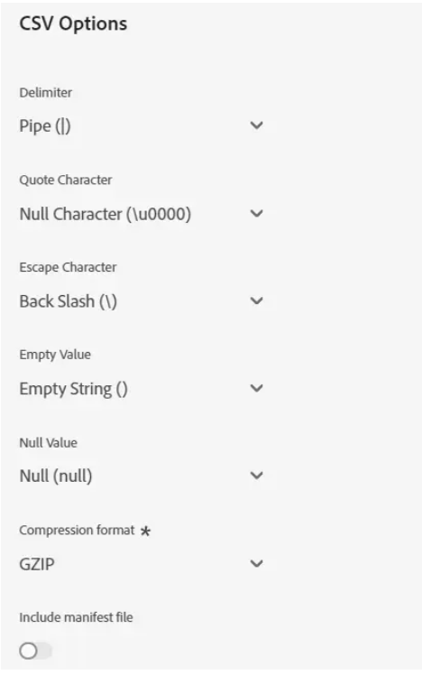

# Merkury エンタープライズ Id の宛先

>[!NOTE]
>
>宛先コネクタとドキュメントページは、によって作成および管理されます。 [!DNL Merkury] チーム。 お問い合わせや更新のリクエストについては、 [!DNL Merkury] アカウント担当者。

## 概要

の使用 [!DNL Merkury Enterprise Identity] より正確で包括的なインサイトに満ちた消費者プロファイルを構築する宛先。 プロファイルデータが改善されたことで、マーケターはより優れたインサイト、セグメントおよびモデルを強化し、より正確なターゲティングと予測モデリングを実現できます。

このドキュメントページの手順に従って、次の URL を作成します [!DNL Merkury Identity] 宛先接続とオーディエンスのアクティブ化：Adobe Experience Platform ユーザーインターフェイスを使用して識別とエンリッチメントを行います。

>[!NOTE]
>
>を使用して、メディアの宛先に対するオーディエンスをアクティブ化する場合 [!DNL Merkury Connect] アカウント、を使用 [!DNL Merkury Connections] 代わりに宛先。

## ユースケース

この [!DNL Merkury Enterprise Identity] 宛先は、次の目的で消費者 PII を安全に転送する機能を提供します [!DNL Merkury] 機能：

* **データ品質**：データのハイジーンと標準化により、消費者プロファイルのデータ品質を向上させます。 [!DNL Merkury] 最も高度なダイレクトメールマーケティングのユースケースをサポートするために、米国の郵便ハイジーンと移動識別を含みます。
* **ID 解決**：以下の情報に基づいて、顧客の正確で包括的な単一ビューを作成します [!DNL Merkury] 個人 ID と世帯 ID Merkury ID は、を活用して、深いレベルのプロファイルリンクを提供します。 [!DNL Merkury]の包括的な米国成人消費者 ID グラフ（2 億 6800 万人以上）。
* **エンリッチメント**：を使用したインサイトとパーソナライゼーションの向上 [!DNL Merkury Data]. [!DNL Merkury Data] 人口統計、ライフスタイル、金融、ライフイベント、からの購入データなど、10,000 を超える利用可能なデータ属性が含まれています [!DNL Merkury Data Suite].

>[!NOTE]
>
>これらのユースケースは、宛先コネクタとソースコネクタの両方を組み合わせて実行されます。 顧客は、この宛先コネクタを使用して既存の顧客レコードを書き出してエンリッチメントを行うことから始めます。 [!DNL Merkury]のサービスはファイルを検索して取得し、次のようにエンリッチメントします [!DNL Merkury]のデータを使用してファイルを生成します。 お客様は、対応するを使用します [!DNL Merkury] ハイドレートされた顧客プロファイルをSourceに取り込むためのAdobe Real-Time CDP コネクタソースカード。

## 前提条件

>[!IMPORTANT]
>
>* 宛先に接続するには、 **宛先の表示** および **宛先の管理**, **宛先のアクティブ化**, **プロファイルの表示**、および **セグメントの表示** [[ アクセス制御権限 ]](https://experienceleague.adobe.com/en/docs/experience-platform/access-control/home#permissions). を読み取る [[ アクセス制御の概要 ]](https://experienceleague.adobe.com/en/docs/experience-platform/access-control/ui/overview) または、製品管理者に問い合わせて、必要な権限を取得してください。
>* エクスポートする *id*、が必要です **ID グラフの表示** [[ アクセス制御権限 ]](https://experienceleague.adobe.com/en/docs/experience-platform/access-control/home#permissions).\

## サポートされている ID {#supported-identities}

| ターゲット ID | 説明 | 注意点 |
|---|---|---|
| GAID | GOOGLE ADVERTISING ID | ソース ID が GAID 名前空間の場合は、GAID ターゲット ID を選択します。 |
| IDFA | Apple の広告主 ID | ソース ID が IDFA 名前空間の場合は、IDFA ターゲット ID を選択します。 |
| ECID | Experience Cloud ID | ECID を表す名前空間。 この名前空間は、「Adobe Marketing Cloud ID」、「Adobe Experience Cloud ID」、「Adobe Experience Platform ID」という別名で呼ばれることもあります。次のドキュメントを参照してください： [ECID](/help/identity-service/features/ecid.md) を参照してください。 |
| phone_sha256 | SHA256 アルゴリズムでハッシュ化された電話番号 | Adobe Experience Platform では、プレーンテキストと SHA256 でハッシュ化された電話番号の両方がサポートされています。ハッシュ化されていない属性がソースフィールドに含まれている場合は、「**[!UICONTROL 変換を適用]**」オプションをオンにして、アクティブ化時に [!DNL Platform] がデータを自動的にハッシュ化するように設定します。 |
| email_lc_sha256 | SHA256 アルゴリズムでハッシュ化されたメールアドレス | Adobe Experience Platform では、プレーンテキストと SHA256 でハッシュ化されたメールアドレスの両方がサポートされています。ハッシュ化されていない属性がソースフィールドに含まれている場合は、「**[!UICONTROL 変換を適用]**」オプションをオンにして、アクティブ化時に [!DNL Platform] がデータを自動的にハッシュ化するように設定します。 |
| extern_id | カスタムユーザー ID | ソース ID がカスタム名前空間の場合は、このターゲット ID を選択します。 |

{style="table-layout:auto"}

## サポートされるオーディエンス

この節では、この宛先に書き出すことができるオーディエンスのタイプについて説明します。

| **オーディエンス** | **サポート** | **説明** | **起源** |
|---|---|---|---|
| セグメント化サービス | ✓ | Experience Platformを通じて生成されたオーディエンス [[ セグメント サービス ]](https://experienceleague.adobe.com/en/docs/experience-platform/segmentation/home). |
| カスタムアップロード | x | オーディエンス [[ 読み込み ]](https://experienceleague.adobe.com/en/docs/experience-platform/segmentation/ui/overview#import-audience) を CSV ファイルからExperience Platformに変換します。 |

{style="table-layout:auto"}

## 書き出しのタイプと頻度

宛先の書き出しのタイプと頻度について詳しくは、以下の表を参照してください。
|**対象読者**|**サポート**|**説明の起源**|\
|—|—|—|\
✓ |セグメント化サービス|Experience Platformを通じて生成されたオーディエンス [[ セグメント サービス ]](https://experienceleague.adobe.com/en/docs/experience-platform/segmentation/home).| カスタムアップロード|X|オーディエンス [[ 読み込み ]](https://experienceleague.adobe.com/en/docs/experience-platform/segmentation/ui/overview#import-audience) を CSV ファイルからExperience Platformに変換します。

{style="table-layout:auto"}

## 宛先への接続

>[!IMPORTANT]
>
>宛先に接続するには、 **宛先の表示** および **データセット宛先の管理とアクティブ化** [[ アクセス制御権限 ]](https://experienceleague.adobe.com/en/docs/experience-platform/access-control/home#permissions). を読み取る [[ アクセス制御の概要 ]](https://experienceleague.adobe.com/en/docs/experience-platform/access-control/ui/overview) または、製品管理者に問い合わせて、必要な権限を取得してください。

この宛先に接続するには、で説明されている手順に従います [[ 宛先設定のチュートリアル ]](https://experienceleague.adobe.com/en/docs/experience-platform/destinations/ui/connect-destination). 宛先の設定ワークフローで、以下の 2 つの節でリストされているフィールドに入力します。

### 宛先に対する認証

宛先に対して認証するには、必須フィールドに入力し、を選択します。 **宛先への接続**.

Experience Platformのバケットにアクセスするには、次の資格情報に有効な値を指定する必要があります。

| **認証情報** | **説明** |
|---|---|
| アクセスキー | バケットのアクセスキー ID。 この値は Merkury チームから取得できます。 |
| 秘密鍵 | バケットの秘密鍵 ID。 この値は Merkury チームから取得できます。 |
| バケット名 | これは、ファイルが共有されるバケットです。 この値は Merkury チームから取得できます。 |

{style="table-layout:auto"}

### 宛先の詳細を入力

宛先の詳細を設定するには、以下の必須フィールドとオプションフィールドに入力します。UI のフィールドの横のアスタリスクは、そのフィールドが必須であることを示します。

* **名前（必須）**  – 保存先の名前
* **説明**  – 宛先の目的の簡単な説明
* **バケット名（必須）** - S3 で設定されたAmazon S3 バケットの名前
* **フォルダーパス （必須）** - バケット内のサブディレクトリを使用する場合は、パスを定義するか、「/」を使用してルートパスを参照する必要があります。
* **ファイルタイプ**  – 書き出したファイルでExperience Platformが使用するフォーマットを選択します。 お使いのアカウントで想定されるファイルタイプについては、Merkury チームにお問い合わせください。

>[!NOTE]
>
>「CSV」オプションを選択すると、「区切り文字」、「引用符文字」、「エスケープ文字」、「空の値」、「Null 値」、「圧縮形式」、「マニフェストファイルを含める」の各オプションが表示されます。ご利用のアカウントに適した設定については、Merkury のチームにお問い合わせください。

### 既存のアカウント

Merkury エンタープライズ ID 宛先を使用して既に定義されているアカウントが、リストポップアップに表示されます。 選択すると、右側のパネルにアカウントの詳細が表示されます。 に移動したら、UI から例を表示します。 **宛先** > **アカウント**;

### アラートの有効化

アラートを有効にすると、宛先へのデータフローのステータスに関する通知を受け取ることができます。リストからアラートを選択して、データフローのステータスに関する通知を受け取るよう登録します。アラートについて詳しくは、のガイドを参照してください。 [ui を使用した宛先アラートの購読](https://experienceleague.adobe.com/en/docs/experience-platform/destinations/ui/alerts).

宛先接続への詳細の入力を終えたら以下を選択します **次**.

## この宛先に対してオーディエンスをアクティブ化

>[!IMPORTANT]
>
>* データをアクティブ化するには、 **宛先の表示**, **宛先のアクティブ化**, **プロファイルの表示**、および **セグメントの表示** アクセス制御権限。 詳しくは、アクセス制御の概要または製品管理者に問い合わせて、必要な権限を取得してください。
>* ID を書き出すには、次が必要です **ID グラフの表示** アクセス制御権限。

Read [プロファイル書き出しのバッチ宛先に対するオーディエンスデータの有効化](https://experienceleague.adobe.com/en/docs/experience-platform/destinations/ui/activate/activate-batch-profile-destinations) この宛先に対してオーディエンスをアクティブ化する手順については、を参照してください。

## マッピングの提案

上のファイルの正しい処理 [!DNL Merkury] 側には name 要素と address 要素が必要です。 すべての要素が必要なわけではありませんが、できるだけ多くを提供すると、マッチングを成功させるのに役立ちます。

以下の表に、で使用される宛先側の属性をリストしたマッピングの提案を示します [!DNL Merkury] 顧客がプロファイル属性をマッピングできる処理。 すべての要素が必要とは限らず、ソース値はアカウントのニーズに応じて異なるので、これらの要素を候補として扱います。

| ターゲットフィールド | Sourceの説明 |
|---|---|
| ID | マッピングに使用する ID フィールド [!DNL Merkury] を使用してExperience Platformするデータ [!DNL Merkury Enterprise Identity] Source コネクタ |
| Input_First_Name | この `person.name.firstName` Experience Platform内の値。 |
| Input_Last_Name | この `person.name.lastName` Experience Platform内の値。 |
| Input_Address_Line_1 | この `mailingAddress.street` Experience Platform内の値。 |
| Input_City | この `mailingAddress.city` Experience Platform内の値。 |
| Input_State_Province_Code | この `mailingAddress.state` Experience Platform内の値。 状態が 2 文字コード形式の場合は、を使用します。 |
| Input_State_Province_Name | この `mailingAddress.state` Experience Platform内の値。 状態が完全な状態名の場合は、を使用します |
| Input_Postal_Code | この `mailingAddress.postalCode` Experience Platform内の値。 |
| Input_Email_Address | プロファイルのメールアドレスとしてマッピングする値。 |
| Input_Phone | プロファイルの電話番号としてマッピングする値。 |

{style="table-layout:auto"}

## データの書き出しを検証する

データが正常に書き出されたかどうかを確認するには、Amazon S3 ストレージバケットを確認し、書き出されたファイルに、想定どおりのプロファイル母集団が含まれていることを確認します。

## データの使用とガバナンス

Adobe Experience Platformのすべての宛先は、データを処理する際のデータ使用ポリシーに準拠しています。 Adobe Experience Platformによるデータガバナンスの実施方法について詳しくは、以下を参照してください [データガバナンスの概要](https://experienceleague.adobe.com/en/docs/experience-platform/data-governance/home).

## 次の手順

このチュートリアルでは、Experience Platformからユーザーにプロファイルデータを書き出すデータフローを正常に作成しました [!DNL Merkury] 管理対象の S3 の場所。 次に、に連絡する必要があります [!DNL Merkury] を表します。これには、アカウント名、ファイル名、処理をセットアップするためのバケットパスが含まれます。