# [!DNL SAP Commerce] 接続

[!DNL SAP Commerce] （旧称：[[!DNL Hybris]](https://www.sap.com/india/products/acquired-brands/what-is-hybris.html)）は、B2BおよびB2C企業向けのクラウドベースのe コマースプラットフォームソリューションで、SAP Customer Experience ポートフォリオの一部として利用できます。 [[!DNL SAP]  サブスクリプション請求](https://www.sap.com/products/financial-management/subscription-billing.html)は、ポートフォリオの下にある製品であり、標準化された統合を通じて、販売と支払い体験を簡素化することで、完全なサブスクリプションライフサイクル管理を可能にします。

この[!DNL Adobe Experience Platform] [宛先](/help/destinations/home.md)では、[[!DNL SAP Subscription Billing] 顧客管理API](https://api.sap.com/api/BusinessPartner_APIs/path/PUT_customers-customerNumber)を使用して、アクティブ化後に既存のExperience Platform オーディエンスから[!DNL SAP Commerce]以内に顧客の詳細を更新します。

[!DNL SAP Commerce] インスタンスを認証する手順は、さらに下の[宛先に対する認証](#authenticate)の節にあります。

## ユースケース {#use-cases}

[!DNL SAP Commerce]宛先を使用する方法とタイミングをより理解しやすくするために、[!DNL Adobe Experience Platform]のお客様がこの宛先を使用して解決できる使用例を次に示します。

[!DNL SAP Commerce]人の顧客が、自社と関わりのある個人または組織のエンティティに関する情報を保存しています。 お客様は、[!DNL SAP Commerce]に存在するお客様を使用して、Experience Platform オーディエンスを構築します。 これらのオーディエンスを[!DNL SAP Commerce]に送信すると、情報が更新され、各顧客には、顧客がどのオーディエンスに属しているかを示すオーディエンス名として、その値を持つプロパティが割り当てられます。

## 前提条件 {#prerequisites}

Experience Platformおよび[!DNL SAP Commerce]で設定する必要がある前提条件と、[!DNL SAP Commerce]の宛先を操作する前に収集する必要がある情報については、以下の節を参照してください。

### Experience Platform の前提条件 {#prerequisites-in-experience-platform}

[!DNL SAP Commerce]宛先にデータをアクティブ化する前に、[で](/help/xdm/schema/composition.md) スキーマ [、](https://experienceleague.adobe.com/docs/platform-learn/tutorials/data-ingestion/create-datasets-and-ingest-data.html) データセット [、および](https://experienceleague.adobe.com/docs/platform-learn/tutorials/audiences/create-audiences.html) オーディエンス [!DNL Experience Platform]を作成しておく必要があります。

オーディエンスのステータスに関するガイダンスが必要な場合は、[ オーディエンスメンバーシップの詳細スキーマフィールドグループ ](/help/xdm/field-groups/profile/segmentation.md)のExperience Platform ドキュメントを参照してください。

### [!DNL SAP Commerce]宛先の前提条件 {#prerequisites-destination}

Experience Platformから[!DNL SAP Commerce] アカウントにデータをエクスポートするには、次の前提条件に注意してください。

#### [!DNL SAP Subscription Billing] アカウントが必要です {#prerequisites-account}

Experience Platformから[!DNL SAP Commerce] アカウントにデータをエクスポートするには、[!DNL SAP Subscription Billing] アカウントが必要です。 有効な請求先アカウントがない場合は、[!DNL SAP] アカウント マネージャーにお問い合わせください。 詳細については、[[!DNL SAP]  プラットフォーム設定](https://help.sap.com/doc/5fd179965d5145fbbe7f2a7aa1272338/latest/en-US/PlatformConfiguration.pdf) ドキュメントを参照してください。

#### サービスキーの生成 {#prerequisites-service-key}

* [!DNL SAP Commerce] サービス キーを使用すると、Experience Platformから[!DNL SAP Subscription Billing] APIにアクセスできます。 「[!DNL SAP Commerce] [ クライアント IDとクライアント秘密鍵](https://help.sap.com/docs/CLOUD_TO_CASH_OD/1216e7b79c984675b0a6f0005e351c74/87c11a0f5dc3494eaf3baa355925c030.html#create-a-service-key-with-client-id-and-client-secret)を使用したサービスキーの作成」を参照して、サービスキーを作成します。 [!DNL SAP Commerce] には、以下が必要です。
   * クライアント ID
   * クライアントシークレット
   * URL: URL パターンは次のとおりです：`https://subscriptionbilling.authentication.eu10.hana.ondemand.com`。 この値は、後で`Region`と`Endpoint`の値を取得するために使用されます。

+++サービス キーの例を表示するには、を選択します

```json
{ 
    "url": "https://eu10.revenue.cloud.sap/api",
    "uaa": {
        "clientid": "XXX",
        "clientsecret": "XXX",
        "url": "https://subscriptionbilling.authentication.eu10.hana.ondemand.com",
        "identityzone": "subscriptionbilling",
        "identityzoneid": "XXX",
        "tenantid": "XXX",
        "tenantmode": "dedicated",
        "sburl": "https://internal-xsuaa.authentication.eu10.hana.ondemand.com",
        "apiurl": "https://api.authentication.eu10.hana.ondemand.com",
        "verificationkey": "XXX",
        "xsappname": "XXX",
        "subaccountid": "XXX",
        "uaadomain": "authentication.eu10.hana.ondemand.com",
        "zoneid": "XXX",
        "credential-type": "binding-secret"
    },
    "vendor": "SAP"
}
```

+++

#### [!DNL SAP Subscription Billing]でカスタム参照を作成 {#prerequisites-custom-reference}

[!DNL SAP Subscription Billing]のExperience Platform オーディエンスのステータスを更新するには、Experience Platformで選択した各オーディエンスのカスタム参照フィールドが必要です。

カスタム参照を作成するには、[!DNL SAP Subscription Billing] アカウントにログインし、**[マスターデータと設定]** > **[カスタム参照]** ページに移動します。 次に、**[!UICONTROL Create]**&#x200B;を選択して、Experience Platformで選択した各オーディエンスに新しい参照を追加します。 後続の[ オーディエンスの書き出しと例](#schedule-segment-export-example)の手順では、これらの参照フィールド名が必要になります。

**[!UICONTROL Reference Type]**&#x200B;内にカスタム [!DNL SAP Subscription Billing]を作成する方法の例を次に示します。
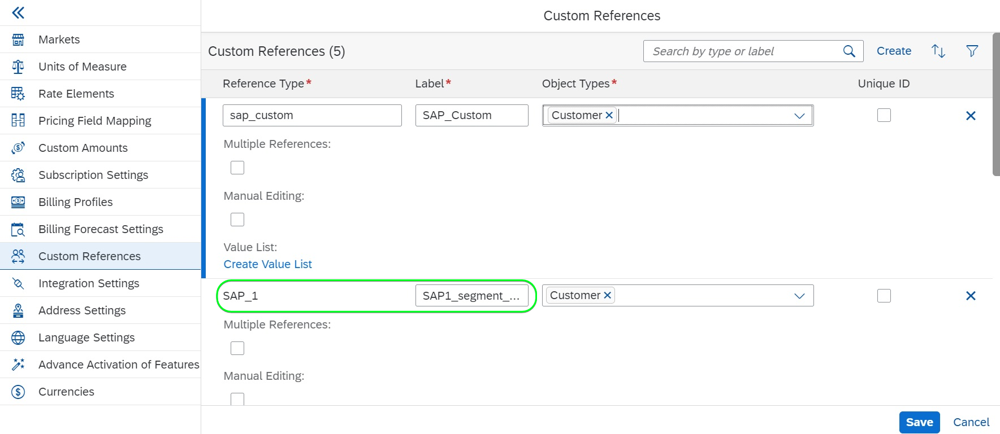

追加のガイダンスについては、[!DNL SAP Subscription Billing] [ カスタム参照](https://help.sap.com/docs/CLOUD_TO_CASH_OD/80d121f216af43648e79664efe5595f7/85696a63c8d8453a934e86c9413a25cf.html?version=2023-11-27) ドキュメントを参照してください。

### 必要な資格情報の収集 {#gather-credentials}

[!DNL SAP Commerce]をExperience Platformに接続するには、次の接続プロパティの値を指定する必要があります。

| 資格情報 | 説明 |
| --- | --- |
| クライアント ID | サービス キーからの`clientId`の値。 |
| クライアントシークレット | サービス キーからの`clientSecret`の値。 |
| エンドポイント | サービス キーの`url`の値は、`https://subscriptionbilling.authentication.eu10.hana.ondemand.com`と似ています。 |
| 領域 | データセンターの場所： この領域は`url`に存在し、`eu10`または`us10`と同様の値を持ちます。 例えば、`url`が`https://eu10.revenue.cloud.sap/api`の場合、`eu10`が必要です。 |

## ガードレール {#guardrails}

[!DNL SAP Cloud Management service]へのAPI リクエストには、[ レート制限](https://help.sap.com/docs/btp/sap-business-technology-platform/account-administration-rate-limiting)が適用されます。 レート制限を超えると、`HTTP 429 Too Many Requests`応答ステータスコードが表示されます。

## サポートされる ID {#supported-identities}

[!DNL SAP Commerce] では、以下の表で説明する ID の更新をサポートしています。[ID](/help/identity-service/features/namespaces.md) についての詳細情報。

| ターゲット ID | 説明 | 注意点 |
| --- | --- | --- |
| `customerNumberSAP` | [!DNL SAP Commerce] アカウントに既に存在する個人または法人顧客の顧客識別子。 | 必須 |

## サポートされるオーディエンス {#supported-audiences}

この節では、この宛先に書き出しできるすべてのオーディエンスについて説明します。

この宛先では、Experience Platform の[セグメント化サービス](../../../segmentation/home.md)で生成したすべてのオーディエンスのアクティブ化をサポートします。

この宛先は、次の表に記載されているオーディエンスのアクティブ化もサポートしています。

| オーディエンスタイプ | サポートあり | 説明 |
| ------------- | --------- | ----------- |
| [!DNL Segmentation Service] | ○ | Experience Platform [ セグメント化サービス ](../../../segmentation/home.md)を通じて生成されたオーディエンス。 |
| その他すべてのオーディエンスの生成元 | ○ | このカテゴリには、[!DNL Segmentation Service]を通じて生成されたオーディエンス以外のすべてのオーディエンスのオリジンが含まれます。 [様々なオーディエンスの起源](/help/segmentation/ui/audience-portal.md#customize)について読みます。 次に例を示します。 <ul><li> カスタムアップロードオーディエンス [がCSV ファイルからExperience Platformに](../../../segmentation/ui/audience-portal.md#import-audience)をインポートしました。</li><li> 類似オーディエンス， </li><li> 連合オーディエンス， </li><li> [!DNL Adobe Journey Optimizer]などの他のExperience Platform アプリで生成されたオーディエンス </li><li> その他。 </li></ul> |

{style="table-layout:auto"}


オーディエンスのデータタイプ別にサポートされるオーディエンス：

| オーディエンスのデータタイプ | サポートあり | 説明 | ユースケース |
|--------------------|-----------|-------------|-----------|
| [人物オーディエンス ](/help/segmentation/types/people-audiences.md) | ○ | 顧客プロファイルにもとづいて、マーケティング施策の特定のグループをターゲットにすることができます。 | 買い物客やカートの放棄が多い |
| [ アカウントオーディエンス ](/help/segmentation/types/account-audiences.md) | × | アカウントベースドマーケティング戦略のために、特定の組織内の個人をターゲットにします。 | B2B マーケティング |
| [見込みオーディエンス ](/help/segmentation/types/prospect-audiences.md) | × | まだ顧客ではないが、ターゲットオーディエンスと特徴を共有する個人をターゲットにします。 | サードパーティデータによる見込み顧客の開拓 |
| [ データセットの書き出し](/help/catalog/datasets/overview.md) | × | [!DNL Adobe Experience Platform] データ レイクに保存されている構造化データのコレクション。 | レポート，データサイエンスワークフロー |

{style="table-layout:auto"}


## 書き出しのタイプと頻度 {#export-type-frequency}

宛先の書き出しのタイプと頻度について詳しくは、以下の表を参照してください。

| 項目 | タイプ | メモ |
|---------|----------|---------|
| 書き出しタイプ | **[!UICONTROL Profile-based]** | <ul><li>オーディエンスのすべてのメンバーを、フィールドマッピングに従って、目的のスキーマフィールド *（例：電子メールアドレス、電話番号、姓）*&#x200B;と共に書き出します。</li><li> Experience Platformで選択した各オーディエンスについて、対応する[!DNL SAP Commerce]個の追加属性が、Experience Platformからオーディエンスステータスで更新されます。</li></ul> |
| 書き出し頻度 | **[!UICONTROL Streaming]** | <ul><li>ストリーミングの宛先は常に、API ベースの接続です。オーディエンス評価に基づいてExperience Platformでプロファイルが更新されると、コネクターは更新をダウンストリームの宛先プラットフォームに送信します。 詳しくは、[ストリーミングの宛先](/help/destinations/destination-types.md#streaming-destinations)を参照してください。</li></ul> |

{style="table-layout:auto"}

## 宛先への接続 {#connect}

>[!IMPORTANT]
>
>宛先に接続するには、**[!UICONTROL Manage Destinations]** [ アクセス制御権限](/help/access-control/home.md#permissions)が必要です。 詳しくは、[アクセス制御の概要](/help/access-control/ui/overview.md)または製品管理者に問い合わせて、必要な権限を取得してください。

この宛先に接続するには、[宛先設定のチュートリアル](../../ui/connect-destination.md)の手順に従ってください。宛先の設定ワークフローで、以下の 2 つのセクションにリストされているフィールドに入力します。

**[!UICONTROL Destinations]** > **[!UICONTROL Catalog]**&#x200B;内で、[!DNL SAP Commerce]を検索します。 または、**[!UICONTROL eCommerce]** カテゴリの下に配置することもできます。

### 宛先に対する認証 {#authenticate}

以下の必須のフィールドに入力します。ガイダンスについては、「[ サービスキーを生成](#prerequisites-service-key)」の節を参照してください。

| フィールド | 説明 |
| --- | --- |
| **[!UICONTROL Client ID]** | サービス キーからの`clientId`の値。 |
| **[!UICONTROL Client secret]** | サービス キーからの`clientSecret`の値。 |
| **[!UICONTROL Endpoint]** | サービス キーの`url`の値は、`https://subscriptionbilling.authentication.eu10.hana.ondemand.com`と似ています。 |
| **[!UICONTROL Region]** | データセンターの場所： この領域は`url`に存在し、`eu10`または`us10`と同様の値を持ちます。 例えば、`url`が`https://eu10.revenue.cloud.sap/api`の場合、`eu10`が必要です。 |

宛先に対する認証を行うには、**[!UICONTROL Connect to destination]**を選択します。
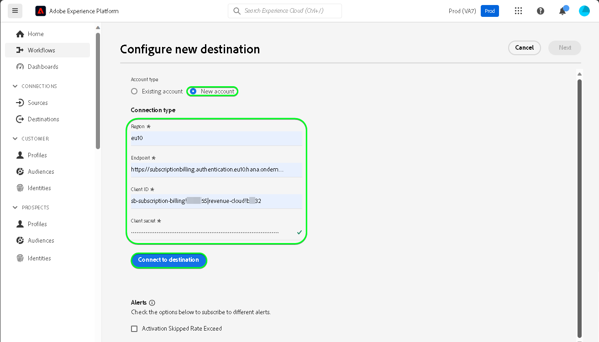

指定された詳細が有効な場合、UIには緑色のチェックマークが付いた&#x200B;**[!UICONTROL Connected]** ステータスが表示されます。 その後、次の手順に進むことができます。

### 宛先の詳細を入力 {#destination-details}

宛先の詳細を設定するには、以下の必須フィールドとオプションフィールドに入力します。UI のフィールドの横にアスタリスクが表示される場合は、そのフィールドが必須であることを示します。
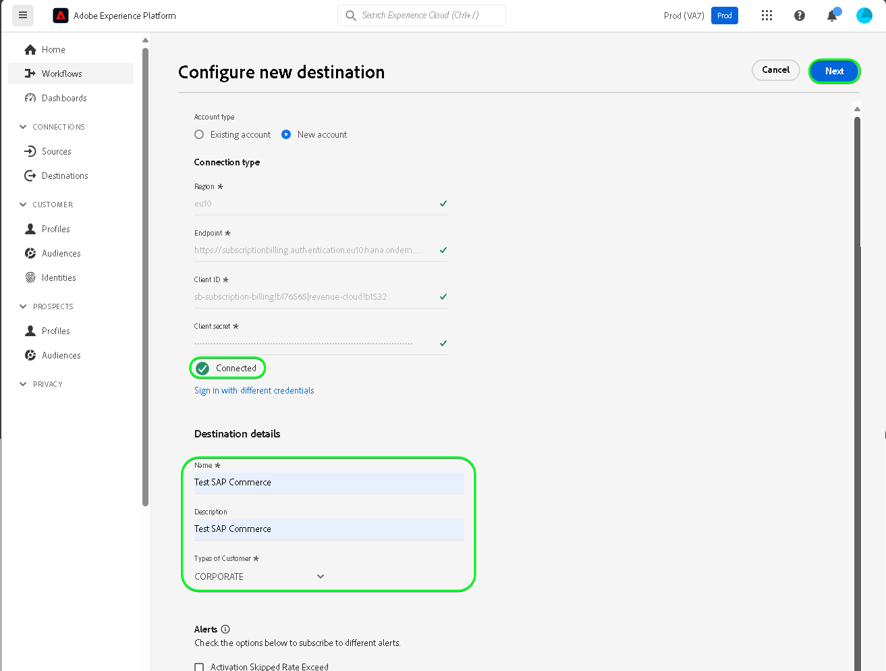

* **[!UICONTROL Name]**：今後この宛先を認識する際に使用する名前。
* **[!UICONTROL Description]**：今後この宛先を特定するのに役立つ説明です。
* **[!UICONTROL Type of Customer]**: オーディエンス内のエンティティに応じて、***個人***&#x200B;または&#x200B;***企業***&#x200B;のいずれかを選択します。 [!DNL SAP Subscription Billing] [ スキーマ ](https://api.sap.com/api/BusinessPartner_APIs/schema)は、`customerType`属性にマッピングされているこの選択に応じて、必須フィールドを切り替えます。 選択が&#x200B;***企業***&#x200B;の場合、個々の顧客に必要な`firstName`や`lastName`などの必須マッピングは無視され、`company`は必須になり、その逆も同様です。

### アラートの有効化 {#enable-alerts}

アラートを有効にすると、宛先へのデータフローのステータスに関する通知を受け取ることができます。リストからアラートを選択して、データフローのステータスに関する通知を受け取るよう登録します。アラートについて詳しくは、[UI を使用した宛先アラートの購読](../../ui/alerts.md)についてのガイドを参照してください。

宛先接続の詳細の提供が完了したら、**[!UICONTROL Next]**&#x200B;を選択します。

## この宛先に対してオーディエンスをアクティブ化 {#activate}

>[!IMPORTANT]
>
>* データをアクティブ化するには、**[!UICONTROL View Destinations]**、**[!UICONTROL Activate Destinations]**、**[!UICONTROL View Profiles]**&#x200B;および&#x200B;**[!UICONTROL View Segments]** [ アクセス制御権限](/help/access-control/home.md#permissions)が必要です。 [アクセス制御の概要](/help/access-control/ui/overview.md)を参照するか、製品管理者に問い合わせて必要な権限を取得してください。
>* *ID*&#x200B;をエクスポートするには、**[!UICONTROL View Identity Graph]** [ アクセス制御権限](/help/access-control/home.md#permissions)が必要です。<br> {width="100" zoomable="yes"}

この宛先にオーディエンスをアクティベートする手順は、[ストリーミングオーディエンスの書き出し宛先へのプロファイルとオーディエンスのアクティベート](/help/destinations/ui/activate-segment-streaming-destinations.md)を参照してください。

### 属性と ID のマッピング {#map}

オーディエンスデータを[!DNL Adobe Experience Platform]から[!DNL SAP Commerce]宛先に正しく送信するには、フィールドマッピング手順を実行する必要があります。 マッピングでは、Experience Platform アカウントのExperience Data Model （XDM）スキーマフィールドと、ターゲット先の対応するスキーマフィールドとの間にリンクを作成します。 XDM フィールドを[!DNL SAP Commerce]宛先フィールドに正しくマッピングするには、次の手順に従います。

#### `customerNumberSAP` IDのマッピング {#map-customer-number-sap}

`customerNumberSAP` IDは、この宛先の必須マッピングです。 マッピングするには、次の手順に従います。

1. **[!UICONTROL Mapping]** ステップで、**[!UICONTROL Add new mapping]**を選択します。 新しいマッピング行が画面に表示されるようになりました。
   「新しいマッピングを追加」ボタンがハイライト表示された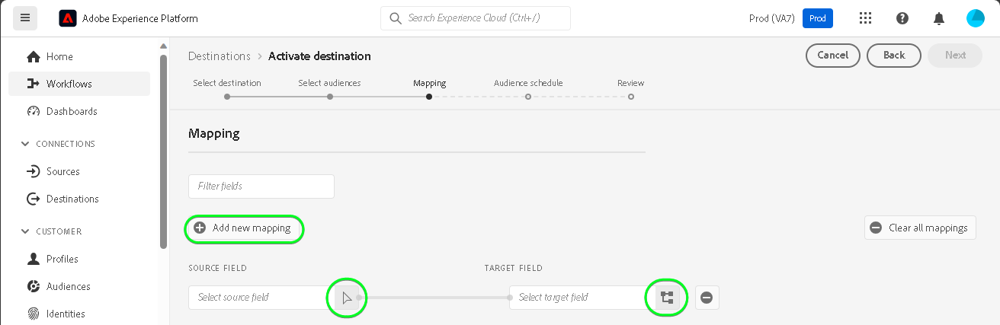
1. **[!UICONTROL Select source field]** ウィンドウで、**[!UICONTROL Select identity namespace]**&#x200B;を選択し、`customerNumberSAP`を選択します。
   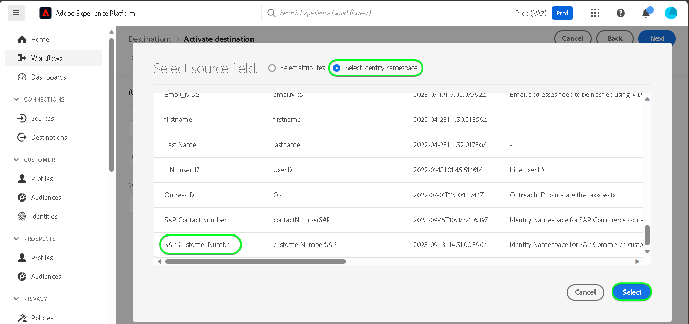
1. **[!UICONTROL Select target field]** ウィンドウで、**[!UICONTROL Select identity namespace]**&#x200B;を選択し、`customerNumber` IDを選択します。
   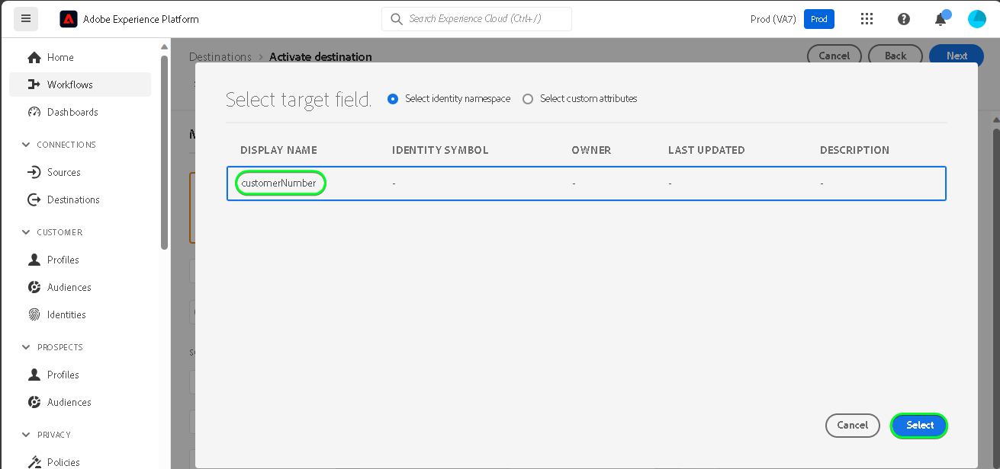

| ソースフィールド | ターゲットフィールド | 必須 |
| --- | --- | --- |
| `IdentityMap: customerNumberSAP` | `Identity: customerNumber` | ○ |

ID マッピングの例を次に示します。
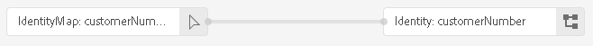

#### マッピング属性 {#mapping-attributes}

XDM プロファイルスキーマと[!DNL SAP Subscription Billing] アカウントの間で更新するその他の属性を追加するには、次の手順を繰り返します。

1. **[!UICONTROL Mapping]** ステップで、**[!UICONTROL Add new mapping]**を選択します。 新しいマッピング行が画面に表示されるようになりました。
   「新しいマッピングを追加」ボタンがハイライト表示された
1. **[!UICONTROL Select source field]** ウィンドウで、**[!UICONTROL Select attributes]** カテゴリを選択し、XDM属性を選択します。
   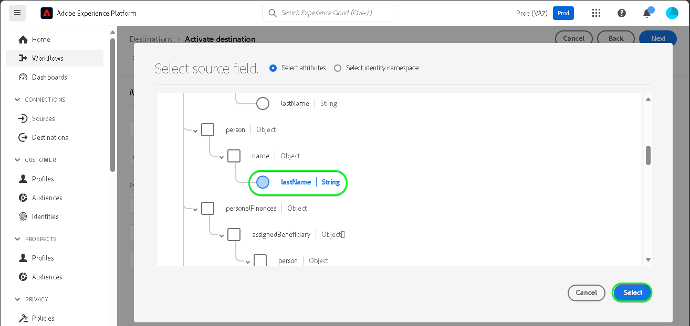
1. **[!UICONTROL Select target field]** ウィンドウで、**[!UICONTROL Select custom attributes]** カテゴリを選択し、顧客[!DNL SAP Subscription Billing] スキーマ [属性のリストから](https://api.sap.com/api/BusinessPartner_APIs/schema)属性の名前を入力します。
   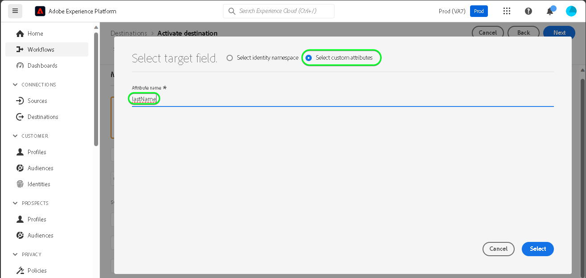

>[!IMPORTANT]
>
> ターゲットフィールド名では大文字と小文字が区別されるため、[!DNL SAP Subscription Billing]属性名と一致する必要があります。 これの唯一の例外は`country`です。代わりに`countryCode`を使用してください。 [!DNL SAP Subscription Billing]はalpha-2 （ISO 3166）の国コードをサポートしています。 値は大文字と小文字が区別され、0 ～ 3文字である必要があります。したがって、エラーが発生する他の定義済みの値を正確に指定してください：`The country code {} does not exist`または`size must be between 0 and 3`。

#### 選択した顧客タイプの`mandatory`属性をマッピング {#map-mandatory-attributes}

必須の属性マッピングは、選択した&#x200B;**[!UICONTROL Type of Customer]**&#x200B;によって異なります。 必須の属性をマッピングするには、以下から選択します。

>[!BEGINTABS]

>[!TAB 個人顧客]

| ソースフィールド | ターゲットフィールド | 必須 |
| --- | --- | --- |
| `xdm: person.lastName` | `Attribute: lastName` | ○ |
| `xdm: workAddress.countryCode` | `Attribute: countryCode` | ○ |

{style="table-layout:auto"}

>[!TAB 法人顧客]

| ソースフィールド | ターゲットフィールド | 必須 |
| --- | --- | --- |
| `xdm: b2b.companyName` | `Attribute: company` | ○ |
| `xdm: workAddress.countryCode` | `Attribute: countryCode` | ○ |

{style="table-layout:auto"}

>[!ENDTABS]

#### 追加属性のマッピング {#mapping-additional-attributes}

次に、次に示すように、XDM プロファイルスキーマと顧客の[!DNL SAP Subscription Billing] [ スキーマ ](https://api.sap.com/api/BusinessPartner_APIs/schema)属性の間に追加のマッピングを追加できます。

>[!BEGINTABS]

>[!TAB 個人顧客]

| ソースフィールド | ターゲットフィールド | 必須 |
| --- | --- | --- |
| `xdm: person.name.firstName` | `Attribute: firstName` | × |
| `xdm: workAddress.street1` | `Attribute: street` | × |
| `xdm: workAddress.city` | `Attribute: city` | × |

{style="table-layout:auto"}

顧客が個人である場合の必須およびオプションの両方の属性マッピングの例を次に示します。
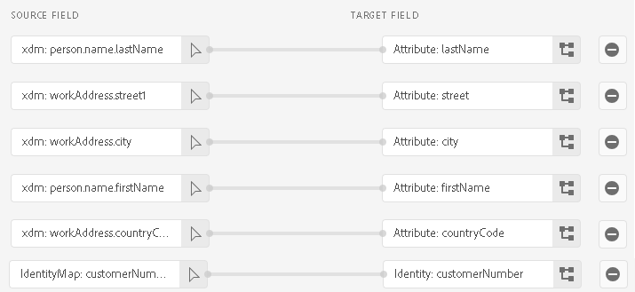

>[!TAB 法人顧客]

| ソースフィールド | ターゲットフィールド | 必須 |
| --- | --- | --- |
| `xdm: workAddress.street1` | `Attribute: street` | × |
| `xdm: workAddress.city` | `Attribute: city` | × |

{style="table-layout:auto"}

顧客が企業である場合の必須およびオプションの両方の属性マッピングの例を次に示します。
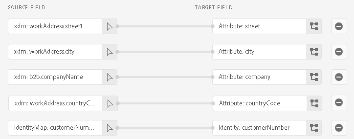

>[!ENDTABS]

宛先接続のマッピングの提供が完了したら、**[!UICONTROL Next]**&#x200B;を選択します。

### オーディエンスの書き出しのスケジュールと例 {#schedule-segment-export-example}

[ オーディエンスの書き出しをスケジュール ](/help/destinations/ui/activate-segment-streaming-destinations.md#scheduling)する手順を実行する場合、[の](#prerequisites-attribute)属性[!DNL SAP Subscription Billing]にExperience Platform オーディエンスを手動でマッピングする必要があります。

[!DNL SAP Commerce] **[!UICONTROL Mapping ID]**の場所が強調表示されたオーディエンス書き出しスケジュール手順の例を次に示します。
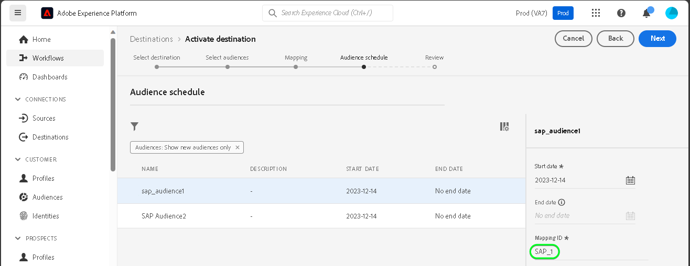

これを行うには、各セグメントを選択し、[!DNL SAP Subscription Billing] [!DNL SAP Commerce]宛先コネクタフィールドに&#x200B;**[!UICONTROL Mapping ID]**&#x200B;からのカスタム参照の名前を入力します。 カスタム参照の作成に関するガイダンスについては、[の「 [!DNL SAP Subscription Billing]](#prerequisites-custom-reference) カスタム参照の作成」セクションを参照してください。

>[!IMPORTANT]
>
> 値としてカスタム参照ラベルを使用しないでください。
>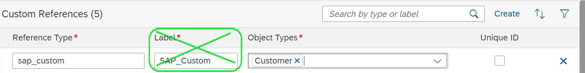

例えば、選択したExperience Platform オーディエンスが`sap_audience1`で、そのステータスを[!DNL SAP Subscription Billing] カスタム参照`SAP_1`に更新する場合は、[!DNL SAP_Commerce] **[!UICONTROL Mapping ID]** フィールドにこの値を指定します。

**[!UICONTROL Reference Type]**&#x200B;の[!DNL SAP Subscription Billing]の例を次に示します。


オーディエンスを選択し、対応する[!DNL SAP Commerce] **[!UICONTROL Mapping ID]**を強調表示したオーディエンスの書き出しスケジュール手順の例を次に示します。
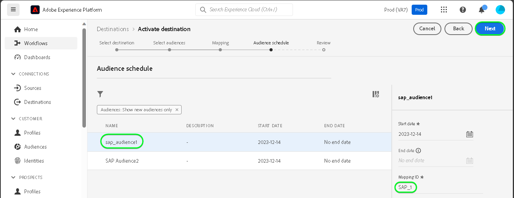

**[!UICONTROL Mapping ID]** フィールド内の値は、[!DNL SAP Subscription Billing] **[!UICONTROL Reference Type]**&#x200B;値と完全に一致する必要があります。

アクティブ化されたExperience Platform オーディエンスごとに、このセクションを繰り返します。

2つのオーディエンスを選択した上記の画像に基づいて、マッピングは次のようになります。

| [!DNL SAP Commerce] オーディエンス名 | [!DNL SAP Subscription Billing] **[!UICONTROL Reference Type]** | [!DNL SAP Commerce] **[!UICONTROL Mapping ID]**&#x200B;値 |
| --- | --- | --- |
| sap_audience1 | `SAP_1` | `SAP_1` |
| SAP Audience2 | `SAP_2` | `SAP_2` |

## データの書き出しを検証する {#exported-data}

宛先が正しく設定されていることを検証するには、次の手順に従います。

[!DNL SAP Subscription Billing] アカウントにログインし、**[!UICONTROL Contacts]** ページに移動して、オーディエンスのステータスを確認します。 リストは、カスタム参照の列を表示したり、対応するオーディエンスのステータスを表示したりするように設定できます。
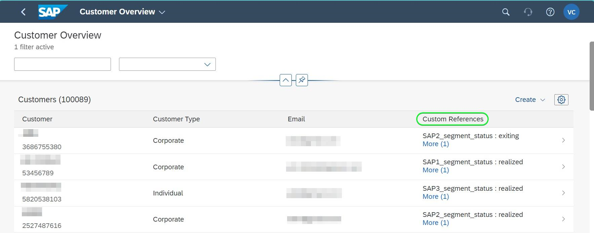

## データの使用とガバナンス {#data-usage-governance}

[!DNL Adobe Experience Platform] のすべての宛先は、データを処理する際のデータ使用ポリシーに準拠しています。[!DNL Adobe Experience Platform] がどのようにデータガバナンスを実施するかについて詳しくは、[データガバナンスの概要](/help/data-governance/home.md)を参照してください。

## エラーとトラブルシューティング {#errors-and-troubleshooting}

考えられるエラータイプとその応答コードのリストについては、[[!DNL SAP Subscription Billing]  エラータイプ ](https://help.sap.com/docs/CLOUD_TO_CASH_OD/987aec876092428f88162e438acf80d6/1a6a0dd6129c48e8b235190a1b5409fa.html)のドキュメントページを参照してください。

## その他のリソース {#additional-resources}

[!DNL SAP] ドキュメントのその他の有用な情報は次のとおりです。

* [ オンボード SAP サブスクリプションの請求](https://help.sap.com/docs/CLOUD_TO_CASH_OD/1216e7b79c984675b0a6f0005e351c74/e4b8badf7d124026991e4ab6b57d2a33.html)

### 変更ログ {#changelog}

この節では、この宛先コネクタに対する機能の概要と重要なドキュメントの更新について説明します。

+++ 変更ログを表示

| リリース月 | 更新タイプ | 説明 |
|---|---|---|
| 2024年1月 | 初回リリース | 最初の宛先リリースとドキュメントの公開。 |

{style="table-layout:auto"}

+++
